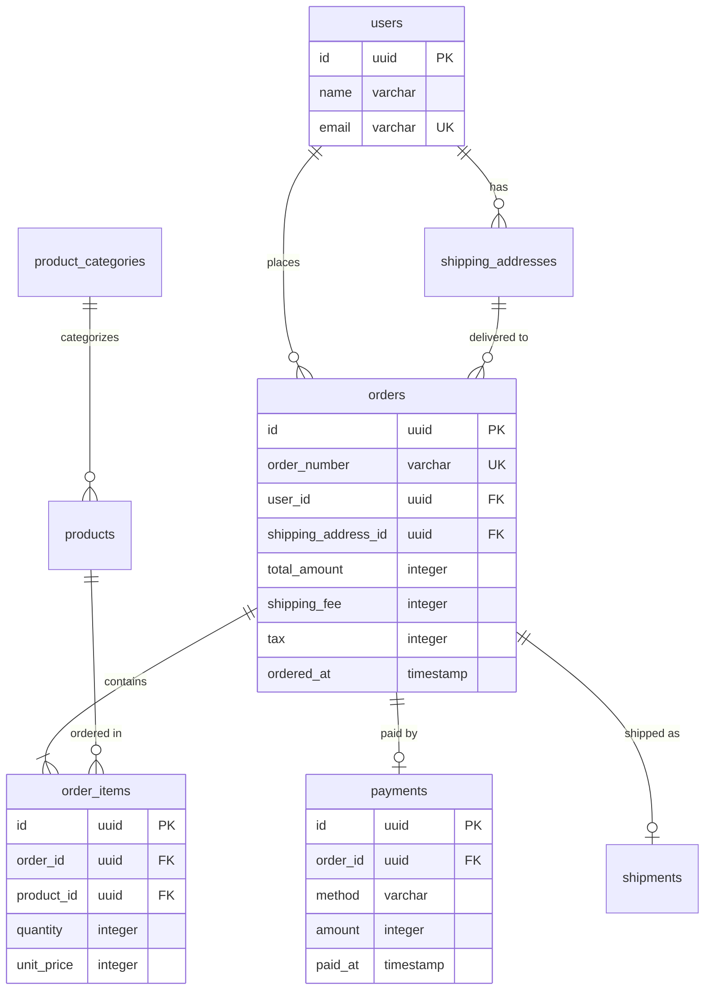

# フェーズ2: 正規化

- **ゴール**: エンティティを表に直し、1つの事実を1つの場所にだけ置く（One Fact in One Place）。同じ実体の別名を統合し、導出項目を持つか外すかを決める
- **インプット**: フェーズ1のエンティティの一覧
- **アウトプット**: 正規化した表の一覧と Mermaid の ERD

種別・区分による表の分割（サブセット）はフェーズ3で扱う。

## 手順

### ステップ1: エンティティを表に直す

ここからエンティティ・属性の語を、表・列の語に切り替える。

1. 表の名前と列の名前を、既存のスキーマの命名に合わせて付ける（既存が無ければ英語の snake_case、表は複数形）
2. 列の型を、プロジェクトの DB の型で付ける（例: SQLite なら TEXT・INTEGER・REAL）
3. どの表にもサロゲートキー（`id`）を主キーとして置く。`email`、`product_code`、`order_number` のような業務コードは、業務の都合で変わり、主キーにすると参照が壊れるので、属性として持ち、要れば UNIQUE 制約を付ける
4. 参照の属性を外部キー（`xxx_id`）にする
5. Mermaid の ERD に書く

### ステップ2: ヘッダとディテールに分ける

1回の行動に複数の明細があり、明細の全体をまとめて扱う事実（合計の計算、一括の値引き、送料の加算など）があれば、ヘッダとディテールの2つの表に分ける。

| 場合 | 判断 | 理由 |
|---|---|---|
| EC の注文（複数の商品、合計に送料） | 分ける | 注文の全体に送料と税の計算がある |
| SNS の投稿（複数の画像） | 分けない | 画像をまとめて扱う計算がない |
| 請求（複数の明細に総額の値引き） | 分ける | 総額に対する値引きという事実がある |

### ステップ3: 繰り返しを切り出す

1つの行に同じ種類のデータが並んでいたら（`tag1, tag2, tag3`、`product1_id, product2_id`）、別の表に切り出す。1つの列に複数の値（カンマ区切り、JSON の配列）を詰めたものも同じ。

### ステップ4: 値の重複を切り出す

複数の行に同じ値が出る属性（投稿の `author_name`、注文明細の `product_name`）は、独立した表に切り出して参照する。

ただし、名前が同じでも別の事実なら、それぞれに持つ。問いは「この値が変わったとき、関係するデータも一緒に変わるべきか」。変わるべきなら参照（外部キー）、独立した事実なら別に持つ。

| 一見の重複 | 判断 | 理由 |
|---|---|---|
| 商品の `price` と注文明細の `unit_price` | 別の事実 | 注文のあとに商品の価格が変わっても、注文したときの価格は変わらない |
| ユーザーの `name` と投稿の `author_name` | 要件次第 | 改名したら投稿の表示名も変わるべきなら重複なので、`user_id` で参照する |
| 配送先の `address` と注文の `shipping_address` | 要件次第 | 注文したときの住所を残したいなら、注文に写すのは正しい（スナップショット） |

### ステップ5: 同じ実体を統合する

問いは「同じ実体（人、モノ、場所）を指すか」「片方を変えたら、もう片方も変わるべきか」。

- 「投稿者」と「コメントした人」→ 統合してユーザー（同じユーザーの別の行為）
- 「注文者」と「配送先の人」→ 統合しない（受け取る人が注文者と違うことがある）

### ステップ6: 導出項目を整理する

他の属性から計算や集計で出せる属性（導出項目）を洗い出し、元のデータから常に正確に出し直せるか（可逆性）で決める。

- **出し直せるなら外す**: 年齢（生年月日と今日）、小計（`unit_price × quantity`）、いいね数（`likes` の COUNT）
- **出し直せないなら持つ**（値引き、丸め、外部の要因が入るもの）: 値引きのあとの金額、クーポンを当てたあとの合計、注文したときの単価（スナップショット）、ルールが変わりうるポイントの付与額

外した項目の出し方を決める。

- **ビュー**: SQL で定義して、表のように読みたいとき（`unit_price * quantity AS subtotal`）
- **アプリで計算**: 表示のときだけ要るとき（生年月日から年齢）
- **キャッシュの列**: 速さが問題になったときの妥協で、初めは入れない。入れるなら、正式な値の出どころ（例: `likes` の COUNT）を設計判断に書く

ルールそのものが複雑で変わりうる計算（何段もの料金、ポイント）は、パラメータの表とビューで表しきろうとせず、プログラムで書く。

## 例: EC の受注の正規化のあと

型は PostgreSQL で書いた例。プロジェクトの DB の型で書く。

- ステップ2: 注文に送料と税の計算がある → `orders` と `order_items` に分ける
- ステップ4: `order_items.unit_price` は商品の今の価格とは別の事実なので持つ
- ステップ6: `subtotal` は外してビューで出す。`total_amount`・`shipping_fee`・`tax` は値引き・配送先・税率の変更で出し直せないので持つ

（`products`・`product_categories`・`shipping_addresses`・`shipments` の列は略した）

## セルフレビュー

- [ ] 表と列の名前が、既存のスキーマの命名に合っているか
- [ ] 列の型が、プロジェクトの DB の型になっているか
- [ ] どの表にもサロゲートキーの主キーがあり、業務コードは属性（と UNIQUE 制約）になっているか
- [ ] 参照の属性が外部キーになっているか
- [ ] 1つの行動に複数の明細があるところで、ヘッダとディテールを検討したか
- [ ] 1つの列に複数の値を詰めていないか
- [ ] 複数の行に繰り返し出る値を、独立した表に切り出したか
- [ ] 名前が同じで別の事実のもの（今の価格と注文したときの価格）を区別したか
- [ ] 切り出す中で浮かび上がったリソース系（中間の表を含む）を一覧に足したか
- [ ] 同じ実体の別名を統合したか
- [ ] すべての属性について、導出できるかと、出し直せるかを判断したか
- [ ] スナップショット（注文したときの単価など）を、導出項目と取り違えて外していないか
- [ ] 外した導出項目の出し方（ビュー、アプリ、キャッシュ）を決め、キャッシュには正式な値の出どころを書いたか
