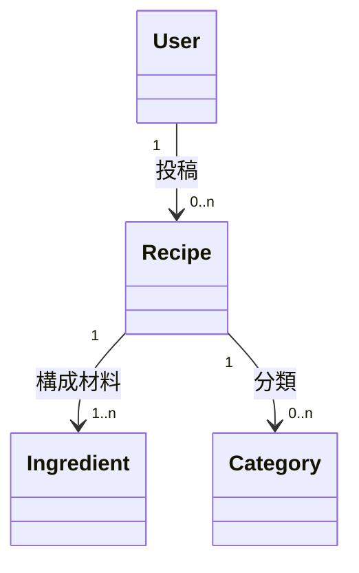

# 視覚化（show_widget）

[SKILL.md](SKILL.md) の③⑤⑥で、モデルをインライン描画して即確認するための道具立て。テキストだけでは構造が「ピンと来ない」問題を、構造が固まった段階から絵で補う。⑦の Claude Design 往復は [design-sync.md](design-sync.md)。

道具は **show_widget**（visualize MCP）。最初の描画前に `mcp__visualize__read_me`（`modules: ["diagram"]` または `["mockup"]`）を一度読む。**忠実度はモードのパラメータではなく、渡す HTML/SVG の作り込み度で表す**（粗い＝枠だけ／中＝ペイン分割や情報階層まで／着色は工程に応じて最小化）。

各モデルの忠実度は工程に合わせて段階的に上げる（粗いワイヤー → 中忠実度レイアウト → ⑦で作り込み）。

---

## 概念モデル図（③ コンテンツ構造）

本書の記法は3要素だけ: **オブジェクト名＋関連矢印＋属性名＋多重度**（多重度の4パターンと表示対応は block-2 の対応表が唯一の定義）。

- **show_widget `diagram`（推奨）**: 上記3要素に忠実な SVG をその場で描く。ノード＝オブジェクト名、エッジ＝矢印＋属性名ラベル＋両端の多重度。
- **Mermaid（任意・永続向き）**: `03-concept-model.md` にテキストで残すなら `classDiagram` を流用できる。ただしクラス ID に日本語を使うと崩れることがあるため、英字エイリアス＋表示名で書けるか確認してから使う。

多重度は必ず両端に付ける（4パターンと⑤での表示対応は block-2 が定義）。

## フレーム構造（③ 枠組みワイヤー）

- **show_widget `mockup`（低忠実度）**。箱・ペイン構造・グローバルナビ枠だけ。**着色・具体コンテンツ・タイポは描かない**。
- 1単位ビューにつき1枚。概念オブジェクトのコンテンツ要素と、②CRUD に対応するアクション置き場（ボタンの枠線程度）を示す。
- ソースは `03-frames/<単位ビュー名>.html` に保存。

## ナビゲーション構造図（⑤）

- **show_widget `diagram`**。枝葉（入口）→根（目標地点）に収束する**ツリー**。
- 箱＝ビュー/ペイン（概要一覧・詳細など情報のまとまり）。線＝情報→情報の**ナビ経路**（ボタン遷移ではない）。一覧→詳細の縦移動、兄弟間の横移動。
- top-down 図と bottom-up 図を**別々に描いて重ねる**。差異の解消過程も `05-navigation.md` に残す。

## レイアウト設計図（⑥）

- **show_widget `mockup`（中忠実度）**。ペイン分割・情報階層は正確に。**色/タイポの完成形にはしない**（着色は最小）。
- デスクトップは3ペイン等、モバイルはレイアウト3段活用＋シート。プラットフォームのイディオムに沿った枠で描く。
- ここはまだ DesignSync 往復ではない（[design-sync.md](design-sync.md) は⑦から）。
