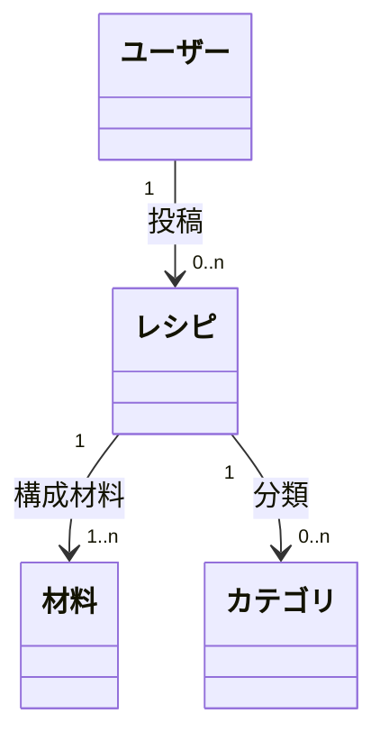

# 視覚化

[SKILL.md](SKILL.md) の③⑤⑥で、モデルを絵にして即確認するための道具立て。テキストだけでは構造が「ピンと来ない」問題を、構造が固まった段階から絵で補う。⑦の Claude Design 往復は [design-sync.md](design-sync.md)。

## 道具（環境で選ぶ）

どの環境でも、**ソースは保存先にファイルで残す**（図は `.md` 内の Mermaid か SVG、ワイヤーは `.html`）。表示は環境にある道具で行う:

- **インライン描画や Artifact の道具がある** — それで表示する（claude.ai の show_widget、Claude Code on the web の Artifact など）。
- **無い** — 保存したファイルのパスを示し、ユーザーにブラウザ／Markdown プレビューで開いてもらう。

**忠実度は渡す HTML/SVG の作り込み度で表す**（粗い＝枠だけ／中＝ペイン分割や情報階層まで）。工程に合わせて段階的に上げる: ③粗いワイヤー → ⑥中忠実度レイアウト → ⑦作り込み。着色は⑦まで最小に留める。

---

## 概念モデル図（③ コンテンツ構造）

記法は3要素だけ: **オブジェクト名＋関連矢印（属性名ラベル付き）＋両端の多重度**。多重度の4パターンと表示対応は block-2 の対応表が唯一の定義。

永続化は `03-concept-model.md` に Mermaid `classDiagram` で書く。クラス ID に日本語を使うと崩れることがあるので、英字 ID ＋ 表示名（`class Recipe["レシピ"]`）で書き、描画を確かめる。

## フレーム構造（③ 枠組みワイヤー）

- 低忠実度。箱・ペイン構造・グローバルナビ枠だけで描き、着色・具体コンテンツ・タイポは⑦に回す。
- 1単位ビューにつき1枚。概念オブジェクトのコンテンツ要素と、②CRUD に対応するアクション置き場（ボタンの枠線程度）を示す。
- ソースは `03-frames/<単位ビュー名>.html`。

## ナビゲーション構造図（⑤）

- 枝葉（入口）→根（目標地点）に収束する**ツリー**。Mermaid `flowchart` で `05-navigation.md` に書ける。
- 箱＝ビュー/ペイン（概要一覧・詳細など情報のまとまり）。線＝情報→情報の**ナビ経路**（ボタン遷移ではない）。一覧→詳細の縦移動、兄弟間の横移動。
- top-down 図と bottom-up 図を**別々に描いて重ねる**。差異の解消過程も `05-navigation.md` に残す。

## レイアウト設計図（⑥）

- 中忠実度。ペイン分割・情報階層は正確に描き、色/タイポの完成形は⑦に回す。
- デスクトップは3ペイン等、モバイルはレイアウト3段活用＋シート。プラットフォームのイディオムに沿った枠で描く。
- ソースは `06-layout.md` から参照する HTML として保存する。
