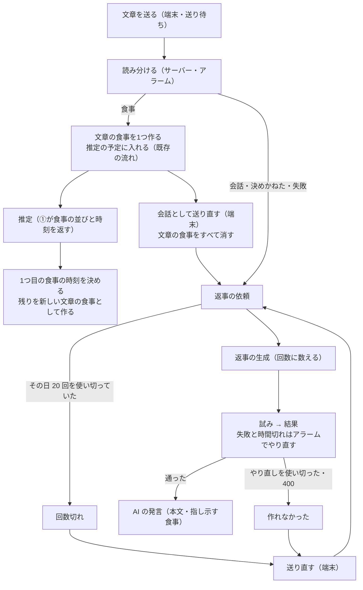
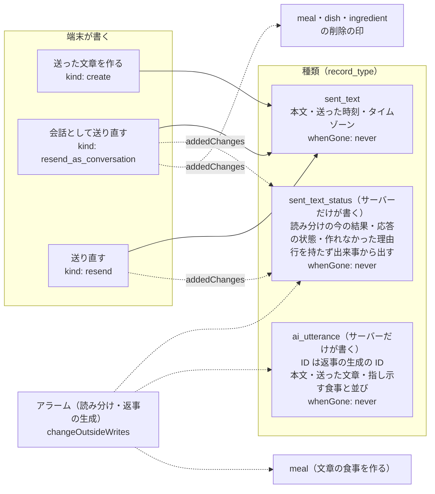
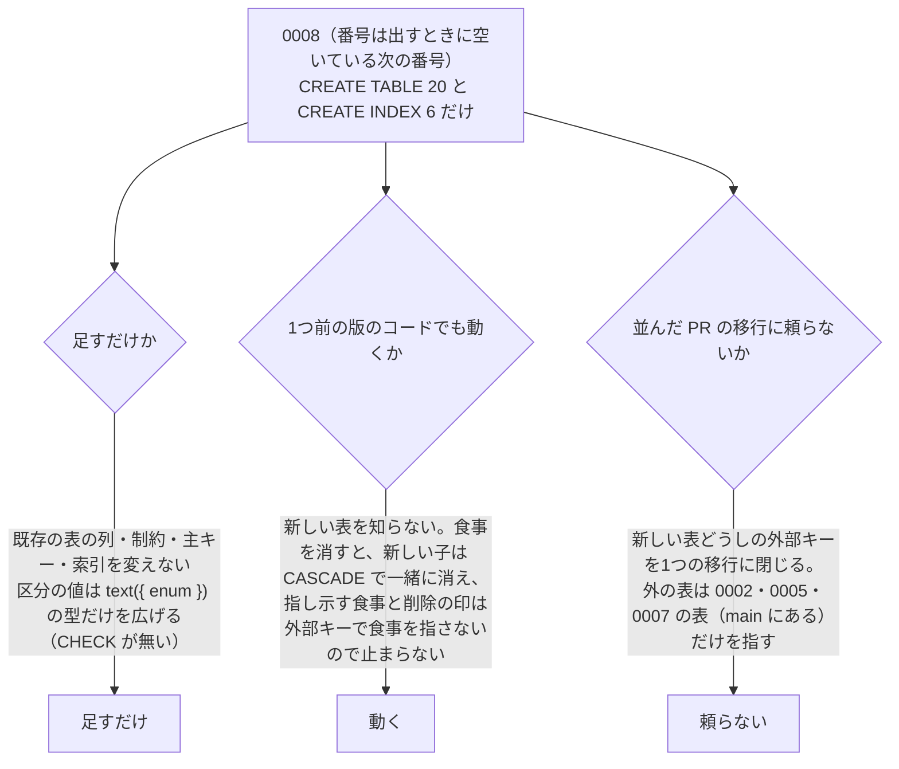

# ERD の設計: 仕様「文章と会話」

## ステータス

- 状態: 5/5（ユーザーの承認待ち）。フェーズ1〜4 の ⚠️ 要確認 1〜8 は確定。フェーズ5 に新しい ⚠️ 要確認は無い。フェーズ3 への差し戻し 1（食事の値に送った文章の ID を載せる）を暫定の案つきで返す
- 今のフェーズ: 5/5（ユーザーが承認。確定）
- 最後に更新した日: 2026-10-10

## 要件サマリー

- 範囲: 差分（送った文章、読み分け、文章の食事、AI の発言、指し示す食事、作れなかった理由、1日 20 回の回数）。範囲の外の既存の表は動かさない。既存の表を変えるなら、足すだけの移行で書けるかをフェーズ5で確かめる（server/AGENTS.md 101〜103行）
- 要件の出どころ
  - このセッションで決めたこと: `.scratch/text-chat/decisions.md`（1〜13、11b）。とくに 2（作れなかった理由3つ）、3（1〜500 字）、6（1日 20 回）、11b（会話の区切りを持たない。AI に渡す文脈は直近 20 発言・72 時間の窓で、あいだの記録を「12:40 食事を記録」の印で挟む）、12（受け付けなかった1行3種類: 文章を送る・会話として送り直す・送り直す）
  - #412 の解決コメント（scratchpad の写し）: 4 文章の食事は吹き出しの下にカード、「会話として送り直す」で確かめずに食事を消し、吹き出しの下に発言。時刻が違う食事はその時刻の位置に出る。8 直してほしいへの発言の下に小さな食事の行、消えていたら「削除した食事」。9 作れなかった・回数切れは吹き出しの右下に1行と「送り直す」。6 AI の1行は入力欄の下に固定（ADR-0018 の「会話の最初」の判定は不要になった）
  - 概念モデル `docs/ui-design/0001-first-release/03-concept-model.md`（17、20〜21、58〜69、84〜85行）: 食事の記録方法に文章、文章（食事_4）。会話（始めた日時・プリセットから始めたか）と発言（話し手・本文・日時）。11b で会話の区切りと始めた時刻は消え、プリセットは端末の PostHog の出来事（`preset_tapped`、`text_sent`）で見る
  - ユースケース `01-use-cases.md`: 食事_4、フィードバック_1、フィードバック_2
  - GLOSSARY.md 242〜262行: 会話（11b で「やりとり全体」に直す）、発言、送った文章、読み分け、プリセット
  - ADR-0008（会話と発言の正本はサーバー）、ADR-0013（UUID、冪等、削除の印、サーバーが書いたものも変更の通し番号で届く）、ADR-0014（発言にも記録したときのタイムゾーン）
  - #28: 文章の食事の時刻は LLM が決め、送った時刻より後・7日より前なら送った時刻にする（decisions 1）
- プロジェクトの決まり
  - 記録の DB はアカウントごとに1つの Durable Object の SQLite（ADR-0012）。記録の表にアカウントの列を持たない（docs/agents/table-design.md 21行）
  - 素の SQLite。宣言は Drizzle（`src/<種類>/durable-object/*-tables.ts`、帳簿と種類をまたぐ表は `src/durable-object/`）、移行は手書き SQL（`durable-object-migrations/NNNN_*.sql`）。足すだけ、1つ前の版のコードでも動く形（server/AGENTS.md 94〜103行、ADR-0021）
  - enum 型と CHECK は使わず `text({ enum })` の型で受ける。センチネル値を使わない。NULL を許す列はサブセットの表・中間の表・イベントの表に分ける。時刻の列は事実の名前（`<事実>_at`、INTEGER の ms）、日は `_on`（TEXT 'YYYY-MM-DD'）、タイムゾーンは IANA 名の TEXT。一律の created_at/updated_at は付けない（table-design-rules.md）
  - `meals`・`dishes`・`ingredients` に自分の削除の印を持たない子を足すときは ON DELETE CASCADE（例に「文章の食事のサブセット」）。控えだけを指す修正の行は外部キーで記録を指さない（server/AGENTS.md 104〜105行）
  - 索引は同期・アラーム・推定の開始のたびに走る引き方で、行が増え続ける表に置く（106行）
  - アラームは一度に1つ。予定を DB に持ち、いちばん早い予定に合わせる（107〜110行）
  - 全員をまたぐ SQL は書けない。分析は PostHog（111行）
  - ID は TEXT の UUID（端末が作るものは v4、サーバーが作るものは v4、名前から決まるものは v5。ADR-0013）
  - 記録は物理的に DELETE し、削除の印の表（`sync_write_receipt_id` を持つ）を残す。修正は控えを主キーにした行で持ち、元の行を書き換えない
  - 同期（docs/agents/sync.md、server/AGENTS.md 51〜65行）: 種類を足すときは帳簿の `recordTypes` の enum、登録簿4か所、端末の `RecordKindName` などに足す。書き込みの外（アラームなど）で変えるときは `changeOutsideWrites`。種類をまたいで届く順は約束せず、端末は親の ID を値で持つ。食事を消す書き込みは `rejected` を返さない（sync.md 35行）
- 既存の表（範囲に関わるもの）
  - 同期の帳簿（`src/durable-object/sync-ledger-tables.ts`、移行 0002）: `record_changes`、`sync_request_logs(time_zone ほか)`、`sync_write_receipts(kind: create/update/source_deleted/delete/respond, record_type, record_id, result)`、`sync_write_rejections(reason: out_of_range ほか12個)`、`sync_write_record_changes`
  - 食事（`src/meal/durable-object/meal-tables.ts`、0005/0007）: `meals(id, eaten_at, eaten_at_utc_offset_seconds, sent_at, sent_time_zone, entry_method: captured/picked)`、`meal_eaten_at_corrections`、`meal_deletions(sync_write_receipt_id)`、`meal_photos` ほか
  - 料理・材料（`src/dish/durable-object/dish-tables.ts`、0007）: `dishes(id, meal_id, name, position_in_meal)`、`dish_deletions` ほか、`ingredients` ほか
  - 推定の出来事（`src/estimation/durable-object/estimation-tables.ts`、0005。INSERT だけ）: `estimation_schedules(id, due_at, counted_on)`、`meal_estimation_schedules(estimation_schedule_id, meal_id CASCADE)`、`estimation_deferrals(deferred_at)`、`estimations(estimation_schedule_id, started_at)`、`estimation_attempts(estimation_id, attempted_at)`、`estimation_attempt_results(ended_at, result: succeeded/provider_error/timed_out/bad_request/invalid_response)`、`estimation_attempt_errors(error_type)`、`estimation_completions(completed_at, result)`、`estimation_abandonments(abandoned_at)`、`estimation_schedule_cancellations`
  - 推定の回数（1日 30 回）: 日ごとの回数の行を持たず、`estimations` を `estimation_schedules.counted_on` で数える。上限なら `estimation_deferrals`。食事を消しても推定の行は残り回数は戻らない（server/AGENTS.md 72行）
  - 推定の状態（`meal_estimation_status`）は行を持たず、推定の出来事から出す
  - 知らせ（`src/notice/durable-object/notice-tables.ts`）: `notices(id, notice_type, issued_at, time_zone)` と種類ごとのサブセット `missed_record_notices`。サブセットの表の例
- 補足（ユーザーから）
  - 会話の表は作らない。会話 ID、会話を始めた時刻を持たない（decisions 11b）
  - 表に残すもの: 送った文章、AI の発言、AI の発言が指し示す食事、作れなかった理由（やり直しを使い切った・400・回数切れ）
  - 回数は 1日 20 回。日ごとの回数の行を持たずに数えられるかを見る
  - 提供元の応答の本文（AI の発言の本文を除く）とエラーの本文は表に残さない（本文は Sentry）。エラーの種類（`overloaded_error` などの名前）は推定と同じく残す（フェーズ1の議論ログ、⚠️ 要確認 2）

## 外部サービス依存

| 領域 | サービス | ERD への影響 |
| --- | --- | --- |
| 認証 | Better Auth（D1） | 記録の表はアカウントを指さない（ADR-0012） |
| 決済 | なし | なし |
| ファイルの置き場 | R2 | 文章の食事は写真を持たない。既存の `meal_photos` のまま |
| 通知 | なし（プッシュは使わない。ADR-0013） | なし |
| 生成（読み分け） | Workers AI の Jev（AI Gateway を通す）か Claude Haiku 5.5。実装で比べて決める | モデルによらない表にする。応答の本文は残さない |
| 生成（AI の発言・文章の食事の推定） | Anthropic の Claude Sonnet 5.5。SSE で流し、記録は同期で届ける | AI の発言の本文は残す。400 は状態コードで見分け、理由として残す |

## フェーズ1: エンティティの抽出

### このフェーズで使う語（`GLOSSARY.md` に無いもの）

- **返事**: AI の発言のうち、送った文章に応えるもの。画面の文言（「返事を作れませんでした」）に合わせた呼び名で、初回リリースでは AI の発言はすべて返事
- **返事の依頼**: ある送った文章に返事を作ることになった事実。きっかけは、会話と読み分けた、会話として送り直した、送り直した、の3つ（推定の予定に当たる）
- **返事の生成**: 依頼から、提供元を呼んで返事を作り始めた事実。1日 20 回の回数はこれを数える（推定の `estimations` に当たる）
- **回数切れ**: 依頼を、その日の返事の回数を使い切っていたので、提供元を呼ぶ前に止めた事実（推定の見送りに当たるが、翌日に回さない）
- **作れなかった**: 生成を、やり直しを使い切ったか 400 で諦めた事実（推定の断念に当たる）
- **送り直し**: 作れなかった・回数切れの送った文章で「送り直す」を押した書き込み（#29 の「作り直す書き込み」）
- **会話として送り直し**: 食事と読み分けた送った文章で「会話として送り直す」を押した書き込み
- **文章の食事**: 食事と読み分けた送った文章から作った食事
- **指し示す食事**: AI の発言が、押して開けるように添える食事（#29 追記「記録を直してほしいと書かれたとき」）

### ユーザーとシステムの行動



### エンティティの一覧

範囲は差分。既存のエンティティは、新しいエンティティが指す・使う・変えるものだけを載せる。

| エンティティ | 種別 | 主な属性 | 根拠 |
| --- | --- | --- | --- |
| 送った文章 | イベント（端末が作る記録。送り待ちから create で届く） | ID（端末が v4）、本文（前後の空白を除いて 1〜500 字）、送った時刻（送る操作をした時刻。届いた時刻ではない）、送ったときのタイムゾーン（IANA 名） | #29 追記「送った文章」、#26 追記 271・279 行、decisions 3、ADR-0014 |
| 読み分け | イベント（サーバーが書く） | 送った文章、読み分けた時刻、結果（食事・会話） | #29 追記「読み分け」、#26 追記 278 行（読み分けの結果をサーバーが書いて同期で届ける） |
| 会話として送り直し | イベント（端末の書き込み。控えで受ける） | 送った文章、書き込みの控え、受けた時刻 | #29 追記「会話として送り直す」、resolve 4、decisions 12 |
| 文章の食事 | 既存の「食事」のサブセット | 食事、送った文章 | #29 追記「送った文章」、server/AGENTS.md 104 行（「文章の食事のサブセット」）、#188 1058 行 |
| 推定が作った文章の食事 | イベント（推定が書く） | 推定、作った食事 | #29 追記「①が時刻の違う食事を返したら…残りを新しい食事として作る」、#28 追記（時刻の違う食事は別の食事） |
| 推定した文章の食事の時刻 | イベント（推定が書く） | 推定、食事、推定した食べた時刻（#28 の範囲に収めたあとの値） | #29 追記「この食事を1つ目に直し」、decisions 1、#28 追記 |
| 返事の依頼 | イベント（サーバーが書く） | 送った文章、依頼した時刻、数える日、きっかけ（読み分け・会話として送り直し・送り直し） | #29 追記「応答待ちに戻す」「回数」 |
| 送り直し | イベント（端末の書き込み。控えで受ける） | 送った文章、書き込みの控え、受けた時刻 | #29 追記「AI の発言を作る」、resolve 9、decisions 2・12 |
| 回数切れ | イベント（サーバーが書く） | 返事の依頼、止めた時刻 | decisions 2・6、#48 追記、#29 追記「回数」 |
| 返事の生成 | イベント（サーバーが書く） | 返事の依頼、始めた時刻 | #29 追記「回数」（AI の発言を1つ作るたびに1回）、#48 追記 101 行（推定を待つ予定と同じ DB で数える） |
| 返事の生成の試み | イベント（サーバーが書く） | 返事の生成、試みた時刻 | #29 追記「提供元のエラーと時間切れは…アラームのやり直しでやり直す」 |
| 返事の生成の試みの結果 | イベント（サーバーが書く） | 試み、終えた時刻、結果（通った・提供元のエラー・時間切れ・400） | 同上、decisions 2（400 は状態コードで見分ける） |
| 返事の生成の試みのエラーの種類 | イベントのサブセット（試みの結果が提供元のエラー・400 のときだけ） | 試みの結果、提供元が返したエラーの種類（`overloaded_error` などの名前。メッセージは持たない） | 推定の `estimation_attempt_errors`、⚠️ 要確認 2（確定: 案 B） |
| AI の発言 | イベント（サーバーが書く記録。同期で届く） | ID（サーバーが v4）、返事の生成、本文、作り終えた時刻、時刻とタイムゾーン（応える送った文章と同じ） | #29 追記「保存するもの」、ADR-0008、ADR-0013、ADR-0014 |
| 指し示す食事 | 中間（AI の発言 × 食事） | AI の発言、食事の ID、並び（縦に並べる順） | #29 追記「記録を直してほしいと書かれたとき」、resolve 8 |
| 作れなかった | イベント（サーバーが書く） | 返事の生成、諦めた時刻、理由（やり直しを使い切った・400） | decisions 2、resolve 9、#29 追記「AI の発言を作る」 |
| 食事（既存 `meals`） | 既存。変える | 記録方法（`entry_method`）に「文章」を足す。送った時刻・タイムゾーンは文章の食事では送った文章のもの | 概念モデル 17 行、#29 追記 |
| 食事の削除の印（既存 `meal_deletions`） | 既存。使う（形が合わない。パーキングロット 5） | 書き込みの控え（主キー。食事は控えの `record_id`） | 会話として送り直しが1つの控えで複数の食事を消す |
| 食事の時刻の修正（既存 `meal_eaten_at_corrections`） | 既存。読む | 控え、食べた時刻 | 推定した時刻とどちらを採るか（⚠️ 要確認 4） |
| 推定の予定・食事のつなぎ・推定（既存 `estimation_schedules`・`meal_estimation_schedules`・`estimations` ほか） | 既存。使う | 文章の食事の最初の1つを、写真の食事と同じく予定に入れる。推定が作った食事と推定した時刻が `estimations` を指す | #29 追記、#188 814 行（対象ごとのつなぎを足して同じ `estimations` で数える） |
| 料理・材料（既存 `dishes`・`ingredients` と削除の印） | 既存。変える（消す） | 会話として送り直しで、文章の食事とともに消す | #29 追記「会話として送り直す」 |
| 同期の帳簿（既存 `sync_write_receipts`・`sync_write_rejections`・`record_changes`・`sync_request_logs`） | 既存。使う・足す | 送った文章・AI の発言の種類（`record_type`）、会話として送り直し・送り直しの控え、ユーザーの最新のタイムゾーン（数える日に使う） | docs/agents/sync.md、server/AGENTS.md 51〜65 行 |

#### 調べた論点の答え（研究メモ）

- **送った文章は端末が作る記録か**: そう。#29 追記「端末が作る記録（本文、送る操作をした時刻とタイムゾーン）」、#26 追記 279 行「送った文章は、端末で送る操作をした時刻にする」。送り待ちから create の書き込みで届き、範囲外（1〜500 字の外）は既存の `out_of_range` で断る（decisions 3）
- **文章から作った食事は送った文章を指すか**: そう。#29 追記「食事なら、そこから作った食事（1つ以上）を指す」、server/AGENTS.md 104 行が「文章の食事のサブセット」を食事の子として名指ししている。向き（文章 → 食事か、食事 → 文章か）はフェーズ4
- **読み分けの結果を事実として残すか**: 残す。#26 追記 278 行で「送った文章の読み分けの結果（作った食事か、入った会話）」をサーバーが書いて同期で届けるものに挙げている。会話と読み分けた文章には作った食事が無いので、結果を食事の有無から出せず、会話として送り直したあとも食事が消えて区別が無くなる。読み分けに至った経緯（確信が持てた・決めかねた・呼び出しの失敗）を残すかは ⚠️ 要確認 1
- **AI の発言は1つの送った文章にいくつできるか**: 0 か 1。「送り直す」は作れなかった・回数切れの送った文章にだけ出し（resolve 9、#29 追記「会話」）、作れなかった AI の発言は書かない（#29 解決 10）。会話として送り直すのは食事と読み分けた文章だけで、まだ返事が無い。成功した返事を作り直す操作は要件に無く、置き換わる場面は無い。返事の依頼・生成は1つの文章に何度でもできる（作れなかった → 送り直す → 通った）
- **試みとやり直しの形**: 推定の出来事（予定 → 見送り / 推定 → 試み → 結果 → 完了 / 断念）を手本に、依頼 → 回数切れ / 生成 → 試み → 結果 → AI の発言 / 作れなかった、にした。違いは、回数切れを翌日に回さないこと（送り直すまで止まる。decisions 2）と、400 をやり直さずすぐ作れなかったにすること（decisions 2。推定も同じ。#28 追記）
- **指し示す食事**: 多対多（1つの発言が複数の食事を指し、1つの食事が複数の発言から指されうる）。食事が消えても「削除した食事」と出す（resolve 8）ので、食事を消しても指し示しの行は残す。食事は物理的に消える（プロジェクトの決まり）ので、外部キーで食事を指せない見込み（フェーズ4、パーキングロット 10）
- **回数 20 回**: 推定の回数と同じく、日ごとの回数の行を持たず、返事の生成を返事の依頼の数える日で数える。回数切れは生成を作らない別の事実なので数えに入らず、「今日はもう返事を作れません」の送った文章を送り直したとき、日が変わっていれば通る（decisions 2）
- **会話として送り直すと、食事を消す書き込みの約束**: 会話として送り直しは、食事を消す書き込みの組ではなく、送った文章への1つの書き込みとして受け、その効果として文章の食事（料理と材料を含む）を消す。decisions 12 が「会話として送り直せませんでした」の1行と「食事のカードは残し」を決めており、この書き込みは断られうるうえ、断られたら食事が残る。食事を消す書き込み（sync.md 35 行の「rejected を返さない」）に分けると、食事だけが消えて読み分けが食事のまま残る場面ができる。約束は食事を消す書き込みのもので、送った文章の書き込みには掛からない
- **文章の食事の推定は既存の推定の流れに乗るか**: 乗る。#29 追記「写真の食事と同じく推定を待つ予定に入れる。推定の状態と回数切れは、この食事が持つ」、#28 追記「②から先は写真と同じ」、#188 1058 行「表はサブセットとつなぎを足す」。新しいのは、1つの推定が2つめ以降の食事を作ることと、1つ目の食事の時刻を推定が決めることの2つ。名前を直したときの推定し直し（名前だけを渡す）は、既存の料理が対象の予定で足りる見込み（パーキングロット 14）

#### 概念モデルから変えたもの

| 概念モデル | このフェーズ | 理由 |
| --- | --- | --- |
| 会話（始めた日時・プリセットから始めたか） | 外した | decisions 11b で会話の区切りと始めた時刻を消した。プリセットはサーバーに送らない（#29 解決 8）。PostHog の `preset_tapped`・`text_sent` で見る（decisions 13） |
| 発言（話し手・本文・日時） | 送った文章と AI の発言に分けた | ユーザーの発言は端末が作り（会話と読み分けた送った文章がそのままユーザーの発言になる。#29 追記）、AI の発言はサーバーが作る。作る側、届き方、持つもの（読み分け・指し示す食事）が違う |
| 食事の「文章」の属性 | 文章の食事（サブセット）にした | 文章は送った文章が持ち、1つの送った文章から複数の食事ができる（#28 追記） |
| — | 読み分け、会話として送り直し、返事の依頼・生成・試み・結果、回数切れ、作れなかった、送り直し、指し示す食事、推定が作った文章の食事、推定した文章の食事の時刻を足した | 概念モデルは初回の設計時点のもので、#29・#48・decisions で決めた振る舞いが出てくる |

#### 表に残さないもの

| 候補 | 扱い | 理由 | 将来の要件 | 後方互換 |
| --- | --- | --- | --- | --- |
| 会話（区切り、会話 ID、始めた時刻） | 持たない | ユーザーの補足と decisions 11b | 案2（日ごとの要約）や案3（検索の道具）を入れて、まとまりごとに要約・検索したくなったとき | 足せる。送った文章と AI の発言の時刻から区切りを後から計算して行を作れる（区切りの決め方を新しく決めれば） |
| プリセットの種類 | 持たない | サーバーにはふつうの送った文章として送る（#29 解決 8） | プリセットごとに指示を変えたくなったとき | 足せる。過去の文章の分は「分からない」になる |
| 渡した文脈、提供元の応答の本文（AI の発言の本文を除く）、エラーの本文（メッセージ。種類の名前は残す） | 持たない | ユーザーの補足、#29 追記「保存するもの」 | — | — |
| AI の発言の途中の文（見守る要求で流した分） | 持たない | 届け方の正本は作り終えた記録（#29 追記）。途中で閉じても同期で受け取る | — | — |
| 読み分けの経緯（確信・決めかねた・失敗） | 持たない（確定: ⚠️ 要確認 1 の案 A） | ⚠️ 要確認 1 | ⚠️ 要確認 1 | ⚠️ 要確認 1 |
| ① の「日時が文章に書かれていたか」 | 持たない（確定: ⚠️ 要確認 5 の案 A） | ⚠️ 要確認 5 | ⚠️ 要確認 5 | ⚠️ 要確認 5 |
| 使ったモデル、トークン数、費用 | 持たない（確定: ⚠️ 要確認 6 の案 A） | ⚠️ 要確認 6 | ⚠️ 要確認 6 | ⚠️ 要確認 6 |

### ⚠️ 要確認

#### ⚠️ 要確認 1: 読み分けに至った経緯を残すか

- **確定: 案 A**（2026-10-10、議論ログ）
- 今の形: 読み分けは「結果（食事・会話）」だけを持つ
- 場面: ある日から、食事のつもりの文章がみな会話の返事になる。AI Gateway の前払いのクレジットが尽き、Jev の呼び出しが失敗して会話にしている（decisions 7「尽きると全部会話になり食事が記録されない（気づきにくい）」）。あるいは Jev が決めかねている
- 案 A（仮に採る）: 結果だけ持つ。経緯は Sentry（呼び出しの失敗）と PostHog（読み分けの出来事。#33）で見る
  - 良い点: 表が小さい。観測の置き場を ADR-0017 の分け方のまま1つにできる
  - 悪い点: 1人の DB を見ても、その文章が「決めかねて会話」か「失敗して会話」か分からない。あとで決めかねた文章だけを読み分け直す、といった扱いができない
- 案 B: 読み分けに経緯（確信を持てた・決めかねた・呼び出しの失敗）を足す
  - 良い点: 失敗で会話にした文章を後から見分けられる。問い合わせを受けたときに、その人の DB で理由を言える
  - 悪い点: 列か表が1つ増える。使い道が今の要件に無い
- 将来の要件: 「読み分けに失敗した文章を、復旧後に読み分け直す」を入れるとき
- 後方互換: 足せる。足す前の読み分けは経緯が「分からない」になる（その区分を足すか、サブセットの表にすれば NULL を使わずに済む）

#### ⚠️ 要確認 2: 返事の生成の試みで、提供元のエラーの種類を残すか

- **確定: 案 B**（2026-10-10、議論ログ）
- 今の形: 推定は試みの結果に加えて、提供元が返したエラーの種類（`overloaded_error` などの文字列）を `estimation_attempt_errors` に持つ。返事は、結果（通った・提供元のエラー・時間切れ・400）だけを持つ
- 場面: 返事の「作れませんでした」が続く。過負荷か、レート制限か、要求の誤りか
- 案 A（仮に採る）: 種類を持たない。ユーザーの補足「エラーの中身は表に残さない（中身は Sentry）」に従う
  - 良い点: 補足のとおり。エラーの見方が Sentry の1か所になる
  - 悪い点: 推定と形がそろわず、推定の試みを書く口をそのまま流用できない。DB だけではやり直しの判断材料（過負荷なら待つ、など）を後から足せない
- 案 B: 推定と同じく種類を持つ（エラーの種類の名前だけで、メッセージは持たない）
  - 良い点: 推定と同じ形で、書く口と読む口を流用しやすい
  - 悪い点: 補足の「中身」をどこまでと読むかがあいまいになる
- 将来の要件: 種類ごとにやり直しの待ち方を変えたくなったとき
- 後方互換: 足せる（試みの結果の子の表を足すだけ。足す前の試みは種類が無い）

#### ⚠️ 要確認 3: 送った文章を消す操作を入れるか（作る ↔ 消すの対）

- **確定: 案 A**（2026-10-10、議論ログ）
- 今の形: 要件（ユースケース、#29、resolve、decisions）に、送った文章や AI の発言を消す操作は無い。文章の食事は、食事を消す・会話として送り直すで消える
- 場面: 体重の相談のつもりで、人に見せたくないことを書いて送ってしまった。タイムラインから消したい
- 案 A（仮に採る）: 入れない。送った文章と AI の発言は消えない（アカウントを消すと全部消える）
  - 良い点: 消したあとの返事の依頼の取り消し、窓（直近 20 発言）からの外し方、指し示す食事の扱いを決めずに済む
  - 悪い点: 間違えて送った文章を消せない。消したいという声が来たら仕様を足す
- 案 B: 送った文章を消せるようにし、削除の印を残す（AI の発言も一緒に消す）
  - 良い点: ほかの記録（食事・体重）と同じく、消せるという期待に沿う
  - 悪い点: 範囲が広がる（画面、同期の種類の削除、依頼の取り消し）。ユースケースに無い
- 将来の要件: TestFlight のフィードバックで「消したい」が来たとき
- 後方互換: 足せる（削除の印の表を足し、物理的に消す。消す前の行には影響しない）。ただし、そのとき端末の古い版は削除の印を知らないので、同期の種類の `whenGone` を `never` から `deletion_mark` に変える手順が要る

#### ⚠️ 要確認 4: 推定で決めた文章の食事の時刻と、ユーザーが先に直した時刻のどちらを採るか

- **確定: 案 A**（2026-10-10、議論ログ）
- 今の形: 読み分けで食事を作った時点では、時刻は送った時刻。① が返した時刻を、推定が終わったときに1つ目の食事に当てる。時刻を直す書き込みは推定を待っていても受け付ける（sync.md「時刻を直す書き込み…は、推定を待っていても受け付ける」）
- 場面: 「昼にうどん」と 15:00 に送った。回数切れで翌日に推定になった。そのあいだに、カードの時刻を自分で 12:30 に直した。翌日、① が 12:00 を返す
- 案 A（仮に採る）: ユーザーが直した時刻を採る（推定した時刻は、直していないときだけ効く）
  - 良い点: 自分で直した値が黙って変わらない（推定し直しで量を直してあれば固定する、#28 の考え方と同じ）
  - 悪い点: 時刻の決め方が「直した時刻 → 推定した時刻 → 送った時刻」の3段になる
- 案 B: あとに書いたほう（推定した時刻）を採る
  - 良い点: 単純
  - 悪い点: 直した時刻が翌日に勝手に戻る
- 将来の要件・後方互換: どちらでも表の形は同じ（推定した時刻を別のイベントで持つ）。読むときの決め方だけが変わる

#### ⚠️ 要確認 5: ① が返す「日時が文章に書かれていたか」を残すか

- **確定: 案 A**（2026-10-10、議論ログ）
- 今の形: #28 追記で、文章の ① は食事の並びの「それぞれの日時と、日時が文章に書かれていたか」を返す。使い道は書かれていない（範囲に収める判定は、書かれていたかによらず送った時刻との前後で行う）
- 場面: 「あてずっぽうの時刻」が多いか、文章に書いた時刻を読み違えているかを見分けたい
- 案 A（仮に採る）: 残さない。必要なら PostHog の推定の出来事に旗として送る（数・率・旗だけを送る決まりに収まる）
  - 良い点: 使い道の無い列を持たない
  - 悪い点: 1人の DB では、時刻があてずっぽうかを後から言えない（たとえば、あてずっぽうの時刻だけを薄く見せる、ができない）
- 案 B: 推定した文章の食事の時刻に、書かれていたかを足す
  - 良い点: 画面で「時刻は推定です」と見せる、といった将来の使い道に備えられる
  - 悪い点: 今は使わない
- 将来の要件: あてずっぽうの時刻を画面で区別するとき
- 後方互換: 足せる。足す前の行は「分からない」

#### ⚠️ 要確認 6: 返事に使ったモデル・トークン数・費用を残すか

- **確定: 案 A**（2026-10-10、議論ログ）
- 今の形: 推定もモデルや費用を表に持たない（モデルはコードの1か所）
- 場面: Sonnet 5.5 から次のモデルに替えたあと、替える前後で返事の長さや評判を比べたい。1人あたりの月の費用を見たい（decisions 2 の「ふつう 1人月 $2〜3」）
- 案 A（仮に採る）: 持たない。費用とトークンは提供元のワークスペースと AI Gateway、比べるのは PostHog（数・率・所要時間だけ）
  - 良い点: 推定と同じ。全員をまたぐ集計は DB ではできない（server/AGENTS.md 111 行）ので、DB に持っても集計の役に立たない
  - 悪い点: その人の返事がどのモデルで作られたかを、あとで DB から言えない
- 案 B: 返事の生成にモデル名を足す
  - 良い点: 問い合わせのときに、その返事のモデルが分かる
  - 悪い点: 今の要件に使い道が無い
- 後方互換: 足せる。足す前の行は「分からない」

### セルフレビュー

フェーズ1 のリファレンス

- [x] 範囲のすべてのユースケースと画面に、対応するイベントがあるか: 食事_4（送った文章・読み分け・文章の食事）、フィードバック_1・_2（送った文章・返事の依頼〜AI の発言。プリセットは送った文章の本文になる）、resolve 4（会話として送り直し）、8（指し示す食事）、9（作れなかった・回数切れ・送り直し）、decisions 12（断られた書き込みは既存の帳簿の控えと断った理由）。resolve 3・5・6・7 と decisions 8〜10 は見た目だけで表に及ばない
- [x] イベント系のそれぞれに日時の属性があるか: 送った文章（送った時刻）、読み分け（読み分けた時刻）、会話として送り直し・送り直し（受けた時刻。控えの要求の受けた時刻と重なるかはフェーズ2）、返事の依頼（依頼した時刻）、回数切れ（止めた時刻）、生成（始めた時刻）、試み（試みた時刻）、結果（終えた時刻）、AI の発言（作り終えた時刻）、作れなかった（諦めた時刻）。推定が作った文章の食事と推定した時刻は、推定の完了の時刻と同じかをフェーズ2 で見る（日時を持つ候補として残す）
- [x] イベントの対に漏れがないか: 文章の食事を作る ↔ 消す（食事を消す・会話として送り直し）、読み分け（食事）↔ 会話として送り直し、回数切れ・作れなかった ↔ 送り直し、推定した時刻 ↔ ユーザーが直した時刻（⚠️ 4）。送った文章と AI の発言を消す操作は要件に無い（⚠️ 3）。会話を食事に直す書き込みは受け付けない（#29 追記）ので対を作らない
- [x] 状態の遷移を状態ごとのイベントにしたか: 送った文章の「読み分け待ち → 読み分けた →（会話）応答待ち → 回数切れ / 生成中 → 返事あり / 作れなかった → 送り直し → 応答待ち」を、読み分け・依頼・回数切れ・生成・試み・結果・AI の発言・作れなかった・送り直しに分けた。応答の状態（#26 追記 278 行）は行を持たず、これらから出す見込み（パーキングロット 4）
- [x] リソース系がイベントの「誰が」「何を」から浮かび上がっているか: 誰が＝ユーザー（1つの DB が1人分なのでエンティティにしない。設計判断 1）、何を＝送った文章・食事（既存）。新しいリソース系は無い。AI の発言の話し手（AI）は、話し手が1つしかないので区分にもしない
- [x] 同じ概念を別の名前で二重に抽出していないか: 「ユーザーの発言」は会話と読み分けた送った文章なので、別に立てない。「応答の状態」は依頼から先のイベントから出すので立てない。「作り直す書き込み」（#29）と「送り直し」（resolve 9）は同じものとして1つにした

共通ルール

- [x] プロジェクトの決まりを先に当て、置き換えたルールを設計判断に書いたか: 設計判断 1（アカウントの列を持たない）、設計判断 7（物理削除のもとで指し示す食事を残す）
- [x] 設計判断が pros/cons で書かれているか: 設計判断サマリーの 1〜10
- [x] 外したエンティティと属性に、将来の要件と後方互換の検討があるか: 「表に残さないもの」の表と ⚠️ 1〜6
- [x] ユーザーに確かめる判断に「⚠️ 要確認」を付けたか: ⚠️ 1〜6

### 議論ログ

- [作業メモ] 2026-10-10 フェーズ1 を要件の出どころ（#29 の解決と追記、#26・#28・#48・#188 の該当箇所、decisions.md、#412 の解決コメントの写し、概念モデル、ユースケース、GLOSSARY、ADR-0008・0013・0014・0023、docs/agents/sync.md、server/AGENTS.md、既存の表の宣言）から抽出した。ユーザーとの議論はまだ

<!-- ラウンドごとに次の形で書く:
- [質問・指摘]: ユーザーの質問や指摘
- [合意]: 議論の結論
-->

- [質問・指摘] ⚠️ 要確認 1・3・4・5・6
- [合意] どれも案 A（仮に採った案）のまま
- [質問・指摘] ⚠️ 要確認 2。要件サマリーの「エラーの中身は残さない」が、エラーの種類も含むのかがあいまいだった
- [合意] 案 B。返事の生成の試みでも、推定の `estimation_attempt_errors` と同じく、提供元のエラーの種類（名前）を残す。要件サマリーを「本文は残さず、種類は残す」に直した
- [合意] エンティティの一覧の全体をユーザーが承認した（「次に進もう」、2026-10-10）

## フェーズ2: 正規化

### このフェーズで使う語（`GLOSSARY.md` に無いもの）

- **サロゲートキー**: 業務の意味を持たない、行を指すためだけの ID（ここでは UUID の TEXT）
- **導出項目**: ほかの列から計算や集計で出せる値
- **スナップショット**: ある時点の値を写して持つこと。元が後で変わっても、写した値は変わらない

### 変えたこと

- フェーズ1 の議論ログの最新のラウンドを反映した（⚠️ 要確認 1・3・4・5・6 は案 A、2 は案 B で確定。エンティティの一覧に「返事の生成の試みのエラーの種類」を足し、「表に残さないもの」と設計判断サマリー 10・11 を直した）
- エンティティを 16 の新しい表に直した。名前は既存の推定の出来事（`estimation_*`）と食事（`meal_*`）の付け方に合わせ、型は SQLite の TEXT・INTEGER にした。NULL を許す列は無い（値が無い状態は、どれもイベントの表の行の有無で表す）
- パーキングロット 1・2・3 を扱った（AI の発言の時刻とタイムゾーン、作れなかった理由、日時の重なり）。10 のうち並びを持つかを決めた
- 導出項目を外した: AI の発言の時刻・タイムゾーン・作り終えた時刻、作れなかった理由、返事の依頼の時刻、送り直しの受けた時刻、推定が作った食事の作った時刻、推定した時刻の決めた時刻
- 既存の表を変えるのは2か所だけの見込み（`meals.entry_method` に文章の値、帳簿の `recordTypes` に送った文章と AI の発言）。形はフェーズ3（パーキングロット 4・7）

### 表の一覧

既存の表は、新しい表が指すものだけを載せる（列は略す）。型の `RecordId` は端末と同期する記録の ID。

| 表 | エンティティ | 列 | 主キー・外部キー・UNIQUE |
| --- | --- | --- | --- |
| `sent_texts` | 送った文章 | `id` TEXT（端末が v4）、`body` TEXT（送ったままの文。1〜500 字は前後の空白を除いてアプリで確かめる）、`sent_at` INTEGER（ms。送る操作をした時刻）、`sent_time_zone` TEXT（IANA 名） | PK `id` |
| `sent_text_classifications` | 読み分け | `sent_text_id` TEXT、`classified_at` INTEGER、`result` TEXT（`meal`・`conversation`。アプリで確かめる） | PK・FK `sent_text_id` → `sent_texts`（1つの文章に1回） |
| `sent_text_conversation_resends` | 会話として送り直し | `sync_write_receipt_id` TEXT | PK・FK → `sync_write_receipts`。文章は控えの `record_id` |
| `sent_text_resends` | 送り直し | `sync_write_receipt_id` TEXT | PK・FK → `sync_write_receipts`。文章は控えの `record_id` |
| `sent_text_meals` | 文章の食事 | `meal_id` TEXT、`sent_text_id` TEXT | PK・FK `meal_id` → `meals`（CASCADE。server/AGENTS.md 104 行）、FK `sent_text_id` → `sent_texts` |
| `estimation_created_meals` | 推定が作った文章の食事 | `meal_id` TEXT、`estimation_id` TEXT | PK・FK `meal_id` → `meals`（CASCADE）、FK `estimation_id` → `estimations` |
| `meal_eaten_at_estimations` | 推定した文章の食事の時刻 | `meal_id` TEXT、`estimation_id` TEXT、`eaten_at` INTEGER（#28 の範囲に収めたあとの値） | PK・FK `meal_id` → `meals`（CASCADE）、FK `estimation_id` → `estimations` |
| `reply_requests` | 返事の依頼 | `id` TEXT（サーバーが v4）、`sent_text_id` TEXT、`counted_on` TEXT（'YYYY-MM-DD'）、`trigger` TEXT（`classification`・`conversation_resend`・`resend`。表し方はフェーズ3・4、パーキングロット 11） | PK `id`、FK `sent_text_id` → `sent_texts` |
| `reply_request_halts` | 回数切れ | `reply_request_id` TEXT、`halted_at` INTEGER | PK・FK → `reply_requests` |
| `reply_generations` | 返事の生成 | `id` TEXT（サーバーが v4）、`reply_request_id` TEXT、`started_at` INTEGER | PK `id`、FK・UNIQUE `reply_request_id` → `reply_requests` |
| `reply_generation_attempts` | 返事の生成の試み | `id` TEXT（サーバーが v4）、`reply_generation_id` TEXT、`attempted_at` INTEGER | PK `id`、FK → `reply_generations` |
| `reply_generation_attempt_results` | 返事の生成の試みの結果 | `reply_generation_attempt_id` TEXT、`ended_at` INTEGER、`result` TEXT（`succeeded`・`provider_error`・`timed_out`・`bad_request`・`invalid_response`。`invalid_response` は ⚠️ 要確認 7 の案 A で確定） | PK・FK → `reply_generation_attempts` |
| `reply_generation_attempt_errors` | 返事の生成の試みのエラーの種類 | `reply_generation_attempt_id` TEXT、`error_type` TEXT（提供元の文字列なので値の一覧を持たない） | PK・FK → `reply_generation_attempt_results` |
| `reply_generation_abandonments` | 作れなかった | `reply_generation_id` TEXT、`abandoned_at` INTEGER | PK・FK → `reply_generations` |
| `ai_utterances` | AI の発言 | `id` TEXT（サーバーが v4）、`reply_generation_id` TEXT、`body` TEXT | PK `id`、FK・UNIQUE `reply_generation_id` → `reply_generations` |
| `ai_utterance_meals` | 指し示す食事 | `ai_utterance_id` TEXT、`meal_id` TEXT、`position_in_utterance` INTEGER | PK（`ai_utterance_id`, `meal_id`）、FK `ai_utterance_id` → `ai_utterances`。`meal_id` を外部キーにするかはフェーズ4（パーキングロット 10） |
| `meals`（既存） | 食事 | `entry_method` に文章の値を足す（フェーズ3、パーキングロット 7） | — |
| `estimations`（既存） | 推定 | 変えない | — |
| `sync_write_receipts`（既存） | 書き込みの控え | `record_type` に送った文章と AI の発言を足す（フェーズ3、パーキングロット 4・6） | — |

### ステップごとの判断

#### ステップ1: エンティティを表に直す

- 名前: 記録の表は種類の名前の複数形（`meals`、`dishes`）、出来事は親の名前を前に付けた複数形（`estimation_attempts`、`meal_eaten_at_corrections`）という既存の付け方に合わせた。「AI の発言」は GLOSSARY が「メッセージ」を避けるので `utterances` とし、話し手を前に付けて `ai_utterances` にした。「返事の依頼」から先は、推定の出来事と見比べやすいよう `reply_` に `requests`・`generations`・`attempts` をそろえた
- 主キー: 記録と、子を持つ出来事（`sent_texts`、`reply_requests`、`reply_generations`、`reply_generation_attempts`、`ai_utterances`）は `id`（TEXT の UUID）にした。親と 1対0..1 の出来事（読み分け、回数切れ、結果、エラーの種類、作れなかった、文章の食事、推定した時刻）は、既存の推定の出来事（`estimation_attempt_results` ほか）と同じく、親の ID を主キーにした（設計判断 12）
- 書き込みの控えで受けるもの（会話として送り直し・送り直し）は、既存の修正の行（`meal_eaten_at_corrections`）と同じく控えを主キーにした
- 業務コードは無い。送った文章の ID は端末が作るが、意味を持たない UUID なので主キーにしてよい（ADR-0013）

#### ステップ2: ヘッダとディテールに分ける

| 1回の行動と明細 | 判断 | 理由 |
| --- | --- | --- |
| 返事の生成と、その試み（やり直しで複数） | 分ける | 生成の全体にかかる事実がある（1日の回数に1回と数える、試みの回数でやり直しを使い切ったかを決める、作れなかったで全体を諦める） |
| 送った文章と、そこから作った文章の食事（複数） | 分ける（もとから別の記録） | 食事は独立した記録で、まとめて扱う事実（会話として送り直すで全部を消す）がある |
| AI の発言と、指し示す食事（複数） | 分ける（ステップ3の繰り返し） | まとめて扱う計算は無いが、1つの列に ID を詰められない |

#### ステップ3: 繰り返しを切り出す

- 指し示す食事: ① の応答では ID の並びで返るが、JSON の配列を1つの列に詰めず、`ai_utterance_meals` に1行ずつ切り出した
- ほかに、同じ種類が並ぶ列や、1つの列に複数の値を詰めたものは無い

#### ステップ4: 値の重複を切り出す

| 一見の重複 | 判断 | 理由 |
| --- | --- | --- |
| 文章の食事の `meals.sent_at`・`sent_time_zone` と `sent_texts.sent_at`・`sent_time_zone` | 同じ事実だが、既存の列なので写す（設計判断 13） | 文章の食事の送った時刻は、送った文章の送った時刻そのもの。ただし既存の `meals` の2列は NOT NULL で、足すだけの移行では外せない |
| 会話として送り直し・送り直しの送った文章と、控えの `record_id` | 同じ事実なので、新しい表に送った文章の ID を持たない（設計判断 14） | 書き込みが指した記録は控えが持つ |
| `sent_texts.body` と `ai_utterances.body` | 別の事実 | 書いた人も作った時刻も違う |
| `sent_time_zone`（どの文章にも同じ値が出る） | 別の事実（スナップショット） | 送ったときのタイムゾーンで、あとでユーザーが移っても変わらない（ADR-0014） |
| `error_type`（`overloaded_error` が何度も出る） | 切り出さない | 提供元が付けた名前を写したもので、提供元が名前を変えても、過去の試みの名前は変わるべきでない。推定の `estimation_attempt_errors` と同じ |
| `result`・`trigger` の区分の文字列 | 切り出さない | 区分の値で、アプリで確かめる（table-design-rules.md） |

#### ステップ5: 同じ実体を統合する

| 候補 | 判断 | 理由 |
| --- | --- | --- |
| ユーザーの発言と送った文章、作り直す書き込み（#29）と送り直し（resolve 9） | 統合した（フェーズ1） | 同じものの別名 |
| 返事の依頼と推定の予定（`estimation_schedules`） | 統合しない（設計判断 15） | 対象（送った文章 ↔ 食事・料理）、回数（20 ↔ 30）、回数切れのあと（止まる ↔ 翌日に回す）が違い、片方の数え方が変わっても、もう片方は変わるべきでない |
| 返事の生成・試み・結果と、推定・試み・結果 | 統合しない | 同上。1日の回数を別々に数える（返事は 20 回、推定は 30 回） |
| 会話として送り直しと送り直し | 今は別の表にし、フェーズ3で決める（パーキングロット 17） | どちらも控えだけを持つ同じ形だが、受け付ける文章（食事と読み分けた ↔ 作れなかった・回数切れ）と効果（食事を消して読み分けを上書き ↔ 依頼だけ）が違う。区分にするかサブセットにするかはフェーズ3の作業 |
| 推定が作った文章の食事と文章の食事 | 統合しない（サブセットの関係） | 2つめ以降の食事は、文章の食事でもあり（`sent_text_meals` に行がある）、推定が作ったものでもある。推定が作ったことは、2つめ以降の食事にだけある事実 |

#### ステップ6: 導出項目を整理する

| 項目 | 出し直せるか | 判断 | 出し方 |
| --- | --- | --- | --- |
| AI の発言の時刻とタイムゾーン（パーキングロット 1） | 出せる。応える送った文章と同じ（#29 追記）で、送った文章は変わらない | 外す | アプリ（生成 → 依頼 → 送った文章を引いて、同期の値に入れる） |
| AI の発言を作り終えた時刻 | 出せる。通った試みの結果の `ended_at` と同じ書き込みで決まる | 外す | アプリ（通った試みの結果を引く） |
| 作れなかった理由（パーキングロット 2） | 出せる。最後の試みの結果が `bad_request` なら 400、そうでなければやり直しを使い切った。試みの結果は INSERT だけで変わらない | 外す（設計判断 16） | アプリ（推定の断念も理由を持たず、同じ形） |
| 返事の依頼の時刻 | 出せる。きっかけの時刻（読み分けた時刻、書き込みの控えの要求の受けた時刻）と同じ処理の中で決まる | 外す（設計判断 17） | アプリ（きっかけから引く。きっかけの表し方はフェーズ3・4、パーキングロット 11） |
| 会話として送り直し・送り直しの受けた時刻（パーキングロット 3） | 出せる。控え → `sync_push_logs` → `sync_request_logs.received_at` | 外す | アプリ（帳簿を引く） |
| 推定が作った文章の食事の作った時刻、推定した時刻を決めた時刻（パーキングロット 3） | 出せる。推定の完了（`estimation_completions.completed_at`）と同じ書き込みで決まる | 外す | アプリ（推定の完了を引く） |
| 文章の食事の今の食べた時刻 | 出せる。時刻の修正 → 推定した時刻 → 作ったときの `meals.eaten_at` の順（⚠️ 要確認 4 の案 A） | 外す | アプリ（既存の修正の当て方に1段を足す） |
| 送った文章の応答の状態（読み分け待ち・応答待ち・回数切れ・作れなかった・返事あり） | 出せる。読み分け・依頼・回数切れ・生成・結果・発言の有無から出す | 外す | アプリ（同期でどう届けるかはフェーズ3、パーキングロット 4） |
| 読み分けの今の結果（会話として送り直したら会話） | 出せる。読み分けと会話として送り直しの有無から | 外す | アプリ |
| その日の残りの返事の回数 | 出せる。20 − 数える日の生成の数 | 外す | アプリ（推定と同じく、日ごとの回数の行を持たない） |
| 返事の依頼の数える日（`counted_on`） | 出せない。依頼したときのユーザーの最新のタイムゾーン（読めなければ送ったタイムゾーン）というルールで決まり、ルールも帳簿の残り方も変わりうる | 持つ（スナップショット） | — |
| 推定した食べた時刻（`meal_eaten_at_estimations.eaten_at`） | 出せない。LLM の応答から決め、応答は残さない | 持つ | — |
| 2つめ以降の文章の食事の `meals.eaten_at` | 出せない。同上（作ったときに推定した時刻で書く） | 持つ（既存の列） | — |
| 指し示す食事の並び（`position_in_utterance`、パーキングロット 10 の一部） | 出せない。食べた時刻の順で出そうにも、食事が消えると時刻も消える（resolve 8 の「削除した食事」の行を並べられない） | 持つ（設計判断 18） | — |
| AI の発言の本文 | 出せない（LLM の応答） | 持つ | — |
| 1つの送った文章の文章の食事の数（PostHog の `resent_as_conversation` の消えた食事の数） | 出せる。`sent_text_meals` の COUNT | 外す | アプリ（端末がキャッシュから数える） |

キャッシュの列は入れていない。

### Mermaid の ERD

既存の表（`meals`・`estimations`・`sync_write_receipts`）は、新しい表が指すものだけを描き、列を略した。点線は、外部キーにするかをフェーズ4で決める参照。

```mermaid
erDiagram
    sent_texts ||--o| sent_text_classifications : "読み分ける"
    sent_texts ||--o{ sent_text_meals : "から作った"
    meals ||--o| sent_text_meals : "文章の食事"
    meals ||--o| estimation_created_meals : "推定が作った"
    estimations ||--o{ estimation_created_meals : "作る"
    meals ||--o| meal_eaten_at_estimations : "推定した時刻"
    estimations ||--o| meal_eaten_at_estimations : "決める"
    sync_write_receipts ||--o| sent_text_conversation_resends : "控え（record_id が送った文章）"
    sync_write_receipts ||--o| sent_text_resends : "控え（record_id が送った文章）"
    sent_texts ||--o{ reply_requests : "返事を頼む"
    reply_requests ||--o| reply_request_halts : "回数切れ"
    reply_requests ||--o| reply_generations : "作り始める"
    reply_generations ||--o{ reply_generation_attempts : "試みる"
    reply_generation_attempts ||--o| reply_generation_attempt_results : "結果"
    reply_generation_attempt_results ||--o| reply_generation_attempt_errors : "エラーの種類"
    reply_generations ||--o| ai_utterances : "作った"
    reply_generations ||--o| reply_generation_abandonments : "作れなかった"
    ai_utterances ||--o{ ai_utterance_meals : "指し示す"
    meals |o..o{ ai_utterance_meals : "指される（FK はフェーズ4）"

    meals {
        TEXT id PK "既存の表。列は略す"
    }
    estimations {
        TEXT id PK "既存の表。列は略す"
    }
    sync_write_receipts {
        TEXT id PK "既存の表。列は略す"
    }
    sent_texts {
        TEXT id PK "端末が v4"
        TEXT body
        INTEGER sent_at
        TEXT sent_time_zone
    }
    sent_text_classifications {
        TEXT sent_text_id PK, FK
        INTEGER classified_at
        TEXT result "meal・conversation"
    }
    sent_text_conversation_resends {
        TEXT sync_write_receipt_id PK, FK
    }
    sent_text_resends {
        TEXT sync_write_receipt_id PK, FK
    }
    sent_text_meals {
        TEXT meal_id PK, FK "CASCADE"
        TEXT sent_text_id FK
    }
    estimation_created_meals {
        TEXT meal_id PK, FK "CASCADE"
        TEXT estimation_id FK
    }
    meal_eaten_at_estimations {
        TEXT meal_id PK, FK "CASCADE"
        TEXT estimation_id FK
        INTEGER eaten_at
    }
    reply_requests {
        TEXT id PK "サーバーが v4"
        TEXT sent_text_id FK
        TEXT counted_on
        TEXT trigger "表し方はフェーズ3・4"
    }
    reply_request_halts {
        TEXT reply_request_id PK, FK
        INTEGER halted_at
    }
    reply_generations {
        TEXT id PK
        TEXT reply_request_id FK, UK
        INTEGER started_at
    }
    reply_generation_attempts {
        TEXT id PK
        TEXT reply_generation_id FK
        INTEGER attempted_at
    }
    reply_generation_attempt_results {
        TEXT reply_generation_attempt_id PK, FK
        INTEGER ended_at
        TEXT result "succeeded・provider_error・timed_out・bad_request・invalid_response"
    }
    reply_generation_attempt_errors {
        TEXT reply_generation_attempt_id PK, FK
        TEXT error_type
    }
    reply_generation_abandonments {
        TEXT reply_generation_id PK, FK
        INTEGER abandoned_at
    }
    ai_utterances {
        TEXT id PK "サーバーが v4"
        TEXT reply_generation_id FK, UK
        TEXT body
    }
    ai_utterance_meals {
        TEXT ai_utterance_id PK, FK
        TEXT meal_id PK "FK はフェーズ4"
        INTEGER position_in_utterance
    }
```



### ⚠️ 要確認

#### ⚠️ 要確認 7: 返事の応答が読めないときを、試みの結果の1つとして足すか

- **確定: 案 A**（2026-10-10、議論ログ）
- 語の定義: **読めない応答**＝提供元は 200 を返したが、決めた形で読めない応答（出力の長さの上限で途中で切れた、指し示す食事の ID の並びが壊れている、など）。推定では `invalid_response` という結果にしている
- 今の形: フェーズ1 で承認した試みの結果は「通った・提供元のエラー・時間切れ・400」の4つで、読めない応答の行き先が無い
- 場面: 「昨日の夕食の量を直して」と送った。Sonnet が長い返事を書き、出力の上限で切れた。本文の末尾と、指し示す食事の ID が欠けている
- 案 A（仮に採る）: 推定と同じく `invalid_response` を足し、提供元のエラーと同じくやり直す。やり直しを使い切ったら「返事を作れませんでした」
  - 良い点: 切れた返事や壊れた ID がタイムラインに出ない。推定と同じ区分で、書く口とアラームのログをそろえられる
  - 悪い点: 同じ指示で同じように切れる場面では、やり直しが無駄になり、回数（20 回）を1回使って作れなかったになる
- 案 B: 4つのままにし、読めない応答は提供元のエラーにまとめる
  - 良い点: 区分が1つ少ない
  - 悪い点: 提供元の不調と、指示や出力の上限の問題を DB で見分けられない（エラーの種類も無い）
- 案 C: 切れた本文はそのまま通ったにし、読めない ID だけを捨てる
  - 良い点: 回数を無駄にしない
  - 悪い点: 途中で切れた返事がユーザーに出る
- 後方互換: どれでも、あとから区分の値を足すだけで移れる（`text({ enum })` の型を広げ、移行は要らない）

### パーキングロットで扱ったもの

| # | 扱い |
| --- | --- |
| 1 | AI の発言に時刻とタイムゾーンを持たず、送った文章から導く（ステップ6） |
| 2 | 作れなかった理由を持たず、最後の試みの結果から導く（ステップ6、設計判断 16） |
| 3 | 会話として送り直し・送り直しは受けた時刻を持たず帳簿から、推定が作った食事・推定した時刻は推定の完了から導く。返事の依頼の時刻も、きっかけから導く（ステップ6、設計判断 17） |
| 10 の一部 | 指し示す食事の並びを持つ（ステップ6、設計判断 18）。外部キーにするかはフェーズ4 |

### セルフレビュー

フェーズ2 のリファレンス

- [x] 表と列の名前が、既存のスキーマの命名に合っているか: 出来事は `<親>_<出来事>s`（`reply_generation_attempt_results` は `estimation_attempt_results` に合わせた）、時刻は `<事実>_at`、日は `counted_on`、タイムゾーンは `sent_time_zone`（`meals` に合わせた）、並びは `position_in_utterance`（`dishes.position_in_meal` に合わせた）
- [x] 列の型が、プロジェクトの DB の型になっているか: TEXT と INTEGER（時刻は ms）だけ
- [x] どの表にもサロゲートキーの主キーがあり、業務コードは属性（と UNIQUE 制約）になっているか: 記録と子を持つ出来事は `id`。1対0..1 の出来事は親の ID、控えで受ける行は控えの ID、指し示す食事は2つの ID の組を主キーにした（どれも UUID で、業務コードではない。設計判断 12）
- [x] 参照の属性が外部キーになっているか: すべて `xxx_id`。指し示す食事の `meal_id` だけ、食事が物理的に消えるので外部キーにするかをフェーズ4で決める（パーキングロット 10）。会話として送り直し・送り直しの送った文章は控えの `record_id`（設計判断 14）
- [x] 1つの行動に複数の明細があるところで、ヘッダとディテールを検討したか: ステップ2 の表
- [x] 1つの列に複数の値を詰めていないか: 指し示す食事を切り出した
- [x] 複数の行に繰り返し出る値を、独立した表に切り出したか: ステップ4 の表。`error_type` と区分の値は切り出さない理由を書いた
- [x] 名前が同じで別の事実のもの（今の価格と注文したときの価格）を区別したか: `meals.eaten_at`（作ったときの時刻）・`meal_eaten_at_estimations.eaten_at`（推定した時刻）・`meal_eaten_at_corrections.eaten_at`（直した時刻）を別の事実として持つ。`sent_texts.body` と `ai_utterances.body` は別
- [x] 切り出す中で浮かび上がったリソース系（中間の表を含む）を一覧に足したか: 中間の表は `ai_utterance_meals`（フェーズ1 から）。新しいリソース系は浮かばなかった（`error_type` を切り出さなかったため）
- [x] 同じ実体の別名を統合したか: ステップ5 の表
- [x] すべての属性について、導出できるかと、出し直せるかを判断したか: ステップ6 の表。表の一覧のほかの列（ID、外部キー、`sent_at`、`sent_time_zone`、`body`、`classified_at`・`result`、`halted_at`、`started_at`、`attempted_at`、`ended_at`、`error_type`、`abandoned_at`）は、どれも出来事そのものの値で、ほかから出せない
- [x] スナップショット（注文したときの単価など）を、導出項目と取り違えて外していないか: `counted_on`、`sent_time_zone`、推定した時刻、2つめ以降の食事の `eaten_at` を持った
- [x] 外した導出項目の出し方（ビュー、アプリ、キャッシュ）を決め、キャッシュには正式な値の出どころを書いたか: どれもアプリで出す。キャッシュの列は無い

表の設計ルール

- [x] 区分と値の範囲を、enum 型や CHECK 制約ではなくアプリで確かめる形にしたか: `result`・`trigger` は `text({ enum })` の型、本文の 1〜500 字はアプリと `shared/accepted-ranges.json`
- [x] 表を分けるかを、JOIN の複雑さではなく事実の数で決めたか: 依頼の時刻・作れなかった理由・発言の時刻は、JOIN が増えても1つの事実なので外した。返事の依頼と推定の予定は、事実が違うので分けた
- [x] 値が無いことを、センチネル値の既定値ではなく NULL か表の構造で表したか: NULL を許す列も既定値も無い。読み分け待ち・応答待ちは、イベントの表に行が無いことで表す
- [x] 時刻の列が、`created_at`・`updated_at` ではなく記録する事実の名前になっているか: `sent_at`・`classified_at`・`halted_at`・`started_at`・`attempted_at`・`ended_at`・`abandoned_at`・`eaten_at`。名前が浮かばなかった依頼の時刻と、送り直しの受けた時刻は、要るかを疑って外した

共通ルール

- [x] プロジェクトの決まりを先に当て、置き換えたルールを設計判断に書いたか: 設計判断 12（サロゲートキーの代わりに親の ID・控え・ID の組を主キー）、13（足すだけの移行のために `meals` の送った時刻を写す）
- [x] 設計判断が pros/cons で書かれているか: 設計判断サマリーの 12〜18
- [x] 外したエンティティと属性に、将来の要件と後方互換の検討があるか: このフェーズで外したのは導出項目だけで、どれもいつでも出し直せる。依頼の時刻だけは、フェーズ4 できっかけを辿れない形にしたら持ち直す（設計判断 17）
- [x] ユーザーに確かめる判断に「⚠️ 要確認」を付けたか: ⚠️ 要確認 7（案 A で確定）

### 議論ログ

- [作業メモ] 2026-10-10 フェーズ1 の確定（⚠️ 1・3・4・5・6 は案 A、2 は案 B）を反映してから、表に直した。ユーザーとの議論はまだ

- [質問・指摘] ⚠️ 要確認 7（読めない応答を試みの結果に足すか）
- [合意] 案 A。推定と同じく `invalid_response` を足し、提供元のエラーと同じくやり直す（2026-10-10）

## フェーズ3: 表現方法の設計

### このフェーズで使う語（`GLOSSARY.md` に無いもの）

- **サブセットの表**: 親の表の行のうち、ある種類のものにだけある事実を持つ子の表。主キーは親の ID（例: 既存の `missed_record_notices` は `notices` のサブセット）
- **区分の列**: 種類を値で持つ1つの列（例: 既存の `meals.entry_method`）
- **削除の印**: 記録を物理的に消したあとに残す「消した」という行（ADR-0013）。取りに行く変更で `<種類>_deletion` として届く
- **値で名指しする**: 外部キーを張らずに ID の値だけを持つこと。指す先の行が消えても残る（既存の `dish_deletions.dish_id`）
- **`unchanged`**: 帳簿の決定の1つ。今の値と同じなので何も書かず、控えは `applied` にする（`src/domain/sync-ledger/record-kind.ts` 51 行）

### 変えたこと

- フェーズ2 の議論ログの最新のラウンドを反映した（⚠️ 要確認 7 は案 A で確定。`reply_generation_attempt_results.result` に `invalid_response` を足し、設計判断サマリーに 19 を足した）
- 返事の依頼のきっかけを、区分の列 `trigger` から、きっかけごとのサブセットの表3つ（`classification_reply_requests`・`resend_reply_requests`・`conversation_resend_reply_requests`）に替えた（パーキングロット 11、設計判断 22）
- 会話として送り直しで消した食事の削除の印を、新しい表 `conversation_resend_meal_deletions`（食事の ID を値で名指しし、控えは会話として送り直しを指す）にした。既存の `meal_deletions` は変えない（パーキングロット 5、設計判断 23）
- AI の発言の主キーを、返事の生成の ID にした（`ai_utterances.id` を外し、`reply_generation_id` を主キーに。パーキングロット 8、設計判断 24）
- 既存の表の区分の値を足した（`meals.entry_method` に `written`、帳簿の `record_type` に `sent_text`・`sent_text_status`・`ai_utterance`、`kind` に `resend_as_conversation`・`resend`、断る理由に `not_classified_as_meal`・`reply_not_failed`）。どれも `text({ enum })` の型を広げるだけで、SQL の移行は要らない（列に CHECK が無い。0002・0005 の SQL で確かめた）
- 新しい表は、どれも `CREATE TABLE` だけの1つの移行（`0008_*.sql` の見込み）で書ける。既存の表の列・制約・主キーは変えないので、足すだけの移行で書ける
- 読み分けは区分の列のまま（パーキングロット 16、設計判断 20）、会話として送り直しと送り直しは別の表のまま（パーキングロット 17、設計判断 21）にした
- 同じ送った文章への2回目の送り直し・会話として送り直しの扱いを ⚠️ 要確認 8 にした（パーキングロット 9・19）

### ステップ1: サブセットを決める

| 種別・区分のあるもの | 種類 | 判断 | 理由 |
| --- | --- | --- | --- |
| 読み分けの結果（パーキングロット 16） | 食事・会話 | 区分の列 `sent_text_classifications.result`（設計判断 20） | 読み分けの行そのものに、結果ごとに違う属性が無い。結果ごとに続く事実（文章の食事、返事の依頼）は、すでにそれぞれの表が送った文章を指している。将来の候補の属性（読み分けの経緯。⚠️ 要確認 1）は、どちらの結果にも共通 |
| 送った文章への書き込み（パーキングロット 6・17） | 会話として送り直し・送り直し | 帳簿の控え（`sync_write_receipts`）のサブセットの表を、種類ごとに別に置く（今のまま。設計判断 21）。控えの `kind` に種類の値を足す | 控えが親の表で、`kind` が区分の列にあたる（既存の `meal_deletions`・`meal_eaten_at_corrections`・`notice_responses` と同じ形）。会話として送り直しにだけ、消した食事という固有の事実がある |
| 返事の依頼のきっかけ（パーキングロット 11） | 読み分け・送り直し・会話として送り直し | サブセットの表3つ（設計判断 22） | きっかけごとに指す事実が違う（読み分けは送った文章の読み分けの行、送り直しと会話として送り直しはそれぞれの控え）。区分の列にすると、控えを指す列が読み分けのときに NULL になる。依頼の時刻を持たずにきっかけから導く（設計判断 17）ため、依頼からきっかけの行まで辿れる形が要る |
| 試みの結果（フェーズ2 から） | 通った・提供元のエラー・時間切れ・400・読めない応答 | 区分の列 `result`。エラーの種類だけを `reply_generation_attempt_errors` のサブセットにする（今のまま） | 推定の `estimation_attempt_results` と同じ形。結果ごとの固有の属性はエラーの種類だけで、表に分けてある |
| 食事の記録方法（パーキングロット 7） | 撮った・選んだ・文章 | 区分の列 `meals.entry_method` に `written` を足し、文章に固有の事実（どの送った文章から作ったか）は `sent_text_meals` のサブセットに置く（設計判断 25） | 既存の列は NOT NULL で、文章の食事にも値が要る（足すだけの移行の決まり）。撮った・選んだは写真を持つことが共通で、固有の属性は無い |
| 食事を消した事実（パーキングロット 5） | 食事を消す書き込み・会話として送り直し | 別の表（既存の `meal_deletions` と、新しい `conversation_resend_meal_deletions`。設計判断 23） | 既存の表は控えを主キーにし、1つの控えで1つの食事しか表せない。会話として送り直しは1つの控えで複数の食事を消す |
| 文章の食事のうち、推定が作ったもの | 読み分けで作った1つ目・推定が作った2つめ以降 | サブセットの表 `estimation_created_meals`（今のまま） | 推定が作ったことは2つめ以降にだけある事実。推定の状態もここから出す（パーキングロット 15、設計判断 26） |
| 同期で届ける種類（パーキングロット 4） | 送った文章・送った文章の状態・AI の発言 | 種類を3つ足す（設計判断 27） | 下の「同期での表し方」 |

#### 同期での表し方（パーキングロット 4・6・8）



- 種類は3つ足す。送った文章は端末が作り、作ったあと変わらない（`sent_text`）。読み分けの結果と応答の状態はサーバーが出来事から出す（`sent_text_status`。既存の `meal_estimation_status` と同じく、行を持たない種類）。AI の発言はサーバーだけが書く（`ai_utterance`）
- 送り直しと会話として送り直しの書き込みは、種類 `sent_text` への書き込みとし、控えの `kind` に `resend_as_conversation`・`resend` を足す。`update` にしない。`update` にすると、断られた書き込みには種類の表の行が無いので、控えから2つを見分けられない（decisions 12 で1行の文言が違う）。既存の知らせの答え（`respond`）と同じく、操作ごとの値にする
- 断る理由に2つ足す: `not_classified_as_meal`（会話として送り直しを、まだ食事と読み分けていない文章に）、`reply_not_failed`（送り直しを、返事を頼んでいない文章に。読み分ける前と、食事と読み分けた文章）。知らない文章は既存の `record_not_found`。すでに会話になった文章への会話として送り直しと、応答待ち・返事ありの文章への送り直し（2回目の書き込みなど）は ⚠️ 要確認 8（案 A なら捨て、案 B ならこの2つの理由で断る）
- 消えない種類なので `whenGone` はどれも `never`（⚠️ 要確認 3 は案 A で確定）。会話として送り直しで消える食事・料理・材料は、それぞれの種類の削除の印として `addedChanges` に載せる（既存の食事を消す書き込みと同じ）

### ステップ2: 無いことがある値を決める

- 新しい表に NULL を許す列は無い（フェーズ2 から）。値が無い状態は、どれもイベントの表・サブセットの表の行が無いことで表す（読み分け待ち、応答待ち、回数切れでない、作れなかったでない、エラーの種類が無い、推定が時刻を決めていない）
- フェーズ2 の `reply_requests.trigger` は区分の列だったが、きっかけの行を指す列を足すと、読み分けがきっかけの依頼で NULL を許す外部キーになる。種類の 2（NULL を許す外部キー）に当たるので、区分の列ごとやめてサブセットの表にした（設計判断 22）。どちら向きに指すか（依頼のサブセットが控えを指すか、控えのサブセットが依頼を指すか）はフェーズ4（パーキングロット 11）
- `ai_utterance_meals.meal_id` は NULL を許さない。外部キーにするか（食事が消えても行を残すので、外部キーにできない見込み）はフェーズ4（パーキングロット 10）
- 既存の表で NULL を許す列（`sync_request_logs.oldest_pending_write_age_seconds`）は範囲の外で、使わない

### ステップ3: 変わる値を決める

| 属性・行 | 変える・消すことがあるか | 判断 | 理由 |
| --- | --- | --- | --- |
| 送った文章（本文・時刻・タイムゾーン） | ない（⚠️ 要確認 3 は案 A で確定） | INSERT だけ | — |
| 読み分けの結果 | 会話として送り直すと、今の結果が会話になる | 書き換えず、会話として送り直しのイベント（`sent_text_conversation_resends`）で表す（フェーズ1 の設計判断 3） | 変えた時機をあとで確かめたい、変えることがほかのエンティティに効く（食事を消し、依頼を作る）に当たる |
| 応答の状態（応答待ち・回数切れ・作れなかった・返事あり） | 遷移する | 依頼・回数切れ・生成・試み・結果・作れなかった・AI の発言のイベントで表す（フェーズ1 の設計判断 5） | 作れなかった → 送り直して通った、の履歴が残り、回数をイベントの数で数えられる |
| 文章の食事の食べた時刻 | 推定が決める、ユーザーが直す | 推定した時刻（`meal_eaten_at_estimations`）と既存の修正（`meal_eaten_at_corrections`）のイベントで表し、`meals.eaten_at` を書き換えない（⚠️ 要確認 4 は案 A で確定） | 既存の時刻の修正と同じ形 |
| 文章の食事の行（`meals` と、料理・材料） | 消す（食事を消す書き込み、会話として送り直し） | 物理的に DELETE し、削除の印を残す（プロジェクトの決まり。ADR-0013）。会話として送り直しの分は新しい `conversation_resend_meal_deletions`（設計判断 23） | プロジェクトの決まり |
| `sent_text_meals`・`estimation_created_meals`・`meal_eaten_at_estimations` の行 | 食事を消すと CASCADE で消える | DELETE（server/AGENTS.md 104 行が「文章の食事のサブセット」を名指しして CASCADE と決めている。設計判断 28） | 1つ前の版のコードが、あとで足した子を知らずに食事を消しても、外部キーの違反で止まらないため |
| AI の発言（本文） | ない（作れなかった発言は書かず、作り直しは要件に無い。フェーズ1 の設計判断 9） | INSERT だけ | — |
| 指し示す食事 | 食事が消えても残す | INSERT だけ（フェーズ1 の設計判断 7） | 「削除した食事」の行を出す（resolve 8） |
| 既存の区分の値（`entry_method`・`record_type`・`kind`・`reason`） | 値の一覧が増える（行は変わらない） | 型を広げるだけ | SQL の移行は要らない |

UPDATE で書き換える列は無い。DELETE するのは、プロジェクトの決まりで物理的に消す文章の食事とその子だけで、将来の場面と互換は設計判断 28 に書いた。

### 表の一覧（フェーズ2 から変えたところ）

フェーズ2 の表の一覧から変えた表と足した表だけを載せる。ほかは変えない。

| 表 | 変えたこと | 列 | 主キー・外部キー・UNIQUE |
| --- | --- | --- | --- |
| `reply_requests` | `trigger` を外した | `id` TEXT、`sent_text_id` TEXT、`counted_on` TEXT | PK `id`、FK `sent_text_id` → `sent_texts` |
| `classification_reply_requests` | 足した（読み分けがきっかけの依頼） | `reply_request_id` TEXT | PK・FK → `reply_requests`。読み分けの行は、親の `sent_text_id` で引く（1つの文章に読み分けは1つ） |
| `resend_reply_requests` | 足した（送り直しがきっかけの依頼） | `reply_request_id` TEXT、`sync_write_receipt_id` TEXT | PK・FK `reply_request_id` → `reply_requests`、FK・UNIQUE `sync_write_receipt_id` → `sent_text_resends`（向きはフェーズ4） |
| `conversation_resend_reply_requests` | 足した（会話として送り直しがきっかけの依頼） | `reply_request_id` TEXT、`sync_write_receipt_id` TEXT | PK・FK `reply_request_id` → `reply_requests`、FK・UNIQUE `sync_write_receipt_id` → `sent_text_conversation_resends`（向きはフェーズ4） |
| `conversation_resend_meal_deletions` | 足した（会話として送り直しで消した食事の削除の印） | `meal_id` TEXT（値で名指しする）、`sync_write_receipt_id` TEXT | PK `meal_id`、FK `sync_write_receipt_id` → `sent_text_conversation_resends` |
| `ai_utterances` | 主キーを返事の生成の ID にした | `reply_generation_id` TEXT（同期の記録の ID を兼ねる）、`body` TEXT | PK・FK `reply_generation_id` → `reply_generations` |
| `ai_utterance_meals` | 指す先の列名は今のまま（`ai_utterance_id` は `ai_utterances.reply_generation_id` を指す） | 変えない | FK `ai_utterance_id` → `ai_utterances.reply_generation_id` |
| `reply_generation_attempt_results` | `result` に `invalid_response`（⚠️ 要確認 7） | 変えない | 変えない |
| `meals`（既存） | `entry_method` の型に `written` を足す | 列は変えない | 変えない（SQL の移行は要らない） |
| `sync_write_receipts`（既存） | `record_type` に `sent_text`・`sent_text_status`・`ai_utterance`、`kind` に `resend_as_conversation`・`resend` を足す | 列は変えない | 変えない（同上） |
| `sync_write_rejections`（既存） | `reason` に `not_classified_as_meal`・`reply_not_failed` を足す | 列は変えない | 変えない（同上） |
| `meal_deletions`（既存） | 変えない | — | — |

### 既存の表への影響と、足すだけの移行で書けるか

| 既存の表 | 変え方 | 足すだけの移行で書けるか | 1つ前の版のコードでの動き |
| --- | --- | --- | --- |
| `meals` | `entry_method` の値に `written` | 書ける。SQL は変えない（列は CHECK の無い TEXT）。宣言の `text({ enum })` を広げる | 1つ前の版のサーバーは文章の食事を作らない。出回っている古い版のアプリが知らない `entry_method` を受けたときの読み方はフェーズ5（パーキングロット 20） |
| `sync_write_receipts`・`sync_write_rejections`・`record_changes` | 区分の値を足す | 書ける（同上） | 1つ前の版のサーバーは新しい種類の書き込みを受けない |
| `meal_deletions` | 変えない。会話として送り直しの分は新しい表 | 書ける（`CREATE TABLE` だけ） | 食事の削除の印を読む口（`hasDeletion` と、取りに行く変更の削除の印）が2つの表を読むよう変わる。戻したとき、1つ前の版は新しい表を読まないので、会話として送り直しで消した食事を直す書き込みが `ignored_tombstone` でなく `record_not_found` で断られる（パーキングロット 21） |
| `meal_eaten_at_corrections`・`dish_deletions`・`ingredient_deletions`・`estimation_schedule_cancellations` | 変えない。会話として送り直しの控えで、既存の食事を消すときと同じ行を書く | 書ける（変えない） | — |

### 設計判断

| 対象 | 種別・変わり方 | 判断 | 理由 |
| --- | --- | --- | --- |
| 読み分け | 区分（食事・会話） | 区分の列 | 設計判断 20 |
| 会話として送り直し・送り直し | 控えのサブセット | 別の表のまま。控えの `kind` に値を足す | 設計判断 21 |
| 返事の依頼のきっかけ | 区分（3つ） | サブセットの表 | 設計判断 22 |
| 会話として送り直しで消した食事 | 削除 | 新しい削除の印の表 | 設計判断 23 |
| AI の発言の ID | — | 返事の生成の ID を使う | 設計判断 24 |
| 食事の記録方法 | 区分（3つ） | 区分の列に値を足し、文章の事実はサブセット | 設計判断 25 |
| 推定が作った食事の推定の状態 | — | 行を足さず `estimation_created_meals` から出す | 設計判断 26 |
| 同期の種類 | — | 3つ足す | 設計判断 27 |
| 文章の食事のサブセットの行 | 削除（CASCADE） | DELETE のまま | 設計判断 28 |
| 同じ文章への2回目の送り直し | — | 捨てる（`unchanged`。⚠️ 要確認 8 は案 A で確定） | 設計判断 29 |

### Mermaid の ERD

既存の表（`meals`・`estimations`・`sync_write_receipts`）は、新しい表が指すものだけを描き、列を略した。点線は、外部キーにするかと向きをフェーズ4で決める参照。

```mermaid
erDiagram
    sent_texts ||--o| sent_text_classifications : "読み分ける"
    sent_texts ||--o{ sent_text_meals : "から作った"
    meals ||--o| sent_text_meals : "文章の食事"
    meals ||--o| estimation_created_meals : "推定が作った"
    estimations ||--o{ estimation_created_meals : "作る"
    meals ||--o| meal_eaten_at_estimations : "推定した時刻"
    estimations ||--o| meal_eaten_at_estimations : "決める"
    sync_write_receipts ||--o| sent_text_conversation_resends : "控え（kind: resend_as_conversation）"
    sync_write_receipts ||--o| sent_text_resends : "控え（kind: resend）"
    sent_text_conversation_resends ||--o{ conversation_resend_meal_deletions : "食事を消した"
    sent_texts ||--o{ reply_requests : "返事を頼む"
    reply_requests ||--o| classification_reply_requests : "きっかけ: 読み分け"
    reply_requests ||--o| resend_reply_requests : "きっかけ: 送り直し"
    reply_requests ||--o| conversation_resend_reply_requests : "きっかけ: 会話として送り直し"
    sent_text_resends |o..o| resend_reply_requests : "向きはフェーズ4"
    sent_text_conversation_resends |o..o| conversation_resend_reply_requests : "向きはフェーズ4"
    reply_requests ||--o| reply_request_halts : "回数切れ"
    reply_requests ||--o| reply_generations : "作り始める"
    reply_generations ||--o{ reply_generation_attempts : "試みる"
    reply_generation_attempts ||--o| reply_generation_attempt_results : "結果"
    reply_generation_attempt_results ||--o| reply_generation_attempt_errors : "エラーの種類"
    reply_generations ||--o| ai_utterances : "作った（同じ ID）"
    reply_generations ||--o| reply_generation_abandonments : "作れなかった"
    ai_utterances ||--o{ ai_utterance_meals : "指し示す"
    meals |o..o{ ai_utterance_meals : "指される（FK はフェーズ4）"

    meals {
        TEXT id PK "既存の表。列は略す"
        TEXT entry_method "既存。captured・picked・written"
    }
    estimations {
        TEXT id PK "既存の表。列は略す"
    }
    sync_write_receipts {
        TEXT id PK "既存の表。列は略す"
        TEXT kind "既存。resend_as_conversation・resend を足す"
        TEXT record_type "既存。sent_text・sent_text_status・ai_utterance を足す"
    }
    sent_texts {
        TEXT id PK "端末が v4"
        TEXT body
        INTEGER sent_at
        TEXT sent_time_zone
    }
    sent_text_classifications {
        TEXT sent_text_id PK, FK
        INTEGER classified_at
        TEXT result "meal・conversation"
    }
    sent_text_conversation_resends {
        TEXT sync_write_receipt_id PK, FK
    }
    sent_text_resends {
        TEXT sync_write_receipt_id PK, FK
    }
    conversation_resend_meal_deletions {
        TEXT meal_id PK "値で名指しする"
        TEXT sync_write_receipt_id FK
    }
    sent_text_meals {
        TEXT meal_id PK, FK "CASCADE"
        TEXT sent_text_id FK
    }
    estimation_created_meals {
        TEXT meal_id PK, FK "CASCADE"
        TEXT estimation_id FK
    }
    meal_eaten_at_estimations {
        TEXT meal_id PK, FK "CASCADE"
        TEXT estimation_id FK
        INTEGER eaten_at
    }
    reply_requests {
        TEXT id PK "サーバーが v4"
        TEXT sent_text_id FK
        TEXT counted_on
    }
    classification_reply_requests {
        TEXT reply_request_id PK, FK
    }
    resend_reply_requests {
        TEXT reply_request_id PK, FK
        TEXT sync_write_receipt_id FK, UK "向きはフェーズ4"
    }
    conversation_resend_reply_requests {
        TEXT reply_request_id PK, FK
        TEXT sync_write_receipt_id FK, UK "向きはフェーズ4"
    }
    reply_request_halts {
        TEXT reply_request_id PK, FK
        INTEGER halted_at
    }
    reply_generations {
        TEXT id PK
        TEXT reply_request_id FK, UK
        INTEGER started_at
    }
    reply_generation_attempts {
        TEXT id PK
        TEXT reply_generation_id FK
        INTEGER attempted_at
    }
    reply_generation_attempt_results {
        TEXT reply_generation_attempt_id PK, FK
        INTEGER ended_at
        TEXT result "succeeded・provider_error・timed_out・bad_request・invalid_response"
    }
    reply_generation_attempt_errors {
        TEXT reply_generation_attempt_id PK, FK
        TEXT error_type
    }
    reply_generation_abandonments {
        TEXT reply_generation_id PK, FK
        INTEGER abandoned_at
    }
    ai_utterances {
        TEXT reply_generation_id PK, FK "同期の記録の ID を兼ねる"
        TEXT body
    }
    ai_utterance_meals {
        TEXT ai_utterance_id PK, FK
        TEXT meal_id PK "FK はフェーズ4"
        INTEGER position_in_utterance
    }
```



### ⚠️ 要確認

#### ⚠️ 要確認 8: 同じ送った文章に、2回目の送り直し・会話として送り直しが届いたとき、捨てるか断るか

- **確定: 案 A**（2026-10-10、議論ログ。ユーザーが判断を任せ、おすすめの案 A にした）
- 語の定義: **捨てる**＝受け付けたことにして何もしない（帳簿の `unchanged`。控えは `applied`、行も変更も足さず、端末に1行を出さない）。**断る**＝受け付けなかったとして返す（`rejected`。端末は decisions 12 の「送り直せませんでした。」「会話として送り直せませんでした。」の1行を出す）
- 今の形: 送り直しは、回数切れか作れなかったの文章にだけ受け付ける。会話として送り直しは、食事と読み分けた文章に1回だけ受け付ける（設計判断 14、パーキングロット 19）。それ以外の文章に届いたときの扱いが決まっていない
- 場面
  1. iPhone で「今日はもう返事を作れません」の文章の「送り直す」を押したが、電波がなく送り待ちに入った。翌日、iPad でも同じ文章の「送り直す」を押し、返事が来た。そのあと iPhone の送り待ちが届く
  2. 「昼にうどん」の食事のカードで「会話として送り直す」を押したが電波がなかった。別の端末でも押して、返事が来た。そのあと最初の端末の書き込みが届く
- 案 A（仮に採る）: 捨てる。文章がすでに応答待ちか返事ありなら送り直しを、すでに会話（会話として送り直し済み、または最初から会話と読み分けた）なら会話として送り直しを、`unchanged` にする。断るのは、知らない文章（`record_not_found`）と、まだ食事と読み分けていない・返事を頼んでいない文章（`not_classified_as_meal`・`reply_not_failed`）だけ
  - 良い点: 押した人の望み（返事が来る、会話になる）がもう叶っているので、場面 1・2 で「送り直せませんでした」が出ない。回数（20 回）を2回使わない
  - 悪い点: 返事ありの文章に送り直しが届いても DB に事実が残らない（控えは残るので、届いたことは帳簿で分かる）
- 案 B: 断る（`reply_not_failed`・`not_classified_as_meal`）
  - 良い点: 受け付けたのに何も起きない、という形が無く、帳簿の結果がそのまま「効かなかった」を表す
  - 悪い点: 場面 1・2 で、返事が来ているのに吹き出しの下に「送り直せませんでした。」が出る
- 案 C: 受け付けて、もう一度返事を作る
  - 良い点: 押した回数だけ返事が来る
  - 悪い点: 1つの文章に AI の発言が2つできる（フェーズ1 の設計判断 9 の「0 か 1」が崩れる）。回数を2回使う
- 将来の要件・後方互換: どの案でも表の形は同じ（受け付けたときだけ行を書く）。あとで変えるのは書き込みの決定だけ

### パーキングロットで扱ったもの

| # | 扱い |
| --- | --- |
| 4 | 種類を3つ足す（`sent_text`・`sent_text_status`・`ai_utterance`）。`sent_text_status` は行を持たず出来事から出す。`whenGone` はどれも `never`（設計判断 27） |
| 5 | 新しい表 `conversation_resend_meal_deletions`（食事の ID を値で名指し、控えは会話として送り直し）。`meal_deletions` は変えない。足すだけの移行で書ける（設計判断 23） |
| 6 | 控えの `kind` に `resend_as_conversation`・`resend`、断る理由に `not_classified_as_meal`・`reply_not_failed` を足す（設計判断 21・27） |
| 7 | `entry_method` に `written`。`eaten_at_utc_offset_seconds` は送ったタイムゾーンでの、その食べた時刻の時差を作るときに書く。2つめ以降の食事の `sent_at`・`sent_time_zone` は送った文章の値を写す（設計判断 13・25） |
| 8 | AI の発言の ID は返事の生成の ID。生成を始めたときに決まり、試みをまたいで同じ（設計判断 24） |
| 9 | ⚠️ 要確認 8（案 A で確定。設計判断 29）。フェーズ4 で多重度に当てる |
| 11 | きっかけごとのサブセットの表にした（設計判断 22）。依頼の時刻は持たないまま（設計判断 17）。どちら向きに指すかはフェーズ4 |
| 15 | 推定が作った2つめ以降の食事の推定の状態は、`estimation_created_meals` の推定から出す（設計判断 26） |
| 16 | 区分の列のまま（設計判断 20） |
| 17 | 別の表のまま（設計判断 21） |
| 19 | 1回までをアプリで守り、2回目は ⚠️ 要確認 8 の扱い（案 A なら `unchanged`）。DB の UNIQUE は置かない（設計判断 14） |

### セルフレビュー

フェーズ3 のリファレンス

- [x] 種別・区分のあるエンティティのすべてで、サブセットの表か区分の列かを決め、将来の拡張を考えたか: ステップ1 の表の8つ。読み分けは将来の経緯の属性が共通なので区分の列、きっかけは指す先が違うのでサブセット
- [x] サブセットの表にしたものは、共通の属性と固有の属性の分け方が合っているか: 依頼の共通（送った文章・数える日）は `reply_requests`、固有（指す控え）はサブセット。読み分けのきっかけは固有の属性を持たない（読み分けの行は親の `sent_text_id` で引ける）が、3つのうちどれかを否定で出さないために行を置いた（設計判断 22）。消した食事は、会話として送り直しの子
- [x] 区分の列にしたものは、NULL を許す列が増えすぎていないか: 区分の列（`result`・`entry_method`・`kind`・`record_type`・`reason`）のどれも、値によって使わない列は無い
- [x] NULL を許す列のすべてに「値が無いことの表し方」を当て、外部キーはフェーズ4に回したか: ステップ2。NULL を許す列は無い。区分の列 `trigger` に控えを指す列を足すと NULL を許す外部キーになるので、サブセットにした。向きと `ai_utterance_meals.meal_id` はフェーズ4（パーキングロット 10・11）
- [x] UPDATE・DELETE で書き換える列のすべてに、将来の履歴の場面、ユーザーの確認、あとから移るときの互換があるか: UPDATE は無い。DELETE は文章の食事とその子だけで、プロジェクトの決まり（ADR-0013、server/AGENTS.md 104 行）で決まっている。将来の場面と互換は設計判断 28。決まりで決まっているので要確認にしない（共通ルールの「決まりが先」）
- [x] なぜその表し方を選んだかを、設計判断に書いたか: 設計判断サマリーの 20〜28

表の設計ルール

- [x] 区分と値の範囲を、enum 型や CHECK 制約ではなくアプリで確かめる形にしたか: 足した区分の値は、どれも `text({ enum })` の型を広げるだけで、SQL に CHECK を置かない
- [x] 表を分けるかを、JOIN の複雑さではなく事実の数で決めたか: きっかけは指す事実が3通りなので分けた。会話として送り直しと送り直しは、別の操作の別の事実なので分けたまま。読み分けは結果によらず1つの事実（読み分けた）なので分けない
- [x] 値が無いことを、センチネル値の既定値ではなく NULL か表の構造で表したか: 表の構造だけで表した。既定値は無い
- [x] 時刻の列が、`created_at`・`updated_at` ではなく記録する事実の名前になっているか: このフェーズで時刻の列を足していない。消した食事の時刻は控えから、依頼の時刻はきっかけから導く

共通ルール

- [x] プロジェクトの決まりを先に当て、置き換えたルールを設計判断に書いたか: 設計判断 25（足すだけの移行のため、区分の列とサブセットの両方に持つ）、28（「UPDATE・DELETE を避ける」を物理削除と CASCADE の決まりで置き換えた）、23（既存の削除の印の表を変えない）
- [x] 設計判断が pros/cons で書かれているか: 設計判断サマリーの 19〜28
- [x] 外したエンティティと属性に、将来の要件と後方互換の検討があるか: このフェーズで外したのは `reply_requests.trigger` と `ai_utterances.id` で、どちらも同じ事実をほかの形で持つ（サブセットの表、返事の生成の ID）。外した事実は無い
- [x] ユーザーに確かめる判断に「⚠️ 要確認」を付けたか: ⚠️ 要確認 8

### 議論ログ

- [作業メモ] 2026-10-10 フェーズ2 の確定（⚠️ 7 は案 A）を反映してから、表現方法を決めた。既存の表（`meal-tables.ts`・`dish-tables.ts`・`ingredient-tables.ts`・`notice-tables.ts`・`sync-ledger-tables.ts`、移行 0002・0005）と、帳簿の `unchanged` の扱いを読んだ。ユーザーとの議論はまだ

- [質問・指摘] ⚠️ 要確認 8（同じ送った文章への2回目の送り直し・会話として送り直し）
- [合意] ユーザーは判断を任せた（「エッジケースすぎて興味が持てないので任せる」）。おすすめの案 A（捨てる）で確定（2026-10-10）

- [差し戻し] フェーズ5 から: 食事の同期の値（`MealRecord`）に送った文章の ID を載せることが決まっていない。表は `sent_text_meals` で足りるので ERD は変わらない
- [合意] 暫定の案のとおり、`MealRecord` に省ける項目 `sentTextId` を足す（古い版のアプリは知らないキーを読み飛ばす）。`sent_text_status` に食事の ID の並びを載せる案は、推定が食事を作るたび・消すたびに状態の変更が要るので採らない（メインのエージェントが決めた。表の形に効かず、ユーザーは境目の細部を任せている）

## フェーズ4: 関係の設計

### このフェーズで使う語（`GLOSSARY.md` に無いもの）

- **多重度**: 2つの表の行が、互いにいくつずつ対になるか（1:1、1:N、N:M）
- **依存する関係**: 子が親なしに在りえない関係（例: 試みは返事の生成なしに無い）。依存するなら子に外部キーを直に置く
- **`ON DELETE CASCADE`**: 親の行を消すと、それを指す子の行も DB が一緒に消す指定。指定しない（既定の NO ACTION）と、子が残っているあいだ親を消せない

### 変えたこと

- フェーズ3 の議論ログの最新のラウンドを反映した（⚠️ 要確認 8 は案 A で確定。フェーズ3 の ⚠️ 8 に確定を書き、設計判断サマリーに 29 を足した）
- すべての関係に多重度を決めた（下の「関係の一覧」）。新しく足した表・外した表は無い
- 指し示す食事は、食事を外部キーで指さず、ID を値で名指しする（パーキングロット 10、設計判断 30）
- 返事の依頼のきっかけは、依頼のサブセットが送り直し・会話として送り直しの表を UNIQUE の外部キーで指す向きのままにした（パーキングロット 22、設計判断 31）
- `estimation_created_meals`・`meal_eaten_at_estimations` の `meal_id` が指す先を、`meals` から `sent_text_meals.meal_id`（CASCADE）に替えた。文章の食事にしか無い事実なので、DB がそれを守る（設計判断 32）
- `ON DELETE` を決めた。CASCADE は食事の子（`sent_text_meals` と、その子の2つ）だけで、ほかの外部キーは既定の NO ACTION（設計判断 33）
- 「1つまで」のうち、DB の UNIQUE で守るものとアプリで守るものを分けた（設計判断 34）

### ステップ1: 多重度を決める

#### 関係の一覧

「親」は外部キーで指される側。「外部キー」の列の「値」は、外部キーを張らずに ID の値だけを持つこと。

| 親 | 子 | 多重度（親 : 子） | 外部キー | ON DELETE | 依存するか | 根拠 |
| --- | --- | --- | --- | --- | --- | --- |
| `sent_texts` | `sent_text_classifications` | 1 : 0..1 | `sent_text_id`（PK） | NO ACTION | する | 1つの文章に読み分けは1回。読み分け待ちは行が無い |
| `sent_texts` | `sent_text_meals` | 1 : 0..N | `sent_text_id` | NO ACTION | する | 食事と読み分けると1つ以上、推定で増え、食事を消す・会話として送り直すで 0 に戻る（#28 追記、resolve 4） |
| `meals` | `sent_text_meals` | 1 : 0..1 | `meal_id`（PK） | CASCADE | する | 文章の食事のサブセット（server/AGENTS.md 104 行） |
| `sent_text_meals` | `estimation_created_meals` | 1 : 0..1 | `meal_id`（PK） | CASCADE | する | 推定が作った2つめ以降だけ（設計判断 32） |
| `estimations` | `estimation_created_meals` | 1 : 0..N | `estimation_id` | NO ACTION | する | 1つの推定が時刻の違う食事をいくつでも作る（#28 追記） |
| `sent_text_meals` | `meal_eaten_at_estimations` | 1 : 0..1 | `meal_id`（PK） | CASCADE | する | 推定が時刻を決めた1つ目の食事だけ（設計判断 32） |
| `estimations` | `meal_eaten_at_estimations` | 1 : 0..1 | `estimation_id` | NO ACTION | する | 1つの推定は1つの食事（予定のつなぎの食事）の時刻を決める。1つまでをアプリで守る（設計判断 34） |
| `sync_write_receipts` | `sent_text_conversation_resends` | 1 : 0..1 | `sync_write_receipt_id`（PK） | NO ACTION | する | 控えのサブセット（既存の `meal_eaten_at_corrections` と同じ） |
| `sync_write_receipts` | `sent_text_resends` | 1 : 0..1 | `sync_write_receipt_id`（PK） | NO ACTION | する | 同上 |
| `sent_texts` | `sync_write_receipts`（`record_type`＝`sent_text`） | 0..1 : 0..N | 値（控えの `record_id`。既存） | — | — | 知らない文章への書き込みも控えは残る（`record_not_found`）。これを通して、文章に送り直しは 0..N（作れなかった → 送り直し → 作れなかった → 送り直し）、会話として送り直しは 0..1（設計判断 14・29） |
| `sent_text_conversation_resends` | `conversation_resend_meal_deletions` | 1 : 0..N | `sync_write_receipt_id` | NO ACTION | する | 1回の会話として送り直しで、その文章の食事をすべて消す。食事が先に全部消えていれば 0 |
| `sent_texts` | `reply_requests` | 1 : 0..N | `sent_text_id` | NO ACTION | する | 会話の読み分け・会話として送り直し・送り直しのたびに1つ |
| `reply_requests` | `classification_reply_requests` | 1 : 0..1 | `reply_request_id`（PK） | NO ACTION | する | きっかけのサブセットは、3つのうちちょうど1つ（アプリで守る。設計判断 34） |
| `reply_requests` | `resend_reply_requests` | 1 : 0..1 | `reply_request_id`（PK） | NO ACTION | する | 同上 |
| `reply_requests` | `conversation_resend_reply_requests` | 1 : 0..1 | `reply_request_id`（PK） | NO ACTION | する | 同上 |
| `sent_text_resends` | `resend_reply_requests` | 1 : 1 | `sync_write_receipt_id`（UNIQUE） | NO ACTION | する | 受け付けた送り直しは、同じ書き込みの中で必ず依頼を1つ作る。捨てた2回目は行を書かない（⚠️ 要確認 8 の案 A）（設計判断 31） |
| `sent_text_conversation_resends` | `conversation_resend_reply_requests` | 1 : 1 | `sync_write_receipt_id`（UNIQUE） | NO ACTION | する | 同上 |
| `sent_text_classifications` | `classification_reply_requests` | 1 : 0..1 | 値（親の `reply_requests.sent_text_id` で引く） | — | — | 会話と読み分けたときだけ依頼を作り、食事と読み分けたら作らない（設計判断 31） |
| `reply_requests` | `reply_request_halts` | 1 : 0..1 | `reply_request_id`（PK） | NO ACTION | する | 回数切れと返事の生成はどちらか1つ（アプリで守る） |
| `reply_requests` | `reply_generations` | 1 : 0..1 | `reply_request_id`（UNIQUE） | NO ACTION | する | 1つの依頼に生成は1回。やり直しは試みで表す |
| `reply_generations` | `reply_generation_attempts` | 1 : 1..N（書き終えた生成） | `reply_generation_id` | NO ACTION | する | やり直しで増える。生成と1回目の試みは同じ処理で書く見込みだが、DB では 0..N（Mermaid は `o{`） |
| `reply_generation_attempts` | `reply_generation_attempt_results` | 1 : 0..1 | `reply_generation_attempt_id`（PK） | NO ACTION | する | 試みの途中は結果が無い |
| `reply_generation_attempt_results` | `reply_generation_attempt_errors` | 1 : 0..1 | `reply_generation_attempt_id`（PK） | NO ACTION | する | 提供元のエラー・400 のときだけ |
| `reply_generations` | `ai_utterances` | 1 : 0..1 | `reply_generation_id`（PK） | NO ACTION | する | 通ったときだけ。作れなかったとはどちらか1つ（アプリで守る） |
| `reply_generations` | `reply_generation_abandonments` | 1 : 0..1 | `reply_generation_id`（PK） | NO ACTION | する | やり直しを使い切った・400 のときだけ |
| `ai_utterances` | `ai_utterance_meals` | 1 : 0..N | `ai_utterance_id` | NO ACTION | する | 直してほしいへの発言だけが食事を指す（resolve 8） |
| `meals` | `ai_utterance_meals` | 0..1 : 0..N | 値（`meal_id`） | — | しない | 食事は発言なしに在り、指し示しは食事が消えても残る（設計判断 7・30） |

送った文章から AI の発言までは「文章 1 : 0..N 依頼 1 : 0..1 生成 1 : 0..1 発言」で、文章から見た AI の発言は 0 か 1 になる（フェーズ1 の設計判断 9）。これは「返事ありの文章には送り直しを受け付けない」（⚠️ 要確認 8 の案 A）とアプリで守り、DB の制約では守らない（設計判断 34）。

### ステップ2: 中間の表を置く

| N:M | 中間の表 | 関係の属性 | 判断 |
| --- | --- | --- | --- |
| AI の発言 ↔ 食事 | `ai_utterance_meals`（フェーズ1 から） | 並び `position_in_utterance`（設計判断 18） | 主キーは（`ai_utterance_id`, `meal_id`）。同じ発言が同じ食事を2回指すことは無いので、主キーが重複を防ぐ。指した時刻は発言を作り終えた時刻と同じで、持たない（フェーズ2 のステップ6）。関係の終わり（指すのをやめる）は無い（発言は変わらない） |

ほかに N:M は無い。同じ表を2回参照する関係（フォロー・親子）も無い。

### ステップ3: 依存しない関係を確かめる

1:N のすべてに「親が無くても子は在りうるか」「子がどの親にも結び付かない状態はありうるか」を当てた。

| 関係 | 子は親なしに在りうるか | 判断 |
| --- | --- | --- |
| 送った文章 → 読み分け・依頼・文章の食事のサブセット | ない（読み分けも依頼も、ある文章についての事実） | 依存する。外部キーを直に置く |
| 依頼 → 回数切れ・生成・きっかけ、生成 → 試み・発言・作れなかった、試み → 結果 → エラーの種類 | ない（推定の出来事と同じ） | 依存する。外部キーを直に置く |
| 推定 → 推定が作った食事・推定した時刻 | ない（「推定が作った」「推定が決めた」は推定についての事実。食事そのものは推定なしに在るが、それは `meals` の行で、この表の行ではない） | 依存する。外部キーを直に置く |
| 会話として送り直し → 消した食事の削除の印 | ない | 依存する。外部キーを直に置く（食事の側は値で名指し） |
| 送り直し・会話として送り直し → きっかけのサブセット | ない（受け付けた書き込みは必ず依頼を作る） | 1:1。依頼の側に UNIQUE の外部キー（設計判断 31） |
| AI の発言 → 指し示す食事 → 食事 | 食事は発言なしに在り、発言の大半は食事を指さない | 依存しない。すでに中間の表 `ai_utterance_meals` で、NULL を許す外部キーは無い |

依存しない関係はほかに無く、NULL を許す外部キーも無い。

### Mermaid の ERD

実線は外部キー、点線は外部キーを張らずに ID の値で名指しする参照。既存の表（`meals`・`estimations`・`sync_write_receipts`）は、新しい表が指すものだけを描き、列を略した。

```mermaid
erDiagram
    sent_texts ||--o| sent_text_classifications : "読み分ける"
    sent_texts ||--o{ sent_text_meals : "から作った"
    meals ||--o| sent_text_meals : "文章の食事（CASCADE）"
    sent_text_meals ||--o| estimation_created_meals : "推定が作った（CASCADE）"
    estimations ||--o{ estimation_created_meals : "作る"
    sent_text_meals ||--o| meal_eaten_at_estimations : "推定した時刻（CASCADE）"
    estimations ||--o| meal_eaten_at_estimations : "決める"
    sent_texts |o..o{ sync_write_receipts : "record_id（値。既存）"
    sync_write_receipts ||--o| sent_text_conversation_resends : "控え（kind: resend_as_conversation）"
    sync_write_receipts ||--o| sent_text_resends : "控え（kind: resend）"
    sent_text_conversation_resends ||--o{ conversation_resend_meal_deletions : "食事を消した"
    meals |o..o| conversation_resend_meal_deletions : "meal_id（値）"
    sent_texts ||--o{ reply_requests : "返事を頼む"
    reply_requests ||--o| classification_reply_requests : "きっかけ: 読み分け"
    reply_requests ||--o| resend_reply_requests : "きっかけ: 送り直し"
    reply_requests ||--o| conversation_resend_reply_requests : "きっかけ: 会話として送り直し"
    sent_text_resends ||--|| resend_reply_requests : "依頼を作った（UNIQUE）"
    sent_text_conversation_resends ||--|| conversation_resend_reply_requests : "依頼を作った（UNIQUE）"
    reply_requests ||--o| reply_request_halts : "回数切れ"
    reply_requests ||--o| reply_generations : "作り始める（UNIQUE）"
    reply_generations ||--o{ reply_generation_attempts : "試みる"
    reply_generation_attempts ||--o| reply_generation_attempt_results : "結果"
    reply_generation_attempt_results ||--o| reply_generation_attempt_errors : "エラーの種類"
    reply_generations ||--o| ai_utterances : "作った（同じ ID）"
    reply_generations ||--o| reply_generation_abandonments : "作れなかった"
    ai_utterances ||--o{ ai_utterance_meals : "指し示す"
    meals |o..o{ ai_utterance_meals : "meal_id（値）"

    meals {
        TEXT id PK "既存の表。列は略す"
        TEXT entry_method "既存。captured・picked・written"
    }
    estimations {
        TEXT id PK "既存の表。列は略す"
    }
    sync_write_receipts {
        TEXT id PK "既存の表。列は略す"
        TEXT kind "既存。resend_as_conversation・resend を足す"
        TEXT record_type "既存。sent_text・sent_text_status・ai_utterance を足す"
        TEXT record_id "既存。値で名指し"
    }
    sent_texts {
        TEXT id PK "端末が v4"
        TEXT body
        INTEGER sent_at
        TEXT sent_time_zone
    }
    sent_text_classifications {
        TEXT sent_text_id PK, FK
        INTEGER classified_at
        TEXT result "meal・conversation"
    }
    sent_text_conversation_resends {
        TEXT sync_write_receipt_id PK, FK
    }
    sent_text_resends {
        TEXT sync_write_receipt_id PK, FK
    }
    conversation_resend_meal_deletions {
        TEXT meal_id PK "値で名指し"
        TEXT sync_write_receipt_id FK "→ sent_text_conversation_resends"
    }
    sent_text_meals {
        TEXT meal_id PK, FK "→ meals。CASCADE"
        TEXT sent_text_id FK
    }
    estimation_created_meals {
        TEXT meal_id PK, FK "→ sent_text_meals。CASCADE"
        TEXT estimation_id FK
    }
    meal_eaten_at_estimations {
        TEXT meal_id PK, FK "→ sent_text_meals。CASCADE"
        TEXT estimation_id FK
        INTEGER eaten_at
    }
    reply_requests {
        TEXT id PK "サーバーが v4"
        TEXT sent_text_id FK
        TEXT counted_on
    }
    classification_reply_requests {
        TEXT reply_request_id PK, FK
    }
    resend_reply_requests {
        TEXT reply_request_id PK, FK
        TEXT sync_write_receipt_id FK, UK "→ sent_text_resends"
    }
    conversation_resend_reply_requests {
        TEXT reply_request_id PK, FK
        TEXT sync_write_receipt_id FK, UK "→ sent_text_conversation_resends"
    }
    reply_request_halts {
        TEXT reply_request_id PK, FK
        INTEGER halted_at
    }
    reply_generations {
        TEXT id PK "サーバーが v4"
        TEXT reply_request_id FK, UK
        INTEGER started_at
    }
    reply_generation_attempts {
        TEXT id PK "サーバーが v4"
        TEXT reply_generation_id FK
        INTEGER attempted_at
    }
    reply_generation_attempt_results {
        TEXT reply_generation_attempt_id PK, FK
        INTEGER ended_at
        TEXT result "succeeded・provider_error・timed_out・bad_request・invalid_response"
    }
    reply_generation_attempt_errors {
        TEXT reply_generation_attempt_id PK, FK
        TEXT error_type
    }
    reply_generation_abandonments {
        TEXT reply_generation_id PK, FK
        INTEGER abandoned_at
    }
    ai_utterances {
        TEXT reply_generation_id PK, FK "同期の記録の ID を兼ねる"
        TEXT body
    }
    ai_utterance_meals {
        TEXT ai_utterance_id PK, FK
        TEXT meal_id PK "値で名指し"
        INTEGER position_in_utterance
    }
```



### パーキングロットで扱ったもの

| # | 扱い |
| --- | --- |
| 9 | 多重度に当てた。文章 1 : 0..N 送り直し、文章 1 : 0..1 会話として送り直し、文章から見た AI の発言は 0 か 1。2回目は捨てるので行を書かない（設計判断 29・34） |
| 10 | 食事を外部キーで指さず、値で名指しする（設計判断 30） |
| 11 | 依頼からきっかけを辿れる（読み分けは `sent_text_id`、送り直し・会話として送り直しは UNIQUE の外部キー → 控え → 要求の受けた時刻）ので、`requested_at` は持たないまま（設計判断 17・31） |
| 19 | 会話として送り直しの1回までは、アプリで守るまま（設計判断 34） |
| 22 | 依頼のサブセットが控えの表を UNIQUE の外部キーで指す（設計判断 31） |

### セルフレビュー

フェーズ4 のリファレンス

- [x] すべての関係に多重度を書いたか: 「関係の一覧」の 27 の関係と ERD。外部キーを張らない参照（控えの `record_id`、削除の印と指し示す食事の `meal_id`、読み分けがきっかけの依頼）も多重度を書いた
- [x] N:M に中間の表を置いたか: AI の発言 ↔ 食事の `ai_utterance_meals`。ほかに N:M は無い
- [x] 同じ表どうしの関係（フォロー、親子）を正しく表したか: 該当なし（同じ表を2回指す関係は無い）
- [x] 中間の表に要る属性（日時、順序）を検討したか: `ai_utterance_meals` に並びを持つ。指した時刻は発言の作り終えた時刻と同じで持たない。関係の終わりは無い（ステップ2）
- [x] どこからも参照されないエンティティがないか: 新しい表はどれも、ほかの表を指すか指される。`sent_texts` は根で、読み分け・文章の食事・依頼・控えから指される
- [x] 1:N のすべてで依存を確かめ、依存しない関係に中間の表を検討したか: ステップ3。依存しないのは発言 ↔ 食事だけで、すでに中間の表
- [x] 依存しない関係で、外部キーが NULL を許す形になっていないか: NULL を許す外部キーは無い
- [x] 多重度を想定で決めたところに「⚠️ 要確認」を付けたか: 想定で決めたところは無い。1つの推定が時刻を決める食事は1つ（`meal_eaten_at_estimations`）は、推定の予定のつなぎが食事を1つだけ指す既存の形から決まる。送り直しと会話として送り直しの回数は、確定した ⚠️ 要確認 8 から決まる

表の設計ルール

- [x] 区分と値の範囲を、enum 型や CHECK 制約ではなくアプリで確かめる形にしたか: このフェーズで区分を足していない。「どちらか1つ」「3つのうちちょうど1つ」も CHECK でなくアプリで守る（設計判断 34）
- [x] 表を分けるかを、JOIN の複雑さではなく事実の数で決めたか: 表を足し・まとめていない。きっかけの表を控えの表にまとめる案は、事実（受けた書き込み ↔ 依頼の理由）が2つなので採らなかった（設計判断 31）
- [x] 値が無いことを、センチネル値の既定値ではなく NULL か表の構造で表したか: 外部キーはどれも NOT NULL。値が無い状態は行の有無で表す
- [x] 時刻の列が、`created_at`・`updated_at` ではなく記録する事実の名前になっているか: このフェーズで時刻の列を足していない

共通ルール

- [x] プロジェクトの決まりを先に当て、置き換えたルールを設計判断に書いたか: 設計判断 30（「参照は外部キー」を、記録を物理的に消して削除した食事を出す決まりで置き換えた）、32・33（ON DELETE を server/AGENTS.md 104〜105 行に合わせた）、34（「多重度は UNIQUE で表す」を、足すだけの移行の決まりで一部置き換えた）
- [x] 設計判断が pros/cons で書かれているか: 設計判断サマリーの 29〜34
- [x] 外したエンティティと属性に、将来の要件と後方互換の検討があるか: このフェーズで外したものは無い。外部キーを張らないもの（設計判断 30）と UNIQUE を置かないもの（設計判断 34）に、将来と互換を書いた
- [x] ユーザーに確かめる判断に「⚠️ 要確認」を付けたか: 要件を知らないと決められないものは無かった。既存の形とおすすめで決めた

### 議論ログ

- [作業メモ] 2026-10-10 フェーズ3 の確定（⚠️ 8 は案 A）を反映してから、関係を決めた。既存の外部キーと ON DELETE（`meal-tables.ts`・`dish-tables.ts`・`estimation-tables.ts`・`notice-tables.ts`・`sync-ledger-tables.ts`）と server/AGENTS.md の「DB」を読んだ。新しい ⚠️ 要確認は無い。ユーザーとの議論はまだ

## フェーズ5: 検証

### このフェーズで使う語（`GLOSSARY.md` に無いもの）

- **文脈の窓**: AI の発言を作るときに渡す、直近の発言（直近 20 発言・72 時間以内）と、そのあいだの記録の印（「12:40 食事を記録（親子丼）」）。decisions 11b
- **時刻で食事を引く道**: 食事を、今の食べた時刻の範囲で引く読み出し（既存の `findEatenTimesBetween`。#332。今は、食べた日の食事の数を数えるのに使う）
- **反結合**: 「ある表に行が無いこと」（`NOT EXISTS`）で絞る引き方。索引が効かないので、索引を置かない（server/AGENTS.md 106 行）

### 変えたこと

- フェーズ4 に新しい ⚠️ 要確認が無かったので、反映するものは無い
- 範囲のユースケース 17 を、読むと書くの擬似 SQL で辿った。表と列はすべて足りた（NG なし）。同期の値に1つ足りないものがあり、フェーズ3 への差し戻しにした（差し戻し 1）
- 索引を6つ決めた（設計判断 35）
- 新しい 20 の表と6つの索引を、`CREATE` だけの1つの移行で足す形にした。既存の表の SQL は変えない（設計判断 36、パーキングロット 5）
- 読む口の直しを決めた: 食事の今の時刻と、時刻で食事を引く道に、推定した時刻を足す（設計判断 37）。応答の状態は、終わった依頼を終えた時刻の順で決める（設計判断 38）。文章が発言かは、返事の依頼があるかで決める（設計判断 39）
- 設計判断 34 で「アプリで守る」としたものを、書く口とテストに割り当てた（設計判断 40）
- パーキングロット 5（残り）・12・13・14・18・20・21 を扱った（設計判断 41 ほか）

### 要件の検証

#### 範囲のユースケース

| # | ユースケース | 出どころ | 読む・書く | 結果 |
| --- | --- | --- | --- | --- |
| 1 | 文章を送る | 食事_4、フィードバック_1・_2、decisions 3 | 書く | OK |
| 2 | 読み分ける（アラーム） | #29 追記、#26 追記 278 行 | 読む・書く | OK |
| 3 | 文章の食事を推定する（①） | #28 追記、decisions 1 | 読む・書く | OK |
| 4 | 文章の食事の今の時刻と推定の状態を出す | ⚠️ 要確認 4、設計判断 26 | 読む | OK（読む口に推定した時刻を足す。設計判断 37） |
| 5 | 時刻で食事を引く（食べた日の食事の数） | #332 | 読む | OK（候補に推定した時刻を足す。設計判断 37） |
| 6 | 会話として送り直す | resolve 4、decisions 12 | 読む・書く | OK |
| 7 | 返事の生成を始める（1日 20 回） | decisions 6、#48 | 読む・書く | OK |
| 8 | AI に渡す文脈の窓を組む | decisions 11b | 読む | OK |
| 9 | 試みて、AI の発言か作れなかったにする | #29 追記、decisions 2、⚠️ 要確認 7 | 読む・書く | OK |
| 10 | 送り直す | resolve 9、decisions 2・12 | 読む・書く | OK |
| 11 | 送った文章の状態を同期で届ける | #26 追記 278 行、設計判断 27 | 読む | OK |
| 12 | AI の発言を同期で届ける（指し示す食事、「削除した食事」） | resolve 8、設計判断 24・30 | 読む | OK |
| 13 | 取りに行く変更と食事の削除の印を届ける | ADR-0013、パーキングロット 21 | 読む | OK |
| 14 | タイムラインに並べる（端末のキャッシュ） | resolve 4・8・9 | 読む | 表は OK。同期の値に送った文章の ID が足りない（差し戻し 1） |
| 15 | 文章の食事を消す・時刻を直す（既存の書き込み） | #29 追記、sync.md | 書く | OK |
| 16 | 受け付けなかった書き込みの1行 | decisions 12 | 読む | OK |
| 17 | 文章の食事の料理の名前を直して推定し直す | #29 追記、#332 | 書く | OK（表を足さない。パーキングロット 14） |

#### 1. 文章を送る（OK）

```sql
-- 帳簿が控えを書く（既存）。決定が applied なら、commit の中で行を書く
INSERT INTO sync_write_receipts (id, sync_request_log_id, position_in_request, kind, record_type, record_id, result)
  VALUES (:receipt, :log, :pos, 'create', 'sent_text', :text, 'applied');
INSERT INTO sent_texts (id, body, sent_at, sent_time_zone) VALUES (:text, :body, :sent_at, :tz);
-- 前後の空白を除いて 1〜500 字の外・知らないタイムゾーンは受け付けない（既存の理由）
INSERT INTO sync_write_rejections (sync_write_receipt_id, reason) VALUES (:receipt, 'out_of_range');
-- 同じ ID が2回届いたら、帳簿の ignored_duplicate（既存）。在るかは主キーで引く
SELECT 1 FROM sent_texts WHERE id = :text;
```

#### 2. 読み分ける（OK）

```sql
-- 読み分け待ち（反結合なので索引を置かない）。送った順に読む
SELECT st.id, st.body FROM sent_texts st
WHERE NOT EXISTS (SELECT 1 FROM sent_text_classifications c WHERE c.sent_text_id = st.id)
ORDER BY st.sent_at;
-- 書く（changeOutsideWrites の中）。result は 'meal' か 'conversation'
INSERT INTO sent_text_classifications (sent_text_id, classified_at, result) VALUES (:text, :now, :result);
-- 食事: 文章の食事を1つ作り、写真の食事と同じく推定の予定に入れる
INSERT INTO meals (id, eaten_at, eaten_at_utc_offset_seconds, sent_at, sent_time_zone, entry_method)
  SELECT :meal, st.sent_at, :offset_of_sent_at_in_sent_time_zone, st.sent_at, st.sent_time_zone, 'written'
  FROM sent_texts st WHERE st.id = :text;
INSERT INTO sent_text_meals (meal_id, sent_text_id) VALUES (:meal, :text);
INSERT INTO estimation_schedules (id, due_at, counted_on) VALUES (:schedule, :now, :estimation_counted_on);
INSERT INTO meal_estimation_schedules (estimation_schedule_id, meal_id) VALUES (:schedule, :meal);
-- 会話: 返事を頼む。数える日は、ユーザーの最新のタイムゾーンでの今日（設計判断 6）
SELECT time_zone FROM sync_request_logs ORDER BY received_at DESC LIMIT 1;  -- 既存の索引 sync_request_logs_received_at
INSERT INTO reply_requests (id, sent_text_id, counted_on) VALUES (:request, :text, :today);
INSERT INTO classification_reply_requests (reply_request_id) VALUES (:request);
-- 変更: sent_text_status。食事なら meal・meal_estimation_status も
```

#### 3. 文章の食事を推定する（OK。パーキングロット 12）

```sql
-- ① に渡す文章と、#28 の範囲に使う送った時刻
SELECT st.body, st.sent_at, st.sent_time_zone, stm.meal_id
FROM estimations e
JOIN meal_estimation_schedules mes ON mes.estimation_schedule_id = e.estimation_schedule_id
JOIN sent_text_meals stm ON stm.meal_id = mes.meal_id
JOIN sent_texts st ON st.id = stm.sent_text_id
WHERE e.id = :estimation;
-- 行が無い = 推定の途中で食事が消えた（食事を消した、または会話として送り直した。つなぎは CASCADE で消える）。
-- 既存の record-estimation-attempt-outcome.ts のとおり、結果だけを書いて終え、届いた推定を捨てる。
-- 2つめ以降の食事も時刻も書かない（パーキングロット 12 は既存の流れで満たす）

-- 完了: 1つ目の食事の時刻（#28 の範囲に収めた値）
INSERT INTO meal_eaten_at_estimations (meal_id, estimation_id, eaten_at) VALUES (:meal1, :estimation, :eaten_at);
-- 時刻の違う食事を、新しい文章の食事として作る。送った時刻とタイムゾーンは送った文章から写す（設計判断 13）
INSERT INTO meals (id, eaten_at, eaten_at_utc_offset_seconds, sent_at, sent_time_zone, entry_method)
  VALUES (:meal2, :eaten_at2, :offset2, :sent_at, :sent_time_zone, 'written');
INSERT INTO sent_text_meals (meal_id, sent_text_id) VALUES (:meal2, :text);
INSERT INTO estimation_created_meals (meal_id, estimation_id) VALUES (:meal2, :estimation);
-- 料理・材料は既存の当てる口（dishes、dish_estimation_applications、ingredients）
INSERT INTO estimation_completions (estimation_id, completed_at, result) VALUES (:estimation, :now, 'estimated');
```

#### 4. 文章の食事の今の時刻と推定の状態を出す（OK）

```sql
SELECT m.* FROM meals m WHERE m.id = :meal;
SELECT sent_text_id FROM sent_text_meals WHERE meal_id = :meal;  -- 主キー。行があれば文章の食事
-- 今の食べた時刻: 時刻の修正 → 推定した時刻 → 作ったときの時刻（⚠️ 要確認 4 の案 A。設計判断 37）
SELECT c.eaten_at FROM meal_eaten_at_corrections c
JOIN sync_write_receipts r ON r.id = c.sync_write_receipt_id
WHERE r.record_type = 'meal' AND r.record_id = :meal;  -- 既存の findLatestCorrection
SELECT eaten_at FROM meal_eaten_at_estimations WHERE meal_id = :meal;  -- 主キー
-- 推定の状態: 1つ目は既存の予定のつなぎから。2つめ以降は推定が作った食事の推定から（設計判断 26）
SELECT ec.result FROM estimation_created_meals ecm
JOIN estimation_completions ec ON ec.estimation_id = ecm.estimation_id
WHERE ecm.meal_id = :meal;
```

#### 5. 時刻で食事を引く（OK）

```sql
-- 候補: 作ったときの時刻、直した時刻、推定した時刻のどれかが範囲に入る食事
SELECT id FROM meals WHERE eaten_at BETWEEN :from AND :to                       -- 既存の索引 meals_eaten_at
UNION
SELECT r.record_id FROM meal_eaten_at_corrections c
JOIN sync_write_receipts r ON r.id = c.sync_write_receipt_id
WHERE r.record_type = 'meal' AND c.eaten_at BETWEEN :from AND :to                -- 既存の索引
UNION
SELECT meal_id FROM meal_eaten_at_estimations WHERE eaten_at BETWEEN :from AND :to;  -- 足す。索引 meal_eaten_at_estimations_eaten_at
-- 候補ごとに 4 の今の時刻を出し、範囲で絞る（既存の形）
```

3つめの候補が無いと、「昨日の夜にラーメン」と今朝送った食事が、作ったとき（今朝）の日に数えられ、推定した日（昨日）に数えられない。

#### 6. 会話として送り直す（OK）

```sql
-- 決める
SELECT 1 FROM sent_texts WHERE id = :text;                                    -- 無ければ record_not_found
SELECT result FROM sent_text_classifications WHERE sent_text_id = :text;      -- 無ければ not_classified_as_meal
SELECT 1 FROM reply_requests q
JOIN conversation_resend_reply_requests c ON c.reply_request_id = q.id
WHERE q.sent_text_id = :text;                                                 -- 索引 reply_requests_sent_text_id
-- result が conversation か、この行があれば unchanged（設計判断 29）
SELECT meal_id FROM sent_text_meals WHERE sent_text_id = :text;               -- 索引 sent_text_meals_sent_text_id

-- commit（食事ごとに、既存の食事を消す口と同じく、料理・材料・時刻の修正を消して削除の印を書く）
INSERT INTO sync_write_receipts (..., kind, record_type, record_id, result)
  VALUES (..., 'resend_as_conversation', 'sent_text', :text, 'applied');
INSERT INTO sent_text_conversation_resends (sync_write_receipt_id) VALUES (:receipt);
INSERT INTO dish_deletions (dish_id, sync_write_receipt_id) VALUES (:dish, :receipt);
INSERT INTO ingredient_deletions (ingredient_id, sync_write_receipt_id) VALUES (:ingredient, :receipt);
INSERT INTO conversation_resend_meal_deletions (meal_id, sync_write_receipt_id) VALUES (:meal, :receipt);
DELETE FROM meals WHERE id = :meal;
-- sent_text_meals → estimation_created_meals・meal_eaten_at_estimations、meal_estimation_schedules は CASCADE で消える
INSERT INTO reply_requests (id, sent_text_id, counted_on) VALUES (:request, :text, :today);
INSERT INTO conversation_resend_reply_requests (reply_request_id, sync_write_receipt_id) VALUES (:request, :receipt);
-- addedChanges: meal・dish・ingredient の削除の印、sent_text_status
```

#### 7. 返事の生成を始める（OK。1日 20 回）

```sql
-- 待っている依頼（反結合なので索引を置かない）。送った順（設計判断 17）
SELECT q.id, q.counted_on FROM reply_requests q
JOIN sent_texts st ON st.id = q.sent_text_id
WHERE NOT EXISTS (SELECT 1 FROM reply_request_halts h WHERE h.reply_request_id = q.id)
  AND NOT EXISTS (SELECT 1 FROM reply_generations g WHERE g.reply_request_id = q.id)
ORDER BY st.sent_at;
-- その日の回数（日ごとの回数の行を持たない。推定の estimations の数え方と同じ）
SELECT COUNT(*) FROM reply_generations g
JOIN reply_requests q ON q.id = g.reply_request_id      -- UNIQUE reply_generations.reply_request_id
WHERE q.counted_on = :counted_on;                       -- 索引 reply_requests_counted_on
-- 20 以上なら回数切れ（提供元を呼ばない。数えに入らない）
INSERT INTO reply_request_halts (reply_request_id, halted_at) VALUES (:request, :now);
-- 20 未満なら、生成と1回目の試み
INSERT INTO reply_generations (id, reply_request_id, started_at) VALUES (:generation, :request, :now);
INSERT INTO reply_generation_attempts (id, reply_generation_id, attempted_at) VALUES (:attempt, :generation, :now);
```

回数切れの文章を翌日に送り直すと、新しい依頼の `counted_on` が翌日になるので通る（decisions 2）。

#### 8. AI に渡す文脈の窓を組む（OK）

```sql
-- ユーザーの発言: 返事の依頼が1つ以上ある送った文章（会話と読み分けた・会話として送り直した。設計判断 39）
SELECT st.id, st.body, st.sent_at, st.sent_time_zone FROM sent_texts st
WHERE st.sent_at BETWEEN :window_from AND :now                                 -- 索引 sent_texts_sent_at
  AND EXISTS (SELECT 1 FROM reply_requests q WHERE q.sent_text_id = st.id);    -- 索引 reply_requests_sent_text_id
-- AI の発言。時刻は応える送った文章の時刻（フェーズ2 のステップ6）
SELECT u.reply_generation_id, u.body, st.sent_at FROM sent_texts st
JOIN reply_requests q ON q.sent_text_id = st.id
JOIN reply_generations g ON g.reply_request_id = q.id
JOIN ai_utterances u ON u.reply_generation_id = g.id
WHERE st.sent_at BETWEEN :window_from AND :now;
-- アプリ: 2つを sent_at で並べ（同じなら文章 → 発言）、いま応える文章を除いた直近 20 を取る。
-- :window_from は 72 時間前を段で丸めた時刻（キャッシュを効かせるため。decisions 11b）

-- あいだの記録の印: 食事は 5 の時刻で引く道、料理の名前と体重は既存の索引で引く
SELECT name FROM dishes WHERE meal_id = :meal ORDER BY position_in_meal;      -- 既存の索引 dishes_meal_id
SELECT id, measured_at FROM weight_records
WHERE measured_at >= :window_from AND measured_at < :now;                      -- 既存の索引 weight_records_measured_at
```

食事と読み分けたままの文章は発言に入らず、その食事が「食事を記録」の印として入る。印には食事の ID を添え、AI が直してほしい食事を ID で返せるようにする（9 の指し示す食事）。

#### 9. 試みて、AI の発言か作れなかったにする（OK）

```sql
-- 進んでいる生成（反結合なので索引を置かない）と、その試み（次に試みる時刻、やり直しの数）
SELECT g.id FROM reply_generations g
WHERE NOT EXISTS (SELECT 1 FROM ai_utterances u WHERE u.reply_generation_id = g.id)
  AND NOT EXISTS (SELECT 1 FROM reply_generation_abandonments a WHERE a.reply_generation_id = g.id);
SELECT t.id, t.attempted_at FROM reply_generation_attempts t
WHERE t.reply_generation_id = :generation ORDER BY t.attempted_at;  -- 索引 reply_generation_attempts_reply_generation_id
SELECT result FROM reply_generation_attempt_results WHERE reply_generation_attempt_id = :attempt;  -- 主キー

-- 試みの結果。provider_error・bad_request ならエラーの種類も
INSERT INTO reply_generation_attempt_results (reply_generation_attempt_id, ended_at, result) VALUES (:attempt, :now, :result);
INSERT INTO reply_generation_attempt_errors (reply_generation_attempt_id, error_type) VALUES (:attempt, 'overloaded_error');
-- 通った: 指し示す食事は、いま在る食事の ID だけ。知らない ID は invalid_response にしてやり直す（設計判断 30）
SELECT id FROM meals WHERE id IN (:meal_ids);
INSERT INTO ai_utterances (reply_generation_id, body) VALUES (:generation, :body);
INSERT INTO ai_utterance_meals (ai_utterance_id, meal_id, position_in_utterance)
  VALUES (:generation, :meal_a, 0), (:generation, :meal_b, 1);
-- やり直しを使い切った・400
INSERT INTO reply_generation_abandonments (reply_generation_id, abandoned_at) VALUES (:generation, :now);
-- 変更: ai_utterance（通ったとき）、sent_text_status
```

アラームの次の時刻は、読み分け待ちの文章（今）、待っている依頼（今）、進んでいる生成の次に試みる時刻を、`compute-next-alarm-at-except-leftover-photos.ts` に足して出す（server/AGENTS.md 108 行。表は足りる）。

#### 10. 送り直す（OK）

```sql
-- 決める（無ければ record_not_found、依頼が無ければ reply_not_failed）
SELECT q.id FROM reply_requests q WHERE q.sent_text_id = :text;   -- 索引 reply_requests_sent_text_id
-- 返事あり（11 の返事あり）か、応答待ち（11 の応答待ち）なら unchanged（設計判断 29）。
-- 依頼がどれも回数切れか作れなかったで終わっていれば当てる

-- commit
INSERT INTO sync_write_receipts (..., kind, record_type, record_id, result)
  VALUES (..., 'resend', 'sent_text', :text, 'applied');
INSERT INTO sent_text_resends (sync_write_receipt_id) VALUES (:receipt);
INSERT INTO reply_requests (id, sent_text_id, counted_on) VALUES (:request, :text, :today);
INSERT INTO resend_reply_requests (reply_request_id, sync_write_receipt_id) VALUES (:request, :receipt);
-- addedChanges: sent_text_status
```

#### 11. 送った文章の状態を同期で届ける（OK）

```sql
-- 読み分け待ちか、読み分けの結果
SELECT result FROM sent_text_classifications WHERE sent_text_id = :text;
-- 今の結果: 会話として送り直しがあれば会話（6 の決めると同じ引き方）
-- 返事あり
SELECT u.reply_generation_id FROM reply_requests q
JOIN reply_generations g ON g.reply_request_id = q.id
JOIN ai_utterances u ON u.reply_generation_id = g.id
WHERE q.sent_text_id = :text;
-- 応答待ち: 回数切れでも作れなかったでもない依頼がある
SELECT q.id FROM reply_requests q
WHERE q.sent_text_id = :text
  AND NOT EXISTS (SELECT 1 FROM reply_request_halts h WHERE h.reply_request_id = q.id)
  AND NOT EXISTS (SELECT 1 FROM reply_generations g
                  JOIN reply_generation_abandonments a ON a.reply_generation_id = g.id
                  WHERE g.reply_request_id = q.id);
-- 終わった依頼のうち最後のもの。依頼に時刻が無いので、終えた時刻で並べる（設計判断 38）
SELECT 'halted' AS ended, h.halted_at AS ended_at, q.id AS request_id FROM reply_requests q
JOIN reply_request_halts h ON h.reply_request_id = q.id WHERE q.sent_text_id = :text
UNION ALL
SELECT 'abandoned', a.abandoned_at, q.id FROM reply_requests q
JOIN reply_generations g ON g.reply_request_id = q.id
JOIN reply_generation_abandonments a ON a.reply_generation_id = g.id WHERE q.sent_text_id = :text
ORDER BY ended_at DESC LIMIT 1;
-- 作れなかった理由: 最後の試みの結果が bad_request なら 400、ほかはやり直しを使い切った（設計判断 16）
SELECT r.result FROM reply_generation_attempts t
JOIN reply_generation_attempt_results r ON r.reply_generation_attempt_id = t.id
WHERE t.reply_generation_id = :generation ORDER BY t.attempted_at DESC LIMIT 1;
```

#### 12. AI の発言を同期で届ける（OK）

```sql
SELECT u.reply_generation_id AS id, u.body, st.id AS sent_text_id, st.sent_at, st.sent_time_zone
FROM ai_utterances u
JOIN reply_generations g ON g.id = u.reply_generation_id
JOIN reply_requests q ON q.id = g.reply_request_id
JOIN sent_texts st ON st.id = q.sent_text_id
WHERE u.reply_generation_id = :id;
SELECT meal_id, position_in_utterance FROM ai_utterance_meals
WHERE ai_utterance_id = :id ORDER BY position_in_utterance;   -- 主キーの先頭の列で引ける
```

端末は、指す食事がキャッシュに無ければ「削除した食事」の行にする（resolve 8）。食事を消しても `ai_utterance_meals` の行は残る（設計判断 30）。

#### 13. 取りに行く変更と食事の削除の印を届ける（OK。パーキングロット 21）

```sql
SELECT sequence, record_type, record_id FROM record_changes
WHERE sequence > :after ORDER BY sequence LIMIT 500;          -- 既存。種類ごとに今の値を読む（4・11・12）
-- 食事の削除の印（hasDeletion も同じ）: 2つの表のどちらかに行があれば消えた
SELECT 1 FROM meal_deletions d
JOIN sync_write_receipts r ON r.id = d.sync_write_receipt_id
WHERE r.record_type = 'meal' AND r.record_id = :meal           -- 既存の索引 sync_write_receipts_record
UNION ALL
SELECT 1 FROM conversation_resend_meal_deletions WHERE meal_id = :meal;   -- 主キー
```

読む口が新しい表を読み忘れると、会話として送り直しで消した食事の変更に、食事も削除の印も無いことになり、帳簿が不具合として投げる（server/AGENTS.md 56 行）。食事の置き場のテストで止める（設計判断 40）。

#### 14. タイムラインに並べる（表は OK。同期の値は差し戻し 1）

端末はキャッシュから並べる。サーバーの表から、並べるのに要る値はすべて出せる。

| 並べるもの | 置く時刻 | 出どころ |
| --- | --- | --- |
| 送った文章の吹き出し | `sent_at`（`sent_time_zone` の日） | 1 |
| 読んでいます・回数切れ・作れなかったの1行 | 吹き出しの下 | 11 |
| AI の発言 | 応える文章の `sent_at` | 12 |
| 文章の食事のカード | 今の食べた時刻。送った時刻と同じなら吹き出しの下、違えばその時刻の位置（resolve 4） | 4 の `sent_text_meals.sent_text_id` |
| 指し示す食事の行 | 発言の下に `position_in_utterance` の順 | 12 |

食事のカードを吹き出しの下に置くことと、カードの「会話として送り直す」がどの文章への書き込みかを、端末は食事から送った文章を辿って決める。表には `sent_text_meals` があるが、フェーズ3 の同期での表し方で、食事の値（`meal`）に送った文章の ID を載せることを決めていない（差し戻し 1）。

#### 15. 文章の食事を消す・時刻を直す（OK）

```sql
-- 食事を消す書き込み（既存の口のまま）
INSERT INTO meal_deletions (sync_write_receipt_id) VALUES (:receipt);
DELETE FROM meals WHERE id = :meal;   -- 文章の食事のサブセットは CASCADE。1つ前の版のコードでも止まらない
-- 時刻を直す書き込み（既存）。推定した時刻より優先する（4）
INSERT INTO meal_eaten_at_corrections (sync_write_receipt_id, eaten_at) VALUES (:receipt, :eaten_at);
-- 会話として送り直しで消した食事への書き込みは、13 の削除の印に当たって ignored_tombstone
```

#### 16. 受け付けなかった書き込みの1行（OK）

```sql
SELECT r.kind, j.reason FROM sync_write_receipts r
JOIN sync_write_rejections j ON j.sync_write_receipt_id = r.id
WHERE r.id = :receipt;
-- kind が create・resend_as_conversation・resend のどれかで、decisions 12 の1行を選ぶ。
-- 「送れませんでした」の最初の 15 文字は、端末の送り待ちにある文から出す（受け付けなかった文はサーバーに残らない）
```

#### 17. 文章の食事の料理の名前を直して推定し直す（OK。パーキングロット 14）

```sql
-- 既存の料理が対象の予定。表を足さない
INSERT INTO estimation_schedules (id, due_at, counted_on) VALUES (:schedule, :now, :counted_on);
INSERT INTO dish_estimation_schedules (estimation_schedule_id, dish_id) VALUES (:schedule, :dish);
-- ① に渡す写真は、食事の写真の宣言から引く。文章の食事は写真を持たないので 0 行になり、名前だけを渡す
SELECT id FROM meal_photos WHERE meal_id = :meal;
```

### 既存の表の変更と移行の決まり

server/AGENTS.md 101〜106 行の決まりに当てた。



| 既存の表 | 変え方 | 足すだけか | 1つ前の版のコード |
| --- | --- | --- | --- |
| `meals` | `entry_method` の型に `written` | SQL を変えない（0005 の列に CHECK が無い） | 文章の食事を作らない。消すときは子が CASCADE |
| `sync_write_receipts`・`sync_write_rejections`・`record_changes` | `record_type`・`kind`・`reason` の型に値を足す | SQL を変えない | 新しい種類の書き込みを受けない |
| `meal_deletions` | 変えない（会話として送り直しの分は新しい表） | — | 新しい表を読まない。新しいコードが書くまで行は無い。出したあとに壊れても前の版に戻さない（server/AGENTS.md 123 行。設計判断 41） |
| `dish_deletions`・`ingredient_deletions`・`meal_eaten_at_corrections` | 変えない。会話として送り直しの控えで既存と同じ行を書く | — | — |
| `estimations`・`meal_estimation_schedules`・`dish_estimation_schedules` | 変えない。新しい表が指すだけ | — | — |

新しい表を仕様の実装の複数のチケットに分けて足すと、`reply_requests` が `sent_texts` を、`conversation_resend_reply_requests` が `sent_text_conversation_resends` を指すように、並んだ PR の移行が互いに頼る。表はすべて最初の PR の1つの移行で足す（設計判断 36）。

### 索引

| 索引 | 列 | 走る引き方 | 行が増え続けるか |
| --- | --- | --- | --- |
| `sent_texts_sent_at` | `sent_texts(sent_at)` | 文脈の窓（8）。返事の生成ごと | 送った文章の数 |
| `sent_text_meals_sent_text_id` | `sent_text_meals(sent_text_id)` | 会話として送り直す（6）。書き込みごと | 文章の食事の数 |
| `meal_eaten_at_estimations_eaten_at` | `meal_eaten_at_estimations(eaten_at)` | 時刻で食事を引く道（5）。食事を受け取るごと、文脈の窓（8） | 文章の食事の数。既存の `meal_eaten_at_corrections_eaten_at` と同じ |
| `reply_requests_sent_text_id` | `reply_requests(sent_text_id)` | 送った文章の状態（11）は取りに行く要求ごと、送り直す（10）、会話として送り直す（6）、文脈の窓（8） | 依頼の数 |
| `reply_requests_counted_on` | `reply_requests(counted_on)` | その日の回数（7）。返事の生成を始めるごと | 依頼の数。既存の `estimation_schedules_counted_on` と同じ |
| `reply_generation_attempts_reply_generation_id` | `reply_generation_attempts(reply_generation_id, attempted_at)` | 次に試みる時刻（9）はアラームごと、作れなかった理由（11） | 試みの数。既存の `estimation_attempts_estimation_id` と同じ |

すでに索引になっているもの: 主キー（親の ID を主キーにした表は、親からの引き方がそのまま主キーで引ける）、`reply_generations.reply_request_id`・`resend_reply_requests.sync_write_receipt_id`・`conversation_resend_reply_requests.sync_write_receipt_id` の UNIQUE、控えを (`record_type`, `record_id`) で引く既存の `sync_write_receipts_record`。

置かないもの: 読み分け待ち・待っている依頼・進んでいる生成（反結合で、索引が効かない）、`estimation_created_meals.estimation_id`・`meal_eaten_at_estimations.estimation_id`・`conversation_resend_meal_deletions.sync_write_receipt_id`・`ai_utterance_meals.meal_id`（その列で引く読み出しが無い。親は消えない）。

### レビューの結果

#### ステップ2: よくある誤り

| 観点 | 見たこと | 結果 |
| --- | --- | --- |
| 重すぎる | 20 の表のうち、キーだけの表は `classification_reply_requests`・`sent_text_conversation_resends`・`sent_text_resends` の3つ。どれも「どのきっかけか」「どの書き込みか」を否定でなく行で表すために置いた（設計判断 21・22）。「将来要るかも」だけで足した表や列は無い。使い道の無いものはフェーズ1 で外した（「表に残さないもの」）。状態・理由・時刻のように出せるものは、プログラムで出す（フェーズ2 のステップ6） | 問題なし |
| パターンの当てはめ | ヘッダとディテール（生成と試み）、中間の表（指し示す食事）、サブセット（きっかけ、文章の食事）は、それぞれ要件の事実から置いた（フェーズ2 のステップ2、フェーズ3 のステップ1、フェーズ4 のステップ2） | 問題なし |
| 聞き取りの不足 | 多重度は要件か確定した ⚠️（3・8）から決め、「たぶん」で決めたものは無い（フェーズ4 のセルフレビュー）。導出項目のうち業務のルールに関わるもの（作れなかった理由、今の食べた時刻、数える日）は、decisions 2・⚠️ 要確認 4・設計判断 6 で決まっている | 問題なし |

#### ステップ3: 構造の整合

| 観点 | 見たこと | 結果 |
| --- | --- | --- |
| 命名 | 表は複数形の snake_case。出来事は親の名前を前に付ける（`reply_generation_attempt_results` ↔ `estimation_attempt_results`）、対象ごとのサブセットは対象を前に付ける（`classification_reply_requests` ↔ `meal_estimation_schedules`）、時刻は `<事実>_at`、日は `counted_on`、並びは `position_in_<親>`、索引は `<表>_<列>`。既存のスキーマと合う | 問題なし |
| NULL を許す列 | 新しい表に無い。既存の表で NULL を許す列は範囲の外（フェーズ3 のステップ2） | 問題なし |
| UPDATE・DELETE | UPDATE は無い。DELETE は文章の食事とそのサブセットだけで、設計判断 28 に将来の場面と互換がある | 問題なし |
| 参照の循環 | 新しい外部キーは、どれも根（`sent_texts`・`meals`・`estimations`・`sync_write_receipts`）に向かう。`meals` ← `sent_text_meals` ← `estimation_created_meals` → `estimations` → `estimation_schedules` ← `meal_estimation_schedules` → `meals` は、矢印がどちらも根に向かう合流で、循環でない | 問題なし |

#### パーキングロットで扱ったもの

| # | 扱い |
| --- | --- |
| 5（残り） | `conversation_resend_meal_deletions` は `CREATE TABLE` だけで書ける。既存の `meal_deletions` は変えない（「既存の表の変更と移行の決まり」） |
| 12 | 既存の流れで満たす。会話として送り直すと食事が消え、推定の予定のつなぎも CASCADE で消えるので、推定が終わったとき対象が無く、結果だけを書いて届いた推定を捨てる（`record-estimation-attempt-outcome.ts` 19 行）。2つめ以降の食事は推定の完了と同じ書き込みで作るので、送り直しの前にできていれば一緒に消え、あとなら作られない（ユースケース 3・6） |
| 13 | 索引 `sent_texts_sent_at`・`reply_requests_sent_text_id`・`meal_eaten_at_estimations_eaten_at` を置く。記録の印は既存の索引で引ける（ユースケース 8、設計判断 35） |
| 14 | 表を足さない。既存の料理が対象の予定で、写真の宣言が 0 行なので名前だけが渡る（ユースケース 17） |
| 18 | 書く口のテストに回す（設計判断 40 の表） |
| 20 | 古い版のアプリは落ちない。知らない `entry_method` の食事は `MealPayload.syncedMeal` が nil にして読み飛ばし（`ios/NuToriCore/Sources/NuToriAPI/SyncChange+RecordPayloads.swift`）、知らない種類の変更も読み飛ばす（server/AGENTS.md 58 行）。古い版は文章を送れないので、文章の食事が出るのは新しい版で送った人の、ほかの端末の古い版だけで、その端末に文章の食事が出ない。新しい版に上げたとき、読み飛ばした食事を取り直せるか（キャッシュのモデルが増えて置き場ごと取り直すか）は、実装の PR で確かめる |
| 21 | 食事の削除の印を読む口は2つの表を読む（ユースケース 13）。前の版に戻したときの影響は、戻さない決まり（server/AGENTS.md 123 行）なので受け入れる（設計判断 41） |
| 設計判断 34 の「アプリで守る」 | 書く口とテストに割り当てた（設計判断 40） |

#### 前のフェーズへの差し戻し

- **差し戻し 1（フェーズ3、同期での表し方）**: 食事の値（`meal`。OpenAPI の `MealRecord`）に、文章の食事なら送った文章の ID（`sentTextId`）を載せることを決めていない。端末は、カードを吹き出しの下に置くこと（resolve 4）と、カードの「会話として送り直す」の書き込みの `record_id` を、これで決める。表は `sent_text_meals` で足りる（ユースケース 4）ので、ERD は変わらない。暫定の案は、`MealRecord` に省ける項目 `sentTextId` を足すこと（古い版のアプリは知らないキーを読み飛ばす。sync.md 57 行）。代わりの案は、`sent_text_status` に文章の食事の ID の並びを載せること（推定が2つめ以降の食事を作るたびと、食事を消すたびに状態の変更が要る）

### 最終の ERD

実線は外部キー、点線は外部キーを張らずに ID の値で名指しする参照。既存の表（`meals`・`estimations`・`sync_write_receipts`）は、新しい表が指すものだけを描き、列を略した。「IX」は索引（設計判断 35）。

```mermaid
erDiagram
    sent_texts ||--o| sent_text_classifications : "読み分ける"
    sent_texts ||--o{ sent_text_meals : "から作った"
    meals ||--o| sent_text_meals : "文章の食事（CASCADE）"
    sent_text_meals ||--o| estimation_created_meals : "推定が作った（CASCADE）"
    estimations ||--o{ estimation_created_meals : "作る"
    sent_text_meals ||--o| meal_eaten_at_estimations : "推定した時刻（CASCADE）"
    estimations ||--o| meal_eaten_at_estimations : "決める"
    sent_texts |o..o{ sync_write_receipts : "record_id（値。既存）"
    sync_write_receipts ||--o| sent_text_conversation_resends : "控え（kind: resend_as_conversation）"
    sync_write_receipts ||--o| sent_text_resends : "控え（kind: resend）"
    sent_text_conversation_resends ||--o{ conversation_resend_meal_deletions : "食事を消した"
    meals |o..o| conversation_resend_meal_deletions : "meal_id（値）"
    sent_texts ||--o{ reply_requests : "返事を頼む"
    reply_requests ||--o| classification_reply_requests : "きっかけ: 読み分け"
    reply_requests ||--o| resend_reply_requests : "きっかけ: 送り直し"
    reply_requests ||--o| conversation_resend_reply_requests : "きっかけ: 会話として送り直し"
    sent_text_resends ||--|| resend_reply_requests : "依頼を作った（UNIQUE）"
    sent_text_conversation_resends ||--|| conversation_resend_reply_requests : "依頼を作った（UNIQUE）"
    reply_requests ||--o| reply_request_halts : "回数切れ"
    reply_requests ||--o| reply_generations : "作り始める（UNIQUE）"
    reply_generations ||--o{ reply_generation_attempts : "試みる"
    reply_generation_attempts ||--o| reply_generation_attempt_results : "結果"
    reply_generation_attempt_results ||--o| reply_generation_attempt_errors : "エラーの種類"
    reply_generations ||--o| ai_utterances : "作った（同じ ID）"
    reply_generations ||--o| reply_generation_abandonments : "作れなかった"
    ai_utterances ||--o{ ai_utterance_meals : "指し示す"
    meals |o..o{ ai_utterance_meals : "meal_id（値）"

    meals {
        TEXT id PK "既存の表。列は略す"
        TEXT entry_method "既存。captured・picked・written"
    }
    estimations {
        TEXT id PK "既存の表。列は略す"
    }
    sync_write_receipts {
        TEXT id PK "既存の表。列は略す"
        TEXT kind "既存。resend_as_conversation・resend を足す"
        TEXT record_type "既存。sent_text・sent_text_status・ai_utterance を足す"
        TEXT record_id "既存。値で名指し。IX（record_type, record_id）は既存"
    }
    sent_texts {
        TEXT id PK "端末が v4"
        TEXT body "前後の空白を除いて 1〜500 字（アプリ）"
        INTEGER sent_at "IX sent_texts_sent_at"
        TEXT sent_time_zone "IANA 名"
    }
    sent_text_classifications {
        TEXT sent_text_id PK, FK
        INTEGER classified_at
        TEXT result "meal・conversation"
    }
    sent_text_conversation_resends {
        TEXT sync_write_receipt_id PK, FK
    }
    sent_text_resends {
        TEXT sync_write_receipt_id PK, FK
    }
    conversation_resend_meal_deletions {
        TEXT meal_id PK "値で名指し"
        TEXT sync_write_receipt_id FK "→ sent_text_conversation_resends"
    }
    sent_text_meals {
        TEXT meal_id PK, FK "→ meals。CASCADE"
        TEXT sent_text_id FK "IX sent_text_meals_sent_text_id"
    }
    estimation_created_meals {
        TEXT meal_id PK, FK "→ sent_text_meals。CASCADE"
        TEXT estimation_id FK
    }
    meal_eaten_at_estimations {
        TEXT meal_id PK, FK "→ sent_text_meals。CASCADE"
        TEXT estimation_id FK
        INTEGER eaten_at "IX meal_eaten_at_estimations_eaten_at"
    }
    reply_requests {
        TEXT id PK "サーバーが v4"
        TEXT sent_text_id FK "IX reply_requests_sent_text_id"
        TEXT counted_on "IX reply_requests_counted_on"
    }
    classification_reply_requests {
        TEXT reply_request_id PK, FK
    }
    resend_reply_requests {
        TEXT reply_request_id PK, FK
        TEXT sync_write_receipt_id FK, UK "→ sent_text_resends"
    }
    conversation_resend_reply_requests {
        TEXT reply_request_id PK, FK
        TEXT sync_write_receipt_id FK, UK "→ sent_text_conversation_resends"
    }
    reply_request_halts {
        TEXT reply_request_id PK, FK
        INTEGER halted_at
    }
    reply_generations {
        TEXT id PK "サーバーが v4"
        TEXT reply_request_id FK, UK
        INTEGER started_at
    }
    reply_generation_attempts {
        TEXT id PK "サーバーが v4"
        TEXT reply_generation_id FK "IX（reply_generation_id, attempted_at）"
        INTEGER attempted_at
    }
    reply_generation_attempt_results {
        TEXT reply_generation_attempt_id PK, FK
        INTEGER ended_at
        TEXT result "succeeded・provider_error・timed_out・bad_request・invalid_response"
    }
    reply_generation_attempt_errors {
        TEXT reply_generation_attempt_id PK, FK
        TEXT error_type
    }
    reply_generation_abandonments {
        TEXT reply_generation_id PK, FK
        INTEGER abandoned_at
    }
    ai_utterances {
        TEXT reply_generation_id PK, FK "同期の記録の ID を兼ねる"
        TEXT body
    }
    ai_utterance_meals {
        TEXT ai_utterance_id PK, FK
        TEXT meal_id PK "値で名指し"
        INTEGER position_in_utterance
    }
```



### ⚠️ 要確認

無し。要件を知らないと決められないものは無かった。差し戻し 1 は、同期の値の形の判断で、暫定の案を置いた。

### セルフレビュー

フェーズ5 のリファレンス

- [x] 範囲のすべてのユースケースで、読むと書くの両方の擬似 SQL を書いたか: 「範囲のユースケース」の 17。食事_4（1〜6・14・15）、フィードバック_1・_2（1・7〜12）、resolve 4・8・9（6・10〜12・14）、decisions 2・6・11b・12（7〜11・16）、パーキングロット 12・14（3・17）。読むだけ・書くだけのもの（1 は書くだけで、読むのは重複の確かめ、4・5・11〜14・16 は読むだけ）は、対になる側を別のユースケースに書いた
- [x] 差分なら、既存の表の変更が移行の決まりで書けるかを確かめたか: 「既存の表の変更と移行の決まり」。既存の表の SQL は変えず、20 の表と6つの索引を `CREATE` だけの1つの移行で足す。並んだ PR に頼らないよう、新しい表を1つの移行に閉じる（設計判断 36）
- [x] 命名がそろっているか: ステップ3 の表
- [x] すべてのフェーズの設計判断と理由が記録されているか: 設計判断サマリーの 1〜41。どれも選んだ案と選ばなかった案の得失を書いた
- [x] 自己参照のほかに、表の参照が循環していないか: ステップ3 の表。自己参照も無い
- [x] 「最終の ERD」が、Mermaid で最新の状態を表しているか: フェーズ4 の ERD に、このフェーズの索引（IX）と値の範囲の注記を足した。表と関係はフェーズ4 から変えていない

表の設計ルール

- [x] 区分と値の範囲を、enum 型や CHECK 制約ではなくアプリで確かめる形にしたか: 足した区分の値は `text({ enum })` の型だけ。本文の 1〜500 字、「どちらか1つ」「3つのうちちょうど1つ」もアプリで確かめる（設計判断 40）
- [x] 表を分けるかを、JOIN の複雑さではなく事実の数で決めたか: このフェーズで表を足し・まとめていない。窓（8）と状態（11）の読み出しは JOIN が多いが、表を寄せる理由にせず、索引で速さを持たせた（設計判断 35）
- [x] 値が無いことを、センチネル値の既定値ではなく NULL か表の構造で表したか: 新しい表に NULL を許す列も既定値も無い。読み出しの `LEFT JOIN` で出る NULL は、行が無いことの読み取りで、列に残さない
- [x] 時刻の列が、`created_at`・`updated_at` ではなく記録する事実の名前になっているか: このフェーズで時刻の列を足していない。依頼の時刻を持たないまま、終わった依頼を終えた時刻で並べられることを確かめた（設計判断 38）

共通ルール

- [x] プロジェクトの決まりを先に当て、置き換えたルールを設計判断に書いたか: 設計判断 35（索引の置き方を server/AGENTS.md 106 行に合わせた）、36（移行の決まりに合わせて1つの移行にした）、41（前の版に戻したときの互換を、戻さない決まりで置き換えた）
- [x] 設計判断が pros/cons で書かれているか: 設計判断サマリーの 35〜41
- [x] 外したエンティティと属性に、将来の要件と後方互換の検討があるか: このフェーズで外したものは無い。置かない索引は、引き方が増えたら索引を足すだけで書ける（足すだけの移行）
- [x] ユーザーに確かめる判断に「⚠️ 要確認」を付けたか: 要件を知らないと決められないものは無かった。差し戻し 1 は暫定の案つきで返す

### 議論ログ

- [作業メモ] 2026-10-10 フェーズ4 の ERD を、ユースケース 17 の擬似 SQL で辿った。既存の読み書きの口（`create-meal-store.ts` の `findEatenTimesBetween`・`hasDeletion`、`record-estimation-attempt-outcome.ts`、`run-estimation-attempt.ts`）、既存の索引（`*-tables.ts`）、server/AGENTS.md の「DB」と「デプロイ」、端末の `SyncChange+RecordPayloads.swift` を読んだ。新しい ⚠️ 要確認は無い。差し戻し 1（フェーズ3）。ユーザーとの議論はまだ

- [合意] 最終の ERD と設計判断 1〜42 をユーザーが承認した（「ok」、2026-10-10）

## パーキングロット

| # | 指摘 | 扱うフェーズ | 状態 |
| --- | --- | --- | --- |
| 1 | AI の発言の時刻とタイムゾーンは応える送った文章と同じ（#29 追記）。AI の発言に持たず、送った文章から導くか | 2 | 済み（導く。フェーズ2 のステップ6） |
| 2 | 作れなかった理由（やり直しを使い切った・400）を列で持つか、最後の試みの結果（400 か）から導くか。推定の断念は理由を持たず導いている | 2 | 済み（導く。設計判断 16） |
| 3 | 日時の重なり: 会話として送り直し・送り直しの受けた時刻と帳簿の要求の受けた時刻（`sync_request_logs.received_at`）、推定が作った文章の食事・推定した時刻と推定の完了の時刻 | 2 | 済み（どれも時刻を持たず導く。返事の依頼の時刻も導く。設計判断 17） |
| 4 | 送った文章の応答の状態（応答待ち・作れなかった・回数切れ）と読み分けの結果を、同期でどの種類として届けるか。`meal_estimation_status` と同じく行を持たずにイベントから出すか。帳簿の `recordTypes` に足す種類（送った文章、AI の発言、応答の状態） | 3 | 済み（種類を3つ足す。設計判断 27） |
| 5 | 会話として送り直しは1つの控えで複数の食事を消すが、既存の `meal_deletions` は控えを主キーにし、消した食事を控えの `record_id`（ここでは送った文章）で引く。食事の ID を持つ削除の印（`dish_deletions` の形）が要るか。既存の表を変えるなら足すだけの移行で書けるか（フェーズ5） | 3・5 | フェーズ3は済み（新しい表 `conversation_resend_meal_deletions`。設計判断 23）。フェーズ5も済み（`CREATE TABLE` だけで書ける。設計判断 36） |
| 6 | 会話として送り直し・送り直しの書き込みの種類（控えの `kind` の `update` か、新しい値か）と、断る理由（会話を食事に直す、読み分ける前、作れなかった・回数切れでない文章の送り直し）。`sync_write_rejections.reason` に足すもの | 3 | 済み（`kind` と断る理由に値を足す。設計判断 21・27） |
| 7 | `meals.entry_method` に文章を足す。文章の食事の `eaten_at_utc_offset_seconds` を送ったタイムゾーンから出す。推定が作った2つめ以降の食事の `sent_at`・`sent_time_zone` は送った文章のもの | 3 | 済み（設計判断 25） |
| 8 | AI の発言の ID を振る時点（見守る要求ではじめに ID を流すので、生成を始めたときか）と、試みをまたいで同じ ID を使うか | 3 | 済み（返事の生成の ID。設計判断 24） |
| 9 | 複数の端末から同じ送った文章へ送り直し・会話として送り直しが届いたとき（応答待ちや返事ありの文章への送り直し）を、捨てるか断るか | 3・4 | 済み（捨てる。⚠️ 要確認 8 は案 A で確定、設計判断 29。多重度はフェーズ4 で、送り直しは文章に 0 以上、会話として送り直しは 0 か 1） |
| 10 | 指し示す食事は、食事が物理的に消えても残すので、外部キーで食事を指せない。並び（縦に並べる順）を持つか | 4 | 済み（並びは持つ。設計判断 18。食事は外部キーで指さず値で名指しする。設計判断 30） |
| 11 | 返事の依頼のきっかけ（読み分け・会話として送り直し・送り直し）を、きっかけごとのサブセットで指すか、区分の列にするか。フェーズ2 で依頼の時刻を持たず、きっかけの時刻から導くことにしたので、依頼からきっかけ（読み分け、書き込みの控え）を辿れる形にする。辿れない形にするなら `requested_at` を持ち直す（設計判断 17） | 3・4 | 済み（サブセットの表。設計判断 22。向きはパーキングロット 22、設計判断 31。依頼からきっかけを辿れるので `requested_at` は持たないまま） |
| 12 | 会話として送り直したあとに、走っていた文章の推定が終わっても、2つめ以降の食事を作らず時刻も当てないこと（料理が対象の推定で、料理を消していたら捨てるのと同じ） | 5 | 済み（既存の流れで満たす。食事が消えると予定のつなぎが CASCADE で消え、届いた推定を捨てる。フェーズ5 のユースケース 3） |
| 13 | AI に渡す文脈の窓（直近 20 発言・72 時間）とあいだの記録の印を、送った文章と AI の発言の時刻で引く索引 | 5 | 済み（索引 `sent_texts_sent_at`・`reply_requests_sent_text_id`・`meal_eaten_at_estimations_eaten_at`。設計判断 35） |
| 14 | 文章の食事の料理の名前を直したときの推定し直し（名前だけを渡す）は、既存の料理が対象の予定で足り、表を足さないこと | 5 | 済み（表を足さない。フェーズ5 のユースケース 17） |
| 15 | 推定が作った2つめ以降の文章の食事の推定の状態を、どの推定の出来事から出すか（既存の `meal_estimation_schedules` は予定1つに食事1つ） | 3・4 | 済み（`estimation_created_meals` から出す。設計判断 26） |
| 16 | 読み分けを結果ごとのサブセット（食事と読み分けた・会話と読み分けた）にするか、区分の列にするか | 3 | 済み（区分の列。設計判断 20） |
| 17 | 会話として送り直し（`sent_text_conversation_resends`）と送り直し（`sent_text_resends`）は、どちらも控えだけを持つ同じ形。1つの表と区分にするか、別の表のままにするか（パーキングロット 6 の書き込みの種類と合わせて） | 3 | 済み（別の表のまま。設計判断 21） |
| 18 | 文章の食事の `meals.sent_at`・`sent_time_zone` に、送った文章の値を写すこと（設計判断 13）を、文章の食事を作る口のテストで確かめる | 5 | 済み（文章の食事を作る口のテストに回す。設計判断 40） |
| 19 | 会話として送り直しが1つの文章に1回までであることを、DB の UNIQUE でなくアプリで守る（設計判断 14）。2回目をどう扱うかはパーキングロット 9 | 3・4 | 済み（アプリで守る。2回目は捨てる。設計判断 29・34） |
| 20 | 出回っている古い版のアプリが、知らない `entry_method`（`written`）の食事と、知らない種類（`sent_text`・`sent_text_status`・`ai_utterance`）の変更を受けたときに、読み飛ばすか落ちるか（NuToriAPI のテストに `entryMethod: "drawn"` を読む例がある） | 5 | 済み（古い版は読み飛ばして落ちない。取り直せるかは実装の PR で確かめる。フェーズ5 のパーキングロットで扱ったもの） |
| 21 | 食事の削除の印を読む口（`create-meal-store.ts` の `hasDeletion`、取りに行く変更の `meal_deletion`）が、`meal_deletions` と `conversation_resend_meal_deletions` の両方を読むこと。戻したときに1つ前の版が新しい表を読まない影響（直す書き込みが `record_not_found` で断られる）を受け入れるか | 5 | 済み（2つの表を読む。前の版に戻したときの影響は受け入れる。設計判断 40・41） |
| 22 | 返事の依頼のきっかけのサブセットと、送り直し・会話として送り直しの控えの表のどちらがどちらを指すか（設計判断 22） | 4 | 済み（依頼のサブセットが控えの表を UNIQUE で指す。設計判断 31） |

## 設計判断サマリー

| # | 判断 | 理由 | フェーズ |
| --- | --- | --- | --- |
| 1 | 「誰が」のリソース（ユーザー・アカウント）をエンティティにしない。スキルの「イベントの誰がからリソースを見つける」を、プロジェクトの決まり（ADR-0012、table-design.md 21 行。DB はアカウントごとに1つ）で置き換えた | 採る: 1つの DB に1人分しか無く、どの行もその人のもの。アカウントの列を持つと、全部の行に同じ値が入り、全員をまたぐ SQL も書けない（server/AGENTS.md 111 行）ので使い道が無い。採らない（ユーザーを立てる）: 概念モデルに沿うが、指す先の表が DO の中に無い（アカウントは D1） | 1 |
| 2 | 会話と、話し手で分ける汎用の発言を持たず、送った文章と AI の発言の2つに分ける | 採る: 送った文章は端末が作って送り待ちから届き、AI の発言はサーバーが作る。作り手・届き方・持つもの（読み分け、指し示す食事）が違い、1つにすると話し手ごとに値の無い属性ができる。会話の区切りは decisions 11b とユーザーの補足で消えた。採らない（概念モデルの会話 → 発言）: 将来の AI からの問いかけも同じ表に入るが、会話 ID と始めた時刻の使い道が無くなった | 1 |
| 3 | 読み分けを、送った文章の属性ではなく、サーバーが書く別のイベントにする（仮。表の形はフェーズ2・3） | 採る: 送った文章は端末が作った値のまま変わらず、読み分けの有無で「読み分け待ち」を出せ、アラームが待っている文章を引ける。会話として送り直しで結果が上書きされる流れも、イベントの並びで追える。採らない（送った文章に結果の列）: 表が1つ減るが、届いた時点では値が無く（NULL）、会話として送り直しで書き換える（UPDATE）ことになる | 1 |
| 4 | 会話として送り直しを、食事を消す書き込みの組でなく、送った文章への1つの書き込みとして受け、その効果で文章の食事を消す | 採る: decisions 12 の「会話として送り直せませんでした」「食事のカードは残し」と合う（断られうる・断られたら食事が残る）。読み分けの上書きと食事の削除が1つの控えでまとめて当たる。sync.md 35 行の「食事を消す書き込みは rejected を返さない」約束に触れない。採らない（食事を消す書き込み＋読み分けを直す書き込み）: 既存の食事を消す口を流用できるが、片方だけ当たると食事が消えて読み分けは食事のまま、という形が生まれる。代わりに1つの控えで複数の食事を消す形が要る（パーキングロット 5） | 1 |
| 5 | 返事の流れを、推定の出来事の型（予定 → 見送り / 推定 → 試み → 結果 → 完了 / 断念）に合わせ、依頼 → 回数切れ / 生成 → 試み → 結果 → AI の発言 / 作れなかった、にする | 採る: 回数、アラームのやり直し、待っているものの引き方を、推定と同じ考え方で書ける。作れなかったあとに送り直して通った、という履歴も行として残る。採らない（送った文章に応答の状態の列を持って書き換える）: 表は少ないが、状態を UPDATE で書き換え、試みの回数とやり直しの時刻を別に持つことになり、回数を数える行も要る | 1 |
| 6 | 1日 20 回は、日ごとの回数の行を持たず、返事の生成を、返事の依頼の数える日で数える。回数切れは生成を作らない別のイベントにする。数える日は、依頼をサーバーが受けた時点の、ユーザーの最新のタイムゾーンでの日（推定の数える日と同じ。読めなければ送った文章のタイムゾーン） | 採る: 推定の `estimations` を `counted_on` で数える形と同じで、行を足して数を書き換える競合が無い。回数切れは提供元を呼んでいないので数えない（decisions 2「サーバーが呼ぶ前に止める」）。文言「今日はもう返事を作れません」の「今日」と、受けた日で数えることが合う。採らない（送った文章の日で数える）: 返事を並べる日とそろうが、電波がなくて前の日の文章が今日届くと、もう過ぎた日の枠を使い、その日の回数が後から増える | 1 |
| 7 | 指し示す食事は、食事が消えても行を残す中間のエンティティにする（多対多）。記録を物理的に消すプロジェクトの決まりのもとで、「削除した食事」（resolve 8）を出すため | 採る: 食事を消しても、その発言がどの食事を指していたかが残り、消えたものは削除の印か食事が無いことで見分けられる。採らない（食事を消すと指し示しも CASCADE で消す）: 参照の整合を DB が守るが、消えた食事の行を出せなくなり、resolve 8 を満たせない | 1 |
| 8 | 文章の食事は、既存の食事のサブセットにし、推定は既存の推定の流れ（予定・つなぎ・推定）に乗せる。新しいのは、推定が作った2つめ以降の文章の食事と、推定が決めた1つ目の食事の時刻の2つのイベント | 採る: 推定の状態、回数（30 回）、翌日に推定、やり直しを写真の食事と同じ表で持て、#188 814 行・1058 行の見込みどおり。時刻を推定のイベントで持てば、食事の行を作ったときの時刻のまま書き換えない（プロジェクトの決まり）。採らない（① が返るまで食事を作らない）: 時刻を書き換えずに済むが、回数切れで翌日に推定するあいだ食事が無く、「推定の状態と回数切れは、この食事が持つ」（#29 追記）を満たせない | 1 |
| 9 | AI の発言は、1つの送った文章に 0 か 1 とし、依頼・生成は何度でもできるものとして抽出する | 採る: 送り直すは作れなかった・回数切れの文章にだけ出し、作れなかった発言は書かない（resolve 9、#29 解決 10）ので、返事が置き換わる場面が要件に無い。採らない（作り直しで発言が複数・置き換え）: 成功した返事の作り直しに備えられるが、どれを窓（直近 20 発言）に入れるか、指し示す食事をどの発言に付けるかが増える。足すなら AI の発言は依頼ごとにあるので、表の形は変わらず足せる見込み（多重度はフェーズ4） | 1 |
| 10 | 会話、プリセットの種類、渡した文脈、提供元の応答の本文、エラーの本文、見守る要求で流した途中の文、読み分けの経緯、① の「書かれていたか」、モデルと費用は持たない（⚠️ 要確認 1・5・6 は案 A で確定）。送った文章と AI の発言を消す操作は入れない（⚠️ 要確認 3 は案 A で確定）。推定した時刻よりユーザーが直した時刻を採る（⚠️ 要確認 4 は案 A で確定） | 採る: ユーザーの補足と decisions 11b・13、#29 の「保存するもの」に沿い、観測は ADR-0017 の道具（Sentry・PostHog）に置く。採らない（持つ）: 1人の DB で後から理由を言えるが、今の要件に使い道が無い。どれも後から足すだけで持てる（「表に残さないもの」） | 1 |
| 11 | 返事の生成の試みでも、推定の `estimation_attempt_errors` と同じく、提供元のエラーの種類（名前だけ）を、試みの結果のサブセットで残す（⚠️ 要確認 2 は案 B で確定） | 採る: 推定と同じ形で、書く口・読む口・アラームのログの出し方をそろえられ、「作れませんでした」が続いたときに過負荷かレート制限かを1人の DB で言える。種類は提供元の短い名前で、記録の中身（発言の本文）を含まない。採らない（持たない）: 表が1つ減り、エラーの見方が Sentry の1か所になるが、推定と形が分かれる | 1 |
| 12 | 主キーは、記録と子を持つ出来事だけ `id`（UUID）にし、親と 1対0..1 の出来事は親の ID、書き込みの控えで受ける行は控えの ID、指し示す食事は（AI の発言, 食事）の組にする。スキルの「どの表にもサロゲートキー `id`」を、既存の表の決まり（`estimation_attempt_results`、`meal_eaten_at_corrections`、`dish_estimation_applications` の主キーの付け方）で置き換えた | 採る: 1つの読み分け・結果・作れなかった・回数切れは親に1つまでで、主キーがそれを守る。推定の出来事と同じ形で読み書きの口を流用でき、使い道の無い ID の列が無い。採らない（どれにも `id` を置き、親の ID を UNIQUE）: スキルの既定どおりで、あとで 1対多にするとき主キーを変えずに済むが、使わない列が 11 の表に増え、既存の表と形がずれる | 2 |
| 13 | 文章の食事でも、既存の `meals.sent_at`・`sent_time_zone` に送った文章の値を写す。One Fact in One Place を、足すだけの移行の決まり（server/AGENTS.md 101〜103 行）で置き換えた | 採る: 既存の列は NOT NULL で、写さなければ行を作れない。食事の画面、推定の数える日の「読めなければ食事を送ったときのタイムゾーン」が今のコードのまま動く。どちらの値も書き換えないので、片方だけ変わる不整合は起きない（作るときの写し間違いだけをテストで止める。パーキングロット 18）。採らない（`meals` の2列を NULL にでき、文章の食事では送った文章から引く）: 1か所になるが、列の制約を緩める移行は足すだけでなく、1つ前の版のコードが NULL を読めない | 2 |
| 14 | 会話として送り直し・送り直しの表は控えの ID だけを持ち、送った文章の ID を持たない（文章は控えの `record_id`） | 採る: 書き込みが指した記録は控えが持つので、1か所になる。既存の修正の行（`meal_eaten_at_corrections`）と同じ形。控えは (`record_type`, `record_id`) の索引で引ける。採らない（`notice_responses` のように `sent_text_id` を外部キーで持ち、会話として送り直しでは UNIQUE）: 「1つの文章に1回」と文章があることを DB が守るが、同じ値を2か所に持ち、どちらが正かの約束が要る。1回までは、アプリで守る（パーキングロット 19） | 2 |
| 15 | 返事の依頼・生成・試みを、推定の予定・推定・試みと別の表にする（統合しない） | 採る: 対象（送った文章 ↔ 食事・料理）、1日の回数（20 ↔ 30）、回数切れのあと（止まる ↔ 翌日に回す、`due_at` が要らない）が違い、片方のルールを変えても、もう片方は変わるべきでない。回数を `estimations` と混ぜずに数えられる。採らない（推定の予定の対象に送った文章を足す）: アラームの進め方を1つにできるが、回数を対象の種類で分けて数え、見送りや `due_at` が送った文章では使われない形になる | 2 |
| 16 | 作れなかった（`reply_generation_abandonments`）に理由の列を持たず、最後の試みの結果が `bad_request` なら 400、そうでなければやり直しを使い切った、と導く | 採る: 試みの結果は INSERT だけで変わらないので、いつでも同じ理由が出る。推定の断念（`estimation_abandonments`）と同じ形。理由と最後の結果が食い違う行を作れない。採らない（`reason` の列を持つ）: 1行で理由が読めるが、同じ事実を2か所に持つ | 2 |
| 17 | 返事の依頼に時刻の列を持たず、きっかけの時刻（読み分けた時刻、または控えの要求の受けた時刻）から導く。待っている依頼を並べる順は、送った文章の `sent_at` にする | 採る: 依頼は、きっかけと同じ処理（読み分けのアラーム、書き込みを当てる要求）の中で書かれ、別の時刻を持つ事実ではない。推定の予定（`estimation_schedules`）も作った時刻を持たない。送った順に返事を作れる。採らない（`requested_at` を持つ）: 1つの表で時刻が読めるが、きっかけの時刻と同じ値を2か所に持つ。フェーズ4 で依頼からきっかけを辿れない形にするなら、`requested_at` を持ち直す（パーキングロット 11） | 2 |
| 18 | 指し示す食事に、並び（`position_in_utterance`）を持つ | 採る: 発言の下に縦に並べる順（resolve 8）は LLM が返した順で、食べた時刻の順から出そうにも、食事が消えると時刻も消え、「削除した食事」の行の位置が決まらない。採らない（持たずに食べた時刻か ID の順）: 列が1つ減るが、消えた食事の行を並べられず、LLM が並べた意図（直してほしい順）も失う | 2 |
| 19 | 返事の生成の試みの結果に、読めない応答（`invalid_response`）を足し、提供元のエラーと同じくやり直す（⚠️ 要確認 7 は案 A で確定） | 採る: 出力の上限で切れた返事や壊れた指し示す食事の ID がタイムラインに出ず、推定の `estimation_attempt_results` と同じ区分で、書く口とアラームのログをそろえられる。提供元の不調と、指示や出力の上限の問題を DB で見分けられる。採らない（提供元のエラーにまとめる）: 区分が1つ少ないが見分けられない。採らない（切れた本文を通す）: 回数を無駄にしないが、切れた返事がユーザーに出る | 2 |
| 20 | 読み分けは、結果ごとのサブセットにせず、区分の列 `result`（`meal`・`conversation`）のままにする | 採る: 読み分けの行そのものに結果ごとの属性が無く、結果ごとに続く事実（文章の食事、返事の依頼）はすでに別の表が送った文章を指している。将来足しうる読み分けの経緯（⚠️ 要確認 1）は両方の結果に共通なので、区分の列の表に列を足せば済む。採らない（`meal_classifications`・`conversation_classifications` のサブセット）: 読み分けがきっかけの依頼が会話の読み分けだけを外部キーで指せるが、キーだけの表が2つ増え、結果が上書きされる（会話として送り直し）と「どちらのサブセットか」と「今の結果」が食い違って見える | 3 |
| 21 | 会話として送り直しと送り直しは、1つの表と区分の列にまとめず、帳簿の控えのサブセットとして別の表のままにする。どちらの書き込みかは、控えの `kind` に `resend_as_conversation`・`resend` を足して表す（`update` にしない） | 採る: 控えが親の表で、`kind` が区分の列にあたり、既存の `meal_deletions`・`meal_eaten_at_corrections`・`notice_responses`（`respond`）と同じ形。会話として送り直しにだけ固有の子（消した食事）と効果（読み分けの上書き）があり、送り直しには無い。断られた書き込み（種類の表に行が無い）でも、控えの `kind` から2つを見分けられる（decisions 12 で1行が違う）。採らない（1つの表に `kind` の列）: 表が1つ減るが、控えの `kind` と同じ事実を2か所に持ち、消した食事の子が送り直しの行も指せてしまう。採らない（控えの `kind` を `update` にする）: 値を足さずに済むが、断られた書き込みの種類が帳簿から分からない | 3 |
| 22 | 返事の依頼のきっかけを、区分の列 `trigger` でなく、きっかけごとのサブセットの表（`classification_reply_requests`・`resend_reply_requests`・`conversation_resend_reply_requests`）にする。送り直しと会話として送り直しのサブセットは、それぞれの控えを UNIQUE で指す | 採る: きっかけごとに指す事実が違い（読み分けの行、控え）、区分の列に控えを指す列を足すと、読み分けのときに NULL を許す外部キーになる。依頼の時刻を持たずにきっかけから導く（設計判断 17）ための道ができ、1つの送り直しに依頼は1つを DB が守る。読み分けのサブセットはキーだけだが、どのきっかけかを「ほかの2つに無い」の否定で出さずに済む。採らない（`trigger` の列だけ）: 表が少ないが、どの送り直しの依頼かを辿れず、`requested_at` を持ち直すことになる（設計判断 17）。採らない（読み分けのサブセットを置かない）: 表が1つ減るが、読み分けがきっかけの依頼を否定で引く。向き（控えの表が依頼を指す形もある）はフェーズ4（パーキングロット 22） | 3 |
| 23 | 会話として送り直しで消した食事の削除の印を、新しい表 `conversation_resend_meal_deletions`（`meal_id` を主キーにして値で名指しし、`sync_write_receipt_id` で会話として送り直しを指す）に持つ。既存の `meal_deletions` は変えない。料理・材料は既存の `dish_deletions`・`ingredient_deletions` に、会話として送り直しの控えで書く | 採る: 既存の `dish_deletions`・`ingredient_deletions`・`meal_photo_deletions` と同じ「ID を値で名指しし、控えを指す」形で、1つの控えで複数の食事を表せる。`CREATE TABLE` だけの足すだけの移行で書ける。控えを会話として送り直しの表に向けるので、ほかの書き込みの控えで食事を消した行は作れない。採らない（`meal_deletions` に `meal_id` の列を足す）: 1つの表になるが、主キーが控えなので1つの控えに1行しか置けず、主キーを変える移行は足すだけでない。採らない（汎用の `meal_id` を主キーにした削除の印の表を足し、今後の食事の削除をそちらに寄せる）: 将来の別の一括の削除（⚠️ 要確認 3 の案 B で送った文章を消す、など）にも使えるが、食事を消す書き込みは古い表に書き続けるので、同じ意味の表が2つになり、どちらに書くかの決まりが要る。将来そうした削除を足すなら、その時に表を足し、削除の印を読む口が読む表を1つ増やす（足すだけで書ける） | 3 |
| 24 | AI の発言は自分の `id` を持たず、返事の生成の ID を主キーと同期の記録の ID にする。ID は生成を始めたときに決まり、試みをまたいで同じ（見守る要求の最初に流す） | 採る: 発言が書かれる前（流し始め）に ID を端末へ流せ、そのための列（まだ無い発言を指す ID）を生成に持たずに済む。生成と発言は 1対0..1 なので、設計判断 12 の「1対0..1 の出来事は親の ID」と同じ。UNIQUE が要らない。採らない（`ai_utterances.id` を別に振る）: 記録の ID と内部の出来事の ID が分かれるが、流し始めに ID を流すには、生成に発言の ID を先に持たせるか、作り終えるまで ID を流さないことになる。将来1つの生成から発言が複数できる（返事を分ける）なら、そのとき発言の ID を足す | 3 |
| 25 | `meals.entry_method` の値に `written` を足し、文章の食事にも書く。どの送った文章から作ったかは `sent_text_meals` に持つ。スキルの「同じ事実を2か所に持たない」を、足すだけの移行の決まり（server/AGENTS.md 101〜103 行）で置き換えた | 採る: 既存の列は NOT NULL で、文章の食事にも値が要る。`entry_method` を読む既存のコード（端末の表示、PostHog）がそのまま区別できる。どちらも書き換えないので、作るときの書き間違いだけをテストで止める。`eaten_at_utc_offset_seconds` は、送ったタイムゾーンでのその食べた時刻の時差を作るときに書き、2つめ以降の食事の `sent_at`・`sent_time_zone` は送った文章の値を写す（設計判断 13）。採らない（`entry_method` を NULL にでき、文章はサブセットの有無で出す）: 1か所になるが、制約を緩める移行は足すだけでなく、1つ前の版のコードが NULL を読めない | 3 |
| 26 | 推定が作った2つめ以降の文章の食事の推定の状態は、行を足さず、`estimation_created_meals` が指す推定（作ったときには完了している）から出す。名前を直したあとの推定し直しは、既存の料理が対象の予定から出す | 採る: 2つめ以降の食事は推定の完了と同じ書き込みで作られ、料理と材料も同じ推定で当たる（`dish_estimation_applications`）ので、推定済みであることが既存の行から分かる。予定のつなぎ（`meal_estimation_schedules`）を作ると、行われない予定が増え、回数の数え方に紛れる。採らない（2つめ以降の食事にも予定のつなぎを書く）: 推定の状態を出す口を変えずに済むが、使わない予定を作る | 3 |
| 27 | 同期の種類を3つ足す: `sent_text`（端末が作り、変わらない）、`sent_text_status`（読み分けの今の結果・応答の状態・作れなかった理由。行を持たず出来事から出す）、`ai_utterance`（サーバーだけが書く）。`whenGone` はどれも `never`。断る理由に `not_classified_as_meal`・`reply_not_failed` を足す | 採る: 端末が作る値（変わらない）と、サーバーが出来事から出す状態を分ける既存の形（`meal` と `meal_estimation_status`）と同じ。状態だけを何度も送り直せ、送った文章の値は1度だけ届く。区分の値を足すだけで、SQL の移行が要らない。採らない（状態を `sent_text` の値に含める）: 種類が1つ減るが、端末が作った記録の値がサーバーの出来事で変わる形になり、受け付けなかった書き込みに添える今の値と、状態の変更が同じ種類に混ざる | 3 |
| 28 | 文章の食事を消すとき（食事を消す書き込み、会話として送り直し）、`sent_text_meals`・`estimation_created_meals`・`meal_eaten_at_estimations` の行は CASCADE で消える。スキルの「UPDATE・DELETE を避ける」を、記録を物理的に消す決まり（ADR-0013）と CASCADE の決まり（server/AGENTS.md 104 行）で置き換えた | 採る: 1つ前の版のコードが、あとで足した子を知らずに食事を消しても、外部キーの違反で止まらない。消した食事がどの文章から作られたかは、会話として送り直しの分なら `conversation_resend_meal_deletions` と控えから言える。採らない（子を残す）: 履歴が残るが、指す先の無い行が残り、決まりに反する。将来の場面: 「この文章から作って消した食事」を出したくなったとき（食事を消す書き込みの分は残らない）。互換: そのとき食事を消す口に、消した食事と文章の対を残す表を足せる（足す前に消した分は分からない） | 3 |
| 29 | 同じ送った文章に2回目の送り直し・会話として送り直しが届いたら、捨てる（帳簿の `unchanged`。控えは `applied` で、行も変更も足さない）。断るのは、知らない文章（`record_not_found`）と、まだ食事と読み分けていない・返事を頼んでいない文章（`not_classified_as_meal`・`reply_not_failed`）だけ（⚠️ 要確認 8 は案 A で確定） | 採る: 押した人の望み（返事が来る、会話になる）がもう叶っているので、複数の端末から押した場面で「送り直せませんでした」が出ず、回数（20 回）を2回使わない。表の形は変わらない（受け付けたときだけ行を書く）。採らない（断る）: 帳簿の結果がそのまま「効かなかった」を表すが、返事が来ているのに1行が出る。採らない（もう一度返事を作る）: 押した回数だけ返事が来るが、1つの文章に AI の発言が2つでき（設計判断 9）、回数を2回使う | 3 |
| 30 | 指し示す食事（`ai_utterance_meals.meal_id`）は、食事を外部キーで指さず、ID を値で名指しする。スキルの「参照の属性は外部キー」を、記録を物理的に消す決まり（ADR-0013）と resolve 8（消えていたら「削除した食事」）で置き換えた。書くときは、その時点で在る食事の ID だけを書き、知らない ID の応答は読めない応答（`invalid_response`）にする | 採る: 食事を消しても行が残り、`meals` に行が無いことで「削除した食事」を出せる。1つ前の版のコードが食事を消しても、外部キーの違反で止まらない。既存の `dish_deletions.dish_id` と同じ「値で名指し」。採らない（外部キーで CASCADE）: DB が参照を守るが、食事を消すと指し示しも消え、resolve 8 を満たせない。採らない（外部キーで NO ACTION）: 指し示された食事を消せなくなり、食事を消す書き込みが送り直され続ける（server/AGENTS.md 104 行の理由と同じ）。採らない（SET NULL）: NULL を許す外部キーになり、どの食事だったかも失う | 4 |
| 31 | 返事の依頼のきっかけは、依頼のサブセット（`resend_reply_requests`・`conversation_resend_reply_requests`）が、送り直し・会話として送り直しの表を UNIQUE の外部キーで指す向きにする（多重度は 1:1）。読み分けがきっかけの依頼（`classification_reply_requests`）は読み分けの行を外部キーで指さず、親の `reply_requests.sent_text_id` で引く（1つの文章に読み分けは1つ） | 採る: 推定の予定が対象をつなぎ（`meal_estimation_schedules`・`dish_estimation_schedules`）の側から指す既存の形と同じで、きっかけの事実が依頼の下にまとまる。依頼からきっかけと、その時刻（控え → 要求の受けた時刻）を辿れるので、`requested_at` を持たずに済む（設計判断 17）。控えの表は控えだけを持つ形（既存の修正の行と同じ）のまま。UNIQUE で、1つの書き込みから依頼が2つできない。採らない（控えの表に `reply_request_id` を持たせる）: キーだけのサブセットの表が2つ減るが、控えの表が「書き込みを受けた」と「依頼を作った」の2つの事実を持ち、依頼から見たきっかけが、読み分けのサブセットと控えの表の逆向きの参照に分かれる。採らない（読み分けのサブセットに `sent_text_id` を外部キーで持つ）: 読み分けの行を DB が守るが、親の `sent_text_id` と同じ値を2か所に持つ | 4 |
| 32 | `estimation_created_meals`・`meal_eaten_at_estimations` の `meal_id` は、`meals` でなく `sent_text_meals.meal_id` を外部キーで指し、`ON DELETE CASCADE` にする | 採る: 推定が作った食事と推定した時刻は文章の食事にしか無い事実で、写真の食事に行を書き間違えると DB が止める。食事を消すと `sent_text_meals` を通して続けて消えるので、1つ前の版のコードが食事を消しても止まらない（server/AGENTS.md 104 行の決まりのまま）。サブセットの子を指す既存の形（`estimation_schedule_cancellations` → `dish_estimation_schedules`、CASCADE）がある。採らない（`meals` を指す）: 1段浅いが、文章の食事であることをアプリだけで守る。書く順は、`sent_text_meals` を先にする（同じ書き込みの中なので手間は無い） | 4 |
| 33 | `ON DELETE CASCADE` は食事の子（`sent_text_meals` → `meals`、`estimation_created_meals`・`meal_eaten_at_estimations` → `sent_text_meals`）だけにし、ほかの外部キーは既定の NO ACTION にする。会話として送り直しの削除の印と指し示す食事は、食事を外部キーで指さない | 採る: このフェーズで物理的に消えるのは食事・料理・材料だけで、1つ前の版のコードが知らない子ごと消すのも食事だけ（server/AGENTS.md 104 行）。送った文章・依頼から発言まで・推定・帳簿は消えない（⚠️ 要確認 3 の案 A、推定の出来事は INSERT だけ）ので CASCADE が要らず、NO ACTION なら誤って親を消すコードが違反で止まる。推定の出来事（`estimation_attempts` → `estimations` など）と同じ。採らない（すべて CASCADE）: 将来送った文章を消すときに子が一緒に消えるが、誤った削除が黙って広がる。将来の要件: ⚠️ 要確認 3 の案 B（送った文章を消す）を入れるとき。後方互換: SQLite は外部キーの ON DELETE を表を作り直さずに変えられないので、そのときは消す口が子を先に消す（新しい版のコードは自分の子を知っている）。そのあとに足す子は CASCADE にする | 4 |
| 34 | 「1つまで」「どちらか1つ」のうち、主キーと UNIQUE で守るのは、1:0..1 の出来事（親の ID が主キー）、`reply_generations.reply_request_id`、きっかけのサブセットの `sync_write_receipt_id` だけにする。1つの推定が時刻を決める食事は1つ、回数切れと生成はどちらか1つ、AI の発言と作れなかったはどちらか1つ、きっかけは3つのうちちょうど1つ、会話として送り直しは1つの文章に1回、文章から見た AI の発言は 0 か 1、はアプリで守る | 採る: DB で守るものは、要件が変わっても崩れない事実（1つの書き込みは1回だけ当たる、1つの依頼に生成は1回）だけにした。表をまたぐ「どちらか1つ」は CHECK もトリガーも使わない決まり（table-design-rules.md）では DB で表せない。SQLite は UNIQUE を外すのに表の作り直しが要り、足すだけの移行で書けないので、将来変わりうるもの（返事を作り直して発言が2つになる、1つの推定が複数の食事の時刻を決める）に UNIQUE を置かない。採らない（`meal_eaten_at_estimations.estimation_id` などにも UNIQUE）: 書き間違いを DB が止めるが、要件が変わったとき足すだけの移行で外せない。崩れた行が書かれる危うさは、書く口のテスト（フェーズ5）で止める | 4 |
| 35 | 索引を6つ置く: `sent_texts(sent_at)`、`sent_text_meals(sent_text_id)`、`meal_eaten_at_estimations(eaten_at)`、`reply_requests(sent_text_id)`、`reply_requests(counted_on)`、`reply_generation_attempts(reply_generation_id, attempted_at)`。反結合の引き方（読み分け待ち、待っている依頼、進んでいる生成）と、引く読み出しの無い列には置かない。server/AGENTS.md 106 行の置き方に合わせた | 採る: どれも、返事の生成・アラーム・取りに行く要求・書き込みのたびに走り、送った文章や食事の数ほど増える表を引く（文脈の窓、1日 20 回の数え、送った文章の状態、会話として送り直す、時刻で食事を引く道、次に試みる時刻）。推定の同じ役の索引（`estimation_schedules_counted_on`、`estimation_attempts_estimation_id`、`meal_eaten_at_corrections_eaten_at`）とそろう。採らない（索引を置かない）: 書くのが少し速く場所も小さいが、文脈の窓と状態の読み出しが、文章が増えるほど遅くなる。採らない（外部キーの列すべてに置く）: 親が消えない表（推定、控え）では、親を消すときの引きにも使われず、書く手間だけが増える。将来引き方が増えたら、索引を足すだけの移行で足せる | 5 |
| 36 | この仕様の新しい 20 の表と6つの索引を、`CREATE` だけの1つの移行（0008。番号は出すときに空いている次の番号）で、実装の最初の PR に入れる。既存の表の SQL は変えない | 採る: 新しい表どうしの外部キー（`reply_requests` → `sent_texts`、`conversation_resend_reply_requests` → `sent_text_conversation_resends` など）が1つの移行に閉じ、「並んだ PR の移行は互いに頼らない」（server/AGENTS.md 102 行）を守れる。使われるまでの表は空のままで、1つ前の版のコードに影響しない。採らない（チケットごとに、その表の移行を足す）: PR ごとの差分は小さいが、あとのチケットの移行が前のチケットの表を指し、並べて出すと版の大きいほうが先に当たりうる。分けるなら、PR を前のものがマージされてから順に出す縛りが要る | 5 |
| 37 | 食事の今の食べた時刻を「時刻の修正 → 推定した時刻 → 作ったときの時刻」で出し（食事の置き場の `find`）、時刻で食事を引く道（`findEatenTimesBetween`）の候補に `meal_eaten_at_estimations.eaten_at` を足す | 採る: ⚠️ 要確認 4 の案 A のとおりで、`meals.eaten_at` を書き換えない。「昨日の夜にラーメン」と今朝送った食事が、推定した日（昨日）に数えられる。既存の修正と同じ候補の出し方なので、口の形が変わらない。採らない（推定した時刻を `meals.eaten_at` に書く）: 読む口は変わらないが、作ったときの時刻を UPDATE で書き換え、修正の決まり（元の行を書き換えない）に反する。採らない（候補に足さない）: 読み出しが1つ減るが、推定で日をまたいだ食事を数え誤る | 5 |
| 38 | 送った文章の状態の「最後に終わった依頼」は、回数切れの `halted_at` と作れなかったの `abandoned_at` の新しいほうで決める。返事の依頼に時刻の列を持たないまま（設計判断 17 を読み出しで確かめた） | 採る: 1つの文章で同時に開いている依頼は1つだけ（送り直すは、依頼がすべて終わってから受け付ける。設計判断 29）なので、終えた時刻の順は依頼の順と同じになる。きっかけの時刻を辿る JOIN（控え → 要求の受けた時刻）が要らない。採らない（依頼に `requested_at` を持つ）: 並べるのが1列で済むが、きっかけの時刻と同じ値を2か所に持つ（設計判断 17） | 5 |
| 39 | 文脈の窓で、送った文章がユーザーの発言かは「返事の依頼が1つ以上あるか」で決める | 採る: 依頼を作るのは、会話と読み分けたとき、会話として送り直したとき、送り直したとき（依頼がもうある文章だけ）なので、ちょうど会話の文章になる。索引 `reply_requests_sent_text_id` の `EXISTS` 1つで引ける。採らない（読み分けの結果が会話か、会話として送り直しがあるか）: 発言の定義をそのまま書けるが、2つの表を引き、同じ答えになる。どちらにしても、依頼を会話の文章にだけ作ることを書く口のテストで守る（設計判断 40） | 5 |
| 40 | 設計判断 34 で「アプリで守る」としたものを、次の書く口とテストで守る。返事の依頼は、きっかけを3つのうち1つの型（union）で受ける1つの書く口からだけ書き、依頼とサブセットを同じトランザクションで書く（3つのうちちょうど1つを型で守る）。回数切れと生成、発言と作れなかったは、それぞれ1つの口が片方だけを書き、待っている・進んでいるの読み出しが両方を除く。会話として送り直しの1回まで、文章から見た AI の発言 0 か 1、依頼を会話の文章にだけ作ることは、書き込みの決定（`decide`）のテストで確かめる。1つの推定が時刻を決める食事は予定のつなぎの食事だけ、文章の食事の `meals.sent_at`・`sent_time_zone`・`entry_method` が送った文章の値と `written` であること（パーキングロット 18）、食事の削除の印を2つの表から読むこと（パーキングロット 21）は、推定の完了・文章の食事を作る口・食事の置き場のテストで確かめる | 採る: CHECK もトリガーも使わず（table-design-rules.md）、足すだけの移行で外せない UNIQUE も置かない（設計判断 34）まま、崩れた行が書かれる場所を、書く口1つずつに閉じられる。きっかけは型で守るので、テストを書き忘れても崩れない。採らない（きっかけごとに3つの書く口）: 口ごとは単純だが、依頼だけを書いてサブセットを書き忘れる形をコンパイルで止められない | 5 |
| 41 | 会話として送り直しで消した食事の削除の印を、1つ前の版のコードが読まないこと（前の版に戻したとき、その食事への書き込みが `ignored_tombstone` でなく `record_not_found` になり、取りに行く要求が投げうる）を受け入れる。スキルの「1つ前の版でも動く」を、戻さずに直した版を出す決まり（server/AGENTS.md 123 行）で置き換えた | 採る: 新しい版のコードが書くまで新しい表に行は無く、移行を当ててから新しいコードを出すまでのあいだは影響が無い。戻さない決まりのもとでは、前の版が新しい表を読む必要が無い。新しい種類（`sent_text` など）の変更も、同じく前の版は読めない（123 行の例の `meal` と同じ）。採らない（`meal_deletions` にも行を書く）: 前の版が読めるが、主キーが控えなので、1つの控えで複数の食事を表せない（設計判断 23） | 5 |
| 42 | 食事の同期の値（`MealRecord`）に、省ける項目 `sentTextId` を足し、端末が食事から送った文章を辿れるようにする | 表は `sent_text_meals` で足りる。古い版は知らないキーを読み飛ばす。状態の側に食事の並びを載せると変更が増える | 3（フェーズ5 からの差し戻し） |
