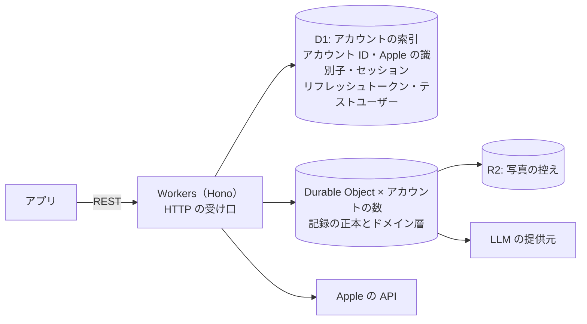

# サーバーは Cloudflare に置き、記録はアカウントごとの Durable Object に持つ

サーバーは TypeScript で書き、Cloudflare にまとめる。記録はアカウントごとに1つの Durable Object（SQLite）に持つ。アカウントごとに DB を分けると、クエリにアカウント ID の条件を書き忘れても他人の記録が混ざらず、アカウントの削除は Durable Object を丸ごと消すことになり、1つの DB の大きさの上限を気にしなくてよい。計算と DB が同じ場所で動くので、目標と目安の計算に DB との往復が要らない。週ごとの目安の見直しは、各 Durable Object のアラームで、その人のタイムゾーンでの1日の目安の適用期間の区切りに合わせて行う。費用は比べた構成の中で最も小さい。

DB を東京に置くことは必須にしない。初回リリースでは「データを日本国内に置く」と約束せず、写真と記録を送る LLM の提供元も国内に閉じるとは限らないため（`docs/research/food-photo-llm.md`）。

端末に DB を同期する仕組み（Turso Sync、Embedded Replicas）は使わない。端末はふつうの API とキャッシュで記録を持つ。

## 検討した案

- D1 に全員の記録を1つにまとめる: いちばん単純だが、1つの DB の大きさに上限があり、アカウントごとの分離はクエリの条件に頼る
- Turso でアカウントごとに DB を分け、端末に同期する: 東京に置け、SQLite 互換で持ち出しやすい。一方、スキーマの変更を全 DB に配る仕組みを自前で作ることになり、Workers からの書き込みに待ちが足され、製品の一部が preview で機能の廃止も起きている。オフラインで書ける同期には Swift の SDK が無く、端末が DB に直接書くと検証が端末に寄って ADR-0011 とぶつかる
- Postgres を1つ（例: 東京の Supabase を Hyperdrive でつなぐ）: いちばん持ち運びやすく、全員をまたぐ SQL も書けるが、アカウントごとの分離を捨て、固定費がかかる

## 起きること

- Durable Objects は Cloudflare に独自の作りで、いちばん深いロックインになる。ドメイン層を基盤から切り離し（層の決まりは `docs/agents/coding-style.md` の「ドメイン知識の置き場」）、スキーマは素の SQLite にする。出口は、アカウントごとの SQLite を Turso の東京に移すこと。移る合図は、「データを日本国内に置く約束が要る」か「全員をまたぐ分析が、分析用の出来事の置き場では足りない」が本当に来たとき
- 場所はヒントでしか指定できず、東京の保証はない
- 全員をまたぐ SQL は、記録に対しては書けない。推定精度の検証やユーザーの分析は、記録を書くときに分析用の出来事を別の置き場に書き出して行う
- Durable Object の中の SQL のスキーマの変更は、Cloudflare の設定では扱えない。版つきの SQL ファイルをリポジトリに置き、各 Durable Object が起動するたびに、まだ当てていない版を自分の DB に当てる
- アカウントを消しても、過去の時点に戻せる履歴に一定の期間残りうる
- Workers で動かないライブラリが要る処理が出たら、その部分だけ別の基盤に置く

数値（大きさの上限、費用、待ち、履歴の期間、場所のヒント）は `docs/research/server-platform.md` と `docs/research/turso.md` にある。

根拠: #25「サーバーの言語と実行基盤」の解決コメント
