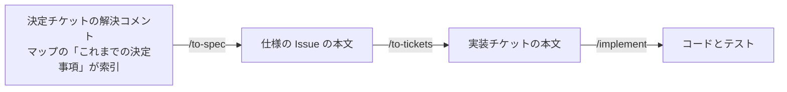

# 決定の置き場

決定は、mattpocock/skills の流れに沿って置き場を移る。移った先が正本になり、元のものは経緯として残る。

- 1つの決定は1か所にだけ書き、ほかからは指す
- 決定チケットの解決コメント（解決のあとの追記を含む）は、仕様にするまでの決定の正本。あとのチケットで変わった決定は、新しいチケットの解決コメントに書き、元のチケットに置き換えたチケットを指すコメントを1行足し、マップの索引の行を新しいほうへ向ける
- 仕様の Issue と実装チケットの本文は、決定が変わったら本文を直す
- 実装した PR で、あとのチケットに頼むこと（申し送り）ができたら、そのチケットの本文の「前の PR からの申し送り」の節に、PR を指して足す。PR は書き換えない記録で、あとのチケットを実装するエージェントは、チケットの本文から読み始めるため
- コードとテストは、実装した決定の正本。実装した PR で、実装とテストで読める決定を文書から消す（`AGENTS.md` と `docs/agents/` の働き方、コードから読めない理由、見た目のトークン、コードの外で確かめることは残す）
- `docs/ui-design/`（凍結済みの設計記録）は、画面の決定の、仕様にするまでの正本。`/to-spec` は、マップの目的地が指す設計記録の `index.md` の「実装はここから読む」も読む
- ADR（`docs/adr/`）には、覆しにくく、理由がないと驚かれる決定だけを書く。使う技術では、ロックインのあるものだけ。題は決定を言い切る形にし、ファイルの一覧を索引にする。書き方の好みは `docs/agents/domain.md` の「ADR に書くこと」。ほかのライブラリと道具は、実装したあとは依存の宣言（`package.json`、`Package.swift`、`wrangler.jsonc` など）が正本で、実装するまでは解決コメントに置く
- `AGENTS.md`（ルート、`ios/`、`server/`）には、そこでどう働くか（層と置き場、確かめる手順、機能をまたいでかかる守りごと）だけを書く。仕様の中身（振る舞い、計算の決まり、係数）と、技術を選んだ理由と比べた案は置かない。使う技術は、そこでの働き方に要る分だけ書く
- 一部の作業でだけ要る働き方は `docs/agents/` の文書に書き、`AGENTS.md` には「〜するときは `<文書>` を読む」の1行を残す
- 用語は `GLOSSARY.md`、見た目のトークンとガードレールは `DESIGN.md`、好みは `CODING_STANDARDS.md` から指す `docs/agents/` の文書、`AGENTS.md` から指す働き方は `docs/agents/`
- あとから書き換えない記録: 解決コメント、ADR、PR、コミットメッセージ、`docs/research/`（日付つきの調査）、`docs/ui-design/`。これらどうしが食い違うときは、新しいほうに従う（ADR と、あとの決定チケットの追記が食い違うときも）
- 書き換えない記録や、Issue・PR のコメントが指す `AGENTS.md` の節や、その中の記述が見つからないときは、移し先の表を見る。2026-09-26 に仕様の中身と技術の選択を決定チケットへ移したときの表は「[決定の置き場を Matt の流れに合わせる](https://github.com/gn-t-k/nu-tori/issues/51)」の解決コメント、2026-09-29 に一部の作業でだけ要る働き方を `docs/agents/` へ移したときの表は「[AGENTS.md を整理する](https://github.com/gn-t-k/nu-tori/issues/92)」の解決コメントにある
- 用語集は、2026-09-30 に mattpocock/skills に合わせて `CONTEXT.md` から `GLOSSARY.md` に改名した。それより前の記録が指す `CONTEXT.md` は `GLOSSARY.md` と読む
