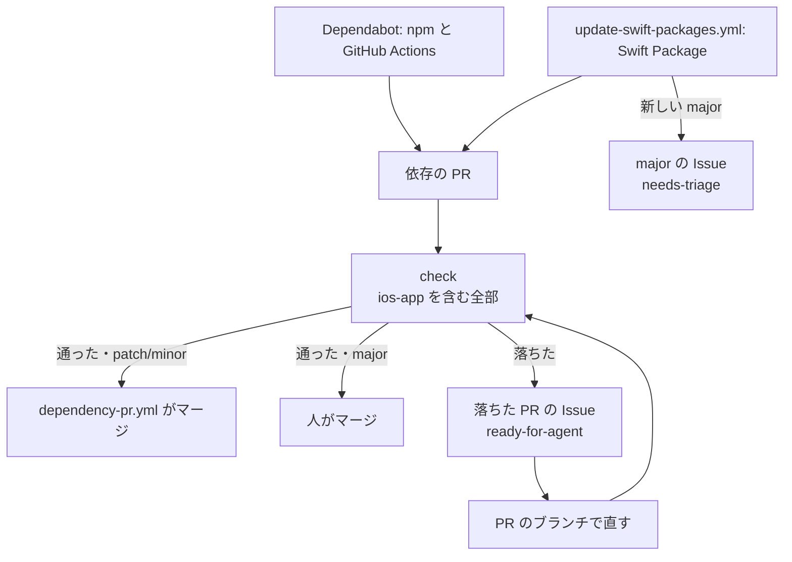

# 依存と道具の版を上げる

依存の PR（依存の版だけを上げる PR）は、毎週月曜の 9:00（日本時間）に来て、patch/minor は check が通るとワークフローがマージする。人とエージェントが手を動かすのは、major、落ちた PR の Issue、壊れたときの戻し方、手で上げ続けるもの（下の「手で上げ続けるもの」）だけ。

## 週1回の流れとマージの条件

- Dependabot（`.github/dependabot.yml`）は npm（`server`）と GitHub Actions を、`update-swift-packages.yml` は Swift Package を上げる。patch/minor はそれぞれ1つの PR にまとめる。major は、Dependabot は依存ごとの PR、Swift Package は依存ごとの Issue にする
- Dependabot の security updates は、週1回を待たずに、届いた時点で依存ごとの PR を出す
- `update-swift-packages.yml` は、main で手で始める（workflow_dispatch）と、月曜を待たずに PR と Issue を出す。脆弱性が見つかったときに使う。main 以外で始めると PR も Issue も出さない
- `dependency-pr.yml` は、check のワークフローが依存の PR のために走り終わったときに動き、次をすべて満たす PR を、App のトークンで merge コミットにしてマージする
  - 作者が Dependabot か、このリポジトリの GitHub App で、ブランチがこのリポジトリにある
  - check のワークフローが全部通った（必須でない `ios-app` を含む）
  - patch/minor。Dependabot の PR は、Dependabot のコミットメッセージにある update-type の最大のもの。update-type が読めなければマージしない。Swift の PR は patch/minor しか入れないので、読まずにマージする
  - 先頭のコミットが、check が走ったときから変わっていない
- major の PR と、update-type が読めない PR は、人が変更履歴を読んでマージする
- 人が足したコミットや `@dependabot` のコマンドがあっても、条件を満たせばマージする。直した PR がそのまま入る

**Why:** GitHub の auto-merge は使わない。auto-merge は必須のチェックしか待たず、必須の `ios` は Linux で動くので posthog-ios と sentry-cocoa をビルドしない。アプリのビルド（`ios-app`）は必須でないので、auto-merge では、アプリのビルドを壊す更新もマージされる。`ios-app` が必須のチェックになったら（`docs/agents/tooling.md` の「CI」）、auto-merge に戻せる

## 落ちた PR の Issue

依存の PR の check が落ちると、`dependency-pr.yml` が PR ごとに Issue を1つ立てる（ラベルは `ready-for-agent`）。題は `依存の PR #<番号> の check が落ちている（<PR の題>）` で、セキュリティの更新なら先頭に `[セキュリティ]` が付く。`[セキュリティ]` の Issue は、ほかより先に拾う。同じ PR がまた落ちると、開いている Issue に落ちた回のリンクがコメントで足される。PR がマージされるか閉じられると、Issue は閉じる。

- Issue の本文の PR と落ちた回から読み始める。直すのは、PR のブランチで始めたセッションにする（`docs/agents/git.md`）
- 直したコミットを足して check が通れば、patch/minor ならワークフローがマージする。major は落ちたときも Issue が立つが、直したあとのマージは人がする
- Dependabot の PR にコミットを足すと、Dependabot はその PR を rebase しなくなる。ロックされた Dependabot の PR でも `@dependabot recreate`（PR へのコメント）は効くが、足したコミットは消える。`@dependabot rebase` が効くかは確かめていない。手で上げるものは、Dependabot の PR に足さずに別の PR にする
- Swift の PR（ブランチ `update-swift-packages`）は、開いているあいだ毎週月曜に今週の内容で上書きされ、足したコミットは消える。直すなら週をまたがずに直してマージさせるか、Swift の PR を閉じて、上げる版と直しを別の PR にする

## 壊れたときの戻し方

本番で依存の更新が壊れたら、その依存の PR を revert する。依存だけを上げた PR の revert は、roll forward の決まりの例外（`server/AGENTS.md` の「デプロイ」）。浅い確認を抜けた壊れ方には、Sentry の新しいエラーの通知で気づく。

1. 上げ直す Issue を立てる。ラベルは `ready-for-agent`。本文には、何が壊れたか、下の2で足す行、「調査から始める（壊れた原因を調べ、直った版を待つか、こちらのコードを直すかを決める）」を書く
2. 依存の PR の merge コミットを revert する PR を出す。同じ PR で、戻した依存と版を、また来ないように一覧に足し、行に1の Issue へのリンクを `# 上げ直す: <Issue の URL>` のコメントで添える
   - npm と GitHub Actions: `.github/dependabot.yml` のその ecosystem の `ignore` に、`dependency-name` と `versions` で足す
   - Swift Package: `.github/swift-package-ignore` に `<依存の名前> <版>` で足す（書き方はファイルの先頭）
3. 1の Issue の本文に、revert の PR へのリンクを足す。revert の PR は人の PR なので、check が通ったら人がマージする。deploy が前の版を本番に出す
4. 上げ直したら、一覧の行を外し、1の Issue を閉じる

`wrangler rollback`（`server/` で `pnpm exec wrangler rollback --env production`。版を指さなければ1つ前の版に戻る）は、CI 自体が動かず、revert しても deploy が前の版を出せないときの最後の手段にする。使ったら、すぐに main でも上の手順で依存の PR を revert する。main と本番が食い違ったまま次のマージがあると、壊れた変更が出し直される。

## Swift Package の major の Issue

`update-swift-packages.yml` は、新しい major を上げずに、題 `Swift Package の <依存の名前> に新しい major の版 <major の番号> が出た` の Issue で知らせる（ラベルは `needs-triage`）。同じ題の Issue は、閉じていても立て直されないので、上げないと決めたら閉じてよい。次の major が出たら題が変わり、また立つ。

上げるときは、変更履歴で API の変わったところを確かめ、手で上げる。

1. `ios/NuToriCore/Package.swift` か `ios/OpenAPIGenerator/Package.swift` の `exact:` を書き換える。posthog-ios と sentry-cocoa は、Xcode のプロジェクト（`ios/NuTori.xcodeproj/project.pbxproj`）の参照の `version` も同じ版にする（版の正本は `NuToriCore`）
2. `swift package update --package-path <パッケージ>` で `Package.resolved` を書き直す
3. `scripts/check ios --fix` で、Xcode のプロジェクトの `Package.resolved` に写し、生成したクライアントを生成し直す。生成し直しただけの差分は別のコミットにする

この PR は作者が人なので、check が通ったら人がマージする。

## 手で上げ続けるもの

次は月に一度、開発者に頼まれたときに、最新を確かめて（`git ls-remote --tags`）手で上げる。

### ios

- Swift: `ios/.swift-version` と、CI の `ios` のジョブの `container:` のタグと digest をそろえて上げる。swift-format が Swift に付いてくるので、整形だけの差分は別のコミットにする
- SwiftLint: `scripts/check` の版と、配布物ごとの SHA-256
- sentry-cli: `ios/ci_scripts/ci_post_xcodebuild.sh` の版と SHA-256（Sentry のリリースの登録簿 `release-registry.services.sentry.io/apps/sentry-cli/<版>` の `sentry-cli-Darwin-universal`）

### server

- Node（`server/.node-version`）と pnpm（`server/package.json` の `packageManager`）
- pnpm は、Dependabot が対応する版（2026-09-28 時点で v12 まで）にとどめる。対応が広がったら上げる
- `@cloudflare/vitest-plugin` が対応する Vitest の版にとどめる（2026-09-29 時点で 4.x）。Dependabot は `.github/dependabot.yml` の `ignore` で Vitest のメジャーの版上げを除いているので、対応が広がったら手で上げ、`ignore` を外す

## npm の依存ごとの注意

- Better Auth は 1.x の中でも中核の表を変えたことがある。`server/src/auth/create-authentication-options/create-authentication-options.test.ts` が、アプリと同じ設定で Better Auth に移行を当てた D1 を見させ、足りない表・列・索引や食い違いがあれば落ちる。落ちたら、変更履歴で表の変更を確かめ、`server/d1-migrations/` に移行を足し、`server/src/auth/authentication-tables.ts` の宣言も合わせる（`server/AGENTS.md` の「DB」）。列の型の違いと、今ある列に付ける索引（列ごとの `index: true`）の抜けは、Better Auth が警告を出すだけなので、テストでは落ちない
- `@praha/byethrow`・`@praha/byethrow-testing`・`@praha/byethrow-oxlint`・`@praha/byethrow-docs` は同じ版で上げる（`@praha/byethrow-oxlint` が peer 依存で `@praha/byethrow` の版を固定する）。`.agents/skills/byethrow/SKILL.md` は、`@praha/byethrow-docs` の `instruction`（`server/node_modules/@praha/byethrow-docs/dist/esm/cli/commands/init.js`）を手直ししたもので、手直しする前の写しを `.agents/skills/byethrow/upstream-instruction.md` に置く。上げて `instruction` が変わると、`scripts/check server` が差分を出して落ちる。落ちたら、変わった分を SKILL.md に写し、写しを新しくする（コマンドは check が出す）。`--fix` は写しを書き換えない。`init claude` は動かした場所の `.claude/skills/byethrow/SKILL.md` に書き出し、リポジトリ直下ではリンクをたどって手直しした SKILL.md を上書きするので、動かさない
