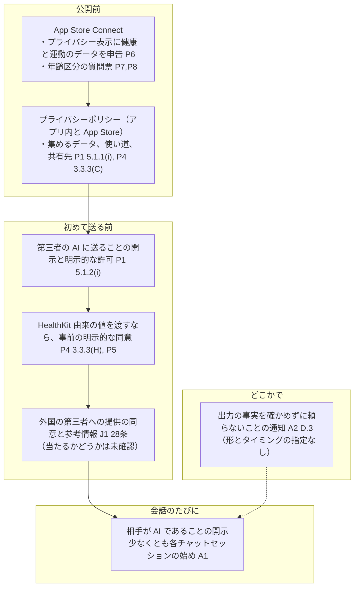

# 相手が AI であることの表示と、第三者の AI にデータを渡すときの開示・同意

調査日: 2026-09-25
対象: Issue #29（wayfinder マップ #19 の子）「書いて送った文章の読み分けと AI の発言の仕組み」。ADR-0001 の4位「画面に『AI』という言葉を出さない」と、提供元（Anthropic）・Apple・日本の法令とガイドラインが求める表示・開示・同意との折り合いを決めるために、それぞれの本文の文言を集める。

> **確認の方法と限界**
> - Anthropic（anthropic.com/legal、support.claude.com、claude.com）、Apple（developer.apple.com の App Review Guidelines、Apple Developer Program License Agreement、App Store Connect ヘルプ、Human Interface Guidelines とドキュメントの JSON、Developer News）、日本（e-Gov 法令 API、総務省、内閣府、個人情報保護委員会）の**本文を直接取得して読んだ**。本文で確かめた主張は「本文で確認」と書く。
> - 本文の記述から推し量ったものは「本文からの読み取り」と書き、何から読み取ったかを添える。nu-tori に当てはめた部分は、ほとんどがこれに当たる。
> - 本文や関連ページを探しても記述が無かったものは「本文を探したが記述なし」と書く。
> - 英語の本文は原文のまま引用し、訳はこの文書で付けた。訳は法的な解釈ではない。この文書は法律の専門家の見解ではない。
> - **経済産業省のページ（meti.go.jp）は 403 で取得できなかった。** AI 事業者ガイドラインは、同じ文書を載せている総務省のページから取得した。
> - **App Store Connect の年齢区分の質問票の実際の画面は見ていない**（ログインが要る）。ヘルプページの定義と手順だけを根拠にしている。App Review の実際の審査の運用（どういう画面なら通るか）も確かめていない。
> - Apple Developer Program License Agreement のページには、本体の版の日付が書かれていない。2026-06-08 の改訂（Developer News）を含む、取得日時点の版として読んだ。
> - 個人情報保護委員会のガイドライン（外国にある第三者への提供編）と Q&A（クラウドサービスを使うときに「提供」に当たるか）は、依頼どおり深追いせず読んでいない。
> - 二次情報（解説ブログ、まとめ記事、コミュニティ投稿、Wikipedia）は使っていない。

## 結論の要約

- **Anthropic の Usage Policy は、消費者向けのチャットボットに「相手が人間ではなく AI である」ことの開示を求めている。少なくとも各チャットセッションの始めに出す。**「All consumer-facing chatbots, including any external-facing or interactive AI agent, must disclose to users that they are interacting with AI rather than a human. This disclosure must be provided at a minimum at the beginning of each chat session.」【本文で確認 A1】。nu-tori の「会話」はこれに当たる【本文からの読み取り: 「consumer-facing」「interactive」の文言】。開示の文言、画面の位置、形式は指定していない【本文を探したが記述なし A1】。
- **医療などの「高リスク用途」の開示と専門家のレビューは、nu-tori には当たらない。** Healthcare の定義に「Wellness advice (e.g., advice on sleep, stress, nutrition, exercise, etc.) does not fall under this category」とある【本文で確認 A1】。
- **Commercial Terms は、「出力の事実の主張は確かめずに頼ってはならない」ことをユーザーに知らせることを求めている**（D.3「Customer acknowledges, and must notify its Users, that factual assertions in Outputs should not be relied upon without independently checking their accuracy」）【本文で確認 A2】。知らせる形とタイミングは指定していない【本文を探したが記述なし A2】。ADR-0001 の4位の「『間違うかもしれない』という言い訳もしない」と重なる【本文からの読み取り】。
- **「Powered by Claude」のような帰属表示の義務は無い**【本文を探したが記述なし A1,A2,A3,A7】。claude.com の「Powered by Claude」ページは Claude を使う企業の一覧で、表示の条件は書いていない【本文で確認 A7】。**逆に、Anthropic の名前やロゴを使うには Anthropic の事前の承認が要る**（Trademark Guidelines「You may only use our trademarks as specifically permitted by us and only in materials we approve beforehand.」）【本文で確認 A4】。
- **Apple の 5.1.2(i) は、2025-11-13 の改訂で「第三者の AI」を名指しした**:「You must clearly disclose where personal data will be shared with third parties, including with third-party AI, and obtain explicit permission before doing so.」【本文で確認 P1,P2】。同意画面を出すことや、その形式は指定していない【本文を探したが記述なし P1】。「explicit permission」を「before」に得るとあるので、プライバシーポリシーに書くだけでは足りず、送る前にユーザーが許可する操作が要ると読める【本文からの読み取り P1】。
- **HealthKit 由来のデータを第三者に渡すのは、事前の明示的な同意がある場合に限られる。さらに、その第三者が健康・運動のサービスを提供する目的でなければならない**（DPLA 3.3.3(H)、HealthKit のドキュメント）【本文で確認 P4,P5】。Claude API がその「第三者」に当たるかは、どこにも書いていない【本文を探したが記述なし】。
- **App Review Guidelines には、生成 AI の会話に特化した年齢制限や報告機能の要件は無い**【本文を探したが記述なし P1】。4.7 は「chatbots」を挙げて、フィルタ・報告・ブロック・年齢制限を求める。ただし対象は「バイナリに組み込まれていないソフトウェア」を提供するアプリ【本文で確認 P1】。アプリ自身の会話の機能が当たるかは書かれていない【本文からの読み取り】。HIG は「AI を使う場所を伝える」「人間と思わせない」「誤りを含みうることを伝える」「出力へのフィードバックを受け付ける」を推奨する。これはデザインのガイドラインで、審査の規則ではない【本文で確認 P9】。年齢区分では、カロリー記録などの「Health or Wellness Topics」が 9+ に置かれている【本文で確認 P7】。
- **日本では、AI と対話していることの表示を義務づける法令は見つからなかった**【本文を探したが記述なし J1,J3】。個人情報保護法 28 条は、外国にある第三者に個人データを提供するとき、例外を除き、あらかじめ本人の同意を得ることと、参考になる情報を本人に提供することを求める【本文で確認 J1】。AI 事業者ガイドライン（第 1.2 版、令和 8 年 3 月 31 日、非拘束的なソフトロー）は、AI 提供者が知らせる例として「AI を利用しているという事実、活用している範囲」を挙げる【本文で確認 J2】。

### いつ・どこで何を求めているか

次の図は、上の本文を nu-tori の流れに置いた読み取り。出典の記号は末尾の「出典一覧」を指す。

## 問い1: Anthropic の規約とガイドにある表示の義務

### 規約の構成（どれが開発者を縛るか）

- Commercial Terms は、顧客（開発者）が自分の顧客とエンドユーザー（「Users」）に提供する製品に Claude を使うことを認め（A.1）、「Customer and its Users may only use the Services in compliance with these Terms, including (a) the Usage Policy ... (b) ... Supported Regions Policy and (c) our Service Specific Terms」と定める（D.2）【本文で確認 A2】。
- Usage Policy（2025-09-15 発効）は冒頭で「applies to anyone who can submit inputs to Anthropic's products and/or services, including via any authorized resellers or passthrough access」とする。nu-tori のエンドユーザーも、サーバー経由で入力を送る「users」に含まれる【本文で確認 A1】。
- Service Specific Terms（2026-08-31 発効）には、ユーザーに知らせる義務が1つある。ただし対象は「Claude for Work（Team Plan; Enterprise Plan）」で、API には当たらない【本文で確認 A3】。

### 消費者向けチャットボットの開示（Usage Policy の Additional Use Case Guidelines）

| 項目 | 内容 |
|---|---|
| 文言 | 「All consumer-facing chatbots, including any external-facing or interactive AI agent, must disclose to users that they are interacting with AI rather than a human. This disclosure must be provided at a minimum at the beginning of each chat session.」【本文で確認 A1】 |
| 適用範囲 | 「The below use cases – regardless of whether they are High-Risk Use Cases – must comply with the additional guidance provided.」高リスク用途かどうかに関係なく、消費者向けのチャットボットのすべて【本文で確認 A1】 |
| 何を | 相手が人間ではなく AI であること【本文で確認 A1】 |
| いつ | 少なくとも各チャットセッションの始め【本文で確認 A1】 |
| どこに・どんな形で | 指定なし。「AI」という語を使うこと、特定の文言、ラベル、画面の位置は書いていない【本文を探したが記述なし A1】 |
| nu-tori への当てはめ | 「会話」はユーザーが書いた文章に Claude が返事を書く対話なので、「consumer-facing chatbots」または「interactive AI agent」に当たる【本文からの読み取り】。nu-tori の会話は日をまたいで続くタイムラインに並ぶ。何を「chat session」とみなすかは定義されていない【本文を探したが記述なし A1】 |
| 写真からの推定 | 写真から料理と栄養を推定する機能は、ユーザーと対話しない。チャットボットの開示には当たらないと読める【本文からの読み取り】。推定の結果に AI の開示を求める条項は、高リスク用途（下）以外には無い【本文を探したが記述なし A1】 |

同じ趣旨の記述がほかに2つある。

- すべての利用者に当たる禁止事項（Universal Usage Standards）の「Do Not Compromise Privacy or Identity Rights」に、「Impersonate a human by presenting results as human-generated, or using results in a manner intended to convince a natural person that they are communicating with a natural person when they are not」がある【本文で確認 A1】。ここで禁じているのは人間と偽ることで、開示の形は定めていない【本文からの読み取り】。
- ヘルプセンターの記事「I'm planning to launch a product using the Claude API...」は、推奨事項（「additional safety recommendations」）として「For external-facing products, disclose to your users that they are interacting with an AI system.」を挙げる【本文で確認 A6】。

### 高リスク用途の開示（nu-tori には当たらない）

- 文言: 「Disclosure: If model outputs are presented directly to individuals or consumers, you must disclose to them that you are using AI to help produce your advice, decisions, or recommendations. This disclosure must be provided at a minimum at the beginning of each session.」。あわせて「Human-in-the-loop」（資格のある専門家が公開前に見る）も求める【本文で確認 A1】。
- 対象: Legal、Healthcare、Insurance、Finance、Employment and housing、Academic testing、Media or professional journalistic content。Healthcare は「Use cases related to healthcare decisions, medical diagnosis, patient care, therapy, mental health, or other medical guidance. Wellness advice (e.g., advice on sleep, stress, nutrition, exercise, etc.) does not fall under this category」【本文で確認 A1】。
- nu-tori の食事・体重・栄養の会話は「nutrition, exercise」のウェルネスの助言に当たり、高リスク用途ではない【本文からの読み取り】。会話が病気の治療や診断の助言に踏み込むと、Healthcare に当たりうる【本文からの読み取り】。

### 出力の正確さの通知（Commercial Terms D.3）

- 文言: 「D.3. Limitations of Outputs; Notice to Users. It is Customer's responsibility to evaluate whether Outputs are appropriate for Customer's use case, including where human review is appropriate, before using or sharing Outputs. Customer acknowledges, and must notify its Users, that factual assertions in Outputs should not be relied upon without independently checking their accuracy, as they may be false, incomplete, misleading or not reflective of recent events or information.」【本文で確認 A2】
- 形: 通知の場所（画面、利用規約、ヘルプ）と頻度は指定していない【本文を探したが記述なし A2】。利用規約などで知らせる方法を否定する文言も無い【本文からの読み取り】。

### 未成年に提供する場合（Usage Policy が参照するヘルプセンター記事）

- Usage Policy は「Products serving minors ... must comply with the additional guidelines outlined in our Help Center article」とする【本文で確認 A1】。
- その記事（2026-03-16）は、未成年に提供する組織に対して、年齢確認、コンテンツのフィルタ、監視と報告の仕組み、未成年向けの案内を「may include」として挙げる。COPPA などの法令を守ることと、それを公開の文書に書くことも求める。開示は「Organizations must disclose to their users that they are interacting with an AI system rather than a human.」【本文で確認 A5】。
- 未成年を対象にしないアプリにこの記事が当たるかは書かれていない【本文を探したが記述なし A5】。

### 帰属表示とブランドの使用

- **帰属表示の義務**: Usage Policy、Commercial Terms、Service Specific Terms に、「Powered by Claude」などの表示を求める条項は無い【本文を探したが記述なし A1,A2,A3】。
- **Powered by Claude ページ**: claude.com/partners/powered-by-claude は「A curated list of businesses that use Claude to build better, faster, and safer.」という顧客の一覧で、バッジや表示の条件は書いていない【本文で確認 A7】。
- **Anthropic が顧客の名前を使う側**: Commercial Terms G は「Anthropic may use Customer's name and logo to publicly identify Customer as a customer of the Services; provided that Customer may opt-out via this request form.」【本文で確認 A2】。
- **Anthropic のブランドを使う制限**: Trademark Guidelines（2024-08-01 発効）に次の条項がある【本文で確認 A4】。
  - 「Our trademarks include our names, logos, brand elements, and anything we use to identify our goods and services.」
  - 「You may only use our trademarks as specifically permitted by us and only in materials we approve beforehand.」
  - 「You may not use our trademarks in a manner that implies Anthropic's sponsorship or endorsement, or a relationship or affiliation with Anthropic, except as we expressly authorize.」
  - 既存の取引関係があって使いたい場合は marketing@anthropic.com に連絡する。
- 画面やプライバシーポリシーの文章で、共有先として「Anthropic」の名前を事実として書くことが「trademarks の使用」に当たるかは書かれていない【本文を探したが記述なし A4】。
- Apple 側にも、アプリのアイコンと名前についての規定がある。4.1(c)「You cannot use another developer's icon, brand, or product name in your app's icon or name, without approval from the developer.」（2025-11-13 追加）【本文で確認 P1,P2】。

## 問い2: Apple の規定

### 5.1.2(i) 第三者の AI への個人データの共有

- 今の文言（App Review Guidelines、Last Updated: June 8, 2026）: 「(i) Unless otherwise permitted by law, you may not use, transmit, or share someone's personal data without first obtaining their permission. You must provide access to information about how and where the data will be used. You must clearly disclose where personal data will be shared with third parties, including with third-party AI, and obtain explicit permission before doing so. Data collected from apps may only be shared with third parties to improve the app or serve advertising (in compliance with the Apple Developer Program License Agreement). ...」【本文で確認 P1】
- 改訂: 2025-11-13 の Developer News「5.1.2(i): Clarifies that you must clearly disclose where personal data will be shared with third parties, including with third-party AI, and obtain explicit permission before doing so.」【本文で確認 P2】

| 項目 | 内容 |
|---|---|
| 何を | 個人データを第三者（第三者の AI を含む）と共有する「where」をはっきり開示する。データがどう、どこで使われるかの情報に触れられるようにする【本文で確認 P1】 |
| いつ | 共有する前（「before doing so」）【本文で確認 P1】 |
| 同意の強さ | 「explicit permission」【本文で確認 P1】 |
| 形 | アプリ内の同意画面、チェックボックス、ボタンの文言などの指定は無い【本文を探したが記述なし P1】。「explicit permission」を「before」に得るという文言から、プライバシーポリシーに書いて置いておくだけでは足りず、送る前にユーザーが許可する操作が要ると読める【本文からの読み取り P1】 |
| 相手の名前 | 「where personal data will be shared」の「where」が、提供元の名前（Anthropic）まで出すことを指すのか、「第三者の AI」という種類で足りるのかは書かれていない【本文を探したが記述なし P1】 |
| 例外 | 「Unless otherwise permitted by law」【本文で確認 P1】 |

関係する規定:

- 5.1.1(i) プライバシーポリシー: App Store Connect とアプリ内の両方にリンクを置く。集めるデータ、集め方、すべての使い道を書く。データを共有する第三者が同等の保護をすることを確認する。保持と削除の方針、同意の撤回と削除の求め方を説明する【本文で確認 P1】。
- 5.1.1(ii) 同意: 「Apps must also provide the customer with an easily accessible and understandable way to withdraw consent.」【本文で確認 P1】
- 5.1.2(ii): 「Data collected for one purpose may not be repurposed without further consent unless otherwise explicitly permitted by law.」【本文で確認 P1】
- DPLA 3.3.3(B): ユーザーの事前の同意なしにユーザーや端末のデータを集めない。集めたデータの使い道を広げるときも事前に同意を得る【本文で確認 P4】。
- DPLA 3.3.3(C): 集め方・使い方・開示について「clear and complete information」を出す。例として App Store の説明文に書くことを挙げる。アプリ内、App Store、ウェブサイトのいずれかにプライバシーポリシーを置く【本文で確認 P4】。
- App Store Connect のプライバシー表示（App privacy details）: 「Health and medical data」には HealthKit API 由来のデータと「any other user provided health or medical data」が含まれ、「Fitness and exercise data」も別の種類になっている。収集（「Collect」= 端末の外に送り、リアルタイムの応答に要る期間より長く扱えること）するなら申告する【本文で確認 P6】。ページが定義する「Third-party partners」は「analytics tools, advertising networks, third-party SDKs, or other external vendors whose code you've added to your app」。サーバー経由で使う API の提供元がこれに当たるかは書かれていない【本文を探したが記述なし P6】。

### 健康データを第三者（AI）に渡すことへの追加の制限

- **5.1.3(i)**: 「Apps may not use or disclose to third parties data gathered in the health, fitness, and medical research context—including from the Clinical Health Records API, HealthKit API, Motion and Fitness, MovementDisorder APIs, or health-related human subject research—for advertising, marketing, or other use-based data mining purposes other than improving health management, or for the purpose of health research, and then only with permission. ... You must disclose the specific health data that you are collecting from the device.」【本文で確認 P1】
- **5.1.3(ii)**: 「Apps must not write false or inaccurate data into HealthKit ... and may not store personal health information in iCloud.」【本文で確認 P1】
- **5.1.2(vi)**: HealthKit などから集めたデータを、マーケティング、広告、「use-based data mining」に使わない（第三者によるものも含む）【本文で確認 P1】。
- **DPLA 3.3.3(H)**（HealthKit APIs; Motion & Fitness APIs）【本文で確認 P4】:
  - 健康・運動・フィットネスの目的でなければ HealthKit API を使わない。その使い道を宣伝文と画面で「clearly evident」にする。
  - 「You must not use these APIs, or any information obtained through these APIs, to disclose or provide an end user's health, motion, fitness, and/or journaling suggestions information to a third party without prior express end user consent, and then only for purposes of enabling the third party to provide health, motion, fitness, and/or journaling services as permitted herein.」
  - 「You agree to clearly disclose to end users how You and Your Application will be using their health, motion, fitness, and/or journaling suggestions information, and to use it only as expressly consented to by the end user and as expressly permitted herein.」
- **HealthKit のドキュメント「Protecting user privacy」**: 「You must not disclose any information gained through HealthKit to a third party without express permission from the user. Even with permission, you can only share information to a third party if they also provide a health or fitness service to the user.」と書く。HealthKit を使うアプリにはプライバシーポリシーが要る【本文で確認 P5】。

nu-tori への当てはめ【本文からの読み取り】:

- ヘルスケアから読んだ体重や消費カロリーを会話の文脈として Claude に送るなら、DPLA 3.3.3(H) の「disclose or provide ... to a third party」に当たりうる。その場合は、事前の明示的な同意と、使い道の明確な開示が要る。
- Claude API は、nu-tori がユーザーに健康・フィットネスのサービス（食事の記録と助言）を提供するための処理を受け持つ。これが「enabling the third party to provide health ... services」に当たるかは、本文に解釈が無い【本文を探したが記述なし P4,P5】。
- ユーザーがアプリで入れた体重や食事の写真は、HealthKit 由来でなければ DPLA 3.3.3(H) の対象外。ただし 5.1.2(i) の個人データの共有と、プライバシー表示の「Health and medical data」には当たる【本文からの読み取り P1,P6】。

### 生成 AI の会話の年齢制限・報告機能

- **App Review Guidelines に、生成 AI の会話に特化した年齢制限・報告機能の規定は無い**【本文を探したが記述なし P1】。
- **4.7（Mini apps, mini games, streaming games, chatbots, plug-ins, and game emulators）**: 「Apps may offer certain software that is not embedded in the binary, specifically HTML5 and JavaScript mini apps and mini games, streaming games, chatbots, and plug-ins.」【本文で確認 P1】。4.7.1 でそのソフトウェアに求めるもの【本文で確認 P1】:
  - 5.1 のプライバシーの規定（健康データや子どものデータなどの機微なデータを含む）に従う。
  - 「include a method for filtering objectionable material, a mechanism to report content and timely responses to concerns, and the ability to block abusive users」
  - 4.7.5 で、年齢区分を超えるソフトウェアを見分ける方法と、年齢の確認か申告にもとづく制限を求める。
  - 見出しにも本文にも「chatbots」はあるが、アプリの中で提供する別のソフトウェア（ミニアプリなど）の文脈で書かれている。自社のサーバーの LLM で動くアプリ自身の会話の機能がここに当たるかは明記されていない【本文からの読み取り P1】。
- **1.2（User-Generated Content）**: フィルタ、報告、ブロック、連絡先を求める。対象は「apps with user-generated content or social networking services」【本文で確認 P1】。ユーザーの書いた文章が本人と AI の間でだけやりとりされ、ほかのユーザーに配られない場合、これに当たるかは書かれていない【本文を探したが記述なし P1】。
- **1.4.1（Medical apps）**: 「Apps should remind users to check with a doctor in addition to using the app and before making medical decisions.」。対象は「Medical apps that could provide inaccurate data or information, or that could be used for diagnosing or treating patients」【本文で確認 P1】。
- **年齢区分**（App Store Connect ヘルプ）【本文で確認 P7,P8】:
  - 質問票には「content descriptors, in-app controls, and capabilities」がある。
  - 「Health or Wellness Topics: Content that provides self-care or lifestyle recommendations. May include: calorie tracking, dieting advice, or exercise recommendations.」は 9+ の一覧に載っている。
  - 「Medical or Treatment Information」は、頻度が低ければ 13+、高ければ 16+。
  - 「Messaging and Chat」は「Users can directly communicate with one another」と、ユーザー同士のやりとりと定義されている。
  - AI や生成 AI、チャットボットを問う項目は、ヘルプページの定義の一覧に無い【本文を探したが記述なし P7】。
- **DPLA 7.9（Application Information; Minor Protections、2026-06-08 追加）**: App Store Connect の情報は正確に出す。Apple はそれをもとにアプリを分類し、未成年の利用時間の目安を示したり、ダウンロードを制限したりすることがある【本文で確認 P3,P4】。
- **HIG「Generative AI」**（2026-06-08 更新）。審査の規則ではなくデザインのガイドライン【本文で確認 P9】:
  - Transparency: 「Communicate where your app uses AI. Letting people know when and where your app uses AI sets expectations and gives people the opportunity to knowingly choose to use an AI-powered feature. Never trick someone into thinking they're interacting with or viewing content authored by a human if they're actually interacting with AI. Ensure your approach to disclosure aligns with any regulations in the regions where you offer your app.」
  - 「Keep people in control」の中に「Clearly identify when and where you use AI.」
  - ハルシネーション: 「it's important to clearly communicate that AI-generated content may contain errors.」
  - Privacy: 「Ask permission before using personal information and usage data.」「If you share data with third parties, understand their approach to privacy.」「Articulate whether your model uses personal information for training and improvement.」
  - フィードバック: 「Let people share feedback on outputs.」（例: 高評価・低評価のボタン）
  - 読み込み中の表示: 「instead of "Processing…", say "Finding substitutions for ingredients"」と、何をしているかを具体的に書くことを勧める。ADR-0001 の「推定であることは、読み込み中の表現で伝える」と方向が合う【本文からの読み取り】。

## 問い3: 日本の法令とガイドライン（簡潔に）

- **AI と対話していることの表示を義務づける法令は見つからなかった。**
  - 「人工知能関連技術の研究開発及び活用の推進に関する法律」（令和 7 年法律第 53 号）の本文には、「表示」「開示」「告知」「義務」の語が無い【本文を探したが記述なし J3】。
  - 活用事業者の責務（7 条）は、活用に努めることと、国・自治体の施策に協力することを求める努力義務【本文で確認 J3】。
- **個人情報保護法 28 条（外国にある第三者への提供の制限）**:
  - 1 項: 外国にある第三者に個人データを提供する場合は、27 条 1 項各号の場合を除き、「あらかじめ外国にある第三者への提供を認める旨の本人の同意を得なければならない」。ただし、同等の水準の国（個人情報保護委員会規則で定めるもの）と、規則の基準に合う体制を整えた者は除く。
  - 2 項: 同意を得ようとするときは、あらかじめ「当該外国における個人情報の保護に関する制度、当該第三者が講ずる個人情報の保護のための措置その他当該本人に参考となるべき情報」を本人に提供する。
  - 【本文で確認 J1】
  - Claude API に送ることが「提供」に当たるか（クラウドの扱い）、Anthropic が「体制を整備している者」に当たるかは、個人情報保護委員会のガイドラインと Q&A で決まる。依頼どおり深追いせず、読んでいない。
- **個人情報保護委員会「生成 AI サービスの利用に関する注意喚起等」（令和 5 年 6 月 2 日）**: 個人情報取扱事業者が、本人の同意を得ずに個人データを含むプロンプトを入れる場合について書いている。そのデータが「応答結果の出力以外の目的で取り扱われる場合」は法に違反する可能性があるので、提供元が「当該個人データを機械学習に利用しないこと等を十分に確認すること」とする【本文で確認 J5】。AI であることの表示には触れていない【本文を探したが記述なし J5】。
- **AI 事業者ガイドライン（第 1.2 版、令和 8 年 3 月 31 日、総務省・経済産業省）**:
  - 位置づけ: 「非拘束的なソフトロー」【本文で確認 J2】。
  - 「AI 提供者」の定義: 「AI システムをアプリケーション、製品、既存のシステム、ビジネスプロセス等に組み込んだサービスとして AI 利用者（AI Business User）、場合によっては業務外利用者に提供する事業者」【本文で確認 J2】。Claude を組み込んだアプリを一般のユーザーに出す nu-tori は、これに当たる【本文からの読み取り】。
  - 共通の指針の「6）透明性」: 「関連するステークホルダーへの情報提供」の例に「AI を利用しているという事実及び活用している範囲」がある【本文で確認 J2 p.21】。
  - AI 提供者向けの「P-6）ii. 関連するステークホルダーへの情報提供」: 「平易かつアクセスしやすい形で、適時かつ適切に」知らせる例に、「AI を利用しているという事実、活用している範囲、適切/不適切な使用方法等」を挙げる【本文で確認 J2 p.39】。
  - 画面に出すことや、対話のたびに出すことまでは書いていない【本文を探したが記述なし J2】。
- **人工知能関連技術の研究開発及び活用の適正性確保に関する指針（令和 7 年 12 月 19 日 人工知能戦略本部決定）**: 活用事業者は、AI を提供する際に「ＡＩの適正な利用を可能にするための情報（ＡＩの仕組み・限界、禁止事項、学習するデータの収集ポリシー、出力の信頼性に関する注意喚起等）」を利用者に提供する【本文で確認 J4】。AI と対話していることの表示には触れていない【本文を探したが記述なし J4】。

## ADR-0001 の4位との関係（本文からの読み取り）

本文で確かめた要求を並べると、ADR-0001 の4位とは次のように触れ合う。どう折り合うかは決めていない。

- **「AI」という語そのもの**: Anthropic の Usage Policy も、Apple の 5.1.2(i) も HIG も、開示する内容（相手が人間ではなく AI であること／第三者の AI に送ること）は定めているが、画面に出す語までは指定していない【A1,P1,P9】。「AI」と書かずに、相手が人間ではないことをはっきり伝える言い方で足りるかは、どこにも書かれていない。
- **タイミング**: 相手が AI であることは、少なくとも各チャットセッションの始めに出す【A1】。第三者の AI への共有は、送る前に明示的な許可を得る【P1】。一度だけの許可で足りるかについて、5.1.2(i) は回数を書いていない。
- **「間違うかもしれない」と言わない**: Commercial Terms D.3 は、出力の事実の主張を確かめずに頼らないようユーザーに知らせることを求める【A2】。ただし、画面に出すことまでは求めていない。HIG も誤りを含みうることを伝えるよう勧めるが、規則ではない【P9】。
- **帰属表示**: 「Powered by Claude」を出す義務は無い。出すなら Anthropic の商標の使用になり、事前の承認が要る【A4】。

## 出典一覧

すべて 2026-09-25 に本文を取得。

### Anthropic
- A1: Usage Policy（2025-09-15 発効） — https://www.anthropic.com/legal/aup
- A2: Commercial Terms of Service（2025-06-17 発効） — https://www.anthropic.com/legal/commercial-terms
- A3: Service Specific Terms（2026-08-31 発効） — https://www.anthropic.com/legal/service-specific-terms
- A4: Anthropic Trademark Guidelines（2024-08-01 発効） — https://www.anthropic.com/legal/trademark-guidelines
- A5: Responsible Use of Anthropic's Models: Guidelines for Organizations Serving Minors（2026-03-16） — https://support.claude.com/en/articles/9307344-responsible-use-of-anthropic-s-models-guidelines-for-organizations-serving-minors
- A6: I'm planning to launch a product using the Claude API. What steps should I take to ensure I'm not violating Anthropic's Usage Policy? — https://support.claude.com/en/articles/8241216-i-m-planning-to-launch-a-product-using-the-claude-api-what-steps-should-i-take-to-ensure-i-m-not-violating-anthropic-s-usage-policy
- A7: Powered by Claude — https://claude.com/partners/powered-by-claude
- A8: Data Processing Addendum（2025-02-24 発効。ユーザーへの通知や表示の条項が無いことだけを確かめた） — https://www.anthropic.com/legal/data-processing-addendum

### Apple
- P1: App Review Guidelines（Last Updated: June 8, 2026） — https://developer.apple.com/app-store/review/guidelines/
- P2: Updated App Review Guidelines now available（2025-11-13） — https://developer.apple.com/news/?id=ey6d8onl
- P3: Updated Apple Developer Program License Agreement and App Review Guidelines now available（2026-06-08） — https://developer.apple.com/news/?id=a233fmpw
- P4: Apple Developer Program License Agreement（3.3.3、7.9） — https://developer.apple.com/support/terms/apple-developer-program-license-agreement/
- P5: HealthKit「Protecting user privacy」 — https://developer.apple.com/documentation/healthkit/protecting-user-privacy （本文は https://developer.apple.com/tutorials/data/documentation/healthkit/protecting-user-privacy.json から読んだ）
- P6: App privacy details on the App Store — https://developer.apple.com/app-store/app-privacy-details/
- P7: Age ratings values and definitions — https://developer.apple.com/help/app-store-connect/reference/app-information/age-ratings-values-and-definitions/
- P8: Set an app age rating — https://developer.apple.com/help/app-store-connect/manage-app-information/set-an-app-age-rating/
- P9: Human Interface Guidelines「Generative AI」（2026-06-08 更新） — https://developer.apple.com/design/human-interface-guidelines/generative-ai （本文は https://developer.apple.com/tutorials/data/design/human-interface-guidelines/generative-ai.json から読んだ）

### 日本
- J1: 個人情報の保護に関する法律（平成 15 年法律第 57 号）28 条 — e-Gov 法令 API https://laws.e-gov.go.jp/api/1/lawdata/415AC0000000057
- J2: AI 事業者ガイドライン（第 1.2 版）本編（令和 8 年 3 月 31 日、総務省・経済産業省） — https://www.soumu.go.jp/main_content/001064279.pdf （掲載ページ https://www.soumu.go.jp/main_sosiki/kenkyu/ai_network/02ryutsu20_04000019.html 。ページ番号は PDF のページ）
- J3: 人工知能関連技術の研究開発及び活用の推進に関する法律（令和 7 年法律第 53 号） — e-Gov 法令 API https://laws.e-gov.go.jp/api/1/lawdata/507AC0000000053
- J4: 人工知能関連技術の研究開発及び活用の適正性確保に関する指針（令和 7 年 12 月 19 日 人工知能戦略本部決定） — https://www8.cao.go.jp/cstp/ai/ai_guideline/ai_gl_2025.pdf （掲載ページ https://www8.cao.go.jp/cstp/ai/ai_guideline/ai_guideline.html ）
- J5: 個人情報保護委員会「生成 AI サービスの利用に関する注意喚起等」（令和 5 年 6 月 2 日） — https://www.ppc.go.jp/files/pdf/230602_alert_generative_AI_service.pdf （掲載ページ https://www.ppc.go.jp/news/careful_information/230602_AI_utilize_alert/ ）
