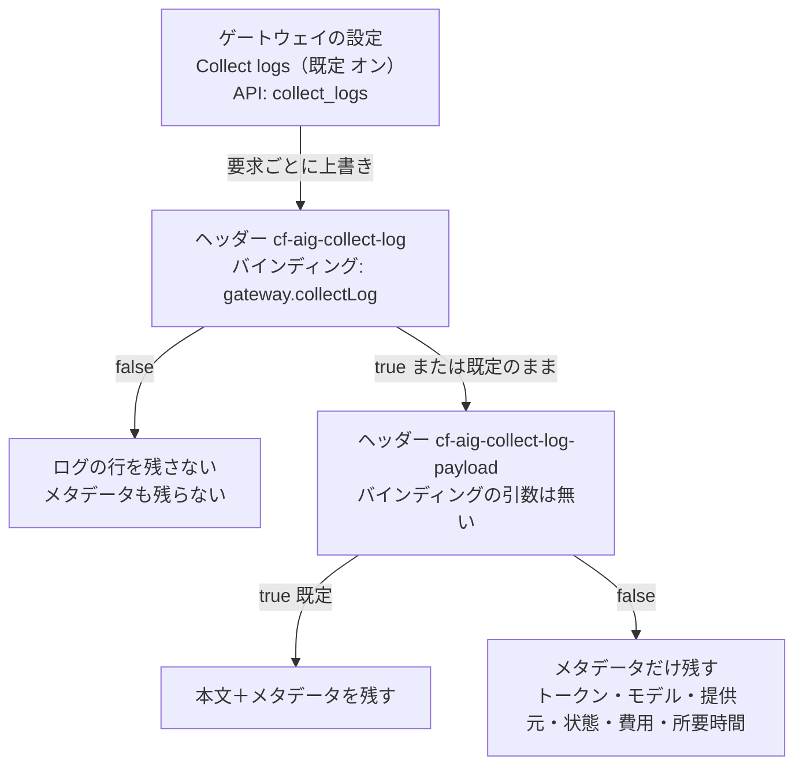
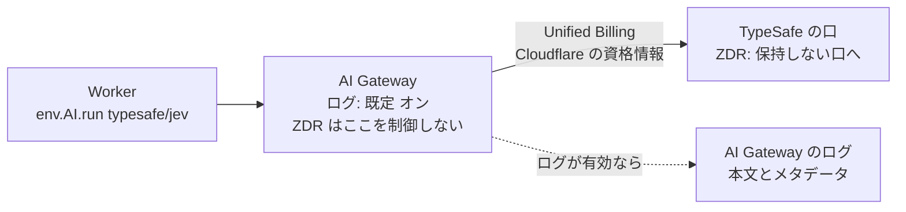

# AI Gateway のログを切ったときに残るもの（Analytics・本文を残さないログ・支出の上限・ZDR）

調査日: 2026-10-05
対象: Issue #279「AI Gateway のログに、利用者の文章を残すかを決める」の「先に確かめること」。ログを切ったゲートウェイで Analytics の集計が残るか、本文を残さずメタデータだけを残す設定があるか（選択肢 C が成り立つか）、支出の上限がログを切っても効くか、Workers AI の ZDR と AI Gateway のログの関係を、Cloudflare の一次情報で集める。決定はしない。

> **確認の方法と限界**
> - Cloudflare の開発者文書（developers.cloudflare.com の各ページの `index.md`、`/ai-gateway/llms.txt`・`llms-full.txt`、`/workers-ai/llms-full.txt`、`/ai/llms-full.txt`）、AI Gateway の変更履歴、Cloudflare API リファレンスの「Create a gateway」（`Accept: text/markdown` で取得）、Cloudflare の公式リポジトリ `cloudflare/workerd` の型定義（`types/defines/aig.d.ts`・`ai.d.ts`、main のコミット `1bdf7f1`）の**本文を直接取得して読んだ**。本文で確かめた主張は「本文で確認」と書く。
> - Cloudflare 公式ブログ（blog.cloudflare.com）は補助として2本だけ読んだ（BL1・BL2）。どちらも、ここで問う仕組みの記述は無かった。
> - 本文の記述から推し量ったものは「本文からの読み取り」と書き、何から読み取ったかを添える。
> - 本文や関連ページを探しても記述が無かったものは「本文を探したが記述なし」と書き、探したページを添える。
> - **実アカウントでは試していない。** ゲートウェイを作ってログを切り、Analytics や支出の上限の振る舞いを見ることはしていない（認証が要るため）。ダッシュボードの画面も、文書に書かれた範囲でしか確かめていない。
> - **issue #279 が指す `docs/research/cloudflare-agent-access.md` は、main にも、リモートの research/・claude/ ブランチにも、開いている PR の head にも見つからなかった。** 書き方は `docs/research/privacy-policy.md`（同じ AI Gateway のログを扱った節がある）と `docs/research/observability.md` に合わせた。privacy-policy.md と重なる事実（ログの既定、`cf-aig-collect-log-payload`、保持）は、2026-10-05 の本文で取り直して確かめた。
> - API リファレンスの項目は、型・既定・制約だけが載り、各項目の説明文が無いものが多い（`zdr`、`collect_logs`、`log_management` など）。項目の意味は、名前と文書の他のページから読み取った部分がある。
> - 二次情報（解説ブログ、まとめ記事、コミュニティ投稿）は使っていない。出典の番号は末尾の「出典一覧」。

## 結論の要約

- **問い1（ログを切っても Analytics が残るか）**: 文書に書かれていない。Analytics の頁は、ダッシュボードと GraphQL の `aiGatewayRequestsAdaptiveGroups` で要求の数・トークン・費用・エラー・キャッシュを見られるとだけ書き、ログの設定との関係に触れない【本文を探したが記述なし CF2,CF1,CF5,BL2】。逆に「ログを切ると集計も消える」という記述も無い。
- **問い2（本文を残さずメタデータだけ残す設定）**: **ある。** 要求ごとのヘッダー `cf-aig-collect-log-payload: false` で、本文（要求と応答のペイロード）だけを残さず、トークン数・モデル・提供元・状態コード・費用・所要時間のメタデータの行は残る（2026-03-17 に追加）【本文で確認 CF1,CF5】。ただし、①**ゲートウェイ単位の設定としては無い**（API の gateway の項目にも、ダッシュボードの手順にも無い）【本文を探したが記述なし CF10,CF11】、②**Worker の `env.AI.run()` の `gateway` の引数に、このヘッダーに当たるものは無い**（`collectLog` だけ）【本文で確認 CF7,CF8】。`env.AI.run()` の第3引数には `extraHeaders` があるが、それで `cf-aig-collect-log-payload` が効くかは書かれていない【本文を探したが記述なし CF7,CF8,CF9】。
- **問い3（支出の上限はログを切っても効くか）**: 支出の上限は「token usage and model pricing」から要求ごとの費用を出し、送る前に規則を評価して超えていれば `429` で止める。数え方の説明にログは出てこない【本文で確認 CF4】。ただし「ログを切っても効く」とも「ログが要る」とも書かれていない【本文を探したが記述なし CF4,CF1,CF5,BL1】。読み取りとしては、ログとは別に数えていると読める（下の問い3）。
- **問い4（ZDR とログ）**: **ZDR は AI Gateway のログを制御しない。** 「ZDR does not control AI Gateway logging.」と明記されている【本文で確認 CF18】。ZDR は Unified Billing の要求を、提供元の保持しない口へ送るもので、Cloudflare の側のログは別にログの設定で切る【本文で確認 CF18】。Jev（`typesafe/jev`）の頁は「Zero data retention: Yes」【本文で確認 CF19】。Jev は第三者のモデルで、AI Gateway を通り Unified Billing を使う【本文で確認 CF7】ので、Jev の側で残さなくても、AI Gateway のログが有効なら本文は Cloudflare のログに残る【本文からの読み取り CF1,CF7,CF18】。
- **#279 の選択肢**: A は成り立つ（ただし Analytics が残るかは未確認で、費用と失敗をサーバーで数える前提なら Analytics に頼らない）。B は成り立つ。C は**条件つきで成り立つ**（ヘッダーは要求ごとにしか付けられず、Worker のバインディングから付けられるかが文書で確かめられない）。根拠は末尾の「#279 の選択肢と事実」。

## 前提: ログの設定の階層

- ゲートウェイの設定が既定で、要求のヘッダーが優先する【本文で確認 CF6】。
- `cf-aig-collect-log: false` は、`cf-aig-collect-log-payload` の値によらず、ログの行全体（メタデータを含む）を残さない【本文で確認 CF1】。
- ゲートウェイの「Logs」を切った（`collect_logs` を false にした）ときは、`cf-aig-collect-log: true` を付けた要求だけが残る（ヘッダーが既定を反転する）【本文で確認 CF1】。

## 問い1: ログを切ったゲートウェイで、Analytics の集計が残るか

### 確認したこと

- **Analytics の頁**: 「Your AI Gateway dashboard shows metrics on requests, tokens, caching, errors, and cost.」。見られるものは Requests・Token Usage・Costs・Errors・Cached Responses。ダッシュボードの外では GraphQL の `aiGatewayRequestsAdaptiveGroups` で引ける（例の次元は `model`・`provider`・`gateway`・時刻）【本文で確認 CF2】。
- **Logging の頁**: ログの1行に入りうるものは「the prompt, response, provider, timestamp, status, token usage, cost, duration, and user agent」【本文で確認 CF1】。ログの設定の説明に Analytics は出てこない【本文で確認 CF1】。
- **変更履歴（2026-08-07、Workers AI と AI Gateway の統合）**: 「Requests routed through AI Gateway can be logged and included in analytics for request volume, errors, latency, token usage, and costs.」（ログに残ることと、Analytics に含まれることを並べて書く）【本文で確認 CF5】。
- **料金**: ダッシュボードの Analytics は無料の「core features」（「dashboard analytics, caching, and rate limiting」）。ログの料金は別で、2026-09-24 以降に最初のゲートウェイを作った顧客は Workers Logs の料金と保持に従う【本文で確認 CF13】。
- **ログを前提とする機能**（Analytics とは別のもの）:
  - Workers Logpush は「you must have logs turned on for the gateway」【本文で確認 CF14】。
  - Log classification（User Insights の「Task and model analysis」の元）は、保存した要求と応答の本文を分析し、「Collect logs must also be turned on」「Turning off Collect logs also turns off log classification.」【本文で確認 CF15】。
  - 支出の上限の頁は、使った額を Analytics のダッシュボードで追えると書く（「You can track your spend per model, provider, or any custom metadata attribute on the Analytics dashboard.」）【本文で確認 CF4】。

### 本文からの読み取り

- 文書は、ログを前提にする機能（Logpush、Log classification）には「ログが要る」と明記している。Analytics と支出の上限には、その注記が無い。Analytics は無料の機能として、有料になりうるログとは別に料金が書かれている。この書き分けから、Analytics はログの保存とは別に集計されているとも読めるが、**断定できる記述ではない**【本文からの読み取り CF2,CF4,CF13,CF14,CF15】。
- 変更履歴の「can be logged and included in analytics」は、ログと Analytics を並べた書き方で、どちらかがもう一方に依存するとは書いていない【本文からの読み取り CF5】。

### 記述なし

- ゲートウェイの「Logs」を切ったとき、または `cf-aig-collect-log: false` の要求について、Analytics（要求の数、トークン、費用、エラー）に数えられるか【本文を探したが記述なし CF1,CF2,CF3,CF5,CF13、AI Gateway の `llms-full.txt` 全体、BL2】。
- `cf-aig-collect-log-payload: false` の要求が Analytics に数えられるか（メタデータの行は残るので数えられそうだが、Analytics の元が何かが書かれていない）【本文を探したが記述なし CF1,CF2】。
- Analytics の集計の保持期間【本文を探したが記述なし CF2,CF13】。
- 確かめるには、開発用のゲートウェイでログを切って数回呼び、ダッシュボードと GraphQL の数が増えるかを見るしかない（実アカウントでの確認。この調査ではしていない）。

## 問い2: 本文を残さずメタデータだけを残す設定があるか（選択肢 C）

### 確認したこと

- **`cf-aig-collect-log-payload`（要求ごとのヘッダー）**: 「controls whether the raw request and response bodies (payloads) are stored for a given request. Unlike `cf-aig-collect-log`, which controls the entire log entry, this header only affects payload storage — metadata such as token counts, model, provider, status code, cost, and duration will still be logged.」。`false` で「Payload storage is skipped. Metadata-only log entries are still saved.」【本文で確認 CF1】。既定は `true`（本文を残す）【本文で確認 CF5】。2026-03-17 の変更履歴で追加された【本文で確認 CF5】。
- **ヘッダーの一覧（Header Glossary、2026-09-15 更新）には `cf-aig-collect-log-payload` が載っていない**（`cf-aig-collect-log` は載っている）【本文で確認 CF6】。Logging の頁と変更履歴には載っている【本文で確認 CF1,CF5】。
- **ゲートウェイの設定**: API の「Create a gateway」の項目は `collect_logs`（必須の boolean）、`log_management`（10,000〜10,000,000 の数）、`log_management_strategy`（`STOP_INSERTING` か `DELETE_OLDEST`）、`logpush`・`logpush_public_key`、`log_classification`、`otel`（送り先の配列）、`dlp`、`zdr`、`spend_limits` など。**本文だけを残さない項目は無い**【本文で確認 CF11】。ダッシュボードの手順も「Settings」の「Logs」の切り替えだけを書く【本文で確認 CF1,CF10】。
- **Worker のバインディング（`env.AI.run()`）**: 第3引数の `gateway` の項目は `id`・`skipCache`・`cacheTtl`・`cacheKey`・`collectLog`・`metadata`【本文で確認 CF7】。型定義の `GatewayOptions` は、これに `eventId`・`requestTimeoutMs`・`retries` を足したもので、本文だけを切る項目は無い【本文で確認 CF8】。第3引数（`AiOptions`）には `extraHeaders?: object` がある【本文で確認 CF8】。Workers AI の文書は `extraHeaders` で `x-session-affinity` を送る例を載せている【本文で確認 CF9】。
- **カスタムメタデータ（`cf-aig-metadata`、バインディングの `gateway.metadata`）**: 1要求に5つまで、文字列・数・真偽値。「will appear in your logs」【本文で確認 CF16】。支出の上限を分ける次元にも使える【本文で確認 CF4】。
- **ログの保持と自動削除**:
  - 2026-09-24 以降に最初のゲートウェイを作った顧客は、Workers Logs の料金と保持に従う【本文で確認 CF1,CF13】。Workers Logs の保持は Workers Paid で 7 日、Free で 3 日。2026-12-01 から Cloudflare Observability の料金に移ると書かれている【本文で確認 CF21】。
  - それより前の顧客は Legacy Logs で、「persists stored logs until you delete them」。上限（Paid はゲートウェイごとに 1,000 万件）で保存を止めるか、「Automatic Log Deletion」で古いものから消す【本文で確認 CF12】。
- **DLP**: 要求と応答の本文を検査し、合ったときの動作は **Flag（記録だけ）か Block（止める）の2つ**。Block は応答を 400 のエラーに置き換える【本文で確認 CF17】。**本文の一部を伏せて（マスクして）送る・残す動作は無い**【本文で確認 CF17】。合ったときはログに DLP の欄（動作、合った方針・プロファイル・項目）が足される【本文で確認 CF1,CF17】。要求ごとに DLP を外すヘッダーは無い【本文で確認 CF17】。DLP は無料で、Zero Trust の契約が無いアカウントで使える既定のプロファイルは「Financial Information」と「Social / Insurance / National Identifier Numbers」の2つ【本文で確認 CF13】。
- **Logpush**: ログを外の置き場へ暗号化して送る。ゲートウェイのログが有効であることが前提【本文で確認 CF14】。本文を除いて送る設定は書かれていない【本文を探したが記述なし CF14】。

### 本文からの読み取り

- 選択肢 C の「ログを残し、本文を残さない」は、**要求ごとのヘッダーでなら成り立つ**。nu-tori は Worker から `env.AI.run()`（Jev は第三者のモデルで、AI Gateway を通る）で呼ぶ前提なので、ヘッダーを付ける経路は次のどれかになる【本文からの読み取り CF1,CF7,CF8,CF9】。
  - `env.AI.run()` の `extraHeaders` に `cf-aig-collect-log-payload: "false"` を入れる。型としては書けるが、ゲートウェイがそれを受けて本文を残さないかは、文書に無い。実際に呼んでログを見て確かめる必要がある。
  - バインディングではなく、Cloudflare の REST API（`/ai/v1/chat/completions` など）や `gateway.ai.cloudflare.com` の口に `fetch` で送り、ヘッダーを付ける。Logging の頁の例はこの形【本文で確認 CF1】。
- ゲートウェイ単位で本文を切る設定が無いので、ヘッダーを付け忘れた要求は本文ごと残る（ゲートウェイの既定が「Logs オン」の場合）【本文からの読み取り CF1,CF11】。
- 本文を残さなくても、`metadata` に入れたものはログに残る。メタデータに記録の中身を入れなければ、ログに残るのはトークン・費用・状態・所要時間などになる【本文からの読み取り CF1,CF16】。
- DLP は本文をログから消す機能ではなく、ログに「何が合ったか」を足す機能。本文を残さない目的には使えない【本文からの読み取り CF1,CF17】。

### 記述なし

- `extraHeaders` で送った `cf-aig-*` のヘッダーをゲートウェイが受けるか【本文を探したが記述なし CF7,CF8,CF9、Workers AI と AI Gateway の `llms-full.txt`】。
- ゲートウェイ単位で「本文を残さない」を既定にする設定【本文を探したが記述なし CF1,CF10,CF11】。
- `cf-aig-collect-log-payload: false` のとき、AI Gateway の外（Workers Logs の側）に本文が別に残らないか。Workers Logs の頁に AI Gateway の記述は無い【本文を探したが記述なし CF1,CF21】。
- ログを切ったとき・本文を切ったときに、Cloudflare が処理のために一時的に本文を持つ期間【本文を探したが記述なし CF1,CF20】。

## 問い3: 支出の上限は、ログを切っても効くか

### 確認したこと

- **仕組み**: 「Each spend limit rule defines a budget (in dollars) over a rolling or fixed time window. AI Gateway calculates the cost of each request based on token usage and model pricing, then tracks cumulative spend against the limit in real time.」【本文で確認 CF4】。
- **止める時機**: 「Before sending a request to the provider, AI Gateway evaluates all applicable spend limit rules at once. If any individual rule is over budget, the request is blocked with a `429` response.」【本文で確認 CF4】。
- **結果整合**: 「Spend limits are eventually consistent. The current request's cost is recorded after completion, so a burst of concurrent requests can briefly exceed the limit before enforcement catches up.」（今の要求の費用は終わってから記録されるので、同時の要求が重なると一時的に上限を超えうる）【本文で確認 CF4】。
- **対象**: 「Spend limits apply to both Unified Billing requests and BYOK requests for models with known pricing.」【本文で確認 CF4】。費用は見積もりで、正確な額は提供元の請求を見る【本文で確認 CF3,CF4】。費用の指標は「only available for endpoints where the models return token data and the model name in their responses」【本文で確認 CF3】。
- **分け方**: 規則ごとに提供元・モデル・カスタムメタデータの次元で、値ごとに分けるか特定の値に絞る。次元を付けない規則はゲートウェイ全体で1つの枠。1ゲートウェイに 20 規則まで【本文で確認 CF4】。
- **超えたとき**: 既定は `429` で止め、窓が変わるまで通さない。Dynamic Route で安いモデルに落とす形もある【本文で確認 CF4】。
- **設定**: ダッシュボードの「Settings」の「Spend limits」か API。API の項目は `spend_limits.enabled` と `rules[]`（`limit`、`limitType: "cost"`、`window`、`technique: fixed|sliding`、`model`・`provider`・`metadata` の次元）【本文で確認 CF4,CF11】。
- **回数の上限（rate limiting）**: 要求の数で `429` を返す別の機能。ゲートウェイの設定で持つ【本文で確認 CF22】。
- **Unified Billing の要求の速さの上限**: ゲートウェイごとに 60 秒 200 要求（Cloudflare 管理の資格情報の要求）【本文で確認 CF13】。

### 本文からの読み取り

- 支出の上限の数え方は「トークン数 × モデルの価格」で、要求の完了時に記録される。ログの行やログの設定は、説明のどこにも出てこない。ログは「残すかどうか」を要求ごとに変えられる一方、支出の上限は「すべての規則を毎回評価する」と書かれているので、ログとは別に数えていると読める【本文からの読み取り CF1,CF4】。ただし、これは文書の書き方からの推測で、ログを切った要求が支出の枠に数えられることを示す記述ではない。
- 「models with known pricing」が条件なので、価格が分からないモデルの要求は枠に数えられないと読める。Jev の頁には価格（入力 100 万トークンあたり $0.042、出力 $0.00）が載っている【本文で確認 CF19】。Jev が「known pricing」に当たるかの明記は無い【本文からの読み取り CF4,CF19】。
- 結果整合なので、上限は「ちょうどの額で止まる」ものではなく、同時の要求の分だけ超えうる【本文からの読み取り CF4】。

### 記述なし

- ログを切った要求（ゲートウェイの設定でも、`cf-aig-collect-log: false` でも）が、支出の上限の累計に数えられるか【本文を探したが記述なし CF1,CF4,CF5,CF11,BL1】。
- 支出の上限の累計をどこに持つか（ログ、Analytics、別の数え場所）【本文を探したが記述なし CF4,BL1】。
- Workers AI の `@cf/` のモデル（Standard billing のとき）が支出の上限の対象か。頁は「Unified Billing requests and BYOK requests」とだけ書く【本文を探したが記述なし CF4,CF10】。
- 確かめるには、開発用のゲートウェイでログを切り、ごく低い上限（例: 規則の `limit` を小さく）を置いて呼び、`429` が返るかを見る（実アカウントでの確認。この調査ではしていない）。

## 問い4: Workers AI（Jev）の ZDR と AI Gateway のログの関係

### 確認したこと

- **ZDR の定義（Unified Billing の頁）**: 「Zero Data Retention (ZDR) routes Unified Billing traffic through provider endpoints that do not retain prompts or responses. ZDR only applies to Unified Billing requests that use Cloudflare-managed credentials. It does not apply to BYOK or other AI Gateway requests.」【本文で確認 CF18】。
- **ZDR とログ**: 「ZDR does not control AI Gateway logging. To disable request/response logging in AI Gateway, update the logging settings separately in Logging.」【本文で確認 CF18】。
- **ゲートウェイの `zdr`**: API の gateway の項目に `zdr: optional boolean` がある。説明文と既定値は載っていない【本文で確認 CF11】。ダッシュボードの既定のゲートウェイの設定表（認証、ログ、キャッシュ、回数の上限、提供元の資格情報の要求、Workers AI の請求）にも ZDR は無い【本文で確認 CF10】。
- **Jev**: `typesafe/jev`、「Third-party」「Zero data retention: Yes」、価格は入力 100 万トークンあたり $0.042【本文で確認 CF19】。
- **第三者のモデルの経路**: 「Third-party models require an AI Gateway and use Unified Billing. Cloudflare manages the provider credentials and deducts credits from your account.」【本文で確認 CF7】。
- **Workers AI の Data usage**: Cloudflare は顧客のコンテンツを学習や改善に使わない。「Your Customer Content for Workers AI may be stored by Cloudflare if you specifically use a storage service (e.g., R2, KV, DO, Vectorize, etc.) in conjunction with Workers AI.」（2026-04-21 更新）【本文で確認 CF20】。AI Gateway のログには触れていない【本文を探したが記述なし CF20】。
- **既定で作られる `default` のゲートウェイ**: 「Log collection: On」【本文で確認 CF10】。ログの頁: 「Logs are enabled by default for each gateway.」【本文で確認 CF1】。

### 本文からの読み取り

- 本文の流れは次のとおりで、ZDR とログは別々に効く【本文からの読み取り CF1,CF7,CF18,CF19】。

- したがって、Jev の側で残さない（ZDR）ことと、AI Gateway のログに本文が残ることは両立する。本文を Cloudflare に残さないには、ZDR とは別に、ゲートウェイの「Logs」を切るか、要求ごとに `cf-aig-collect-log: false`／`cf-aig-collect-log-payload: false` を付ける【本文からの読み取り CF1,CF18】。
- ZDR は「Cloudflare-managed credentials」の Unified Billing の要求に限る。Jev は第三者のモデルで Unified Billing を使うので対象に入る。`@cf/` の Workers AI のモデル（Cloudflare の基盤で動く）には、この ZDR の定義は当てはまらないと読める【本文からの読み取り CF7,CF18】。
- Jev の頁の「Zero data retention: Yes」が「ゲートウェイの `zdr` を有効にしたときに保持しない口へ送れる」意味か、「常に保持しない口へ送る」意味かは、本文から決められない【本文からの読み取り CF11,CF18,CF19】。privacy-policy.md の問い1でも同じ点が未確認として残っている。

### 記述なし

- ゲートウェイの `zdr` の既定値と、ダッシュボードでの設定の名前【本文を探したが記述なし CF10,CF11,CF18、AI Gateway の変更履歴】。
- `zdr` が無効のとき、Jev の要求が TypeSafe の保持する口へ行くか【本文を探したが記述なし CF18,CF19】。

## #279 の選択肢と事実

決定はしない。各選択肢が、文書で確かめられた事実の上で成り立つかだけを書く。

- **A: 本番も開発用もログを切る。費用と失敗はサーバーで数え、PostHog に送る** — **成り立つ。** ゲートウェイの「Logs」を切る設定（API の `collect_logs`）があり、Worker からも要求ごとに `collectLog: false` を渡せる【CF1,CF7,CF11】。費用と失敗をサーバーで数えるなら、Analytics が残るかに依存しない。支出の上限がログを切っても効くかは文書に無く【問い3】、A で開発用の上限に頼るなら、実アカウントで `429` が返るかを確かめる必要がある。
- **B: 開発用だけログを残す。本番は切る** — **成り立つ。** ログはゲートウェイごとの設定で、環境ごとにゲートウェイを分ける前提（ルートの `AGENTS.md`）と合う【CF1,CF10,CF11】。本番側には A と同じ未確認（Analytics・支出の上限がログを切っても効くか）が残る。2026-09-24 以降に最初のゲートウェイを作るなら、開発用のログは Workers Logs の保持（Paid で 7 日）に従う【CF1,CF13,CF21】。
- **C: ログを残し、本文を残さない設定を使う** — **条件つきで成り立つ。** 本文だけを残さない手段は `cf-aig-collect-log-payload: false` のヘッダーで、メタデータ（トークン・モデル・提供元・状態・費用・所要時間）の行は残る【CF1,CF5】。条件は2つ。①ゲートウェイ単位の設定が無いので、すべての要求にヘッダーを付ける必要があり、付け忘れた要求は本文ごと残る【CF1,CF11】。②Worker のバインディングの `gateway` の引数には無く、`extraHeaders` で効くかは文書に無い。効かなければ、バインディングをやめて REST の口へ `fetch` で送る形になる【CF7,CF8,CF9】。DLP には本文を伏せて残す機能は無く、C の代わりにはならない【CF17】。

## 確かめられなかったこと

- `docs/research/cloudflare-agent-access.md`（#279 が指す既存の調査）。リポジトリのどのブランチにも見つからなかった。
- ログを切ったゲートウェイで Analytics の集計が残るか（問い1）。文書に記述が無く、実アカウントでの確認が要る。
- ログを切った要求が支出の上限に数えられるか（問い3）。同上。
- `env.AI.run()` の `extraHeaders` で `cf-aig-collect-log-payload` が効くか（問い2）。同上。
- ゲートウェイの `zdr` の既定値と意味（問い4）。API リファレンスに説明文が無い。
- 支出の上限が `@cf/` の Workers AI のモデル（Standard billing）にも効くか。

## 出典一覧

### Cloudflare（developers.cloudflare.com。取得日 2026-10-05、更新日は各頁の表示）

- CF1: AI Gateway「Logging」（2026-09-24 更新） — https://developers.cloudflare.com/ai-gateway/observability/logging/
- CF2: AI Gateway「Analytics」（2026-09-24 更新） — https://developers.cloudflare.com/ai-gateway/observability/analytics/
- CF3: AI Gateway「Costs」（2026-09-24 更新） — https://developers.cloudflare.com/ai-gateway/observability/costs/
- CF4: AI Gateway「Spend limits」（2026-09-30 更新） — https://developers.cloudflare.com/ai-gateway/features/spend-limits/
- CF5: AI Gateway「Changelog」（2026-03-17「Log AI Gateway request metadata without storing payloads」、2026-06-05「Control AI costs with spend limits」、2026-08-07「Workers AI and AI Gateway unify model access and billing」） — https://developers.cloudflare.com/ai-gateway/changelog/ 、https://developers.cloudflare.com/changelog/post/2026-03-17-collect-log-payload-header/
- CF6: AI Gateway「Header Glossary」（2026-09-15 更新。Configuration hierarchy を含む） — https://developers.cloudflare.com/ai-gateway/glossary/
- CF7: AI Gateway「Workers Bindings」（2026-10-02 更新。`env.AI.run()`、Gateway options） — https://developers.cloudflare.com/ai-gateway/usage/worker-binding-methods/
- CF8: `cloudflare/workerd` の型定義（main、コミット `1bdf7f1`）。`GatewayOptions` — https://github.com/cloudflare/workerd/blob/1bdf7f1fbeeae04a78ba7bbcbc3a8a6ca920ef48/types/defines/aig.d.ts 、`AiOptions`（`extraHeaders`） — https://github.com/cloudflare/workerd/blob/1bdf7f1fbeeae04a78ba7bbcbc3a8a6ca920ef48/types/defines/ai.d.ts
- CF9: Workers AI「Prompt caching」（2026-04-21 更新。`extraHeaders` の例） — https://developers.cloudflare.com/workers-ai/features/prompt-caching/
- CF10: AI Gateway「Manage gateways」（2026-09-15 更新。既定のゲートウェイの設定表） — https://developers.cloudflare.com/ai-gateway/configuration/manage-gateway/
- CF11: Cloudflare API「Create a gateway」（`collect_logs`、`log_management`、`log_management_strategy`、`logpush`、`log_classification`、`otel`、`spend_limits`、`zdr`） — https://developers.cloudflare.com/api/resources/ai_gateway/methods/create/
- CF12: AI Gateway「Legacy Logs」（2026-09-24 更新） — https://developers.cloudflare.com/ai-gateway/observability/logging/legacy-logs/
- CF13: AI Gateway「Limits」「Pricing」（2026-09-24 更新） — https://developers.cloudflare.com/ai-gateway/reference/limits/ 、https://developers.cloudflare.com/ai-gateway/reference/pricing/
- CF14: AI Gateway「Workers Logpush」（2026-09-24 更新） — https://developers.cloudflare.com/ai-gateway/observability/logging/logpush/
- CF15: AI Gateway「Log classification」（2026-09-24 更新） — https://developers.cloudflare.com/ai-gateway/observability/log-classification/
- CF16: AI Gateway「Custom metadata」（2026-09-24 更新） — https://developers.cloudflare.com/ai-gateway/observability/custom-metadata/
- CF17: AI Gateway「Data Loss Prevention (DLP)」（2026-09-30 更新）、「Set up Data Loss Prevention (DLP)」 — https://developers.cloudflare.com/ai-gateway/features/dlp/ 、https://developers.cloudflare.com/ai-gateway/features/dlp/set-up-dlp/
- CF18: AI Gateway「Unified Billing」（Zero Data Retention の節） — https://developers.cloudflare.com/ai-gateway/features/unified-billing/
- CF19: Jev（モデルの頁） — https://developers.cloudflare.com/ai/models/typesafe/jev/
- CF20: Workers AI「Data usage」（2026-04-21 更新） — https://developers.cloudflare.com/workers-ai/platform/data-usage/
- CF21: Workers Logs（Limits と Pricing。2026-12-01 からの料金の変更の注記を含む） — https://developers.cloudflare.com/workers/observability/logs/workers-logs/
- CF22: AI Gateway「Rate limiting」（2026-09-30 更新） — https://developers.cloudflare.com/ai-gateway/features/rate-limiting/
- CF23: AI Gateway の文書一式（索引と全文） — https://developers.cloudflare.com/ai-gateway/llms.txt 、https://developers.cloudflare.com/ai-gateway/llms-full.txt

### Cloudflare 公式ブログ（補助）

- BL1: 「Your AI bill is out of control. Cloudflare can fix it now.」（2026-06-05。支出の上限の発表。数える場所やログとの関係の記述は無かった） — https://blog.cloudflare.com/ai-gateway-spend-limits/
- BL2: 「Billions and billions (of logs): scaling AI Gateway with the Cloudflare Developer Platform」（2024-10-24。ログの保存の作り。Analytics との関係の記述は無かった） — https://blog.cloudflare.com/billions-and-billions-of-logs-scaling-ai-gateway-with-the-cloudflare/
