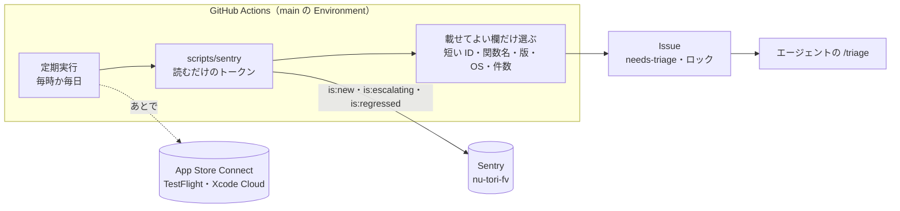
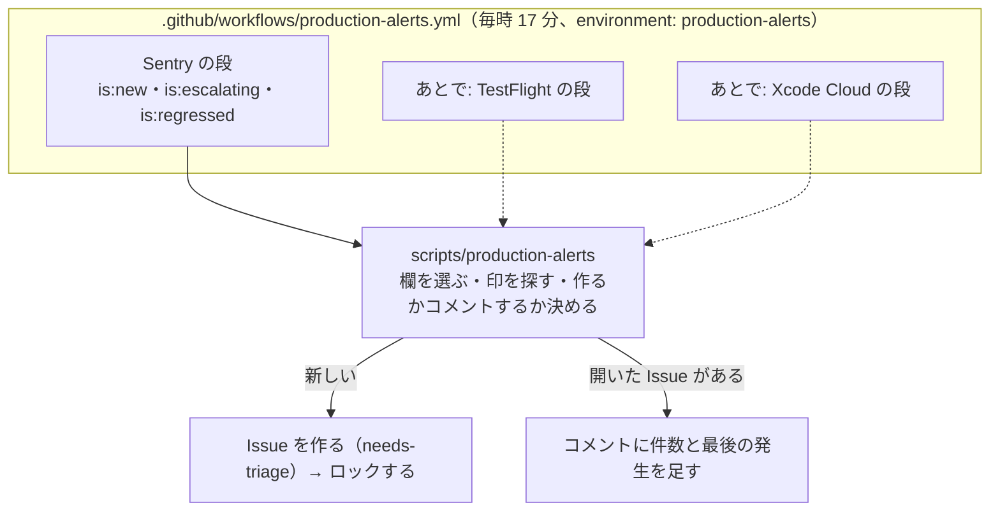

# 本番の知らせを、人が頼まなくても GitHub の Issue にする

調査日: 2026-10-03
対象: 本番の知らせ（まず Sentry の新しい課題・急に増えた課題。あとで TestFlight のフィードバックと Xcode Cloud の失敗も同じ道に乗せる）を、このリポジトリの Issue（ラベル `needs-triage`）にする仕組みを比べる。Issue になれば、エージェントが `/triage` で拾う。前提は `docs/research/sentry-agent-access.md`（エージェントが `scripts/sentry` で Sentry を読む）と `docs/research/observability.md` の「Sentry」の節（無料の Developer プランの枠、Alerts の条件と動作）。ここではそれと重ならない、**知らせを Issue に変える道**だけを書く。

> **確認の方法と限界**
> - Sentry は、getsentry/sentry のソース（`ff6b557`、2026-10-02）を GitHub から取って読んだ。GitHub 連携が Issue の本文を組む処理（`src/sentry/integrations/github/issues.py`、`src/sentry/integrations/mixins/issues.py`、`src/sentry/rules/actions/integrations/create_ticket/`）、本文に入るインターフェースの `to_string`（`src/sentry/interfaces/`）、ウェブフックの組み立て（`src/sentry/sentry_apps/api/serializers/app_platform_event.py`、`src/sentry/utils/sentry_apps/webhooks.py`）、機能の旗（`src/sentry/features/`）、プランと機能の対応（`static/gsApp/overrides/integrationFeatures.tsx`）。sentry.io の課金の判定は非公開の getsentry にあるので、**プランで何が使えるかは、料金ページと文書と、公開されているフロントエンドの対応表からの読み取り**になる。
> - 新しい `sentry` CLI は getsentry/toolkit（`6054887`、2026-10-02）の `packages/cli/plugins/sentry-cli/skills/sentry-cli/references/issue.md` を読んだ。
> - Sentry の文書は docs.sentry.io の Markdown 版（`<ページ>.md`）、料金は sentry.io/pricing の HTML（表の印の有無を HTML の要素で確かめた）。GitHub は docs.github.com の本文 API（`/api/article/body?pathname=...`）、Anthropic は code.claude.com/docs と platform.claude.com/docs の Markdown 版、Apple は developer.apple.com の JSON（`/tutorials/data/<パス>.json`）を読んだ（いずれも 2026-10-03）。
> - 本文で確かめた主張は「本文で確認」と書き、短い英語の原文を添える。ソースで確かめたものは「ソースで確認」と書き、ファイルを添える（次の版で変わりうるので、文書の約束より弱い）。本文やソースから推し量ったものは「本文からの読み取り」、探しても記述が無かったものは「本文を探したが記述なし」と書く。
> - **Sentry・GitHub・claude.ai・App Store Connect のどのアカウントでも何も動かしていない**（連携を入れていない、ウェブフックを受けていない、ルーティンを作っていない）。二次情報（ブログ、記事、SNS）は使っていない。
> - nu-tori の Sentry の組織は `nu-tori-fv`（`scripts/sentry`）、プランは無料の Developer（`docs/research/sentry-agent-access.md`）として読んだ。

## 追記（2026-10-09、実装したとき）

候補3を `.github/workflows/production-alerts.yml` と `scripts/production-alerts` で入れた。今の形は `docs/agents/tooling.md` の「本番の知らせを Issue にする」が正。

- **確かめたこと**: 無料の Developer プランのまま、Mac の読むだけのログインで `scripts/sentry issue list` と `issue view` が読めた（下の「確かめていないことのうち大きいもの」は解けた）。`--fields` は `metadata.type` のような点の書き方を受け、指した欄だけを返すので、例外のメッセージ（`metadata.value`）を最初から取らずに済む。版と OS は `issue view` の最新のイベントのタグ `release` と `os` にある
- **案から変えたこと**
  - 本番に絞る `environment:production` を検索に足した。サーバーの開発用の Worker も同じ組織に送っていて、絞らないと開発用の課題が混ざった
  - 欄を選ぶのを jq でなく Node のスクリプトにした（`scripts/app-store-connect` と同じ形）。作る・コメントする・何もしないを決める処理が jq の1行に収まらないため
  - 最後に知らせた状態を、本文とコメントの印 `<!-- sentry-state: ... -->` で覚える。印が短い ID だけだと、開いた Issue に毎時コメントを足すか、閉じた Issue（wontfix など）を毎時立て直してしまう
  - 状態が最後に知らせたものと同じなら、閉じた Issue も立て直さない。直して閉じても、直す前の版の端末から同じ課題が起き続けるため。同じ状態に戻ったとき（2度目の再発など）は、Sentry のメールに任せる
  - 印は、ワークフローと、リポジトリの持ち主・メンバー・コラボレーターが書いたものだけを信じる。公開のリポジトリでは、外の人が印を書いた Issue を先に立てて知らせを止められるため
  - 1回に書く上限（5件）を超えた分は、1つの Issue にまとめず次の回に回す。`is:new` は 7 日続くので、毎時の回で追いつく
- **まだ確かめていないこと**: `is:escalating` が未解決のまま増えた課題に付くか（下の「確かめていないこと」のまま）。付かなければ、急増は Sentry のメールの知らせに任せる

## 結論の要約



- **勧める形: 候補3（GitHub Actions の定期実行で `scripts/sentry` を読むだけのトークンで動かし、新しい課題を Issue にする）。** 無料のプランのまま動く見込みがあり、Issue に載せる欄を自分のコードで決められる候補は、これだけ（本文からの読み取り。下の各候補）。理由:
  - **Sentry の GitHub 連携（候補1）は無料のプランで使えない**。手で Issue を作るのは Team 以上、アラートのルールで自動で作るのは Business 以上（"Manual issue management is available to organizations on Team, Business, or Enterprise plans. Automatic issue management is available to organizations on Business or Enterprise plans."、本文で確認）。加えて本文の形を変えられず、例外の値（メッセージ）と、アプリのフレーム最大5つのファイル名・行・関数・その行のソースが、そのまま公開の Issue に入る（ソースで確認）
  - **Sentry のウェブフック → GitHub（候補2）は、間に受け口が要る**。Sentry が送る本文の形は決まっていて（`action`・`installation`・`data`・`actor`）、GitHub の `repository_dispatch` が要る `event_type` を入れられない（本文で確認）。Cloudflare の Worker などで受けて、署名を確かめ、選んだ欄だけで `repository_dispatch` を呼ぶ形になる。アラートの動作として連携に送るのは Team 以上と読める（ソースからの読み取り）
  - **Claude Code のルーティン（候補4）は、Sentry が公式に「Claude のルーティンを起こす」ひな形を持つ**（新しい課題ごとに、課題の URL だけの短い文でルーティンを起こす。ソースで確認）が、研究プレビューで、開発者個人の claude.ai の契約と使用量で動き、Issue を開発者の GitHub の名で作る（本文で確認）。毎回の結果が同じになる保証が要る「知らせを Issue にする」より、Issue を拾ったあとの「調べて PR を出す」に向く（本文からの読み取り）
- **重複の避け方**: Issue の本文に印（`<!-- sentry-issue: NUTORI-1A -->` のような、Sentry の課題の短い ID）を書き、作る前に Issue の一覧（REST の `GET /repos/{owner}/{repo}/issues?state=all`）を読んで印を探す。GitHub の検索 API は使わない（本文からの読み取り。下の「重複の避け方」）
- **Issue に載せる欄は、コードで選んだものだけにする**: 課題の短い ID、例外の型、アプリのフレームの関数名、版、OS、件数、利用者の数、最初と最後の発生、Sentry の課題の URL。例外の値（メッセージ）、端末の ID、利用者、要求のヘッダー、ブレッドクラムは載せない（`docs/agents/tooling.md` の「Sentry を読む」の決まりに合わせた）。中身はエージェントが `scripts/sentry` で読む
- **`GITHUB_TOKEN` で作った Issue は、`lock-conversations.yml` を起こさない**（"events triggered by the `GITHUB_TOKEN` will not create a new workflow run"、本文で確認）。公開のリポジトリでは外の人がコメントを書けてしまうので、Issue を作ったワークフローが自分でロックする（本文からの読み取り）
- **TestFlight のフィードバックと Xcode Cloud の失敗**も、同じワークフローに App Store Connect API を読む段を足す形が一番まとまる（本文からの読み取り）。どちらもウェブフックはあるが、Xcode Cloud のウェブフックは名前と URL しか決められず（本文で確認）、どちらも GitHub に直接は送れない。TestFlight のフィードバックには、テスターのメールアドレスと自由な文と写真が入る（本文で確認）ので、Issue には件数・版・機種・OS までにする
- **確かめていないことのうち大きいもの**: 無料の Developer プランで Sentry の REST API を読めるか（料金表の「API」の列は Team から印が付く。本文で確認）。`scripts/sentry` を含む前の調査の形すべてに効くので、最初に Mac で一度確かめる

## 前提: 知らせの種類と、Sentry で何として見えるか

| 知らせ | Sentry の状態 | 検索の書き方 | 確かさ | 出典 |
|---|---|---|---|---|
| 新しい課題 | `New`（7 日以内にできた課題） | `is:new`、あるいは `firstSeen:-24h`（`age` と同じ書き方） | 本文で確認 | https://docs.sentry.io/product/issues/states-triage.md 、https://docs.sentry.io/concepts/search/searchable-properties/issues.md |
| 急に増えた課題 | `Escalating`（"exceeded its forecasted event volume"）。前の週の量から課題ごとにしきい値を決める。**アーカイブした課題がしきい値を超えると戻る**仕組みで、未解決のまま増えた課題に付くかは書かれていない | `is:escalating` | 前半は本文で確認、未解決の課題に付くかは本文を探したが記述なし | https://docs.sentry.io/product/issues/states-triage/escalating-issues.md |
| 解決したのに再発した課題 | `Regressed` | `is:regressed` | 本文で確認 | 同上（states-triage） |
| ウェブフックの「課題」 | `issue.created`（ほかに `resolved`・`assigned`・`archived`・`unresolved`）。`substatus` に `escalating`・`regressed`・`new` などが入る | — | 本文で確認 | https://docs.sentry.io/integrations/integration-platform/webhooks/issues.md |

新しい `sentry` CLI の `issue list` は `--query`（Sentry の検索の書き方）、`--sort new`、`--period`（既定 90 日）、`--json --fields` を取り、`shortId`・`title`・`count`・`userCount`・`firstSeen`・`lastSeen`・`level`・`status`・`substatus`・`permalink`・`priority`・`isUnhandled` などを返す（本文で確認、getsentry/toolkit の `references/issue.md`）。

## 候補1: Sentry の GitHub 連携（課題から Issue を作る、アラートの動作で作る）

| 問い | 答え | 確かさ | 出典 |
|---|---|---|---|
| 無料の Developer で使えるか | **使えない**。手で作る（課題の画面の「Link Issue」）のは Team 以上、アラートの動作「Create a new GitHub issue」で自動で作るのは Business 以上。Issue の同期（コメント・担当・状態）も Team 以上 | 本文で確認 | https://docs.sentry.io/integrations/source-code-mgmt/github.md （Issue Management、Issue Sync） |
| 同じことをソースで | プランと機能の対応表で `integrations-issue-basic`（手で作る）と `integrations-issue-sync` は `team`、`integrations-ticket-rules`（アラートで作る）は `business`。Developer に付くのは `integrations-stacktrace-link` だけ | ソースで確認（`static/gsApp/overrides/integrationFeatures.tsx` の `INTEGRATION_FEATURE_PLAN_TYPE`） | getsentry/sentry |
| 入れるのに要る権限 | Sentry の owner・manager・admin と、GitHub の owner。Sentry の GitHub App は、リポジトリの Contents・Issues・Pull Requests・Checks・Commit Statuses・Actions を読み書き、Administration・Members などを読む権限を求め、"You must fully opt in to these permissions to use the app" | 本文で確認 | 同上（GitHub Permissions） |
| 入れると勝手に起きること | 開いた PR・マージした PR に、関係しそうな Sentry の課題をコメントする（"These features are automatically enabled once your GitHub integration has been set up"）。開いた PR へのコメントは Python・JS/TS・PHP・Ruby だけで、Swift は対象外。マージした PR へのコメントは疑わしいコミットに結びつけた課題で、言語の限定は書かれていない。GitHub のコミットの作者が Sentry の組織にいないと、毎月、招待を勧めるメールが来る | 本文で確認 | 同上（Get Sentry Comments on Pull Requests、Missing Member Detection） |
| Issue の題 | 通知と同じ題（`get_notification_group_title`）。ふつうは「例外の型: 値」 | ソースで確認（mixins/issues.py の `get_group_title`） | getsentry/sentry |
| Issue の本文 | 次の順に組む。(1) `Sentry Issue: [<短い ID>](<課題の URL>?referrer=github_integration)`。(2) コードの囲みの中に、イベントの各インターフェースの `to_string` をつないだもの。(3) アラートで作ったときは末尾に "This issue was automatically created by Sentry via [<ルール名>](<ルールの URL>)" | ソースで確認（github/issues.py の `get_group_description`、mixins/issues.py の `get_group_link`・`get_group_body`、github/actions/create_ticket.py の `generate_footer`） | getsentry/sentry |
| (2) に入るもの | `to_string` を持つのは例外（Exception）・メッセージ（Message）・スタック（Stacktrace）・テンプレート（Template）だけ。例外は、例外ごとに「型: 値」と、アプリのフレーム（`in_app` が偽でないもの）を**最大5つ**。フレームは `File "<ファイル名>", line <行>, in <関数>` と、その行のソース（`context_line`）。トップのスタックは最大10。**要求（Http）・利用者（User）・端末などの文脈（Contexts）・ブレッドクラム・スレッドは `to_string` を持たないので入らない** | ソースで確認（interfaces/exception.py・stacktrace.py・message.py・template.py の `to_string`、base.py の既定は空文字、templates/sentry/partial/frames/default.txt） | getsentry/sentry |
| エラー以外の課題（性能、フィードバックなど） | 課題の「証拠」（evidence）を表にして載せる。値は 50 文字で切る。フィードバックは本文のメッセージをそのまま載せる | ソースで確認（github/issues.py の `get_generic_issue_body`・`get_feedback_issue_body`、`MAX_CHAR = 50`） | getsentry/sentry |
| LLM が題と本文を書き足すか | Seer を使える組織で旗 `external-issues-ai-generate` があると、Gemini に題と1〜3文の説明を作らせて先頭に足す。無料のプランは Seer が無いので足されない | ソースで確認（integrations/utils/external_issues.py）。無料のプランで足されないのは本文からの読み取り | getsentry/sentry |
| 版・OS・件数は入るか | 入らない（上の (2) に入らない） | ソースで確認 | 同上 |
| 本文を自分の形に変えられるか | 自動のとき、題と本文はソースが決め、ルールの設定で変える口は無い。手で作るときは、作る前のフォームで題と本文を直せる | ソースで確認（create_ticket/utils.py の `create_issue` が `data["title"]` と `data["description"]` を毎回上書きする。手のときは `get_create_issue_config` が既定値を返すだけ） | getsentry/sentry |
| ラベル | 付けられる。フォームに「Labels」（複数選択、リポジトリのラベルから選ぶ）と「Assignee」があり、選んだものを GitHub の Issue を作る要求にそのまま入れる。アラートのルールでも同じフォームの値を保存して使う | ソースで確認（github/issues.py の `get_create_issue_config`・`create_issue`、create_ticket/base.py の `get_dynamic_form_fields`） | getsentry/sentry |
| 重複 | アラートで作るとき、その課題がすでに同じ連携の Issue に結びついていれば作らない | ソースで確認（create_ticket/utils.py の `ExternalIssue.objects.has_linked_issue`） | getsentry/sentry |
| Issue を作るのは誰の名か | Sentry の GitHub App（ボット）の名 | 本文からの読み取り（GitHub App で `client.create_issue` を呼ぶため） | — |

公開のリポジトリで見ると、本文で引っかかるのは次の2つ（本文からの読み取り）:

- **例外の値**: `fatalError` や `precondition` のメッセージ、Swift の `Error` の説明文がそのまま入る。今のコードがここに記録の中身を入れていなくても、あとで誰かが書いた1行で公開の Issue に漏れる。`docs/agents/tooling.md` の「載せるのはスタックの関数名と、版・OS・件数まで」より広い
- **その行のソース**（`context_line`）: ネイティブの iOS のクラッシュでは、ふつうイベントにソースの行は入らない。サーバー（Cloudflare の Worker）の課題でソースマップを上げていると入る。コード自体は公開しているので、漏れるものは増えないが、`docs/agents/tooling.md` の決まりより広い

このほか、Sentry の GitHub App にリポジトリの Contents と Actions の書き込みを渡すこと、公開の PR に Sentry の課題の題が載るコメント（切れる）が付くことも、公開のリポジトリでは費用になる（本文で確認、上の表）。

## 候補2: Sentry のウェブフック → GitHub Actions（`repository_dispatch`）

### Sentry の側

| 問い | 答え | 確かさ | 出典 |
|---|---|---|---|
| 送る仕組み | 組織の Settings > Developer Settings で「内部の連携」（internal integration）を作り、ウェブフックの URL を決める。「Alert Action」を入れると、アラートの動作「Send a notification via <連携>」に出る。別に、`issue` などの資源を購読すると、課題ができたとき・状態が変わったときに送る | 本文で確認 | https://docs.sentry.io/integrations/integration-platform.md 、https://docs.sentry.io/integrations/integration-platform/internal-integration.md |
| 本文の形 | 決まっている: `action`・`installation`（`uuid`）・`data`・`actor`。課題のときの `data.issue` は課題の全体（`shortId`・`title`・`culprit`・`count`・`userCount`・`firstSeen`・`lastSeen`・`substatus`・`permalink`・`metadata` など）。アラートのとき（`event_alert.triggered`）の `data.event` はイベントの全体で、例に `request.headers`（User-Agent）・`user.ip_address`・タグの `user` が入っている | 本文で確認 | https://docs.sentry.io/integrations/integration-platform/webhooks.md 、webhooks/issues.md 、webhooks/issue-alerts.md |
| 自分で決められるヘッダー | 内部の連携に「Webhook Headers」を足せる（"Only certain headers are allowed, such as Authorization or X-* custom headers"）。最大 20 個、値は保存後に伏せて表示する。Sentry の決めたヘッダー（`Sentry-Hook-Signature` など）が後から重なるので、署名は上書きできない | ソースで確認（`static/app/views/settings/organizationDeveloperSettings/sentryAppFormFields.tsx` の `WebhookHeadersField`、`src/sentry/sentry_apps/api/parsers/sentry_app.py` の `validate_webhookHeaders`、`app_platform_event.py` の `headers`） | getsentry/sentry |
| 署名 | `Sentry-Hook-Signature` は、本文をクライアントの秘密で HMAC-SHA256 したもの | 本文で確認 | webhooks.md |
| 応答の期限 | "Webhooks should respond within 1 second. Otherwise, the response is considered a timeout." 送り先が失敗を続けると、回路遮断（circuit breaker）でそのアプリへの送信を止め、無効にした知らせを出す処理がある | 前半は本文で確認、後半はソースで確認（`src/sentry/utils/sentry_apps/webhooks.py`） | 同上 |
| 無料の Developer で使えるか | **はっきりしない**。料金表で「API」「Third-party integrations」「Alerts and notifications via integrated tools」は Developer の列に印が無く、Team から付く。ソースのプランの対応表では、アラートの動作を連携に送る `integrations-alert-rule` が `team`、エラーごとのウェブフック（`error` の資源）の `integrations-event-hooks` が `business`。**内部の連携を作ることと、`issue` の資源の購読そのものを止める旗は、公開のソースに見当たらない** | 料金表は本文で確認（HTML の印）、対応表はソースで確認（integrationFeatures.tsx、`src/sentry/sentry_apps/api/endpoints/sentry_apps.py` は `error` の購読だけを旗で止める）、ほかは本文とソースを探したが記述なし | https://sentry.io/pricing/ 、getsentry/sentry |

### GitHub の側

| 問い | 答え | 確かさ | 出典 |
|---|---|---|---|
| 外から GitHub Actions を起こす口 | `POST /repos/{owner}/{repo}/dispatches`。本文に `event_type`（必須、100 文字まで）と `client_payload`（上の階層の鍵は 10 個まで、64KB 未満）。成功は 204 | 本文で確認 | https://docs.github.com/en/rest/repos/repos#create-a-repository-dispatch-event |
| 要るトークン | 細かい権限のトークンなら、リポジトリの「Contents」の書き込み。古い形のトークンは `repo` | 本文で確認 | https://docs.github.com/en/rest/authentication/permissions-required-for-fine-grained-personal-access-tokens 、同上 |
| どのブランチで動くか | 既定のブランチの最新のコミット。ワークフローのファイルが既定のブランチに無いと動かない | 本文で確認 | https://docs.github.com/en/actions/reference/workflows-and-actions/events-that-trigger-workflows#repository_dispatch |

### 組み合わせると

- **Sentry から GitHub の `dispatches` に直接は送れない**。ヘッダーで `Authorization` は付けられても、本文に `event_type` が無いので GitHub は受けない（本文からの読み取り、上の2つの表）。間に受け口（Cloudflare の Worker など）を置き、(1) `Sentry-Hook-Signature` を確かめる、(2) 1 秒以内に応える、(3) 載せてよい欄だけを `client_payload` に入れて `dispatches` を呼ぶ、の3つを書くことになる
- 受け口は、GitHub の Contents を書けるトークンを持つことになる。今の nu-tori の Worker（`server/`）に足すと、本番の API と同じところに強いトークンが置かれる（本文からの読み取り）
- 載せる欄は受け口のコードで選べるので、公開の Issue への載せ方は候補3と同じにできる。違いは「すぐ届く」ことと、「受け口を作って持つ」費用
- 無料のプランでアラートの動作として送れるかがはっきりしない（上の表）。`issue.created` の購読だけなら使える見込みはあるが、それでは「急に増えた」はウェブフックの `substatus` が `escalating` になる `unresolved` の変化を待つことになる（本文からの読み取り、webhooks/issues.md）

## 候補3: GitHub Actions の定期実行で `scripts/sentry` を動かす

| 問い | 答え | 確かさ | 出典 |
|---|---|---|---|
| 定期実行の書き方 | `on: schedule: - cron: "..."`。最短 5 分おき。UTC が既定で、`timezone` に IANA の名前も書ける | 本文で確認 | https://docs.github.com/en/actions/reference/workflows-and-actions/events-that-trigger-workflows#schedule |
| 遅れと抜け | 混む時間（毎時 0 分の前後）に遅れ、混みすぎると"some queued jobs may be dropped"。0 分を避けて組む | 本文で確認 | 同上 |
| 公開のリポジトリでの止まり方 | "In a public repository, scheduled workflows are automatically disabled when no repository activity has occurred in 60 days." | 本文で確認 | 同上 |
| どのブランチで動くか | 既定のブランチの最新のコミット（`GITHUB_REF` は既定のブランチ） | 本文で確認 | 同上 |
| main からだけ使える Environment の秘密の値を読めるか | 読める。Environment の「Selected branches and tags」は、実行の `GITHUB_REF` と照らし合わせる。定期実行の `GITHUB_REF` は main | 前半は本文からの読み取り、照らし合わせ方は本文で確認 | https://docs.github.com/en/actions/reference/workflows-and-actions/deployments-and-environments 、events-that-trigger-workflows |
| 費用 | 公開のリポジトリで標準のランナーを使うと無料（"GitHub Actions usage is **free** for ... **public repositories** that use standard GitHub-hosted runners"） | 本文で確認 | https://docs.github.com/en/billing/concepts/product-billing/github-actions |
| Issue を作る | `POST /repos/{owner}/{repo}/issues`。`labels` は"Only users with push access can set labels for new issues. Labels are silently dropped otherwise." | 本文で確認 | https://docs.github.com/en/rest/issues/issues#create-an-issue |
| `GITHUB_TOKEN` でラベルを付けられるか | 付けられる見込み。`ios-ui-test.yml` の `track-main-failure` が `GITHUB_TOKEN`（`issues: write`）で `ready-for-agent` を付けて Issue を立てている | 本文からの読み取り（このリポジトリの既存のワークフロー） | `.github/workflows/ios-ui-test.yml` |
| `GITHUB_TOKEN` で作った Issue が、ほかのワークフローを起こすか | 起こさない（"events triggered by the `GITHUB_TOKEN` will not create a new workflow run"）。`lock-conversations.yml`（`issues: opened`）は動かない | 本文で確認 | https://docs.github.com/en/actions/concepts/security/github_token |
| Sentry を読む | `scripts/sentry issue list nu-tori-fv/ --query "is:new" --sort new --json --fields shortId,title,count,userCount,firstSeen,lastSeen,level,substatus,permalink`。`is:escalating`・`is:regressed` も同じ形で。課題ごとの版・OS・関数名は `scripts/sentry issue view <短い ID> --json` の最新のイベントから選ぶ | 書き方は本文で確認（`references/issue.md`）。`issue view` の欄の名前は確かめていない | getsentry/toolkit |
| トークン | `docs/research/sentry-agent-access.md` と同じ、読むだけの個人のトークン（`org:read`・`project:read`・`team:read`・`event:read`・`member:read`）を `NU_TORI_SENTRY_READ_TOKEN` で `scripts/sentry` に渡す。書き込みのスコープは要らない | 本文からの読み取り（前の調査の結論を使う） | `scripts/sentry` |
| 無料の Developer で API を読めるか | **はっきりしない**。料金表の「API」は Developer の列に印が無い。一方で Developer の列に「MCP access」があり、Sentry の MCP は同じ API を読む | 料金表は本文で確認、MCP が API を読むのは前の調査のソースで確認 | https://sentry.io/pricing/ 、`docs/research/sentry-agent-access.md` |

### 重複の避け方

- Issue の題に短い ID を入れ（例: `Sentry NUTORI-1A: EXC_BAD_ACCESS in TimelineView.body`）、本文に機械が探す印 `<!-- sentry-issue: NUTORI-1A -->` を書く（本文からの読み取り）
- 作る前に `GET /repos/gn-t-k/nu-tori/issues?state=all&per_page=100` を全ページ読み、本文に同じ印がある Issue を探す。`ios-ui-test.yml` の「開いている Issue を探す」と同じ形（本文からの読み取り）
  - 開いた Issue があれば、作らずに件数と最後の発生をコメントに足す（増えた・再発したとき）
  - 閉じた Issue しかなければ、新しく作り、本文に「前の Issue #n」と書く（再発のとき）
- GitHub の検索 API（`/search/issues`）は使わない。書いた直後の Issue がすぐ出てくるかの約束が文書に無い（本文を探したが記述なし、https://docs.github.com/en/rest/search/search ）。一覧なら作った直後でも出る
- 1回に作る数に上限を置く（例: 5件。超えたら1つの Issue にまとめる）。"Creating content too quickly using this endpoint may result in secondary rate limiting."（本文で確認、Create an issue）
- 新しい課題の取りこぼしは、`is:new`（7 日以内）で毎回読み直すことで埋まる。定期実行が抜けても、次の回で拾える（本文からの読み取り、上の表の「遅れと抜け」と states-triage）

### 公開のリポジトリで載せるもの

| 欄 | 載せるか | 理由 |
|---|---|---|
| 短い ID、Sentry の課題の URL | 載せる | URL は組織に入った人しか開けない（本文からの読み取り） |
| 例外の型（`metadata.type`）、アプリのフレームの関数名 | 載せる | `docs/agents/tooling.md` の「スタックの関数名」 |
| 版（`release`）、OS、機種の種類 | 載せる | 同上の「版・OS」 |
| 件数、利用者の数、最初と最後の発生、レベル、`substatus` | 載せる | 同上の「件数」。数と日時だけ |
| 例外の値（`metadata.value`）と題（`title`）の値の部分 | 載せない | メッセージに何が入るかをコードで約束できない。題はふつう「型: 値」なので、題もそのまま使わない |
| 端末の ID、利用者、IP、要求のヘッダー・URL、ブレッドクラム、ソースの行 | 載せない | `docs/agents/tooling.md` の決まり |

欄を選ぶ処理は、jq で決まった欄だけを抜く形にし、「全部を載せてから消す」形にしない。欄が増えたときに漏れないため（本文からの読み取り）。

## 候補4: Claude Code のルーティン

| 問い | 答え | 確かさ | 出典 |
|---|---|---|---|
| 何か | 保存した Claude Code の設定（指示、リポジトリ、コネクタ）を、Anthropic のクラウドで自動で走らせる。起こし方は、定期（Scheduled）、API（`/fire` に POST）、GitHub のイベント。研究プレビュー（"Behavior, limits, and the API surface may change."） | 本文で確認 | https://code.claude.com/docs/en/routines.md |
| 使えるプラン | Pro・Max・Team・Enterprise | 本文で確認 | 同上 |
| 料金 | 対話のセッションと同じく契約の使用量を減らす。使用量の上限に当たると、使用量のクレジット（usage credits）を入れていれば従量で続き、無ければ窓が戻るまで断る | 本文で確認 | 同上（Usage and limits） |
| 回数の上限 | 定期の実行はアカウントで毎時 100（超えると待つ）。API の起動・Run now はルーティンごとに毎時 30、アカウントで API の起動が毎時 100（超えると失敗）。超えた分の上乗せは無い。定期の最短の間隔は1時間 | 本文で確認 | 同上 |
| GitHub のイベント | **プルリクエストとリリースだけ**。Issue のイベント（Issue ができた、ラベルが付いた）では起こせない。Claude の GitHub App が要り、ルーティンごと・アカウントごとの毎時の上限を超えたイベントは捨てる | 本文で確認 | 同上（Supported events） |
| 権限 | 許可を尋ねずに動く（"there is no permission-mode picker"）。コネクタの道具は書き込みも許可なしで使う。届く範囲は、選んだリポジトリ、環境のネットと変数、選んだコネクタで決まる | 本文で確認 | 同上 |
| 誰の名で動くか | 個人の claude.ai のアカウントのもので、仲間と共有しない。コミット・PR・コネクタの操作は開発者の名になる | 本文で確認 | 同上 |
| 環境 | クラウドの環境を選ぶ。既定は Trusted で `sentry.io` は許可リストに無いので、Custom にして足す。環境変数は「環境を使う人は誰でも読める」ので、Pro・Max では API credentials に置くよう勧める | 本文で確認 | 同上、https://code.claude.com/docs/en/cloud-environments.md |
| GitHub への接続が切れたとき | 72 時間まで飛ばして待ち、過ぎるとルーティンが止まる | 本文で確認 | routines.md |
| 成否の見え方 | 一覧の緑は「セッションが基盤の失敗なく終わった」だけで、指示が果たせたかは記録を開いて読む | 本文で確認 | 同上 |

### API の起動（`/fire`）と Sentry のひな形

| 問い | 答え | 確かさ | 出典 |
|---|---|---|---|
| 口 | `POST https://api.anthropic.com/v1/claude_code/routines/{routine_id}/fire`、`Authorization: Bearer <ルーティンごとのトークン>`、`anthropic-version: 2023-06-01` | 本文で確認 | https://platform.claude.com/docs/en/api/claude-code/routines-fire.md |
| 本文 | 任意の `text`（65,536 文字まで、解釈しない）。"Unknown fields in the body are ignored." | 本文で確認 | 同上 |
| `text` の扱い | `<routine-fire-payload>` で包み、信用しないデータとして渡す。ルーティンの指示が明示しないと従わない | 本文で確認 | routines.md |
| 重複 | "There is no idempotency key. If a webhook caller retries, the endpoint creates multiple sessions." | 本文で確認 | routines-fire.md |
| Sentry のひな形 | 内部の連携を作る画面に「Trigger a Claude routine」のひな形がある（"New issues will fire your Claude routine with a short plain-text prompt linking to the issue."）。購読は `issue.created`、スコープは `event:read` と `event:write`、ヘッダーに `Authorization: Bearer <トークン>` と `anthropic-version`・`anthropic-beta` を入れる。URL はルーティンの `/fire` の形だけを受ける。添える指示の例は、課題を見て「人が要る」なら知らせ、「雑音」ならアーカイブする、というもの | ソースで確認（`static/app/views/settings/organizationDeveloperSettings/creationTemplates.tsx`、`sentryApplicationDetails.tsx` の `ClaudeRoutineTemplateForm`・`CLAUDE_ROUTINE_STARTER_PROMPT`、`sentryAppFormFields.tsx` の `CLAUDE_ROUTINE_URL_REGEX`） | getsentry/sentry |
| ひな形の画面が出るか | 旗 `sentry-apps-creation-templates`（一時の旗）の後ろにある。旗が無くても、内部の連携を手で作り、URL とヘッダーを同じに入れれば同じになる | 旗の存在はソースで確認（`src/sentry/features/temporary.py`）。画面がその旗で出し分けられるか、手で作って同じになるかは本文からの読み取り | 同上 |
| ルーティンに届く文 | 送り先の URL がルーティンの `/fire` の形なら、本文に `text: "Sentry issue.created: <課題の permalink>"` を足す。`/fire` はほかの欄を捨てるので、課題の中身（`data.issue`）はルーティンに届かない | `text` を足すのはソースで確認（`src/sentry/utils/sentry_apps/webhooks.py` の `CLAUDE_ROUTINE_URL_RE`、`app_platform_event.py` の `get_text_summary`）、捨てるのは本文で確認（routines-fire.md） | 同上 |

### nu-tori で見ると

- **毎日 Sentry を見て Issue を作る**（定期の起動）は動く見込みがある。ただし、同じ作業を候補3は決まったコードで行い、ルーティンは毎回 LLM が指示を読んで行う。重複の避け方と載せる欄の選び方を毎回守るかは、指示の書き方と結果を読むことでしか確かめられない（本文からの読み取り）
- **新しい課題ごとに起こす**（Sentry のひな形）は、課題ごとにセッションが1つ立ち、毎時 30 回の上限と契約の使用量を使う。Sentry のウェブフックの「1 秒で応える」と、`/fire` が「セッションを作ってから返す」の兼ね合いで、遅いと Sentry が失敗と数えるかは確かめていない（本文を探したが記述なし）。ひな形のスコープは `event:write` を含み、添える指示はアーカイブまでするので、nu-tori の「書き込みのコマンドは使わない」（`docs/agents/tooling.md`）に合わせるなら `event:read` だけに直す
- **そのまま調べて PR まで出す**は、ルーティンが一番向く使い方（文書の例の「Alert triage」がまさにこれ）。ただし nu-tori は Issue を `/triage` で `ready-for-agent` にしてから直す流れなので、知らせ → PR を直結させると、その段を飛ばす（本文からの読み取り）
- ルーティンが作った Issue は開発者の名なので、`lock-conversations.yml` が動いてロックされる（本文からの読み取り）。開発者の名の Issue と、人が書いた Issue の見分けは、題か本文の印で付ける

## 候補5（足したもの）: GitHub Actions の定期実行で Claude Code を動かす

- `anthropics/claude-code-action` は `prompt` を渡すと、`schedule` を含むどのイベントでも動く。シェルや GitHub の API は `--allowedTools` か `permissions.allow` で渡したものだけ使える。定期実行は既定のブランチからだけで、公開のリポジトリでは 60 日動きが無いと止まる（本文で確認、https://code.claude.com/docs/en/github-actions.md の Run on a schedule）
- 認証は Claude API のキー（API の料金）か、`claude setup-token` で作る契約の OAuth トークン（Pro・Max・Team・Enterprise。作った人の契約に結びつく）（本文で確認、同上）
- 候補3のワークフローに LLM を足す形で、ルーティンより権限を絞りやすい（道具を列挙して許す）。一方で、Issue を作るだけなら LLM は要らず、Issue を作ったあとに直すのは `/triage` と既存の流れがある。今は勧めない（本文からの読み取り）

## TestFlight のフィードバックと Xcode Cloud の失敗を同じ道に乗せる

| 問い | 答え | 確かさ | 出典 |
|---|---|---|---|
| App Store Connect のウェブフック | `POST /v1/webhooks` で、アプリごとに URL・秘密・出来事の種類を登録する。出来事に `BETA_FEEDBACK_SCREENSHOT_SUBMISSION_CREATED`・`BETA_FEEDBACK_CRASH_SUBMISSION_CREATED`（テスターのフィードバック）、`BUILD_UPLOAD_STATE_UPDATED`、`BUILD_BETA_DETAIL_EXTERNAL_BUILD_STATE_UPDATED`、`APP_STORE_VERSION_APP_VERSION_STATE_UPDATED` などがある | 本文で確認 | https://developer.apple.com/documentation/appstoreconnectapi/webhook-notifications 、https://developer.apple.com/documentation/appstoreconnectapi/webhookeventtype |
| 送ってくる中身 | 出来事の種類・ID・日時と、対象の資源の ID と API の URL だけ（例: `betaFeedbackScreenshotSubmissions` の ID）。中身は API で取りに行く | 本文で確認 | https://developer.apple.com/documentation/appstoreconnectapi/webhook-events |
| 署名 | 登録した秘密で本文を HMAC-SHA256 し、ヘッダー `x-apple-signature: hmacsha256=<hex>` に入れる | 本文で確認 | https://developer.apple.com/documentation/appstoreconnectapi/configuring-webhook-notifications |
| フィードバックの中身 | スクリーンショットのフィードバックに `email`・`comment`・`screenshots`・`deviceModel`・`osVersion`・`timeZone`・`locale`・`batteryPercentage`・`connectionType` など | 本文で確認（欄の名前の一覧） | https://developer.apple.com/documentation/appstoreconnectapi/betafeedbackscreenshotsubmission/attributes-data.dictionary |
| Xcode Cloud のウェブフック | ビルドを作った・始めた・終えたときに送る。製品ごとに 5 つまで。決めるのは名前と URL だけ。30 秒で応えないか、やり直せる失敗だと送り直す。本文に `ciBuildRun` の `executionProgress`・`completionStatus` などが入る | 本文で確認 | https://developer.apple.com/documentation/xcode/configuring-webhooks-in-xcode-cloud |
| Xcode Cloud のウェブフックの署名・ヘッダー | 記述が無い | 本文を探したが記述なし（同上） | 同上 |
| GitHub の `check_run` で受けられるか | `check_run` はワークフローを起こせるが、GitHub Actions が作ったものは除く。Xcode Cloud が GitHub にチェックを書くか、その形は確かめていない | 前半は本文で確認、後半は確かめていない | https://docs.github.com/en/actions/reference/workflows-and-actions/events-that-trigger-workflows#check_run |

まとめると（本文からの読み取り）:

- どちらのウェブフックも、GitHub の `dispatches` が要る `Authorization` と `event_type` を付けられないので、直接は送れない。受けるなら候補2と同じ受け口が要る
- 候補3のワークフローに、App Store Connect API を読む段（新しいフィードバック、失敗したビルド）を足せば、受け口を持たずに同じ道に乗る。App Store Connect API の鍵を main の Environment に置くことになる。読むだけの役割の鍵を作れるかは、この調査では確かめていない
- TestFlight のフィードバックの `email` と `comment` と写真は、公開の Issue に載せない。Issue には「フィードバックが来た」「版・機種・OS」までにし、本文はエージェントが API か App Store Connect で読む。テスターが開発者だけでなくなると、`comment` は他人の文になる

## nu-tori への当てはめ

### 勧める形

候補3を土台にする。1つのワークフローに、知らせの元ごとの段を並べる。



- 毎時、0 分を避けて回す（例: `17 * * * *`）。抜けても `is:new` は 7 日分なので次で拾う
- Issue は `needs-triage` を付けて作り、作ったら `PUT /repos/{owner}/{repo}/issues/{n}/lock` でロックする（`GITHUB_TOKEN` では `lock-conversations.yml` が動かないため）
- 1回に作る数に上限を置き、超えたら1つの Issue にまとめる
- 候補1（Sentry の GitHub 連携）は、Team 以上にしても使わない（本文の形を変えられず、例外の値が入る）。候補4（ルーティン）は、Issue を拾って直す段を自動にしたくなったときに、別に考える

### 置くファイルの例

- `.github/workflows/production-alerts.yml`: 定期実行と `workflow_dispatch`。ジョブに `environment: production-alerts`、`permissions: issues: write`（ほかは無し）。秘密の値は `NU_TORI_SENTRY_READ_TOKEN` だけ

  ```yaml
  on:
    schedule:
      - cron: "17 * * * *"
    workflow_dispatch:
  jobs:
    sentry:
      runs-on: ubuntu-latest
      environment: production-alerts
      permissions:
        issues: write
      env:
        GH_TOKEN: ${{ github.token }}
        NU_TORI_SENTRY_READ_TOKEN: ${{ secrets.NU_TORI_SENTRY_READ_TOKEN }}
      steps:
        - uses: actions/checkout@<SHA で固定>
        - run: scripts/production-alerts sentry
  ```

- `scripts/production-alerts`: 段ごとの処理。`scripts/sentry issue list ... --json --fields <決まった欄>` を読み、jq で載せる欄だけを抜き、印 `<!-- sentry-issue: <短い ID> -->` で既存の Issue を探し、作るかコメントするかを決める。ワークフローに直接書かず、ここに置くと、Mac でも手で回して確かめられる
- `docs/agents/tooling.md`: 「Sentry を読む」の近くに、知らせが Issue になること、Issue に載せる欄、印の形、ワークフローの名前を足す（実装の PR で直す）

### 開発者が手でやること

1. **無料のプランで API を読めるかを確かめる**: Mac で `scripts/sentry issue list nu-tori-fv/ --query "is:unresolved" --limit 1 --json` を一度走らせる。`docs/research/sentry-agent-access.md` の「開発者が手でやること」の6と同じもの。読めなければ、この調査のどの候補も Team にしないと動かない
2. **読むだけの個人のトークンを作る**: sentry.io の Personal Tokens で、`org:read`・`project:read`・`team:read`・`event:read`・`member:read` だけ。クラウドのエージェント用のものと分けるか決める（Sentry は用途ごとに分けるよう勧める。前の調査）
3. **GitHub の Environment を作る**: `production-alerts`、Deployment branches を「Selected branches and tags」で `main` だけ。秘密の値 `NU_TORI_SENTRY_READ_TOKEN` を置く（`gh secret set NU_TORI_SENTRY_READ_TOKEN --env production-alerts --repo gn-t-k/nu-tori`）
4. **60 日の止まりに気をつける**: リポジトリに 60 日動きが無いと定期実行が止まる。止まったら Actions の画面で入れ直す
5. （あとで）TestFlight と Xcode Cloud の段を足すときに、App Store Connect API の鍵を作り、同じ Environment に置く

### 確かめていないこと

- 無料の Developer プランで Sentry の REST API（新しい CLI が使うもの）を読めるか。料金表の「API」は Team から印が付き、「MCP access」は Developer にある
- 無料の Developer プランで内部の連携を作り、`issue.created` のウェブフックを受けられるか（候補2・候補4のひな形）。公開のソースに止める旗は見当たらないが、課金の判定は非公開
- `scripts/sentry issue view --json` の最新のイベントの欄の名前（版・OS・フレームの関数名の場所）。0.x なので版で変わりうる
- `is:escalating` が、未解決のまま急に増えた課題にも付くか。文書はアーカイブした課題が戻る話しか書いていない。付かないなら、前の回の件数と比べる処理を足すか、急増は Sentry のメールの知らせに任せる
- Sentry のルーティンのひな形で、`/fire` の応答が Sentry の「1 秒」に間に合うか、遅いと回路遮断で止まるか
- Xcode Cloud が GitHub にチェック（`check_run`）を書くか。書くなら、Xcode Cloud の失敗は App Store Connect API を読まずに `check_run` のワークフローで受けられる
- App Store Connect API に、読むだけの役割の鍵があるか
- 既存の `ios-ui-test.yml` の `track-main-failure` が `GITHUB_TOKEN` で立てる Issue も、同じ理由でロックされていない見込み（本文からの読み取り）

## 出典一覧

Sentry（2026-10-03）
- 文書: GitHub https://docs.sentry.io/integrations/source-code-mgmt/github.md 、Integration Platform https://docs.sentry.io/integrations/integration-platform.md 、Internal Integrations https://docs.sentry.io/integrations/integration-platform/internal-integration.md 、Webhooks https://docs.sentry.io/integrations/integration-platform/webhooks.md （Issues https://docs.sentry.io/integrations/integration-platform/webhooks/issues.md 、Issue Alerts https://docs.sentry.io/integrations/integration-platform/webhooks/issue-alerts.md ）、Alerts https://docs.sentry.io/product/monitors-and-alerts/alerts.md 、Issue States https://docs.sentry.io/product/issues/states-triage.md 、Escalating Issues https://docs.sentry.io/product/issues/states-triage/escalating-issues.md 、Issue の検索 https://docs.sentry.io/concepts/search/searchable-properties/issues.md 、Auth Tokens https://docs.sentry.io/account/auth-tokens.md
- 料金: https://sentry.io/pricing/ （HTML の表の印）
- getsentry/sentry（`ff6b5571101dc3ead425a05a28d9da98e3001e26`）: https://github.com/getsentry/sentry — `src/sentry/integrations/github/issues.py`、`src/sentry/integrations/github/actions/create_ticket.py`、`src/sentry/integrations/mixins/issues.py`、`src/sentry/integrations/utils/external_issues.py`、`src/sentry/rules/actions/integrations/create_ticket/base.py`・`utils.py`、`src/sentry/interfaces/`（base・exception・stacktrace・message・template ほか）、`src/sentry/templates/sentry/partial/frames/default.txt`、`src/sentry/features/permanent.py`・`temporary.py`、`src/sentry/sentry_apps/api/endpoints/sentry_apps.py`、`src/sentry/sentry_apps/api/parsers/sentry_app.py`、`src/sentry/sentry_apps/api/serializers/app_platform_event.py`、`src/sentry/sentry_apps/utils/headers.py`、`src/sentry/utils/sentry_apps/webhooks.py`、`src/sentry/tasks/post_process.py`、`static/gsApp/overrides/integrationFeatures.tsx`、`static/app/views/settings/organizationDeveloperSettings/`（creationTemplates.tsx・sentryApplicationDetails.tsx・sentryAppFormFields.tsx・subscriptionBox.tsx）
- getsentry/toolkit（`60548873618b9574ed481783d95598dc9e93eaaf`）: https://github.com/getsentry/toolkit — `packages/cli/plugins/sentry-cli/skills/sentry-cli/references/issue.md`

GitHub（2026-10-03）
- Events that trigger workflows（repository_dispatch、schedule、check_run）: https://docs.github.com/en/actions/reference/workflows-and-actions/events-that-trigger-workflows
- Create a repository dispatch event: https://docs.github.com/en/rest/repos/repos#create-a-repository-dispatch-event
- Permissions required for fine-grained personal access tokens: https://docs.github.com/en/rest/authentication/permissions-required-for-fine-grained-personal-access-tokens
- Create an issue: https://docs.github.com/en/rest/issues/issues#create-an-issue
- Search: https://docs.github.com/en/rest/search/search
- Deployments and environments: https://docs.github.com/en/actions/reference/workflows-and-actions/deployments-and-environments
- GITHUB_TOKEN: https://docs.github.com/en/actions/concepts/security/github_token
- GitHub Actions billing: https://docs.github.com/en/billing/concepts/product-billing/github-actions

Anthropic（Markdown 版。2026-10-03）
- Routines: https://code.claude.com/docs/en/routines.md
- Trigger a routine through the API: https://platform.claude.com/docs/en/api/claude-code/routines-fire.md
- Cloud environments: https://code.claude.com/docs/en/cloud-environments.md
- GitHub Actions: https://code.claude.com/docs/en/github-actions.md

Apple（developer.apple.com の JSON。2026-10-03）
- Webhook notifications: https://developer.apple.com/documentation/appstoreconnectapi/webhook-notifications
- WebhookEventType: https://developer.apple.com/documentation/appstoreconnectapi/webhookeventtype
- Webhook events: https://developer.apple.com/documentation/appstoreconnectapi/webhook-events
- Configuring webhook notifications: https://developer.apple.com/documentation/appstoreconnectapi/configuring-webhook-notifications
- BetaFeedbackScreenshotSubmission.Attributes: https://developer.apple.com/documentation/appstoreconnectapi/betafeedbackscreenshotsubmission/attributes-data.dictionary
- Configuring webhooks in Xcode Cloud: https://developer.apple.com/documentation/xcode/configuring-webhooks-in-xcode-cloud

このリポジトリ
- `scripts/sentry`、`.github/workflows/ios-ui-test.yml`（`track-main-failure`）、`.github/workflows/lock-conversations.yml`、`docs/agents/tooling.md`、`docs/agents/issue-tracker.md`、`docs/adr/0010-public-repository.md`
