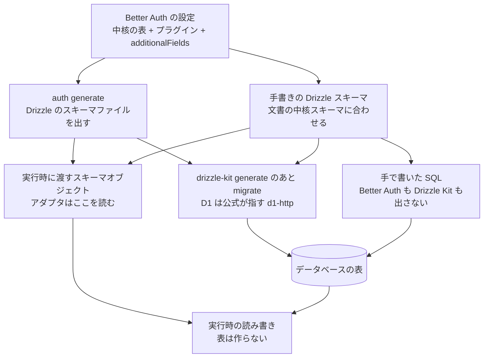

# Better Auth を Drizzle で扱う公式のやり方

調査日: 2026-09-29
対象: 認証の表（`user`・`session`・`account`・`verification` と、プラグインが足す表）を Drizzle のスキーマ定義として持ち、Cloudflare D1 に置くときの、Better Auth の公式の手順。記録は Durable Object の SQLite にあり、認証の表とは分かれている（ADR-0019、`server/AGENTS.md`）。その分け方に公式が触れているかも見る。

> **確認の方法と限界**
> - Better Auth は GitHub の公式リポジトリを**タグ `v1.7.6`（2026-09-24、npm の `latest`、コミット `229a02a`）で取得し、文書の原文（`docs/content/docs/**/*.mdx`）とソースを直接読んだ**。本文やソースで確かめた主張は「本文で確認」と書き、ソースで確かめたものは出典にファイル名を添える。
> - npm の `dist-tags.latest` が 1.7.6 であることは、レジストリのメタデータで確かめた。
> - Better Auth が D1 と Drizzle の組み合わせで指す先（`https://orm.drizzle.team/docs/guides/d1-http-with-drizzle-kit`）は、Drizzle の公式ガイドの HTML を取得して本文を読んだ。Better Auth 自身の文と、そのガイドの文は分けて書く。
> - 本文の記述から推し量ったもの、ソースの流れを追って判断したものは「本文からの読み取り」と書き、何から読み取ったかを添える。
> - 本文やソースを探しても記述が無かったものは「本文を探したが記述なし」と書く。
> - **どれも動かしていない。** `auth generate` も Drizzle Kit も、D1 への適用もしていない。
> - 二次情報（ブログ、まとめ記事、Qiita・Zenn、コミュニティフォーラム）は根拠にしていない。`@praha/drizzle-factory` は Better Auth の公式ではないので、公式の記述が無いことの対比にだけ出す。
> - 開発者自身の健康データは扱っていない。

## 結論の要約

- **スキーマの形の正本は Better Auth の設定**（中核の表、プラグイン、`additionalFields`）。CLI の `npx auth@latest generate` が、その設定から Drizzle のスキーマファイルを出す。手で書いてもよい。既定の出力はソース上 `./auth-schema.ts` で、文書の CLI のページが書く `schema.ts` とは違う（BA2、BA3、BA11）。
- **データベースに当てる SQL の正本は Drizzle Kit**。文書は `drizzle-kit generate` のあと `drizzle-kit migrate` と書く。`npx auth@latest migrate` と `getMigrations` は組み込みの Kysely だけで、Drizzle では拒否する（BA2、BA3、BA4、BA11、BA12）。
- **実行時に Better Auth は表を作らない。** Drizzle アダプタに `CREATE TABLE` は無い。起動時の検証は、渡した Drizzle のスキーマオブジェクトを見るだけで、データベースには問い合わせない。オブジェクトが合っていても、移行を当てていなければ検証は通る（BA4、BA9、BA10）。
- **D1 と Drizzle の組み合わせは公式に案内がある。** `provider` は `"sqlite"` だけ（`"d1"` は無い）。D1 では `getMigrations` を使わず、`cloudflare:workers` の `env` と、Drizzle の D1 HTTP ガイド（`driver: "d1-http"` で `migrate`・`push`）に従う、と書く。wrangler の素の SQL には触れていない（BA4、BA9、BA18）。
- **Durable Object の SQLite は対象外。** 文書にもアダプタにも、保存先としての記述は無い。見つかった `DurableObject` は、CLI が Workers の外で `cloudflare:workers` を読むための空のクラスだけ（BA13）。
- **フィールドやプラグインを足すときは、設定を変えて `generate` し直し、Drizzle Kit で移行する。** 生成はファイル全体の上書き。Relations v2 への切り替えだけなら、データベースの移行は要らない（BA2、BA4、BA6、BA11）。
- **テストで Drizzle のスキーマから行を作る話は、公式には無い。** 公式のテスト用具 `testUtils` は、メモリ上のオブジェクトを作り、アダプタの `createUser` で書く。`@praha/drizzle-factory` は公式の話ではない（BA7、BA14）。

## 1. スキーマは誰が作るか

出典の番号は末尾の「出典一覧」。

| 問い | 答え | 確かさ | 出典 |
|---|---|---|---|
| 読み込む関数 | 文書のアダプタのページは `drizzleAdapter` を `@better-auth/drizzle-adapter` から取る。インストールのページは `better-auth/adapters/drizzle` から取る。後者は前者の再エクスポート | 本文で確認（`src/adapters/drizzle-adapter/index.ts`） | BA2、BA5、BA17 |
| `provider` | `"pg"`・`"mysql"`・`"sqlite"` の3つ。D1 用の値は無い | 本文で確認（`DrizzleAdapterConfig`） | BA2、BA9 |
| 公式の作り方 | `npx auth@latest generate`。「Better Auth の設定とプラグインに基づいてスキーマを生成する」。Drizzle なら ORM のスキーマを出す | 本文で確認 | BA2、BA3 |
| DB が無くても出せるか | 出せる。`--adapter drizzle` と `--dialect`（`"postgresql"`・`"mysql"`・`"sqlite"`。`"postgresql"` は `"pg"` に写す）を渡すと、設定のデータベースには繋がない。プラグインとスキーマのカスタムは、設定ファイルを読んで含める | 本文で確認 | BA3 |
| 既定のファイル名 | 文書の CLI のページは「Drizzle はプロジェクト直下の `schema.ts`」。ソースの既定は `./auth-schema.ts`（`--output` を付けないとき、および `--output` がディレクトリのとき）。Relations v2 の例は `./auth-schema.ts` を import する | 文書とソースで食い違う。実装はソース | BA2、BA3、BA11 |
| すでにあるファイル | あると確認のあと**ファイル全体を上書き**する（追記ではない）。`-y` / `--yes` で確認を飛ばす | 本文で確認（`generate.ts` の `writeFile`、`drizzle.ts` の `overwrite: fileExist`） | BA11 |
| 手書き | よい。「手で表を足したいなら、それでもよい。中核のスキーマは下に書いた」。インストールも「手で作るなら database の中核スキーマを見よ」 | 本文で確認 | BA4、BA5 |
| 実行時に渡すもの | `schema` オプションか、無ければ `db._.fullSchema`。どちらも無ければ「Schema not found」で初期化に失敗する。表は export のキー、列はプロパティ名で引く。relations のように表でない値は検証で飛ばす | 本文で確認（`drizzle-adapter.ts`、`schema-check.ts`） | BA9、BA10 |
| 列の名前の既定 | CLI で出すとき、表名と列の SQL 名は snake_case。`camelCase: true` で camelCase のまま。JavaScript のプロパティ名は Better Auth のフィールド名のまま（`emailVerified: integer('email_verified', …)` の形） | 前半はオプションのコメントと生成器で確認。後半は生成器の読み取り | BA9、BA11 |
| アプリの表と同じファイルか | 公式の例は認証のスキーマを `auth-schema.ts`、アプリの relations を `app-schema.ts` に分け、Drizzle のインスタンスで relations を後から重ねる。生成がファイル全体を上書きするので、アプリの表を同じファイルに足してから `generate` すると、その足し分は消える | 前半は本文で確認。後半は本文からの読み取り（BA11 の上書き） | BA2、BA11 |

中核の表は `user`・`session`・`account`・`verification`。列の一覧は database の文書にある（BA4）。ここでの調査の前に、同じタグで中核の列を読んだ記録は `docs/research/server-auth-library.md` の BA14。

## 2. 移行は誰が正本か

| 問い | 答え | 確かさ | 出典 |
|---|---|---|---|
| Drizzle の文書が書く手順 | `npx auth@latest generate` のあと、`npx drizzle-kit generate`（移行ファイルを出す）と `npx drizzle-kit migrate`（当てる） | 本文で確認 | BA2 |
| `auth migrate` | 「組み込みの Kysely アダプタで使える。ほかのアダプタは ORM の移行の道具で当てる」。Drizzle のときはエラーを出して終了し、「`npx auth generate` でスキーマを作り、Drizzle の migrate か push で当てよ」と書く | 本文で確認（文書と `commands/migrate.ts`） | BA3、BA4、BA11 |
| `getMigrations` | Kysely（SQLite / D1、PostgreSQL、MySQL、MSSQL）だけで、Prisma と Drizzle では動かない、と文書が警告する。ソースは Kysely のアダプタが無いと「Only kysely adapter is supported for migrations」で終了する | 本文で確認 | BA4、BA12 |
| Kysely の `generate` | SQL ファイルを出す。Drizzle の `generate` は SQL ではなく TypeScript のスキーマ | 本文で確認 | BA3 |
| 正本の層 | 要る表と列の形は設定（`getAuthTables`）。CLI はそれを Drizzle の定義に書き出す。実行時にアダプタが読むのは、渡した Drizzle のスキーマオブジェクト。データベースに当たる SQL は、その定義から Drizzle Kit が出す。手で SQL を書く道は文書が許す | 本文からの読み取り（BA2、BA3、BA4、BA9、BA11） | BA2、BA4、BA11 |
| 1.7 への上げ方 | 「Kysely なら `npx auth migrate`。Drizzle・Prisma・自前のスキーマなら `npx auth generate` して、自分の移行の道具で当てる」 | 本文で確認 | BA6 |
| 1.7.0〜1.7.2 の `issuer` | Drizzle では SQL を手で書かず、`generate` し直す。生成された `account` から列と複合の一意索引が落ち、自分の道具が移行を出す | 本文で確認 | BA6 |

## 3. 実行時に表を作るか

Drizzle のスキーマを1か所に持っても、Better Auth はその定義から実行時に表を作らない。表を作るのは、Drizzle Kit（か、手で当てた SQL）である。

| 問い | 答え | 確かさ | 出典 |
|---|---|---|---|
| アダプタは DDL を出すか | 出さない。`packages/drizzle-adapter/src` に `CREATE TABLE` も `createTable` も無い。読み書きは `select`・`insert`・`update`・`delete` | 本文で確認（ソースを探した） | BA9 |
| 起動時の検証が見るもの | Drizzle は設定されたスキーマオブジェクトを、Prisma は生成済みクライアントのモデルを見る。データベースには問い合わせない。「この局所の検査は、データベースに当てていない移行を見つけられない」 | 本文で確認 | BA4、BA10 |
| 検証の既定 | 本番を含めて有効。`advanced.database.validateSchema: false` で止める。`auth migrate` と `auth generate` の診断は残る | 本文で確認 | BA4、BA19 |
| 足りないときの動き | 初期化は、ロガーに足りない表や列を出し、サーバーやビルドは止めない。リクエストは同じ検査を待ち、スキーマオブジェクトが合わなければ失敗する | 本文で確認 | BA4 |
| オブジェクトは足りて、表が無いとき | 検証は通る。そのあとクエリが失敗する。検証が表を作りはしない | 本文からの読み取り（BA4 の「当てていない移行は見つけられない」と、BA9 に DDL が無いことから） | BA4、BA9 |
| `auth check schema` | Drizzle はスキーマオブジェクトを読む。移行が当たっているかは確かめない。実行時の検証を切っていても、このコマンドは動く | 本文で確認 | BA3 |

## 4. Cloudflare D1

| 問い | 答え | 確かさ | 出典 |
|---|---|---|---|
| 公式は D1 と Drizzle を案内するか | 案内する。database の文書の「Example: Cloudflare D1」が、Kysely で `database: env.DB` と `getMigrations` の例を出したあと、「D1 で Drizzle か Prisma を使うなら、`cloudflare:workers` で `env` を取り、下のガイドに従え」と書き、Drizzle の D1 ガイドを指す | 本文で確認 | BA4 |
| そのガイドが書くこと | `drizzle.config.ts` に `dialect: "sqlite"`、`driver: "d1-http"`、`accountId`・`databaseId`・`token` を書く。そのあと Drizzle Kit の `migrate`・`push`・`introspect`・`studio` が D1 の HTTP API で動く、と書く。ページは `drizzle-kit@0.21.3` 以上と書く | 本文で確認（Better Auth が指す Drizzle の公式ガイド） | BA18 |
| Better Auth が宣言する版 | `better-auth` の任意の peer に `drizzle-kit` `>=0.31.4 \|\| >=1.0.0-beta.1` と `drizzle-orm` `^0.45.2 \|\| >=1.0.0-rc.1 <2.0.0`。`@better-auth/drizzle-adapter` の任意の peer は `drizzle-orm` だけで、範囲は同じ | 本文で確認（両パッケージの `package.json`） | BA17 |
| `provider` | `"sqlite"` を渡す。D1 専用の値は型に無い。アダプタは、書き込み結果の影響行数を D1 の `meta.changes` から読む（`rowCount` などが無いとき） | 本文で確認（型、コメント、e2e の偽の `D1Result`） | BA9、BA16 |
| D1 で `getMigrations` を使うか | 使わない、と文書が書く。`getMigrations` は Kysely の D1 方言では動くが、Drizzle アダプタでは動かない | 本文で確認 | BA4、BA12 |
| トランザクション | Drizzle アダプタの `transaction` の既定は `false`。「データベースがトランザクションを持たないなら `false`」。D1 に対話的なトランザクションが無い、とソースが明記するのは Kysely の方言（`batch` だけ）。1.7 の SCIM は「対話的なトランザクションを有効にしてからスキーマを当てよ。Cloudflare D1 はその挙動を出せない」 | 本文で確認。Drizzle アダプタが D1 を見て `transaction` を落とす、という記述はソースを探したが無い | BA6、BA9、BA15 |
| wrangler の素の SQL | Better Auth の文書は、Drizzle の道として wrangler の D1 マイグレーションに触れていない。素の SQL は「手で表を作る」道で、その SQL は自分で書く | 前半は本文を探したが記述なし。後半は本文で確認 | BA4、BA5 |

## 5. Durable Object の SQLite

認証は D1、記録は Durable Object、という分け方は Better Auth の文書には無い。Durable Object の SQLite を `database` に渡す例も無い。

| 問い | 答え | 確かさ | 出典 |
|---|---|---|---|
| 文書 | `docs/content` を `durable object` で探した。保存先としての記述は無い（「durable」はセッションや SCIM の永続化の意味で使われている） | 本文を探したが記述なし | BA13 |
| ソースの `DurableObject` | `packages/cli/src/utils/cloudflare-virtual-modules.ts` の空のクラス。CLI は `auth.ts` を jiti で Workers の外から読むので、`cloudflare:workers` をこのスタブに差し替える。コメントは「import が解決するため」 | 本文で確認 | BA13 |
| Kysely が D1 と判定する形 | `batch`・`exec`・`prepare` を持つオブジェクト。これは D1 のバインディング向けで、Durable Object の `sql` を名指ししてはいない | 本文で確認（`dialect.ts`）。Durable Object を渡したときの挙動は動かしていない | BA15 |
| SQLite の文書が挙げるドライバ | better-sqlite3、Node.js の `node:sqlite`、Bun の `bun:sqlite`。このページの移行は Kysely の `auth migrate` / `generate` で、Drizzle の話ではない | 本文で確認 | BA8 |

## 6. フィールドとプラグインを足したとき

| 問い | 答え | 確かさ | 出典 |
|---|---|---|---|
| 足し方 | `user` か `session` の `additionalFields`（`type`・`required`・`defaultValue`・`input`・`returned`）。「CLI がデータベースのスキーマを更新する」 | 本文で確認 | BA4 |
| `defaultValue` | 文書は「JavaScript 層だけで効く。データベースでは列は任意」。生成器は、文字列・数・配列・オブジェクトの `defaultValue` には `.default(...)` を付け、`required` が `false` でない列には `.notNull()` を付ける。関数の `defaultValue` は、日付の `new Date()` を除き、Drizzle の既定には出さない | 前半は本文で確認。後半は本文で確認（`generators/drizzle.ts`） | BA4、BA11 |
| プラグイン | プラグインは自分の表や、中核の表への列を定義する。足す方法は2つ。CLI の `migrate` か `generate`。またはプラグイン文書のとおり手で足す。Drizzle では `migrate` は拒否されるので、通るのは `generate` と手書き | 前半は本文で確認。最後は本文からの読み取り（BA11 の拒否） | BA4、BA11 |
| 手順 | 設定にフィールドかプラグインを足す → `auth generate` で Drizzle のファイルを上書き → `drizzle-kit generate` と `migrate` で SQL を出して当てる → アダプタに渡すスキーマオブジェクトを、そのファイルに合わせる | 本文からの読み取り（BA2、BA4、BA11） | BA2、BA4、BA11 |
| joins | `advanced.database.joins: true`。Drizzle のスキーマに relations が要る。無ければ手で足すか、`generate` し直す。relations はアダプタの `schema` に渡す | 本文で確認 | BA2、BA4 |
| Relations v2 | `@better-auth/drizzle-adapter/relations-v2` を使い、`generate` し直す。「データベースの構造は変わらない。relations の定義だけが変わるので、移行は要らない」 | 本文で確認 | BA2 |
| 表名と列名 | `modelName` と `fields`、または Drizzle 側の SQL 名（プロパティ名は Better Auth の名前のまま）。複数形の表なら `usePlural: true`。PostgreSQL の名前空間は `schemaName`（SQLite には無い） | 本文で確認 | BA2、BA4 |

## 7. テストで行を作る話

| 問い | 答え | 確かさ | 出典 |
|---|---|---|---|
| 公式の用具 | `testUtils()` プラグイン。「ファクトリ、データベースの補助、認証の補助、OTP の取得」。本番の設定には入れず、テスト専用の auth に置くことを勧める。HTTP の経路は足さない | 本文で確認 | BA7 |
| ファクトリの中身 | `createUser` はデータベースに書かないオブジェクトを作る。`saveUser` はそれを保存する | 本文で確認 | BA7 |
| 保存の実装 | `ctx.internalAdapter.createUser(user, { method: "test" })`。Drizzle の `sqliteTable` から行を組み立ててはいない | 本文で確認（`db-helpers.ts`） | BA14 |
| Drizzle のスキーマから行を作る記述 | test-utils の文書に Drizzle は無い。リポジトリを `drizzle-factory` で探して該当は無い | 本文を探したが記述なし | BA7 |
| `@praha/drizzle-factory` | Better Auth の公式の話ではない。公式は、アダプタ経由でユーザーを書く `testUtils` を出している | 本文からの読み取り（公式に名前が無いこと） | BA7、BA14 |

## 8. このリポジトリへの読み取り

この節は**本文からの読み取り**で、上の表と、このリポジトリの `server/AGENTS.md` から組み立てた。動かしてはいない。

- 今の D1 のスキーマ変更は `d1-migrations/` の SQL ファイルである（`server/AGENTS.md`）。Better Auth の Drizzle の公式の道は、そのディレクトリを案内しない。公式が D1 で指すのは Drizzle Kit の `d1-http`（`migrate` か `push`）で、手で書く SQL は別の道である。
- Drizzle のスキーマを認証の表の定義として1か所持つなら、実行時に Better Auth へ渡すオブジェクトと、Drizzle Kit に渡す定義を同じファイルにする。表そのものは、その定義から出た移行を D1 に当てて作る。Better Auth は起動時に作らない。
- 認証の表だけを `auth-schema.ts` に出す公式の分け方は、記録を Durable Object に置く今の分け方と衝突しない。Durable Object の SQLite は Better Auth の移行の対象ではない。
- `generate` はファイル全体を上書きする。認証の定義と、ほかの D1 の表を同じファイルに書いて再生成すると、ほかの表の定義が消える。

## 確かめられなかったこと

- `auth generate` が、このリポジトリの Better Auth の設定から出す SQLite のスキーマの実物。
- Drizzle Kit の `d1-http` の `migrate` が、wrangler の `d1-migrations/` と同じ履歴の表に記録されるか。Better Auth はその対応を書いていない。
- Drizzle の D1 ドライバで `transaction: true` にしたとき、`db.transaction` がどう失敗するか。
- Durable Object の `sql` を Kysely か Drizzle に渡したときの実行時の失敗の形。文書に手順が無いので試していない。

## 出典一覧

取得日は 2026-09-29。Better Auth の原文とソースはタグ `v1.7.6`（`229a02a652185ed32e87eab0c77c09d58532e0f1`）。

### Better Auth（タグ v1.7.6 の原文とソース）

- BA1: better-auth（npm レジストリのメタデータ。`latest` は 1.7.6、2026-09-24） — https://www.npmjs.com/package/better-auth （https://registry.npmjs.org/better-auth）
- BA2: Drizzle ORM Adapter — https://www.better-auth.com/docs/adapters/drizzle （原文 https://github.com/better-auth/better-auth/blob/v1.7.6/docs/content/docs/adapters/drizzle.mdx）
- BA3: CLI — https://www.better-auth.com/docs/concepts/cli （原文 `docs/content/docs/concepts/cli.mdx`）
- BA4: Database（CLI、`getMigrations`、D1 の例、スキーマの検証、中核のスキーマ、`additionalFields`、プラグインのスキーマ） — https://www.better-auth.com/docs/concepts/database （原文 `docs/content/docs/concepts/database.mdx`）
- BA5: Installation（Create Database Tables、`better-auth/adapters/drizzle`） — https://www.better-auth.com/docs/installation （原文 `docs/content/docs/installation.mdx`）
- BA6: Upgrading to Better Auth 1.7（Drizzle は generate して自分の移行で当てる、D1 は SCIM のトランザクションを出せない） — https://www.better-auth.com/docs/guides/1-7-upgrade-guide （原文 `docs/content/docs/guides/1-7-upgrade-guide.mdx`）
- BA7: Test Utils — https://www.better-auth.com/docs/plugins/test-utils （原文 `docs/content/docs/plugins/test-utils.mdx`）
- BA8: SQLite（Kysely のドライバと移行。Drizzle ではない） — https://www.better-auth.com/docs/adapters/sqlite （原文 `docs/content/docs/adapters/sqlite.mdx`）
- BA9: Drizzle アダプタのソース（`provider`、`schema`、`transaction` の既定、D1 の `meta.changes`。DDL は無い） — https://github.com/better-auth/better-auth/blob/v1.7.6/packages/drizzle-adapter/src/drizzle-adapter.ts
- BA10: Drizzle のスキーマ検査（オブジェクトだけを見る） — https://github.com/better-auth/better-auth/blob/v1.7.6/packages/drizzle-adapter/src/schema-check.ts
- BA11: CLI の生成と移行（既定 `auth-schema.ts`、上書き、Drizzle では `migrate` を拒否） — https://github.com/better-auth/better-auth/blob/v1.7.6/packages/cli/src/generators/drizzle.ts 、https://github.com/better-auth/better-auth/blob/v1.7.6/packages/cli/src/commands/generate.ts 、https://github.com/better-auth/better-auth/blob/v1.7.6/packages/cli/src/commands/migrate.ts
- BA12: `getMigrations`（Kysely 以外は終了する） — https://github.com/better-auth/better-auth/blob/v1.7.6/packages/better-auth/src/db/get-migration.ts
- BA13: CLI の `cloudflare:workers` スタブ（`DurableObject` は空のクラス） — https://github.com/better-auth/better-auth/blob/v1.7.6/packages/cli/src/utils/cloudflare-virtual-modules.ts
- BA14: `testUtils` の保存（`internalAdapter.createUser`） — https://github.com/better-auth/better-auth/blob/v1.7.6/packages/better-auth/src/plugins/test-utils/db-helpers.ts
- BA15: Kysely が D1 を判定する条件と、対話的なトランザクションが無いこと — https://github.com/better-auth/better-auth/blob/v1.7.6/packages/kysely-adapter/src/dialect.ts
- BA16: D1 の影響行数の e2e（`provider: "sqlite"` と偽の `D1Result`） — https://github.com/better-auth/better-auth/blob/v1.7.6/e2e/adapter/test/drizzle-v2-relations-adapter/adapter.drizzle.affected-count-d1.test.ts
- BA17: パッケージの export と peer（`better-auth/adapters/drizzle` は `@better-auth/drizzle-adapter` の再エクスポート。`drizzle-kit` と `drizzle-orm` の範囲） — https://github.com/better-auth/better-auth/blob/v1.7.6/packages/better-auth/package.json 、https://github.com/better-auth/better-auth/blob/v1.7.6/packages/drizzle-adapter/package.json 、https://github.com/better-auth/better-auth/blob/v1.7.6/packages/better-auth/src/adapters/drizzle-adapter/index.ts
- BA19: スキーマ検証の既定（`validateSchema !== false`） — https://github.com/better-auth/better-auth/blob/v1.7.6/packages/core/src/db/schema-check.ts

### Better Auth が指す Drizzle の公式ガイド

- BA18: Cloudflare D1 HTTP API with Drizzle Kit — https://orm.drizzle.team/docs/guides/d1-http-with-drizzle-kit

### このリポジトリ

- `server/AGENTS.md`（D1 のスキーマ変更は `d1-migrations/` の SQL。認証の表は D1 に閉じ、記録は Durable Object）
- `docs/adr/0019-better-auth-with-own-apple-token-revocation.md`（認証は Better Auth、表は D1）
- `docs/research/server-auth-library.md`（同じタグでの中核の列と、Kysely の D1）
