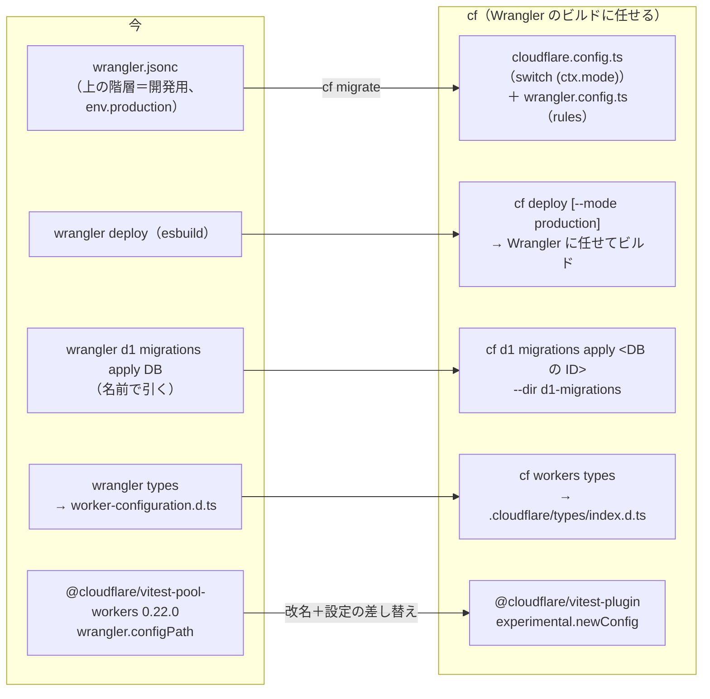
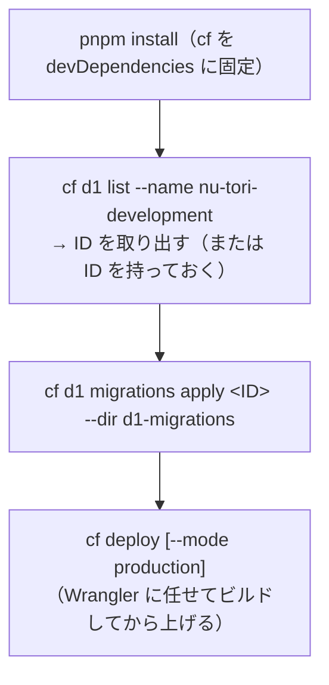

# Cloudflare の新しい CLI「cf」を server/ に使えるか（テスト・設定・CI・ビルド・手作業・成熟度）

調査日: 2026-09-29
対象: このチャットでの問い「2026-09-28 にオープンベータで出た `cf` を `server/` に使えるか」。関係する Issue は無い。`server/` は Cloudflare Workers（Hono、wrangler 4.141.0、esbuild でのビルド）で、Durable Object（SQLite）、D1、R2、Workers AI、ratelimits、独自ドメイン、`secrets.required` を `server/wrangler.jsonc` に書き、テストは `@cloudflare/vitest-pool-workers` 0.22.0、デプロイは GitHub Actions の `wrangler d1 migrations apply` → `wrangler deploy`（開発用 → 本番）で行っている。移るか待つかを決める材料を、一次情報で集める。

> **確認の方法と限界**
> - cf の公式リポジトリ **cloudflare/cf を main のコミット `bf0a0e7`（2026-09-28）で手元に取得**し、README、`packages/cli/CHANGELOG.md`、ソース、リポジトリ直下の `AGENTS.md`、既知の不具合の記録（`test_bugs/`）を読んだ。npm の最新 `cf@1.0.0-beta.5` はタグ `cf@1.0.0-beta.5`（コミット `07c2d44`）で、`bf0a0e7` はその後の README とテストの直しだけ。
> - 設定の定義（`@cloudflare/config`）、Vitest の統合、Vite プラグイン、`cf migrate` の変換（`@cloudflare/codemods`）は **cloudflare/workers-sdk を main のコミット `3bdcd0d`（2026-09-28）で取得**して読んだ。cf が依存する `@cloudflare/config` 0.20.0 は、このチェックアウトの版と同じ。
> - **`cf@1.0.0-beta.5` を scratchpad に入れ、`server/` の追跡ファイルのコピーに対して `cf migrate`・`cf build`・`cf deploy --dry-run`・`cf workers types`・`cf d1 migrations apply --local` を動かし、`@cloudflare/vitest-plugin` 1.3.1 でテストを回した**。リポジトリの `server/` は触っていない。実行で確かめたものは「実行で確認」と書く。cf の送る利用状況（テレメトリ）は、すべて `DO_NOT_TRACK=1` で止めて動かした。
> - ソースや文書の本文で確かめたものは「本文で確認」、本文やソースの流れから推し量ったものは「本文からの読み取り」と書き、何から読み取ったかを添える。探しても記述が無かったものは「本文を探したが記述なし」と書く。
> - **Cloudflare のアカウントへの認証が要る操作（実際のデプロイ、D1 の移行を本物の DB に当てる、AI Gateway やトークンを作る）はしていない。**
> - **cf の GitHub Issues は読めなかった。** この環境のプロキシが、このセッションに付けていないリポジトリへの GitHub の API とウェブの画面を拒んだ（403）。代わりに、cf のリポジトリが自分で管理する既知の不具合の記録 `test_bugs/`（54件）を読んだ。
> - developers.cloudflare.com には、2026-09-29 の時点で cf と `cloudflare.config.ts` のページが見つからなかった（`/llms.txt` と `/workers/llms.txt` の索引に無く、推し量った URL は 404）。cf の細部の出典は、リポジトリのソースと実行の結果になる。
> - 二次情報（まとめ記事、Qiita・Zenn、Stack Overflow）は使っていない。発表の出典としてだけ Cloudflare のブログ記事を使った。出典の番号は末尾の「出典一覧」。

## 要点

- **1. テスト**: `@cloudflare/vitest-pool-workers` は 0.22.0（2026-08-18）で止まり、`@cloudflare/vitest-plugin` 1.0.0 に名前が変わった。**0.22.0 は `cloudflare.config.ts` を読めない**（読む口は改名後の 1.1.0 で足された）。推奨の組み方は `@cloudflare/vitest-plugin` の `cloudflareTest({ experimental: { newConfig: true } })` で、「実験的で、メジャーの版上げなしに変わりうる」「Wrangler の環境、`wrangler.config.ts`、型の書き出しにはまだ対応しない」と書かれている。このリポジトリのテストは、移した設定のままだと Durable Object のつなぎが起動で失敗し、テストの設定でつなぎを手元のクラスに向け直すと 38 件すべて通った（本文で確認、実行で確認）。
- **2. 設定**: `cf migrate` が今の `wrangler.jsonc` の大半を `cloudflare.config.ts` に写した。`vars` は `bindings.text()`、`secrets.required` は `bindings.secret()`、`routes` の `custom_domain` は `domains`、`env.production` は `switch (ctx.mode)` になる。**写せないのは D1 の `migrations_dir`（置き場が無い）と `rules`（`wrangler.config.ts` という別のファイルに移る）**。Durable Object のつなぎと exports は「手で見直す」扱いになる。場所のヒントは設定に書けず、`cf d1 create --primary-location-hint apac`・`cf r2 buckets create --location-hint apac` で渡す。`wrangler types` に当たるのは `cf workers types`（`.cloudflare/types/index.d.ts` に書き出す）（実行で確認）。
- **3. CI**: 認証は `CLOUDFLARE_API_TOKEN`（スコープ付きの API トークンだけ。グローバル API キーは使えない）と `CLOUDFLARE_ACCOUNT_ID` で、今と同じ名前（本文で確認）。**`cf d1 migrations apply` は DB の名前を受け付けず、ID（UUID）を要る**ので、CI は `cf d1 list --name` で ID を引くか、ID を秘密でない値として持つ必要がある（実行で確認）。CI では確認の問いに「はい」で進む（本文で確認）。要るトークンの権限を cf の文書やソースで確かめる手立ては見つからず、確かめられなかった。
- **4. ビルドと移行**: Vite を宣言していない `server/` では、`cf migrate` は **Wrangler のビルド（esbuild）に任せる形**に移し、`cloudflare.config.ts` と `wrangler.config.ts`（`rules` の置き場）を作る。`wrangler.jsonc` は消さない。`cf build`・`cf deploy --dry-run` はそのまま通った。Vite に変えると、**cf は Vite プラグインの v2 ベータを要り（最新の安定版 1.62.0 は拒む）**、Vite の既定のモードが `production` なので **`--mode` を付けないビルドとデプロイが本番の設定を選ぶ**。`.sql` は Vite プラグインが既定で Text として読み、Sentry を含むバンドルもビルドできた（動かしてはいない）（実行で確認、本文で確認）。
- **5. ダッシュボードの手作業**: AI Gateway の作成（`cf ai-gateway gateways create`）、ログを切る（`--collect-logs false`、`--zdr`）、支出の上限（`update` の `--body` に `spend_limits.rules` を渡す。個別の旗は `--spend-limits-enabled` だけ）、API トークンの作成（`cf accounts tokens create --policies`）と権限の一覧（`cf accounts tokens permission-groups list`）は、cf のコマンドで扱える。`cloudflare.config.ts` は Worker と Container だけで、これらは書けない。実際に API が受け付けるかは認証が要るので確かめていない（実行で確認、本文で確認）。
- **6. 成熟度**: npm の最新は `1.0.0-beta.5`。`1.0.0-beta.0`（2026-09-25）から4日で6版、公開リポジトリの履歴は 2026-09-28 の初回の公開からの 11 コミット。`test_bugs/` には対応中の不具合が17件ある。GA の時期は公式に言っていない。Wrangler の保守は、ブログに「オープンベータが終わったら、cf へ案内する Wrangler の最後のメジャー版を出し、ベータが終わってから 18 か月、Wrangler の保守を続ける」とある。エージェント向けの断片は「Wrangler は、それを既に使うプロジェクト（`wrangler.jsonc` など）か、ユーザーが頼んだときだけ。移すよう頼まれない限りそのプロジェクトでは Wrangler を使い続け、頼まれたら `cf migrate` を使う」（本文で確認）。

## 今と、cf に移したときの形



## 1. テストの実行環境

**結論**: 今の `@cloudflare/vitest-pool-workers` 0.22.0 は `cloudflare.config.ts` を読めない。読むには改名後の `@cloudflare/vitest-plugin`（1.1.0 以降）の実験的な `newConfig` を使う。

| 問い | 答え | 確かさ | 出典 |
|---|---|---|---|
| 0.22.0 は読めるか | 読めない。0.22.0 の配布物に `cloudflare.config.ts` を読む処理は無い。`newConfig` の口は `@cloudflare/vitest-plugin` 1.1.0 の変更履歴で「`cloudflare.config.ts` に移ったプロジェクトは、指す Wrangler の設定ファイルが無くなり、Vitest を実際のつなぎで回せなかった。その口を足す」として足された | 本文で確認（npm の tarball と変更履歴） | NPM2、WS1 |
| パッケージの今 | `@cloudflare/vitest-pool-workers` の最後の版は 0.22.0（2026-08-18）。1.0.0（2026-08-20）で `@cloudflare/vitest-plugin` に改名し、最新は 1.3.1（2026-09-28）。移行は `npx @cloudflare/codemods vitest:pool-workers-to-vitest-plugin`（依存、import、テストの `tsconfig.json` の `types` を書き換える）。文書は「パッケージの API と Vitest の設定は変わらない」と書く | 本文で確認 | NPM2、WS1（1.0.0 の項）、DOC1 |
| 推奨の組み方 | `cloudflareTest({ experimental: { newConfig: true } })`。既定でプロジェクト直下の `cloudflare.config.ts` を読み、`{ configPath }` で場所を変えられる。設定の関数には Vite のモード（既定は `"test"`、`--mode` で変える）が `ctx.mode` として渡る。`wrangler` の指定とは併用できない | 本文で確認 | WS1（1.1.0 の項、`src/pool/config.ts`・`src/pool/new-config.ts`） |
| 制約 | 「実験的で、メジャーの版上げなしに変わりうる。Wrangler の環境、`wrangler.config.ts` の道具の設定、型の書き出しにはまだ対応しない」（1.1.0）。ソースでも `// Wrangler environments have no cloudflare.config.ts equivalent yet` とあり、`wrangler.config.ts` を読む処理は無い | 本文で確認 | WS1 |
| 文書の記述 | Vitest の統合の「Configuration」のページに `newConfig` の記述は無い | 本文を探したが記述なし | DOC2 |
| このリポジトリで回すと | 移した `cloudflare.config.ts` のままでは、`ACCOUNT` のつなぎが `nu-tori-development` という名前の Worker を指し（新しい設定は Durable Object のつなぎに `worker` を必ず書く）、テストの実行環境ではその名前の Worker が無いので起動に失敗した。`miniflare: { durableObjects: { ACCOUNT: { className: "AccountDurableObject", useSQLite: true } } }` をテストの設定に足して手元のクラスに向け直すと、9 ファイル 38 件がすべて通った（D1、R2、ratelimits、秘密の値の差し込み、D1 の移行は今のまま動いた） | 実行で確認 | RUN5 |
| 別の直し方 | `cf migrate` はこのつなぎに「手で見直す」と付け、`ctx.exports` の文書を指す。`ctx.exports` は `enable_ctx_exports` の互換フラグで、SQLite の保存先を持つ Durable Object のクラスごとに名前空間のつなぎを自動で用意する。つなぎを消して `ctx.exports.AccountDurableObject` を使う形は試していない | 本文で確認、本文からの読み取り（ラベルの向け先から） | WS3（`bindings.ts`、`follow-ups.ts`）、DOC3 |
| `.sql` を Text で読む rules | `newConfig` のときは `rules` がどこからも入らない（`cloudflare.config.ts` に項目が無く、`wrangler.config.ts` は読まない）。テストの設定の `miniflare.modulesRules` か、Vite の `?raw` で読む形にする必要がある。いまは `.sql` を import するコードが無いので試していない | 本文からの読み取り（`src/pool/config.ts` の流れから） | WS1、WS2 |
| `compatibility_date` の上限 | 1.3.1 は miniflare `5.20260926.0-alpha` を使う。`server/AGENTS.md` の「workerd が対応する日付まで」の決まりはそのまま当てはまる | 本文で確認 | NPM2、WS1 |

## 2. 設定で表せるか（`cloudflare.config.ts`）

**結論**: `cf migrate` で大半が写る。写せないのは D1 の `migrations_dir` と `rules`（別のファイルへ）。場所のヒントは今と同じく設定に書けない。

`cf migrate --no-install` を `server/` のコピーに当てた結果（抜粋）。上の階層は `default:`、`env.production` は `case "production":` になる。

```ts
import { bindings, defineConfig, exports } from "cf/config";

export default defineConfig((ctx) => {
  switch (ctx.mode) {
    case "production": {
      return { worker: { name: "nu-tori-production", domains: ["api.nu-tori.app"], /* … */ } };
    }
    default: {
      return {
        worker: {
          name: "nu-tori-development",
          compatibilityDate: "2026-08-22",
          compatibilityFlags: ["nodejs_compat"],
          entrypoint: "src/index.ts",
          workersDev: false,
          previewUrls: false,
          observability: { enabled: true },
          domains: ["api-dev.nu-tori.app"],
          env: {
            APPLE_BUNDLE_ID: bindings.text("app.nu-tori"),
            BETTER_AUTH_SECRET: bindings.secret(),
            DB: bindings.d1({ name: "nu-tori-development" }),
            PHOTOS: bindings.r2({ name: "nu-tori-development-photos" }),
            ACCOUNT: bindings.durableObject({ worker: "nu-tori-development", exportName: "AccountDurableObject" }),
            AI: bindings.ai({}),
            ACCOUNT_RATE_LIMITER: bindings.rateLimit({ namespace: "1001", simple: { limit: 120, period: 60 } }),
          },
          exports: { AccountDurableObject: exports.durableObject({ storage: "sqlite" }) },
        },
      };
    }
  }
});
```

| `wrangler.jsonc` の項目 | `cloudflare.config.ts` での書き方 | 確かさ | 出典 |
|---|---|---|---|
| `exports` の Durable Object と `storage: "sqlite"` | `exports: { AccountDurableObject: exports.durableObject({ storage: "sqlite" }) }`。`cf migrate` は「手で見直す」と付ける | 実行で確認 | RUN2、WS2（`schema.ts` の `DurableObjectCreatedExportSchema`） |
| `durable_objects.bindings` | `bindings.durableObject({ worker, exportName })`。`worker` は必須で、自分の Worker の名前が入る。デプロイの予行では「defined in nu-tori-development」と出た。テストでは上の節のとおり失敗した | 実行で確認 | RUN2、RUN4、RUN5 |
| D1（`database_name`） | `bindings.d1({ name })`。項目は `name`・`id`・`dev` だけ | 本文で確認 | WS2（`D1BindingSchema`） |
| D1 の `migrations_dir` | **書く場所が無い**。`cf migrate` は「手で移す必要がある」と付ける。移行は `cf d1 migrations apply --dir d1-migrations` の旗で渡す | 実行で確認 | RUN2、CF3（`d1-migrations-no-new-config-path`） |
| R2 | `bindings.r2({ name })`。ほかに `jurisdiction` と `dev` | 本文で確認 | WS2（`R2BindingSchema`） |
| `ai` | `bindings.ai({})` | 実行で確認 | RUN2 |
| `ratelimits`（`namespace_id`・`simple`） | `bindings.rateLimit({ namespace, simple: { limit, period } })`。`period` は 10 か 60 だけ | 本文で確認 | WS2（`schema.ts`） |
| `routes` の `custom_domain` | `domains: ["api-dev.nu-tori.app"]`。変換で `{ pattern, custom_domain: true }` に戻る。独自ドメインでない経路は `triggers: [triggers.fetch({ pattern, zone })]` | 本文で確認 | WS2（`convert.ts` の DOMAINS、`TriggerSchema`） |
| `workers_dev: false`・`preview_urls: false` | `workersDev: false`・`previewUrls: false` | 実行で確認 | RUN2 |
| `observability` | `observability: { enabled: true }`（ログ・トレースの細かい項目もある） | 実行で確認 | RUN2、WS2 |
| `vars` | `bindings.text("…")`（JSON の値は `bindings.json`） | 実行で確認 | RUN2 |
| `secrets.required` | `bindings.secret()`。変換で `secrets.required` に戻る。**省いてよい秘密の値は表せない**（型は必ず `string`） | 実行で確認、本文で確認 | RUN2、WS2（`convert.ts`）、CF3（`bindings-secret-always-required-string`） |
| `rules`（`**/*.sql` を Text） | `cloudflare.config.ts` には無い。Wrangler のビルドのときは `wrangler.config.ts`（`defineWranglerConfig`、`wrangler/experimental-config`）に移る。Vite のときは移さず、Vite プラグインが `.sql` を既定で Text として扱う | 実行で確認、本文で確認 | RUN2、RUN3、WS3（`config-converter.ts` の `TOOLING_FIELDS`）、WS4 |
| `compatibility_flags` | `compatibilityFlags: ["nodejs_compat"]` | 実行で確認 | RUN2 |
| `env.production` | `defineConfig((ctx) => { switch (ctx.mode) { … } })`。`--mode production` で選ぶ。Wrangler の環境の「つなぎは受け継がれない」という決まりは無くなり、各分岐が1つの完全な設定になる | 実行で確認 | RUN2、RUN4 |
| D1・R2 の場所のヒント | 設定には書けない（D1 の項目に場所が無い）。CLI で渡す: `cf d1 create --name … --primary-location-hint apac`、`cf r2 buckets create --name … --location-hint apac` | 実行で確認（`--help`）、本文で確認 | RUN1、WS2 |
| 型の書き出し（`wrangler types`） | `cf workers types [--mode …]`。`.cloudflare/types/index.d.ts` に書き出し、既定で実行環境の型も含める（`--include-runtime`）。`test_bugs/` の「CLI の型の書き出しが無い」という記録（最終確認 2026-09-16）は古く、1.0.0-beta.5 にはこのコマンドがある | 実行で確認 | RUN1、RUN6、CF2（beta.5 の項）、CF3（`no-type-generation-outside-dev`） |

型の書き出しで気づいたこと（実行で確認、RUN6）:

- `cf migrate` が作る `switch (ctx.mode)` の形のままでは、書き出した型の `Env` が空になり、`tsc`（TypeScript 7.0.2）が多数のエラーを出した。分岐をやめて1つのオブジェクトにすると、`Env` に D1・R2・秘密の値などが入った。
- 1つのオブジェクトにしても、本番だけの秘密の値（`POSTHOG_*`）は型に入らず、`entrypoint` が文字列のままだと Durable Object のスタブの型が `DurableObjectStub<undefined>` になった。文書とブログの例は `import * as entrypoint from "./src/index.ts" with { type: "cf-worker" }` の形で書いている（BL1、CF の fixture）。

## 3. CI（GitHub Actions）

**結論**: `cf deploy` と `cf d1 migrations apply` は、今と同じ環境変数で CI から使える形になっている。ただし D1 の移行は DB の ID が要る。



| 問い | 答え | 確かさ | 出典 |
|---|---|---|---|
| 認証 | ①`CLOUDFLARE_API_TOKEN`、②`cf auth login` の OAuth の順で探す。**グローバル API キーとメールの組は使えない**（`allowGlobalAuthKey: false`） | 本文で確認 | CF1（README「Authentication」）、CF7（`lib/auth.ts`） |
| アカウント | ①`CLOUDFLARE_ACCOUNT_ID`、②`cloudflare.config.ts` の `accountId`、③保存した情報、④選ぶ画面（1つなら自動）の順。CI では ① を渡せば問いは出ない | 本文で確認 | CF7（`lib/context.ts`） |
| `.env` から読むもの | beta.3 から、`CLOUDFLARE_API_TOKEN`・`CLOUDFLARE_ACCOUNT_ID` などの決まった名前だけを `.env`・`.env.local`・`.env.<mode>` から読む | 本文で確認 | CF2（beta.3 の項） |
| D1 の移行 | `cf d1 migrations apply <database>`。**DB は UUID か 32 桁の ID だけで、名前とつなぎの名前は受け付けない**（`nu-tori-development` を渡すと「Expected a D1 database ID」で止まった）。移行の置き場は `--dir`（既定 `./migrations`）、記録の表は `--table`（既定 `d1_migrations`）。記録の形・名前・順序は `wrangler d1 migrations apply` と同じで、今の記録をそのまま引き継げる作り | 実行で確認、本文で確認 | RUN7、CF3（`d1-migrations-no-new-config-path`）、CF6 |
| ID の引き方 | `cf d1 list --name <名前>` で探せる（JSON を返す）。一覧は1ページだけ返し、自動で次のページを取らないのは意図した違い | 実行で確認（`--help`）、本文で確認 | RUN1、CF3（`list-no-pagination`） |
| CI での確認の問い | `confirm()` は、TTY でないか CI のとき、既定で「はい」で進み、その旨を標準エラーに出す。`--local` で当てたときも「Using fallback value in non-interactive context: yes」と出て当たった | 本文で確認、実行で確認 | CF6（`lib/prompt.ts`）、RUN7 |
| `cf deploy` | 既定でビルドしてから上げる。旗は `--mode`・`--prebuilt`・`--secrets-file`・`--tag`・`--message`・`--dry-run` など。`--yes` や `--force` は無い。確認の問いが CI で黙って「いいえ」になり作業を飛ばす経路は無いと、cf が自分で調べて記録している | 実行で確認（`--help`）、本文で確認 | RUN1、CF3（`ci-confirmations-silently-answer-no`） |
| 予行 | `cf deploy --dry-run` はトークンもアカウント ID も無しで、ビルド → つなぎの一覧の表示まで通った（`test_bugs/` には「アカウントが要る」とあるが、この版の実行では要らなかった） | 実行で確認 | RUN4、CF3（`deploy-dry-run-resolves-auth-first`） |
| 移していないプロジェクトで使うと | `wrangler.jsonc` だけの今の `server/` で `CI=true cf build` を動かすと、CI では移行を自動でせず（beta.4 の仕様）、自動設定に進んで「検出したフレームワーク（Hono）は自動で設定できない」で失敗した。**cf の `deploy` を使うには `cf migrate` が先に要る** | 実行で確認、本文で確認 | RUN8、CF2（beta.4 の項） |
| 版の出力 | `cf deploy` と `cf workers versions create` は版の ID を機械で読める形で出さない（`WRANGLER_OUTPUT_FILE_PATH` の NDJSON は残る） | 本文で確認 | CF3（`versions-upload-no-json-output`） |
| GitHub Actions の部品 | cf 用のアクションは見つからなかった。npm の依存として入れて `pnpm exec cf …` で呼ぶ形になる。グローバルの cf は、プロジェクトに固定した cf があればそちらに処理を渡す | 本文を探したが記述なし（アクション）、本文で確認（渡す仕組み） | CF1、CF4（`delegate.ts`） |
| トークンの権限 | cf の文書・README・ソースに、`deploy` や `d1 migrations apply` に要る権限の記述は無かった。`cf deploy` はデプロイの部品（`@cloudflare/deploy-helpers`）を Wrangler と共有し、`d1 migrations apply` は D1 の SQL の API を呼ぶので、**今の3つ（Workers の Admin、D1 の編集、ゾーンの Workers Routes の編集）で足りる見込み**だが、実際のトークンでは確かめていない | 本文を探したが記述なし、本文からの読み取り（共有する部品と呼ぶ API から） | CF4、CF6 |
| 利用状況の送信 | cf は既定で利用状況を Cloudflare に送る（コマンドの経路、旗の名前、所要時間、成否、CI かどうか、`cf cli search` の問いの文など。位置の値やファイルの中身は送らない）。`DO_NOT_TRACK=1` か `CF_SEND_TELEMETRY=false` で止まる。Wrangler の設定は読まない | 本文で確認 | CF5 |

## 4. ビルドと移行（`cf migrate`）

**結論**: Vite を使わない `server/` では、`cf migrate` は Wrangler のビルド（esbuild）に任せる形に移し、Vite には変えない。Vite に変えるのは `--bundler vite` を付けたときで、そのときはモードの名前と Vite プラグインの版に気をつける。

| 問い | 答え | 確かさ | 出典 |
|---|---|---|---|
| どちらに移すか | `@cloudflare/vite-plugin` が Wrangler の設定の隣に宣言されていれば Vite、なければ Wrangler（beta.3 から。それまでは常に Vite）。`server/` では「@cloudflare/vite-plugin が宣言されていないので Wrangler のビルドを使う」と出た | 本文で確認、実行で確認 | CF2（beta.3 の項）、RUN2 |
| 何をするか | `cloudflare.config.ts` と `wrangler.config.ts` を作る。**`wrangler.jsonc` は消さない**。git の作業ツリーがきれいでないと止まる（`--force` で越える）。既定で cf を依存に足す（`--no-install` で止める）。`--dry-run` で書かずに見られる。直すべきことは TODO のコメントと、ファイルの頭の `throw new Error("Migration incomplete…")` で残す | 実行で確認 | RUN2 |
| 必要なもの | Wrangler 4.100.0 以上がプロジェクトに入っていること（`wrangler.config.ts` を作るため）。cf が任せる先として受け付けるのは `wrangler` 4.136.0 以上 | 実行で確認、本文で確認 | RUN2、CF8（`known-impls.ts`） |
| 出た「手で直す」 | D1 の `migrations_dir`（2か所）、Durable Object のつなぎと exports の見直し（各2か所）、依存を入れていないこと。`env` は `switch (ctx.mode)` にしたという知らせ | 実行で確認 | RUN2 |
| Wrangler のビルドでの結果 | `cf build` は Wrangler に任せ、`.cloudflare/output/v0/`（Build Output）を書いた。`--mode` 無しで開発用、`--mode production` で本番（名前と独自ドメインが本番のものになった）。`cf deploy --dry-run` も通った | 実行で確認 | RUN4 |
| Vite に変えると: 版 | cf は **Vite プラグインの v2 ベータ**を要る。1.62.0（最新の安定版）を入れると「cf のローカルの実行環境と互換でない。`@cloudflare/vite-plugin@beta` を入れる」で止まった。v1 を受け付けなくなったのは beta.3 から | 実行で確認、本文で確認 | RUN3、CF2（beta.3 の項）、CF8 |
| Vite に変えると: モード | Vite の既定のモードは `vite build` で `production`。`cf migrate --bundler vite` は「Wrangler の環境 `production` は Vite の既定のモードとぶつかる。名前を変えるか割り当て直す」と止め、実際に `--mode` 無しの `cf build` は `mode: "production"` を記録し、`cf deploy --dry-run` は本番の名前と D1・R2 を表示した。**今の名前のままだと、`--mode` を付け忘れたデプロイが本番に行く** | 実行で確認、本文で確認 | RUN3、WS3（`config-converter.ts` の `vite-mode-environment-conflict`） |
| Vite に変えると: Durable Object | ビルドは通り、バンドルは `AccountDurableObject` を書き出し、設定の `exports` も `storage: "sqlite"` のまま出た | 実行で確認 | RUN3 |
| Vite に変えると: `.sql` の rules | Vite プラグインは `.txt`・`.html`・`.sql` を既定で Text のモジュールとして扱う。`rules` は移されない（「Vite のときは Wrangler 固有の項目 `rules` を移さない」と出る） | 本文で確認、実行で確認 | WS4（`plugins/additional-modules.ts`、`build-output.ts`）、RUN3 |
| Vite に変えると: Sentry | `@sentry/cloudflare` を含むバンドルはビルドでき（Sentry の文字列が残る）、`nodejs_compat` も設定に残った。**動かしてアラームや例外が Sentry に届くかは確かめていない** | 実行で確認（ビルドまで） | RUN3 |
| 設定の置き場の変わりやすさ | Vite プラグイン 1.62.0（2026-09-28）で、`cloudflare.config.ts` の書き方の import 元が `cf/config` に変わり、`@cloudflare/vite-plugin/experimental-config` の書き出しが無くなった（マイナーの版で）。`@cloudflare/config` は package.json に「まだ外で使えるほど安定していない。API は予告なく変わりうる」と書く | 本文で確認 | WS4（CHANGELOG 1.62.0）、WS2（`package.json`） |
| Wrangler 側の対応 | Wrangler 自身も `--experimental-new-config` で `cloudflare.config.ts` を読めるが、`dev`・`build`・`deploy`・`versions deploy`・`versions upload` の5つだけで、`d1 migrations` と `types` と `secret` は古い設定だけ（Wrangler 4.131.2 時点の記録） | 本文で確認 | CF3（`new-config-unsupported-outside-five-commands`） |

## 5. ダッシュボードでの手作業を代われるか

**結論**: AI Gateway、支出の上限、ログ、API トークンは、cf の生成したコマンド（Cloudflare の API をそのまま映したもの）で扱える。`cloudflare.config.ts` では扱えない。どれも実際のアカウントでは試していない。

| 手作業 | cf で | 確かさ | 出典 |
|---|---|---|---|
| AI Gateway の作成 | `cf ai-gateway gateways create --id … [--collect-logs …] [--rate-limiting-*] [--workers-ai-billing-mode postpaid]`（`cf cli search "create an AI gateway"` の1件目） | 実行で確認（search と `--help`） | RUN1 |
| ログを切る | `create`・`update` の `--collect-logs`（`update` では必須）。ほかに `--zdr`、`--log-management`、`--logpush` | 実行で確認（`--help` と `cf schema`） | RUN1 |
| 支出の上限 | 個別の旗は `update` の `--spend-limits-enabled` だけ。上限の規則（`spend_limits.rules[]`: `limit`・`limitType: "cost"`・`window`・`model`・`provider`・`metadata`）は SDK の型にあり、`update` の `--body` に JSON で渡せる。`--dry-run` で `PUT /accounts/<account-id>/ai-gateway/gateways/<id>` に `spend_limits` が載ることを確かめた。`create` の型には `spend_limits` が無いので、作ってから `update` する形になる。`update` は PUT（全体の置き換え）で、`collect_logs` などの必須の項目も一緒に送る。文書も「支出の上限はゲートウェイごとに、ダッシュボードか API で設定する。1つに 20 規則まで」と書く | 実行で確認、本文で確認 | RUN9、CF9、DOC4 |
| API トークンの作成 | `cf accounts tokens create --name … --policies '<JSON>' [--expires-on …] [--condition-request-ip-in …]`（アカウントの持つトークン）。ユーザーの持つトークンは `cf user tokens create` | 実行で確認（search と `--help`） | RUN1 |
| 権限の一覧 | `cf accounts tokens permission-groups list`、`cf user tokens permission-groups list`、`cf iam permission-groups list` | 実行で確認（search） | RUN1 |
| 秘密の値 | `cf workers secrets update <名前> --worker … --text …`、`cf workers secrets bulk`（beta.4 で出した） | 実行で確認（`--help`）、本文で確認 | RUN1、CF2 |
| `cloudflare.config.ts` で | 最上位の項目は `accountId`・`complianceRegion`・`worker`・`containers` だけ。ブログは「近いうちにポリシー、ゾーン、DNS なども設定で書けるようにする」と書くが、今は無い | 本文で確認 | WS2（`InputConfigSchema`）、BL1 |
| 探し方の決まり | `--help` の頭に「エージェントは `--help` をたどらず、まず `cf cli search` を使う。問いには名前・メール・ドメイン・ID・トークンを入れない」と出る。`cf schema <コマンド>` で API の要求の形を見られる | 実行で確認 | RUN1 |

## 6. 成熟度とリスク

| 問い | 答え | 確かさ | 出典 |
|---|---|---|---|
| 版 | npm の `latest` は `1.0.0-beta.5`（2026-09-28 14:41 UTC）。`cf` という名前は 2013 年の別物（0.0.1〜0.0.3）を引き継ぎ、2026-04 から 0.x を出して、2026-09-25 に `1.0.0-beta.0` | 本文で確認 | NPM1 |
| 変更の頻度 | 0.x は 2026-06〜09 に1〜2週ごと。`1.0.0-beta.0`〜`beta.5` は 2026-09-25〜28 の4日で6版。beta.3 では Vite プラグイン v1 を受け付けなくなり、`cf telemetry` を `cf cli telemetry` に移すなど、ベータの中でも振る舞いが変わる。リポジトリの `AGENTS.md` は「直したらすぐパッチ版を出す（分・時間の単位で）」を方針に掲げる | 本文で確認 | NPM1、CF2、CF4 |
| 公開リポジトリの履歴 | 2026-09-28 の「Initial public release of cf」から 11 コミット、タグは `cf@1.0.0-beta.4` と `cf@1.0.0-beta.5` だけ（それより前の履歴は公開されていない） | 本文で確認 | CF1 |
| 既知の不具合 | `test_bugs/` の 54 件のうち、対応中 17、直した 34、意図した違い 2、見送り 1。この構成に関わる対応中のもの: `bindings.secret()` で省ける秘密の値を表せない、Wrangler の `createTestHarness()` が新しい設定を読めない、Wrangler の新しい設定の対応が5コマンドだけ、版の ID を機械で読める形で出さない、上の階層に巻き上げた `node_modules` のパッケージを見つけられない（pnpm の既定の配置では当たらない見込み） | 本文で確認 | CF3 |
| GitHub Issues | 読めなかった（この環境のプロキシが拒んだ） | 確かめられなかった | — |
| 大きさ | npm の配布物は展開で約 23 MB、依存（miniflare など）込みで `node_modules` は約 230 MB。Node 22 以上 | 本文で確認、実行で確認 | NPM1 |
| 新しすぎる版と pnpm | pnpm 12.6.0 で `cf@1.0.0-beta.5` などを足すと、`pnpm-workspace.yaml` に `minimumReleaseAgeExclude` の項目が自動で足された（公開から日の浅い版を除外に入れた） | 実行で確認 | RUN5 |
| GA の見込み | 公式の時期の発表は見つからなかった。リポジトリの `AGENTS.md` には、配布の形を検討した設計メモに「birthday-week GA」を遅らせないという記述と、「残りの GA の作業は実装とテストを正とする」という記述がある（公式の約束ではなく、開発者向けの内部の記述） | 本文を探したが記述なし（公式の時期）、本文で確認（内部の記述） | BL1、CF4 |
| Wrangler の保守期間 | ブログの原文: 「When the open beta ends we will release a final major version of Wrangler that directs you and your agent to use cf. We'll continue to provide maintenance support for Wrangler for 18 months after the beta ends, to give you time to migrate.」起点は「ベータが終わってから」で、ベータの終わりの日は示されていない。リポジトリの `AGENTS.md` は「cf は Wrangler の次の版。`wrangler` は、その bundler から移れない人のために `@cloudflare/wrangler-legacy` という任せ先として残るかもしれない」と書く | 本文で確認 | BL1、CF4 |
| エージェント向けの断片 | ブログの「Copy prompt」の中身。ユーザー単位の指示ファイル（Claude Code は `~/.claude/CLAUDE.md`）に足すよう書き、**リポジトリの AGENTS.md や CLAUDE.md ではない**と明記する。断片の本文は下に原文で引く | 本文で確認 | BL1 |
| 文書 | developers.cloudflare.com に cf と `cloudflare.config.ts` のページは見つからなかった。Vitest の文書も `newConfig` に触れていない | 本文を探したが記述なし | DOC2、DOC5 |

ブログの断片（原文、見出しの版は `v20260928`）:

```markdown
## Cloudflare CLI - cf - v20260928

`cf` is Cloudflare's current CLI and covers the whole Cloudflare platform. Prefer it over Wrangler: create projects with `cf init`, develop with `cf dev`, deploy with `cf deploy`, and manage account resources with `cf <product> …` (for example `cf d1 list`).

Wrangler is only for projects that already use it – a `wrangler.jsonc`, `wrangler.json` or `wrangler.toml` file – or when the user asks for it. Keep using Wrangler in those projects unless asked to migrate, and use `cf migrate` in this case.

`cf` commands differ from Wrangler's; check `cf --help` or `cf cli search <what you want to do>` instead of guessing. If a `cf` command fails in a project that doesn't use Wrangler, don't fall back to Wrangler (including `npx wrangler`) without offering to report it.
```

## 決めるときの材料

移る・待つのどちらにも効く事実を並べる。どちらにするかは書かない。

**移るときに要る作業（この調査で見えたもの）**

- `cf migrate` の後に手で直すもの: Durable Object のつなぎ（テストで自分の Worker を指して失敗する。テストの設定で向け直すか `ctx.exports` に変える）、D1 の `migrations_dir`（CI の `--dir` へ）、`switch (ctx.mode)` のままでは型が空になる点、`entrypoint` を import の形にするか（Durable Object のスタブの型）、本番だけの秘密の値の型（1、2 節）。
- テストは `@cloudflare/vitest-plugin` への改名と `experimental.newConfig` への差し替え。`newConfig` は実験的で、メジャーの版上げなしに変わりうる（1 節）。
- CI は、D1 の移行に DB の ID を渡す手順が増える（3 節）。
- `scripts/check server` の `wrangler types` は `cf workers types` に、`tsconfig.json` の `types` の向け先も変わる（2 節）。
- `server/AGENTS.md` の「構成の正本は `wrangler.jsonc`」「つなぎは環境に受け継がれない」「`wrangler types`」「`wrangler secret`」などの記述と、`docs/agents/dependencies.md` の `@cloudflare/vitest-pool-workers` の記述が変わる。
- `site/` は別の Worker（`site/wrangler.jsonc`、静的な assets と独自ドメイン）で、wrangler の版を `server/package.json` から借りている。`server/` だけを移しても、`site/` の出し方は wrangler のまま残せる（`assets` と `domains` は新しい設定にもある: WS2）。

**待つときに効く事実**

- Wrangler は、ベータが終わってから 18 か月保守される。ベータの終わりの日は示されていない（6 節）。
- ブログの断片は、既に `wrangler.jsonc` のあるプロジェクトでは頼まれない限り Wrangler を使い続けるよう、エージェントに指示する（6 節）。
- `@cloudflare/config` は「まだ外で使えるほど安定していない」と自ら書き、設定の書き方の import 元がマイナーの版で変わった例がある（4 節）。
- cf の公式の文書（developers.cloudflare.com）はまだ無く、細部はソースと `--help` が頼り（6 節）。

**cf を移すかどうかと別に効く事実**

- `@cloudflare/vitest-pool-workers` は 0.22.0（2026-08-18）で止まり、以降の直しは改名後の `@cloudflare/vitest-plugin` にだけ入る。名前が違うので、Dependabot の版上げの PR としては来ない見込み（本文からの読み取り: パッケージ名が別であることから）。改名の codemod があり、文書は「API と設定は変わらない」と書く（1 節）。
- cf を使わなくても、AI Gateway の作成、支出の上限、ログの設定、API トークンの作成を、cf の生成コマンドで手作業の代わりにできる。これは `server/` の構成とは独立に使える（5 節）。ただし cf は既定で利用状況を送るので、使うなら `DO_NOT_TRACK=1` などで止めるかを決めることになる（3 節）。
- Vite に変えるなら、今の環境の名前 `production` は Vite の既定のモードとぶつかり、`--mode` の付け忘れが本番へのデプロイになる。Wrangler のビルドに任せる形なら、`--mode` 無しは開発用になる（4 節）。

**確かめられなかったこと**

- 実際のデプロイ、D1 の移行を本物の DB に当てること、要るトークンの権限、AI Gateway の支出の上限を API が受け付けるか（認証が要るため）。
- 自分の Worker を指す Durable Object のつなぎを、本番のデプロイの API がどう扱うか（予行では表示まで）。
- Vite でビルドした Worker を動かして、Sentry に例外とアラームの失敗が届くか。
- `newConfig` のテストで `.sql` を Text で読めるか（いまは `.sql` を import するコードが無い）。
- cf の GitHub Issues の中身。

## 出典一覧

### ブログ

- BL1: Introducing cf: the agentic CLI for the entire Cloudflare API（2026-09-28、本文と「Copy prompt」の中身を取得） — https://blog.cloudflare.com/cloudflare-cf-cli-launch/

### cf のリポジトリ（cloudflare/cf、main のコミット `bf0a0e7`。npm の `1.0.0-beta.5` はタグ `cf@1.0.0-beta.5` = `07c2d44`）

- CF1: `README.md`（Authentication、Projects、Local resources）とコミット履歴 — https://github.com/cloudflare/cf
- CF2: `packages/cli/CHANGELOG.md`（1.0.0-beta.3〜beta.5 の項） — https://github.com/cloudflare/cf/blob/main/packages/cli/CHANGELOG.md
- CF3: `test_bugs/`（既知の不具合の記録。`vitest-pool-workers-no-new-config`、`d1-migrations-no-new-config-path`、`new-config-unsupported-outside-five-commands`、`no-type-generation-outside-dev`、`ci-confirmations-silently-answer-no`、`deploy-dry-run-resolves-auth-first`、`bindings-secret-always-required-string`、`list-no-pagination`、`versions-upload-no-json-output`、`impl-discovery-ignores-hoisted-node-modules`、`known-impls-wrangler-minimum-too-low` ほか） — https://github.com/cloudflare/cf/tree/main/test_bugs
- CF4: リポジトリ直下の `AGENTS.md`（Core positioning、配布の設計メモ、Planning status、`lib/delegate.ts` の説明） — https://github.com/cloudflare/cf/blob/main/AGENTS.md
- CF5: `packages/cli/telemetry.md` — https://github.com/cloudflare/cf/blob/main/packages/cli/telemetry.md
- CF6: `packages/cli/src/commands/d1/migrations/apply.ts`、`packages/cli/src/lib/prompt.ts`（`confirm`）
- CF7: `packages/cli/src/lib/auth.ts`（`getAuthToken`）、`packages/cli/src/lib/context.ts`（アカウント ID の順）
- CF8: `packages/cli/src/commands/dev/known-impls.ts`（`wrangler` は 4.136.0 以上、Vite プラグインは v2）
- CF9: `packages/cli/src/sdk/sdk/api/resources/aiGateway/resources/gateways/client/requests/UpdateGatewaysRequest.ts`・`CreateGatewaysRequest.ts`

### workers-sdk（cloudflare/workers-sdk、main のコミット `3bdcd0d`）

- WS1: `packages/vitest-plugin/`（`CHANGELOG.md` の 1.0.0・1.1.0・1.2.0・1.3.x の項、`src/pool/new-config.ts`、`src/pool/config.ts`） — https://github.com/cloudflare/workers-sdk/tree/main/packages/vitest-plugin
- WS2: `packages/config/`（`src/schema.ts`、`src/convert.ts`、`src/definition.ts`、`src/public.ts`、`package.json` の description。版 0.20.0） — https://github.com/cloudflare/workers-sdk/tree/main/packages/config
- WS3: `packages/codemods/src/codemods/wrangler-to-cf/`（`config-converter.ts`、`bindings.ts`、`exports.ts`、`follow-ups.ts`）。`cf migrate` の変換の本体 — https://github.com/cloudflare/workers-sdk/tree/main/packages/codemods
- WS4: `packages/vite-plugin-cloudflare/`（`src/plugins/additional-modules.ts`、`src/plugins/build-output.ts`、`CHANGELOG.md` の 1.62.0） — https://github.com/cloudflare/workers-sdk/tree/main/packages/vite-plugin-cloudflare

### npm の登録簿

- NPM1: `cf`（`dist-tags.latest` = 1.0.0-beta.5、各版の公開日、依存、`engines.node` = `>=22`、`exports` の `./config`、展開の大きさ） — https://registry.npmjs.org/cf
- NPM2: `@cloudflare/vitest-pool-workers`（最後の版 0.22.0、2026-08-18。tarball を展開して `cloudflare.config` を読む処理が無いことを確かめた）、`@cloudflare/vitest-plugin`（1.0.0 が 2026-08-20、`latest` = 1.3.1）、`@cloudflare/vite-plugin`（`latest` = 1.62.0、`beta` = 2.0.0-beta.sha-ad79608dd）、`@cloudflare/config`（0.20.0）、`wrangler`（`latest` = 4.143.0） — https://registry.npmjs.org/

### Cloudflare の文書（developers.cloudflare.com、各ページの `index.md` を取得）

- DOC1: Migrate to Vitest plugin — https://developers.cloudflare.com/workers/testing/vitest-integration/migration-guides/migrate-to-vitest-plugin/
- DOC2: Vitest integration Configuration（`newConfig` の記述なし） — https://developers.cloudflare.com/workers/testing/vitest-integration/configuration/
- DOC3: Context (ctx)（`exports`） — https://developers.cloudflare.com/workers/runtime-apis/context/
- DOC4: AI Gateway Spend limits — https://developers.cloudflare.com/ai-gateway/features/spend-limits/
- DOC5: 索引（cf と `cloudflare.config.ts` のページなし） — https://developers.cloudflare.com/llms.txt 、https://developers.cloudflare.com/workers/llms.txt

### 実行の記録（2026-09-29、`cf@1.0.0-beta.5`、Node 22、pnpm 12.6.0、`DO_NOT_TRACK=1`、認証なし。`server/` の追跡ファイルのコピーで）

- RUN1: `cf --help`、各コマンドの `--help`、`cf schema`、`cf cli search`（AI Gateway の作成・支出の上限・ログ、API トークン、D1 の移行、型の書き出し、D1・R2 の作成、秘密の値）
- RUN2: `cf migrate --dry-run --no-install` と `cf migrate --no-install`（Wrangler のビルド）。できた `cloudflare.config.ts`・`wrangler.config.ts` と「手で直す」の一覧
- RUN3: `cf migrate --bundler vite`、`@cloudflare/vite-plugin` 1.62.0 と 2.0.0-beta.sha-ad79608dd での `cf build`、`cf deploy --dry-run`
- RUN4: Wrangler のビルドでの `cf build`、`cf build --mode production`、`cf deploy --dry-run`
- RUN5: `@cloudflare/vitest-plugin` 1.3.1 の `experimental.newConfig` で `vitest run`（そのままでは起動に失敗、Durable Object のつなぎを向け直して 38 件が通過）
- RUN6: `cf workers types` と `tsc`（`switch` の形と1つのオブジェクトの形で比べた）
- RUN7: `cf d1 migrations apply <仮の UUID> --local --dir d1-migrations`（当たった）と、名前を渡したときのエラー、認証なしのエラー
- RUN8: 移していないコピーで `CI=true cf build`（自動設定に進み、Hono を設定できず失敗）
- RUN9: `cf ai-gateway gateways update <仮の ID> --body '<spend_limits を含む JSON>' --dry-run`
