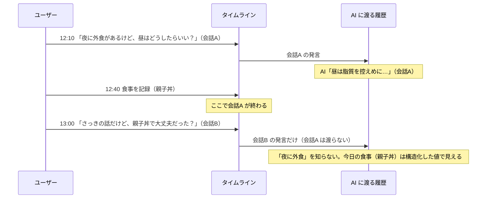
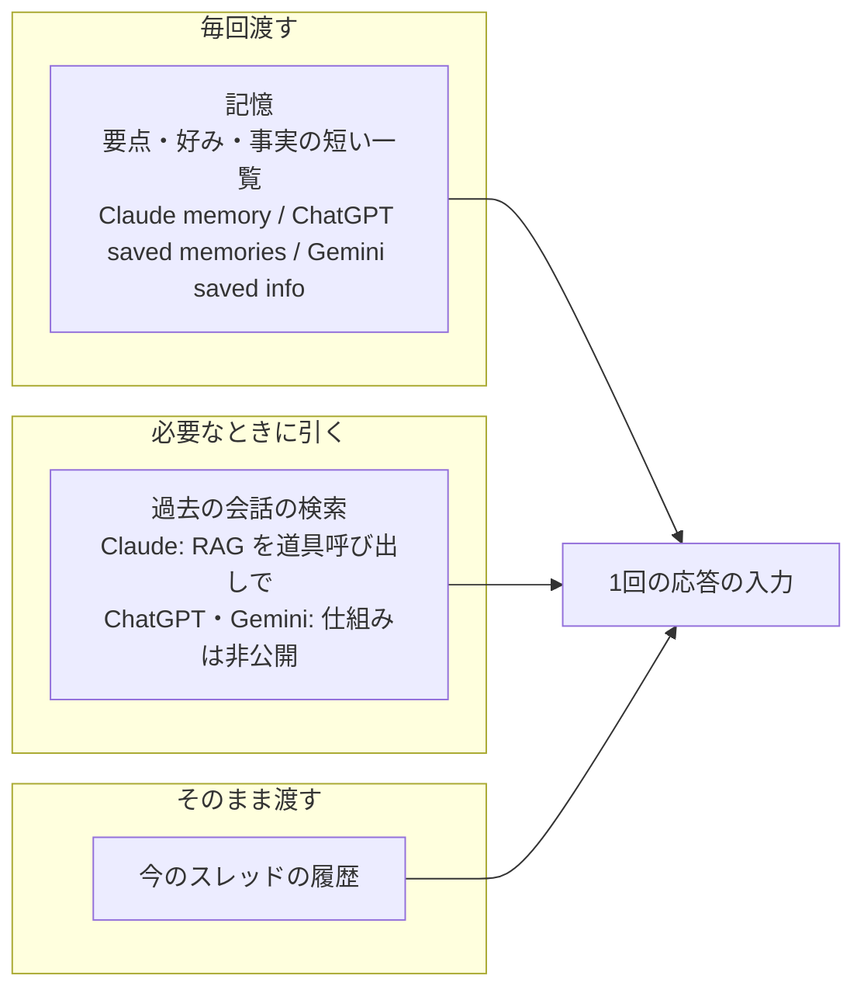
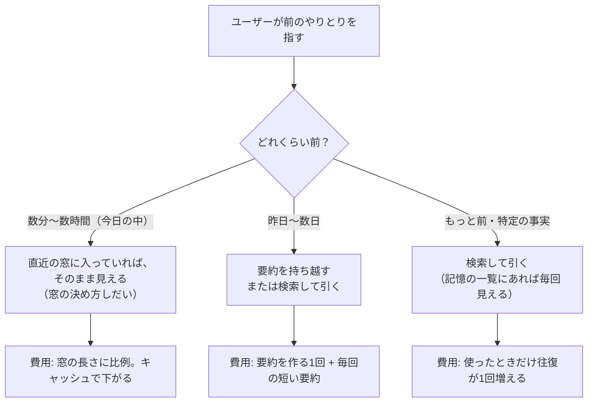
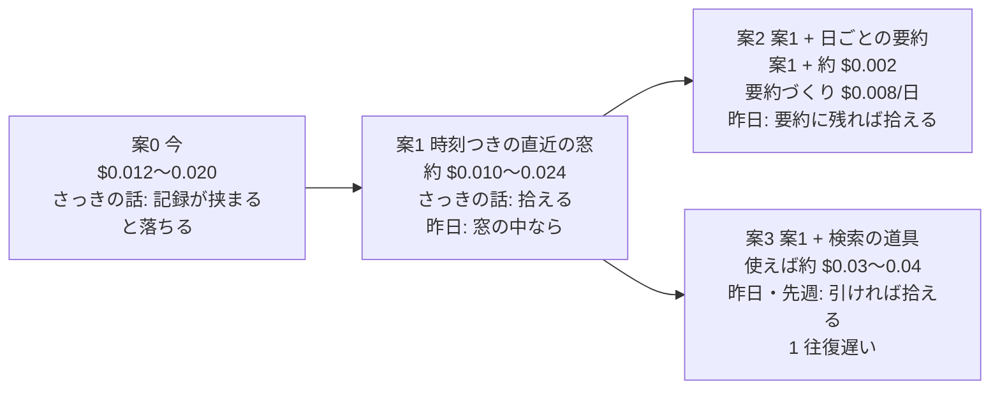

# 会話で AI に渡す履歴の範囲と、セッションをまたぐ文脈の持ち越し

調査日: 2026-10-10
対象: 会話で AI（Claude Sonnet 5）に渡す履歴の範囲。今の決定は「この会話の直近 20 発言」で、ほかの会話は渡さない（`GLOSSARY.md` の「会話」の定義により、あいだにユーザーが入れた食事か体重記録があると会話が区切れる）。少し前のやりとりを「さっきの話だけど」「昨日言ってたやつ」と指したときに、区切りのせいで AI が「何のことか分からない」と返すのではないか、という懸念を確かめるために、主なチャット製品の持ち越し方、健康・コーチングのアプリの事例、長い会話の文脈の扱いの手法、Anthropic の公式の指針と料金を集める。

> **確認の方法と限界**
> - Anthropic（platform.claude.com のドキュメント、claude.com の料金ページ、anthropic.com のエンジニアリングブログ、support.claude.com）、Google（support.google.com の Gemini と Google Health のヘルプ、blog.google）、Oura と Replika のヘルプ（Zendesk）、arXiv の論文の要旨の**本文を直接取得して読んだ**。本文で確かめた主張は「本文で確認」と書く。
> - 本文の記述から推し量ったものは「本文からの読み取り」と書き、何から読み取ったかを添える。nu-tori に当てはめた部分（案と費用の見積もり）は、ほとんどがこれに当たる。
> - 本文や関連ページを探しても記述が無かったものは「本文を探したが記述なし」と書く。
> - **OpenAI のページ（help.openai.com、openai.com、chatgpt.com）は 403 で本文を取得できなかった。** ChatGPT の Memory の記述は、検索エンジンが返した help.openai.com の抜粋だけを根拠にしていて、「検索の抜粋で確認（本文は未取得）」と書く。web.archive.org も取得できなかった。
> - **WHOOP のページ（whoop.com）も 403 で取得できなかった。** WHOOP の「My Memory」は検索の抜粋でしか見ておらず、本文の根拠にはしていない。
> - MyFitnessPal、MacroFactor、Lose It、Noom、Snapchat My AI、Inflection Pi は、履歴の渡し方を書いた公式のヘルプを見つけられなかった。報道やまとめ記事にしか記述が無く、使っていない。
> - 論文は arXiv の要旨だけを読み、本文の実験の細部は読んでいない。
> - 日本語のトークン数（1発言が何トークンか）は Anthropic の本文に記述が無い。費用の見積もりの発言の長さは仮定で、トークン計数の API で実測して確かめる必要がある。
> - 二次情報（解説ブログ、まとめ記事、コミュニティ投稿、報道）は使っていない。

## 結論の要約

- **主なチャット製品は、どれも「スレッドの中の履歴をそのまま渡す」のとは別に、スレッドをまたぐ持ち越しの仕組みを持っている。** 中身は2種類に分かれる。(1) 要点を書き出して毎回渡す「記憶」（Claude の memory、ChatGPT の saved memories、Gemini の saved info、Oura Advisor の memories、Google Health Coach の自動保存）と、(2) 過去の会話を検索して引く仕組み（Claude の「Search and reference chats」は RAG を道具呼び出しで使う）【本文で確認 C1,G1,G2,H1,H2】【ChatGPT は検索の抜粋で確認 O1】。
- **Claude の memory は、既定で健康の話題を記憶しない**（「By default, Claude does not store topics related to personal or sensitive subject matter, like your health」）【本文で確認 C1】。汎用のチャットが健康の話題の持ち越しに慎重なのと、nu-tori の会話がほぼ健康の話題であることは、向きが逆になる【本文からの読み取り】。
- **1本の流れの UI で AI と話す製品の、履歴の渡し方を公開しているものは少ない。** Replika は1本のチャットで、記憶を「Memory タブに見えるもの」と「会話の履歴全体の傾向から引く奥の仕組み」の層で持つ【本文で確認 H4】。Oura Advisor はスレッド式だが、「同じ日のスレッドは、同じ入口から開けば自動で続く」【本文で確認 H1】。日で続きを決める例として nu-tori に近い【本文からの読み取り】。
- **長い会話を扱う手法は、直近の窓、要約（compaction）、検索（RAG と just-in-time の取得）、記憶の書き出し（structured note-taking・memory tool）の組み合わせが公式の指針になっている。** Anthropic は「文脈は多いほど良いのではなく、トークンが増えると想起の精度が落ちる（context rot）」とし、「高い信号の最小のトークンの集合」を探すことを勧める【本文で確認 C5,C6】。研究でも、検索で引く方法と、要約して持ち越す方法が、素の方法より長い会話で良いと報告されている【本文で確認 R3】。ただし、時刻をまたいだ推論（「昨日言ってた」）は今も弱い【本文で確認 R1,R2】。
- **Sonnet 5 の料金は、入力 $2 / MTok、出力 $10 / MTok、キャッシュの書き込み（5分）$2.50、（1時間）$4、キャッシュの読み出し $0.20**【本文で確認 C2,C3】。導入時の価格とされていた $2/$10 は標準の価格になり、2026-09-01 の $3/$15 への値上げは行われない【本文で確認 C2】。今の見込み（入力 4k・出力 400）は $0.008 + $0.004 = **$0.012** で、「約 $0.01」は合っている【本文からの読み取り】。
- **プロンプトキャッシュは、先頭から完全に同じ部分にしか効かない**（「Cache hits require 100% identical prompt segments」）【本文で確認 C4】。「直近 N 件」のように毎回1件ずつ窓の始まりがずれる渡し方は、履歴の部分のキャッシュが効かない【本文からの読み取り C4】。
- **nu-tori に当てはめた案（後述）**: 案1「会話の区切りをやめ、時刻と記録の印をつけた直近の窓を渡す」は、1回あたり約 $0.02（キャッシュが効けば約 $0.01）で「さっきの話」を拾える。案2「案1 + 日ごとの会話の要約を直前 7 日分」は、さらに 1 回あたり約 +$0.002 で「昨日言ってたやつ」の多くを拾える。案3「案1 + 過去の発言を検索する道具」は、使ったときだけ約 $0.03〜$0.04 で、古い話も拾えるが、引けるかどうかは検索の当たり外れによる【本文からの読み取り。発言の長さは仮定】。

### 今の決定で「さっきの話」が落ちる場面

次の図は、今の決定（会話ごとの直近 20 発言）で、AI に何が渡るかの読み取り。

AI は今日の食事の構造化した値から「親子丼を食べた」ことは分かるが、「夜に外食がある」という会話A の中身は分からない【本文からの読み取り: 今の決定の「ほかの会話は渡さない」から】。

## 問い1: 主なチャット製品が、セッションをまたぐ文脈をどう扱っているか

### Claude（claude.ai）

ヘルプ記事「Use Claude's chat search and memory to build on previous context」【C1】。

- **過去の会話の検索**: 「These searches use Retrieval-Augmented Generation (RAG) and will appear as tool calls during your conversations.」【本文で確認 C1】。検索の範囲はプロジェクトの外のすべての会話で、プロジェクトの中ではそのプロジェクトに限る。有料のプラン（Pro、Max、Team、Enterprise）で使える【本文で確認 C1】。検索の結果は元の会話へのリンクを持つ【本文で確認 C1】。
  - つまり、Claude は過去の会話を毎回まるごと渡すのではなく、モデルが必要と判断したときに道具として検索する【本文からの読み取り:「tool calls」】。
- **記憶（memory）**: 「Claude saves memory as a set of individual topics as you chat, rather than summarizing conversations after they end.」【本文で確認 C1】。「remember this」と言えばそれも保存する。記憶は役割・プロジェクト、人と場所、好み、進行中の仕事などを持つ【本文で確認 C1】。無料・Pro・Max のプランで既定で有効（「Memory is on by default for Free, Pro, and Max plans.」）【本文で確認 C1】。
  - 旧来の仕組み（legacy）は、会話を 24 時間ごとにまとめ直した要約を「every new standalone conversation」の文脈として渡していた（「This synthesis is updated every 24 hours.」）【本文で確認 C1】。今の仕組みは、会話の最中に話題ごとに更新する【本文で確認 C1】。
  - **健康の話題は既定で記憶しない**: 「By default, Claude does not store topics related to personal or sensitive subject matter, like your health」【本文で確認 C1】。
  - 記憶の中身は、設定で見る・直す・消すことができ、1つの会話だけ記憶を切ることもできる。シークレットの会話（incognito）は記憶にも検索にも入らない【本文で確認 C1】。
  - 会話を消しても、その会話から作った記憶は消えない（「When a conversation expires or is deleted, related memory entries generated from it won't be removed」）【本文で確認 C1】。
- 記憶を新しい会話にどう差し込むか（毎回システムプロンプトに入れるのか、検索するのか）は、今の仕組みについては書かれていない【本文を探したが記述なし C1】。

### ChatGPT（OpenAI）

**本文は 403 で読めず、以下は help.openai.com の Memory FAQ（「Memory in ChatGPT」）の検索の抜粋だけによる**【検索の抜粋で確認（本文は未取得） O1】。

- 2つの設定がある。「Reference saved memories」（ユーザーが覚えるよう頼んだもの、または役に立つと判断して保存したもの。会話の履歴とは別に保存される）と、「Reference chat history」（過去の会話の関連する情報を使って、以後の応答を合わせる）。
- 「Reference saved memories」を切ると「Reference chat history」も切れる。
- 過去の会話のすべてを覚えているわけではなく、常に覚えておいてほしいことは saved memories に入れるよう案内している。
- どの記憶を前に出すかは、新しさと、その話題を話す頻度などで決める。応答の下の「Sources」で、使った記憶・過去の会話・カスタム指示を見られる。
- 一時的な会話（Temporary Chat）は記憶を使わず、新しい記憶も作らない。
- 「improved memory」は、関連する文脈の広い要約を更新し続ける仕組みで、旧来の saved memories は個別の項目の明示的な一覧である、という説明が抜粋にある。

過去の会話を「検索して引く」のか「要約して毎回渡す」のかの仕組みは、抜粋からは確かめられなかった【本文を取得できず】。

### Gemini（Google）

- ヘルプ「Save info and reference past chats in Gemini Apps」: ユーザーが覚えるよう頼んだ情報は「Personal context」に保存され（「This information will be stored in your Personal context.」）、使ったときは応答の下の「Sources and related content」に「Your saved info」と出る。応答の前に過去の会話を見るよう頼むこともできる。18 歳未満は使えない。Gemini Live の会話では使えない【本文で確認 G1】。
- ヘルプ（past chats / memory）: Gemini は「can learn from your chats to understand more about you and your world」。18 歳以上、個人の Google アカウント、Keep Activity が有効であることが条件。Gems と Live では使えない。「Did you use any info from past chats?」と聞けば、過去の会話を使ったか確かめられる【本文で確認 G2】。要約で持つのか検索で引くのかは書かれていない【本文を探したが記述なし G2】。
- Google のブログ（2025-08-13）: 過去の会話から「Gemini remembers key details and preferences you've shared」。この設定は既定で有効。一時的な会話（Temporary Chats）は個人化に使われず、最長 72 時間保持される【本文で確認 G3】。

### 3社に共通すること

- 3社とも「今のスレッドの履歴」とは別に、スレッドをまたぐ情報を「短い記憶」と「過去の会話」の2層で持っている【本文で確認 C1,G1,G2】【ChatGPT は検索の抜粋 O1】。
- 3社とも、使ったことを見せる（Claude は検索の道具呼び出しと元の会話へのリンク、ChatGPT は Sources、Gemini は「Your saved info」）。記憶を見る・直す・消す操作と、記憶を使わない会話（シークレット・一時的な会話）を用意している【本文で確認 C1,G1,G3】【ChatGPT は検索の抜粋 O1】。
- 3社とも、スレッドを分ける UI が前提で、「1本の流れの中の、区切りをまたいだ参照」を扱う記述は無い【本文を探したが記述なし C1,G1,G2】。

## 問い2: 1本の流れの UI で AI と話す製品と、健康・コーチングのアプリの事例

### Replika（1本のチャット）

ヘルプ「How does Replika's memory work?」（2026-10-06 更新）【H4】。

- 「Replika's memory is built on layers. Some memories are visible to you in the Memory tab, while others are part of a deeper system that draws on patterns from your overall conversation history.」【本文で確認 H4】。
- 手で記憶を足すこともでき、自動の記憶と一緒に使われる。記憶を消すと関連する細部を思い出しにくくなる、とある【本文で確認 H4】。
- 「The memory system works locally within your experience, helping Replika respond in more personalized ways without retaining a permanent record of your conversations.」【本文で確認 H4】。
- 1本のチャットの履歴をどこまでそのまま渡すかは書かれていない【本文を探したが記述なし H4】。

### Oura Advisor（健康のコーチ。スレッド式だが、同じ日は続く）

ヘルプ「Oura Advisor」（2026-10-07 更新）【H1】。

- 記憶: 「Information you share with Advisor is stored as memories, helping personalize the interactions that you have with Advisor.」。Advisor の設定で見る・消すことができ、まとめて消すこともできる【本文で確認 H1】。
- 会話の履歴: 新しい空の会話を開くか、履歴から前のスレッドを続ける。**「Same-day threads will automatically continue if you open Advisor from the same entry point in the app.」**【本文で確認 H1】。会話の履歴は 2026 年 6 月の版 7.17.0 から残るようになった【本文で確認 H1】。
- Advisor が使うデータとして、スコアと要因、活動とタグ、プロフィール、Advisor とのやりとりを挙げる。何日分を使うかは書かれていない【本文で確認 H1】【期間は本文を探したが記述なし H1】。
- 「同じ日なら続ける」は、会話の区切りを「記録が挟まったか」ではなく「日」で決める先例として読める【本文からの読み取り H1】。

### Google Health Coach（旧 Fitbit の personal health coach）

- 「Manage your Google Health Coach data & personalization」: 「Your coach automatically saves information you share to give you more tailored guidance and insights over time.」。計画には「your health metrics, goals, workout history, sleep data, and conversation history with the coach」を使う【本文で確認 H2】。会話の履歴は「Ask Coach」の「History」に並び、1件ずつ、またはまとめて消せる【本文で確認 H2】。
- 同意を取り消しても、会話の履歴の中の情報は自動では消えない【本文で確認 H2】。
- 会話をどこで区切るか、過去の会話をどう渡すかは書かれていない【本文を探したが記述なし H2,H3】。

### 見つからなかったもの

- 食事記録のアプリ（MyFitnessPal の AI Coach、MacroFactor、Lose It、Noom）は、AI との会話の履歴の渡し方を書いた公式のヘルプを見つけられなかった【本文を探したが記述なし】。
- WHOOP の「My Memory」は、whoop.com が 403 で本文を読めなかった。検索の抜粋では、目標・生活・好み・出来事・健康の履歴などの分類で記憶を持ち、見る・足す・消すことができるとあるが、根拠にはしない。
- 1本の流れで話す汎用の AI（Inflection Pi、Snapchat My AI）は、公式の記述を見つけられなかった。

## 問い3: 長い会話の文脈の扱いの手法と、その使いどころ

### Anthropic の指針（context engineering）

エンジニアリングブログ「Effective context engineering for AI agents」（2025-09-29）【C6】と、ドキュメント「Context windows」【C5】。

- **多いほど良いのではない**: 「more context isn't automatically better. As token count grows, accuracy and recall degrade, a phenomenon known as *context rot*. This makes curating what's in context just as important as how much space is available.」【本文で確認 C5】。ブログは、LLM には「attention budget」があり、「good context engineering means finding the smallest possible set of high-signal tokens」とする【本文で確認 C6】。
- **前もって渡すか、必要なときに引くか**: 必要なときに引く（just-in-time）と、前もって渡す（pre-retrieval）を組み合わせる「hybrid」を挙げ、Claude Code を例にする（CLAUDE.md は前もって渡し、glob と grep で必要なときに引く）。引く方には「runtime exploration is slower than retrieving pre-computed data」という代償がある【本文で確認 C6】。
- **要約（compaction）**: 文脈の限界に近づいた会話を要約して新しい窓に持ち越す。「The art of compaction lies in the selection of what to keep versus what to discard」【本文で確認 C6】。
- **記憶の書き出し（structured note-taking）**: 「Structured note-taking, or agentic memory, is a technique where the agent regularly writes notes」で、あとで文脈に読み戻す【本文で確認 C6】。
- claude.ai のようなチャットの画面は、文脈を「first in, first out」で回すこともある、と注に書いている【本文で確認 C5】。
- 長い入力は先頭に、問いは末尾に置く: 「Queries at the end can improve response quality by up to 30 percent in tests, especially with complex, multidocument inputs.」【本文で確認 C10】。

### API の部品

- **Sonnet 5 の文脈の窓は 1M トークン**で、長い入力にも標準の料金がかかる（Sonnet には長文の割増が無い）【本文で確認 C2,C5】。窓の大きさは nu-tori の制約にならない【本文からの読み取り】。
- **プロンプトキャッシュ**【C4】:
  - 「Prompt caching references the entire prompt: `tools`, `system`, and `messages` (in that order), up to and including the block designated with `cache_control`.」。「Cache hits require 100% identical prompt segments」【本文で確認 C4】。
  - 既定の寿命は 5 分で、使うたびに延びる。1 時間の寿命は基本の入力の 2 倍の料金で書き込む【本文で確認 C4】。
  - Sonnet 5 は 1,024 トークン未満の部分をキャッシュできない（エラーにならず、キャッシュされないだけ）【本文で確認 C4】。
  - 自動キャッシュ（リクエストの上の段に `cache_control` を1つ置く）は、区切りを最後のブロックへ動かし、伸びていく会話に向く。区切りは 4 つまで。さかのぼって一致を探すのは 20 ブロックまで【本文で確認 C4】。
  - 「For a prompt with a static prefix and a varying suffix (timestamps, per-request context, the incoming message), that is the end of the prefix, not the varying block.」【本文で確認 C4】。
  - キャッシュはワークスペースごとに分かれる。同じワークスペースの中なら、別のユーザーのリクエストでも先頭が同じなら共有される、と読める【本文からの読み取り C4: 組織・ワークスペースの分離の記述から】。
  - **読み取り**: 毎回1件ずつ窓の始まりが動く「直近 N 件」は、2件目以降の履歴の先頭が前回と変わるので、履歴の部分のキャッシュが効かない。キャッシュを効かせるには、窓の始まりを「日の始まり」や「10 発言ずつ」のように段で動かすか、窓を固定して末尾にだけ足す【本文からの読み取り C4】。今日の食事のように毎回変わる値は、履歴より後ろ（最後のユーザーの発言の近く）に置く【本文からの読み取り C4,C10】。
- **compaction（要約）**: サーバー側で古い発言を Claude に要約させ、要約のブロックで置き換える。Sonnet 5 は「Compaction on demand」（beta、`compact-2026-09-04`）の対象。要約の呼び出しはふつうのリクエストと同じく課金され、要約のブロックを後で送り返すことには追加の費用がかからない。直近の発言をそのまま残す使い方もある【本文で確認 C8,C9】。
- **memory tool**: Claude がファイルの読み書きを求め、アプリが自分の保存先で実行するクライアント側の道具。Claude 4 以降のすべてのモデルで使え、beta のヘッダーは要らない【本文で確認 C7】。「Claude usually refuses to write sensitive information to memory files.」とあり、強い保証が要るなら保存の前に取り除く検証を足すよう勧める【本文で確認 C7】。
  - **読み取り**: memory tool は道具呼び出しの往復を増やす（最初に記憶のディレクトリを見る指示が自動で入る）【本文で確認 C7】ため、1回の応答の速さと費用が増える。nu-tori のように「サーバーが記憶を作って構造化した値として渡す」ほうが、往復が少ない【本文からの読み取り C6,C7】。

### 研究

- **Beyond Goldfish Memory**（Xu, Szlam, Weston, 2021）: 長い期間の会話で、「retrieval-augmented methods and methods with an ability to summarize and recall previous conversations outperform」標準の encoder-decoder【本文で確認 R3 要旨】。
- **LoCoMo**（Maharana ほか, 2024）: 長い文脈の LLM と RAG は改善するが、人に大きく劣り、とくに会話の中の「long-range temporal and causal dynamics」の理解に苦しむ【本文で確認 R2 要旨】。
- **LongMemEval**（Wu ほか, ICLR 2025）: 情報の取り出し、複数の会話にまたがる推論、時間の推論、知識の更新、答えないこと（abstention）の5つを測る。商用のチャットの AI と長い文脈の LLM は「a 30% accuracy drop on memorizing information across sustained interactions」。改善として、会話を細かく分けて索引にする、事実で索引を補う、**時刻を考慮して検索の範囲を絞る（time-aware query expansion）** を挙げる【本文で確認 R1 要旨】。
- **Lost in the Middle**（Liu ほか, TACL 2023）: 関連する情報が入力の始めか終わりにあるときに性能が高く、真ん中にあると大きく落ちる【本文で確認 R4 要旨】。

**読み取り**: 「昨日言ってたやつ」は、時刻の推論と複数の会話にまたがる推論の両方を要する、研究で弱いとされる種類の問いに当たる【本文からの読み取り R1,R2】。履歴の各発言に日時を添えることと、時刻で範囲を絞って引くことが効きそう【本文からの読み取り R1】。

### 手法の使いどころ

## 問い4: nu-tori に当てはめた案と費用感

すべて**本文からの読み取り**で、料金は C2 の Sonnet 5 の値による。

### 前提（仮定）

- 固定の部分（システムの指示、今日の食事、直前 7 日の日ごとの合計、体重の傾向、目標）: 3,000 トークン。うち、変わらない指示を 1,500、毎回変わりうる構造化した値を 1,500 とする。
- 発言の長さ: ユーザーの発言 100 トークン、AI の発言 400 トークン（出力の見込みと同じ）。1往復 500 トークン、20 発言（10 往復）で 5,000 トークン。
- 今の見込み（入力 4k）は、「会話が短く、渡る履歴が 2 往復ほど」の場合に当たる。会話が 10 往復続くと、今の決定でも入力は 8k、1回 $0.020 になる。
- これらはトークン計数の API（C5 が案内する token counting）で、実際の日本語の発言で測って置き換える。

### 案0: 今の決定（この会話の直近 20 発言）

- 1回: 入力 4k〜8k → **$0.012〜$0.020**。
- 「さっきの話」: 同じ会話の中なら拾える。あいだに食事か体重の記録が入ると拾えない（冒頭の図）。

### 案1: 会話の区切りをやめ、時刻と記録の印をつけた直近の窓を渡す

- 渡すもの: 区切りに関係なく、直近の発言を時刻つきで渡す（例: 直近 20 発言、ただし 72 時間以内まで）。あいだに入った記録は「12:40 食事を記録（親子丼）」のような 1 行の印で挟む（10 個で 200 トークンほど）。
- キャッシュ: 窓の始まりを日の始まりや 10 発言ごとの段で動かし、末尾にだけ足していく。変わらない指示 → 履歴 → 構造化した値 → 新しい発言、の順に置く。
- 1回（キャッシュなし）: 入力 3,000 + 5,000 + 200 = 8.2k → $0.0164 + 出力 $0.004 = **約 $0.020**。
- 1回（5分以内に続けて話す、キャッシュが効く）: 読み出し 6.7k × $0.20 = $0.0013、前回の往復の書き込み 0.5k × $2.50 = $0.0013、構造化した値と新しい発言 1.6k × $2 = $0.0032、出力 $0.004 → **約 $0.010**。
- 1回（5分以上あいて最初の発言、キャッシュを書き直す）: 書き込み 6.7k × $2.50 = $0.0168 + 1.6k × $2 = $0.0032 + 出力 $0.004 → **約 $0.024**（キャッシュなしより約 $0.003 高い）。
- 「さっきの話」: 窓の中なら拾える。記録の印があるので、「さっきの話」と「その後に食べたもの」の前後も AI に見える。72 時間・20 発言を越えた話は拾えない。
- 注意: 先に話した別の話題が混ざるので、AI が今の話題を取り違える心配がある。発言ごとの時刻と、システムの指示での「最後の発言に答える」の指示で抑える（C10 の「問いは末尾」）。

### 案2: 案1 + 日ごとの会話の要約を直前 7 日分

- 作るもの: 日が変わったら、その日の発言を 1 日 1 つの短い要約（150 トークンほど。何を相談し、何を決め、何が残ったか）にまとめて保存する。
- 要約を作る費用（1 日 1 回、その日の発言 3k を読んで 200 を書く）: Sonnet 5 で $0.006 + $0.002 = **$0.008/日**。Haiku 5.5（入力 $0.10、出力 $0.50 / MTok【本文で確認 C2】）なら約 $0.0004/日。
- 毎回の上乗せ: 7 日分 1,050 トークン。日の中では変わらないので、案1 のキャッシュの先頭に入れられる。キャッシュなしで +$0.002、キャッシュの読み出しなら +$0.0002。
- 「昨日言ってたやつ」: 要約に残っていれば拾える。要約で落とした細部は拾えない（C6「The art of compaction lies in the selection of what to keep versus what to discard」）。
- compaction の API（C9）を使う手もあるが、日で区切った要約を自分で作るほうが、タイムラインの日の区切り（`docs/agents/shared-rules.md` の日と週の区切り）とそろえやすい。

### 案3: 案1 + 過去の発言を検索する道具

- 作るもの: 「日付の範囲と語で、そのユーザーの過去の発言を引く」道具を Claude に渡す（Claude の「Search and reference chats」と同じ形【C1】）。サーバーの DB を日付と語で引くだけなら、埋め込み（ベクトル）は要らない。
- 使わないとき: 道具の定義の分（300 トークンほど）だけ増える → 約 $0.021。
- 使ったとき: 往復が 1 回増える。1 回目（8.5k 入力、60 出力）+ 2 回目（キャッシュの読み出し 8.5k、引いた発言 1.5k、出力 400）→ **約 $0.03〜$0.04**。応答も 1 往復ぶん遅くなる（C6「runtime exploration is slower」）。
- 「昨日言ってたやつ」「先週の話」: 引けば拾える。ただし、モデルが道具を使うかどうか、何で引くかに左右される。研究でも、時刻の推論を含む取り出しは弱い【R1,R2】。

### 案の比べ

### 月の費用の目安

1 人が 1 日 5 回 AI に話しかけるとすると、1 か月 150 回。

- 案0: 約 $1.8〜$3.0
- 案1: 約 $1.5〜$3.6（続けて話すほどキャッシュで安い）
- 案2: 案1 + 約 $0.3（毎回の上乗せ）+ 要約づくり $0.24（Sonnet 5）
- 案3: 案1 + 道具を使った回の差分（1 割の回で使えば約 +$0.2〜$0.3）

### 案と別に決めること

- **「会話」の定義と、AI に渡す範囲を分ける**: `GLOSSARY.md` の「会話」（記録が挟まると区切れる）は画面のまとまりとして残し、AI に渡す範囲だけを時刻の窓にできる【本文からの読み取り】。Anthropic の Usage Policy の「各チャットセッションの始め」の開示（`docs/research/ai-disclosure.md`）を会話の単位で考えているなら、そこは変わらない。
- **集めるものが増える**: 案2 の要約は、ユーザーの発言から作った新しい保存物になる。集めるもの・残る期間を変えるので、`docs/agents/privacy.md` に沿って扱う【本文からの読み取り】。Claude の memory が健康の話題を既定で保存しないこと【C1】と、memory tool が機微な情報の書き込みを断りがちなこと【C7】は、要約の中身の決め方の参考になる。
- **Sonnet 5 は「legacy」**: claude.com の料金ページは Sonnet 5 を legacy、Sonnet 5.5 を current とし、価格は同じで、キャッシュの読み出しは Sonnet 5.5 が半分（$0.10 / MTok）【本文で確認 C2,C3】。廃止予定日は「Not sooner than June 30, 2027」【本文で確認 C11】。

## 出典一覧

すべて 2026-10-10 に本文を取得（O1 と H5 を除く）。

### Anthropic
- C1: Use Claude's chat search and memory to build on previous context（更新日の表示なし） — https://support.claude.com/en/articles/11817273
- C2: Pricing（ドキュメント） — https://platform.claude.com/docs/en/about-claude/pricing
- C3: Pricing（claude.com） — https://claude.com/pricing
- C4: Prompt caching — https://platform.claude.com/docs/en/build-with-claude/prompt-caching
- C5: Context windows — https://platform.claude.com/docs/en/build-with-claude/context-windows
- C6: Effective context engineering for AI agents（2025-09-29） — https://www.anthropic.com/engineering/effective-context-engineering-for-ai-agents
- C7: Memory tool — https://platform.claude.com/docs/en/agents-and-tools/tool-use/memory-tool
- C8: Compaction overview — https://platform.claude.com/docs/en/build-with-claude/compaction
- C9: Compaction on demand — https://platform.claude.com/docs/en/build-with-claude/compaction-on-demand
- C10: Prompting best practices（Long context prompting） — https://platform.claude.com/docs/en/build-with-claude/prompt-engineering/claude-prompting-best-practices
- C11: Model deprecations — https://platform.claude.com/docs/en/about-claude/model-deprecations

### OpenAI
- O1: Memory in ChatGPT（Memory FAQ） — https://help.openai.com/en/articles/8590148-memory-in-chatgpt （**403 で本文を取得できず、検索エンジンの抜粋だけを読んだ**）

### Google
- G1: Save info and reference past chats in Gemini Apps — https://support.google.com/gemini/answer/16413516
- G2: Gemini Apps Help（past chats / memory） — https://support.google.com/gemini?p=past_chats
- G3: Gemini app personalizes responses based on past chats, plus new privacy controls（2025-08-13） — https://blog.google/products-and-platforms/products/gemini/temporary-chats-privacy-controls/

### 健康・コーチング・1本のチャット
- H1: Oura Advisor（Oura Member Care、2026-10-07 更新） — https://support.ouraring.com/hc/en-us/articles/39512345699219
- H2: Manage your Google Health Coach data & personalization — https://support.google.com/googlehealth/answer/17055092
- H3: Fitbit / Google Health Coach のヘルプ — https://support.google.com/fitbit/answer/16961408
- H4: How does Replika's memory work?（2026-10-06 更新。Zendesk の API https://help.replika.com/api/v2/help_center/en-us/articles/37208679176077.json から読んだ） — https://help.replika.com/hc/en-us/articles/37208679176077
- H5: WHOOP「My Memory」 — https://www.whoop.com/us/en/thelocker/my-memory-whoop/ （**403 で本文を取得できず、根拠にしていない**）

### 論文（arXiv の要旨）
- R1: Wu ほか「LongMemEval: Benchmarking Chat Assistants on Long-Term Interactive Memory」（ICLR 2025） — https://arxiv.org/abs/2410.10813
- R2: Maharana ほか「Evaluating Very Long-Term Conversational Memory of LLM Agents」（2024） — https://arxiv.org/abs/2402.17753
- R3: Xu, Szlam, Weston「Beyond Goldfish Memory: Long-Term Open-Domain Conversation」（2021） — https://arxiv.org/abs/2107.07567
- R4: Liu ほか「Lost in the Middle: How Language Models Use Long Contexts」（TACL 2023） — https://arxiv.org/abs/2307.03172
