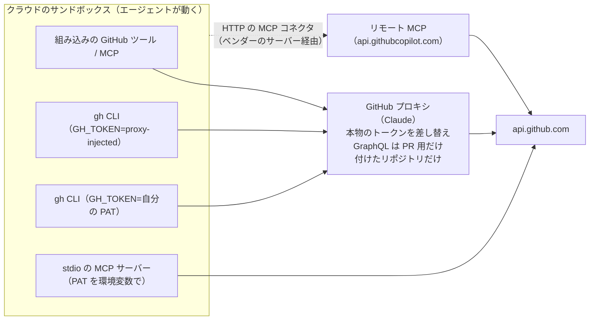
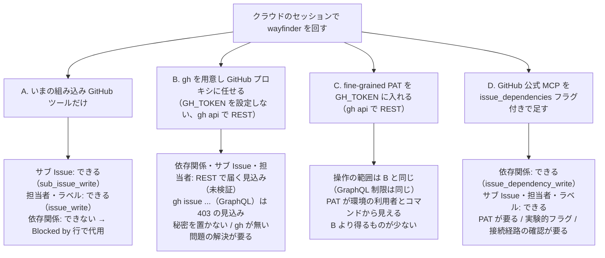

# クラウドのコーディングエージェントから GitHub を操作する方法

調査日: 2026-09-25
対象: wayfinder の運用（`docs/agents/issue-tracker.md`。サブ Issue、ネイティブの Issue 依存関係 `blocked_by`、担当者、ラベル、PR 作成）を、Claude Code on the web などクラウドのサンドボックスで動くエージェントから回す手段。

> **確認の方法と限界**
> - Anthropic（code.claude.com）、GitHub（docs.github.com、github/github-mcp-server と cli/cli の公式リポジトリのソース）、OpenAI（developers.openai.com から転送される learn.chatgpt.com）、Cursor（cursor.com/docs）の**本文を直接取得して読んだ**。本文で確かめた主張は【本文で確認】と書く。
> - 本文の記述から推し量ったものは【本文からの読み取り】と書き、何から読み取ったかを添える。**実際に API を呼んで確かめてはいない**（依存関係を実際に張る、GraphQL が 403 になる、などは未検証）。
> - 本文や関連ページを探しても記述が無かったものは【記述なし】、取得に失敗したものは【取得できず】と書く。
> - github/github-mcp-server はコミット `85598ba`（2026-09-16）、cli/cli はコミット `b6770c8`（2026-09-23、main ブランチ）のソースを読んだ。**cli/cli の main にある機能が、どのリリース版の gh に入っているかは確かめていない。**
> - このセッション（Claude Code on the web）で観察したことは【このセッションで観察】と書く。観察は `which gh` の結果、環境変数の名前（値は読んでいない）、エージェントに見えている MCP ツールの名前だけ。
> - 二次情報（ブログ、まとめ記事、コミュニティ投稿）は使っていない。

## 結論の要約

- **Claude Code on the web では、GitHub への通信はすべて専用の GitHub プロキシを通る。** 本物のトークンは VM の外にあり、プロキシが差し替える。環境変数 `GH_TOKEN` / `GITHUB_TOKEN` を自分で設定しなければ、中身は `proxy-injected` という置き換え用の文字列で、`gh` はそのまま使える、と公式は書く【本文で確認 C2】。ネットワークの許可レベル（None / Trusted / Full / Custom）に関係なく GitHub には届く【本文で確認 C2】。
- **ただしプロキシは GraphQL を「PR の流れに要る決まった操作」だけに絞り、それ以外は 403 を返す。** 自分で `GH_TOKEN` を設定しても同じ制限がかかる。代わりに REST（`gh api repos/{owner}/{repo}/...`）を使え、と公式は書く【本文で確認 C2】。gh の `issue list / view / create / edit / comment / close` は GraphQL で実装されている【本文で確認 H1】ので、`issue-tracker.md` の `gh issue ...` はプロキシ経由では弾かれる見込みが高い【本文からの読み取り C2, H1】。**`gh api` で REST の Issue 依存関係エンドポイントを叩く方法は、公式の記述どおりなら通る**【本文からの読み取り C2, G1】。
- **GitHub 公式の MCP サーバーはサブ Issue（`sub_issue_write`）に既定で対応し、Issue の依存関係（`issue_dependency_read` / `issue_dependency_write`）はソースにあるが、機能フラグ `issue_dependencies` を有効にしたときだけ出る。** README のツール一覧には依存関係のツールは載っておらず、`docs/insiders-features.md` と `docs/feature-flags.md` に載っている【本文で確認 M1, M2, M3, M4】。このセッションの GitHub ツールには `sub_issue_write` はあるが `issue_dependency_*` は無い【このセッションで観察】。
- **REST の Issue 依存関係とサブ Issue のエンドポイントは、fine-grained PAT・GitHub App のインストールトークン・GitHub App のユーザートークンのどれでも使え、要る権限はリポジトリの "Issues"（読みは read、追加・削除は write）だけ。** 担当者とラベルは "Issues" か "Pull requests" の write のどちらか、PR 作成は "Pull requests" の write【本文で確認 G1, G2, G3, G4, G5】。
- 他社: **OpenAI Codex cloud** は秘密（secrets）をセットアップスクリプトにだけ渡し、エージェントの段階では消す。エージェントのインターネットは既定で切ってある【本文で確認 O1, O2】。**GitHub Copilot のクラウドエージェント**は GitHub MCP サーバーが既定で有効だが、トークンは「現在のリポジトリの読み取り専用」で、書き込みには `COPILOT_MCP_` で始まる秘密に PAT を入れる【本文で確認 P2】。**Cursor の cloud agents** は GitHub App に読み書きの権限を与えて clone・push し、秘密を環境変数として注入する（Runtime Secret はエージェントの出力から伏せ字になる）【本文で確認 U1, U2, U3】。gh CLI を使う手順は Codex と Cursor の公式文書に【記述なし】。

## 問い1: 各社の公式の推奨と制約

### Anthropic: Claude Code on the web（クラウドセッション）

**GitHub との接続（2通り）**

- 「GitHub App」: onboarding で Claude GitHub App を許可する。届くのは「すべての公開リポジトリと、Claude GitHub App をインストールした非公開リポジトリ」【本文で確認 C1】。
- 「`/web-setup`」: 手元の `gh auth token` のトークンを Anthropic に送り、claude.ai のアカウントに暗号化して保存する。そのトークンで届くリポジトリすべてに届く。削除は claude.ai/customize/connectors で GitHub を切断する。Team / Enterprise では Owner が「Quick web setup」を有効にするまで使えない【本文で確認 C1, C3】。
- Claude GitHub App が求める権限は、Anthropic の公式リポジトリ anthropics/claude-code-action の文書で「Contents、Pull Requests、Issues の読み書き」（他に将来の機能向けとして Discussions、Actions(read)、Checks(read)、Workflows）【本文で確認 C4】。github.com/apps/claude のページは権限を載せていなかった【取得できず（一覧が無い）】。

**GitHub プロキシ（C2 の "GitHub proxy" 節）**

- 「Anthropic がホストする環境では、GitHub の操作はすべて専用のプロキシを通り、本物の GitHub 認証情報は VM の外に置かれる。環境のアクセスレベルとは独立」【本文で確認 C2】。
- git: VM 内の git は範囲を絞った認証情報を使い、プロキシが検証して本物のトークンに差し替える【本文で確認 C2】。
- API: 「組み込みの GitHub ツールからの要求と、`proxy-injected` の置き換え文字列のもとでの `gh` の要求は、本物の認証情報に差し替えて送られる」【本文で確認 C2】。
- リポジトリの範囲: 「GitHub API とリリースアセットへの要求は、セッションに付けたリポジトリにしか届かない」（付けていないリポジトリのリリースアセットをセットアップスクリプトで落とすと 403）【本文で確認 C2】。
- **GraphQL の制限**: 「プロキシは PR の流れのための固定された GraphQL 操作だけを通す。それ以外は `This GraphQL query is not enabled for this session` の 403 で、REST の代わり `gh api repos/{owner}/{repo}/...` を示す。自分で設定した `GH_TOKEN` にも同じ制限がかかる。Projects v2 のように GraphQL にしかない API には届かない」【本文で確認 C2】。

**gh CLI と認証**

- 「Installed tools」の表に `gh` がある。「`gh` は `GH_TOKEN` を自動で読むので `gh auth login` は要らない」【本文で確認 C2】。
- `GH_TOKEN` / `GITHUB_TOKEN` を環境設定で自分で設定すると「そのまま container に渡り、スクリプトと `gh` が直接使う」。どちらも設定しなければ「`proxy-injected` という文字列になり、プロキシが外向きの GitHub 要求で本物に差し替える。`gh` は自分のトークンなしで動くが、`GITHUB_TOKEN` を直接読むスクリプトは使えない値を受け取る」【本文で確認 C2】。
- 組み込みの GitHub ツール: 「Issue を読む、PR を一覧する、diff を取る、コメントを書くことを設定なしでできる」。GitHub プロキシで認証し「トークンは container に入らない」【本文で確認 C2】。**組み込みツールが Issue の依存関係を扱えるかは【記述なし】。**
- 【このセッションで観察】`which gh` は何も返さなかった（PATH に gh が無い）。公式文書の「pre-installed」と食い違う。環境変数 `GH_TOKEN` という名前は存在した（値は読んでいない）。

**環境変数、秘密、セットアップスクリプト、ネットワーク**

- 環境変数は `.env` 形式で、セッション開始時に一度だけコピーされ「Claude が実行するどのコマンドからも読める」。「その環境を使う人は誰でも値を読める」。ダイアログでも秘密を置くなと警告している【本文で確認 C2】。
- 「API credentials」: Pro / Max だけ。エージェントのプロキシが、指定したホストへの要求に VM を出たあとで鍵を付けるので、鍵は Claude にもコマンドにも環境変数にも入らない。**ただし GitHub には付かない**（「GitHub プロキシが代わりに認証するので不要」）。Team / Enterprise では未提供【本文で確認 C2】。
- セットアップスクリプトは Claude Code の起動前に root で動く Bash。0 で終わること、約5分以内、パッケージのインストールにはネットワークが要る【本文で確認 C2】。
- アクセスレベル: None / Trusted（既定。パッケージレジストリ、GitHub、クラウド SDK などの許可リスト）/ Full / Custom。どのレベルでも GitHub（専用プロキシ経由）、有効にした MCP コネクタ（Anthropic のサーバー経由）、API credentials のホスト、Anthropic API には届く【本文で確認 C2】。Trusted の許可リストに `github.com`、`api.github.com` などがある。`api.githubcopilot.com` は無い【本文で確認 C2】。
- リポジトリの `.mcp.json` の MCP サーバーは「リポジトリが1つのセッションで」読み込まれる【本文で確認 C2】。

### OpenAI: Codex cloud

- GitHub との接続: 「GitHub か GitLab (Beta) を接続し、GitHub では Codex が触れるリポジトリを選ぶ」。結果が出たら「summary と diff を見て、PR を開く」【本文で確認 O3】。PR のレビューでは `@codex review` などのメンションで起動し、「権限があればブランチに修正を push できる」【本文で確認 O4】。
- 環境変数は「セットアップスクリプトとエージェントの段階の両方」で使える。**秘密は「セットアップスクリプトにだけ渡り、エージェントの段階が始まる前に消される」**【本文で確認 O1】。
- インターネット: 「エージェントの段階のインターネットは既定で遮断。セットアップスクリプトはインターネットに出られる」。環境ごとに Off / On。On では許可リスト（None / Common dependencies / All）と、許すメソッドを `GET`・`HEAD`・`OPTIONS` に絞る設定がある。Common dependencies には `github.com` と `githubusercontent.com` がある【本文で確認 O2】。`api.github.com` を別に載せているかは、一覧の中に単独の項目として見当たらなかった【本文からの読み取り O2】。
- **コンテナ内での gh CLI の有無、GitHub トークンの渡し方、エージェントが Issue を操作できるかは【記述なし】**（O1, O3, O4 を探した）。
- 【本文からの読み取り O1, O2】秘密がエージェントの段階で消えるので、エージェント自身が PAT を使って GitHub API に書き込む運用は、秘密ではなく環境変数に置く（＝エージェントから見える）しかない。

### GitHub Copilot のクラウドエージェント（旧 coding agent）

- 実行環境は「GitHub Actions による一時的な開発環境」。「開始時に指定したリポジトリでしか変更できない」「1タスクに PR は1つ」「1セッション最長 59 分」【本文で確認 P1】。
- 「GitHub MCP サーバーと Playwright MCP サーバーが既定で有効」【本文で確認 P1】。
- **既定の GitHub MCP サーバーは「現在のリポジトリの読み取り専用に絞った特別なトークン」で GitHub に接続する。** 書き込みや他のリポジトリには、URL から `/readonly` を外し、`X-MCP-Toolsets` でツールセットを選び、秘密 `COPILOT_MCP_GITHUB_PERSONAL_ACCESS_TOKEN` に PAT を入れる。MCP の設定から読めるのは `COPILOT_MCP_` で始まる秘密と変数だけ【本文で確認 P2】。
- push は「単一のブランチ」だけ。「`git push` を直接実行できない」。PR を Ready for review にしたり、承認・マージしたりできない【本文で確認 P3】。
- ファイアウォール: 既定でインターネットを制限し、推奨の許可リストを既定で有効にする。**ファイアウォールはエージェントの Bash ツールで起動したプロセスにだけかかり、MCP サーバーとセットアップ手順のプロセスにはかからない**【本文で確認 P4】。GitHub MCP サーバーで `api.github.com` のファイアウォール警告が出たら許可リストに足せ、とある【本文で確認 P2】。
- セットアップ手順（`copilot-setup-steps.yml`）で clone するなら `contents: read` が要る【本文で確認 P5】。**エージェントが gh CLI を使えるか、どのトークンで使うかは【記述なし】**（P1, P5）。
- 【本文からの読み取り P2, M3】既定の GitHub MCP サーバーは読み取り専用なので、サブ Issue や依存関係の書き込みには PAT の設定が要る。依存関係のツールを出すには、さらに機能フラグ（`X-MCP-Features: issue_dependencies` か `/insiders`）が要る。Copilot の文書にこのフラグの話は【記述なし】。

### Cursor: cloud agents（旧 background agents）

- docs.cursor.com/en/background-agent は cursor.com/docs へ転送され、現在の名前は「Cloud Agents」【本文で確認 U1】。
- GitHub などから clone し、別ブランチで作業して push する。「リポジトリと依存するリポジトリ・サブモジュールに読み書きの権限が要る」【本文で確認 U1】。「編集したいリポジトリについて、Cursor の GitHub App に読み書きの権限を与える」【本文で確認 U2】。GitHub App が求める権限の一覧に Pull requests、Issues、Checks、Actions、Administration などがある【本文で確認 U4】。
- 秘密は3種類: Environment Variable（エージェントから見える）、Runtime Secret（環境変数として読み込むが、ツールの結果・会話・コミットでは `[REDACTED]` に置き換える。ただしターミナルからは見える）、Build Secret（Docker のビルドにだけ渡る）【本文で確認 U2】。
- ネットワーク: 「既定でインターネットに出られる」。Allow all / Default + allowlist / Allowlist only。Allowlist only でも Cursor 自身のサービスとソース管理（SCM）のプロバイダには届く【本文で確認 U2】。
- MCP: チームで設定した MCP サーバーを使える。HTTP（推奨）は「設定が VM に入らず、ツール呼び出しはバックエンドが中継する」。stdio は VM 内で動き、設定と環境変数がエージェントから見える【本文で確認 U3】。
- **gh CLI の有無と認証方法は【記述なし】**（U1〜U4 を探した）。

## 問い2: 手段ごとの比較

図の矢印の経路は Claude Code on the web の文書（C2）に基づく。A3 もプロキシを通ることは「自分で設定した `GH_TOKEN` にも同じ GraphQL の制限がかかる」から読み取った【本文からの読み取り C2】。A4 の経路（stdio の MCP が VM から直接出る）は Cursor の文書（U3）の一般的な記述で、Claude の文書にこの経路の記述は【記述なし】。

### 手段ごとの権限、秘密、ネットワーク

**(a) gh CLI ＋ fine-grained PAT を `GH_TOKEN` に入れる**

- 権限の範囲: PAT を作るときに「リソースの所有者」と対象リポジトリと権限を選ぶ。トークンは選んだ所有者のリソースにしか届かない【本文で確認 G6】。wayfinder の操作に要る権限は問い4のとおり。
- 秘密の扱い: Claude の環境変数は「その環境を使う人は誰でも読める」、コマンドからも読める【本文で確認 C2】。Claude の API credentials は GitHub に付かない【本文で確認 C2】。Codex は秘密をエージェントの段階で消す【本文で確認 O1】。Cursor は Runtime Secret で出力から伏せる【本文で確認 U2】。
- ネットワーク: Claude では GitHub への通信はアクセスレベルと関係なく専用プロキシを通り、GraphQL の制限は自分のトークンにもかかる【本文で確認 C2】。gh の `issue edit --add-blocked-by` などは GraphQL なので（問い3）、Claude のプロキシの下では REST の `gh api` を使う形になる【本文からの読み取り C2, H1】。

**(b) gh CLI を Claude の GitHub プロキシに任せる（`GH_TOKEN` を設定しない）**

- 権限の範囲: 接続方法（Claude GitHub App か `/web-setup` の gh トークン）の権限。そのうえで「セッションに付けたリポジトリにしか届かない」【本文で確認 C1, C2】。Claude GitHub App には Issues の読み書きがある【本文で確認 C4】ので、REST の依存関係・サブ Issue・担当者・ラベルのエンドポイントに要る権限（問い4）を満たす【本文からの読み取り C4, G1〜G4】。**実際に通るかは未検証。**
- 秘密の扱い: トークンは container に入らない【本文で確認 C2】。
- ネットワーク: アクセスレベルに関係なく届く【本文で確認 C2】。GraphQL は PR 用の決まった操作だけ【本文で確認 C2】。

**(c) GitHub 公式の MCP サーバー（github/github-mcp-server）**

- 形: リモート（`https://api.githubcopilot.com/mcp/`）とローカル（Docker かバイナリ、stdio）【本文で確認 M1】。
- 認証: ローカルは `GITHUB_PERSONAL_ACCESS_TOKEN`（PAT）。リモートを OAuth で使えるのは GitHub App か OAuth App を登録したホストだけで、PAT はどのホストでも使える【本文で確認 M1, M5】。インストールガイドの表では Claude Code は「リモートは PAT のみ、OAuth は未対応」【本文で確認 M6】。PAT は fine-grained を推奨【本文で確認 M5】。
- 権限の範囲: 渡したトークンの権限。README の各ツールに「OAuth Challenge Scopes」（Issue 系は `repo`）がある【本文で確認 M1】。`--toolsets`、`--tools`、`--read-only`（リモートは `/readonly` や `X-MCP-Readonly`）で出すツールを絞れる【本文で確認 M1, M7】。
- 依存関係のツールは機能フラグが要る（問い3）。
- ネットワーク: Claude で `.mcp.json` からリモート MCP を使うと、`api.githubcopilot.com` は Trusted の許可リストに無い【本文で確認 C2】ので Custom で足す必要がある【本文からの読み取り C2】。claude.ai の MCP コネクタとして使うなら通信は Anthropic のサーバーを通り、許可リストは要らない【本文で確認 C2】。claude.ai のコネクタで URL に `?features=issue_dependencies` を付けられるか、GitHub の OAuth で繋げるかは【記述なし】。GitHub 側は「ヘッダーを設定できないホスト向けに URL のクエリ引数 `?features=` がある」と書く【本文で確認 M4】。

**(d) GitHub App のインストールトークン**

- REST の依存関係・サブ Issue のエンドポイントはインストールトークンで使える【本文で確認 G1, G2】。github-mcp-server の文書は、インストールトークンを「署名した JWT でインストールトークンを取り、アプリ自身として動く」方式と書く【本文で確認 M5】。
- 【本文からの読み取り】自前の GitHub App を使うには秘密鍵（`.pem`）で JWT を作る必要があり（C5 の手動セットアップでも秘密鍵を秘密として置く）、クラウドの VM にその秘密鍵を置くと、環境変数の見え方の問題（(a) と同じ）がより重くなる。各社のクラウドエージェントの文書に、この方式を推奨する記述は【記述なし】。

**(e) プロキシ経由の認証（ベンダーが本物のトークンを持つ）**

- Claude: GitHub プロキシ（上記 (b)）と、Pro / Max の API credentials（GitHub には付かない）【本文で確認 C2】。
- Cursor: HTTP の MCP サーバーは設定が VM に入らず、バックエンドが中継する【本文で確認 U3】。
- Copilot: 既定の GitHub MCP サーバーは読み取り専用の特別なトークン【本文で確認 P2】。
- Codex: GitHub 接続の仕組みの詳細は【記述なし】。

## 問い3: GitHub 公式 MCP サーバーのサブ Issue と依存関係、REST の要件

### github/github-mcp-server（コミット 85598ba）

- **サブ Issue: 対応。** `sub_issue_write`（method: `add` / `remove` / `reprioritize`。`sub_issue_id` は「Issue の番号ではなく ID」。`replace_parent` で親の付け替え）。読みは `issue_read` の `get_sub_issues` / `get_parent`。`issue_write` の `create` は `parent_issue_number` で作成と同時に親に付けられる。いずれも README に載っている【本文で確認 M1】。
- **Issue の依存関係: ソースでは対応、ただし既定では出ない。**
  - `pkg/github/issue_dependencies.go` に `issue_dependency_read`（method: `get_blocked_by` / `get_blocking`）と `issue_dependency_write`（method: `add` / `remove`、type: `blocked_by` / `blocking`、`issue_number` と `related_issue_number` は**番号**で指定し、サーバーがブロック元の DB ID を引く）がある【本文で確認 M2】。
  - 両ツールとも `featureEnabledRule(FeatureFlagIssueDependencies)` で、フラグ名は `issue_dependencies`。コメントは「既定のツール一覧に出さず、ツールのスキーマの固定費を小さく保つため」【本文で確認 M2, M3】。
  - このフラグは利用者が有効にできる一覧（`AllowedFeatureFlags`）にも、Insiders モードで自動で有効になる一覧（`InsidersFeatureFlags`）にも入っている【本文で確認 M3】。
  - 有効にする方法: リモートは `X-MCP-Features: issue_dependencies` ヘッダーか URL の `?features=issue_dependencies`、ローカルは `--features=issue_dependencies` か `GITHUB_FEATURES=issue_dependencies`。Insiders モード（リモートは URL の末尾に `/insiders` か `X-MCP-Insiders: true`、ローカルは `--insiders`）でも出る【本文で確認 M4, M7】。
  - README のツール一覧には依存関係のツールは【記述なし】。`docs/insiders-features.md` と `docs/feature-flags.md` に載る。Insiders の機能は「実験的で、変わったり消えたりしうる」【本文で確認 M7】。

### GitHub REST API: Issue dependencies（G1）

| エンドポイント | 要る権限（fine-grained） |
|---|---|
| `GET /repos/{owner}/{repo}/issues/{issue_number}/dependencies/blocked_by` | "Issues" repository permissions (read) |
| `POST /repos/{owner}/{repo}/issues/{issue_number}/dependencies/blocked_by`（本文 `issue_id` = ブロック元の Issue の id） | "Issues" repository permissions (write) |
| `DELETE /repos/{owner}/{repo}/issues/{issue_number}/dependencies/blocked_by/{issue_id}` | "Issues" repository permissions (write) |
| `GET /repos/{owner}/{repo}/issues/{issue_number}/dependencies/blocking` | "Issues" repository permissions (read) |

- 4つとも「GitHub App user access tokens、GitHub App installation access tokens、Fine-grained personal access tokens で動く」【本文で確認 G1】。読みの2つは「公開リソースだけなら認証なしでも使える」【本文で確認 G1】。
- 追加と削除は「速すぎると secondary rate limit にかかることがある」【本文で確認 G1】。
- fine-grained PAT の権限一覧のページでも、`POST .../dependencies/blocked_by` と `DELETE .../dependencies/blocked_by/{issue_id}` は "Issues" の write に並んでいる【本文で確認 G7】。
- Issue の応答には `issue_dependencies_summary`（`blocked_by`、`blocking`、`total_blocked_by`、`total_blocking`）がある【本文で確認 G5】。
- classic PAT の scope について、このページに【記述なし】。

### gh CLI（cli/cli、コミット b6770c8、main）

- `gh issue edit` に `--add-blocked-by`、`--remove-blocked-by`、`--add-blocking`、`--remove-blocking`、`--parent`、`--remove-parent`、`--add-sub-issue`、`--remove-sub-issue` があり、`gh issue create` に `--parent`、`--blocked-by`、`--blocking` がある【本文で確認 H1】。
- これらは GraphQL の mutation（`addBlockedBy`、`removeBlockedBy`、サブ Issue の mutation）で実装されている。`gh issue list`・`view`・`create`・`close`、ラベルと担当者の編集（`IssueUpdate`、`LabelAdd`）、コメント（`addComment`）も GraphQL【本文で確認 H1】。
- 【本文からの読み取り C2, H1】Claude の GitHub プロキシの下では、これらの `gh issue ...` は GraphQL の制限で 403 になる見込み。REST の `gh api` なら通る見込み。どちらも未検証。

## 問い4: fine-grained PAT で要る権限

| wayfinder の操作 | REST エンドポイント | 要る権限 |
|---|---|---|
| 依存関係を張る・外す | `POST` / `DELETE .../issues/{n}/dependencies/blocked_by` | Issues: write【G1】 |
| 依存関係を読む | `GET .../dependencies/blocked_by`、`.../blocking` | Issues: read【G1】 |
| サブ Issue を付ける・外す・並べ替える | `POST .../sub_issues`、`DELETE .../sub_issue`、`PATCH .../sub_issues/priority` | Issues: write【G2】 |
| サブ Issue・親を読む | `GET .../sub_issues`、`GET .../parent` | Issues: read【G2】 |
| 担当者を付ける | `POST .../issues/{n}/assignees` | Issues: write か Pull requests: write のどちらか【G3】 |
| ラベルを付ける | `POST .../issues/{n}/labels` | Issues: write か Pull requests: write のどちらか【G4】 |
| Issue を作る・更新する・閉じる | `POST .../issues`、`PATCH .../issues/{n}` | 更新は Issues: write か Pull requests: write【G5】 |
| PR を作る | `POST .../pulls` | Pull requests: write【G8】 |

- まとめると、**Issue 側の wayfinder の操作は "Issues" の read と write だけで足りる**。PR 作成に "Pull requests" の write を足す【本文で確認 G1〜G5, G8】。push を PAT でするなら "Contents" の write も要るが、Claude では git の push は GitHub プロキシが扱う【本文で確認 C2】。
- サブ Issue は「親と同じリポジトリ所有者に属する」必要がある【本文で確認 G2】。
- fine-grained PAT の期限は既定 30 日、1〜366 日か無期限（組織の方針で制限されうる）。1年使われないトークンは GitHub が自動で消す【本文で確認 G6】。

## nu-tori での選択肢

前提: いまの Claude Code on the web のセッションには gh が無く【このセッションで観察】、GitHub の組み込みツールに依存関係のツールが無い【このセッションで観察】。`issue-tracker.md` は依存関係が使えないときの代わり（子の本文の先頭に `Blocked by: #<n>`）を定めている。決定はしない。

**A. いまの組み込み GitHub ツールだけ使う**

- 依存関係を張る: できない【このセッションで観察】。`issue-tracker.md` の代わりの手段（`Blocked by:` 行）に落ちる。GitHub の UI にブロック関係は出ない。
- サブ Issue: できる（`sub_issue_write`、`issue_write` の `parent_issue_number`）【本文で確認 M1、このセッションで観察】。
- 担当者・ラベル・コメント・PR: できる（`issue_write` の `assignees` / `labels`、`add_issue_comment`、`create_pull_request`）【本文で確認 M1、このセッションで観察】。
- 着手可能の判定: `issue_dependencies_summary` を組み込みツールの応答で読めるかは【記述なし】。`Blocked by:` 行で判定する形になる。
- 準備: なし。`issue-tracker.md` の gh 前提の書き方とは合わない。

**B. gh を用意して GitHub プロキシに任せ、REST（`gh api`）で操作する**

- 依存関係を張る: 公式の記述どおりなら届く（REST、Issues: write、Claude GitHub App は Issues の読み書きを持つ）【本文からの読み取り C2, C4, G1】。未検証。
- サブ Issue・担当者・ラベル: REST なら届く見込み【本文からの読み取り C2, G2〜G4】。
- `gh issue list / view / edit / comment / close` は GraphQL なので 403 の見込み【本文からの読み取り C2, H1】。`issue-tracker.md` のコマンドを `gh api` に書き換えることになる。
- 秘密: 置かない【本文で確認 C2】。
- 準備: このセッションに gh が無い理由と、入れ方（セットアップスクリプト。GitHub のリリースアセットは付けたリポジトリ以外 403【本文で確認 C2】）を確かめる必要がある。最初に読み取りだけの `gh api .../dependencies/blocked_by` で通るかを見るのが安全【本文からの読み取り】。

**C. fine-grained PAT（Issues: read/write、Pull requests: write）を `GH_TOKEN` に入れる**

- できる操作は B と同じ（プロキシの GraphQL の制限は自分のトークンにもかかる）【本文で確認 C2】。
- 秘密: 環境の利用者とコマンドから見える【本文で確認 C2】。API credentials は GitHub に付かない【本文で確認 C2】。
- 【本文からの読み取り C2】B が通るなら、C で得るものは「接続方法の権限と別の権限にできる」ことくらいで、秘密を置く分だけ不利。

**D. GitHub 公式 MCP サーバーを `issue_dependencies` 付きで足す**

- 依存関係を張る: できる（`issue_dependency_write`、番号で指定でき DB ID を自分で引かなくてよい）【本文で確認 M2】。
- サブ Issue・担当者・ラベル・PR: できる【本文で確認 M1】。
- 準備と制約: Claude Code からのリモート接続は PAT のみ【本文で確認 M6】。リポジトリの `.mcp.json` で足すなら、`api.githubcopilot.com` をネットワークの許可リスト（Custom）に足し、PAT を環境変数に置く（見える）【本文からの読み取り C2】。claude.ai のコネクタとして足せば許可リストは要らないが、URL にフラグを付けられるか・認証の方法は【記述なし】。フラグは実験的な扱い【本文で確認 M7】。いまの組み込みツールと名前が重なる。

**参考: クラウドをやめて手元で動かす** — Remote Control は手元のマシンで動くセッションを claude.ai やスマホから操作する仕組み【本文で確認 C1】。手元の gh がそのまま使えるので `issue-tracker.md` を変えずに済むが、クラウドのセッションではなくなる。

## 出典一覧

### Anthropic
- C1: Use Claude Code in the cloud（GitHub authentication options、Security and isolation、Remote Control） — https://code.claude.com/docs/en/claude-code-on-the-web
- C2: Configure cloud environments（Set environment variables、Add API credentials、Network access、Access levels、GitHub proxy、Installed tools、Work with GitHub issues and pull requests、Setup scripts、Default allowed domains） — https://code.claude.com/docs/en/cloud-environments
- C3: Get started with Claude Code in the cloud（Connect GitHub、`/web-setup`） — https://code.claude.com/docs/en/web-quickstart
- C4: anthropics/claude-code-action `docs/security.md`（GitHub App Permissions） — https://github.com/anthropics/claude-code-action/blob/main/docs/security.md
- C5: anthropics/claude-code-action `docs/setup.md`（Manual Setup） — https://github.com/anthropics/claude-code-action/blob/main/docs/setup.md
- 取得できず（権限の一覧が無い）: https://github.com/apps/claude

### GitHub（REST API と文書）
- G1: REST API endpoints for issue dependencies — https://docs.github.com/en/rest/issues/issue-dependencies
- G2: REST API endpoints for sub-issues — https://docs.github.com/en/rest/issues/sub-issues
- G3: REST API endpoints for assignees — https://docs.github.com/en/rest/issues/assignees
- G4: REST API endpoints for labels — https://docs.github.com/en/rest/issues/labels
- G5: REST API endpoints for issues（`issue_dependencies_summary`、Update an issue） — https://docs.github.com/en/rest/issues/issues
- G6: Managing your personal access tokens — https://docs.github.com/en/authentication/keeping-your-account-and-data-secure/managing-your-personal-access-tokens
- G7: Permissions required for fine-grained personal access tokens — https://docs.github.com/en/rest/authentication/permissions-required-for-fine-grained-personal-access-tokens
- G8: REST API endpoints for pull requests（Create a pull request） — https://docs.github.com/en/rest/pulls/pulls

### github/github-mcp-server（コミット 85598ba）
- M1: README.md（Tools: issue_read、issue_write、sub_issue_write、リモート URL、PAT、toolsets） — https://github.com/github/github-mcp-server/blob/85598ba6e1256f7ebf4867b95d63b833c4549264/README.md
- M2: pkg/github/issue_dependencies.go — https://github.com/github/github-mcp-server/blob/85598ba6e1256f7ebf4867b95d63b833c4549264/pkg/github/issue_dependencies.go
- M3: pkg/github/feature_flags.go — https://github.com/github/github-mcp-server/blob/85598ba6e1256f7ebf4867b95d63b833c4549264/pkg/github/feature_flags.go
- M4: docs/feature-flags.md — https://github.com/github/github-mcp-server/blob/85598ba6e1256f7ebf4867b95d63b833c4549264/docs/feature-flags.md
- M5: docs/policies-and-governance.md — https://github.com/github/github-mcp-server/blob/85598ba6e1256f7ebf4867b95d63b833c4549264/docs/policies-and-governance.md
- M6: docs/installation-guides/README.md（Support by Host Application） — https://github.com/github/github-mcp-server/blob/85598ba6e1256f7ebf4867b95d63b833c4549264/docs/installation-guides/README.md
- M7: docs/insiders-features.md、docs/remote-server.md — https://github.com/github/github-mcp-server/blob/85598ba6e1256f7ebf4867b95d63b833c4549264/docs/insiders-features.md 、https://github.com/github/github-mcp-server/blob/85598ba6e1256f7ebf4867b95d63b833c4549264/docs/remote-server.md

### cli/cli（コミット b6770c8、main）
- H1: `pkg/cmd/issue/edit/edit.go`、`pkg/cmd/issue/create/create.go`、`api/queries_issue.go`、`api/queries_comments.go`、`pkg/cmd/pr/shared/editable_http.go`、`pkg/cmd/issue/list/http.go`、`pkg/cmd/issue/view/http.go` — https://github.com/cli/cli/tree/b6770c8bc54c72e74e785c307850446b8e10be9d

### OpenAI（developers.openai.com から learn.chatgpt.com へ転送）
- O1: Cloud environments — https://developers.openai.com/codex/cloud/environments（転送先 https://learn.chatgpt.com/docs/environments/cloud-environment）
- O2: Agent internet access — https://developers.openai.com/codex/cloud/internet-access（転送先 https://learn.chatgpt.com/docs/cloud/internet-access）
- O3: Codex cloud — https://developers.openai.com/codex/cloud（転送先 https://learn.chatgpt.com/docs/cloud）
- O4: Review GitHub pull requests with Codex — https://learn.chatgpt.com/docs/third-party/github

### GitHub Copilot
- P1: About GitHub Copilot cloud agent — https://docs.github.com/en/copilot/concepts/agents/coding-agent/about-coding-agent
- P2: Extending Copilot cloud agent with MCP — https://docs.github.com/en/copilot/how-tos/use-copilot-agents/coding-agent/extend-coding-agent-with-mcp
- P3: Risks and mitigations for GitHub Copilot cloud agent — https://docs.github.com/en/copilot/concepts/agents/cloud-agent/risks-and-mitigations
- P4: Customizing or disabling the firewall for Copilot cloud agent — https://docs.github.com/en/copilot/how-tos/use-copilot-agents/coding-agent/customize-the-agent-firewall
- P5: Customizing the development environment for Copilot cloud agent — https://docs.github.com/en/copilot/how-tos/use-copilot-agents/coding-agent/customize-the-agent-environment

### Cursor
- U1: Cloud Agents — https://cursor.com/docs/cloud-agent（旧 https://docs.cursor.com/en/background-agent から転送）
- U2: Secrets & Network — https://cursor.com/docs/cloud-agent/security-network
- U3: Cloud agent capabilities（MCP tools） — https://cursor.com/docs/cloud-agent/capabilities
- U4: GitHub integration（Permissions） — https://cursor.com/docs/integrations/github
