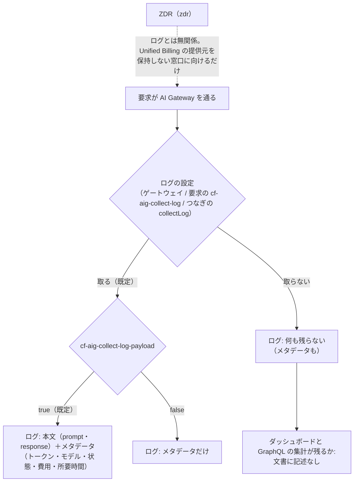

# エージェントが Cloudflare の「例外にならない振る舞い」を読む道具を、ローカルとクラウドの両方で動かす

調査日: 2026-10-03
対象: エージェントがサーバー（Cloudflare Workers、Durable Object、D1、R2、Workers AI と AI Gateway）の、例外にならない振る舞いを読む方法。読みたいものは、①Workers Logs（`console.log`、呼び出しごとのログ、Durable Object のアラーム）を条件で絞ったもの、②Workers の呼び出しの数・誤りの割合・CPU 時間・遅さ、③AI Gateway のログと集計、④本番と開発用を取り違えずに読むこと。動かす場所は、ローカル（Mac の Claude Code・Codex・Cursor）と、クラウド（Claude Code on the web でネットは Full、Cursor の Cloud Agents）。例外は Sentry で読む（`scripts/sentry`、`docs/research/sentry-agent-access.md`）ので、ここでは扱わない。前の調査は `docs/research/observability.md`（「1. Cloudflare」）、`docs/research/cf-cli.md`、`docs/research/sentry-agent-access.md`、`docs/research/agent-tools-setup.md`。重なる事実は繰り返さず、古くなった点は末尾に挙げる。

> **確認の方法と限界**
> - Cloudflare の文書は developers.cloudflare.com の Markdown 版（`<ページ>/index.md`）と `llms.txt` を読んだ（2026-10-03）。API の一覧と、各エンドポイントが受け付けるトークンの権限は、文書の API リファレンス（`/api/resources/...`）と、Cloudflare の公式の OpenAPI（cloudflare/api-schemas、`37e7a4a`、2026-10-02）の `x-api-token-group` で確かめた。
> - Cloudflare の公式リポジトリを clone してソースを読んだ: cloudflare/mcp-server-cloudflare（`ab883e5`、2026-10-01。製品ごとのリモート MCP）、cloudflare/mcp（`69ba314`、2026-10-02。Code Mode の MCP）、cloudflare/cf（`1f0303e`、2026-10-02）。wrangler は npm の最新 4.147.0 の配布物を展開して読んだ。
> - **`cf@1.0.0-beta.12` を scratchpad に入れ、`cf cli search`・`--help`・`cf schema` を動かした**（`DO_NOT_TRACK=1`。認証なしで動く範囲だけ）。動かして確かめたものは「実行で確認」と書く。
> - Claude Code は code.claude.com/docs の Markdown 版、Cursor は cursor.com/docs の Markdown 版を読んだ。claude.ai のコネクタの一覧は、Anthropic の MCP の登録簿の検索（この調査のセッションの道具）で確かめた。
> - 本文で確かめた主張は「本文で確認」と書き、短い英語の原文を添える。ソースや OpenAPI で確かめたものは「ソースで確認」と書く（次の版で変わりうるので、文書の約束より弱い）。本文やソースから推し量ったものは「本文からの読み取り」、探しても記述が無かったものは「本文を探したが記述なし」と書く。
> - **Cloudflare のアカウントでは何も動かしていない**（トークンを作っていない、API も MCP も実際のアカウントに向けて呼んでいない）。GraphQL のスキーマは認証が要るので、データセットの欄の一覧は確かめていない。Cursor の Cloud Agents と Claude Code on the web でも動かしていない。二次情報（ブログ、記事、SNS）は使っていない。

> **追記（2026-10-09、`scripts/cloudflare` を作ったとき）**: 作ったトークン（Workers の役割 `Metadata Read-Only` を2つの Worker に絞ったものと、`Account Analytics Read`）で、`telemetry/query`（`events`・`calculations`）と GraphQL の `workersInvocationsAdaptive`（`datetimeHour`・`status`・`cpuTimeP50`・`cpuTimeP99`・`wallTimeP99`）を、開発用と本番の両方で読めた。下の「確かめていないこと」の1つ目は、`Metadata Read-Only` で足りる、が答え。GraphQL の CPU 時間と壁時計の時間の単位はマイクロ秒（introspection の説明）。AI Gateway はまだゲートウェイが無いので、トークンにもスクリプトにも入れていない。

## 結論の要約

- **勧める形: Cloudflare の REST と GraphQL を curl で直接呼ぶ起動スクリプト（例 `scripts/cloudflare`）を1本置き、環境の名前（`development`・`production`）を必ず引数で受けて、Worker の名前とゲートウェイの ID に直す。MCP の設定には Cloudflare を置かない。** 5つの場所（Mac の3つ、Claude Code on the web、Cursor の Cloud Agents）のすべてで同じ形で動くのは、Bash とネットだけで動くこれだけ（本文からの読み取り。下の「候補ごとに、5つの場所で動くか」）。理由:
  - 読みたいものは、Workers Observability の問い合わせ（`POST /accounts/{account_id}/workers/observability/telemetry/query`）、GraphQL Analytics API（`POST /client/v4/graphql`）、AI Gateway のログの API（`GET /accounts/{account_id}/ai-gateway/gateways/{gateway_id}/logs`）の3つで足りる（本文で確認）。どれも公式の文書と OpenAPI に載る、版の固定が要らない API
  - **wrangler は過去のログを読めない**。`wrangler tail` は今流れているログを見るだけで、時間の範囲を選ぶ旗が無い（本文で確認）。wrangler 4.147.0 に、ログを問い合わせるコマンドは無い（ソースで確認）
  - **新しい `cf` は3つのうち2つ（ログの問い合わせ、AI Gateway のログ）をコマンドで持つ**が、GraphQL のコマンドは見つからない（実行で確認）。2026-09-28 の `beta.5` から 5 日で `beta.12` まで上がり、既定で利用状況を送る（`cf-cli.md`）。今はスクリプトの中から呼ぶ土台にしない
  - **Cloudflare の MCP は、Claude Code on the web で claude.ai のコネクタとして使えない**。登録簿にある Cloudflare のコネクタは Workers Bindings（`bindings.mcp.cloudflare.com`）だけで、Observability も AI Gateway も無い（観察）。Cursor の Cloud Agents はリポジトリの MCP の設定を読まない（`agent-tools-setup.md`）。リモート MCP は API トークンを Bearer で受けるので動かすことはできる（ソースで確認）が、5つにまたがる利点が無く、AI Gateway の MCP には要求と応答の本文を返す道具がある（本文で確認）
- **トークンの最小の権限（アカウントの持つトークン、`cfat_` で始まる）**: ①Workers の役割 `Metadata Read-Only` を、`nu-tori-development` と `nu-tori-production` の2つの Worker に限って付ける（ログ・指標・トレースを読め、コードと秘密の値は読めない。本文で確認）、②`Account Analytics Read`（GraphQL。本文で確認）、③`AI Gateway Read`（ゲートウェイ単位には絞れない。本文で確認）。**ただし OpenAPI は、ログの問い合わせ（`telemetry/query`・`keys`・`values`）が受け付ける権限を `Workers Observability Write` だけと書き、Read を挙げていない**（ソースで確認）。文書の役割の説明（Metadata Read-Only で logs を見られる）と食い違うので、作ったトークンで一度呼んで確かめる必要がある（下の「確かめていないこと」）。
- **環境の取り違えを防ぐ形**: Workers のログは `$metadata.service`（Worker の名前）で、GraphQL は `scriptName` で、AI Gateway はゲートウェイの ID で分かれる（本文で確認）。トークンでは、Workers は Worker ごとに絞れるが、`AI Gateway Read` と `Account Analytics Read` はアカウント全体に効く（本文で確認）ので、トークンだけでは分けきれない。スクリプトが環境の名前を必須の引数にし、名前の対応を1か所に書くのがよい（本文からの読み取り）。
- **秘密の値の置き場**: Mac は各自のシェルの環境変数。Claude Code on the web は、Pro・Max なら API credentials（`api.cloudflare.com` に Bearer を付ける。キーは VM に入らない）、そうでなければ個人の環境の環境変数（「環境を使う人は誰でも読める」）。Cursor の Cloud Agents は Secrets（環境変数として渡る）（本文で確認）。名前は CI のデプロイ用の `CLOUDFLARE_API_TOKEN` と混ざらないものにする（wrangler と cf がその名前を自動で読むため。本文で確認）。
- **公開の Issue・PR に貼ってはいけないもの**: アカウント ID（nu-tori の `accountId`）と Durable Object の ID、要求ごとの ID（Ray ID）、呼び出しログの要求の URL・ヘッダー（IP や User-Agent を含みうる）、AI Gateway のログの `request_head`・`response_head`・本文・メタデータ。貼ってよいのは、数・率・所要時間、経路の型（`GET /v1/...` のような形）、状態コード、例外の名前と段（`stage`）、版まで（本文からの読み取り）。nu-tori の `console.log` 自体は記録の中身を出していない（ソースで確認、`server/src/http/observe-request.ts` と `server/src/durable-object/account-durable-object.ts`）。**記録の中身が入りうるのは AI Gateway のログの本文**で、ゲートウェイのログは既定で有効（本文で確認）。
- **AI Gateway のログを切ったとき**: ゲートウェイのログを切るか要求に `cf-aig-collect-log: false` を付けると、その要求のログは丸ごと残らない（メタデータも残らない）。本文だけ切る `cf-aig-collect-log-payload: false` なら、トークン・モデル・状態コード・費用・所要時間は残る（本文で確認）。**ただし Worker のつなぎ（`env.AI.run()`）の引数にあるのは `collectLog` だけで、本文だけを切る引数は無い**（本文で確認、`privacy-policy.md` と同じ）。**ZDR はログと関係ない**（"ZDR does not control AI Gateway logging."、本文で確認）。ログを切ったときにダッシュボードと GraphQL の集計（要求の数・トークン・費用）が残るかは、文書に無い（本文を探したが記述なし）。
- **今の nu-tori の AI Gateway には、まだ流れが無い**: `server/src` に `env.AI` を呼ぶコードは無く、推定は Anthropic の API を直接呼ぶ（ソースで確認）。③は Workers AI を呼び始めてから要る。

## 前提: 2026-10-03 時点の版

| 問い | 答え | 確かさ | 出典 |
|---|---|---|---|
| wrangler | npm の最新は 4.147.0（2026-10-02）。`server/package.json` は 4.143.0 | 本文で確認（npm）、ソースで確認 | https://registry.npmjs.org/wrangler |
| cf | npm の最新は `1.0.0-beta.12`。`cf-cli.md`（2026-09-29）の時点は `beta.5` | 本文で確認（npm） | https://registry.npmjs.org/cf |
| Cloudflare のリモート MCP | 製品ごとの MCP（`*.mcp.cloudflare.com`）と、Code Mode の MCP（`https://mcp.cloudflare.com/mcp`、「recommended」）の2系統。GraphQL 専用の MCP は「deprecated」で、Code Mode に移るよう書く | 本文で確認 | cloudflare/mcp-server-cloudflare の README.md、apps/graphql/README.md |
| Workers の権限の仕組み | 製品ごとの役割（Metadata Read-Only、Content Read-Only、Editor、Admin）を、Workers 全体か個々の Worker の範囲で、メンバーにも API トークンにも付ける形になった。`Workers Observability Read` などは「Legacy Workers permissions」 | 本文で確認 | https://developers.cloudflare.com/workers/authorization/workers/index.md |

## 問い1: Workers Logs を条件で絞って読む

### 何で読めるか

| 問い | 答え | 確かさ | 出典 |
|---|---|---|---|
| 問い合わせの API | `POST /accounts/{account_id}/workers/observability/telemetry/query`（"Run a temporary or saved query."）。ほかに欄の名前の一覧 `.../telemetry/keys`、欄の値の一覧 `.../telemetry/values`。ダッシュボードの Query Builder と同じ問い合わせ（"You can also run the same queries programmatically using the Workers Observability REST API"） | 本文で確認 | https://developers.cloudflare.com/api/resources/workers/subresources/observability/subresources/telemetry/methods/query/index.md 、https://developers.cloudflare.com/workers/observability/query-builder/index.md |
| 返す形（`view`） | `events`（ログの行）、`calculations`（count・avg・p99 などの集計と、グループ分け、時系列）、`invocations`（要求 ID ごとにまとめた行）、`traces`、`requests`、`agents`。既定は `calculations`（cf の help） | 本文で確認、既定は実行で確認 | 同上 |
| 絞り方 | `timeframe`（`from`・`to`、Unix ミリ秒）、`parameters.filters`（`key`・`operation`・`type`・`value`。`eq`・`neq`・`gt`・`includes`・`regex`・`exists`・`in` など）、`needle`（全文の検索、正規表現も可）、`groupBys`、`calculations`（`count`・`avg`・`p50`〜`p999`・`uniq` など）、`havings`、`orderBy`、`limit`（`events` で最大 2000）、`offset`（次のページ） | 本文で確認 | 同上 |
| よく使う欄 | "Common keys include $metadata.service, $metadata.origin, $metadata.trigger, $metadata.message, and $metadata.error."。返る行には `$workers`（`scriptName`、`durableObjectId`、`cpuTimeMs`、`outcome`、`eventType` など）と `dataset`（例 `cloudflare-workers`）が付く。Query Builder の例は `$workers.cpuTimeMs`、`$workers.event.request.cf.country` | 本文で確認 | 同上、query-builder |
| JSON で書いたログ | `console.log({ ... })` のキーは索引が付き、そのキーで絞れる（`observability.md` と同じ）。nu-tori の `observeRequest` と、アラームの `route: "alarm"` のログはオブジェクトで書いている | 本文で確認、nu-tori の側はソースで確認 | https://developers.cloudflare.com/workers/observability/logs/workers-logs/index.md |
| Durable Object とアラーム | 呼び出しの種類ごとのログの見出しは、Alarm なら予定の時刻、RPC なら関数の名前（`observability.md` と同じ）。Durable Object の要求のログは `$workers.durableObjectId` にインスタンスの ID を持つ（"Filter on this field to isolate a specific instance for debugging."） | 本文で確認 | workers-logs、https://developers.cloudflare.com/durable-objects/observability/metrics-and-analytics/index.md |
| 保持 | 最大 7 日（有料）。問い合わせの時間の範囲もこの中 | 本文で確認 | workers-logs、query-builder（"Logs and traces are retained for seven days."） |
| 消す・変える API の権限 | 同じ「Observability」の下に、保存した問い合わせの作成と削除、書き出し先（destinations）の作成と削除、Workers Issues の自動処理の作成などがあり、どれも `Workers Observability Write` | ソースで確認（OpenAPI の `x-api-token-group`） | cloudflare/api-schemas の openapi.json |

### 道具ごと

| 道具 | 答え | 確かさ | 出典 |
|---|---|---|---|
| `wrangler tail` | 今流れているログだけ（"Start a log tailing session"、"you will receive a live feed of console and exception logs"）。旗は `--format`・`--status`・`--header`・`--method`・`--sampling-rate`・`--search`・`--ip`・`--version-id` で、時間の範囲を選ぶ旗は無い。量が多いと間引かれる。`--env production` で本番の Worker を選ぶ。要る役割は、その Worker の `Metadata Read-Only` | 本文で確認 | https://developers.cloudflare.com/workers/wrangler/commands/workers/index.md （`tail`）、workers/authorization/workers |
| wrangler のほかのコマンド | 4.147.0 の配布物には、`telemetry/query` を呼ぶ SDK のコードは入っているが、それを使うコマンドは無い。ログに関わるコマンドは `wrangler tail` だけ | ソースで確認（`wrangler-dist/cli.js` のコマンドの登録） | npm の wrangler 4.147.0 |
| wrangler の OAuth | "The `wrangler login` OAuth flow does not currently support granular authorization."。役割を絞るなら、アカウントの持つ API トークンを `CLOUDFLARE_API_TOKEN` と `CLOUDFLARE_ACCOUNT_ID` に置く | 本文で確認 | https://developers.cloudflare.com/workers/authorization/index.md |
| cf | `cf observability telemetry query`（`--view`、`--timeframe-from`・`--timeframe-to`、`--parameters-needle-*`、`--parameters-order-by-*`、`--body` に JSON 全体）、`cf observability telemetry keys`・`values` がある | 実行で確認（`cf cli search`、`--help`、`cf schema`） | cf 1.0.0-beta.12 |
| Observability の MCP | `https://observability.mcp.cloudflare.com/mcp`。道具は `query_worker_observability`（上の `telemetry/query` を呼ぶ）、`observability_keys`、`observability_values` の3つ。OAuth のスコープは `account:read`・`workers:read`・`workers_observability:read` と、共通の `user:read`・`offline_access` | 本文で確認（README）、スコープと呼ぶ API はソースで確認（`apps/workers-observability/src/workers-observability.app.ts`、`src/api/workers-observability.api.ts`） | cloudflare/mcp-server-cloudflare |
| Code Mode の MCP | `https://mcp.cloudflare.com/mcp`。道具は `docs`・`search`（OpenAPI を JavaScript で探す）・`execute`（`cloudflare.request()` で任意の API を呼ぶ）。OAuth（推奨）か、API トークンを Bearer で渡す。ユーザーのトークンもアカウントのトークンも使え、アカウントのトークンには「Account Resources : Read」を足すとアカウント ID を自動で見つける。IP の制限を付けたトークンは使えない | 本文で確認 | cloudflare/mcp の README.md |

### 例外でない失敗の扱い（参考）

- Cloudflare に **Workers Issues** が足された。捕まえなかった例外、失敗した呼び出し、5xx の応答、`console.error` を「occurrence」として数え、まとめて issue にする。`observability.issues.enabled: true` で有効にし（wrangler 4.134.0 以降）、有効にしたあとの流れだけを見る（本文で確認、https://developers.cloudflare.com/workers/observability/issues/index.md ）。自動処理で、Claude Code の routine・Cursor の webhook・一般の webhook などへ送れる（本文で確認、issues/automations）。
- 例外は Sentry で読む決まり（ADR-0017）なので、この調査では勧めない。ただし `observability.md` の「Cloudflare には Workers のエラー率の通知が無い」は、Issues の自動処理で一部変わった（末尾の「前の調査で書き直す点」）。

## 問い2: 呼び出しの数・誤りの割合・CPU 時間・遅さ

| 問い | 答え | 確かさ | 出典 |
|---|---|---|---|
| どこにあるか | ダッシュボードの Worker の指標は GraphQL Analytics API から引いている（"Worker metrics are powered by GraphQL."）。3 か月前まで、1回に 1 週間ずつ | 本文で確認 | https://developers.cloudflare.com/workers/observability/metrics-and-analytics/index.md |
| Workers のデータセット | `workersInvocationsAdaptive`。`sum { requests errors subrequests }`、`quantiles { cpuTimeP50 cpuTimeP99 }`、`dimensions { datetime scriptName status }`、`filter { scriptName, datetime_geq, datetime_leq }` が例に出る。"We can query up to one month of data for dates up to three months ago." | 本文で確認 | https://developers.cloudflare.com/analytics/graphql-api/tutorials/querying-workers-metrics/index.md |
| 誤りの内訳 | 呼び出しの状態（Script Threw Exception、Exceeded Resources、Internal Error など）ごとに GraphQL の欄がある（例 `internalError`）。HTTP の状態コードとは別物 | 本文で確認 | metrics-and-analytics（Invocation statuses） |
| 遅さ | 指標の画面に Wall time、CPU time、Duration（GB 秒）がある。要求の時間（Request duration）は Smart Placement を有効にしたときだけ | 本文で確認 | 同上 |
| Durable Object | `durableObjectsInvocationsAdaptiveGroups`、`durableObjectsSubrequestsAdaptiveGroups`、`durableObjectsPeriodicGroups`（メモリなど）。欄は「GraphQL Introspection」で調べる | 本文で確認 | durable-objects/observability/metrics-and-analytics |
| 欄の一覧 | 認証なしでは introspection も拒まれる（`Missing X-Auth-Key, X-Auth-Email or Authorization headers`）。アラームの呼び出しを種類で分ける欄があるかは確かめていない | 実行で確認（認証なしの POST）、後半は本文を探したが記述なし | https://api.cloudflare.com/client/v4/graphql |
| 権限 | GraphQL のトークンは Account > Account Analytics > Read（"select *Account* in the first drop-down list, *Account Analytics* from the second drop-down list, and *Read* from the third."） | 本文で確認 | https://developers.cloudflare.com/analytics/graphql-api/getting-started/authentication/api-token-auth/index.md |
| ログからの集計 | 1週間までなら、Workers Logs の `calculations`（`count`、`p99` を `$workers.cpuTimeMs` に、`groupBys` を `$metadata.service` に、など）でも出せる | 本文からの読み取り（問い1の API の項目から） | — |
| cf での GraphQL | `cf cli search "GraphQL Analytics API"` の結果に GraphQL を呼ぶコマンドは無い（Cloudforce One の GraphQL と、文書に無い `cf analytics sql` が出る） | 実行で確認 | cf 1.0.0-beta.12 |
| 新しい Analytics の SQL | OpenAPI に `GET/POST /accounts/{account_tag}/analytics/sql`（"Query analytics datasets"、`Account Analytics Read`）と `/analytics/sql/introspection` がある。developers.cloudflare.com の索引には、Analytics Engine の SQL API のページしか無い | 前半はソースで確認、後半は本文を探したが記述なし（`/analytics/llms.txt`） | openapi.json |

## 問い3: AI Gateway のログと集計

### ログ

| 問い | 答え | 確かさ | 出典 |
|---|---|---|---|
| ログに入るもの | "Each log can include the prompt, response, provider, timestamp, status, token usage, cost, duration, and user agent." | 本文で確認 | https://developers.cloudflare.com/ai-gateway/observability/logging/index.md |
| 既定 | ゲートウェイごとに既定で有効。ダッシュボードの Settings の Logs で切れる | 本文で確認 | 同上 |
| 2つの仕組み | 2026-09-24 以降に最初のゲートウェイを作った顧客は「Workers Logs pricing and retention」に従う。それより前に作った顧客は Legacy Logs（消すまで残る、有料はゲートウェイごとに 1,000 万件まで） | 本文で確認 | 同上、legacy-logs、reference/pricing |
| 新しい仕組みでどこから読むか | Cloudflare Observability の Logs に、データセット `ai-gateway`（保持 7 日）が並ぶ（"Investigate AI Gateway errors, latency, token usage, and costs"）。ただし、それを API で引く口（Workers Observability の `telemetry/query` の `datasets` に `ai-gateway` を渡せるか、AI Gateway の Logs API がそのまま使えるか）は書かれていない。Legacy Logs の頁は「Legacy Logs provides an AI Gateway dashboard viewer and Logs API」と書く | 前半は本文で確認、後半は本文を探したが記述なし | https://developers.cloudflare.com/observability/logs/datasets/index.md 、observability/logs、legacy-logs |
| Logs API | `GET /accounts/{account_id}/ai-gateway/gateways/{gateway_id}/logs`。絞り込みは `start_date`・`end_date`・`success`・`cached`・`model`・`provider`・`min_cost`〜`max_cost`・`min_tokens_in` などのトークン・`min_duration`・`max_duration`・`search`（"Free-text search over log metadata."）・`filters`。1件の詳細 `.../logs/{id}`、本文 `.../logs/{id}/request`・`.../response`。読むのは `AI Gateway Read` で足りる | 本文で確認、権限はソースで確認 | https://developers.cloudflare.com/api/resources/ai_gateway/subresources/logs/methods/list/index.md 、openapi.json |
| 1件の詳細の欄 | `cached`・`cost`・`created_at`・`duration`・`id`・`metadata`・`model`・`provider`・`status_code`・`success`・`tokens_in`・`tokens_out`・`request_size`・`response_size` のほかに、**`request_head`・`response_head`**（文字列）と `*_head_complete` がある。欄の説明は無いが、名前から本文の先頭と読める | 欄はソースで確認、意味は本文からの読み取り | openapi.json、logs/methods/get |
| 消す API | `DELETE .../logs`（`AI Gateway Write`） | ソースで確認 | openapi.json |
| AI Gateway の MCP | `https://ai-gateway.mcp.cloudflare.com/mcp`。道具は `list_gateways`、`list_logs`、`get_log_details`、**`get_log_request_body`、`get_log_response_body`**。OAuth のスコープは `account:read`・`aig:read` | 本文で確認、スコープはソースで確認（`apps/ai-gateway/src/ai-gateway.app.ts`） | cloudflare/mcp-server-cloudflare の apps/ai-gateway |
| cf | `cf ai-gateway logs list`（上の絞り込みを旗で持つ）、`get`、`get-request`・`get-response`、`update`・`delete` | 実行で確認 | cf 1.0.0-beta.12 |
| Worker のつなぎで | `env.AI.run()` の `gateway` に `collectLog`（このリクエストのログを取るか）と `metadata`。`env.AI.aiGatewayLogId` で直前の要求のログ ID。`env.AI.gateway(id).getLog(id)` で1件を読める | 本文で確認 | https://developers.cloudflare.com/ai-gateway/usage/worker-binding-methods/index.md |
| カスタムメタデータ | 要求ごとに 5 つまで。文字列・数・真偽。「ログに出て、検索と絞り込みに使える」。例は user ID | 本文で確認 | https://developers.cloudflare.com/ai-gateway/observability/custom-metadata/index.md |

### 集計

| 問い | 答え | 確かさ | 出典 |
|---|---|---|---|
| ダッシュボード | Requests、Token Usage、Costs、Errors、Cached Responses | 本文で確認 | https://developers.cloudflare.com/ai-gateway/observability/analytics/index.md |
| GraphQL | `aiGatewayRequestsAdaptiveGroups`。例は `count` と `dimensions { model provider gateway ts: datetimeMinute }`、`filter { datetimeHour_geq, datetimeHour_leq }`。トークン・費用・誤り・遅さの欄の名前は例に無く、introspection で調べる | 本文で確認、欄の名前は本文を探したが記述なし | 同上 |
| 費用の確かさ | "The cost metric is an **estimation** based on the number of tokens sent and received in requests."。モデルがトークンとモデル名を返すときだけ | 本文で確認 | https://developers.cloudflare.com/ai-gateway/observability/costs/index.md |
| GraphQL の権限 | AI Gateway の集計に要る権限は書かれていない。GraphQL 一般の `Account Analytics Read` で読めると見るのがよい | 本文を探したが記述なし（analytics、api-token-auth）、本文からの読み取り | — |

### ログを切ったとき（`--collect-logs false`、ZDR）に何が残るか



- `cf-aig-collect-log` は、ゲートウェイの既定を要求ごとに逆にする（取る設定なら外し、取らない設定なら取る）。`false` にすると「the entire log entry (including metadata) is skipped regardless of the `cf-aig-collect-log-payload` value」（本文で確認、logging）。
- `cf-aig-collect-log-payload: false` は「Payload storage is skipped. Metadata-only log entries are still saved.」（本文で確認、logging）。**ヘッダーの形なので、Worker のつなぎ（`env.AI.run()`）で付けられるかは書かれていない**（本文を探したが記述なし、worker-binding-methods の引数の表に無い）。
- ZDR: 「ZDR only applies to Unified Billing requests that use Cloudflare-managed credentials. ... ZDR does not control AI Gateway logging.」（本文で確認、https://developers.cloudflare.com/ai-gateway/features/unified-billing/index.md ）。ゲートウェイの API の `zdr` は `boolean` とだけある（ソースで確認）。
- 支出の上限（spend limits）がログを切っても効くかは書かれていない（本文を探したが記述なし、features/spend-limits）。

## 問い4: 本番と開発用を取り違えずに読む

| 問い | 答え | 確かさ | 出典 |
|---|---|---|---|
| nu-tori の名前 | Worker は `nu-tori-development`（上の階層）と `nu-tori-production`（`env.production`）。AI Gateway のゲートウェイの ID はリポジトリに書かれていない | ソースで確認（`server/wrangler.jsonc`） | — |
| Workers Logs で分ける | `$metadata.service`（Worker の名前）か `$workers.scriptName` で絞る。`filters` に入れないと、`datasets` を空にしたとき「query all available datasets」になる | 本文で確認 | telemetry/query |
| GraphQL で分ける | `scriptName` で絞る。AI Gateway は `gateway` の次元で分かれる | 本文で確認 | querying-workers-metrics、ai-gateway/observability/analytics |
| トークンで分ける | Workers の役割は、個々の Worker の範囲で付けられる（"Per-Worker roles apply only to the Workers you select."）。**`AI Gateway Read` はゲートウェイ単位に絞れない**（"account-scoped only — they cannot be restricted to a single gateway"）。`Account Analytics Read` もアカウント全体 | 本文で確認 | workers/authorization/workers、https://developers.cloudflare.com/fundamentals/api/reference/permissions/index.md |
| wrangler で分ける | `--env production` で本番の Worker の名前になる。付け忘れると開発用（上の階層）を読む | 本文で確認（global flags）、nu-tori の側は本文からの読み取り | wrangler commands |
| 環境ごとに2つのトークンにするか | Workers の分は分けられるが、AI Gateway と GraphQL は分けられないので、2つにしても取り違えは止まらない。さらに Claude Code の API credentials は、同じホスト（`api.cloudflare.com`）に2つ置くと片方しか送られない（"Two credentials whose hosts overlap without matching exactly get no marker, and the agent proxy sends only one of them."） | 前半は本文からの読み取り、引用は本文で確認 | https://code.claude.com/docs/en/cloud-environments.md |

## 秘密の値の置き場と、アカウント ID の渡し方

| 場所 | 置き場 | ネット | 確かさ | 出典 |
|---|---|---|---|---|
| Mac（3つのツール） | 各自のシェルの環境変数。wrangler の OAuth（`wrangler login`）は役割を絞れないので、読むだけには使わない | 出られる | 本文で確認（OAuth の注） | workers/authorization |
| Claude Code on the web: API credentials | Pro・Max だけ。Allowed websites に `api.cloudflare.com`、ヘッダー `Authorization`、接頭辞 `Bearer`。キーは「never reaches Claude, the commands it runs, or the session's environment variables」。登録したホストは、ネットの設定に関係なく出られる | Full なら何もしなくてよい | 本文で確認 | cloud-environments（Add API credentials） |
| Claude Code on the web: 環境変数 | 環境の Environment variables（`.env` の形）。「Anyone who uses the environment can read the values.」。Team・Enterprise の共有の環境には置かない | Full は「Any domain」 | 本文で確認 | cloud-environments |
| Cursor の Cloud Agents | ダッシュボードの Secrets（"exposed to the cloud agent as environment variables"）。環境ごとの Secrets もある | 既定で全部に出られる（`sentry-agent-access.md`） | 本文で確認 | https://cursor.com/docs/cloud-agent/setup.md |
| アカウント ID | wrangler・cf・Cloudflare の文書の例は `CLOUDFLARE_ACCOUNT_ID`。cf は `CLOUDFLARE_API_TOKEN`・`CLOUDFLARE_ACCOUNT_ID` を `.env` からも読む（`cf-cli.md`）。Code Mode の MCP はアカウントのトークンならアカウント ID を自動で見つける。アカウント ID が秘密かどうかは、文書に書かれていない | 前半は本文で確認、最後は本文を探したが記述なし | workers/authorization、cloudflare/mcp の README.md |

- **名前は CI のデプロイ用と分ける**: wrangler は `CLOUDFLARE_API_TOKEN` を読み（本文で確認、workers/authorization）、CI のトークン（`server/AGENTS.md` の「デプロイ」。Workers の Admin などの書き込みの権限）と同じ名前に読むだけのトークンを置くと、手元の wrangler と cf がそれを使い、逆に CI 用のトークンが残ったシェルではエージェントが書き込みの権限で呼びうる（本文からの読み取り）。`scripts/sentry` が `NU_TORI_SENTRY_READ_TOKEN` を使うのと同じ理由で、`NU_TORI_CLOUDFLARE_READ_TOKEN` のような名前にする。
- **API credentials で通すとき**: スクリプトは、トークンの環境変数が無ければ `Authorization` を付けずに送り、proxy に付けてもらう形にする必要がある。proxy が既にある `Authorization` を差し替えるのか足すのかは書かれていない（本文を探したが記述なし、cloud-environments）。

## 返る中身のうち、公開の Issue・PR に貼ってはいけないもの

| 出どころ | 入りうるもの | 確かさ | 出典 |
|---|---|---|---|
| nu-tori の要求ごとのログ（`observeRequest`） | `requestId`（Ray ID）、`accountId`、`route`（経路の型）、`status`、`appBuild`、`error`（例外の名前）、`failedStage`、`durationMs`。記録の中身は無い | ソースで確認（`server/src/http/observe-request.ts`） | — |
| nu-tori のアラームのログ | `accountId`、`route: "alarm"`、`error`、`failedStage`、`estimationAttempts`（試みごとの `result`・`failedStage`・`errorType`）、`durationMs`。提供元の応答のテキストは残さない決まり（`server/AGENTS.md`） | ソースで確認（`server/src/durable-object/account-durable-object.ts`、`server/src/estimation/domain/advance-estimations.ts`） | — |
| 呼び出しのログ（Cloudflare が付ける） | 要求・応答とメタデータ（"details such as the Request, Response, and related metadata"）。`cf` の国など。Workers Logs で要求のヘッダーや URL を伏せるかは書かれていない。Tail Workers の `TailRequest` は、`cookie`・`auth`・`key`・`secret`・`token`・`jwt` を含むヘッダーと、長い ID らしき URL の部分を既定で `REDACTED` にすると書く（Workers Logs に同じ規則が当たるかは不明） | 前半は本文で確認、ヘッダーと URL の扱いは本文を探したが記述なし（workers-logs）、Tail の規則は本文で確認 | workers-logs、https://developers.cloudflare.com/workers/runtime-apis/handlers/tail/index.md |
| Durable Object | `$workers.durableObjectId`。nu-tori はアカウント ID から `idFromName` で作るので、アカウントと1対1 | 本文で確認、nu-tori の側は `server/AGENTS.md` | durable-objects/observability |
| AI Gateway のログ | prompt と response（`request_head`・`response_head`、本文の API）、user agent、カスタムメタデータ | 本文で確認、欄はソースで確認 | logging、openapi.json |

- **記録の中身がログに入りうるか**: nu-tori の `console.log` は記録の中身（写真、文章、料理と材料の名前、体重など）を出していない（ソースで確認）。ルートの `AGENTS.md` の決まり（観測の道具に記録の中身を送らない）は今のところ守られている。**入りうるのは、Workers AI を AI Gateway 経由で呼び始めたときの、AI Gateway のログの本文**（食事の写真や文章を送るなら、その prompt と、料理の名前を含む response）。ログは既定で有効（本文で確認）なので、ゲートウェイを作るときにログを切るか、本文だけ切る形にしないと、決まりから外れる（本文からの読み取り）。
- **貼ってよいもの**: 件数、率、パーセンタイルの所要時間、経路の型、状態コード、例外の名前と `failedStage`、`errorType`、Worker の版。**貼らないもの**: `accountId`、`durableObjectId`、`requestId`、要求の URL の実際の値・ヘッダー・IP・User-Agent、AI Gateway のログ ID・メタデータ・本文（本文からの読み取り。`docs/agents/tooling.md` の Sentry の決まりと同じ線）。
- **エージェントの会話に入るもの**: 読んだ中身は各社のサーバー（Anthropic、Cursor）に入る。AI Gateway の本文を読む道具（`get_log_request_body`、`cf ai-gateway logs get-request`、`.../logs/{id}/request`）は使わない決まりにするのがよい（本文からの読み取り）。

## 候補ごとに、5つの場所で動くか

```
                         Mac: Claude  Mac: Codex  Mac: Cursor  Claude web(Full)  Cursor Cloud
curl のスクリプト（勧める）   ○           ○           ○           ○※1               ○
cf（beta）                   ○           ○           ○           ○※2               ○※2
wrangler tail                △※3        △※3        △※3        △※3               △※3
製品ごとのリモート MCP        ○※4        ○※4        ○※4        △※5               ○※6
Code Mode の MCP             ○※4        ○※4        ○※4        △※5               ○※6
```

- ※1 Full なのでネットの設定は要らない。トークンは API credentials（Pro・Max）か個人の環境の環境変数
- ※2 npm から入れる（`npx cf@<版>`）。Full なら npm も通る。GraphQL は `cf` のコマンドに無いので、②は別の手段が要る（実行で確認）
- ※3 今のログだけ。過去は読めない。走らせ続けるコマンドなので、エージェントは時間を切って止める必要がある（本文からの読み取り）
- ※4 OAuth で通る（README は「complete the Cloudflare OAuth flow in your browser」）。各ツールの OAuth の通し方は `sentry-agent-access.md` の問い1と同じ
- ※5 claude.ai のコネクタの一覧に、Observability・AI Gateway・Code Mode の Cloudflare の MCP は無い（Workers Bindings だけ。観察）。`.mcp.json` に URL と `headers` の `Authorization: Bearer ${NU_TORI_CLOUDFLARE_READ_TOKEN}` を書けば、トークンで通る見込み（MCP の側がトークンを受けることはソースで確認、`packages/mcp-common/src/api-token-mode.ts` の `resolveExternalToken`）。ただし API credentials の値は VM に入らないので、この形では環境変数にトークンを置くことになる。`.mcp.json` に書いたリモート MCP の OAuth をクラウドで終えられるかは書かれていない（`sentry-agent-access.md`）
- ※6 Cloud Agents のダッシュボードで足し、利用者ごとの OAuth（リポジトリの `.cursor/mcp.json` は読まない）

### なぜ MCP にしないか（補足）

- Code Mode の MCP の `execute` は任意の API を呼べるので、読むだけにできるかはトークンの権限だけで決まる。OAuth で通すと、許可の画面で選んだ権限になる（"you'll be redirected to Cloudflare to authorize and select permissions"）（本文で確認、cloudflare/mcp の README.md）。
- AI Gateway の MCP は本文を返す道具を持ち、OAuth のスコープ `aig:read` で使える（ソースで確認）。
- どちらもリポジトリの MCP の設定に置くと、`.mcp.json`・`.codex/config.toml`・`.cursor/mcp.json` の3つに書き、それでも Cursor の Cloud Agents には届かない（`docs/agents/tooling.md`）。スクリプトなら1か所で済む（本文からの読み取り）。
- 各自が手元で、OAuth の MCP を自分の設定に足すのは妨げない（任意）。

## nu-tori への当てはめ

ここは、上の表からの読み取り。決めるのは開発者で、決めたことはストック（`docs/agents/tooling.md` など）に書く。

### 勧める形

```
エージェント ──Bash──> scripts/cloudflare <サブコマンド> <development|production> ...
                         │
                         ├─ 環境の名前 → Worker の名前（nu-tori-development / nu-tori-production）、
                         │                ゲートウェイの ID の対応を、ここ1か所に書く
                         ├─ 呼ぶ先: telemetry/query（ログ）、/client/v4/graphql（指標）、
                         │          ai-gateway/gateways/<id>/logs（AI Gateway のログ。本文の欄は落とす）
                         └─ トークン: NU_TORI_CLOUDFLARE_READ_TOKEN があれば Bearer で付ける。
                                      無ければ付けずに送る（Claude Code on the web の API credentials）
（任意）各自の設定にだけ、Cloudflare のリモート MCP（OAuth）。リポジトリの MCP の設定には置かない
```

### 置くファイルの例

`scripts/cloudflare`（実行できるようにする。`curl` と `node` だけを使う。ゲートウェイの ID は、作ったら書く）:

```bash
#!/usr/bin/env bash
# エージェントと人が Cloudflare の例外でない振る舞い（ログ・指標・AI Gateway のログ）を読む。環境の対応と呼ぶ先を、ここ1か所に置く
set -euo pipefail

usage() {
    echo "使い方: scripts/cloudflare logs|metrics|ai-gateway-logs <development|production> [引数]" >&2
    exit 2
}
[ $# -ge 2 ] || usage
command="$1"
environment="$2"
shift 2

# 環境を必須の引数にし、既定を置かない。付け忘れで開発用と本番を取り違えないため
case "$environment" in
    development) worker="nu-tori-development"; gateway="<開発用のゲートウェイの ID>" ;;
    production) worker="nu-tori-production"; gateway="<本番のゲートウェイの ID>" ;;
    *) usage ;;
esac

: "${NU_TORI_CLOUDFLARE_ACCOUNT_ID:?NU_TORI_CLOUDFLARE_ACCOUNT_ID を置いてください}"
api="https://api.cloudflare.com/client/v4"
auth=()
# CI のデプロイ用の CLOUDFLARE_API_TOKEN は使わない。無ければ、Claude Code on the web の API credentials に付けてもらう
if [ -n "${NU_TORI_CLOUDFLARE_READ_TOKEN:-}" ]; then
    auth=(-H "Authorization: Bearer $NU_TORI_CLOUDFLARE_READ_TOKEN")
fi

case "$command" in
    logs)
        # 引数: 何分前から（既定 60）、parameters に足す JSON（任意。例 '{"needle":{"value":"alarm"}}'）
        minutes="${1:-60}"
        extra="${2:-}"
        [ -n "$extra" ] || extra='{}'
        body=$(WORKER="$worker" MINUTES="$minutes" EXTRA="$extra" node -e '
            const now = Date.now();
            const extra = JSON.parse(process.env.EXTRA);
            const filters = [{ key: "$metadata.service", operation: "eq", type: "string", value: process.env.WORKER }, ...(extra.filters ?? [])];
            console.log(JSON.stringify({
                queryId: "agent-adhoc",
                view: extra.view ?? "events",
                limit: extra.limit ?? 100,
                timeframe: { from: now - Number(process.env.MINUTES) * 60000, to: now },
                parameters: { ...extra, filters, view: undefined, limit: undefined },
            }));')
        curl -fsS "${auth[@]}" -H "Content-Type: application/json" \
            "$api/accounts/$NU_TORI_CLOUDFLARE_ACCOUNT_ID/workers/observability/telemetry/query" --data "$body"
        ;;
    metrics)
        # 引数: 何時間前から（既定 24）。呼び出しの数・誤り・CPU 時間を時刻と状態ごとに
        hours="${1:-24}"
        body=$(ACCOUNT="$NU_TORI_CLOUDFLARE_ACCOUNT_ID" WORKER="$worker" HOURS="$hours" node -e '
            const end = new Date(); const start = new Date(end - Number(process.env.HOURS) * 3600000);
            console.log(JSON.stringify({
                query: `query ($accountTag: string, $scriptName: string, $start: string, $end: string) {
                  viewer { accounts(filter: { accountTag: $accountTag }) {
                    workersInvocationsAdaptive(limit: 1000, filter: { scriptName: $scriptName, datetime_geq: $start, datetime_leq: $end }) {
                      sum { requests errors subrequests } quantiles { cpuTimeP50 cpuTimeP99 } dimensions { datetimeHour status }
                    } } } }`,
                variables: { accountTag: process.env.ACCOUNT, scriptName: process.env.WORKER, start: start.toISOString(), end: end.toISOString() },
            }));')
        curl -fsS "${auth[@]}" -H "Content-Type: application/json" "$api/graphql" --data "$body"
        ;;
    ai-gateway-logs)
        # 引数: そのまま問い合わせの文字列に足す（例 'success=false&per_page=50'）。本文の先頭の欄は落として出す
        curl -fsS "${auth[@]}" \
            "$api/accounts/$NU_TORI_CLOUDFLARE_ACCOUNT_ID/ai-gateway/gateways/$gateway/logs?${1:-per_page=50}" |
            node -e 'let s="";process.stdin.on("data",d=>s+=d).on("end",()=>{const r=JSON.parse(s);for(const l of r.result??[]){delete l.request_head;delete l.response_head;delete l.metadata;}console.log(JSON.stringify(r));})'
        ;;
    *) usage ;;
esac
```

- 例の `metrics` の `dimensions { datetimeHour status }` は、文書の例（`datetime`）からの推し量りで、欄の名前は introspection で確かめてから直す。
- AI Gateway の本文の API（`.../logs/{id}/request`・`/response`）はスクリプトに入れない。

`docs/agents/tooling.md` に足す節の例:

```
## Cloudflare を読む

サーバーの例外でない振る舞い（Workers Logs、呼び出しの数・誤り・CPU 時間、AI Gateway のログ）は、`scripts/cloudflare` で読む。例外は Sentry で読む。環境の対応と呼ぶ先は、このスクリプトの1か所に書く。MCP の設定には Cloudflare を置かない。調べた経緯は `docs/research/cloudflare-agent-access.md`。

- 読む: `scripts/cloudflare logs production 60 '{"needle":{"value":"alarm"}}'`、`scripts/cloudflare metrics development 24`、`scripts/cloudflare ai-gateway-logs production 'success=false'`
- 環境は毎回引数で名指す。本番を読んだら、返事にそう書く
- 読んだ中身のうち、`accountId`、Durable Object の ID、要求 ID、要求の URL の値・ヘッダー・IP、AI Gateway のログの ID・メタデータ・本文は、公開の Issue・PR・コメントに貼らない。貼るのは数・率・所要時間、経路の型、状態コード、例外の名前と段まで
- 認証は読むだけにする。トークンは `NU_TORI_CLOUDFLARE_READ_TOKEN`、アカウント ID は `NU_TORI_CLOUDFLARE_ACCOUNT_ID` に置く。CI のデプロイ用の `CLOUDFLARE_API_TOKEN` は使わない
```

### 開発者が手でやること

1. **トークンを作る**: ダッシュボードの Account API tokens で、アカウントの持つトークンを作る。権限は次の3つだけ:
   - Workers の役割 `Metadata Read-Only`、範囲は個々の Worker（`nu-tori-development` と `nu-tori-production`）
   - Account > Account Analytics > Read
   - Account > AI Gateway > Read（Workers AI を呼び始めてからでよい）
   期限（TTL）を付ける。IP の制限は、クラウドの出口が決まらないので付けない（Code Mode の MCP も IP の制限つきのトークンを受けない）
2. **一度だけ確かめる**: 作ったトークンで `scripts/cloudflare logs development 60` を呼ぶ。`telemetry/query` が 403 なら、Metadata Read-Only では足りない（OpenAPI の書く `Workers Observability Write` が要る）ということなので、結果を `docs/agents/tooling.md` に書き、足すかを決める（Write は保存した問い合わせ・書き出し先・Issues の自動処理を変えられる）
3. **Mac**: シェルの設定（または 1Password などから読み込む形）に `NU_TORI_CLOUDFLARE_READ_TOKEN` と `NU_TORI_CLOUDFLARE_ACCOUNT_ID` を置く
4. **Claude Code on the web**: Pro・Max なら、環境の API credentials に `api.cloudflare.com`（Bearer）でトークンを置き、アカウント ID は環境変数に置く。Team・Enterprise なら、個人の環境（共有しない）の環境変数に両方を置く。ネットは Full のままでよい
5. **Cursor の Cloud Agents**: ダッシュボードの Cloud Agents > Secrets に2つを置く
6. **AI Gateway を作るとき**: ゲートウェイの ID を `scripts/cloudflare` に書く。ログは、記録の中身を残さないよう、ゲートウェイの設定で切るか、本文だけ切る形を決める（下の「確かめていないこと」の3つ目）
7. 各場所で `scripts/cloudflare metrics development 1` を一度走らせ、動いたかを `docs/agents/tooling.md` に書く

### 確かめていないこと

- **`Metadata Read-Only` で `telemetry/query` を呼べるか**。文書の役割の説明（"observability data such as metrics, logs, and traces"）と、OpenAPI の受け付ける権限（`Workers Observability Write` だけ）が食い違う。OAuth の MCP は `workers_observability:read` で同じ API を呼ぶ（ソースで確認）ので、OAuth では読むだけで通っているとみられるが、API トークンの役割で通るかは分からない
- `Metadata Read-Only` を Worker に絞ったトークンで、GraphQL の `workersInvocationsAdaptive` が `Account Analytics Read` なしで読めるか、逆に `Account Analytics Read` が Worker の範囲を越えて両方の Worker を読ませるか（たぶん読ませる）
- **AI Gateway のログを切ったとき、ダッシュボードと GraphQL の集計（数・トークン・費用）と支出の上限が残るか**、Worker のつなぎで本文だけ切れるか。文書に無い。ゲートウェイを作ったら、開発用で `collectLog: false` の要求を1つ送り、集計に数えられるかを見るのが早い
- 2026-09-24 以降の新しい AI Gateway のログを、API で引く口（AI Gateway の Logs API か、Workers Observability の `datasets: ["ai-gateway"]` か）。nu-tori のアカウントが新旧どちらの仕組みかも、最初のゲートウェイを作った日で決まる（まだ作っていなければ新しい仕組み）
- Workers Logs の呼び出しのログに、要求のヘッダー（IP、User-Agent）と URL がどこまで伏せられずに入るか
- Claude Code on the web の API credentials が、`Authorization` の無い要求に付けるか、ある要求で差し替えるか
- GraphQL のデータセットの欄の名前（アラームの呼び出しを分ける欄、AI Gateway のトークン・費用・誤りの欄）
- 実際の Cloudflare のアカウントでは、どの道具も動かしていない

## 前の調査で書き直す点

| 文書と前の記述 | 今の状態（2026-10-03） | 確かさ | 出典 |
|---|---|---|---|
| `observability.md`「料金: 無料プランは1日 20 万件・保持 3 日。有料プランは月 2,000 万件込み、超えた分は 100 万件あたり $0.60」、Traces も同じ枠で 10-01 から課金 | **2026-12-01 から、Workers Logs・Workers Traces・AI Gateway のログ・Issues などが Cloudflare Observability の料金に移る**。量（GB）で数え、有料は請求期間ごとに取り込み 50 GB と保存 12 GB-month まで込み、超えた分は取り込み $0.25/GB、保存 $0.10/GB-month。無料は1日 0.5 GB で、超えるとその日は取り込みを止める。保持は 7 日 | 本文で確認 | https://developers.cloudflare.com/observability/pricing/index.md 、workers-logs の「Pricing change」 |
| `observability.md`「Workers のエラー率の通知は見当たらない」（ADR-0017 の前提の1つ） | Workers Issues ができ、issue の発生回数のしきい値や、間を置いた再発で、webhook・チャット・インシデント管理・コーディングエージェント（Claude Code の routine、Cursor など）へ送れる。率のしきい値ではない | 本文で確認 | workers/observability/issues、issues/automations |
| `observability.md`「問い合わせ: ... REST API で実行できる」（権限の記述なし） | 受け付ける権限は OpenAPI で `Workers Observability Write` だけ。権限の名前は、Workers の役割（Metadata Read-Only など）に置き換わりつつあり、`Workers Observability Read` は Legacy | ソースで確認、本文で確認 | openapi.json、workers/authorization/workers |
| `observability.md` の Cloudflare の節に、ログの置き場が Workers Logs だけ | Cloudflare Observability の Logs で、`workers`・`ai-gateway`・`r2`（Data Access Logs）・`real-time-issues` などのデータセットを同じ画面で問い合わせられる | 本文で確認 | observability/logs、observability/logs/datasets |
| `cf-cli.md` の版 `1.0.0-beta.5` | `1.0.0-beta.12`。`cf observability telemetry query`、`cf ai-gateway logs list` などの読むコマンドがある。Workers Issues は `cloudflare.config.ts` の `worker.observability.issues.enabled` で有効にする | 本文で確認（npm）、実行で確認、本文で確認 | npm、workers/observability/issues |
| `cf-cli.md`「要るトークンの権限を cf の文書やソースで確かめる手立ては見つからず」 | Wrangler のコマンドごとに要る役割が文書に表で載った（`wrangler deploy` は Worker の Editor、新しい Worker は Workers 全体の Admin、独自ドメインは加えてゾーンの Workers Routes Write、`wrangler tail` は Metadata Read-Only）。cf の分は今も無い | 本文で確認 | workers/authorization/workers |

## 出典一覧

Cloudflare の文書（Markdown 版。2026-10-03）
- Workers Logs: https://developers.cloudflare.com/workers/observability/logs/workers-logs/index.md
- Query Builder: https://developers.cloudflare.com/workers/observability/query-builder/index.md
- Real-time logs: https://developers.cloudflare.com/workers/observability/logs/real-time-logs/index.md
- Metrics and analytics: https://developers.cloudflare.com/workers/observability/metrics-and-analytics/index.md
- Issues: https://developers.cloudflare.com/workers/observability/issues/index.md 、automations: https://developers.cloudflare.com/workers/observability/issues/automations/index.md
- Tail Handler（TailRequest の伏せ方）: https://developers.cloudflare.com/workers/runtime-apis/handlers/tail/index.md
- Wrangler の Workers のコマンド（`tail`）: https://developers.cloudflare.com/workers/wrangler/commands/workers/index.md
- Roles and permissions: https://developers.cloudflare.com/workers/authorization/index.md 、Workers roles and permissions: https://developers.cloudflare.com/workers/authorization/workers/index.md 、Durable Objects roles and permissions: https://developers.cloudflare.com/workers/authorization/durable-objects/index.md
- API token permissions: https://developers.cloudflare.com/fundamentals/api/reference/permissions/index.md
- Durable Objects metrics and analytics: https://developers.cloudflare.com/durable-objects/observability/metrics-and-analytics/index.md
- GraphQL: https://developers.cloudflare.com/analytics/graphql-api/index.md 、Configure an Analytics API token: https://developers.cloudflare.com/analytics/graphql-api/getting-started/authentication/api-token-auth/index.md 、Querying Workers Metrics: https://developers.cloudflare.com/analytics/graphql-api/tutorials/querying-workers-metrics/index.md 、索引: https://developers.cloudflare.com/analytics/llms.txt
- Cloudflare Observability: https://developers.cloudflare.com/observability/index.md 、Logs: https://developers.cloudflare.com/observability/logs/index.md 、Datasets: https://developers.cloudflare.com/observability/logs/datasets/index.md 、Pricing: https://developers.cloudflare.com/observability/pricing/index.md
- AI Gateway: Logging https://developers.cloudflare.com/ai-gateway/observability/logging/index.md 、Legacy Logs https://developers.cloudflare.com/ai-gateway/observability/logging/legacy-logs/index.md 、Analytics https://developers.cloudflare.com/ai-gateway/observability/analytics/index.md 、Costs https://developers.cloudflare.com/ai-gateway/observability/costs/index.md 、Custom metadata https://developers.cloudflare.com/ai-gateway/observability/custom-metadata/index.md 、Workers Bindings https://developers.cloudflare.com/ai-gateway/usage/worker-binding-methods/index.md 、Unified Billing（ZDR） https://developers.cloudflare.com/ai-gateway/features/unified-billing/index.md 、Manage gateways https://developers.cloudflare.com/ai-gateway/configuration/manage-gateway/index.md 、Pricing https://developers.cloudflare.com/ai-gateway/reference/pricing/index.md 、Limits https://developers.cloudflare.com/ai-gateway/reference/limits/index.md 、Changelog https://developers.cloudflare.com/ai-gateway/changelog/index.md 、索引 https://developers.cloudflare.com/ai-gateway/llms.txt
- API リファレンス: Run a query https://developers.cloudflare.com/api/resources/workers/subresources/observability/subresources/telemetry/methods/query/index.md （keys・values も同じ階層）、List Gateway Logs https://developers.cloudflare.com/api/resources/ai_gateway/subresources/logs/methods/list/index.md 、Get Gateway Log Detail https://developers.cloudflare.com/api/resources/ai_gateway/subresources/logs/methods/get/index.md 、Get gateway https://developers.cloudflare.com/api/resources/ai_gateway/methods/get/index.md

Cloudflare のソース（2026-10-03）
- cloudflare/api-schemas（`37e7a4a`）: https://github.com/cloudflare/api-schemas — openapi.json の `x-api-token-group`
- cloudflare/mcp-server-cloudflare（`ab883e5`）: https://github.com/cloudflare/mcp-server-cloudflare — README.md、apps/workers-observability（README.md、src/workers-observability.app.ts、src/api/workers-observability.api.ts）、apps/ai-gateway（README.md、src/ai-gateway.app.ts）、apps/graphql/README.md、packages/mcp-common/src/（api-token-mode.ts、oauth-router.ts、scopes.ts）
- cloudflare/mcp（`69ba314`）: https://github.com/cloudflare/mcp — README.md
- cloudflare/cf（`1f0303e`）と npm の `cf@1.0.0-beta.12`: https://github.com/cloudflare/cf — README.md、packages/cli/package.json、packages/cli/src/sdk/sdk/sdk-map.json。実行は `cf cli search`・`--help`・`cf schema`
- npm の wrangler 4.147.0: https://registry.npmjs.org/wrangler — `wrangler-dist/cli.js`

Anthropic（Markdown 版。2026-10-03）
- Configure cloud environments: https://code.claude.com/docs/en/cloud-environments.md
- MCP: https://code.claude.com/docs/en/mcp.md
- claude.ai のコネクタの一覧: MCP の登録簿の検索（観察。Cloudflare は「Cloudflare Developer Platform」`https://bindings.mcp.cloudflare.com/mcp` だけ）

Cursor（Markdown 版。2026-10-03）
- Cloud Agents setup: https://cursor.com/docs/cloud-agent/setup.md 、capabilities: https://cursor.com/docs/cloud-agent/capabilities.md

nu-tori の中（2026-10-03 の作業ツリー）
- `server/wrangler.jsonc`、`server/src/http/observe-request.ts`、`server/src/durable-object/account-durable-object.ts`、`server/src/estimation/domain/advance-estimations.ts`、`server/AGENTS.md`、ルートの `AGENTS.md`、`docs/adr/0017-sentry-posthog-workers-logs.md`、`docs/agents/tooling.md`、`scripts/sentry`
