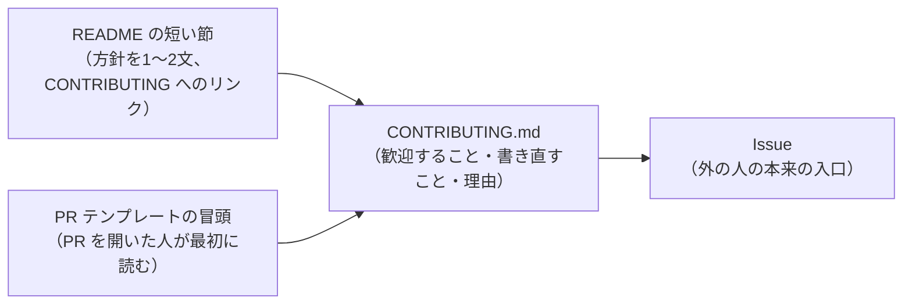
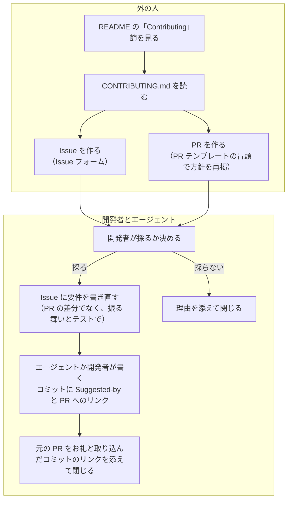

# 外からの Issue と PR の受け方を伝える方法（open-source, not open-contribution）

調査日: 2026-09-25
対象: nu-tori の方針「誰でも Issue と PR を出してよい。外から来たコードはそのまま main に取り込まず、参考として読み、開発者かエージェントが書き直して取り込む（CLA は使わない）。main に入れるかは開発者だけが決める」を、外の人にどのファイルで、どんな文言で伝えるか。前提は ADR-0010（リポジトリを公開して開発する）。ライセンスは FSL-1.1 か、それに近いソース公開型にする予定

> **確認の方法と限界**
> - 実例のプロジェクトのファイルは、raw.githubusercontent.com から取得するか clone して**本文を直接読んだ**。Litestream は git の履歴を読み、方針を変える前（2021〜2023年）の README、`.github/CONTRIBUTING.md`、PR テンプレートの原文も確かめた。SQLite と Lua は公式サイトの HTML を取得して読んだ。
> - GitHub の仕組みは、github/docs リポジトリの Markdown 原稿（2026-09-24 のコミット d5e9a63）と、github.blog の changelog の HTML を読んだ。原稿の `` は `data/features/*.yml` を見て github.com（`fpt`）に当たることを確かめた。出典にはふつうの docs.github.com の URL を書く。
> - tldraw の Issue #7695 と、tldraw・SQLite の PR 一覧の画面は、この環境から GitHub API で読めなかったため、WebFetch（取得した本文を小さなモデルが要約する）で読んだ。ここからの引用は、原文と一字一句同じかを確かめていない。
> - 法律は e-Gov 法令 API で著作権法の条文を、govinfo.gov で米国著作権法 17 U.S.C. §102 の条文を読んだ。条文を nu-tori に当てはめた部分は「本文からの読み取り」で、法律家の確認はしていない。
> - 本文で確かめた主張は「本文で確認」と書き、短い英語の原文を添える。本文の記述から推し量ったものは「本文からの読み取り」と書き、何から読み取ったかを添える。本文を探しても記述が無かったものは「記述なし」と書き、探したページを添える。
> - 二次情報（ブログの解説記事、Q&A サイト、SNS）は使っていない。例外として、GitButler が CLA を使わない理由として張っているリンク先（Ben Balter の個人ブログ）は、GitButler の本文の一部として挙げるだけで、内容は読んでいない。
> - 各プロジェクトの方針は変わる。Litestream は「受けない」から「バグ修正だけ受ける」に変えている。ここに書いたのは 2026-09-25 時点の状態。

## 結論の要約

- **一般的なのは「README の短い節 ＋ CONTRIBUTING.md の本文 ＋ PR テンプレートの冒頭」の3か所に同じ方針を書き、Issue に誘導する形**（本文で確認）。Litestream は受けなかった時期に、この3か所すべてに書いていた。SQLite と Lua は README（GitHub のミラー）と公式サイトの FAQ・著作権のページに書いている。tldraw は README と CONTRIBUTING.md に書き、さらに PR の作成を共同作業者だけに絞っている。SECURITY.md や Issue テンプレートに受け入れの方針を書いた例は、読んだ範囲には無い（本文からの読み取り）。
- **文言の型は3つの部分からなる**（本文で確認）。
  1. 何を歓迎するか: Issue、バグの報告、議論、試しのコード（SQLite: "include a patch as a proof-of-concept, that would be great"）
  2. コードはそのまま入れず、自分たちで書き直すこと: Lua の "we never incorporate third-party code verbatim … we provide our own code"、SQLite の "please do not be offended if we rewrite your patch from scratch" が、nu-tori の方針にいちばん近い
  3. 理由: 権利をきれいに保つため（SQLite、Litestream）、保守の負担と燃え尽きを避けるため（Litestream）、AI で作られた低品質な PR が増えたため（tldraw、Ghostty）
- **GitHub の仕組み**（本文で確認）
  - CONTRIBUTING.md はルート、`docs/`、`.github/` のどれに置いてもよい。複数あれば `.github/` → ルート → `docs/` の順に選ばれる。Issue や PR を作る人には、そのファイルへのリンクが表示される。リポジトリの概要の「Contributing」タブとサイドバーにも出る。
  - PR テンプレートは PR の本文に自動で入る。Issue テンプレートの `config.yml` で `blank_issues_enabled: false` にすると、書き込み権限の無い人はテンプレートからしか Issue を作れない。
  - **2026-02-13 から、PR を完全に無効にするか、作成を共同作業者（書き込み権限のある人）だけに絞れる**。2026-06-29 から、Issue の作成も共同作業者だけに絞れる。ほかに、一時的な interaction limits（24時間〜6か月）と、書き込み権限の無い人が同時に開ける PR の数の上限がある。
  - PR を共同作業者だけに絞ると、外の人は PR を作れなくなり、「誰でも PR を出してよい」という nu-tori の方針とは合わない。Dependabot などの bot の PR がこの設定でどうなるかは、GitHub の文書に記述なし。
- **書き直して取り込むときの作法**
  - 名前の残し方: Git 本体の文書は、アイデアだけをもらったときは `Suggested-by:` や `Helped-by:`、下書きをやり取りしたときは `Co-authored-by:` と使い分けている。Linux カーネルは `Suggested-by:` を「アイデアの功績を残す」ためのものとし、公開の場での提案なら本人の明示の許可が要らないとしている（本文で確認）。GitHub が貢献として数えるのは `Co-authored-by:` だけで、ほかの trailer の扱いは記述なし。
  - ライセンス: GitHub の利用規約は、ライセンスの表示があるリポジトリに入れた内容は同じライセンスで提供したことになる（inbound=outbound）と定めている。著作権はアイデアや解法には及ばない（米国 §102(b)、日本の著作権法10条3項）（本文で確認）。FSL の条文を当てはめると、外の人のコードを FSL のまま受け取った場合、それを含む課金アプリを出すことが「Competing Use」にあたるおそれがある。書き直す方針はこれを避ける（本文からの読み取り、法律家の確認なし）。
  - 「どこまで離れて書けば写したことにならないか」を定めた一次情報は、読んだ範囲に記述なし。
- nu-tori への当てはめは末尾の「nu-tori への当てはめ」。

## 問い1: 実例（どのファイルに、どんな文言で書いているか）

### SQLite（パブリックドメイン。公式サイトと GitHub のミラー）

| 問い | 答え | 確かさ | 出典 |
|---|---|---|---|
| どこに書いているか | 公式サイトの著作権のページ（copyright.html）に「Open-Source, not Open-Contribution」と「Contributed Code」の節。GitHub のミラーの README に「Public Domain」の節 | 本文で確認 | https://www.sqlite.org/copyright.html 、https://github.com/sqlite/sqlite/blob/master/README.md |
| 方針の文言 | "SQLite is open-source, meaning that you can make as many copies of it as you want … But SQLite is not open-contribution. In order to keep SQLite in the public domain and ensure that the code does not become contaminated with proprietary or licensed content, the project does not accept patches from people who have not submitted an affidavit dedicating their contribution into the public domain." | 本文で確認 | copyright.html |
| 書き直すことの文言 | "the project does not accept patches from random people on the internet. There is a process to get a patch accepted, but that process is involved and for smaller changes is not normally worth the effort. If you would like to suggest a change and you include a patch as a proof-of-concept, that would be great. However, please do not be offended if we rewrite your patch from scratch." | 本文で確認 | copyright.html |
| README（GitHub）の文言 | "Because SQLite is in the public domain, we do not normally accept pull requests, because if we did take a pull request, the changes in that pull request might carry a copyright and the SQLite source code would then no longer be fully in the public domain." バグの報告は SQLite のフォーラム、セキュリティに関わるものは開発者へのメールに誘導している | 本文で確認 | README.md |
| コードの出どころ | "All of the deliverable code in SQLite has been written from scratch. No code has been taken from other projects or from the open internet. Every line of code can be traced back to its original author" | 本文で確認 | copyright.html |
| GitHub の PR の設定 | ミラーの PR は開いたまま（Open 23、Closed 24。2026-09-25 時点） | 本文で確認（WebFetch の要約） | https://github.com/sqlite/sqlite/pulls |

### Lua（MIT。公式サイトの FAQ と GitHub のミラー）

| 問い | 答え | 確かさ | 出典 |
|---|---|---|---|
| どこに書いているか | 公式サイトの FAQ の「1.8 Is there a public revision control repository?」と「1.9 Do you accept patches?」。GitHub のミラーの README | 本文で確認 | https://www.lua.org/faq.html 、https://github.com/lua/lua/blob/master/README.md |
| 方針の文言 | "Lua is open-source software but it is not openly developed."（FAQ 1.8）。README: "Please **do not** send pull requests. To report issues, post a message to the Lua mailing list." | 本文で確認 | 同上 |
| 書き直すことの文言 | "We encourage discussions based on tested code solutions for problems and enhancements, but we never incorporate third-party code verbatim. We always try to understand the issue and the proposed solution and then, if we choose to address the issue, we provide our own code. All code in Lua is written by us."（FAQ 1.9） | 本文で確認 | https://www.lua.org/faq.html |

nu-tori の方針（外のコードは参考として読み、書き直す）に、文言としていちばん近い。

### Litestream（Apache-2.0。受けなかった時期の3か所と、今の形）

| 問い | 答え | 確かさ | 出典 |
|---|---|---|---|
| 受けなかった時期にどこに書いたか | README の「Open-source, not open-contribution」の節（2021-01〜2023-03）、`.github/CONTRIBUTING.md`（2021-01〜）、`.github/pull_request_template.md`（2021-04〜）の3か所 | 本文で確認（git の履歴: コミット 2244be8、778451f、178cf83、68e60cb） | https://github.com/benbjohnson/litestream/blob/2244be885d3d58efdc8b6c1eb89ec384ecdba903/README.md |
| README・CONTRIBUTING の文言 | "Similar to SQLite, Litestream is open source but closed to code contributions. This keeps the code base free of proprietary or licensed code but it also helps me continue to maintain and build Litestream." 理由として BoltDB の保守で燃え尽きた経験を挙げ、"I am grateful for community involvement, bug reports, & feature requests. I do not wish to come off as anything but welcoming, however, I've made the decision to keep this project closed to contributions for my own mental health and long term viability of the project." | 本文で確認 | 同上 |
| PR テンプレートの文言 | "Litestream is not accepting code contributions at this time. You can find a summary of why on the project's GitHub README: https://github.com/benbjohnson/litestream#open-source-not-open-contribution Web site & Documentation changes, however, are welcome." PR を開こうとした人が本文の欄で最初に読む場所に置いている | 本文で確認（68e60cb の親の版） | 同上（`.github/pull_request_template.md`） |
| 今の方針 | 2023-03 に「バグ修正だけ受ける」に変えた: "Initially, Litestream was closed to outside contributions. … However, this policy is overly broad and has prevented small, easily testable patches from being contributed. Litestream is now open to code contributions for bug fixes only."。今の CONTRIBUTING.md は「Generally Not Accepted」に "Large external feature contributions: … we typically implement major features internally" を挙げる | 本文で確認 | https://github.com/benbjohnson/litestream/commit/68e60cbfdf453559a351c3783917829b8d11e8b6 、https://github.com/benbjohnson/litestream/blob/main/CONTRIBUTING.md |

### tldraw（tldraw license。ソース公開・商用）

| 問い | 答え | 確かさ | 出典 |
|---|---|---|---|
| どこに書いているか | README の「Contributing」の節と、ルートの CONTRIBUTING.md。方針の説明は Issue #7695 に置き、そこへリンクしている | 本文で確認 | https://github.com/tldraw/tldraw/blob/main/README.md 、https://github.com/tldraw/tldraw/blob/main/CONTRIBUTING.md |
| CONTRIBUTING.md の文言 | "We are **not accepting contributions** to tldraw at this time. Pull requests are turned off for this repository." 「Create an issue instead」の節で "If you have found a bug, have a feature request, or want to suggest a change, please create an issue. … we read every one. If a code example would help the discussion, fork the repository and link to your branch in the issue." | 本文で確認 | CONTRIBUTING.md |
| 理由（Issue #7695、2026-01-15） | "we're going to begin **automatically closing pull requests from external contributors**. We will of course continue to welcome issues, bug reports, and discussions. This is a temporary policy until GitHub provides better tools for managing contributions." 理由は AI だけで作られた PR の増加 | 本文で確認（WebFetch の要約） | https://github.com/tldraw/tldraw/issues/7695 |
| GitHub の設定 | PR 一覧に「Pull request creation is restricted」と出る。一覧は見える（Open 141、Closed 7,144）。CONTRIBUTING.md は「turned off」と書いているが、実際は完全な無効ではなく、作成を共同作業者だけに絞る設定 | 本文で確認（WebFetch の要約、2026-09-25）。設定の名前は「問い2」の文書との照合による読み取り | https://github.com/tldraw/tldraw/pulls |
| テンプレート | Issue テンプレートの `config.yml` は `blank_issues_enabled: true` のまま、ドキュメントと Discord へのリンクを足している。PR テンプレートは受け入れの方針に触れていない | 本文で確認 | https://github.com/tldraw/tldraw/tree/main/.github |

### GitButler（FSL-1.1-MIT。受け入れるが、事前の相談を求める）

| 問い | 答え | 確かさ | 出典 |
|---|---|---|---|
| どこに書いているか | ルートの CONTRIBUTING.md の冒頭「Understand the License」 | 本文で確認 | https://github.com/gitbutlerapp/gitbutler/blob/master/CONTRIBUTING.md |
| ライセンスの説明 | "we have licensed this software under the Functional Source License, a mostly permissive non-compete license that converts to Apache 2.0 or MIT after two years. So, it's not strictly OSS, but it _will_ be. You're free to contribute, but you can't take this and use it to compete with us." | 本文で確認 | 同上 |
| 受け入れの文言 | "external contributions and remote work aren't really a central part of our process. … if you want to get something accepted, please discuss it with us first" | 本文で確認 | 同上 |
| CLA | 使わない: "Any contributions sent to us implicitly give us the right to redistribute that work under the same license and rights."。理由として Ben Balter の記事（"Why you probably shouldn't add a CLA to your open source project"）にリンクしている | 本文で確認 | 同上 |

### Sentry（FSL-1.1-Apache-2.0。FSL の提唱元）

| 問い | 答え | 確かさ | 出典 |
|---|---|---|---|
| どこに書いているか | `.github/CONTRIBUTING.md`（ルートには置いていない）。中身は開発者向け文書へのリンクと、相談は Issue ではなく Discussions へ、という案内だけ | 本文で確認 | https://github.com/getsentry/sentry/blob/master/.github/CONTRIBUTING.md |
| 外のコードの扱い | 受け入れる側。社内の文書は "we want to ensure that the barrier to entry for external contributions is minimal" と書く。SDK の外部 PR の手順（2026-02-21）は、Issue が紐づかない大きめの PR は定型の返信を付けて閉じ、"Closing fast is kind" とする | 本文で確認 | https://develop.sentry.dev/engineering-practices/code-review/ 、https://develop.sentry.dev/sdk/getting-started/playbooks/development/handling-external-contributor-pr/ |
| FSL の公式サイトは貢献の扱いを書いているか | fsl.software は、FSL のソフトでできることに "proposing improvements back to the producer" を挙げるだけ。CLA や外部のコードの受け方には触れていない。fair.io（Fair Source）も同じく記述なし | 記述なし（fsl.software のトップと FAQ、getsentry/fsl.software の README、fair.io のトップ・About・FAQ） | https://fsl.software/ 、https://fair.io/about/ |

FSL を使っていることと、外のコードを受けるかどうかは別の話で、FSL の2社（Sentry、GitButler）はどちらも受け入れる側だった（本文からの読み取り）。

### 参考: Ghostty（MIT。紹介された人だけが PR を出せる）

CONTRIBUTING.md に「vouch」の仕組みを書いている。初めての人は Discussions で紹介を頼み、メンテナが `!vouch` とコメントしてから PR を出せる。"If you aren't vouched, any pull requests you open will be automatically closed. … AI has unfortunately made it so we can no longer trust-by-default"。Issue の作成も Discussions を経てからにしている（本文で確認: https://github.com/ghostty-org/ghostty/blob/main/CONTRIBUTING.md ）。書き直す方針ではないが、「PR を自動で閉じる理由を先に書いておく」例として挙げる。

### 実例から見える書き方

- 方針の本体は CONTRIBUTING.md か、公式サイトの1ページに置き、README と PR テンプレートからそこへリンクする（Litestream、tldraw、SQLite）（本文で確認）。
- 歓迎すること（Issue、バグの報告、試しのコード、フォークのブランチへのリンク）を先に書き、断ることを後に書く。断る理由を短く添える（全例）（本文で確認）。
- 「PR を出してもよいが、そのままは入れない」と書いたのは SQLite と Lua。どちらも「試しのコードや解決の案は歓迎する」と書いたうえで「自分たちで書く」と書いている（本文で確認）。

## 問い2: GitHub の仕組み

### CONTRIBUTING.md の置き場所と表示

| 問い | 答え | 確かさ | 出典 |
|---|---|---|---|
| 置き場所 | ルート、`docs/`、`.github/` のどれか。ファイル名の大文字・小文字は区別しない | 本文で確認 | https://docs.github.com/en/communities/setting-up-your-project-for-healthy-contributions/setting-guidelines-for-repository-contributors |
| 複数あるとき | "the file shown in links is chosen from locations in the following order: the `.github` directory, then the repository's root directory, and finally the `docs` directory." | 本文で確認 | 同上 |
| 作る人への案内 | "When someone opens a pull request or creates an issue, they will see a link to that file." ほかに、リポジトリの `contribute` のページ、概要の「Contributing」タブ（README や Code of conduct と並ぶ）、サイドバーの「Contributing」リンクにも出る | 本文で確認 | 同上 |
| アカウントの既定のファイル | CONTRIBUTING.md、SECURITY.md、SUPPORT.md、CODE_OF_CONDUCT.md、Issue・PR テンプレートと `config.yml` は、アカウントの `.github` という名前の公開リポジトリに置くと、そのアカウントのリポジトリの既定になる。ライセンスは既定にできない | 本文で確認 | https://docs.github.com/en/communities/setting-up-your-project-for-healthy-contributions/creating-a-default-community-health-file |

### PR テンプレートと Issue テンプレート

| 問い | 答え | 確かさ | 出典 |
|---|---|---|---|
| PR テンプレートの役割 | "When you add a pull request template to your repository, project contributors will automatically see the template's contents in the pull request body." 置き場所はルート、`docs/`、`.github/`。既定のブランチに置く | 本文で確認 | https://docs.github.com/en/communities/using-templates-to-encourage-useful-issues-and-pull-requests/about-issue-and-pull-request-templates |
| PR テンプレートで PR を止められるか | 止められない。本文に入る文章なので、読まずに消して出すこともできる | 本文からの読み取り（文書が挙げる用途は「関係する Issue、変更の説明、レビュー担当への @メンション」を書かせること） | https://docs.github.com/en/communities/using-templates-to-encourage-useful-issues-and-pull-requests/creating-a-pull-request-template-for-your-repository |
| Issue テンプレートの `config.yml` | `.github/ISSUE_TEMPLATE/config.yml` で選択画面を変える。`blank_issues_enabled: false` にすると、Read・Triage の人は用意したテンプレートしか選べない。書き込み権限以上の人には「Maintainers only」付きで空の Issue が残る。`contact_links` で外のサイト（相談の場、脆弱性の報告先など）に誘導できる | 本文で確認 | https://docs.github.com/en/communities/using-templates-to-encourage-useful-issues-and-pull-requests/configuring-issue-templates-for-your-repository |
| Issue フォーム | `.yml` の Issue フォームで入力欄と必須の項目を決められる | 本文で確認 | https://docs.github.com/en/communities/using-templates-to-encourage-useful-issues-and-pull-requests/syntax-for-issue-forms |

### PR と Issue の作成を止める・絞る設定（2026-09 時点）

| 問い | 答え | 確かさ | 出典 |
|---|---|---|---|
| PR を完全に無効にできるか | できる（2026-02-13 から）。Settings > General > Features で Pull requests を外す。"When disabled, the pull requests tab will not be visible. This means no one can see existing pull requests or open new ones." 用途として "projects where you want to share your work publicly without managing contributions" を挙げる。戻すと以前の PR も戻る | 本文で確認 | https://github.blog/changelog/2026-02-13-new-repository-settings-for-configuring-pull-request-access/ 、https://docs.github.com/en/repositories/managing-your-repositorys-settings-and-features/enabling-features-for-your-repository/disabling-pull-requests |
| 共同作業者だけに絞れるか | できる（同日から）。"the pull requests tab remains visible. All pull requests can be seen and commented on, but only collaborators (i.e., users with write access) can create new ones." 個人のリポジトリでは、招待された人が共同作業者 | 本文で確認 | 同上 |
| 公開・非公開、プラン | "available now for all public and private repositories"。文書の feature フラグは github.com（fpt）、GHEC、GHES 3.21 以降 | 本文で確認 | 同上、github/docs `data/features/disable-restrict-prs.yml` |
| Issue の作成を絞れるか | できる（2026-06-29 から）。Settings の Features > Issues で「Creation allowed by: Collaborators only」。"people without write access can't create issues from entry points across the repository experience, including Issues, Comments, Discussions, Projects, and Copilot." | 本文で確認 | https://github.blog/changelog/2026-06-29-restrict-issue-creation-to-collaborators-only/ 、https://docs.github.com/en/repositories/managing-your-repositorys-settings-and-features/enabling-features-for-your-repository/disabling-issues |
| 一時的な制限 | interaction limits: 「既存のユーザーだけ」「以前の貢献者だけ」「共同作業者だけ」の3種類を、24時間、3日、1週間、1か月、6か月のどれかでかける。コメント、Issue の作成、PR の作成、リアクションなどを止める | 本文で確認 | https://docs.github.com/en/communities/moderating-comments-and-conversations/limiting-interactions-in-your-repository |
| 開ける PR の数の上限 | 公開リポジトリで、書き込み権限の無い人が同時に開ける PR（下書きを除く）の数に上限をかけられる。信頼する人を100人まで除外リストに入れられる | 本文で確認 | 同上 |
| PR を人目から外す | 管理者は PR を archive できる。閉じてロックし、管理者以外には 404 になる | 本文で確認 | https://docs.github.com/en/communities/moderating-comments-and-conversations/archive-pull-requests |
| bot（Dependabot など）や GitHub App の PR への影響 | 「Collaborators only」にしたとき、Dependabot や Codex・Cursor などの連携が作る PR が止まるかは書かれていない | 記述なし（changelog 2026-02-13、disabling-pull-requests の文書、github/docs の中の「Collaborators only」を含む全ページ） | 同上 |

## 問い3: 書き直して取り込むときの作法

### 元の人の名前を残す慣例

| 問い | 答え | 確かさ | 出典 |
|---|---|---|---|
| GitHub の `Co-authored-by` | "Add one or more `Co-authored-by` trailers to a commit message to attribute a commit to multiple authors." 貢献として数えるには、相手の GitHub アカウントに紐づくメール（非公開なら GitHub の no-reply のメール）を使う | 本文で確認 | https://docs.github.com/en/pull-requests/how-tos/commit-changes/creating-a-commit-with-multiple-authors |
| GitHub が数える trailer | 文書に出てくるのは `Co-authored-by` だけ。`Suggested-by` などを GitHub がどう扱うかは書かれていない | 記述なし（同上） | 同上 |
| Git 本体の使い分け | "`Co-authored-by:` is used to indicate that people exchanged drafts of a patch before submitting it."、"`Based-on-patch-by:` is used when someone else authored parts of the patch"、"`Helped-by:` is used to credit someone who suggested ideas for changes without providing the precise changes in patch form."、"`Suggested-by:` is used to credit someone with suggesting the idea for a patch." 名前とメールを Git の作者と同じ形で書く | 本文で確認 | https://github.com/git/git/blob/master/Documentation/SubmittingPatches （Commit trailers） |
| Linux カーネル | "A Suggested-by: tag indicates that the patch idea is suggested by the person named and ensures credit to the person for the idea"。`Cc:`、`Reported-by:`、`Suggested-by:` の3つだけは、公開の場で報告・提案した人なら明示の許可なしに付けてよい。`Co-developed-by:` は共著を表し、共著者の `Signed-off-by:` が必ず続く | 本文で確認 | https://docs.kernel.org/process/submitting-patches.html （"Using Reported-by:, Tested-by:, Reviewed-by:, Suggested-by: and Fixes:"、"Tagging people requires permission"） |
| 書き直したことを伝える作法 | SQLite は「書き直しても気を悪くしないで」と事前に書く。Lua は「理解したうえで自分たちのコードを書く」と書く。書き直した後に元の PR へどう返すか（閉じ方、コメント、リンク）を定めた文書は見当たらない | 本文で確認（前半）。後半は記述なし（SQLite の copyright.html と README、Lua の FAQ） | 問い1の出典 |

### ライセンス上の注意

| 問い | 答え | 確かさ | 出典 |
|---|---|---|---|
| PR のコードはどのライセンスで入ってくるか | GitHub の利用規約 D.6: "Whenever you add Content to a repository containing notice of a license, you license that Content under the same terms … If you have a separate agreement to license that Content under different terms, such as a contributor license agreement, that agreement will supersede." これを "inbound=outbound" と呼んでいる | 本文で確認 | https://docs.github.com/en/site-policy/github-terms/github-terms-of-service （D.6） |
| ライセンスが無いリポジトリ（今の nu-tori、ADR-0010） | ライセンスが無ければ既定の著作権法が当てはまり、作者がすべての権利を持つ。利用規約 D.5 で、公開リポジトリは見ることとフォークすることだけを他の利用者に許す | 本文で確認 | https://docs.github.com/en/repositories/managing-your-repositorys-settings-and-features/customizing-your-repository/licensing-a-repository 、利用規約 D.5 |
| FSL で外のコードを受け取るとどうなるか | FSL の「Competing Use」は、ソフトを "a commercial product or service that … offers the same or substantially similar functionality as the Software" で提供すること。外の人のコードが inbound=outbound で FSL のまま入ると、その部分のライセンサーは外の人になり、それを含む課金アプリを出すことがこの条項にあたる読み方がありうる。書き直して外の人のコードを含めなければ、この問題は起きない | 本文からの読み取り（FSL-1.1 の条文と利用規約 D.6 から。法律家の確認なし） | https://fsl.software/ （FSL-1.1-MIT、FSL-1.1-ALv2 の条文） |
| アイデアを使って書き直すことは許されるか | 米国: "In no case does copyright protection for an original work of authorship extend to any idea, procedure, process, system, method of operation, concept, principle, or discovery"（17 U.S.C. §102(b)）。日本: 著作物は「思想又は感情を創作的に表現したもの」（2条1項1号）で、プログラムの保護は「プログラム言語、規約及び解法に及ばない」（10条3項）。守られるのは表現で、アイデアや解法ではない | 本文で確認 | https://www.govinfo.gov/content/pkg/USCODE-2023-title17/html/USCODE-2023-title17-chap1-sec102.htm 、https://laws.e-gov.go.jp/law/345AC0000000048 |
| どこまで離れて書けば「写した」ことにならないか | 基準を示した一次情報は、読んだ範囲に無い。実例は「ゼロから書く」（SQLite: "rewrite your patch from scratch"）、「逐語的には入れない」（Lua: "never incorporate third-party code verbatim"）と書くだけで、手順は定めていない | 記述なし（上の条文、SQLite と Lua のページ） | — |

## nu-tori への当てはめ

以下は上の事実からの提案で、決定ではない。

### 置き場所と流れ

- **README**: 短い節で「Issue と PR は歓迎。ただし外のコードはそのまま取り込まず、参考にして書き直す」と書き、CONTRIBUTING.md へリンクする（Litestream、tldraw の形）。
- **CONTRIBUTING.md**: ルートに置く（`.github/` にも置けるが、ルートのほうがリポジトリを開いた人に見える。どこに置いても GitHub はリンクを出す）。中身は「歓迎すること」「コードはそのまま入れず書き直すこと（Lua・SQLite の文言が型になる）」「理由（ソース公開型のライセンスで課金アプリを出すため、権利をきれいに保つ。一人で保守するため）」「名前の残し方（Suggested-by を付ける）」の順。
- **PR テンプレート**: 冒頭に1〜2文で方針を再掲し、CONTRIBUTING.md にリンクする（Litestream の形）。PR テンプレートは止める力は無いが、PR を開いた人が必ず目にする。
- **Issue テンプレート**: 方針を書く場所ではない。`blank_issues_enabled: false` と Issue フォームで、バグと要望に要る情報を集める。受け入れの方針を Issue テンプレートや SECURITY.md に書いた実例は読んだ範囲に無かった。
- **GitHub の設定**: PR を「Collaborators only」にすると、外の人は PR を出せなくなる。tldraw の「Issue にフォークのブランチのリンクを張って」の形にすれば、書き直す方針でも読む材料は同じだけ集まる。PR を開いたままにするか絞るかは、外の PR の量を見てから決められる。絞るなら、Dependabot と Codex・Cursor の連携の PR が止まらないかを先に試す（文書に記述なし）。

### 書き直すときの作法

- 名前は `Co-authored-by:` ではなく `Suggested-by:`（または `Helped-by:`）で残す。書き直した場合、外の人は「下書きをやり取りした共著者」ではなく「アイデアを出した人」にあたる（Git の使い分け）。公開の PR での提案なので、カーネルの慣例では明示の許可なしに付けられる。GitHub の貢献のグラフには載らないので、PR へのリンクも本文に書く。
- エージェントに書き直させるときは、外の PR の差分をそのまま渡さず、開発者が Issue に要件（振る舞い、受け入れの条件、テストの観点）として書き直してから渡す。著作権が守るのは表現で、アイデアや解法ではないため、差分を見ながら写す形を避ける（提案。「どこまで離れればよいか」の一次情報は無い）。
- ライセンスを付ける前に、CONTRIBUTING.md に「外のコードはそのまま取り込まない」と書いておく。GitHub の利用規約の inbound=outbound で外のコードが FSL のまま入ると、課金アプリとの関係で「Competing Use」の読み方の問題が起きうる。書き直す方針なら、CLA なしでもこの問題を避けられる（本文からの読み取り。ライセンスを決めるときに法律家に確かめる）。

## 出典一覧

実例（2026-09-25 に取得）
- SQLite: https://www.sqlite.org/copyright.html 、https://github.com/sqlite/sqlite/blob/master/README.md 、https://github.com/sqlite/sqlite/pulls
- Lua: https://www.lua.org/faq.html 、https://github.com/lua/lua/blob/master/README.md
- Litestream: https://github.com/benbjohnson/litestream/blob/main/CONTRIBUTING.md 、README の旧版 https://github.com/benbjohnson/litestream/blob/2244be885d3d58efdc8b6c1eb89ec384ecdba903/README.md 、方針の変更 https://github.com/benbjohnson/litestream/commit/68e60cbfdf453559a351c3783917829b8d11e8b6 （旧 `.github/CONTRIBUTING.md` と `.github/pull_request_template.md` はこのコミットの親の版）
- tldraw: https://github.com/tldraw/tldraw/blob/main/CONTRIBUTING.md 、https://github.com/tldraw/tldraw/blob/main/README.md 、https://github.com/tldraw/tldraw/issues/7695 、https://github.com/tldraw/tldraw/pulls
- GitButler: https://github.com/gitbutlerapp/gitbutler/blob/master/CONTRIBUTING.md
- Sentry: https://github.com/getsentry/sentry/blob/master/.github/CONTRIBUTING.md 、https://develop.sentry.dev/engineering-practices/code-review/ 、https://develop.sentry.dev/sdk/getting-started/playbooks/development/handling-external-contributor-pr/
- Ghostty: https://github.com/ghostty-org/ghostty/blob/main/CONTRIBUTING.md
- FSL・Fair Source: https://fsl.software/ 、https://github.com/getsentry/fsl.software 、https://fair.io/about/

GitHub（github/docs のコミット d5e9a63、2026-09-24）
- Setting guidelines for repository contributors: https://docs.github.com/en/communities/setting-up-your-project-for-healthy-contributions/setting-guidelines-for-repository-contributors
- Creating a default community health file: https://docs.github.com/en/communities/setting-up-your-project-for-healthy-contributions/creating-a-default-community-health-file
- About issue and pull request templates: https://docs.github.com/en/communities/using-templates-to-encourage-useful-issues-and-pull-requests/about-issue-and-pull-request-templates
- Configuring issue templates: https://docs.github.com/en/communities/using-templates-to-encourage-useful-issues-and-pull-requests/configuring-issue-templates-for-your-repository
- Creating a pull request template: https://docs.github.com/en/communities/using-templates-to-encourage-useful-issues-and-pull-requests/creating-a-pull-request-template-for-your-repository
- Disabling pull requests: https://docs.github.com/en/repositories/managing-your-repositorys-settings-and-features/enabling-features-for-your-repository/disabling-pull-requests
- Disabling issues: https://docs.github.com/en/repositories/managing-your-repositorys-settings-and-features/enabling-features-for-your-repository/disabling-issues
- Limiting interactions in your repository: https://docs.github.com/en/communities/moderating-comments-and-conversations/limiting-interactions-in-your-repository
- Archive pull requests: https://docs.github.com/en/communities/moderating-comments-and-conversations/archive-pull-requests
- Creating a commit with multiple authors: https://docs.github.com/en/pull-requests/how-tos/commit-changes/creating-a-commit-with-multiple-authors
- Licensing a repository: https://docs.github.com/en/repositories/managing-your-repositorys-settings-and-features/customizing-your-repository/licensing-a-repository
- GitHub Terms of Service（D.5、D.6）: https://docs.github.com/en/site-policy/github-terms/github-terms-of-service
- Changelog 2026-02-13: https://github.blog/changelog/2026-02-13-new-repository-settings-for-configuring-pull-request-access/
- Changelog 2026-06-29: https://github.blog/changelog/2026-06-29-restrict-issue-creation-to-collaborators-only/

名前の残し方
- Git SubmittingPatches（Commit trailers）: https://github.com/git/git/blob/master/Documentation/SubmittingPatches
- Linux カーネル Submitting patches: https://docs.kernel.org/process/submitting-patches.html

法律
- 17 U.S.C. §102: https://www.govinfo.gov/content/pkg/USCODE-2023-title17/html/USCODE-2023-title17-chap1-sec102.htm
- 著作権法（昭和四十五年法律第四十八号）2条、10条: https://laws.e-gov.go.jp/law/345AC0000000048
