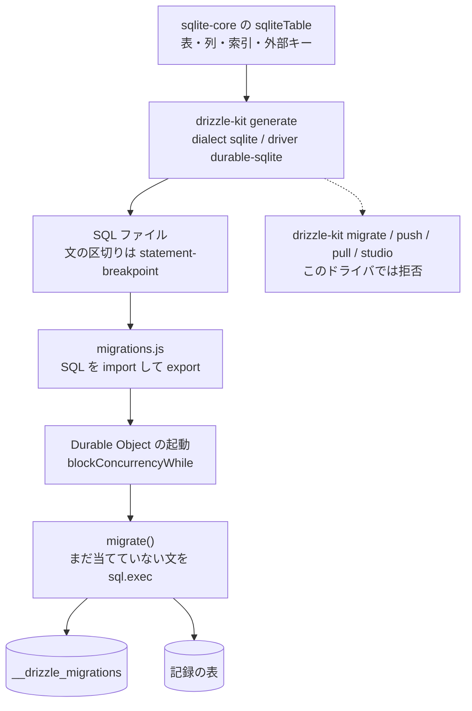

# Durable Object の SQLite を Drizzle で扱う公式のやり方

調査日: 2026-09-29
対象: アカウントの記録を置く Durable Object の SQLite を、Drizzle のスキーマ定義を正本にして扱う公式の手順。認証の表は D1、記録は Durable Object、と分かれている（ADR-0019、`server/AGENTS.md`）。認証の表を Drizzle で扱う話は別の調査（[PR #140](https://github.com/gn-t-k/nu-tori/pull/140)、ブランチ上の `docs/research/better-auth-drizzle.md`）にあり、ここでは繰り返さない。

> **確認の方法と限界**
> - Drizzle は GitHub の公式リポジトリを**タグ `0.45.3`（2026-09-21、npm の `latest`、コミット `15454dbe`）で取得し、`drizzle-orm/src/durable-sqlite/`、`drizzle-kit` の durable-sqlite の分岐、`drizzle-seed` の型を直接読んだ**。同じリポジトリの**タグ `v1.0.0-rc.4`（2026-06-27、npm の `rc`、コミット `748058e8`）**は、文書が入れるよう書く版なので、Durable Object のドライバ・移行器と Kit の出すファイルの形だけ読んだ。
> - 文書は `drizzle-team/drizzle-orm-docs` の既定ブランチ（コミット `236d7ea`、2026-09-23）の原文（`src/content/docs/sqlite/connect-cloudflare-do.mdx`、`src/content/docs/get-started/do-new.mdx`、`src/content/docs/get-started/do-existing.mdx`、索引・シードのページ）を直接読んだ。
> - Cloudflare は `cloudflare/cloudflare-docs` の `production` から、Durable Object の SQLite の API・制限・索引のページの原文を直接読んだ。`sqlite-storage-api.mdx` の最終更新は 2026-09-21、`platform/limits.mdx` の最終更新は 2026-06-01。
> - npm の `dist-tags` と、公開パッケージ `drizzle-orm@0.45.3` の `exports` はレジストリで確かめた。
> - `@praha/drizzle-factory` は公式ではない。**1.4.2（2025-11-10）の README と公開物の型（`.d.ts`）だけ**を読んだ。ソースの実装は読んでいない。
> - 本文の記述から推し量ったもの、ソースの流れを追って判断したものは「本文からの読み取り」と書き、何から読み取ったかを添える。
> - 本文やソースを探しても記述が無かったものは「本文を探したが記述なし」と書く。
> - **どれも動かしていない。** `drizzle-kit generate` も、Durable Object への適用も、D1 との同時の import もしていない。
> - 二次情報（ブログ、まとめ記事、Qiita・Zenn、コミュニティフォーラム、GitHub の Issue の議論）は根拠にしていない。
> - 開発者自身の健康データは扱っていない。

## 結論の要約

- **Drizzle は Durable Object の SQLite を公式にサポートする。** 実行時の入口は `drizzle-orm/durable-sqlite` の `drizzle(storage)`。移行を当てる関数は `drizzle-orm/durable-sqlite/migrator` の `migrate`。Kit の設定は `dialect: "sqlite"` と `driver: "durable-sqlite"`（DR1、DR2、DR4）。
- **文書が入れるよう書くのは `@rc`（取得日時点で orm も kit も 1.0.0-rc.4、2026-06-27 公開）である。** npm の `latest` は **0.45.3 / kit 0.31.11（2026-09-21 公開）**で、同じ入口がある。公開日は `latest` の方が新しい。移行ファイルの束ね方と、当て済みの見分け方は、この2つで違う（DR1、DR2、DR6、DR7）。
- **SQL を出すのは Drizzle Kit の `generate`。** `driver: "durable-sqlite"` のとき、SQL ファイルに加えて `migrations.js` を出す。**`drizzle-kit migrate`・`push`・`pull`・`studio` はこのドライバでは拒否する。** 当てるのは Durable Object の中の `migrate()` で、文書はコンストラクタの `blockConcurrencyWhile` から呼ぶ。呼ぶ場所を起動に置けば、まだ当てていない SQL を自分の DB へ順に当てる作りと合う。当て済みを覚える表と、1回のトランザクションにまとめる単位は、このリポジトリの版番号の移行とは違う（DR2、DR5、DR6、DR7）。
- **表・列・索引・外部キーは `drizzle-orm/sqlite-core` の `sqliteTable` の1か所で宣言できる。** Kit は `dialect: "sqlite"` の SQL を出す。Durable Object 専用の SQL 方言は無い。索引の宣言を拒む分岐は、sqlite の生成器には見当たらなかった。Cloudflare が書く制限は、列 100、文 100 KB、束縛 100、`LIKE` / `GLOB` のパターン 50 バイト、1 オブジェクト 10 GB、`BEGIN` / `SAVEPOINT` を `sql.exec` で出せないこと、などである（DR8、DR9、CF1、CF2）。
- **`drizzle()` は表を作らない。** `migrate()` が SQL を実行するまで表は無い。作るのは `__drizzle_migrations` と、Kit が出した SQL が作る表である（DR3、DR6）。
- **スキーマから行を作る公式のパッケージは `drizzle-seed`。** SQLite の文書の例は better-sqlite3 で、Durable Object は書いていない。0.45.3 では型の上、`DrizzleSqliteDODatabase` は `seed` が受ける `BaseSQLiteDatabase` である。`@praha/drizzle-factory` は公式ではなく、README に sqlite も Durable Object も無い（DR10、DR11、FA1）。
- **D1 用と Durable Object 用は、同じパッケージの別の入口で、同じプロセスから両方 import できる。** クライアントは `D1Database`（非同期）と `DurableObjectStorage`（同期）で、インスタンスは共有しない。表の定義はどちらも `sqlite-core`。Kit の設定は `driver` が1つなので、出す側の設定ファイルは分けることになる（DR3、DR4、DR12）。

## 1. パッケージとドライバ

出典の番号は末尾の「出典一覧」。

| 問い | 答え | 確かさ | 出典 |
|---|---|---|---|
| 公式はサポートすると書くか | 書く。接続のページの見出しは「Drizzle <> Cloudflare Durable Objects SQLite」。「Drizzle ORM は Cloudflare Durable Objects のデータベースと Cloudflare Workers を完全にサポートする」 | 本文で確認 | DR1 |
| 実行時の import | `drizzle` と `DrizzleSqliteDODatabase` は `drizzle-orm/durable-sqlite`。`migrate` は `drizzle-orm/durable-sqlite/migrator`。引数は Durable Object の `DurableObjectStorage`（文書の例は `ctx.storage`） | 本文で確認（文書と `driver.ts`） | DR1、DR2、DR3 |
| 公開パッケージの入口 | npm の `drizzle-orm@0.45.3` の `exports` に `./durable-sqlite`、`./durable-sqlite/driver`、`./durable-sqlite/migrator`、`./durable-sqlite/session`、`./d1`、`./sqlite-core` がある | 本文で確認（レジストリ） | DR12 |
| ライセンス | `drizzle-orm` は Apache-2.0。`drizzle-kit` は MIT。`drizzle-seed` は Apache-2.0 | 本文で確認（各 `package.json`） | DR12 |
| 文書が書く入れる版 | 接続のページは `drizzle-orm@rc` と `drizzle-kit@rc`。取得日の `rc` はどちらも **1.0.0-rc.4（2026-06-27 公開）**。`latest` は **orm 0.45.3、kit 0.31.11（どちらも 2026-09-21 公開）**。公開日は `latest` の方が新しい | 本文で確認（文書の原文とレジストリの `dist-tags`・`time`） | DR1、DR12 |
| Kit の設定 | `dialect: "sqlite"`、`driver: "durable-sqlite"`。接続情報（`url` や D1 の `accountId`）は要らない。`defineConfig` の型は、このドライバのとき `dbCredentials` を持たない | 本文で確認（`do-new.mdx`、`drizzle-kit/src/index.ts`） | DR2、DR4 |
| 0.45.3 のドライバの中身 | `SQLiteSyncDialect` と `SQLiteDOSession`。クエリは `storage.sql.exec`。`transaction()` は `storage.transactionSync` | 本文で確認（`driver.ts`、`session.ts`） | DR3 |
| rc のドライバの中身 | クラスは `SQLiteAsyncDatabase<"sync", …>` を継承し、クライアントは同じく `DurableObjectStorage`。`drizzle(storage, config)` の形は残る | 本文で確認（`v1.0.0-rc.4` の `driver.ts` の先頭） | DR7 |

文書は、SQL ファイルを import するために `wrangler` の `rules` で `**/*.sql` を `Text` にする、と書く。Durable Object のクラスは `new_sqlite_classes` で SQLite の保存先にする、とも書く（DR1、DR2）。これは Cloudflare の「SQLite のクラスでだけ `ctx.storage.sql` が使える」と対応する（CF2）。

## 2. 移行は誰が出して、誰が当てるか



| 問い | 答え | 確かさ | 出典 |
|---|---|---|---|
| SQL を出すのは誰か | Drizzle Kit。`npx drizzle-kit generate`。スキーマのスナップショットと比べて、差分の SQL を書く | 本文で確認 | DR2、DR5 |
| 出す SQL の方言 | `dialect` が `"sqlite"` のときの生成器。`sqlgenerator.ts` に `durable-sqlite` も `driver` も無い。D1（`d1-http`）と Durable Object で、出す SQL の分岐は分かれていない | 前半は本文で確認。後半は本文からの読み取り（生成器が dialect だけを見る） | DR4、DR8 |
| `durable-sqlite` が generate で足すもの | `bundle: true`。SQL を書いたあと `migrations.js` を出す。コメントは「React Native / Expo と Durable Sqlite Objects のための、SQL を import する js」 | 本文で確認（`prepareGenerateConfig`、`writeResult`） | DR4、DR6 |
| CLI から当てられるか | 当てられない。`migrate`・`studio`・`pull`・`push` は「SQLite Durable Objects では使えない」と出して終了する。0.45.3 も 1.0.0-rc.4 も同じ4コマンド | 本文で確認（`validations/sqlite.ts`） | DR4、DR7 |
| 文書が書く当て方 | 「移行は Cloudflare Workers からしか当てられない」。Durable Object の中で `migrate(this.db, migrations)` を呼ぶ。例はコンストラクタで `ctx.blockConcurrencyWhile` し、クエリを受ける前に終わらせる。終わらせないなら、`this.db` を触る関数ごとに呼ぶ、とコメントする | 本文で確認 | DR1、DR2 |
| このリポジトリの「起動時に順に当てる」との合い方 | 合う。当てる主体は各 Durable Object で、外の CLI は各オブジェクトの SQLite に届かない。文書の例も、起動時に自分の storage へ順に exec する。当て済みを覚える表の形と、1つのトランザクションに入れる範囲は、下の2系統のとおりで、このリポジトリの版番号（`durable_object_migrations` に整数を入れ、版ごとに `transactionSync`）とは違う | 前半は本文で確認。最後の対比は本文からの読み取り（DR6・DR7 と、リポジトリの `applyDurableObjectMigrations`） | DR2、DR6、DR7 |

`do-existing.mdx` は、共通部品として `drizzle-kit pull` と、`push` のあと `migrate` する手順を埋め込んでいる。同じ Kit は、その3コマンドを `durable-sqlite` で拒否する。新規の手順（`do-new.mdx`）は「Workers の中からしか当てられない」と書き、`generate` とオブジェクト内の `migrate()` だけを示す。既存プロジェクトのページと、Kit の拒否は食い違う（DR2、DR4）。

### 2.1 npm の latest（orm 0.45.3、kit 0.31.11）

`migrations.js` は、ジャーナルと、連番の SQL を export する。

```js
import journal from './meta/_journal.json';
import m0000 from './0000_tag.sql';
export default { journal, migrations: { m0000 } }
```

`migrate` は async で、中身は同期の `db.transaction`（中では `transactionSync`）である。

| 問い | 答え | 確かさ | 出典 |
|---|---|---|---|
| 当て済みの表 | `__drizzle_migrations`（`id SERIAL PRIMARY KEY`、`hash text NOT NULL`、`created_at numeric`）。無ければ作る | 本文で確認（`migrator.ts`） | DR6 |
| 当て済みの見分け | 最後の行の `created_at` より、ジャーナルの `when`（生成時のミリ秒）が大きいものだけを実行する。`hash` は読むときに常に空文字で、比較に使わない | 本文で確認 | DR6 |
| 文の分け方 | SQL を `--> statement-breakpoint` で割って、1つずつ `db.run(sql.raw(stmt))` する。Kit の既定は breakpoint を入れる | 本文で確認 | DR4、DR6 |
| トランザクション | 未適用の移行を、全部1つの `transactionSync` に入れる。失敗すると `tx.rollback()` を呼ぶ | 本文で確認 | DR3、DR6 |
| 失敗の見え方 | `rollback()` は `TransactionRollbackError` を投げて戻らない。そのあとの `throw error` には届かない。呼んだ側に届くのはロールバックの例外で、元の SQL の失敗はそのままでは届かない | 本文からの読み取り（`rollback(): never` と、`migrator.ts` の catch） | DR3、DR6 |
| 文書の例の await | 例の `_migrate` は `migrate(...)` を await しない。0.45.3 の `migrate` は async なので、中の例外は返った Promise の拒否になり、await しないとその拒否は `_migrate` に伝わらない。SQL 自体は、最初の await より前に同期で走る | 本文からの読み取り（DR1 の例と DR6 の `async function`） | DR1、DR6 |

### 2.2 文書が指す rc（orm も kit も 1.0.0-rc.4）

`migrations.js` はジャーナルを import しない。キーは移行ディレクトリの名前（先頭 14 文字が年月日時分秒）である。

```js
import m0000 from './20240101120000_tag/migration.sql';
export default { migrations: { "20240101120000_tag": m0000 } }
```

| 問い | 答え | 確かさ | 出典 |
|---|---|---|---|
| `migrate` の形 | async ではない。引数は `{ migrations }` だけで、ジャーナルは見ない。キーをソートし、先頭 14 文字を UTC のミリ秒に読む | 本文で確認（`migrator.ts`、`migrator.utils.ts`、`generate-common.ts`） | DR7 |
| 当て済みの表 | 同じ名前 `__drizzle_migrations`。列は `id INTEGER PRIMARY KEY`、`hash`、`created_at`、`name`、`applied_at`。既にある古い表から上げる処理（`upgradeSyncIfNeeded`）がある | 本文で確認 | DR7 |
| 当て済みの見分け | 表の `name` に無いものだけを実行する。同じ秒に2つ出しても、名前が違えば両方走る | 本文で確認（`getMigrationsToRun`） | DR7 |
| トランザクションと失敗 | 未適用分を1つの `transactionSync` に入れる。catch は 0.45.3 と同じで、`tx.rollback()` のあと `throw error` に届かない | 本文で確認（`migrator.ts` の catch） | DR7 |
| 0.45.3 の `migrations.js` を rc に渡すと | キーが `m0000` の形になり、先頭 14 文字は日時にならない。文書の例は `migrate(this.db, migrations)` で、渡すオブジェクトの中身は Kit の版に依存する | 前半は本文からの読み取り（DR6 の export と DR7 の `key.slice(0, 14)`）。動かしていない | DR6、DR7 |

`latest` と `rc` のどちらを正本にするかは、文書と npm で食い違う。接続ページは `@rc` を入れろと書き、コード例の `import migrations from '../drizzle/migrations'` は、その版の Kit が出す default export をそのまま `migrate` に渡す形である。`latest` の 0.45.3 も同じ呼び出しに見えるが、export の中身が違うので、入れた版の Kit と、同じ版の `migrate` を組にする必要がある（本文からの読み取り、DR1、DR6、DR7）。

## 3. スキーマの1か所と、公式が書く制限

宣言は `drizzle-orm/sqlite-core` に置く。D1 も Durable Object も、このモジュールの表を `drizzle()` に渡す（DR3、DR9）。

| 宣言 | 置き場 | Kit が出す SQL の形 | 確かさ | 出典 |
|---|---|---|---|---|
| 表と列 | `sqliteTable("名前", { 列 })` | `CREATE TABLE` | 本文で確認 | DR9 |
| 主キー・一意・既定・NOT NULL・CHECK | 列のメソッド、または第3引数の `primaryKey` / `unique` / `check` | 表定義の中の制約 | 本文で確認 | DR9 |
| 外部キー | 列の `.references()`、または第3引数の `foreignKey()`。自己参照は戻り型を書くか、`foreignKey()` を使う | 表定義の中の `FOREIGN KEY` | 本文で確認 | DR9 |
| 索引 | 同じ第3引数の `index().on()` と `uniqueIndex().on()`。部分索引は `.where(sql\`...\`)` | 表とは別の `CREATE INDEX` / `CREATE UNIQUE INDEX` | 本文で確認 | DR9 |

第3引数は同じ `sqliteTable` の呼び出しなので、表・列・索引・外部キーの宣言は1か所に置ける。索引の SQL は表とは別の文になる（DR9）。

Kit の sqlite 生成器が、自動の SQL を出さずコメントにする変更は次である。索引や外部キーの追加を拒む分岐は、`sqlgenerator.ts` を `does not support` で探した範囲には無かった。

| 変更 | Kit が出すもの | 確かさ | 出典 |
|---|---|---|---|
| 列の既定を落とす | 「SQLite は Drop default を標準ではサポートしない」というコメント。SQLite の ALTER TABLE の文書を指す | 本文で確認 | DR8 |
| 既存の表に主キーを足す、主キーを消す、主キーを変える | 同じく、自動では出さずコメント | 本文で確認 | DR8 |

Cloudflare の Durable Object の文書が書く SQL の制限は次である。Drizzle の文書は、これらを Durable Object のページに写していない（DR1、DR2 を探したが、列数や文の長さの記述は無い）。

| 制限 | 値 | 確かさ | 出典 |
|---|---|---|---|
| 表の列 | 100 | 本文で確認 | CF1 |
| 行・文字列・BLOB | 2 MB | 本文で確認 | CF1 |
| SQL の文 | 100 KB | 本文で確認 | CF1 |
| 束縛パラメータ | 100 | 本文で確認 | CF1 |
| SQL 関数の引数 | 32 | 本文で確認 | CF1 |
| `LIKE` / `GLOB` のパターン | 50 バイト | 本文で確認 | CF1 |
| 1 オブジェクトの保存 | 10 GB。超えると書き込みは `SQLITE_FULL`。読み取りと `DELETE` は続く | 本文で確認 | CF1 |
| 数値 | JavaScript の 52 ビット。大きな `int64` は戻したときに精度が落ちることがある | 本文で確認 | CF2 |
| トランザクションの文 | `sql.exec` は `BEGIN TRANSACTION` と `SAVEPOINT` を実行できない。`transactionSync`（コールバックは同期。async にしない）か `transaction()` を使う | 本文で確認 | CF2、CF3 |
| 1回の `exec` に複数の文 | セミコロンで複数の文を実行できる。束縛は最後の文にだけ付く。カーソルは最後の文のもの | 本文で確認 | CF2 |
| 索引 | 作ってよい、と書く。索引の更新は、書いた行に加えて少なくとも1行として数える | 本文で確認 | CF4 |
| 拡張 | FTS5（`fts5vocab` を含む）、JSON、数学関数。関数の全一覧は workerd の `sqlite.c++` を見よ、と書く | 本文で確認。そのソースは開いていない | CF5 |
| 外部キーを既定で強制するか | Durable Object のページを探したが、外部キーの節は無かった。D1 の「常に `PRAGMA foreign_keys = on`」は D1 のページで、Durable Object には写していない | 本文を探したが記述なし（Durable Object）。D1 の文は D1 のページで確認 | CF2、CF6 |

Drizzle の `migrate` は `BEGIN` を出さず、`transactionSync` の中で文を exec する。この部分は、上の「`BEGIN` は `sql.exec` で出せない」と合う（本文からの読み取り、DR3、CF3）。

## 4. 実行時に表を作るか

`drizzle(storage)` はセッションを作るだけで、SQL を出さない。`durable-sqlite` の `driver.ts` と `session.ts` に `CREATE TABLE` は無い。`CREATE TABLE` があるのは `migrate` の中で、作るのは `__drizzle_migrations` と、渡した SQL が含む文である（DR3、DR6）。

文書も、接続（`drizzle(this.storage)`）と、移行（`migrate`）を別の段にしている。挿入の例は、移行のあとの `insert` である（DR1、DR2）。

スキーマオブジェクトは、クエリの形と TypeScript の型に使う。データベースに表が無いとき、そのオブジェクトが表を作る処理は無い（本文からの読み取り、DR3 に DDL が無いことから）。

公式の統合テストも、`drizzle(this.storage)` のあと、別のメソッドで `migrate` するか、テストの前に `CREATE TABLE` を `db.run` している。コンストラクタでは表を作っていない（DR13）。

## 5. テストでスキーマから行を作る

### 5.1 公式の `drizzle-seed`

| 問い | 答え | 確かさ | 出典 |
|---|---|---|---|
| 何か | スキーマから、再現できる偽の行を入れる公式パッケージ。`seed(db, schema)`。既定は 10 行。`count` と `seed` で数と乱数の種を変える | 本文で確認 | DR10 |
| 版 | npm の `latest` は 0.3.1（2025-01-29）。README は `drizzle-orm@0.36.4` 以上で使う、と書く | 本文で確認 | DR10、DR12 |
| SQLite の例 | `drizzle-orm/better-sqlite3` と `sqliteTable`。Durable Object のドライバは、シードのページに無い | 本文で確認。Durable Object は本文を探したが記述なし | DR10 |
| 0.45.3 の型 | `seed` と `reset` は `BaseSQLiteDatabase` を受ける。`DrizzleSqliteDODatabase` はそのクラスを継承する。実行時は `is(db, BaseSQLiteDatabase)` で SQLite の経路に入る | 本文で確認（`drizzle-seed/src/index.ts` と `driver.ts`）。Durable Object で動かしてはいない | DR3、DR11 |
| SQLite の `reset` | `PRAGMA foreign_keys = OFF`、各表の `DELETE FROM`、`PRAGMA foreign_keys = ON`。Durable Object の文書に、この PRAGMA が使えるかは無い | 前半は本文で確認。後半は本文を探したが記述なし | DR10、CF2 |
| rc のクラス | 1.0.0-rc.4 の `DrizzleSqliteDODatabase` は `SQLiteAsyncDatabase` を継承する、と先頭で読んだ。0.3.1 の `seed` がこのクラスを受けるかは、rc の基底を最後まで追っていない | 前半は本文で確認。後半は未確認 | DR7、DR11 |

行を作るのは `seed` の `insert` である。表を作る話はシードの文書に無い。表が無い状態で `seed` するところは、文書にもソースのコメントにも無い（DR10、本文を探したが記述なし）。

### 5.2 `@praha/drizzle-factory`（公式ではない）

Better Auth の調査でも、公式の手段とは分けてある。ここでも同じ分け方にする。

| 問い | 答え | 確かさ | 出典 |
|---|---|---|---|
| 公式か | 公式ではない。作者は PrAha, Inc.。パッケージは 1.4.2（2025-11-10）、MIT。peer は `drizzle-orm@0.x`。1.0 の rc は、この範囲の外 | 本文で確認（README、`package.json` の peer） | FA1 |
| README が書くデータベース | 例は `drizzle-orm/pg-core`。コメントは「ほかのデータベースはモジュールを替える（例: MySQL は `drizzle-orm/mysql-core`）」。sqlite も Durable Object も D1 も、README には無い | 本文で確認 | FA1 |
| 型が求めるもの | `Database` は `_.fullSchema` と、`insert(table).values(...)` が `QueryPromise` を返すこと。ドライバ名は型に無い | 本文で確認（`dist/esm/index.d.ts`） | FA1 |
| 0.45.3 の Durable Object のインスタンスが型に入るか | スキーマを渡した `drizzle(storage, { schema })` は `_.fullSchema` を持つ。SQLite の `insert().values()` は `QueryPromise` を継承するクラスを返す。構造だけ見ると `Database` に入る。README はそれを書いていない。動かしていない | 本文からの読み取り（FA1 の型と、DR3 の `_.fullSchema`、`sqlite-core` の insert が `QueryPromise` を継承すること） | FA1、DR3 |

## 6. D1 用と Durable Object 用を同じプロセスで

このリポジトリは、認証を D1、記録を Durable Object に置く。両方の Drizzle を1つの Worker から使うときの、公式の記述は次である。

| 問い | 答え | 確かさ | 出典 |
|---|---|---|---|
| 同じパッケージか | 同じ `drizzle-orm`。入口は `drizzle-orm/d1` と `drizzle-orm/durable-sqlite`。0.45.3 の公開物の `exports` に両方ある | 本文で確認 | DR12 |
| 表の定義 | 両方 `drizzle-orm/sqlite-core`。D1 のドライバも Durable Object のドライバも、渡されたスキーマを `sqlite-core` の関係として読む | 本文で確認（両方の `driver.ts`） | DR3 |
| クライアント | D1 は `D1Database`（無ければ Miniflare の D1）。方言は `SQLiteAsyncDialect`。`batch()` がある。Durable Object は `DurableObjectStorage`。方言は `SQLiteSyncDialect`。`transaction()` は `transactionSync` | 本文で確認 | DR3 |
| 同時に import してよいか | 禁じる文は、接続のページと、両方の `driver.ts` を探したが無かった。セッションのクラスは別で、グローバルな登録も無い | 本文を探したが記述なし（禁止）。クラスが別であることは本文で確認 | DR1、DR3 |
| 1つの db を共有できるか | できない。コンストラクタが受け取るクライアントの型が違う | 本文で確認 | DR3 |
| Kit の設定 | `driver` は1つの設定に1つ。`d1-http` は `accountId`・`databaseId`・`token` が要り、`migrate` も `push` も使える。`durable-sqlite` はそれらを拒否する。記録と認証で Kit を両方使うなら、設定ファイルは2つになる | 前半は本文で確認。最後は本文からの読み取り（1設定に driver が1つ） | DR4 |
| 同じ表定義を両方に渡せるか | 型の上は渡せる。どちらも sqlite の表を受ける。その SQL が両方で実行できるかは、Cloudflare の制限が製品ごとに違うので、Drizzle は保証していない。D1 の外部キーのページは Durable Object に写していない | 前半は本文で確認。後半は本文からの読み取り | DR3、CF1、CF6 |

0.45.3 では、Durable Object のクエリは同期で値を返し、D1 は Promise を返す（`BaseSQLiteDatabase` の `'sync' | 'async'`）。どちらも `QueryPromise`（Promise の実装）を返すので、`await` は両方に書ける。`.run()` の戻りが同期か Promise かは、ドライバで違う（本文からの読み取り、DR3 の `'sync'` と D1 の `'async'`）。

## 確かめられなかったこと

- `drizzle-kit generate` を実際に動かし、`migrations.js` の中身を見ること。上の export の形は、Kit が書く文字列から読んだ。
- Durable Object の中で `migrate()` を通し、2回目の起動で同じ SQL を再実行しないこと。
- `drizzle-seed` の `seed` を Durable Object の `drizzle()` に渡して行が入ること。`reset` の `PRAGMA foreign_keys` が Durable Object で受け付けられること。
- `@praha/drizzle-factory` の `create()` を、sqlite のドライバで動かすこと。見たのは README と型だけである。
- 1つの Worker のバンドルに `drizzle-orm/d1` と `drizzle-orm/durable-sqlite` を同時に入れ、両方へクエリすること。
- workerd の `sqlite.c++` に載る関数の全一覧。Cloudflare の文書がそこを見よ、と指している。
- 1.0.0-rc.4 の `DrizzleSqliteDODatabase` の基底が、`drizzle-seed@0.3.1` の `BaseSQLiteDatabase` と一致するか。
- D1 の「外部キーは常に有効」が、Durable Object の SQLite でも同じか。Durable Object の文書には無かった。

## 出典一覧

取得日はすべて 2026-09-29。

### Drizzle（タグ 0.45.3、コミット `15454dbe`。Kit は同じコミットで 0.31.11）

- DR1: Cloudflare Durable Objects SQLite — https://orm.drizzle.team/docs/sqlite/connect-cloudflare-do （原文 https://github.com/drizzle-team/drizzle-orm-docs/blob/236d7ea7aaa3178af732aabca5511bd639ae6a2f/src/content/docs/sqlite/connect-cloudflare-do.mdx）
- DR2: Get Started（新規と既存） — https://orm.drizzle.team/docs/get-started/do-new 、https://orm.drizzle.team/docs/get-started/do-existing （原文 `src/content/docs/get-started/do-new.mdx`、`do-existing.mdx`。既存のページが埋め込む `IntrospectSqlite.mdx` と `ApplyChanges.mdx`）
- DR3: Durable Object のドライバとセッション、D1 のドライバ — https://github.com/drizzle-team/drizzle-orm/blob/0.45.3/drizzle-orm/src/durable-sqlite/driver.ts 、https://github.com/drizzle-team/drizzle-orm/blob/0.45.3/drizzle-orm/src/durable-sqlite/session.ts 、https://github.com/drizzle-team/drizzle-orm/blob/0.45.3/drizzle-orm/src/d1/driver.ts
- DR4: Kit の `driver: "durable-sqlite"`、拒否するコマンド、`bundle` — https://github.com/drizzle-team/drizzle-orm/blob/0.45.3/drizzle-kit/src/index.ts 、https://github.com/drizzle-team/drizzle-orm/blob/0.45.3/drizzle-kit/src/cli/validations/sqlite.ts 、https://github.com/drizzle-team/drizzle-orm/blob/0.45.3/drizzle-kit/src/cli/commands/utils.ts
- DR5: `drizzle-kit generate` と、移行の考え方 — https://orm.drizzle.team/docs/sqlite/drizzle-kit-generate 、https://orm.drizzle.team/docs/sqlite/migrations （原文 `src/content/docs/sqlite/drizzle-kit-generate.mdx`、`src/content/docs/sqlite/migrations.mdx`）
- DR6: 0.45.3 の移行器と、`migrations.js` の文字列 — https://github.com/drizzle-team/drizzle-orm/blob/0.45.3/drizzle-orm/src/durable-sqlite/migrator.ts 、https://github.com/drizzle-team/drizzle-orm/blob/0.45.3/drizzle-kit/src/cli/commands/migrate.ts （`embeddedMigrations`）
- DR7: タグ `v1.0.0-rc.4`（コミット `748058e8`）の移行器、日時の読み方、`migrations.js`、コマンドの拒否、ドライバの先頭 — https://github.com/drizzle-team/drizzle-orm/blob/v1.0.0-rc.4/drizzle-orm/src/durable-sqlite/migrator.ts 、https://github.com/drizzle-team/drizzle-orm/blob/v1.0.0-rc.4/drizzle-orm/src/migrator.utils.ts 、https://github.com/drizzle-team/drizzle-orm/blob/v1.0.0-rc.4/drizzle-kit/src/cli/commands/generate-common.ts 、https://github.com/drizzle-team/drizzle-orm/blob/v1.0.0-rc.4/drizzle-kit/src/cli/validations/sqlite.ts 、https://github.com/drizzle-team/drizzle-orm/blob/v1.0.0-rc.4/drizzle-orm/src/durable-sqlite/driver.ts
- DR8: sqlite の SQL 生成器がコメントにする変更 — https://github.com/drizzle-team/drizzle-orm/blob/0.45.3/drizzle-kit/src/sqlgenerator.ts
- DR9: 索引と制約、表の宣言 — https://orm.drizzle.team/docs/sqlite/indexes-constraints （原文 `src/content/docs/sqlite/indexes-constraints.mdx`、`src/mdx/get-started/sqlite/CreateTable.mdx`）
- DR10: Drizzle Seed（SQLite） — https://orm.drizzle.team/docs/sqlite/seed-overview （原文 `src/content/docs/sqlite/seed-overview.mdx`）。README — https://github.com/drizzle-team/drizzle-orm/blob/0.45.3/drizzle-seed/README.md
- DR11: `seed` / `reset` の型 — https://github.com/drizzle-team/drizzle-orm/blob/0.45.3/drizzle-seed/src/index.ts
- DR12: npm の `dist-tags`・公開時刻・`exports` — https://www.npmjs.com/package/drizzle-orm 、https://www.npmjs.com/package/drizzle-kit 、https://www.npmjs.com/package/drizzle-seed （https://registry.npmjs.org/drizzle-orm ほか）
- DR13: Durable Object の統合テスト（`drizzle` のあと別メソッドで `migrate`） — https://github.com/drizzle-team/drizzle-orm/blob/0.45.3/integration-tests/tests/sqlite/durable-objects/index.ts

### Cloudflare（`cloudflare/cloudflare-docs` の `production`）

- CF1: Limits（SQLite-backed Durable Objects の SQL storage limits） — https://developers.cloudflare.com/durable-objects/platform/limits/ （原文 `src/content/docs/durable-objects/platform/limits.mdx`、最終更新 2026-06-01）
- CF2: SQLite-backed Durable Object Storage — https://developers.cloudflare.com/durable-objects/api/sqlite-storage-api/ （原文 `src/content/docs/durable-objects/api/sqlite-storage-api.mdx`、最終更新 2026-09-21）
- CF3: `transactionSync` と `transaction` — 同じ API ページが埋め込む `src/content/partials/durable-objects/api-storage-other-methods.mdx`
- CF4: Indexes in SQLite — https://developers.cloudflare.com/durable-objects/best-practices/access-durable-objects-storage/#indexes-in-sqlite （原文 `src/content/docs/durable-objects/best-practices/access-durable-objects-storage.mdx`）
- CF5: サポートする SQLite 拡張 — `src/content/partials/d1/d1-do-supported-sqlite-extensions.mdx`（Durable Object の API ページが「Durable Objects support」として埋め込む）
- CF6: D1 の外部キー（Durable Object のページではない） — https://developers.cloudflare.com/d1/sql-api/foreign-keys/ （原文 `src/content/docs/d1/sql-api/foreign-keys.mdx`）

### 公式ではない

- FA1: `@praha/drizzle-factory` 1.4.2 の README と `dist/esm/index.d.ts` — https://github.com/praha-inc/drizzle-factory （https://www.npmjs.com/package/@praha/drizzle-factory）

### このリポジトリ

- `server/src/durable-object/apply-durable-object-migrations/apply-durable-object-migrations.ts`（起動時に版番号の SQL を順に当てる、今の作り）
- `docs/research/better-auth-drizzle.md` は PR #140 のブランチにあり、main にはまだ無い
