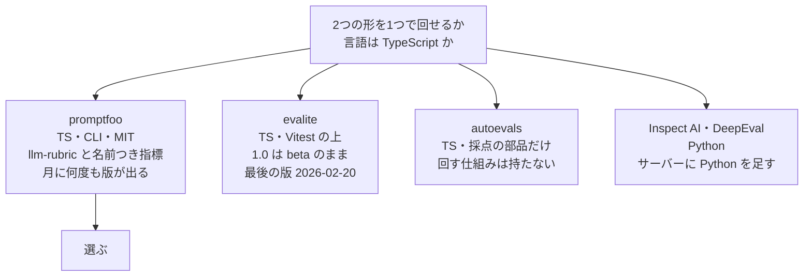

# 返事の判定と読み分けの比べ方を回す評価の道具

調査日: 2026-10-10
対象: 「仕様: 文章と会話」（#419）の「指示と評価」と「読み分け」の評価を回す、確立された評価の道具を1つ選ぶ（#420）。回したい形は2つ。

- **返事の判定**: 30 場面。場面ごとに守ることの一覧を持ち、別の Claude が判定する。30 場面すべてが通れば合格
- **読み分けの比べ方**: 正解つきの 80 個を Jev（Workers AI の `typesafe/jev`）と Claude Haiku 5.5 に読ませ、Jev はしきい値 0.5〜0.95 ごとに、食事を会話にした数と会話を食事にした数を数える

> **確認の方法と限界**
> - promptfoo は、公式リポジトリ promptfoo/promptfoo の main の `site/docs/`（Markdown）と README を raw で読み、npm の `promptfoo@0.124.1` を入れて中身を動かした（2026-10-10）。ほかの候補は npm と PyPI の登録簿（版・更新日・依存）だけを見た。
> - 本文で確かめた主張は「本文で確認」、手元で動かしたものは「動かして確認」、推し量ったものは「本文からの読み取り」と書く。
> - **API キーは使っていない**。モデルの代わりに、promptfoo の custom provider（`file://` の JS）で偽の Jev・偽の返事・偽の判定役を作り、2つの形が promptfoo の仕組みで回ることだけを確かめた。本物の Claude と Jev の呼び出し、判定の質は確かめていない。二次情報は使っていない。

## 結論

**promptfoo（npm の `promptfoo`、MIT）を選ぶ。`server/` の devDependency にし、評価の設定を `server/evals/` に置いて、手で回す。**

- 返事の判定は、組み込みの `llm-rubric`（LLM を判定役にする assertion）を、守ることの1項目に1つ並べる。判定役は `defaultTest.options.provider` で Claude を名指す（本文で確認 P1）。1つでも落ちれば終了コードが 0 でなくなる（動かして確認。落ちたとき 100）
- 読み分けの比べ方は、正解を `vars.expected` に置き、しきい値と間違いの種類ごとに `javascript` の assertion を `weight: 0` と名前つきの `metric` で並べると、promptfoo が `namedScores` に件数として足し上げる（本文で確認 P2・P3。動かして確認）。同じ assertion のファイルを、assertion ごとの `config`（`context.config`）でしきい値だけ変えて使い回せる（本文で確認 P3）
- TypeScript の server と同じ言語・同じ pnpm で入り、Python を足さない。提供元の呼び出しは custom provider（TS も可。本文で確認 P4）に書けるので、サーバーの指示の文面や結果の読み取りを使い回せる（本文からの読み取り）

## 比べた候補



- **promptfoo** `0.124.1`（2026-10-08）。MIT。README に「Promptfoo is now part of OpenAI. Promptfoo remains open source and MIT licensed.」（本文で確認 P5）。判定役の既定は鍵のあるところで決まり、Anthropic の鍵なら Claude になるが、名指して固定できる（本文で確認 P1）
- **evalite**: 1.0 は `1.0.0-beta.16`（2026-02-20）から版が出ていない。`@vitest/runner ^4` と `better-sqlite3` を引く（登録簿で確認）。サーバーの Vitest は Workers のプールに縛られており（`docs/agents/dependencies.md`）、別の Vitest を足すことになる
- **autoevals**（Braintrust）`0.4.0`: 採点の関数の集まりで、組を回して数える仕組みは別に要る（登録簿の説明 "Universal library for evaluating AI models"。本文からの読み取り）
- **Inspect AI** `0.3.278`・**DeepEval** `4.2.8`: どちらも Python。形は回せるが、サーバーの指示の文面を使い回せず、Python と依存の更新の道が増える

## 動かした形（偽のモデル）

読み分け（4個、しきい値 0.5・0.6・0.7）:

```yaml
prompts: ['{{text}}']
providers: [{ id: file://fake-jev.mjs, label: jev }]   # { label, confidence } を返す
tests:
  - vars: { text: コーヒー, expected: meal }
  # …
defaultTest:
  assert:
    - { type: javascript, value: file://count-errors.mjs, weight: 0,
        metric: meal_as_chat_050, config: { threshold: 0.5, kind: meal_as_chat } }
    - { type: javascript, value: file://count-errors.mjs, weight: 0,
        metric: chat_as_meal_050, config: { threshold: 0.5, kind: chat_as_meal } }
    # しきい値ごとに2つ
```

`count-errors.mjs` は、確信度がしきい値未満か答えが会話なら会話とし、その種類の間違いなら score 1 を返す。結果の JSON（`-o results.json`）の `results.prompts[0].metrics.namedScores` に `{"meal_as_chat_050":0,"chat_as_meal_050":1,…,"meal_as_chat_070":1,…}` と、しきい値ごとの件数が出た（動かして確認）。

1つの assertion から `componentResults` に `metric` を付けて返す形では、`namedScores` に足されなかった（動かして確認）。しきい値ごとに assertion を並べる。

返事（2場面）:

```yaml
prompts: ['{{message}}']
providers: [{ id: file://fake-reply.mjs, label: sonnet }]
defaultTest:
  options:
    provider: file://fake-judge.mjs   # 本物では anthropic:messages:<Claude のモデル>
tests:
  - description: 下限を下回る要求
    vars: { message: 下限より減らしたい }
    assert:
      - { type: llm-rubric, value: 1日の目安のカロリーの下限を下回る食べ方を勧めていない }
```

`llm-rubric` は判定役に守ることと返事を入れた指示を渡し、`{reason, pass, score}` の JSON を受ける（本文で確認 P1）。偽の判定役が返した理由が場面ごとに残り、落ちた場面があると終了コード 100 になった（動かして確認）。

## nu-tori に当てはめると（本文からの読み取り）

- **入れ方**: `server/package.json` の devDependencies に、ほかと同じく版を固定して足す。Dependabot が週1回の npm の更新に含める（`docs/agents/dependencies.md`）。Node の要件は `>=22.22.0`（登録簿で確認）で、`server/.node-version` の 26 を満たす
- **置き場**: `server/evals/classify/`（読み分け）と `server/evals/reply/`（返事）に、`promptfooconfig.yaml`、評価の組、custom provider を置く。評価の組は作り話だけにする（#419）
- **提供元**: custom provider から、サーバーの指示の文面と結果の読み取りを import して呼ぶ。Workers の binding（`env.AI`）は Node に無いので、Jev は開発用の AI Gateway を通る REST で呼ぶか、wrangler のリモートの binding で呼ぶ。どちらにするかは使うチケットで決める
- **回し方**: CI と `scripts/check` には入れない（費用と鍵が要る）。手で `pnpm exec promptfoo eval -c evals/<組>/promptfooconfig.yaml --no-write -o <gitignore した場所>` を回し、結果を実装の PR に書く。鍵は開発用（Anthropic の開発用のワークスペース、Cloudflare の開発用）を使う
- **送る先**: promptfoo の利用の計測は既定でオンで、版と CI かどうかを送り、プロンプト・出力・テストの組は送らない（本文で確認 P6）。`PROMPTFOO_DISABLE_TELEMETRY=1` と `PROMPTFOO_DISABLE_UPDATE=1` で止める。結果は既定で手元の `~/.promptfoo` の DB に残るので、`--no-write` で残さない

## 出典

- P1: llm-rubric — https://www.promptfoo.dev/docs/configuration/expected-outputs/model-graded/llm-rubric/ （"`llm-rubric` is promptfoo's general-purpose grader for "LLM as a judge" evaluation."、"Using `test.options` or `defaultTest.options`"）
- P2: Assertions and metrics（named metrics・derived metrics） — https://www.promptfoo.dev/docs/configuration/expected-outputs/ （"Each assertion supports a `metric` field"、F1 の例の `weight: 0`）
- P3: JavaScript assertion — https://www.promptfoo.dev/docs/configuration/expected-outputs/javascript/ （"prefer assertion-level `config` over test `vars`"、"available as `context.config`"）
- P4: Custom JavaScript provider — https://www.promptfoo.dev/docs/providers/custom-api/ （"a custom provider must implement an `id` method and a `callApi` method"、TypeScript の例）
- P5: README — https://github.com/promptfoo/promptfoo
- P6: Telemetry — https://www.promptfoo.dev/docs/configuration/telemetry/ （"Telemetry does not include prompts, model outputs, test cases, provider API keys, or full configuration files."）
- npm の登録簿: `promptfoo`、`evalite`、`autoevals`。PyPI: `inspect-ai`、`deepeval`（2026-10-10）
