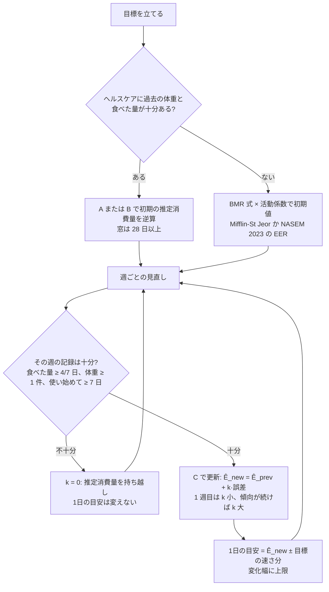

# 推定消費量の既知の計算法

調査日: 2026-09-24
対象: Issue #22「推定消費量の既知の計算法」（wayfinder マップ #19 の子）。`docs/adr/0007-expenditure-from-weight-trend.md` の「体重の傾向と食べた量から推定し、1週間ごとに1日の目安を調整する」を、どの式で実現するかを決めるための下調べ。

> **確認の方法と限界**
> - MacroFactor の公式ヘルプ（help.macrofactorapp.com）と公式ブログ（macrofactor.com）、FoodNoms の公式ヘルプ（foodnoms.com）、論文は PubMed の抄録（E-utilities で取得）と PMC の本文、NIH（NIDDK）と National Academies（NASEM）と FAO の公式ページ、The Hacker's Diet（著者 John Walker のサイト fourmilab.ch）の**本文を直接取得して読んだ**。本文で確かめた主張は「本文で確認」と書く。
> - 論文は、PMC に本文がある物は本文まで、無い物は抄録までを読んだ。抄録までしか読めなかった物は「抄録で確認」と書く。
> - 本文の記述から推し量った物は「本文からの読み取り」と書き、何から読み取ったかを添える。
> - 本文や関連ページを探しても記述が無かった物は「本文を探したが記述なし」と書く。取得自体ができなかった物は「取得できず」と書く。
> - MacroFactor は、消費量の更新の重みや窓の長さなどの中身を「secret sauce」として公開していない（本文で確認、https://macrofactor.com/expenditure-v3/ ）。公開されているのは、入力・考え方・しきい値・性能の数字までである。
> - 取得できなかった物: IOM 2005 の DRI（Energy）本文（National Academies の閲覧ページが本文を返さなかった。後継の NASEM 2023 版で代替）、Harris & Benedict 1918（PMC にあるのは画像のみ）、Kalman 1960（出版社ページが 403）、Thomas ら 2013 の「3500 kcal ルール」批評（PubMed で見つけられず。同じ論点は Hall 2008 で確認）。
> - 二次情報（ブログ、Reddit、まとめ記事）は使っていない。実機での確認はしていない。

## 結論の要約

- **考え方はどの一次情報でも同じで、エネルギー収支を逆に解く。** 推定消費量 = 食べた量 − 体重の傾向の変化をエネルギーに換えた量。MacroFactor（「Calories in − Change in stored energy = Calories out」）、FoodNoms の Calibrated Energy、Hall & Chow 2011 の線形化モデルの3つが、いずれもこの式で説明している（本文で確認）。
- **体重変化 1kg を何 kcal に換えるかが、手法ごとの一番の違い。** 7,700 kcal/kg（3,500 kcal/lb、Wishnofsky 1958 に由来、FoodNoms が採用）、約 9,100 kcal/kg（Hall & Chow 2011 の標準値）、体脂肪量で変わる Forbes 式ベース（Hall 2007・2008、脂肪 39.5 MJ/kg・除脂肪 7.6 MJ/kg）の3系統がある。MacroFactor は脂肪 39.5 MJ/kg・除脂肪 7.6 MJ/kg を公開し、V3 で増量と減量の換算を対称にした（本文で確認）。短期（2週間）の体重のブレは 84% が除脂肪（主に水）で、エネルギー密度は約 2,380 kcal/kg にすぎない（Bhutani 2017、抄録で確認）。つまり**ならす前の体重を換算してはいけない**。
- **体重の傾向のならし方は、指数移動平均（Hacker's Diet: 傾向 += 0.1 × (今日の体重 − 傾向)）、直近を重くした重み付き移動平均と線形補間（MacroFactor）、外れ値除去 + 7日平滑化 + 直線当てはめ（FoodNoms）、日々の体重への線形回帰（Hall & Chow）の4つが一次情報にある。** カルマンフィルタは原論文を取得できず、体重への適用を説明する一次情報も見つからなかった。
- **日々のブレは大きい。** Hall & Chow は日々の体重のばらつきを SD 0.5kg と置き、日々の体重を 28 日以上とらないと食べた量の変化を 95% 信頼区間 300 kcal/日未満で推定できないと示した（抄録・本文で確認）。週末に上がって平日に下がる週の周期もある（Orsama 2014、抄録で確認）。**1週間のデータだけから消費量を決めるのは、原理的に精度が足りない**。
- **初期の見積もりは、BMR 式 × 活動係数。** BMR 式は Mifflin-St Jeor 1990（10W + 6.25H − 5A + 5 / − 161）が系統的レビュー（Frankenfield 2005）で最も当たりやすいとされた（抄録で確認）。MacroFactor はヘルプでは Cunningham 式（BMR = 500 + 22 × LBM、1980）、2024 年のブログでは自社の式（BMR = 129.6 × W^0.55 + 0.011 × H² − [1.96; 4.9] × Age − 213.8 × Sex）を使うと書いている（本文で確認）。
- **活動係数の出どころは、FAO/WHO/UNU 2004 の PAL（1.40–1.69 / 1.70–1.99 / 2.00–2.40）と NASEM 2023 の PAL 区分（19 歳以上: <1.53 / 1.53–1.68 / 1.68–1.85 / 1.85–2.5）。** よく見る 1.2 / 1.375 / 1.55 / 1.725 / 1.9 の組は、MacroFactor のヘルプも「最も一般的な組」と呼ぶだけで、一次情報の出どころを見つけられなかった。**歩数から PAL への直接の換算式も一次情報には無い。** あるのは歩数の区分（<5,000 sedentary / 5,000–7,499 low active / 7,500–9,999 somewhat active / ≥10,000 active / ≥12,500 highly active、Tudor-Locke & Bassett 2004）だけで、PAL 区分との対応は nu-tori 側の仮定になる。
- **記録が少ない週の扱い**: MacroFactor は栄養の記録が 7 日中 4 日未満（V3）、または体重の記録が 7 日中 0 日のとき、消費量の更新を止める（"holding"）。止めている間は「最後の高信頼の値」を持ち越し、週の調整は消費量の変化に 1:1 では追随させない（500 kcal 相当の変化を 200–300 kcal に抑える例）。FoodNoms は初回に「28 日中 14 日の食事記録と 1 週間にわたる体重」を要求し、1 回の調整は最大 400 kcal、現在値から 10% 超離れているか記録が少ないときは半分だけ動かす（すべて本文で確認）。
- **#30 の試作と #31 の決定に向けて**: 収支の逆算（A）を土台にし、更新は「1 週間の逆算値をそのまま採用」ではなく「前の推定消費量に、記録の量で決めた重み k で近づける」（C）とするのが、公開されている一次情報に一番近い。数式は最後の節にまとめた。

## 問い1: MacroFactor が公式に公開している、消費量の推定と1日の目安の調整

### 消費量の推定

| 項目 | 所見 | 確度 | 出典 |
|---|---|---|---|
| 基本式 | 「Calories in − Change in stored energy = Calories out」。例: 体重の傾向の変化から 1 日 200 kcal の余剰と見積もり、食べた量が約 3,000 kcal/日なら消費量は約 2,800 kcal/日 | 本文で確認 | https://help.macrofactorapp.com/en/articles/20-expenditure |
| 入力 | 食べた量（MacroFactor の記録か、同期した他の出どころ）と体重の傾向。ウェアラブルの消費エネルギーは使わない | 本文で確認 | 同上、https://help.macrofactorapp.com/en/articles/33-does-macrofactor-use-energy-expenditure-data-from-my-wearable-activity-tracker |
| 体重変化のエネルギー換算 | 脂肪 39.5 MJ/kg（約 4,282 kcal/lb）、除脂肪 7.6 MJ/kg（約 824 kcal/lb）。「3,500 kcal ルール」は脂肪 78%・除脂肪 22% を暗に仮定していると説明 | 本文で確認 | https://macrofactor.com/expenditure-v3/ |
| 換算の対称性 | V2 までは「減量で失うエネルギー > 増量で得るエネルギー」と非対称に扱っていて、体重のブレのたびに消費量が少しずつ上振れした（SD ±1 lb のブレで約 80 kcal/日）。V3 で増減を同じ換算にし、ほとんどの人で 0–130 kcal/日下がった | 本文で確認 | 同上 |
| 更新の仕方 | 「予測エンジン」。今の推定消費量と食べた量から体重の変化を予測し、体重の傾向の実際の変化との予測誤差で推定を更新する | 本文で確認 | https://macrofactor.com/expenditure/ 、https://macrofactor.com/algorithm-accuracy/ |
| 安定性と応答性 | 窓を長くすると安定するが遅く、短くすると速いが荒れる。V3 は V2 と同じ安定性で 19% 応答が速く、同じ応答性で 20% 安定。実データで真の傾向転換を V2 より 1–5 日早く拾い、日々の更新幅は約 35% 小さい | 本文で確認 | https://macrofactor.com/expenditure-v3/ 、https://macrofactor.com/expenditure/ |
| 中身の重みや窓 | 公開していない（「secret sauce」）。「約 3 週間のデータを見る」「3 週間より前の記録は今の消費量にほぼ影響しない」とだけ書く | 本文で確認（数式は本文を探したが記述なし） | https://macrofactor.com/expenditure-v3/ 、https://help.macrofactorapp.com/en/articles/109-how-frequently-do-i-need-to-log-my-weight-for-the-expenditure-algorithm-and-weekly-coaching-updates 、https://help.macrofactorapp.com/en/articles/207-will-logging-food-to-a-previous-day-affect-my-expenditure-and-coaching-recommendations |
| 2 段階の応答 | 1 週目は「hedge our bets」で控えめに動かし、2 週目（さらに 3 週目）も傾向が続けば大きく動かす | 本文で確認 | https://help.macrofactorapp.com/en/articles/26-how-should-i-interpret-changes-to-my-energy-expenditure |
| 記録が無い日の食べた量 | V3 は記録が無い日の食べた量を裏で推定する。推定誤差は平均約 13%、90% 超が 30% 未満 | 本文で確認 | https://macrofactor.com/expenditure-v3/ |
| 立ち上がり | 使い始めから 2–3 週間で妥当な推定になり、その後は 1–2 週間で変化を拾う。初期値は数日「そのまま」、1 週間で動き始め、14–30 日で日々の変化が落ち着く | 本文で確認 | https://help.macrofactorapp.com/en/articles/26-how-should-i-interpret-changes-to-my-energy-expenditure 、https://macrofactor.com/macrofactors-algorithms-and-core-philosophy/ |
| 精度 | 新規 748 人の 100 日間で、3–4 週目以降の月間の体重予測誤差の中央値 1.15 lb（式だけの場合 2.6–3.1 lb）。消費量の誤差は中央値約 135 kcal（式だけでは約 335 kcal） | 本文で確認 | https://macrofactor.com/algorithm-accuracy/ |
| 苦手なこと | 部分的な記録（一部の食事だけ記録）が唯一「大きく外す」原因。水分・クレアチン・食物繊維・糖質量の変化による「エネルギー貯蔵を反映しない体重変化」は 1–2 週間ずれる | 本文で確認 | https://help.macrofactorapp.com/en/articles/29-how-do-macrofactor-s-coaching-algorithms-deal-with-partially-logged-days 、https://macrofactor.com/macrofactors-algorithms-and-core-philosophy/ |
| 歩数の使い方 | 2025 年 11 月の「Step-Informed Updates」（任意）で初めて活動データを使う。日ごとに足し引きはせず、体重・栄養と同じように傾向として推定消費量を少し速く動かすだけ。応答性 +2〜3%・安定性 −3% 程度の小さな効果 | 本文で確認 | https://macrofactor.com/expenditure/ 、https://help.macrofactorapp.com/en/articles/274-expenditure-modifiers |

### 体重の傾向

| 項目 | 所見 | 確度 | 出典 |
|---|---|---|---|
| 定義 | 「直近の体重記録により大きな重みを置いた移動平均」。方向と速さを示す。消費量と週の目安はこの傾向で計算し、生の体重では計算しない | 本文で確認 | https://help.macrofactorapp.com/en/articles/21-weight-trend |
| 欠けた日 | 線形補間で埋める（月 151 lb・水 150 lb なら火は 150.5 lb） | 本文で確認 | 同上 |
| 時間尺度 | 「かなり長い時間尺度の体重の影響を考慮しつつ、より最近の値に重みを置く平均」 | 本文で確認 | https://macrofactor.com/macrofactors-algorithms-and-core-philosophy/ |
| 記録の頻度 | 毎日か少なくとも週 3 回を推奨。最低は週 1 回。1 週間分の中 6 日を消しても週の目安は 15 kcal/日も変わらない例 | 本文で確認 | https://help.macrofactorapp.com/en/articles/21-weight-trend 、https://help.macrofactorapp.com/en/articles/109-how-frequently-do-i-need-to-log-my-weight-for-the-expenditure-algorithm-and-weekly-coaching-updates |
| 数日のブレ | 数 lb/kg 高い・低い日が 1–5 日あっても推定消費量は「少ししか」動かない。翌週の目安が理想から 20–30 kcal ずれる程度 | 本文で確認 | https://help.macrofactorapp.com/en/articles/26-how-should-i-interpret-changes-to-my-energy-expenditure |
| 外れ値の扱い、重みの式 | 本文を探したが記述なし | 記述なし | — |

### 1日の目安の調整（週ごとのチェックイン）

| 項目 | 所見 | 確度 | 出典 |
|---|---|---|---|
| 周期 | 週 1 回。曜日はユーザーが選ぶ | 本文で確認 | https://help.macrofactorapp.com/en/articles/247-introduction-to-check-ins-and-coaching-modules |
| 目安の決め方 | 目安 = 推定消費量 ± 目標の速さに応じた不足・余剰。目標の速さは「体重の何%/週」で持つので、減量が進むと絶対量は減る。「毎週が独立した単位」で、前週の超過分を翌週に持ち越さない | 本文で確認 | https://help.macrofactorapp.com/en/articles/222-how-does-macrofactor-make-adjustments-for-a-weight-gain-or-weight-loss-goal 、https://macrofactor.com/macrofactors-algorithms-and-core-philosophy/ |
| 変化を抑える層 | 目安の変化は推定消費量の変化に 1:1 で追随しない。例: 2,000 kcal で 1 lb/週減っていた人（消費量 ≈ 2,500）が 3 週間停滞しても、500 kcal ではなく 200–300 kcal だけ下げる | 本文で確認 | https://help.macrofactorapp.com/en/articles/222-how-does-macrofactor-make-adjustments-for-a-weight-gain-or-weight-loss-goal |
| 維持のとき | 体重の傾向が目標体重の ±1.5 lb（約 0.7 kg）以内なら目安 = 推定消費量。外れたら 0.15%/週の速さで戻す小さな不足・余剰（75 kg・2,500 kcal の例で 2,375 kcal） | 本文で確認 | https://help.macrofactorapp.com/en/articles/125-how-does-dynamic-maintenance-work-in-macrofactor |
| 目標変更の直後 | 「Predictive Goal Adjustment」（任意）を有効にすると、目標を変えた直後の 2 週間は推定消費量をその向きに速く動かす | 本文で確認 | https://help.macrofactorapp.com/en/articles/274-expenditure-modifiers |

## 問い2: エネルギー収支から消費量を逆算する手法の論文

### 収支を逆に解く式

| 項目 | 所見 | 確度 | 出典 |
|---|---|---|---|
| 線形化した収支式 | Hall & Chow 2011: どの代謝モデルからも 2 パラメータの収支式が導ける。ΔEI = ρ·(ΔBW/Δt) + ε·ΔBW。ρ は体重変化の実効エネルギー密度 ≈ 9,100 kcal/kg、ε は消費量の体重依存 ≈ 22 kcal/kg/日。体重は直線回帰 BW = a·t + b で当てはめ、a を変化率とする（60 日未満で近似が成り立つ） | 本文で確認 | https://pmc.ncbi.nlm.nih.gov/articles/PMC3127505/ （Am J Clin Nutr 2011;94:66-74, PMID 21562087） |
| 必要な体重の数 | 日々の体重のばらつきを SD ≈ 0.5 kg と置くと、**28 日以上の毎日の体重**が無いと ΔEI の 95% 信頼区間を 300 kcal/日未満にできない（本文では 28 日で約 ±350 kcal/日）。初期の体組成や活動量にはあまり左右されない | 抄録・本文で確認 | 同上 |
| 実データでの検証 | Sanghvi ら 2015: CALERIE の 140 人・2 年間で、初期の身体データと繰り返しの体重だけを入力とするモデルの ΔEI が、二重標識水 + DXA の値と平均 40 kcal/日以内。個人ごとの RMSD は 215 kcal/日、大半は 132 kcal/日以内。体重は 1・3・6・9・12・18・24 か月に測り、変化率は体重系列の移動平均から出した | 抄録・本文で確認 | https://pmc.ncbi.nlm.nih.gov/articles/PMC4515869/ （Am J Clin Nutr 2015;102:353-8, PMID 26040640） |
| FoodNoms の引用 | FoodNoms の Calibrated Energy は「繰り返しの体重に対する計算で長期のエネルギー収支をほぼ実験室法と同じ精度で追える」根拠として Sanghvi 2015 を挙げている | 本文で確認 | https://foodnoms.com/help/calibrated-energy |

### 体重の変化を何 kcal に換えるか（ρ）

| 項目 | 所見 | 確度 | 出典 |
|---|---|---|---|
| 3,500 kcal/lb ルール | Wishnofsky 1958（Am J Clin Nutr 6:542-6）に由来。抄録は PubMed に無い | 書誌のみ確認（本文は取得できず） | https://pubmed.ncbi.nlm.nih.gov/13594881/ |
| ルールの限界 | Hall 2008: 3,500 kcal/lb（32.2 MJ/kg）は初期体脂肪 30 kg 超の肥満者にはほぼ合うが、それより体脂肪が少ない人では必要な不足量を過大評価する。脂肪 39.5 MJ/kg、除脂肪 7.6 MJ/kg。減量のエネルギー密度 = ρF + (ρL − ρF)·ΔL/ΔBW。例: 初期体脂肪 20 kg で 15 kg 減らすと約 24.7 MJ/kg | 抄録・本文で確認 | https://pmc.ncbi.nlm.nih.gov/articles/PMC2376744/ （Int J Obes 2008;32:573-6, PMID 17848938） |
| Forbes の式 | FFM = 10.4·ln(FM) + 14.2（kg）。微小変化では dFFM/dBW = 10.4 / (10.4 + FM)。Hall 2007 は大きな変化にも使えるように拡張し、P-ratio（α = 9.05 = 脂肪と除脂肪のエネルギー密度比）で表し直した | 抄録・本文で確認 | https://pmc.ncbi.nlm.nih.gov/articles/PMC2376748/ （Br J Nutr 2007;97:1059-63, PMID 17367567）。原著: Forbes 1987 Nutr Rev 45:225-31（PMID 3306482、抄録なし）、Forbes 2000 Ann N Y Acad Sci 904:359-65（PMID 10865771、抄録で確認: 痩せた人の増量は 60–70% が除脂肪、肥満者は 30–40%） |
| 短期のブレの中身 | Bhutani 2017: 自由生活 2 週間の体重変化（0.26 ± 1.2 kg）は 84% が除脂肪（主に水）。1–3 kg の短期変化のエネルギー密度は平均 2,380 kcal/kg | 抄録で確認 | https://pubmed.ncbi.nlm.nih.gov/28676555/ （Physiol Rep 2017;5:e13336） |

### 動的モデル（NIH Body Weight Planner、Thomas ら）

| 項目 | 所見 | 確度 | 出典 |
|---|---|---|---|
| NIH Body Weight Planner の根拠 | NIDDK の公式ページが Hall ら 2011 Lancet を「このモデルを使うときに引用する論文」と明記し、式の全文を PDF「Dynamic Mathematical Model of Body Weight Change in Adults」で公開している | 本文で確認 | https://www.niddk.nih.gov/research-funding/at-niddk/labs-branches/laboratory-biological-modeling/integrative-physiology-section/research/body-weight-planner |
| Planner の入力 | 体重・性別・年齢・身長・活動量（PAL 1.4〜2.5、既定 1.6 = 座り仕事で週 1 回以上の中程度の運動） | 本文で確認 | https://www.niddk.nih.gov/bwp |
| Hall 2011 Lancet | 体重の応答は遅く、半減期約 1 年。「食べた量が 100 kJ/日変わると最終的に体重が約 1 kg 変わる」（半分は約 1 年、95% は約 3 年で到達）。脂肪 39.5 MJ/kg・除脂肪 7.6 MJ/kg、Forbes 関係で配分、消費量の体重依存は断面で約 94–100 kJ/kg/日 | 抄録・本文で確認 | https://pmc.ncbi.nlm.nih.gov/articles/PMC3880593/ （Lancet 2011;378:826-37, PMID 21872751） |
| 2 コンパートメントの元論文 | Chow & Hall 2008: ρF·dF/dt = I_F − f·E、ρL·dL/dt = I_L − (1−f)·E。新しい定常状態までの時定数は「数年」 | 抄録・本文で確認 | https://pmc.ncbi.nlm.nih.gov/articles/PMC2266991/ （PLoS Comput Biol 2008;4:e1000045） |
| 詳細モデル | Hall 2010: 栄養素ごとの流量モデル。RMR は脳 240、除脂肪 19、脂肪 4.5 kcal/kg/日など組織別係数。体重の時系列から食べた量を逆推定する用途を示した | 抄録・本文で確認 | https://pmc.ncbi.nlm.nih.gov/articles/PMC2838532/ （Am J Physiol Endocrinol Metab 2010;298:E449-66） |
| Thomas ら 2011 | 1 次元の微分方程式 c_f·dF/dt + c_l·dFFM/dt = I − E（c_f = 9,500、c_l = 1,100 kcal/kg）。FFM は NHANES 由来の多項式で F・年齢・身長・性別から決める。E = RMR（Livingston-Kohlstadt 式）+ DIT + PA + SPA。最終体重の平均絶対誤差 1.8 ± 1.3 kg（減量）、2.5 ± 1.6 kg（過食） | 抄録・本文で確認 | https://pmc.ncbi.nlm.nih.gov/articles/PMC3975626/ （J Biol Dyn 2011;5:579-99, PMID 24707319） |

## 問い3: 体重の傾向のならし方と、日々のブレの扱い

| 項目 | 所見 | 確度 | 出典 |
|---|---|---|---|
| 指数移動平均（Hacker's Diet） | 手計算の手順: 今日の体重 − 昨日の傾向を出し、小数点を 1 桁ずらして（× 0.1）丸め、昨日の傾向に足す。初日は体重そのものを傾向にする。平滑化定数 0.9（新しい値の重み 10%）は「遅れの点で 20 日の単純移動平均とほぼ同等」。著者の例では真の体重が 1 lb も動かない月に、日々の体重は最大 6 lb の幅 | 本文で確認 | https://www.fourmilab.ch/hackdiet/e4/pencilpaper.html 、https://www.fourmilab.ch/hackdiet/e4/signalnoise.html |
| 重み付き移動平均 + 線形補間（MacroFactor） | 問い1の「体重の傾向」の節のとおり。重みの式は非公開 | 本文で確認 | https://help.macrofactorapp.com/en/articles/21-weight-trend |
| 外れ値除去 + 7 日平滑化 + 直線当てはめ（FoodNoms） | 周囲と合わない値（打ち間違いなど）を傾向から除く。残りを 7 日の幅でならし、直線を当てはめて変化率を出す。28 日の推定を 35 日・42 日でも計算し、3 つが一致すれば採用、食い違えば窓の直前の体重と比べて「本当に動いた」か「往復した」かを判別し、往復なら長い方を使う。最新の体重だけは後続が無く外れ値判定できない | 本文で確認 | https://foodnoms.com/help/calibrated-energy |
| 直線回帰（Hall & Chow） | 日々の体重に BW = a·t + b を当てはめ、a の分散から ΔEI の信頼区間を出す。精度は測定数 n と期間 T で決まる | 本文で確認 | https://pmc.ncbi.nlm.nih.gov/articles/PMC3127505/ |
| カルマンフィルタ | Kalman 1960（J Basic Eng 82:35-45, DOI 10.1115/1.3662552）の出版社ページは 403 で取得できず。体重の傾向にカルマンフィルタを使う一次情報（アプリの公式説明や論文）も今回は見つけられなかった。指数移動平均は定常ゲインのカルマンフィルタの特別な場合にあたるが、それを述べた一次情報は今回読んでいない | 取得できず | — |
| 日々のブレの大きさ | Hall & Chow は SD 0.5 kg を仮定。Bhutani 2017 は 2 週間の変化が SD 1.2 kg で 84% が除脂肪 | 抄録・本文で確認 | 上記 |
| 週の周期 | Orsama 2014: 80 人・4,657 回の計測で、日曜・月曜に高く平日に下がる週の周期がある（土曜から上がり、火曜から下がる）。「週末と平日の差は体重増加の兆しではなく正常と見なすべき」 | 抄録で確認 | https://pubmed.ncbi.nlm.nih.gov/24504358/ （Obes Facts 2014;7:36-47） |
| 生理的な体重変化 | MacroFactor: 月経・塩分・糖質の多い食事による数日のブレは問題にならないが、低糖質への切り替え・クレアチン・食物繊維の増加のように「継続する」体重変化は 1–2 週間、推定を狂わせる | 本文で確認 | https://help.macrofactorapp.com/en/articles/26-how-should-i-interpret-changes-to-my-energy-expenditure 、https://macrofactor.com/macrofactors-algorithms-and-core-philosophy/ |

## 問い4: 身体データからの初期の見積もりと、活動係数の出どころ

### BMR / REE の式

| 項目 | 所見 | 確度 | 出典 |
|---|---|---|---|
| Mifflin-St Jeor 1990 | 498 人（女 247・男 251、19–78 歳、標準体重 264・肥満 234）の間接熱量測定から。REE（男）= 10 × 体重(kg) + 6.25 × 身長(cm) − 5 × 年齢 + 5、REE（女）= 同 − 161（R² = 0.71）。Harris-Benedict は実測より 5% 高かった。FFM が最良の単一予測子: REE = 19.7 × FFM + 413 | 抄録で確認 | https://pubmed.ncbi.nlm.nih.gov/2305711/ （Am J Clin Nutr 1990;51:241-7） |
| どの式が当たるか | Frankenfield 2005（系統的レビュー）: Harris-Benedict、Mifflin-St Jeor、Owen、WHO/FAO/UNU の中で Mifflin-St Jeor が「実測の ±10% 以内に入る人が最も多く、誤差の幅も最も狭い」。ただし個人への適用では無視できない誤差がある | 抄録で確認 | https://pubmed.ncbi.nlm.nih.gov/15883556/ （J Am Diet Assoc 2005;105:775-89） |
| Harris & Benedict 1918 | PNAS 4:370-3。PMC にあるのはページ画像のみで、式の本文は読めなかった | 取得できず（書誌のみ） | https://pmc.ncbi.nlm.nih.gov/articles/PMC1091498/ |
| Cunningham 1980 | Harris-Benedict の 223 人を再解析。LBM が単一の予測子で、BMR(cal/day) = 500 + 22 × LBM。性別と年齢の寄与は小さい | 抄録で確認 | https://pubmed.ncbi.nlm.nih.gov/7435418/ （Am J Clin Nutr 1980;33:2372-4） |
| Cunningham 1991 | 総説からの一般式 REE = 370 + 21.6 × FFM（REE の 65–90% を説明）。FFM は TDEE も同程度に予測する | 抄録で確認 | https://pubmed.ncbi.nlm.nih.gov/1957828/ （Am J Clin Nutr 1991;54:963-9） |
| Schofield 1985（FAO/WHO/UNU が採用） | 体重（と身長）・性別・年齢区分から BMR を予測する式群。FAO/WHO/UNU 2004 も 1985 年の Schofield 式を維持（例: 男 18–30 歳 BMR(MJ/日) = 0.063 × 体重 + 2.896、女 = 0.062 × 体重 + 2.036） | 抄録で確認（式は FAO の本文で確認） | https://pubmed.ncbi.nlm.nih.gov/4044297/ 、https://www.fao.org/4/y5686e/y5686e07.htm |
| Livingston-Kohlstadt 2005 | 体重のべき乗則: RMR（女）= 248 × W^0.4356 − 5.09 × 年齢、RMR（男）= 293 × W^0.4330 − 5.92 × 年齢。Thomas 2011 のモデルが採用 | 抄録で確認 | https://pubmed.ncbi.nlm.nih.gov/16076996/ （Obes Res 2005;13:1255-62） |
| MacroFactor の初期値 | ヘルプ: 「Cunningham 式による BMR」×「生活と運動を分けて数える独自の活動係数」。BMR 式の典型誤差 100–200 kcal/日、個人では 400–500 kcal 以上ずれうる。2024-10 のブログ: 自社の式に切り替え。BMR = 129.6 × W^0.55 + 0.011 × H² − [1.96; 4.9] × Age − 213.8 × Sex（W kg、H cm、男 0・女 1、60 歳まで年 1.96、以降年 4.9 kcal 減）。FM・FFM 版もある。Oxford/Henry 式と Cunningham 1991 式を土台にしたと明記 | 本文で確認（ヘルプとブログで式名が食い違う。ブログの方が新しい） | https://help.macrofactorapp.com/en/articles/26-how-should-i-interpret-changes-to-my-energy-expenditure 、https://macrofactor.com/macrofactors-bmr/ 、https://macrofactor.com/macrofactors-algorithms-and-core-philosophy/ |
| MacroFactor の目標による補正 | 初期値に「意図する体重変化率（%/週）の 4 倍」を掛けて補正（1%/週の減量なら初期値を 4% 下げる）。新規ユーザーの 1 か月目の予測誤差と目標速度の相関（r = 0.27）から導いた。自社 BMR 式が減量中の BMR を 5–8% 低く見ることと合わせ、初期値は計 10% 前後低くなる | 本文で確認 | https://macrofactor.com/expenditure/ |
| 活動係数の中身 | MacroFactor の独自係数の値は本文を探したが記述なし。ヘルプは「最も一般的な組」として sedentary 1.2 / lightly 1.375 / moderately 1.55 / very 1.725 を示すが、自社がそれを使うとは書いていない。活動係数を間違えると 10–15% ずれる、と説明 | 本文で確認（値は記述なし） | https://help.macrofactorapp.com/en/articles/126-why-is-my-expenditure-in-macrofactor-different-from-the-output-of-a-tdee-calculator |

### 活動係数（PAL）の出どころ

| 項目 | 所見 | 確度 | 出典 |
|---|---|---|---|
| FAO/WHO/UNU 2004 | TEE = BMR × PAL。座位・軽い活動 1.40–1.69、活動的・中程度 1.70–1.99、激しい活動 2.00–2.40（2.40 超は長期に維持しにくい）。例: PAL 1.75 × BMR 7.10 MJ = 12.42 MJ/日 | 本文で確認 | https://www.fao.org/4/y5686e/y5686e07.htm |
| NASEM 2023（DRI for Energy） | 二重標識水のデータベース（成人 19 歳以上 5,456 人）から、PAL の 25・50・75 パーセンタイルで 4 区分: **inactive 1.00–1.53、low active 1.53–1.68、active 1.68–1.85、very active 1.85–2.50**。区分ごとに EER 式。男 19 歳以上: inactive 753.07 − 10.83 × age + 6.50 × height + 14.10 × weight、low active 581.47 − 10.83 × age + 8.30 × height + 14.94 × weight、active 1,004.82 − 10.83 × age + 6.52 × height + 15.91 × weight、very active −517.88 − 10.83 × age + 15.61 × height + 19.11 × weight。女: inactive 584.90 − 7.01 × age + 5.72 × height + 11.71 × weight、low active 575.77 − 7.01 × age + 6.60 × height + 12.14 × weight、active 710.25 − 7.01 × age + 6.54 × height + 12.34 × weight、very active 511.83 − 7.01 × age + 9.07 × height + 12.56 × weight（kcal/日、height cm、weight kg）。区分の説明: inactive は「自立した生活に最低限の身体活動」、low active は「それより多い歩行と多少の職業・余暇活動」、active は「さらに多い歩行と職業・余暇活動」、very active は「職業や余暇での激しい運動」 | 本文で確認 | https://www.nationalacademies.org/read/26818/chapter/7 （Table 5-4、Table 5-16） |
| IOM 2005（旧 DRI） | よく引用される PA 係数（1.0 / 1.11 / 1.25 / 1.48 など）の元。閲覧ページが本文を返さず、今回は確認できなかった。NASEM 2023 が後継 | 取得できず | https://www.nationalacademies.org/read/10490/chapter/7 |
| 1.2 / 1.375 / 1.55 / 1.725 / 1.9 の組 | 一次情報の出どころを見つけられなかった。MacroFactor のヘルプが「最も一般的な組」と呼ぶだけ | 本文を探したが記述なし | — |
| NIH Body Weight Planner | PAL 1.4（座位）〜2.5（非常に活動的）、既定 1.6 | 本文で確認 | https://www.niddk.nih.gov/bwp |

### 歩数からの見積もり

| 項目 | 所見 | 確度 | 出典 |
|---|---|---|---|
| 歩数の区分 | Tudor-Locke & Bassett 2004: <5,000 歩/日「sedentary lifestyle index」、5,000–7,499「low active」（運動を除く日常の活動）、7,500–9,999「somewhat active」、≥10,000「active」、>12,500「highly active」。2008・2011 の総説でも同じ区分を再掲 | 抄録で確認 | https://pubmed.ncbi.nlm.nih.gov/14715035/ （Sports Med 2004;34:1-8）、https://pubmed.ncbi.nlm.nih.gov/18562971/ （Med Sci Sports Exerc 2008）、https://pmc.ncbi.nlm.nih.gov/articles/PMC3197470/ （IJBNPA 2011;8:79） |
| 歩数と運動量 | 100 歩/分が中強度の下限。30 分の中強度 ≈ 3,000 歩。日常の活動を含めた「推奨量を満たす」歩数は 7,000–8,000（直接推定）〜7,100–11,000（計算） | 本文で確認 | https://pmc.ncbi.nlm.nih.gov/articles/PMC3197470/ |
| 歩数 → PAL の換算式 | 一次情報で見つけられなかった。歩数の区分名（sedentary / low active / active）と NASEM の PAL 区分名（inactive / low active / active）は似ているが、対応づけた一次情報は無い。対応づけは nu-tori 側の仮定になる | 本文を探したが記述なし | — |
| MacroFactor の歩数の使い方 | 初期値には使わない（初期値は BMR × 活動係数）。使うのは任意の Step-Informed Updates で、歩数の傾向で推定消費量の動きを少し速める | 本文で確認 | https://macrofactor.com/expenditure/ |

## 問い5: 週ごとの調整で、記録が少ない週をどう扱うか

| 項目 | 所見 | 確度 | 出典 |
|---|---|---|---|
| MacroFactor: 栄養の記録が少ない | 更新を続けるには「7 日中 4 日以上」（理想は毎日）。V3 は「7 日中 3 日を超えて欠けたら更新を止める」。それ以下なら記録の無い日の食べた量を推定して更新を続ける。ヘルプ記事 26 には古い「7 日中 6 日」の記述が残っている | 本文で確認（記事間で数字が食い違う。V3 の記事と記事 110 が新しい） | https://help.macrofactorapp.com/en/articles/110-how-frequently-do-i-need-to-log-my-nutrition-for-the-expenditure-algorithm-and-weekly-coaching-updates 、https://macrofactor.com/expenditure-v3/ 、https://help.macrofactorapp.com/en/articles/26-how-should-i-interpret-changes-to-my-energy-expenditure |
| MacroFactor: 体重の記録が少ない | 最低は週 1 回。体重が 1 件も無いと更新は "holding" に変わり、1 件入れば即再開する（欠けた日は線形補間） | 本文で確認 | https://help.macrofactorapp.com/en/articles/109-how-frequently-do-i-need-to-log-my-weight-for-the-expenditure-algorithm-and-weekly-coaching-updates |
| MacroFactor: 止めている間 | 「最後の高信頼の推定消費量を持ち越し」、記録が戻れば再開。週のチェックインでは Logging Break モジュールが止まった理由と再開の条件を説明する | 本文で確認 | https://macrofactor.com/macrofactors-algorithms-and-core-philosophy/ 、https://help.macrofactorapp.com/en/articles/251-coaching-module-logging-break |
| MacroFactor: 部分的な記録の日 | チェックインの Partial Logging モジュールが「部分記録らしい日」を見つけ、除外するか尋ねる。1 日の誤差 25 kcal 程度は問題にならない | 本文で確認 | https://help.macrofactorapp.com/en/articles/29-how-do-macrofactor-s-coaching-algorithms-deal-with-partially-logged-days 、https://help.macrofactorapp.com/en/articles/247-introduction-to-check-ins-and-coaching-modules |
| MacroFactor: 当日の体重が無い | Weigh-In モジュールが最後の体重記録を示し、チェックイン前に体重を入れるか尋ねる（断ってもよい） | 本文で確認 | https://help.macrofactorapp.com/en/articles/109-how-frequently-do-i-need-to-log-my-weight-for-the-expenditure-algorithm-and-weekly-coaching-updates |
| MacroFactor: 長く離れた後 | 計算開始日（expenditure start date）を変えて「新規ユーザーと同じ」状態からやり直せる。妥当な推定があるなら手入力の初期値を推奨 | 本文で確認 | https://help.macrofactorapp.com/en/articles/61-change-your-expenditure-start-date |
| FoodNoms: 初回の条件 | 直近 28 日のうち 14 日以上の食事記録と、1 週間以上にわたる体重記録（最近の 1 件を含む）。以後は 7 日ごと | 本文で確認 | https://foodnoms.com/help/calibrated-energy |
| FoodNoms: 少ない・遠いとき | 現在値から約 10% 超離れているか、データが少ないときは「約半分」だけ動かす。1 回の調整は最大 400 kcal。±75 kcal 以内は「ノイズ」として現在値を維持。800 未満・6,000 超は提示しない。長い体重の空白などで曖昧なら、その旨を示して先にデータの改善を勧める | 本文で確認 | 同上 |
| FoodNoms: 部分的な記録の日 | 「典型的な日よりかなり少ない」日は自動で平均から外し、除いた日数を示す | 本文で確認 | 同上 |
| 統計的な根拠 | Hall & Chow 2011: 推定の分散は体重の傾き a の分散に比例し、a の分散は測定数と期間で決まる。1 週間・SD 0.5 kg の体重からでは信頼区間が数百 kcal/日を大きく超える（28 日で ±350 kcal/日） | 本文で確認 | https://pmc.ncbi.nlm.nih.gov/articles/PMC3127505/ |

## 次の判断に効くこと（#30 の試作、#31 の計算法の決定に向けて）

### 候補の手法を数式で比べる

記号: EI_d = 日 d の食べた量（kcal）、W_d = 日 d の体重記録、T_d = 日 d の体重の傾向（kg）、Ê = 推定消費量（kcal/日）、ρ = 体重 1 kg あたりのエネルギー（kcal/kg）、n = 窓の日数。

**A. 単純な収支の逆算（FoodNoms 型、Wishnofsky の ρ）**

```
Ê = mean(EI_d | 完全に記録した日 d ∈ 直近 n 日) − ρ · slope(T, 直近 n 日)   [kg/日]
ρ = 7,700 kcal/kg、n = 28（35・42 でも計算して突き合わせ）
```

- 長所: 説明しやすい（FoodNoms は「検査できる計算」と売りにしている）。1 つの窓で完結する。
- 短所: n = 28 だと、変化に気づくまで最長 4 週間遅れる。Hall & Chow の信頼区間の議論から、n = 7 では使えない。ρ を固定にすると体脂肪の少ない人で過大評価（Hall 2008）。

**B. 線形化した収支式（Hall & Chow 型）**

```
Ê(t)    = mean(EI) − ρ · a              [今の推定消費量]
Ê(t+Δ) ≈ Ê(t) + ε · (T_{t+Δ} − T_t)     [体重が変わったあとの消費量の見込み]
a = 直線回帰 T_d ≈ a·d + b の傾き、ρ ≈ 9,100 kcal/kg、ε ≈ 22 kcal/kg/日
var(Ê) ≈ ρ² · var(a)  → 記録が少ない週ほど var(a) が大きい
```

- 長所: 推定の不確かさ var(Ê) が式から出るので、「記録が少ない週は調整を見送る」を確率的に決められる。ε の項で「痩せると消費量も下がる」を自然に含む。
- 短所: 検証（Sanghvi 2015）は月単位の体重で 2 年間の話。週単位の応答は検証されていない。

**C. 逐次更新（MacroFactor 型、予測誤差で近づける）**

```
予測: ΔT_pred = (mean(EI) − Ê_prev) · 7 / ρ           [今週の体重の傾向の変化の予測]
観測: ΔT_obs  = T_今週末 − T_先週末
更新: Ê_new = Ê_prev + k · ρ · (ΔT_pred − ΔT_obs) / 7
k は記録の量と連続週数で決める重み（0 ≤ k ≤ 1）。1 週目は小さく、傾向が 2 週続けば大きく
```

- 長所: 毎週その週の逆算値を「そのまま採用」しないので、1 週間分のノイズ（SD 0.5 kg → ρ = 7,700 なら ±3,850 kcal ≒ ±550 kcal/日）を吸収できる。k = 0 が「見送り（holding）」に対応し、記録が少ない週の扱いが 1 つのパラメータに集約される。MacroFactor の「2 段階の応答」「1:1 で追随しない」「最後の高信頼の値を持ち越す」がすべてこの形で書ける。
- 短所: k の決め方と ρ は公開されておらず、nu-tori で決めて試す必要がある（#30 の試作の論点）。

**D. 動的モデル（Hall 2011 / Thomas 2011）**

```
ρF · dF/dt + ρL · dL/dt = EI − E(F, L, 活動)、L は Forbes 関係で F から決める
```

- 長所: 体組成の配分と消費量の体重依存を一貫して扱える。長期（数か月〜年）の予測に向く。
- 短所: 週の目安を出すには過剰で、体脂肪量の初期値が要る。nu-tori の入力（身長・生年月日・性別・体重・食べた量）だけでは F の初期値を仮定で置くことになる。ρ と ε の根拠として A〜C に値を供給する使い方が現実的。

### 判断の流れ（案）



### #31 で決めることの一覧

1. **ρ（体重 1 kg のエネルギー）**: 7,700（説明しやすい）か、9,100（Hall & Chow）か、脂肪率で変える Forbes 式か。増量と減量で同じ値にする（MacroFactor V3 の教訓）。
2. **体重の傾向のならし方**: 指数移動平均（新しい値の重み 0.1、初日は体重そのもの）か、7 日平滑化 + 直線当てはめか。欠けた日は線形補間。外れ値は「周囲と合わない値」を除くが、最新の 1 件は判定できないことを前提にする。
3. **更新の形**: A（窓で逆算）か C（逐次更新）か。C なら k の関数形（記録日数、連続週数、初期段階かどうか）。
4. **見送りの条件**: `02-tasks.md` の分岐条件メモ「使い始めて 7 日未満、または直近の体重の記録が少ない → 見送る」に、食べた量の記録日数（7 日中 4 日未満で見送り）と、部分的な記録の日の除外（典型より大きく少ない日）を足すか。
5. **変化幅の上限**: FoodNoms は 1 回 400 kcal、10% 超は半分だけ、±75 kcal は無視。MacroFactor は 3 週間で 500 → 200–300 kcal の例。nu-tori の「1 日の目安の変更の知らせ」を出す閾値とも連動する。
6. **初期値**: BMR 式（Mifflin-St Jeor か NASEM 2023 EER）と、3 択の活動量 → PAL 区分の対応（NASEM の inactive / low active / active）。歩数 → 区分は Tudor-Locke の区分名を借りた nu-tori の仮定であることを ADR に書く。
7. **初期値の目標補正**: MacroFactor の「意図する変化率の 4 倍」を入れるか（減量 0.5%/週なら初期値を 2% 下げる）。

### 未確認の点（まとめ）

本文を探したが記述が無かった物:
- MacroFactor の体重の傾向の重みの式、消費量更新の重みと窓の長さ、独自の活動係数の値
- MacroFactor が現在ヘルプの「Cunningham 式」と 2024 年のブログの「自社の BMR 式」のどちらを使っているか（両方の記述が並存）
- 1.2 / 1.375 / 1.55 / 1.725 / 1.9 の活動係数の一次情報
- 歩数から PAL への換算式
- 体重の傾向にカルマンフィルタを使う一次情報

取得できなかった物:
- IOM 2005 DRI（Energy）の本文（PA 係数 1.0 / 1.11 / 1.25 / 1.48 の原典）
- Harris & Benedict 1918 の式の本文（画像のみ）
- Kalman 1960 の原論文
- Wishnofsky 1958 の本文（3,500 kcal/lb の原典。書誌のみ）
