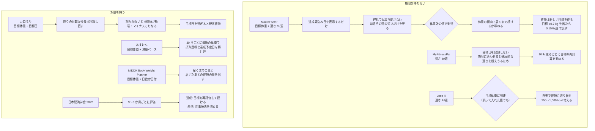

# 目標案の速さの相場と、目標の達成・期限の扱い

調査日: 2026-09-25
対象: 目標を立てるときに出す目標案（ゆるめ・標準・ハード。用語は `CONTEXT.md`）の、体重変化の速さの幅と上限、1回の減量期・増量期の長さ、目標に届いたとき・期限を迎えたときの扱いを決めるための下調べ。

> **確認の方法と限界**
> - 公的な指針は、NHLBI の 1998 年の臨床ガイドライン（NIH が配る PDF）、NIDDK と CDC の公式ページ、NIDDK の Body Weight Planner、AHA/ACC/TOS 2013 ガイドライン（Europe PMC の本文）、日本肥満学会「肥満症診療ガイドライン 2022」の治療指針の図（日本動脈硬化学会が再掲した PDF）、厚生労働省の e-ヘルスネットを**直接取得して読んだ**。本文で確かめた主張は「本文で確認」と書く。
> - 論文は PubMed の抄録（E-utilities で取得）と、Europe PMC にある物は本文まで読んだ。抄録までしか読めなかった物は「抄録で確認」と書く。
> - アプリは、MacroFactor の公式ヘルプ（help.macrofactorapp.com）・公式記事（macrofactor.com）・公式の PDF、MyFitnessPal と Lose It! とカロミルの公式ヘルプ（Zendesk の公開 API で本文を取得）、FoodNoms の公式ヘルプとお知らせ、あすけんの公式 FAQ（asken.tayori.com、asken.jp）を読んだ。**アプリを実際に動かしての確認はしていない**。画面にだけある値（スライダーの範囲など）は、ヘルプに書かれていなければ「記述なし」とする。
> - CDC のページは直接の取得が 403 になったため、WebFetch（取得したページを要約するツール）で原文の引用を取り出した。その物は「本文で確認（WebFetch 経由）」と書く。
> - 本文の記述から推し量った物は「本文からの読み取り」と書き、何から読み取ったかを添える。探しても記述が無かった物は「本文を探したが記述なし」、取得できなかった物は「取得できず」と書く。
> - 取得できなかった物: 肥満症診療ガイドライン 2022 の本文（書籍。治療指針の図の再掲だけを読んだ）、NCBI Bookshelf の NHLBI ガイドライン（ブラウザ確認で弾かれた。NHLBI の PDF で代替）。
> - 二次情報（ブログ、Reddit、知恵袋、まとめ記事）は使っていない。

## 結論の要約

- **減量の速さの相場は、公的な指針で「週 0.5〜1 kg（1〜2 lb）」、体づくりの研究で「週 0.5〜1%」。筋量を守る側に寄せるほど遅くなる。** NHLBI 1998 は 1〜2 lb/週を 6 か月（BMI 27〜35 なら 0.5〜1 lb/週）、CDC も 1〜2 lb/週とする。NIDDK と AHA/ACC/TOS 2013 は速さでなく「6 か月で 5〜10%」を出す。日本肥満学会 2022 は「3〜6 か月で現体重の 3% 以上」（高度肥満症は 5〜10%）で、週に直すと 0.12〜0.23%/週と一番遅い。筋量を守る研究では、Helms 2014 が 0.5〜1%/週、Garthe 2011 は 0.7%/週が 1.4%/週より除脂肪量を保ち、Roberts 2020 は競技者に 0.5%/週以下を勧め、Murphy & Koehler 2022 は 1 日 500 kcal を超える不足を避けるよう勧める。
- **増量（筋肉をつける目的）の相場は週 0.25〜0.5%。経験を積むほど遅くする。** Iraki 2019 と Helms 2023 がどちらも 0.25〜0.5%/週（余剰 5〜20%）とし、上級者はもっと控えめにするとした（本文で確認）。MacroFactor は経験で 3 段に分け、初心者 0.2〜1%/週、中級者 0.15〜0.8%/週、経験者 0.1〜0.6%/週の 4 択を出す。
- **MacroFactor の減量は 5 段（0.1% / 0.25% / 0.5〜0.75% / 1.0% / 1.5%）で、既定の推奨は 0.25〜1%/週、上限の目安は 1 kg（2 lb）/週。** 速さは %/週 で持ち、体重が減るほど kg では遅くなる。アプリはスライダーの「緑の範囲」に収めるよう勧めるが、範囲の数値はヘルプに無い。
- **既存アプリの選択肢**: MyFitnessPal は減量が最大 2 lb/週、増量が最大 1 lb/週。Lose It! は 0.5 / 1 / 1.5 / 2 lb/週の 4 択（1 lb = 3,500 kcal で 1 日 250〜1,000 kcal を引く）。下限は MyFitnessPal と Lose It! が女性 1,200 kcal・男性 1,500 kcal（NIH の値として）、NIDDK の Body Weight Planner は 1,000 kcal、あすけんは基礎代謝と同じ値に下げられない。FoodNoms は速さの選択肢をヘルプに書いていない。
- **1 回の期間の長さ**: NHLBI は「減量は 6 か月、その後は維持を優先し、さらに減らすなら改めて取り組む」、AHA/ACC/TOS は「6 か月以上の減量プログラム、その後 1 年以上の維持プログラム」、日本肥満学会は「3〜6 か月ごとに成果を評価し、達成なら目標を再評価して治療を続ける」。体づくりでは Helms 2014 が「2〜4 か月より長い、週 0.5〜1% の減量」を勧める。途中で維持を挟むこと（diet break）は、2 週ずつ交互の MATADOR（Byrne 2018）で効果が出たが、その後の研究では体重や代謝の差がなく、MacroFactor も専用のモードは作らず「1〜2 週だけ目標を維持に切り替える」を勧める。
- **目標に届いたとき・期限の扱いは、アプリで分かれる。** Lose It! は目標体重に届くと自動で維持に切り替わる。MacroFactor は体重計の値で届いたら「体重の傾向で届くまで続けるか」を尋ね、維持には新しい目標を作って移る。維持中は体重の傾向が目標 ±0.7 kg を出たら 0.15%/週 で戻す。**期限については、MacroFactor と MyFitnessPal は期限を持たない**（速さから達成見込み日を出すだけ。遅れても取り戻そうとしない）。カロミルは期限（目標日）から毎日逆算し、期限が近いと目標値がマイナスになることもあり、期限を過ぎると「現状維持」になる。あすけんは 30 日ごとに最新の体重で 1 日の摂取目標と達成予定日を計算し直す。

## 問い1: 減量の推奨・上限の速さ

### 公的な指針

| 出どころ | 速さ・目標 | 期間 | 確度 | 出典 |
|---|---|---|---|---|
| NHLBI 1998 臨床ガイドライン | 1〜2 lb/週（0.45〜0.9 kg/週、不足 500〜1,000 kcal/日）を 6 か月。BMI 27〜35 は不足 300〜500 kcal/日で 0.5〜1 lb/週、BMI > 35 は 500〜1,000 kcal/日で 1〜2 lb/週。どちらも 6 か月で 10% | 6 か月。「6 か月を過ぎると消費量の低下で減りが鈍り頭打ちになる」 | 本文で確認 | https://www.nhlbi.nih.gov/files/docs/guidelines/ob_gdlns.pdf（Executive Summary と、Treatment Guidelines の Goals for Weight Loss・Amount of Weight Loss） |
| NHLBI 1998（食事の量） | 女性 1,000〜1,200 kcal/日、男性 1,200〜1,500 kcal/日の低エネルギー食を選べる | — | 本文で確認 | 同上 |
| CDC | 「about 1 to 2 pounds a week」のゆっくりした減量のほうが、速く減らすより戻りにくい。最初の目標の例は 5% | — | 本文で確認（WebFetch 経由、最終確認日 2025-01-17） | https://www.cdc.gov/healthy-weight-growth/losing-weight/index.html |
| NIDDK | 「6 か月で開始時の体重の 5〜10%」を最初の目標とする。速さ（lb/週）の記述は見当たらない | 6 か月 | 本文で確認（速さは本文を探したが記述なし） | https://www.niddk.nih.gov/health-information/weight-management/choosing-a-safe-successful-weight-loss-program 、https://www.niddk.nih.gov/health-information/weight-management/adult-overweight-obesity/treatment |
| AHA/ACC/TOS 2013 | 不足 500 または 750 kcal/日、または 30% の不足。女性 1,200〜1,500、男性 1,500〜1,800 kcal/日。減りは 6 か月で最大 | 6 か月以上の包括的な減量プログラム、その後 1 年以上の維持プログラム | 本文で確認 | https://europepmc.org/article/PMC/PMC5819889 （Circulation 2014;129:S102、PMID 24222017） |
| ACSM 2009 見解（Donnelly ら） | NHLBI の 10% を引きつつ、3〜5% でも健康リスクが下がるとする。速さの数値は抄録に無い | — | 抄録で確認 | PMID 19127177 |
| 日本肥満学会 肥満症診療ガイドライン 2022 | 肥満症: 現体重の 3% 以上。高度肥満症: 現体重の 5〜10%（合併する健康障害に応じて）。週に直すと 3%/3〜6 か月 ≒ 0.12〜0.23%/週 | 3〜6 か月を目安に成果を評価 | 本文で確認（治療指針の図 1-2 の再掲。週への換算は本文からの読み取り） | https://www.j-athero.org/chart2025/chart2025_qr12.pdf |
| 厚生労働省 e-ヘルスネット | 「3〜4% の緩やかな減量でも検査値の異常は改善する」。月・週あたりの速さの記述は無い | — | 本文で確認（速さは本文を探したが記述なし） | https://kennet.mhlw.go.jp/information/information/food/e-02-009.html |

### 筋量を守る減量の研究

| 研究 | 所見 | 確度 | 出典 |
|---|---|---|---|
| Helms ら 2014（JISSN、ナチュラルボディビルの減量期の総説） | 筋量を最大限残すには体重が週 0.5〜1% 減る摂取量にする。「2〜4 か月より長く、週 0.5〜1% の減量」のほうが、短く急な減量より除脂肪量を残しやすいかもしれない。体脂肪が少ない人ほど短く | 本文で確認 | PMID 24864135、https://europepmc.org/article/PMC/PMC4033492 |
| Garthe ら 2011（エリート選手 24 人、無作為化） | 週 0.7%（摂取 −19%）と 1.4%（−30%）を比べ、実際は 0.7% と 1.0%/週。0.7% 群は除脂肪量が 2.1% 増え、1.4% 群は変わらず。筋トレ中に除脂肪量と 1RM を伸ばしたいなら週 0.7% を狙うとした | 抄録で確認 | PMID 21558571 |
| Murphy & Koehler 2022（メタ回帰） | 1 日約 500 kcal の不足で除脂肪量の増加が止まる。減量中に除脂肪量を守るなら 500 kcal/日を超える不足を避ける | 抄録で確認 | PMID 34623696 |
| Roberts ら 2020（フィジーク選手の栄養の総説） | 減量期は 0.5%/週以下が除脂肪量の減少を抑えるのに望ましい。diet break や refeed は役立つかもしれない。上位入賞者は 0.46%/週で、入賞しなかった人は 0.5%/週を超えていた（Chappell 2018 の引用） | 本文で確認 | PMID 32148575、https://europepmc.org/article/PMC/PMC7052702 |
| Aragon ら 2017（ISSN 見解） | 体脂肪が多いほど不足を大きくしてよい。体脂肪が少ない人ほど遅い減量のほうが除脂肪量を守る | 本文で確認 | PMID 28630601、https://europepmc.org/article/PMC/PMC5470183 |

### 体重あたりの換算（本文からの読み取り）

| %/週 | 60 kg | 70 kg | 80 kg |
|---|---|---|---|
| 0.25% | 0.15 kg | 0.17 kg | 0.20 kg |
| 0.5% | 0.30 kg | 0.35 kg | 0.40 kg |
| 0.75% | 0.45 kg | 0.53 kg | 0.60 kg |
| 1.0% | 0.60 kg | 0.70 kg | 0.80 kg |
| 1.5% | 0.90 kg | 1.05 kg | 1.20 kg |

公的な指針の 1〜2 lb/週（0.45〜0.9 kg/週）は、70 kg の人では 0.65〜1.3%/週にあたり、体づくりの研究の幅（0.5〜1%/週）より速い側に寄る。公的な指針は BMI が高い人の減量を前提にしている（NHLBI は BMI > 35 に 1〜2 lb/週、BMI 27〜35 には 0.5〜1 lb/週）。

## 問い1（続き）: 増量（筋肉をつける目的）の推奨の速さ

| 研究 | 所見 | 確度 | 出典 |
|---|---|---|---|
| Iraki ら 2019（ボディビルのオフシーズンの総説） | 初心者・中級者は余剰 10〜20% で体重 0.25〜0.5%/週。上級者は余剰と速さをもっと控えめに。上級者に月 2 kg の増量は多すぎるかもしれない | 本文で確認 | PMID 31247944、https://europepmc.org/article/PMC/PMC6680710 |
| Helms ら 2023（筋トレ経験 1 年以上 21 人、8 週、無作為化） | 維持・余剰 5%（2 週で体重 +0.4〜0.6% を狙う ≒ 0.2〜0.3%/週）・余剰 15%（2 週で +1.4〜1.6% ≒ 0.7〜0.8%/週）を比べた。速い増量は筋の厚みと 1RM をほぼ増やさず、主に脂肪を増やした（ベンチの 1RM だけ 15% 群が上）。結論として余剰 5〜20%、または 0.25〜0.5%/週、経験が長いほど遅くを勧める | 本文で確認 | PMID 37914977、https://europepmc.org/article/PMC/PMC10620361 |
| Garthe ら 2013（エリート選手 39 人、8〜12 週） | 栄養指導群は体重 +3.9%、自由摂取群は +1.5%。除脂肪量の増え方に差はなかった | 抄録で確認 | PMID 23679146 |
| Slater ら 2019（総説） | 筋肥大に要る余剰の量はまだ分かっていない。「余剰の最適点」は筋トレする人で確かめられていない | 抄録で確認 | PMID 31482093 |
| Aragon ら 2017（ISSN 見解） | 除脂肪量を増やすには持続的な余剰が要り、余剰の大きさとトレーニング歴で増え方が変わる。数値の速さは示さない | 本文で確認 | PMID 28630601 |

MacroFactor の増量の表（下の問い2）は、Rozenek、Smith、Helms、Sanchez、Garthe の 5 研究をもとに、経験で速さを分けている。筋トレ歴の浅い人は 0.5%/週（約 0.4 kg/週）までなら脂肪がほとんど増えず、経験者は速くしても主に脂肪が増える、という読み方である（本文で確認、https://macrofactor.com/bulking-calculator/ ）。

## 問い2: 先行アプリの速さの選択肢と上限

### MacroFactor

| 項目 | 所見 | 確度 | 出典 |
|---|---|---|---|
| 速さの単位 | 目標の速さは体重の %/週 で持つ。0.5%/週 なら 200 lb で 1 lb/週、180 lb で 0.9 lb/週と、体重が減るほど絶対量が減る | 本文で確認 | https://help.macrofactorapp.com/en/articles/222-how-does-macrofactor-make-adjustments-for-a-weight-gain-or-weight-loss-goal |
| 目標の入力 | 減らす・維持・増やすを選び、目標体重と速さをスライダーで選ぶ。「緑の範囲」に収めるのが理想。初期の 1 日の摂取目標と達成見込み（projected timeline / end date）を見せる | 本文で確認 | https://help.macrofactorapp.com/en/articles/90-set-a-new-goal 、https://macrofactor.com/goal-features/ （2025-09-12 更新） |
| 緑の範囲とスライダーの端の数値 | ヘルプに数値は無い | 本文を探したが記述なし | 同上、https://help.macrofactorapp.com/en/articles/88-edit-a-goal |
| 減量の 5 段 | Very Conservative 0.10%（不足 < 5%）/ Conservative 0.25%（5〜10%）/ Moderate 0.5〜0.75%（10〜20%）/ Slightly Aggressive 1.00%（20〜30%）/ Aggressive 1.5%（> 30%）。期限が無ければ Conservative〜Moderate を勧める | 本文で確認（ウェブの計算機の表。アプリの選択肢と同じかは本文を探したが記述なし） | https://macrofactor.com/cutting-calculator/ （2024-10-18 更新） |
| 減量の推奨と上限 | 既定は 0.25〜1%/週（0.25〜0.75 kg/週）。受け入れてよい幅は 0.1〜1.5%/週。上限の目安は 2 lb / 1 kg/週（不足が 1,000 kcal/日を超えると続かない）。% は重い人ほど不足が大きくなるので、無限に % で伸ばさない（150 lb で 1% は不足約 31%、300 lb で約 42%） | 本文で確認 | 同上、https://macrofactor.com/wp-content/uploads/2025/11/MacroFactor-Fat-Loss-Handbook.pdf |
| 増量の表（%/週） | 初心者 0.2 / 0.5 / 0.8 / 1%、中級者 0.15 / 0.325 / 0.575 / 0.8%、経験者 0.1 / 0.15 / 0.35 / 0.6%（Conservative / Happy Medium / Aggressive / Very Aggressive）。「Happy Medium」が既定の推奨で、Aggressive が「ほとんどの人が考える上限」 | 本文で確認 | https://macrofactor.com/bulking-calculator/ （2024-10-17 更新） |
| 増量の上限（kg/週） | 初心者 0.16 / 0.4 / 0.64 / 0.8、中級者 0.12 / 0.26 / 0.46 / 0.64、経験者 0.08 / 0.12 / 0.28 / 0.48。% だけでは重い人に速すぎるための上限 | 本文で確認 | 同上 |
| 経験の分け方 | 初心者: ほぼ毎回重量が上がり、多くの種目で週 2% 以上伸びる（本格的な筋トレ 3〜6 か月まで）。中級者: 週約 1%（約 1 年まで）。経験者: 週 1% を大きく下回る（1〜2 年以上） | 本文で確認 | 同上 |
| 増量の推奨の変更 | 2024 年 10 月に、研究が 150% 増えたことを理由に、初心者・中級者の増量の推奨を以前よりかなり速くした | 本文で確認 | https://macrofactor.com/mm-october-2024/ |
| 極端な速さ | 「消費量 3,000 kcal で目安が 1,500 kcal なら、約 3 lb/週 の攻めた目標を選んでいるはず」とあり、アプリは 3 lb/週 程度も選べる。その場合は速さを下げることを勧める | 本文からの読み取り（例の記述から） | https://help.macrofactorapp.com/en/articles/206-what-should-i-do-if-my-initial-expenditure-or-recommended-energy-intake-seems-too-high-or-too-low |
| 下限カロリー | 1,200 kcal のような下限は書いていない。脂質は最低量より下げず、それ以上の減らしは炭水化物で行う | 本文で確認（カロリーの下限は本文を探したが記述なし） | https://help.macrofactorapp.com/en/articles/222-how-does-macrofactor-make-adjustments-for-a-weight-gain-or-weight-loss-goal |

### そのほかのアプリと NIH の計算機

| アプリ | 速さの選択肢 | 下限・安全の仕組み | 確度 | 出典 |
|---|---|---|---|---|
| MyFitnessPal | 1 週間にどれだけ減らす・増やすかを尋ね、維持の量から引く・足す。減量は最大 2 lb/週、増量は最大 1 lb/週。目標体重は「あと何 lb か」の表示用で、計算には使わない | 女性 1,200 kcal・男性 1,500 kcal を下回る摂取は勧めない（NIH の値として。以前は男女とも 1,200） | 本文で確認 | https://support.myfitnesspal.com/hc/en-us/articles/360032625391 、https://support.myfitnesspal.com/hc/en-us/articles/360032271632 、https://support.myfitnesspal.com/hc/en-us/articles/360032626031 |
| Lose It! | 0.5 / 1 / 1.5 / 2 lb/週の 4 択（1 lb = 3,500 kcal として 1 日 250 / 500 / 750 / 1,000 kcal を引く）。増量の機能は無く、維持にして手で 250 / 500 / 1,000 kcal を足す | 1 週間の平均の予算が男性 1,500・女性 1,200 kcal（NIH の値として）を下回ると警告を出し、遅い速さへの変更を強く勧める | 本文で確認 | https://loseit.zendesk.com/hc/en-us/articles/47497714327060 、https://loseit.zendesk.com/hc/en-us/articles/47345064673556 、https://loseit.zendesk.com/hc/en-us/articles/47773932378260 |
| FoodNoms | 自動の摂取目標は「消費量 + 体重の目標」で作り、設定の「Goals → Weight」で体重の目標を置く。速さの選択肢と下限は書いていない | 低体重の人には Calibrated Energy が目標を下げる提案をしない | 本文で確認（速さと下限は本文を探したが記述なし） | https://foodnoms.com/help/automatic-calorie-goal 、https://foodnoms.com/help/calibrated-energy |
| あすけん | 目標体重を入れ、「減量ペース」と「がんばり方」（食事中心・バランス・運動中心）を選ぶ。ペースの名前に「がんばる」「すごくがんばる」がある。差し引く量は「7,000 kcal で脂肪 1 kg、7,000 ÷ 30 日 ≒ 230 kcal」から計算する。ペースの数値（kg/月）の一覧は無い | 目標体重を BMI 18.5 未満にできない。摂取目標を基礎代謝と同じにできない。基礎代謝が 1,000 kcal 未満なら「食事中心」を選べない。摂取目標は直接入力できず、±200 kcal を適正範囲とする | 本文で確認（ペースの数値は本文を探したが記述なし） | https://www.asken.jp/info/3053 、https://www.asken.jp/info/3072 、https://asken.tayori.com/q/s-faq/detail/904693/ 、https://asken.tayori.com/q/s-faq/detail/904753/ 、https://asken.tayori.com/q/s-faq/detail/1091578/ 、https://asken.tayori.com/q/s-faq/detail/1010181/ |
| カロミル | 速さを選ばず、目標体重と目標日を入れて、残りの日数から自動で計算する | 下限の記述は無い。目標日までの残りが少ないと、目標値が少なすぎる・多すぎる・マイナスになることがあるとヘルプに書く | 本文で確認（下限は本文を探したが記述なし） | https://support.calomeal.com/hc/ja/articles/41129519776153 、https://support.calomeal.com/hc/ja/articles/900006521023 |
| NIDDK Body Weight Planner | 目標体重と、何日で・何日までに届きたいかを入れ、「届くまで」と「届いたあと維持する」の 2 つの摂取量を出す | 1,000 kcal/日を下回る結果は受け付けない（食品群と栄養の推奨を満たせないため）。目標体重が健康的な体重を下回ると警告する | 本文で確認 | https://www.niddk.nih.gov/bwp |

## 問い3: 1 回の減量期・増量期の長さ

| 出どころ | 所見 | 確度 | 出典 |
|---|---|---|---|
| NHLBI 1998 | 1〜2 lb/週の減量は 6 か月ほど続く。6 か月の減量のあとは維持の取り組みを優先し、さらに減らす必要があれば改めて減量する。10% に届いたら、必要なら評価のうえでさらに減らす | 本文で確認 | https://www.nhlbi.nih.gov/files/docs/guidelines/ob_gdlns.pdf |
| AHA/ACC/TOS 2013 | 6 か月以上の包括的な減量プログラム、減量した人は 1 年以上の維持プログラム | 本文で確認 | https://europepmc.org/article/PMC/PMC5819889 |
| 日本肥満学会 2022 | 3〜6 か月を目安に成果を評価する。達成なら「目標の再評価・治療の継続」、未達なら食事療法を強め、条件に応じて薬物療法・外科療法へ | 本文で確認（図 1-2 の再掲） | https://www.j-athero.org/chart2025/chart2025_qr12.pdf |
| Helms ら 2014 | 2〜4 か月より長い、週 0.5〜1% の減量が、短く急な減量より除脂肪量を残しやすいかもしれない | 本文で確認 | https://europepmc.org/article/PMC/PMC4033492 |
| Byrne ら 2018（MATADOR） | 16 週の連続した減量と、2 週の減量と 2 週の維持を交互にした 30 週（減量は計 16 週）を比べ、交互のほうが体重・脂肪がよく減った。維持の 2 週の体重変化はほぼ 0 | 抄録で確認 | PMID 28925405 |
| Roberts ら 2020 | diet break と refeed は減量への不利な適応を一部和らげるかもしれない（限られたデータ） | 本文で確認 | https://europepmc.org/article/PMC/PMC7052702 |
| MacroFactor（Trexler、2024-06-11 更新） | diet break は少なくとも 1 週、維持の量に戻すこと。1〜3 週の減量と 1〜2 週の維持を交互にする例もある。MATADOR のあとの 2 研究（Peos 2021、Siedler ら）では体重・脂肪・安静時代謝に差がなく、効果があるとしても大きな減量や極端な痩せに限られ、2 週以上の break で出やすいとみる。代わりに目標までの時間が延びる | 本文で確認 | https://macrofactor.com/refeeds-diet-breaks/ |
| MacroFactor（アプリの扱い） | diet break の専用モードは作らない（根拠が足りず、最適な入れ方も決まっていないため）。「1〜2 週だけ目標を維持に切り替え、元の目標に戻す」でよく、目標を切り替えても推定消費量は途切れない | 本文で確認 | https://help.macrofactorapp.com/en/articles/30-does-macrofactor-support-refeeds-diet-breaks-or-carb-cycling 、https://help.macrofactorapp.com/en/articles/204-does-my-data-reset-if-i-change-goals-or-create-a-new-program |
| MacroFactor（期間の長さ） | 減量期の長さそのものは決めていない。期間は目標の量と選んだ速さで決まり、「どれだけ長く減量したいか」「筋肉を少し失ってもよいか」「進めながらの気持ち」で選ぶとする | 本文で確認（週数の推奨は本文を探したが記述なし） | https://macrofactor.com/cutting-calculator/ |
| 増量期の長さ | 週数の推奨を示す一次情報は見つからなかった。MacroFactor は「速い増量ほど脂肪が増え、早く減量に戻ることになる」「Happy Medium なら長く余剰を続けられる」と、速さと長さの関係だけを書く | 本文を探したが記述なし（関係の記述は本文で確認） | https://macrofactor.com/bulking-calculator/ |

## 目標に届いたとき・期限を迎えたときの扱いの先行例

| 先行例 | 目標に届いたとき | 期限・遅れの扱い | 確度 | 出典 |
|---|---|---|---|---|
| MacroFactor | 体重計の値で届くと、体重の傾向で届くまで続けるかを尋ねる。減量・増量から維持へ向きを変えるには新しい目標を作る（編集は目標体重と速さだけ） | 期限は持たない。目標は「毎週守る速さ」で、遅れても（例: 1 lb/週 の目標で 10 週 5 lb）不足を大きくして取り戻そうとしない。取り戻すと続けにくくなり、減量なら除脂肪量、増量なら脂肪が増えるため。締め切りがある人には、毎週の見直しの前に速さを直して「ETA」を締め切りか少し前に保つよう勧める | 本文で確認 | https://macrofactor.com/goal-features/ 、https://help.macrofactorapp.com/en/articles/88-edit-a-goal 、https://help.macrofactorapp.com/en/articles/202-what-should-i-do-if-i-m-pursuing-a-goal-with-a-strict-timeline 、https://help.macrofactorapp.com/en/articles/222-how-does-macrofactor-make-adjustments-for-a-weight-gain-or-weight-loss-goal |
| MacroFactor の維持 | 体重の傾向が目標の ±1.5 lb（約 0.7 kg）内なら消費量どおり。外れたら 0.15%/週 の減量・増量にあたる小さな不足・余剰で戻し、内に戻れば消費量どおりに戻す。減量のあとの「軟着陸」とする | — | 本文で確認 | https://help.macrofactorapp.com/en/articles/125-how-does-dynamic-maintenance-work-in-macrofactor |
| MacroFactor（届いたあと） | 届いた時点で自動で維持に移るかは書いていない | — | 本文を探したが記述なし | — |
| MyFitnessPal | — | 目標日を記録しない。目標体重に日付で届こうとすると健康的な速さを超えうるため。最初に達成の目安の日を 1 回だけ出す。10 lb 減るごとに目標の再計算を勧める | 本文で確認 | https://support.myfitnesspal.com/hc/en-us/articles/360032271632 、https://support.myfitnesspal.com/hc/en-us/articles/360032271472 |
| Lose It! | 目標体重に届くと自動で維持の計画に移り、摂取の予算が（それまでの速さに応じて）250〜1,000 kcal 増える。誤って目標以下の体重を入れても維持に移り、速さを変えるか新しい計画を始めるまで続く | 達成見込み日は 2 種類（予算どおりに食べた場合と、実際の記録から計算した場合）。今のペースで 5 年を超える、計画の 6 倍より遅い、または 6 倍より速いときは見込み日を隠す（速すぎるときは健康的な速さを促すため） | 本文で確認 | https://loseit.zendesk.com/hc/en-us/articles/47773659281940 、https://loseit.zendesk.com/hc/en-us/articles/51382148864532 |
| カロミル | — | 目標値は目標日・目標体重・直近の体重から自動で計算する。目標日が近すぎる、または過ぎると目標値が大きく増減し、マイナスにもなる。目標日を過ぎると「現状維持」の設定になる | 本文で確認 | https://support.calomeal.com/hc/ja/articles/41129519776153 、https://support.calomeal.com/hc/ja/articles/900006520943 |
| あすけん | — | 目標設定日から 30 日に 1 回、最新の体重で摂取目標と目標達成予定日を自動で計算し直す | 本文で確認 | https://asken.tayori.com/q/s-faq/detail/1091457/ 、https://www.asken.jp/info/3072 |
| NIDDK Body Weight Planner | 「届くまで」と「届いたあとに維持する」の 2 つの摂取量を最初から並べて出す | 届く日（日数か日付）を入力として受け取る | 本文で確認 | https://www.niddk.nih.gov/bwp |
| 日本肥満学会 2022 | 達成なら目標を再評価して治療を続ける | 3〜6 か月を目安に評価。未達なら食事療法を強める | 本文で確認 | https://www.j-athero.org/chart2025/chart2025_qr12.pdf |

## nu-tori の目標案に向けた材料（本文からの読み取り）

`CONTEXT.md` の目標は「向き・期限・目標体重の組み」なので、期限を持つ側（カロミル、NIDDK Body Weight Planner）に近い。一方で速さの相場は %/週 で語られていて、MacroFactor と MyFitnessPal は、期限に合わせると健康的な速さを超えうることを理由に期限を持たない。両方を満たすには、**目標案を速さ（%/週）で作り、期限は「目標体重 ÷ 速さ」から出した日付として見せる**形が一次情報に一番近い。以下は決定ではなく、決めるときの材料である。

- **減量の目標案の候補**: ゆるめ 0.25%/週、標準 0.5%/週、ハード 1.0%/週。根拠は MacroFactor の Conservative / Moderate / Slightly Aggressive、Helms 2014 の 0.5〜1%/週、Garthe 2011 の 0.7%/週。ハードには kg の上限（MacroFactor の 1 kg/週）をかけると、重い人の不足が大きくなりすぎない。日本肥満学会の 3%/3〜6 か月（0.12〜0.23%/週）は「ゆるめ」より遅い。
- **増量の目標案の候補**: ゆるめ 0.15%/週、標準 0.25%/週、ハード 0.5%/週（Iraki 2019・Helms 2023 の 0.25〜0.5%/週と、MacroFactor の中級者の値の間）。MacroFactor は筋トレ経験で速さを分けるが、nu-tori の身体データ（身長・生年月日・性別・活動量）に筋トレ経験は無い。経験を聞かずに 1 組にするなら、経験者でも脂肪が増えすぎない側に寄せることになる。
- **期間の目安**: 5% 減らすのにかかる週数は、0.25%/週で約 20 週、0.5%/週で約 10 週、1%/週で約 5 週（%/週 で複利にした場合）。公的な指針の「6 か月」、日本肥満学会の「3〜6 か月ごとの評価」、Helms の「2〜4 か月より長く」が、期限の上限・区切りの材料になる。
- **下限**: 既存アプリの下限は、1,200 / 1,500 kcal（MyFitnessPal、Lose It!）、1,000 kcal（NIDDK）、基礎代謝（あすけん）、BMI 18.5 未満の目標体重を禁止（あすけん）、低体重なら下げない（FoodNoms）と分かれる。
- **届いたとき**: 自動で維持に移す（Lose It!）か、尋ねる（MacroFactor）か。MacroFactor の維持は「目標 ±0.7 kg を出たら 0.15%/週 で戻す」で、届いたあとの 1 日の目安の作り方の具体例になる。
- **期限を迎えたとき・遅れたとき**: 期限に合わせて毎日・毎週逆算すると、カロミルのように目安が極端な値になる。MacroFactor は遅れを取り戻さないことを、続けやすさと体組成を理由に明記している。

## 未確認の点（まとめ）

本文を探したが記述が無かった物:
- MacroFactor のアプリのスライダーの「緑の範囲」と両端の数値（ウェブの計算機の表と同じかどうか）、目標に届いたあと自動で維持に移るかどうか
- FoodNoms の体重の目標の速さの選択肢と下限
- あすけんの減量ペースの選択肢の数値（kg/月）と、増量のペース
- 厚生労働省の、月・週あたりの減量の速さの目安
- 増量期の長さ（週数）の推奨

取得できなかった物:
- 日本肥満学会「肥満症診療ガイドライン 2022」の本文（治療指針の図の再掲だけを読んだ）
- NCBI Bookshelf 版の NHLBI ガイドライン（NHLBI の PDF で代替）
- MyFitnessPal の公式ブログ（blog.myfitnesspal.com、403）
