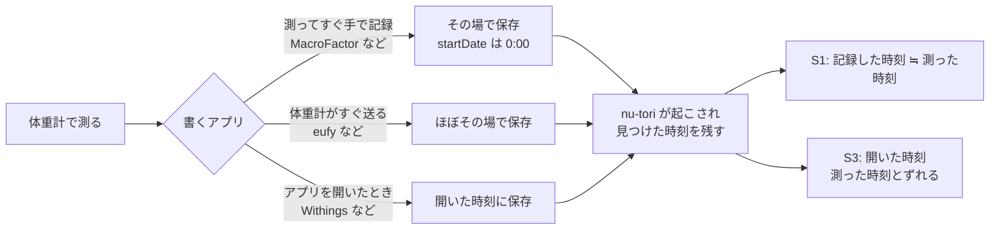

# ヘルスケアの体重の時刻（体重計・記録アプリが書く時刻と、測った時刻を推し量る手がかり）

調査日: 2026-10-06
対象: Issue #321「いつもの時刻が、時刻を 0:00 で書く取り込みの体重から学ばれ、記録忘れの通知が深夜1時になる」と、その直し（PR #322）。直しより良い解決策があるかを考える材料として、体重計・記録アプリがヘルスケアの体重（bodyMass）にどの時刻で書くか、時刻の無いサンプルから測った時刻を推し量る手がかりが HealthKit にあるか、MacroFactor が体重の時刻をどう扱うかを集める。決定はしない。

> **確認の方法と限界**
> - Apple の HealthKit ドキュメント（developer.apple.com のページを、同じ内容の JSON（`/tutorials/data/documentation/healthkit/<page>.json`）で取得）、各社の公式ヘルプとリリースノート、App Store のページ（説明文・バージョン履歴・レビューと開発者の返答）の**本文を直接取得して読んだ**。本文で確かめた主張は「本文で確認」と書く。
> - 本文の記述から推し量ったものは「本文からの読み取り」と書き、何から読み取ったかを添える。
> - 本文や関連ページを探しても記述が無かったものは「本文を探したが記述なし」と書く。
> - **体重計メーカーで、HealthKit に書く時刻を公式に書いているところは見つからなかった。** そのため、一次情報が無いメーカーに限り、公式フォーラムの利用者の投稿（二次情報）を使い、「二次情報」と明記した。
> - Withings のサポート記事（support.withings.com）と Xiaomi のサポート（mi.com）は 403 で本文を読めず、検索結果の抜粋しか見ていない。MacroFactor のヘルプセンターは JavaScript で描くため、ブラウザで描画して読んだ。reddit.com は取得できなかった。
> - **実機での確認はしていない。** MacroFactor が体重を 0:00 で書くことは、このリポジトリの Issue #321（開発者の実機、TestFlight のビルド 47 での観察）による。MacroFactor の公式資料には記述が無い。
> - 出典の番号は末尾の「出典一覧」。

## 結論の要約

- **問い1（各社が書く時刻）**: 公式に書いているのは、体重も扱う栄養アプリ MacrosFirst だけで、「体重の時刻を持たないので、書き出す体重はすべてその日の 0:00 にする」とある【本文で確認 M1】。体重計メーカー（Withings・eufy・RENPHO・タニタ・OMRON・Garmin・Xiaomi・Fitbit）は、どれも公式の記述が無い【本文を探したが記述なし】。二次情報では、Garmin Connect が日付だけを渡して 00:00 になるという利用者の投稿があり【二次情報 G1】、タニタのヘルスプラネットは体重計と通信した時刻で書かれるというレビューに開発者が「再連携で正しく反映される」と返答している【本文で確認（開発者の返答、2018 年） T1】。MacroFactor は公式の記述が無く、0:00 で書くことは #321 の観察だけ。手入力と自動計測で時刻の書き方が違うと書いているメーカーは無い【本文を探したが記述なし】。
- **時刻の種類は3つ混ざりうる**（本文と二次情報からの読み取り）: ①測った時刻、②同期した時刻（アプリを開いたとき・体重計と通信したとき）、③その日の 0:00。今の直し（#322）が外せるのは③だけ。
- **問い2（推し量る手がかり）**: 公開 API に、サンプルが**ヘルスケアに保存された時刻**を返すものは無い。`HKObject` が持つのは `uuid`・`metadata`・`device`・`sourceRevision` だけで、`HKSample` が足すのは `startDate`・`endDate`・`hasUndeterminedDuration` だけ【本文で確認 A1,A2】。`HKMetadataKeyTimeZone` は作ったときのタイムゾーン、`HKMetadataKeyWasUserEntered` は手入力かどうか、`HKMetadataKeySyncIdentifier`/`SyncVersion` は差し替えのための識別子で、どれも測った時刻は表さない【本文で確認 A3–A6】。使える手がかりは、**nu-tori が取り込みでそのサンプルを初めて見つけた時刻**（background delivery で起こされた時刻）と、出どころ（`sourceRevision`）ごとの傾向くらい。
- **background delivery**: `immediate` は「変化を見つけるたびにアプリを起こす」とされる。ただし種類によっては最大の頻度が `hourly` に抑えられ、それは「透過的に」強制される（例として iOS の stepCount）。bodyMass が `immediate` で届くかは書かれていない【本文で確認 A7,A8／bodyMass は記述なし】。端末がロック中はヘルスケアが暗号化され、裏で読めないことがある【本文で確認 A9,A10】。nu-tori はすでに bodyMass に `immediate` で background delivery を登録し、`HKObserverQuery` と anchored query で読んでいる（`ios/NuTori/Health/HealthKitHealthStore.swift`）。
- **問い3（MacroFactor）**: アプリ内の体重記録は「日付を選んで重さを入れる」操作で、時刻を入れる手順は無い【本文で確認 F1】。ヘルスケアに書く時刻、その理由、1日に複数ある体重の扱い、時刻の設定は、公式資料に記述が無い【本文を探したが記述なし F1–F6】。日付だけを持つ記録のつくりなので 0:00 で書く、と読むのが自然（本文と #321 の観察からの読み取り）。設定で変えられる手がかりは無い。
- **問い4（nu-tori の案）**: 時刻の無い記録を外す今の直しは、③の 0:00 には効くが、②の同期時刻には効かない。MacroFactor のように「測ってすぐ手で記録し、そのとき書く」アプリには、**取り込みで見つけた時刻**を当日のうちに限って使う案がいちばん測った時刻に近づく（推測）。ただし記録の形と同期の帳簿を変える。どの案でも、ユーザーが時刻を決める逃げ道を持つと、推し量りが外れたときに直せる。下の「問い4」に比べる。

## 問い1: 体重計・記録アプリがヘルスケアの体重に書く時刻

### 各社の表

| アプリ（体重計） | 書く時刻 | 手入力と自動計測の違い | ヘルスケアに届く時機 | 確度 | 出典 |
|---|---|---|---|---|---|
| **MacroFactor** | その日の 0:00（#321 の実機の観察）。公式資料には時刻の記述が無い | 体重は手入力か、ヘルスケアからの取り込み。アプリ内の記録は日付を選んで入れる | 公式の記述なし | 0:00 は観察のみ。公式は記述なし | #321、F1–F6 |
| **MacrosFirst**（参考。体重も扱う栄養アプリ） | 体重の時刻を集めないので、書き出す体重はすべてその日の 0:00。その日の体重は最も低い値とする | 区別なし（日付単位） | 自分の体重は即時に書く。ヘルスケアからは今日の分を20秒ごと、30日以内を5分ごとに読む | 本文で確認 | M1 |
| **Garmin Connect**（Index） | 日付だけを渡し、時刻を渡していない。同じ日に2回量ると両方 00:00 になる、という利用者の投稿。Garmin の担当者の返答は無い | 記述なし | 2022 年 10 月に体重の同期が止まり v4.62 で直った、と担当者が投稿 | 二次情報（4年以上前の投稿） | G1、G2 |
| **タニタ ヘルスプラネット**（日本） | 2018 年のレビューに「ヘルスケアの測定日は体重計と通信した時刻ではないか」。開発者は、連携の「再連携」→「全データ」で正しく反映されると返答。ふだんの同期は通信した時刻、全データの再連携では測った時刻で書き直す、と読める | 記述なし | 記述なし。連携する項目は体重・体脂肪率・BMI・脈拍・血圧 | 本文で確認（開発者の返答。2018 年で古く、今の振る舞いかは未確認）。読み取りを含む | T1 |
| **Withings**（Withings アプリ、旧 Health Mate） | 記述なし | 記述なし | iOS の制約で自動ではなく、アプリを開いたときに Withings のサーバーから取り、ヘルスケアに書く。Background App Refresh も要る | 届く時機は検索結果の抜粋のみ（記事は 403）。時刻は記述なし | W1、W2 |
| **eufy Life** | 記述なし | 記述なし | 量るたびに体重などをヘルスケアに同期する、と説明文にある | 届く時機は本文で確認。時刻は記述なし | E1、E2 |
| **RENPHO Health** | 記述なし | 記述なし | 記述なし（同期する項目の一覧と「同期の信頼性を改善」だけ） | 記述なし | R1 |
| **OMRON connect**（海外版） | 記述なし。2026 年 6〜7 月の版に「Apple Health の改善」とあるが中身は書かれていない | 記述なし | 記述なし | 記述なし | O1 |
| **OMRON connect**（日本） | 記述なし。第三者（Welby）の手引きに、ペアリングや電池交換のあとは体重計に時刻を覚えさせる必要があるとある（体重計の時計がずれると測った時刻もずれうる、という読み取り） | 記述なし | 記述なし | 第三者資料の検索要約のみ（本文は未取得） | O2 |
| **Xiaomi Zepp Life / Mi Fitness** | 記述なし | 記述なし | 同期に数時間〜1日かかることがある、という検索の抜粋 | 抜粋のみ（403） | X1 |
| **Fitbit**（Aria） | ヘルスケアへの公式の連携が無い。IFTTT など第三者の道具でつなぐ | — | 第三者の道具しだい | 時刻は記述なし | FB1 |
| **Wyze Scale** | 記述なし | 記述なし | アプリを開いて近くに置くと同期する、初日は届かなかった、という利用者の投稿 | 二次情報 | WY1 |
| **Cronometer**（参考。栄養で体重ではない） | 栄養の合計は時刻を持たないので 0:00 に書く、と担当者が 2020 年に返答 | — | — | 本文で確認（担当者の返答、2020 年） | C1 |
| Etekcity/VeSync、Happy Scale、Lose It!、MyFitnessPal、Arboleaf、Qardio、MyTanita | 記述なし | 記述なし | 記述なし | 本文を探したが記述なし | — |

### 表から言えること

- **0:00 で書くのは「日付だけを持つ」アプリ。** MacrosFirst は理由（時刻を集めない）まで公式に書いている【本文で確認 M1】。Cronometer も栄養で同じ理由を挙げる【本文で確認 C1】。MacroFactor も記録の操作が日付単位なので同じつくりと考えられる（本文からの読み取り F1）。Garmin は二次情報。
- **同期した時刻で書くものがありうる。** タニタのヘルスプラネットの開発者の返答と、Withings・Wyze・Xiaomi の「アプリを開くまで届かない」から、届いた時刻・通信した時刻で書くアプリがあっても見分けにくい（読み取り。Withings が何の時刻で書くかは記述なし）。同期時刻は 0:00 ちょうどにならないので、今の直しでは外れない。
- **手入力と自動計測の違い、`HKMetadataKeyWasUserEntered` を付けるか**は、どのメーカーも書いていない【本文を探したが記述なし】。
- **0:00 は「その日の、どのタイムゾーンの 0:00 か」に依存する。** 書いたアプリが端末のタイムゾーンで 0:00 を作り、`HKMetadataKeyTimeZone` を付けない場合、nu-tori は端末のタイムゾーンを使う（`ios/NuToriCore/Sources/NuToriCore/Health/HealthImportPlan.swift` の `weight.timeZone ?? deviceTimeZone`）。旅行中に書かれた分や、あとからタイムゾーンを変えた端末で取り込んだ分は、0:00 ちょうどに見えないことがある（推測。#322 のテストの「LA の時計で 0:00:00 ちょうど」はこの境目を扱っている）。

## 問い2: 時刻の無い体重サンプルから「いつ測ったか」を推し量る手がかり

### HealthKit のサンプルが持つもの

| 手がかり | 何を表すか | 測った時刻の手がかりになるか | 確度 | 出典 |
|---|---|---|---|---|
| `startDate`／`endDate` | 時点のサンプル（体温など）は両方が同じで、測った時点を表すとされる。bodyMass は離散型 | 書くアプリが入れた値そのもの。0:00 で書かれたらそれまで | 本文で確認 | A2、A11 |
| `HKMetadataKeyTimeZone` | オブジェクトを作ったときのユーザーのタイムゾーン（任意） | タイムゾーンだけ。時刻は表さない。0:00 を正しい時計で判定するのには役立つ | 本文で確認 | A3 |
| `HKMetadataKeyWasUserEntered` | 手で入れたサンプルなら true を入れる（任意） | 手入力かどうかだけ。MacroFactor のような手入力の日付だけの記録も true でありうる（推測）。各社が付けるかは記述なし | 本文で確認（付けるかは記述なし） | A4 |
| `HKMetadataKeySyncIdentifier`／`SyncVersion` | 同じ識別子でより大きい版を保存すると、古いものを置き換える | 差し替えの仕組みで、時刻は表さない。差し替えると新しいサンプルとして届く（下の「見つけた時刻」の注意） | 本文で確認 | A5、A6 |
| `HKMetadataKeyExternalUUID` | 書いたアプリが付ける独自の識別子 | 表さない | 本文で確認 | A12 |
| `sourceRevision` | 保存したアプリ（とその版、OS の版、機種） | 出どころがわかる。「この出どころは毎日 0:00 で書く」のような傾向を出どころごとに見られる（推測） | 本文で確認 | A13、A14 |
| `device`（`HKDevice`） | データを作った機器（名前、メーカー、型番、ファームウェアの版など） | 体重計か手入力かの目安になりうるが、各社が入れるかは記述なし | 本文で確認（入れるかは記述なし） | A15 |
| **保存された時刻** | — | **公開 API に無い。** `HKObject` のプロパティは `uuid`・`metadata`・`device`・`sourceRevision`（と非推奨の `source`）、`HKSample` が足すのは `startDate`・`endDate`・`hasUndeterminedDuration`・`sampleType` だけ。ヘルスケアのアプリはサンプルの詳細に「ヘルスケアに追加した日」を見せる、という開発者フォーラムの投稿はある | API に無いことは本文で確認（プロパティの一覧）。ヘルスケアのアプリの表示は二次情報 | A1、A2、AF1 |

### 届く時機（background delivery と anchored query）

| 項目 | 所見 | 確度 | 出典 |
|---|---|---|---|
| 起こすきっかけ | どこかのプロセスが、指定した種類のサンプルを保存・削除するたびに起こす。指定した頻度の期間ごとに最大1回 | 本文で確認 | A7、A16 |
| `immediate` | 「変化を見つけるたびにアプリを起こす」 | 本文で確認 | A8 |
| 頻度の上限 | 種類によっては最大の頻度が `hourly` で、システムが透過的に強制する。iOS の例は stepCount。**bodyMass がどうかは書かれていない** | 本文で確認（bodyMass は記述なし） | A7 |
| 必要なもの | iOS 15 以降は background delivery の entitlement が要る。observer query は起動直後に用意する。処理後に完了ハンドラを呼ばないと、間隔を延ばして再試行し、3回応じないと止める | 本文で確認 | A7、A17 |
| observer query が教えること | 変化があったことだけ。中身は anchored query などで別に読む | 本文で確認 | A16 |
| anchored query | アンカーより新しく保存・削除されたものだけを返す。返る順は保存の順の手がかりになるが、時刻は返らない | 本文で確認（時刻を返さないのは、返り値の型からの読み取り） | A18 |
| ロック中 | ロックするとヘルスケアは暗号化され、裏で動くアプリは読めないことがある（`errorDatabaseInaccessible`）。書き込みは一時ファイルに貯め、解除したときに合流する | 本文で確認 | A9、A10 |
| シミュレーター | 裏の問い合わせはシミュレーターで動かない。実機で試す | 本文で確認 | A7、A16 |
| 実際に何秒・何分で届くか、強制終了したアプリを起こすか | 書かれていない | 本文を探したが記述なし | A7、A8、A16 |

### 「見つけた時刻」が測った時刻に近くなる条件（推測）

- 手で記録するとき、ユーザーは端末を使っている（ロックが解けている）ので、ロック中で読めない問題は起きにくい（推測）。
- 次のときは、見つけた時刻が測った時刻と無関係になる（推測）。
  - 連携をつないだ直後や、iOS 27 の読み取り期間の変更、nu-tori の入れ直しで、過去分をまとめて読むとき
  - 書いたアプリが過去分を再同期・再書き出しするとき（タニタの「全データ」の再連携、FoodNoms の再書き出しのようなもの）
  - `SyncIdentifier` で差し替えたとき（体重を直すと、新しいサンプルとして届く）
  - アプリを開いたときにしか届かない連携（Withings、Wyze）
  - 端末がロック中で読めず、解除したときにまとめて読むとき

## 問い3: MacroFactor 自身の体重の時刻の扱い

| 項目 | 所見 | 確度 | 出典 |
|---|---|---|---|
| アプリ内で時刻を持つか | 体重の記録は、日付を選んで重さを入れる操作。時刻を入れる手順は書かれていない。過去の体重は日付ごとの記録として直す・消す | 本文で確認（時刻を持たないことは本文からの読み取り） | F1、F2 |
| 1日に複数の体重 | 持てるか、平均するか、最低値を取るか | 本文を探したが記述なし | F1、F2、F3 |
| ヘルスケアに書く時刻 | 0:00 などの記述も、その理由も無い。2.9.3（2024 年 8 月）で体重をヘルスケアから読み、書けるようになったとだけある | 本文を探したが記述なし（0:00 は #321 の観察） | F3、F4 |
| ヘルスケアから読むときの優先 | 体重は「手入力 > Apple Health / Health Connect > Fitbit」。その日に MacroFactor の手入力があれば、その日は同期しない。優先は変えられない。つないだときは 30 日前まで取り込む | 本文で確認 | F3、F5、F6 |
| 1日に複数ある体重をヘルスケアから読むとき、どれを選ぶか、タイムゾーン | 書かれていない | 本文を探したが記述なし | F3、F5、F6 |
| 設定で変えられるか | 連携のオンとオフ（More > Integrations）だけが書かれている。時刻や書き方の設定は見当たらない | オンとオフは本文で確認、時刻の設定は記述なし | F3 |
| リリースノート | 1.2.9（体重・体脂肪の取り込み）、2.9.3（体重の読み書き）、5.4.0（Apple Watch から体重を記録）、App Store の 5.5.0〜5.8.9 の版の履歴に、体重の時刻・タイムゾーン・複数回の記述は無い | 本文を探したが記述なし | F4、F7、F8、F9 |

- **注意**: Web 検索の要約に「最も低い体重を使う、時刻を集めないので書き出しはすべて 0:00」という文が MacroFactor のものとして出ることがあるが、出典は MacrosFirst のヘルプ（M1）で、MacroFactor の記述ではない。
- 書き出しで時刻を落とす理由は、MacrosFirst と Cronometer が挙げる「時刻を持たないから」と同じと考えるのが自然（推測。MacroFactor の記述は無い）。設定で変える道は見当たらないので、nu-tori の側で扱うしかない。

## 問い4: nu-tori が取れる案と、それぞれの限界

前提: いつもの時刻は、サーバーの `learnUsualWeighingTime`（`server/src/usual-weighing-time/domain/learn-usual-weighing-time/learn-usual-weighing-time.ts`）が、直近 28 日の日ごとの最初の記録の時刻の中央値から学ぶ。3日そろわなければ学ばず、一度学んだ値は残る。#322 で、記録したときの時計で 0:00:00.000 ちょうどの記録を材料から外した。

### 案の一覧

| 案 | 中身 | 効く相手 | 限界 | 変えるもの |
|---|---|---|---|---|
| **A. 今の直し**（0:00:00.000 を外す） | 時計で 0:00:00 ちょうどの記録を材料から外す | ③ 0:00 で書くアプリ（MacroFactor、MacrosFirst、Garmin の報告） | ② 同期時刻で書くアプリ（タニタの報告、アプリを開いたときに届くもの）は外せず、いつもの時刻が遅い側にずれる。MacroFactor だけで記録する人は、ずっと既定の 7:00（通知 8:00）。0:00 をすでに学んだ人は 3日分の時刻のある記録が入るまで戻らない。タイムゾーンの扱いで 0:00 に見えない分が残りうる（推測） | 学ぶ計算だけ |
| **B. 出どころごとに「時刻を持たない出どころ」を見分ける** | `sourceRevision` の bundle id ごとに、直近の記録がほぼすべて 0:00 なら、その出どころを時刻の無い出どころとみなす | ③ | A より頑丈（たまたま 0:00 の本物の計測を巻き込まない）が、効く相手は A と同じ。②には効かない。出どころの判定のしきい値を決める必要がある。出どころの bundle id は、サーバーの体重記録の表にすでにある（`server/src/weight-record/durable-object/weight-record-tables.ts` の `sourceBundleId`） | 学ぶ計算 |
| **C. 取り込みで見つけた時刻を使う** | 端末が取り込みでサンプルを初めて見つけた時刻を残し、時刻の無い記録（0:00）は、**見つけたのがサンプルの日付と同じ日のうち**なら、その時刻を測った時刻の代わりにする | ③のうち、測ってすぐ記録して書くアプリ（MacroFactor の手入力）。② にも、届いた時刻が測った時刻に近ければ効く | 過去分のまとめ読み、再同期、差し替え、ロック中の遅れ、アプリを開いたときに届く連携では、測った時刻と無関係になる（上の「見つけた時刻」の節）。同じ日のうちに限るなどの見張りが要る。bodyMass の background delivery が実際に `immediate` で届くかは記述なしで、実機で確かめる必要がある。端末が見つけた時刻を記録に足すので、記録の形と同期を変える（`docs/agents/table-design.md`・`docs/agents/sync.md` を読む対象）。見つけた時刻はヘルスケアの中身ではないが、観測の道具には送らない扱いを確かめる（`docs/agents/privacy.md`） | 端末の取り込み、記録の形、同期、学ぶ計算 |
| **D. ユーザーがいつもの時刻（通知の時刻）を決める** | 設定で時刻を選べるようにし、選んだら学んだ値より優先する。学んでいないときに一度だけ尋ねる形もある | すべて | 画面と操作が増える。学ぶ仕組みの意味が薄れる。決めたあと生活が変わると古くなる | 端末の画面、サーバーの値、同期 |
| **E. nu-tori の手入力だけから学ぶ** | 取り込んだ記録を材料から外す | すべての取り込み | 取り込みだけで記録する人（体重計の自動同期、MacroFactor から移る途中の人）は、ずっと既定の時刻になる。#49・#252 の「取り込んだ体重の時刻からも学ぶ」に反する | 学ぶ計算、仕様 |
| **F. 通知の時刻に早い側の端を置く** | 学んだ時刻が早すぎる（例: 5:00 より前）ときは通知を端に寄せる | 深夜の通知そのもの | 原因の学習は直らない。深夜に測る人（夜勤など）には合わない（推測） | 端末の計画（`MissedWeightRecordPlan`） |

### 組み合わせの考え方（推測）

- A（または B）は「0:00 を材料にしない」守りで、C は「0:00 の記録にも時刻を与える」攻め。C を入れても、過去分のまとめ読みなど見つけた時刻が使えない記録には A が要るので、**A と C は置き換えではなく重ねるもの**になる。
- ② の同期時刻（0:00 にならない遅れた時刻）は、HealthKit の中身からは見分ける手がかりが無い。中央値なので、たまの遅れには強いが、毎日アプリを開いたときに届く使い方では遅い側に学ぶ。ここは D の逃げ道か、通知の文言で受けるのが現実的と考えられる。
- F は他の案と独立した最後の守りで、#321 の「直すときに決めること」に挙がっている。

## 未確認の点（まとめ）

本文を探したが記述が無かったもの:
- 体重計メーカー（Withings・eufy・RENPHO・タニタ・OMRON・Garmin・Xiaomi）がヘルスケアに書く時刻（測った時刻か、同期した時刻か、0:00 か）
- 手入力と体重計の自動計測で書く時刻を変えるか。`HKMetadataKeyWasUserEntered`・`HKMetadataKeyTimeZone`・`HKDevice` を付けるか
- MacroFactor がヘルスケアに書く体重の時刻と理由、1日に複数ある体重の扱い、タイムゾーン、時刻の設定（0:00 は #321 の観察だけ）
- bodyMass の background delivery の最大頻度（`immediate` で届くか、`hourly` に抑えられるか）と、実際の遅れ
- サンプルがヘルスケアに保存された時刻を、公開 API で取る方法（プロパティの一覧に無い）

実機で確かめる必要があるもの:
- MacroFactor で体重を記録してから、nu-tori が起こされて取り込むまでの時間（C の前提）
- MacroFactor・主要な体重計アプリが書くサンプルの `startDate`・メタデータ・`device`（ヘルスケアのアプリの詳細画面か、使い捨てのコードで読める）
- 端末のタイムゾーンを変えたときに、0:00 で書かれた記録が nu-tori でどう見えるか

## 出典一覧

Apple（developer.apple.com、本文で確認）
- A1: HKObject https://developer.apple.com/documentation/healthkit/hkobject
- A2: HKSample https://developer.apple.com/documentation/healthkit/hksample 、startDate https://developer.apple.com/documentation/healthkit/hksample/startdate
- A3: HKMetadataKeyTimeZone https://developer.apple.com/documentation/healthkit/hkmetadatakeytimezone
- A4: HKMetadataKeyWasUserEntered https://developer.apple.com/documentation/healthkit/hkmetadatakeywasuserentered
- A5: HKMetadataKeySyncIdentifier https://developer.apple.com/documentation/healthkit/hkmetadatakeysyncidentifier
- A6: HKMetadataKeySyncVersion https://developer.apple.com/documentation/healthkit/hkmetadatakeysyncversion
- A7: enableBackgroundDelivery(for:frequency:withCompletion:) https://developer.apple.com/documentation/healthkit/hkhealthstore/enablebackgrounddelivery(for:frequency:withcompletion:)
- A8: HKUpdateFrequency.immediate https://developer.apple.com/documentation/healthkit/hkupdatefrequency/immediate
- A9: Protecting user privacy（Access encrypted data） https://developer.apple.com/documentation/healthkit/protecting-user-privacy
- A10: HKError.Code.errorDatabaseInaccessible https://developer.apple.com/documentation/healthkit/hkerror/code/errordatabaseinaccessible
- A11: bodyMass https://developer.apple.com/documentation/healthkit/hkquantitytypeidentifier/bodymass
- A12: HKMetadataKeyExternalUUID https://developer.apple.com/documentation/healthkit/hkmetadatakeyexternaluuid
- A13: sourceRevision https://developer.apple.com/documentation/healthkit/hkobject/sourcerevision
- A14: HKSourceRevision https://developer.apple.com/documentation/healthkit/hksourcerevision
- A15: HKDevice https://developer.apple.com/documentation/healthkit/hkdevice
- A16: Executing observer queries https://developer.apple.com/documentation/healthkit/executing-observer-queries 、HKObserverQuery https://developer.apple.com/documentation/healthkit/hkobserverquery
- A17: HKObserverQueryCompletionHandler https://developer.apple.com/documentation/healthkit/hkobserverquerycompletionhandler
- A18: HKAnchoredObjectQuery https://developer.apple.com/documentation/healthkit/hkanchoredobjectquery
- AF1（二次情報）: Apple Developer Forums の HealthKit タグ（「Date Added to Health」に触れた投稿） https://developer.apple.com/forums/tags/healthkit?page=3

MacroFactor（公式。本文で確認、ただし時刻の記述は無い）
- F1: Log your weight https://help.macrofactorapp.com/en/articles/15-log-your-weight
- F2: Edit or delete past weight entries https://help.macrofactorapp.com/en/articles/99-edit-or-delete-past-weight-entries
- F3: Integrations https://help.macrofactorapp.com/en/articles/102-integrations
- F4: Version 2.9.3 https://macrofactor.com/version-2-9-3/ 、Macro Monthly August 2024 https://macrofactor.com/mm-august-2024/
- F5: Weight or nutrition source priority https://help.macrofactorapp.com/en/articles/56-weight-or-nutrition-source-priority
- F6: Connect Health Connect or Apple Health https://help.macrofactorapp.com/en/articles/65-connect-health-connect-or-apple-health
- F7: Version 1.2.9 https://macrofactor.com/version-1-2-9/
- F8: Version 5.4.0 https://macrofactor.com/version-5-4-0/
- F9: App Store https://apps.apple.com/us/app/macrofactor-macro-tracker/id1553503471

ほかのアプリ
- M1: MacrosFirst「Apple Health」 https://help.macrosfirst.com/en/articles/23-apple-health （本文で確認）
- C1: Cronometer フォーラム「Apple Health timestamp」 https://forums.cronometer.com/discussion/3773/apple-health-timestamp （本文で確認。担当者の返答）
- G1: Garmin Forums「Apple Health timestamp」 https://forums.garmin.com/apps-software/mobile-apps-web/f/garmin-connect-mobile-ios/278187/apple-health-timestamp （本文で確認。二次情報）
- G2: Garmin Forums「Garmin Connect does not sync weight anymore with Apple Health」 https://forums.garmin.com/apps-software/mobile-apps-web/f/garmin-connect-mobile-ios/314387/garmin-connect-does-not-sync-weight-anymore-with-apple-health/1550127 （本文で確認）
- T1: App Store「ヘルスプラネット」（タニタ） https://apps.apple.com/jp/app/tanitano-wu-liao-jian-kang/id692700901 （本文で確認。レビューと開発者の返答）
- W1: Withings サポート https://support.withings.com/hc/en-us/articles/203956733 （403。検索結果の抜粋のみ）
- W2: App Store「Withings」 https://apps.apple.com/app/id542701020 （本文で確認。時刻の記述なし）
- E1: App Store「eufy Life」 https://apps.apple.com/app/id1153481724 （本文で確認）
- E2: eufy サポート https://service.eufy.com/article-description/What-to-do-if-the-EufyLife-App-doesn-t-sync-with-the-Apple-Health-Fitbit-Google-Fit （本文で確認。時刻の記述なし）
- R1: App Store「RENPHO Health」 https://apps.apple.com/app/id1543340610 （本文で確認。時刻の記述なし）
- O1: App Store「OMRON connect」 https://apps.apple.com/app/id1166317885 （本文で確認。時刻の記述なし）
- O2: Welby「OMRON connect 連携の手引き」 https://karte.welby.jp/pdf/omronconnect_hbf-255t_iphone.pdf （第三者資料。本文は未取得、検索の要約のみ）
- X1: Xiaomi サポート https://www.mi.com/global/support/article/KA-12890/ （403。検索結果の抜粋のみ）
- FB1: IFTTT「Sync your Fitbit Aria weigh-ins to Health」 https://ifttt.com/applets/n9gPtjmX-sync-your-fitbit-aria-weigh-ins-to-health （本文は未取得）
- WY1: Wyze フォーラム https://forums.wyze.com/t/help-with-wyze-scale-apple-health-integration/105253 （本文で確認。二次情報）

このリポジトリ
- Issue #321 https://github.com/gn-t-k/nu-tori/issues/321 、PR #322 https://github.com/gn-t-k/nu-tori/pull/322
- `ios/NuTori/Health/HealthKitHealthStore.swift`（background delivery の登録、anchored query、`HKMetadataKeyTimeZone` の読み取り）
