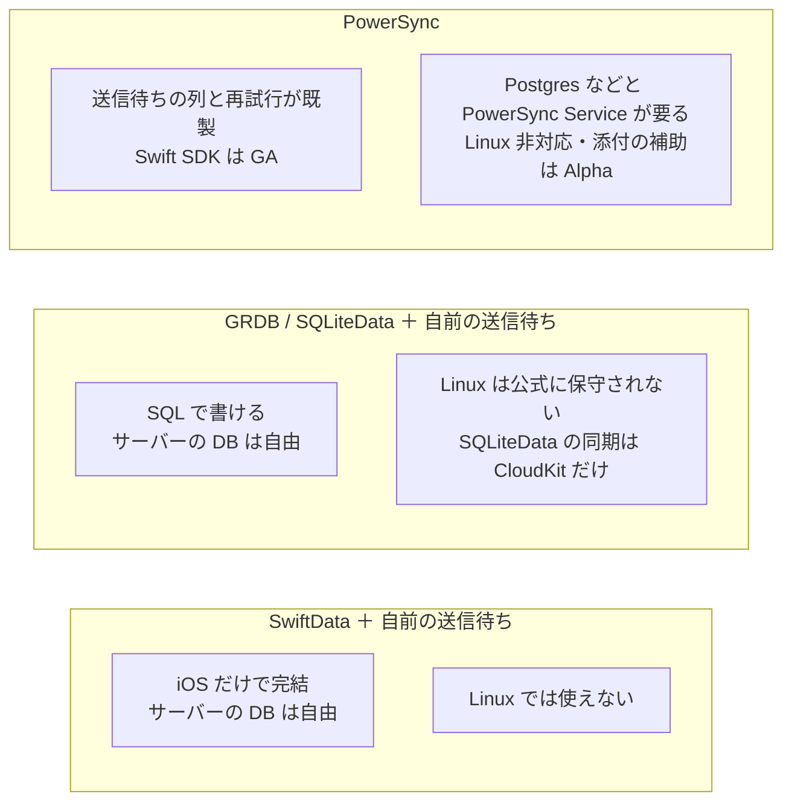
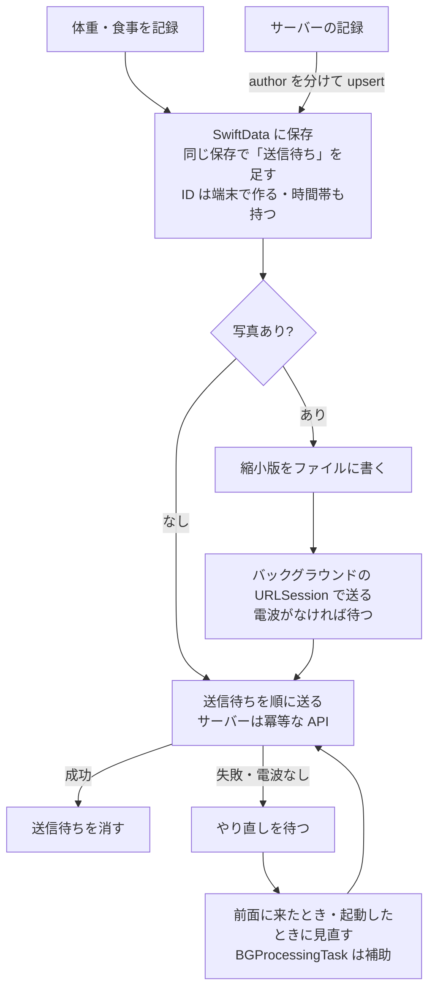

# 端末のキャッシュを何で持ち、どうサーバーと同期するか

調査日: 2026-09-25
対象: ADR-0008（記録の正本はサーバー、端末はキャッシュ）のもとで、電波がないときも体重と食事（写真）を記録し、あとでサーバーへ送る仕組みの土台を選ぶための事実集め

> **確認の方法と限界**
> - Apple の開発者向けドキュメントとリリースノートは、HTML が JavaScript で組み立てられるため、同じ内容の JSON（`https://developer.apple.com/tutorials/data/documentation/<パス>.json`）を取得して**本文を直接読んだ**。出典にはふつうの URL を書く。API ごとの対応 OS（「iOS 27.0 から」など）は、この JSON の対応プラットフォームの欄で確かめた。
> - WWDC のセッションは、developer.apple.com/videos のページにある文字起こしを読んだ（WWDC23「Dive deeper into SwiftData」、WWDC24「What's new in SwiftData」「Track model changes with SwiftData history」「Create a custom data store with SwiftData」、WWDC25「SwiftData: Dive into inheritance and schema migration」「Finish tasks in the background」、WWDC26「What's new in SwiftData」「SwiftData Group Lab」）。
> - GRDB.swift、SQLiteData、PowerSync Swift SDK は GitHub のリポジトリを clone して、README、CHANGELOG、`Package.swift`、CI の設定、ドキュメントの原稿（`.docc`）を読んだ。最新版はタグ（`git ls-remote`）とタグのコミット日で確かめた。GitHub の API はこの環境から使えなかった。
> - PowerSync は公式ドキュメント（docs.powersync.com、Markdown 版）と料金ページ（powersync.com/pricing）、Supabase は supabase-swift の README と料金ページ（supabase.com/pricing）、Electric は公式ドキュメント（electric-sql.com、Markdown 版）、Couchbase Lite は公式ドキュメント（docs.couchbase.com）を読んだ。Couchbase の料金ページは 403 で読めなかった。
> - 本文で確かめた主張は「本文で確認」と書き、要になるところは短い英語の原文を添える。
> - 本文の記述から推し量ったものは「本文からの読み取り」と書き、何から読み取ったかを添える。
> - 本文を探しても記述が無かったものは「本文を探したが記述なし」と書き、探したページを添える。
> - 実機での確認、Linux（swift:6.4 コンテナ）でのビルド、性能の計測はしていない。この環境には Swift が無く、Docker のデーモンも動いていなかった。二次情報（ブログ、記事、SNS）は使っていない。Point-Free のブログは SQLiteData の作者自身の発表なので、SQLiteData についての一次情報として扱った。
> - 開発者の健康データは使っていない。

## 結論の要約

- **SwiftData は、端末のキャッシュとして必要な機能を iOS 26・27 でほぼそろえた。** 一意の値がぶつかると上書きする（upsert）、変更の履歴を取り出せる、iOS 27 からは履歴に新しい変更が入ったことを知らせる `HistoryObserver` がある。WWDC26 は `HistoryObserver` を「外部のサーバーと同期する」用途の例で紹介している（本文で確認）。**ただし Linux では使えない**（対応 OS は Apple のものだけで、既定のストアは Core Data の上に作られている。本文で確認）。Linux でテストするロジックは、SwiftData の型に触れない値型に分ける必要がある。
- **GRDB.swift（7.11.1）と SQLiteData（1.12.0）は、どちらも独自サーバーとの同期の仕組みを持たない。** SQLiteData の同期は CloudKit 専用（本文で確認）。GRDB の Linux 対応は「貢献者が提供し、自動テストしておらず、公式には保守していない」と README に書かれている。SQLiteData の CI の Linux ジョブは「GRDB 7.6.1 が Linux でビルドできない」という注記つきで止めてある（本文で確認）。
- **独自サーバーと同期する既製品で、Swift の SDK が GA なのは PowerSync だけだった**（Swift SDK は GA、GRDB 連携と写真などの添付の補助は Alpha。本文で確認）。サーバー側には Postgres・MongoDB（GA）か MySQL・SQL Server（Beta）が要り、PowerSync Service（クラウドか自前の Docker）を別に動かす。端末で書いた変更は順番どおりの送信待ちの列（upload queue）に入り、それをサーバーの API に送る関数は自分で書く。競合の扱いは自分のサーバーが決める（本文で確認）。Supabase の Swift SDK にはオフラインで書く仕組みが無く、Electric には公式の Swift クライアントが無い。Couchbase Lite は Sync Gateway と Couchbase Server が要る（本文で確認）。
- **写真のアップロードは、バックグラウンドの URLSession が本筋。** アプリが裏に回っても、システムに終了させられても、別のプロセスで転送を続ける。ただし**ユーザーが App スイッチャーでアプリを終了すると、転送はすべて取り消され、次にユーザーがアプリを開くまで再開しない**（本文で確認）。iOS 26 の `BGContinuedProcessingTask` はユーザーの操作から始める長い処理のためのもので、Apple は WWDC25 で「写真の同期（photo syncing）のような自動の処理には使わない」と言っている（本文で確認）。
- **HealthKit の日ごとの集計は、アプリが渡す「起点の時刻（anchorDate）」と「区切りの長さ（DateComponents）」で切る。** どの暦・時間帯で区切りを進めるかは、ドキュメントに書かれていない（本文を探したが記述なし）。`HKMetadataKeyTimeZone` は「記録を作ったときのユーザーの時間帯」を持つメタデータで、HealthKit がこれを使って日を区切るとは書かれていない（本文で確認・記述なし）。日の区切りはアプリ（nu-tori ではサーバー）が、記録ごとに持たせた時間帯から決める必要がある。
- **おすすめ**（末尾に詳しく）: SwiftData をキャッシュにし、同期は既製品を使わずに自分で書く。記録を保存するのと同じ保存で「送信待ち」の行を足し、送信とやり直しの判断は Linux でテストできる値型のロジックに置く。写真は縮小版をファイルに書いてから、バックグラウンドの URLSession で送る。記録には時間帯を持たせる。最低対応版を iOS 27 にすると、`HistoryObserver` と `ResultsObserver` が使える。

## 問い1: SwiftData（iOS 26・27 時点）

### 一意制約と upsert

| 項目 | 所見 | 確度 | 出典 |
|---|---|---|---|
| `@Attribute(.unique)` | iOS 17 から。「同じ型のすべてのモデルで、その値が一意であることを保証する」 | 本文で確認 | https://developer.apple.com/documentation/swiftdata/schema/attribute/option/unique |
| upsert の振る舞い | Apple のサンプル「Maintaining a local copy of server data」: サーバーの地震データを `@Attribute(.unique) var code` を持つモデルに `insert` するだけで、保存のときに同じ `code` があれば**既存の行の他の値を上書きし**、なければ追加する。「サーバーが常に正本（The server is always the source of truth）」で、端末からは書き戻さない読み取り専用のキャッシュを前提にしたサンプル | 本文で確認 | https://developer.apple.com/documentation/swiftdata/maintaining-a-local-copy-of-server-data |
| `#Unique` | iOS 18 から。複数の属性の組で一意にできる（例: `#Unique<Person>([\.id], [\.givenName, \.familyName])`）。関連（relationship）への一意制約は、配列ではなく1つのモデルを指す関連だけ | 本文で確認 | https://developer.apple.com/documentation/swiftdata/unique(_:) |
| `#Unique` の衝突時 | WWDC24: 「同じ一意の値を持つ2つのインスタンスがあると、SwiftData は既存のモデルとの衝突で upsert する（will perform an upsert on collision）」 | 本文で確認 | https://developer.apple.com/videos/play/wwdc2024/10137/ |
| 上書きの細かい規則 | upsert で「新しいインスタンスに値が無い属性」や関連がどう扱われるか、上書きを拒む（衝突をエラーにする）選択肢があるかは、ドキュメントにもセッションにも書かれていない | 本文を探したが記述なし（`Unique(_:)`、`Attribute.Option.unique`、上のサンプル、WWDC24） | — |
| CloudKit との関係 | CloudKit 同期を使うと一意制約は使えない（CloudKit が強制できないため） | 本文で確認 | https://developer.apple.com/documentation/swiftdata/syncing-model-data-across-a-persons-devices |

### バックグラウンドでの書き込みと Swift 6 の厳格な並行性

| 項目 | 所見 | 確度 | 出典 |
|---|---|---|---|
| `ModelActor` | iOS 17 から。`protocol ModelActor : Actor`。`@ModelActor` マクロを actor に付けると `modelContainer`・`modelExecutor`・`init` が生成される。実行器は `DefaultSerialModelExecutor`（「隔離されたモデルコンテキストで、ストレージの仕事を安全に行う」） | 本文で確認 | https://developer.apple.com/documentation/swiftdata/modelactor 、https://developer.apple.com/documentation/swiftdata/modelactor() 、https://developer.apple.com/documentation/swiftdata/defaultserialmodelexecutor |
| 何が Sendable か | `ModelContainer` は `Sendable`。`PersistentIdentifier` は `Sendable`・`Codable`。`ModelContext` と `PersistentModel`（`@Model` のクラス）は `Sendable` ではない（適合の一覧に無い） | 本文で確認（各ページの「Conforms To」） | https://developer.apple.com/documentation/swiftdata/modelcontainer 、https://developer.apple.com/documentation/swiftdata/persistentidentifier 、https://developer.apple.com/documentation/swiftdata/modelcontext 、https://developer.apple.com/documentation/swiftdata/persistentmodel |
| そこから言えること | actor の境界をまたいで渡せるのはコンテナと ID だけで、モデルのインスタンスは渡せない。バックグラウンドの actor にはコンテナを渡し、受け取った側で ID から取り直すか、値型に写して渡す | 本文からの読み取り（上の適合の一覧から） | — |
| 環境のコンテキスト | SwiftUI の環境に入るコンテキストは main actor に結び付き、自動保存が有効。手で作ったコンテキストは自動保存が無効 | 本文で確認 | https://developer.apple.com/documentation/swiftdata/modelcontext 、https://developer.apple.com/videos/play/wwdc2023/10196/ |
| Swift 6 での書き方の公式の指針 | `ModelActor` のページには説明文が無く、Swift 6 の言語モードでの使い方の指針も見つからなかった | 本文を探したが記述なし（`ModelActor`、`ModelActor()`、`ConcurrencySupport`、WWDC23〜26 の SwiftData のセッション） | — |
| 既知の不具合（iOS 27 で修正） | 「バックグラウンドの actor で ModelContext を保存しながら、ModelActor に新しい非同期タスクを積むと、@Query がデッドロックすることがある」が iOS 27 で修正済み。iOS 26 ではこの不具合がありうる | 前半は本文で確認、後半は本文からの読み取り | https://developer.apple.com/documentation/ios-ipados-release-notes/ios-ipados-27-release-notes |
| SwiftUI の外での観測 | iOS 27 から `ResultsObserver`。`@Query` と同じく取得して変更を見張り、SwiftUI の View の外（`@Observable` として）で使える。同じコンテキストの変更、同じコンテナの他のコンテキストの変更、他のプロセスや CloudKit からの変更に反応する | 本文で確認 | https://developer.apple.com/documentation/swiftdata/resultsobserver 、https://developer.apple.com/videos/play/wwdc2026/274/ |

### 履歴の追跡（変更の取り出し）

| 項目 | 所見 | 確度 | 出典 |
|---|---|---|---|
| 仕組み | iOS 18 から（SwiftData History）。保存ごとに「取引（transaction）」が記録され、中に挿入・更新・削除が時系列で入る。`ModelContext.fetchHistory(_:)` に `HistoryDescriptor` を渡して取り出す。トークンは `Codable`・`Comparable` で、前回のトークンより新しいものだけを取れる | 本文で確認 | https://developer.apple.com/documentation/swiftdata/fetching-and-filtering-time-based-model-changes 、https://developer.apple.com/documentation/swiftdata/historydescriptor |
| 同期に使えるか | WWDC24: 履歴は「サーバーとの同期」に使える。「オフラインの間に起きた変更の時系列の記録を持ち、あとでリモートのサーバーと効率よく同期する」と例に挙げている | 本文で確認 | https://developer.apple.com/videos/play/wwdc2024/10075/ |
| 誰が書いたか（author） | コンテキストに `author` を設定すると取引に残り、述語で絞れる。WWDC26 の例は、`authors` に "App" を渡して「サーバーから来た変更をサーバーに送り返さない」ようにしている | 本文で確認 | https://developer.apple.com/documentation/swiftdata/fetching-and-filtering-time-based-model-changes 、https://developer.apple.com/videos/play/wwdc2026/274/ |
| 削除の扱い | 削除されたモデルの値は消える。`@Attribute(.preserveValueOnDeletion)` を付けた属性だけが墓標（tombstone）に残る。`persistentModelID` は端末のストアの中でしか意味がないので、端末をまたいで識別するには別の属性を残すよう書かれている | 本文で確認 | https://developer.apple.com/documentation/swiftdata/fetching-and-filtering-time-based-model-changes |
| 片付け | 履歴はディスクを使うので、処理したら `deleteHistory(_:)` で消す。消した取引を取りにいくと `historyTokenExpired` のエラーになる | 本文で確認 | 同上 |
| iOS 26 の追加 | `HistoryDescriptor(predicate:sortBy:)` が iOS 26 から。WWDC25: 新しい順に並べて `fetchLimit` 1 で最新のトークンだけを取れる | 本文で確認 | https://developer.apple.com/documentation/swiftdata/historydescriptor/init(predicate:sortby:) 、https://developer.apple.com/videos/play/wwdc2025/291/ |
| iOS 27 の追加 | `HistoryObserver`（iOS 27 から）。`remoteChange` の通知を聞き、指定したモデルと author に関係する新しい取引があると `eventCounter` を増やす。WWDC26: 「外部のサーバーのような他のシステムと、ストアの一部を同期させておくときに役立つ」。`eventCounter` を見張り、増えたら `fetchHistory` で変更を取ってサーバーに送る例を示している | 本文で確認 | https://developer.apple.com/documentation/swiftdata/historyobserver 、https://developer.apple.com/videos/play/wwdc2026/274/ |
| 送信の成否や再試行 | 履歴は「何が変わったか」だけを持つ。送れたかどうか、何回失敗したかは持たないので、それは別に記録する必要がある | 本文からの読み取り（`HistoryTransaction` の説明と WWDC26 の例が、送信の成否を扱っていないことから） | — |

### スキーマの移行

| 項目 | 所見 | 確度 | 出典 |
|---|---|---|---|
| 自動の移行 | コンテナはスキーマの変化に合わせて自動で移行する。自動でできない変化には `SchemaMigrationPlan` を渡す | 本文で確認 | https://developer.apple.com/documentation/swiftdata/modelcontainer |
| 移行の段 | `VersionedSchema` で版を定義し、`MigrationStage` は `.lightweight(fromVersion:toVersion:)` と `.custom(fromVersion:toVersion:willMigrate:didMigrate:)` の2種類 | 本文で確認 | https://developer.apple.com/documentation/swiftdata/migrationstage |
| 一意制約を後から足すとき | WWDC25 の例: 一意制約を足す版の移行で、`willMigrate` で既存の重複を消す custom の段を入れている | 本文で確認 | https://developer.apple.com/videos/play/wwdc2025/291/ |
| 戻す移行 | `SwiftDataError.backwardMigration` がある（新しい版のストアを古いアプリで開くとき） | 本文で確認（エラーの名前のみ。条件の説明は無い） | https://developer.apple.com/documentation/swiftdata/swiftdataerror |
| iOS 27 の `.codable` | 属性を `.codable` にすると、型の Codable の表現をそのまま保存する。中身は述語でも並べ替えでも使えず、型の形が変わっても移行は起きない。WWDC26 は「自分で定義する型には使わない」「他のフレームワークの型のための逃げ道」と言っている | 本文で確認 | https://developer.apple.com/documentation/swiftdata/schema/attribute/option/codable 、https://developer.apple.com/videos/play/wwdc2026/274/ |

### カスタム DataStore

| 項目 | 所見 | 確度 | 出典 |
|---|---|---|---|
| 何ができるか | iOS 18 から `DataStore` プロトコル。SwiftData の `@Model` と `@Query` をそのまま使い、保存先だけを自分の実装（JSON ファイル、別の DB など）に差し替えられる。ストアは `fetch` と `save` を実装し、コンテキストとは Sendable・Codable なスナップショットでやりとりする。述語と並べ替えをストアで処理しきれないときは、コンテキストにメモリ上で処理させられる | 本文で確認 | https://developer.apple.com/documentation/swiftdata/datastore 、https://developer.apple.com/videos/play/wwdc2024/10138/ |
| 既定のストアとの差 | 履歴は `HistoryProviding`、一括削除は `DataStoreBatching` の別プロトコルで、既定のストア（`DefaultStore`）はどちらにも適合する。WWDC24: 既定のストアは「移行、履歴、CloudKit 同期」をすべて支える | 本文で確認 | https://developer.apple.com/documentation/swiftdata/defaultstore 、https://developer.apple.com/videos/play/wwdc2024/10138/ |
| 同期の土台になるか | サンプルは「ファイル全体を読み書きする」単純なストアで、ネットワークの向こうを正本にするストアの例や指針は無い。オフラインで書いて後で送るなら、ストアの中に送信待ちと失敗の扱いを自分で持つことになる | 前半は本文で確認、後半は本文からの読み取り | https://developer.apple.com/videos/play/wwdc2024/10138/ |

### Linux でビルドできるか

| 項目 | 所見 | 確度 | 出典 |
|---|---|---|---|
| 対応 OS | SwiftData の対応 OS は iOS・iPadOS・Mac Catalyst・macOS・tvOS・visionOS・watchOS だけ | 本文で確認 | https://developer.apple.com/documentation/swiftdata |
| 中身 | `DefaultStore` は「Core Data を下のストレージに使うデータストア（A data store that uses Core Data as its undelying storage mechanism）」 | 本文で確認 | https://developer.apple.com/documentation/swiftdata/defaultstore |
| 結論 | Linux の swift:6.4 では `import SwiftData` できない。Linux でテストするロジック（送信待ちの状態の進め方、やり直しの判断、日付と時間帯の計算など）は、SwiftData の型に触れない値型とプロトコルに分け、SwiftData に写す層はアプリ側（Apple のプラットフォームだけでビルドする側）に置く必要がある | 本文からの読み取り（上の2つから。実際に Linux でビルドを試してはいない） | — |

### Apple が公式に書いている制約（上のほかに）

- CloudKit 同期を使うと、一意制約・関連の必須（非オプショナル）・`deny` の削除規則が使えない（https://developer.apple.com/documentation/swiftdata/syncing-model-data-across-a-persons-devices 、本文で確認）。nu-tori は CloudKit を使わない（ADR-0008）ので当てはまらない。
- iOS 26 のリリースノートに SwiftData の項は無い。iOS 27 のリリースノートの SwiftData の項は上のデッドロックの修正だけ。Xcode 26・27 のリリースノートには SwiftData の記述が無い（https://developer.apple.com/documentation/ios-ipados-release-notes 、https://developer.apple.com/documentation/xcode-release-notes 、本文で確認）。
- iOS 26 の Core Data の修正: `NSManagedObject` を `NS_SWIFT_NONSENDABLE`、`NSManagedObjectContext` を `NS_SWIFT_SENDABLE` にし、`perform` 系に Sendable なクロージャを求めるよう変えた。既存のコードに新しい警告が出ることがある（iOS 26 リリースノート、本文で確認）。SwiftData を直接使う限りは関係しないと考えられる（本文からの読み取り）。

## 問い2: GRDB.swift と SQLiteData（旧 SharingGRDB）

| 項目 | GRDB.swift | SQLiteData | 確度 | 出典 |
|---|---|---|---|---|
| 現行版 | 7.11.1（2026-06-18）。7.11.0（2026-06-01）で「WITHOUT ROWID の表での upsert を修正」、7.10.0（2026-02-15）で「Linux の調整」「Android と Windows の調整」「upsert で全列を更新するか、どの列も更新しないかを選べるように」 | 1.12.0（タグのコミットは 2026-08-31）。main の最新コミットは 2026-09-14 | 本文で確認 | GRDB の `CHANGELOG.md`、両リポジトリのタグ |
| 名前の経緯 | — | 最初は SharingGRDB の名前で公開し、CloudKit 同期を足して 1.0 で SQLiteData に改名 | 本文で確認 | https://www.pointfree.co/blog/posts/184-sqlitedata-1-0-an-alternative-to-swiftdata-with-cloudkit-sync-and-sharing |
| 要件 | iOS 13 以上、SQLite 3.20.0 以上、Swift 6.1 以上・Xcode 16.3 以上。upsert は SQLite 3.35.0 以上（iOS 15 以上） | iOS 16 以上。`swift-tools-version: 6.4`（6.0・6.1 用の `Package.swift` も同梱）。GRDB 7.6.0 以上に依存 | 本文で確認 | GRDB の `README.md`・`Package.swift`、SQLiteData の `Package.swift` |
| Swift 6 | GRDB 7 は Swift 6 のコンパイラが要る。strict concurrency や Swift 6 の言語モードで警告やエラーが出うるとして、専用の指針（Swift Concurrency and GRDB）を用意している。`Record` のサブクラスは struct に書き換えるよう勧めている | — | 本文で確認 | GRDB の `Documentation/GRDB7MigrationGuide.md` |
| SwiftUI での観測 | `ValueObservation` で問い合わせの結果の変化を見張る。SwiftUI 用には別パッケージ GRDBQuery を案内 | `@FetchAll`・`@FetchOne`・`@Fetch`（SwiftData の `@Query` に似た書き方）。SwiftUI の View だけでなく `@Observable` のモデルや UIKit でも使える | 本文で確認 | GRDB の `README.md`、SQLiteData の `README.md`・`Documentation.docc/Articles/Observing.md` |
| 移行 | `DatabaseMigrator` に名前つきの移行を登録して順に当てる。開発中は `eraseDatabaseOnSchemaChange` でスキーマが変わったら作り直せる | GRDB の `DatabaseMigrator` をそのまま使う | 本文で確認 | GRDB の `GRDB/Migration/DatabaseMigrator.swift`、SQLiteData の `Documentation.docc/Articles/PreparingDatabase.md` |
| Linux | README: 「Linux 対応は貢献者が提供している。自動でテストしておらず、公式には保守していない（Linux support is provided by contributors. It is not automatically tested, and not officially maintained.）」。CI（`.github/workflows/CI.yml`）に Linux のジョブは無い。`Package.swift` には Linux 向けの分岐（WAL スナップショットを切る）がある | CI の Linux ジョブはコメントアウトされ、「GRDB 7.6.1 は今 Linux でビルドできない（NB: GRDB 7.6.1 does not currently build on Linux.）」と注記。`Package.swift` の対応プラットフォームに Linux は無い。CloudKit 同期のコードは `canImport(CloudKit)` で囲まれている | 本文で確認 | GRDB の `README.md`・`CI.yml`・`Package.swift`、SQLiteData の `.github/workflows/ci.yml`・`Package.swift`・`Sources/SQLiteData/CloudKit/` |
| 現行版が Linux でビルドできるか | 7.10.0 で Linux の調整が入ったので、7.6.1 の問題は直っている可能性があるが、確かめていない | 同上 | 本文からの読み取り（Linux でビルドを試していない） | — |
| CloudKit 以外のサーバーとの同期 | 仕組みは持たない。README は JSON の中身と表を突き合わせる別パッケージ（groue/SortedDifference）を案内するだけ。変更を知る手段として `TransactionObserver` がある（7.11.0 で変更の絞り込みを切る選択肢が入った） | 持たない。同期は `SyncEngine`（CloudKit 専用）だけ。競合は「列ごとに最後の編集が勝つ」で、変えられない | 本文で確認 | GRDB の `README.md`・`CHANGELOG.md`、SQLiteData の `Documentation.docc/Articles/CloudKitSync.md` |

## 問い3: 独自サーバーと同期する既製の仕組み（Swift の SDK があるもの）

### PowerSync

| 項目 | 所見 | 確度 | 出典 |
|---|---|---|---|
| Swift SDK の成熟度 | 機能の状態の一覧で **Swift SDK は GA**。GRDB 連携（PowerSyncGRDB）は Alpha、Swift の添付（写真などのファイル）の補助は Alpha | 本文で確認 | https://docs.powersync.com/resources/feature-status.md |
| 現行版 | 1.16.2。1.14.0 で内部の Kotlin SDK への依存を外し、Swift で書き直した（「接続プールの全面的な書き直しなので、上げたら問い合わせを試すこと」） | 本文で確認 | powersync-swift の `CHANGELOG.md`、タグ |
| 対応 OS | iOS 15.0 以上、macOS 12 以上、watchOS 9 以上、tvOS 15 以上。Mac Catalyst と visionOS は非対応。**Linux・Windows は非対応**（「PowerSync をリンクするよい方法が無い」） | 本文で確認 | https://docs.powersync.com/resources/supported-platforms.md 、powersync-swift の `Package.swift` |
| 中身 | 端末は SQLite。GRDB 7.11.0 以上と、自前の SQLite のパッケージ（CSQLite 3.51.2）に依存 | 本文で確認 | powersync-swift の `Package.swift` |
| サーバー側に要るもの | 正本の DB（Postgres と MongoDB は GA、MySQL と SQL Server は Beta、Convex は Experimental）と、そこから複製を受けて端末に配る PowerSync Service。Service はクラウド（PowerSync Cloud）か、自前で Docker（Open Edition）で動かす | 本文で確認 | https://docs.powersync.com/resources/feature-status.md 、https://docs.powersync.com/intro/self-hosting.md |
| 端末からサーバーへの書き込み | 端末の SQLite に書くと即座に反映され、**送信待ちの列（upload queue）**に自動で入る。列は順番どおりで、前が済むまで次へ進まない（blocking FIFO）。SDK が自分で定義した `uploadData()` を呼び、その中で**自分のサーバーの API**を呼んで正本の DB に書く。ネットワークの失敗やオフラインでの失敗は SDK が自動で再試行する | 本文で確認 | https://docs.powersync.com/architecture/client-architecture.md |
| サーバー側の書き方 | 自分のバックエンド（Node.js などの例あり）が API を持つ。認証は JWT を返す `fetchCredentials()` を端末側に書く | 本文で確認 | https://docs.powersync.com/configuration/app-backend/setup.md |
| 競合の扱い | PowerSync は競合の扱いに意見を持たず、自分のサーバーが決める。列に入る操作は PUT（作成）・PATCH（変わった列だけ）・DELETE。**同じ操作が複数回届くことがあるので、サーバーは冪等に作る**（端末ごとに増える操作 ID で重複を除ける）。単純に作ると列ごとの後勝ち。推奨は「削除が常に勝つ」「同時の更新は、サーバーが受け取った順で列ごとに後勝ち」 | 本文で確認 | https://docs.powersync.com/handling-writes/handling-update-conflicts.md |
| 料金（PowerSync Cloud） | Free: 0 ドル、同期 2GB/月、保管 500MB、同時接続 50、**1週間使わないと停止**。Pro: 49 ドル/月から、同期 30GB・保管 10GB・同時接続 1,000 を含む。Team: 599 ドル/月から | 本文で確認 | https://www.powersync.com/pricing |
| 料金（自前） | Open Edition は無料で自前で動かす。ライセンスは FSL-1.1-ALv2（Functional Source License。将来 Apache 2.0 になる） | 本文で確認 | https://www.powersync.com/pricing 、https://github.com/powersync-ja/powersync-service の `LICENSE` |

### Supabase・Electric・Couchbase Lite

| 項目 | 所見 | 確度 | 出典 |
|---|---|---|---|
| Supabase の Swift SDK | 2.55.2。Auth・PostgREST・Realtime・Storage・Functions のクライアント。iOS 16 以上。Linux は「動くが公式には対応しない」 | 本文で確認 | supabase-swift の `README.md`、タグ |
| Supabase のオフライン | README にオフラインでの書き込みや送信待ちの仕組みの記述は無い。サーバーは Supabase（Postgres）に決まる | 本文を探したが記述なし（`README.md`） | — |
| Supabase の料金 | Free: DB 500MB、ファイル 1GB、転送 5GB、MAU 5 万、**1週間使わないと停止**、最大2プロジェクト。Pro: 25 ドル/月 | 本文で確認 | https://supabase.com/pricing |
| Electric | Postgres から端末へ読み出す向き（read-path）だけを同期し、「書き込み向きの同期はしない（Electric does not do write-path sync）」。公式のクライアントは TypeScript と Elixir だけで、Swift は無い（HTTP と JSON を話せれば自分でクライアントを書ける、という指針はある） | 本文で確認 | https://electric-sql.com/docs/sync/guides/writes.md 、https://electric-sql.com/llms.txt |
| Couchbase Lite（Swift） | 4.1.2（2026-09）。iOS 15 以上。同期は Sync Gateway を相手にするレプリケーターで、その先は Couchbase Server のバケット。競合は「リビジョンの多い方が勝つ（レプリケーション時）」「後勝ち（端末で保存時）」、どちらも削除が勝つ。独自の解決も書ける | 本文で確認 | https://docs.couchbase.com/couchbase-lite/current/swift/releasenotes.html 、https://docs.couchbase.com/couchbase-lite/current/swift/supported-os.html 、https://docs.couchbase.com/couchbase-lite/current/swift/replication.html 、https://docs.couchbase.com/couchbase-lite/current/swift/conflict.html |
| Couchbase の料金 | 料金ページが 403 で読めなかった | 未確認 | — |
| 参考: Realm（Atlas Device Sync） | MongoDB は Device Sync を 2025-09-30 で終了させた。移行先として Ditto、PowerSync、ObjectBox、AWS AppSync などを挙げている | 本文で確認 | https://www.mongodb.com/docs/atlas/app-services/sync/device-sync-deprecation/ |

## 問い4: アプリが裏に回ったり終了したりしても写真のアップロードを続ける

| 項目 | 所見 | 確度 | 出典 |
|---|---|---|---|
| バックグラウンドの URLSession | `URLSessionConfiguration.background(withIdentifier:)` で作ったセッションは、転送を**別のプロセスでシステムに任せる**。iOS では、アプリが一時停止しても終了しても転送を続ける | 本文で確認 | https://developer.apple.com/documentation/foundation/urlsessionconfiguration/background(withidentifier:) |
| システムに終了させられたとき | 同じ identifier でセッションを作り直せば、終了時に進んでいた転送の状態を受け取れる。転送が終わるとシステムがアプリを起こし、`application(_:handleEventsForBackgroundURLSession:completionHandler:)` を呼ぶ（`sessionSendsLaunchEvents` が true のとき。既定で true） | 本文で確認 | 同上、https://developer.apple.com/documentation/foundation/downloading-files-in-the-background |
| **ユーザーが終了したとき** | 「ユーザーが App スイッチャーからアプリを終了すると、システムはセッションのバックグラウンドの転送をすべて取り消す。ユーザーが強制終了したアプリをシステムは自動で起動しない。転送を再開するには、ユーザーが自分でアプリを起動し直す必要がある」 | 本文で確認 | https://developer.apple.com/documentation/foundation/urlsessionconfiguration/background(withidentifier:) |
| ファイルから送る | 「iOS では、バックグラウンドのセッションでファイルのアップロードタスクを作ると、システムはそのファイルを一時の場所に写し、そこから送る」。`Data` やストリームからのアップロードがバックグラウンドのセッションで使えないという記述は、現行のドキュメントには見つからなかった | 前半は本文で確認、後半は本文を探したが記述なし（`URLSessionUploadTask`、`uploadTask(with:from:)`、`uploadTask(withStreamedRequest:)`、`URLSession`、`URLSessionConfiguration`） | https://developer.apple.com/documentation/foundation/urlsessionuploadtask |
| 電波がないとき | バックグラウンドのセッションは `waitsForConnectivity` を無視し、**常につながるのを待つ** | 本文で確認 | https://developer.apple.com/documentation/foundation/urlsessionconfiguration/waitsforconnectivity |
| いつ送るか | 裏に回ってから始めた転送は、システムが都合のよいときに始める（`isDiscretionary` が true とみなされる）。前面で始めた転送は `isDiscretionary` の値に従う（既定は false）。大きなファイルは Wi-Fi と充電を待つことがある | 本文で確認 | https://developer.apple.com/documentation/foundation/urlsessionconfiguration/isdiscretionary |
| 送る量を伝える | `countOfBytesClientExpectsToSend` などでおおよその上限を伝えることが「強く勧められる」 | 本文で確認 | https://developer.apple.com/documentation/foundation/urlsessiontask/countofbytesclientexpectstosend |
| `beginBackgroundTask` | 裏に回ったときに「メッセージを送り終える」「ファイルの保存を終える」ための限られた時間をもらう。時間のかかるアップロードやダウンロードには URLSession を使うよう書かれている | 本文で確認 | https://developer.apple.com/documentation/backgroundtasks/choosing-background-strategies-for-your-app |
| `BGAppRefreshTask` | システムが時刻を決めて起こし、最大 30 秒 | 本文で確認 | 同上 |
| `BGProcessingTask` | 数分かかる処理向け。システムが時刻を決める（夜間の充電中など）。`requiresNetworkConnectivity` でネットワークが要ると伝えられる。Info.plist の `BGTaskSchedulerPermittedIdentifiers` に識別子を登録し、Background Modes の「Background processing」を有効にする | 本文で確認 | 同上、https://developer.apple.com/documentation/uikit/using-background-tasks-to-update-your-app 、https://developer.apple.com/documentation/backgroundtasks/bgprocessingtaskrequest/requiresnetworkconnectivity |
| `BGContinuedProcessingTask`（iOS 26 から） | **前面で、ユーザーの操作（ボタンを押すなど）に応えて始める**長い処理を、裏に回っても続けさせる。進み具合は Live Activity に出て、ユーザーが取り消せる。進み具合を報告し続ける必要があり、進んでいないタスクから先に打ち切られる。ネットワークも使える。すぐ始められないときに並ばせるか（既定）失敗させるかを選べる | 本文で確認 | https://developer.apple.com/documentation/backgroundtasks/bgcontinuedprocessingtask 、https://developer.apple.com/documentation/backgroundtasks/performing-long-running-tasks-on-ios-and-ipados 、https://developer.apple.com/documentation/backgroundtasks/bgcontinuedprocessingtaskrequest |
| `BGContinuedProcessingTask` とユーザーの終了 | 「App スイッチャーでアプリを閉じると、走っているタスクはすべて取り消され、アプリにはその知らせも来ない」 | 本文で確認 | https://developer.apple.com/documentation/backgroundtasks/performing-long-running-tasks-on-ios-and-ipados |
| 写真の送信に向くか | WWDC25: 「ユーザーは、前に設定をしていても、タスクが自動で始まるとは思っていない。保守、バックアップ、**写真の同期（photo syncing）**のような自動の処理は避ける。はっきりした操作なしに始めると、タスクが取り消されることがある」。一方で例に「SNS への投稿を公開する」「写真のアップロードの一式のサムネイルを作る」を挙げている | 本文で確認 | https://developer.apple.com/videos/play/wwdc2025/227/ 、https://developer.apple.com/documentation/backgroundtasks/performing-long-running-tasks-on-ios-and-ipados |
| そこから言えること | 食事を撮って「記録する」を押した直後の1枚の送信は「ユーザーの操作から始まる、終わりのはっきりした処理」とも言えるが、電波が戻ってからまとめて送るのは「写真の同期」に当たる。後者は `BGContinuedProcessingTask` の対象外。縮小版（長辺 1024px）の1枚は小さいので、進み具合を Live Activity に出すほどの長い処理でもない | 本文からの読み取り（上の2行と ADR-0008 の縮小版の大きさから） | — |

## 問い5: 端末の時間帯が変わったときの HealthKit の1日の合計

| 項目 | 所見 | 確度 | 出典 |
|---|---|---|---|
| 区切り方 | `HKStatisticsCollectionQuery` は、起点の時刻（`anchorDate: Date`）と区切りの長さ（`intervalComponents: DateComponents`）で時間を区切る。「起点は1つの区切りの始まりを決め、他の区切りはそれにそろう。区切りは起点の前後に伸び、どれも同じ長さで、すき間は無い」 | 本文で確認 | https://developer.apple.com/documentation/healthkit/hkstatisticscollectionquery/anchordate 、https://developer.apple.com/documentation/healthkit/hkstatisticscollectionquery/init(quantitytype:quantitysamplepredicate:options:anchordate:intervalcomponents:) |
| 起点の日付は関係ない | 「1日の区切りなら、起点は各区切りが始まる時刻を決める。起点の日付は関係ない。1970年1月1日の午前3:34でも2065年3月15日の午前3:34でも、毎日午前3:34から始まる区切りになる」。Apple の例は `Calendar.current` とその `timeZone` から起点を作っている | 本文で確認 | https://developer.apple.com/documentation/healthkit/executing-statistics-collection-queries |
| どの暦・時間帯で区切りを進めるか | `intervalComponents`（DateComponents）を足していくときに、どの暦と時間帯を使うのか（端末の今の時間帯か、起点を作った時間帯か、UTC か）は書かれていない。夏時間の切り替わりで1日の長さが変わる日の扱いも書かれていない | 本文を探したが記述なし（`HKStatisticsCollectionQuery`、`anchorDate`、`intervalComponents`、`HKStatisticsCollectionQueryDescriptor`、「Executing Statistics Collection Queries」「Executing Statistical Queries」） | — |
| 時間帯が変わったとき | 起点は絶対時刻（`Date`）なので、クエリを作り直さない限り、区切りは起点を作ったときの時間帯の「0時」にそろったままになる。旅先で「その土地の日」で見たいなら、時間帯が変わったら新しい `Calendar.current` で起点を作り直してクエリを作り直す必要がある | 本文からの読み取り（起点が絶対時刻であることと、上の説明から） | — |
| 1日だけの合計 | `HKStatisticsQuery` に「開始と終了の Date」の述語を渡して合計を取る。Apple の例は `Calendar.current` でその日の0時から翌日の0時までを作っている。区切りはアプリが作る絶対時刻なので、どの時間帯の1日かはアプリが決める | 前半は本文で確認、後半は本文からの読み取り | https://developer.apple.com/documentation/healthkit/executing-statistical-queries |
| 出どころごとの合計 | `HKStatisticsOptions` に `separateBySource` がある | 本文で確認（定数の一覧） | https://developer.apple.com/documentation/healthkit/hkstatisticsoptions |
| `HKMetadataKeyTimeZone` | 「HealthKit のオブジェクトを作ったときのユーザーの時間帯」。値は `NSTimeZone` の `timeZoneWithName:` に渡せる文字列（例: `Asia/Tokyo`）。「睡眠のサンプルを分析するときは、時間帯のメタデータを保存しておくことを勧める」 | 本文で確認 | https://developer.apple.com/documentation/healthkit/hkmetadatakeytimezone |
| HealthKit が自分で付けるか・集計に使うか | HealthKit がこのキーを自動で付けるか、統計のクエリがこのキーを見て日を区切るかは書かれていない | 本文を探したが記述なし（`HKMetadataKeyTimeZone`、上の統計のページ） | — |
| そこから言えること | HealthKit から読んだサンプルの「どの日か」は、サンプルに時間帯のメタデータがあればそれを、なければ読む側の決めた時間帯を使って、アプリが決めることになる。nu-tori がヘルスケアに書き込むときは、`HKMetadataKeyTimeZone` を付けておくと、他のアプリも時間帯を知れる | 本文からの読み取り | — |
| iOS 26〜27 の関係する修正 | iOS 26.6: 「安静時心拍数のような離散の量の、時間で重み付けした平均の統計が、サンプルが時間で重なると誤って高くなることがある」を修正。体重や栄養の合計（cumulativeSum）に関する修正は見当たらない | 本文で確認 | https://developer.apple.com/documentation/ios-ipados-release-notes/ios-ipados-26_6-release-notes |

## nu-tori への示唆

選べる形は次の3つ（上で確かめた事実と、そこからの読み取りをまとめたもの）。

1. **同期の相手と中身が狭い。** nu-tori の記録は1人のユーザーのもので、他人と同時に同じ記録を直すことは無い。端末で書く必要があるのは、電波がないときの体重と食事（写真）だけで、計算はサーバーで行う（ADR-0009）。PowerSync のような「DB 全体を双方向に同期する」仕組みは、この範囲に対して大きい。PowerSync を使うとサーバーの DB が Postgres などに決まり、PowerSync Service を別に動かすことになる。サーバーの言語と DB を決める別のチケットに影響する（本文からの読み取り）。
2. **自前の送信待ちの列で足りると考えられる。** PowerSync の文書が書く要点（端末の変更は順番どおりの列に入れる、同じ操作は複数回届くので**サーバーは冪等に作る**、削除が勝ち、更新は後勝ち）は、自前で作るときの設計の指針としてもそのまま使える。ID は端末で作り（UUID）、サーバーは「この ID の記録をこの内容にする」という冪等な API にする。
3. **SwiftData でも GRDB でも、Linux でテストできるのはストアの外側だけ。** SwiftData は Linux で使えない。GRDB は Linux で動く可能性があるが、公式には保守されず、テストもされていない。どちらを選んでも、送信待ちの状態の進め方、やり直しの間隔、日付と時間帯の計算は値型のロジックに分け、ストアへの読み書きはプロトコルの向こうに置く形になる。
4. **SwiftData を選ぶなら iOS 27 を最低対応版にすると楽になる。** `HistoryObserver`（変更を知る）と `ResultsObserver`（SwiftUI の外で結果を見張る）が iOS 27 から。iOS 26 では、@Query と ModelActor のデッドロックの不具合も残る。
5. **履歴だけで送信待ちを表さない。** 履歴は「何が変わったか」しか持たず、送れたか、何回失敗したかを持たない。また消した履歴は取り出せない。記録を保存するのと同じ保存で「送信待ち」の行を足すほうが、状態がはっきりする。サーバーから来た変更は、コンテキストの `author` を分けておけば送り返さずに済む。
6. **写真は二段に分ける。** 撮ったらまず縮小版を端末のファイルに書き、記録と送信待ちを保存する。そのファイルをバックグラウンドの URLSession のアップロードタスク（ファイルから）で送る。電波がないときはつながるのを待ってくれる。ただし**ユーザーがアプリを終了すると転送は取り消される**ので、次にアプリを開いたとき（前面に来たとき）に送信待ちを見直して送り直す処理が要る。`BGProcessingTask` を送り残しの掃除に使うことはできるが、いつ動くかはシステムが決める。
7. **記録には時間帯を持たせる。** ADR-0006 は日を0時で区切るが、「どの時間帯の0時か」は HealthKit の文書からは決まらない。体重記録と食事に、絶対時刻と、記録したときの時間帯（`TimeZone.identifier`）を持たせ、サーバーは記録の時間帯で日を決める。ヘルスケアに書くときは `HKMetadataKeyTimeZone` を付ける。ヘルスケアから日ごとの合計を読むときは、時間帯が変わったら起点を作り直す。

## 未確認の点（まとめ）

本文を探したが記述が無かったもの:
- SwiftData の upsert で、新しいインスタンスに値の無い属性や関連がどう扱われるか。衝突をエラーにする選択肢があるか
- SwiftData を Swift 6 の言語モードで使うときの Apple の指針（`ModelActor` のページに説明文が無い）
- バックグラウンドの URLSession で `Data` やストリームからアップロードできるか（現行のドキュメントには「ファイルからのみ」とは書かれていない）
- `HKStatisticsCollectionQuery` が区切りを進めるときの暦と時間帯、夏時間の日の扱い
- HealthKit が `HKMetadataKeyTimeZone` を自動で付けるか、統計に使うか
- Couchbase の料金

試して確かめる必要があるもの:
- GRDB 7.11.1 が Linux（swift:6.4）でビルドとテストが通るか
- SwiftData の upsert が、サーバーから来た記録と端末で直した記録がぶつかったときにどう振る舞うか（試作で）
- バックグラウンドの URLSession が、ユーザーの終了のあと、次の起動でどう見えるか（取り消しのエラーの理由が `NSURLErrorBackgroundTaskCancelledReasonKey` に入るか）

## おすすめ（決めるのは開発者）

- **ストアは SwiftData。同期は既製品を使わず、送信待ちの列を自分で持つ。** 同期する範囲が狭く、サーバーの DB もまだ決まっていないので、DB と追加のサービスを縛る PowerSync は今は選ばない。サーバーの DB が Postgres に決まり、複数の端末でリアルタイムにそろえる必要が出たら見直す。
- **Linux でテストするロジックは値型に分ける。** 送信待ちの状態の進め方、やり直しの判断、日と時間帯の計算は SwiftData に触れない Swift パッケージに置き、SwiftData への写しはアプリ側に置く（#21 の決定と合う）。GRDB に替えても、Linux の対応が公式に保守されていないので、この分け方は変わらない。
- **最低対応版は iOS 27 が有利。** `HistoryObserver` と `ResultsObserver` が使え、iOS 26 の @Query と ModelActor のデッドロックを避けられる。
- **写真はファイルに書いてからバックグラウンドの URLSession で送る。** `BGContinuedProcessingTask` は「写真の同期」に使わないと Apple が言っているので使わない。ユーザーがアプリを終了すると送信が取り消されるので、起動と前面に来たときの見直しを必ず入れる。
- **記録には時間帯を持たせ、日の区切りはサーバーが記録の時間帯で決める。**
