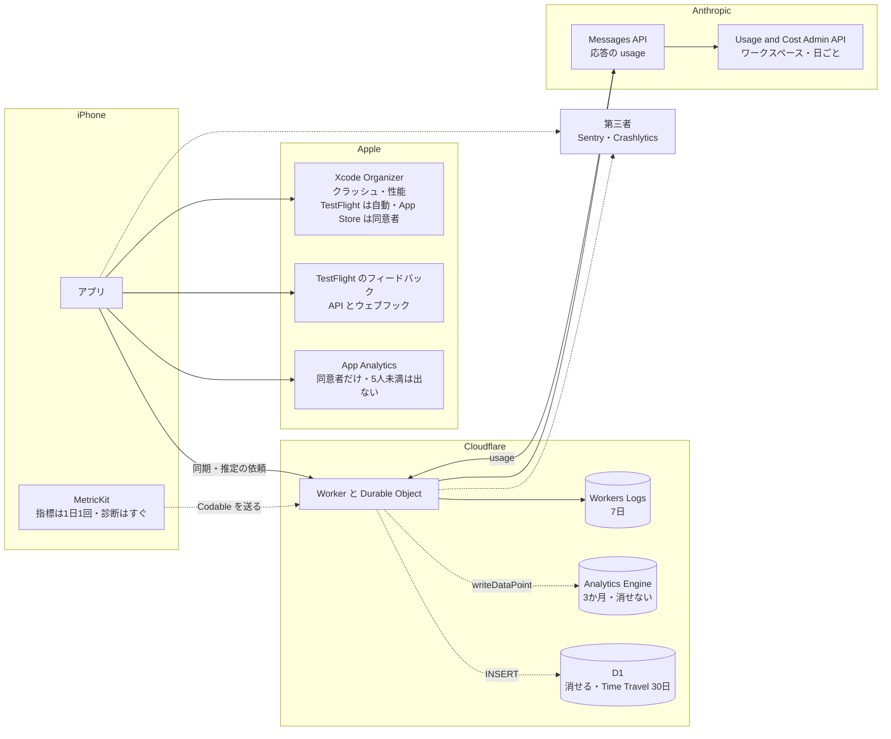

# 出荷後に観測できるものの置き場（Cloudflare・Anthropic・Apple・第三者のクラッシュ収集）

調査日: 2026-09-25
対象: Issue #33「初回出荷時に観測できるもの」。出荷後の運用に要る情報（クラッシュ、サーバーのエラー、AI の呼び出しの失敗率・トークン・費用、同期の失敗、推定精度の手がかり、ユーザーの行動（記録の続き具合など））を、何で、どこに集めるかを決めるための事実を、一次情報で集める。構成の前提は `server/AGENTS.md` と `ios/AGENTS.md`（Workers＋Hono、アカウントごとの Durable Object、D1 にアカウントの索引、R2 に写真、Claude Sonnet 5 を環境ごとのワークスペースで呼ぶ、ヘルスケアから体重・体脂肪率を読む）。

> **確認の方法と限界**
> - Cloudflare（developers.cloudflare.com の `index.md`）、Anthropic（platform.claude.com/docs の `.md` と support.claude.com のヘルプ記事）、Apple（developer.apple.com の開発者向けドキュメントは同じ内容の JSON `https://developer.apple.com/tutorials/data/<パス>.json`、App Store Connect ヘルプ、App Review Guidelines、App privacy details、Apple Developer Program License Agreement（以下 DPLA）の HTML、help.apple.com の Xcode ヘルプ）、Sentry（docs.sentry.io の `.md` と sentry.io/pricing）、Firebase（firebase.google.com）の**本文を直接取得して読んだ**。本文で確かめた主張は「本文で確認」と書く。
> - 本文の記述から推し量ったもの、本文の数字から計算したものは「本文からの読み取り」と書き、何から読み取ったかを添える。
> - 本文や関連ページを探しても記述が無かったものは「本文を探したが記述なし」と書き、探したページを添える。
> - 実アカウントでの設定や計測はしていない。Cloudflare の通知の一覧、Anthropic の Console の画面、App Store Connect の画面は、文書に書かれた範囲でしか確かめていない。
> - **Anthropic のワークスペースの支出の通知は、ヘルプ記事の1文（「Add notification」でメールの通知を設定できる）だけが根拠**で、何通・いつ届くかの記述は無い。
> - **sentry.io/pricing は、HTML から読める範囲（Developer・Team・Business の列）だけ**を根拠にしている。
> - 料金は取得日（2026-09-25）時点のもの。**Cloudflare の Traces と OpenTelemetry の書き出しは、2026-10-01 から課金が始まる**と本文に書かれており、調査日の6日後に変わる。
> - 二次情報（ブログ、まとめ記事、Qiita・Zenn、Stack Overflow）は使っていない。出典の番号は末尾の「出典一覧」。

## 結論の要約

- **Workers Logs は、Worker と Durable Object の `console.log`・例外・呼び出しごとのログ（アラームの呼び出しを含む）を集め、有料プランで月 2,000 万件まで込み、保持は 7 日**（本文で確認、CF1・CF6）。ダッシュボードの Query Builder と、Workers Observability の REST API（`/workers/observability/telemetry/query`）で集計できる（本文で確認、CF2・CF3）。**保持が 7 日なので、週をまたぐ傾向や継続率の置き場にはならない**（本文からの読み取り）。個別のログを消す API は見つからない（本文を探したが記述なし、CF3）。
- **Workers Analytics Engine（WAE）は、1 点に blobs（文字列）20・doubles（数）20・index 1（96 バイトまで）を書き、SQL API で集計する。保持は 3 か月、有料プランで月 1,000 万点込み（ただし今は課金していない）**（本文で確認、CF8〜CF11）。大量に書くと index ごとに間引かれ、`_sample_interval` で重みを戻して数える（本文で確認、CF11・CF13）。**SQL は `SELECT` と `SHOW` だけで、行を消す手段が無い**（本文で確認、CF12）。アカウントの ID を入れると、アカウントの削除のときに消せず、最長 3 か月残る（本文からの読み取り）。Durable Object からは `this.env` のバインディングとして書ける（本文からの読み取り、CF14）。
- **Cloudflare の通知には、Workers のエラー率の増加を知らせるものが見当たらない。** エラー率の通知（Advanced Error Rate Alert など）は Enterprise プランのゾーン向けだけ（本文で確認、CF18）。使える通知は、アカウント全体の支出の予算アラート（メール、止めはしない）と製品ごとの使用量の通知（本文で確認、CF19）。**エラー率で知らせるなら、定期実行の Worker が Observability API か WAE を問い合わせて自前で送るか、外部のサービスに送る**ことになる（本文からの読み取り）。
- **D1 を出来事の置き場にすると、1つの DB が1本ずつクエリを処理するので、全員の Durable Object の書き込みが1つの D1 に集まる**（本文で確認、CF20）。平均 1 ms のクエリで毎秒約 1,000 件、書き込みは数 ms かかり、あふれると「overloaded」エラーになる。1つの DB は 10 GB までで増やせない。料金は書き込み月 5,000 万行まで込み（本文で確認、CF20・CF21）。D1 は行を消せるが、Time Travel で 30 日は戻せる状態が残る（本文で確認、CF20）。
- **Anthropic の応答の `usage` は、入力・出力・キャッシュの作成（5 分と 1 時間の内訳つき）・キャッシュの読み取り・思考のトークン・サービスの段・推論の地域を返す**（本文で確認、AN1）。Sonnet 5 の単価（入力 $2、出力 $10、キャッシュの読み $0.20、5 分のキャッシュの書き $2.50、100 万トークンあたり）を掛ければ、呼び出しごとの費用を自前で出せる（本文からの読み取り、AN9）。
- **Usage and Cost Admin API は、ワークスペースごと・日ごと（使用量は 1 分・1 時間・1 日）の使用量と費用を返す。** Admin API キー（`sk-ant-admin01-`、組織の admin だけが作れる）が要り、**個人のアカウントでは使えない**（本文で確認、AN3〜AN5）。データは通常 5 分以内に反映され、1 分に 1 回の問い合わせが目安（本文で確認、AN3）。API の料金の記述は無い（本文を探したが記述なし、AN3・AN5）。
- **ワークスペースの支出の上限に達すると、API は HTTP 400 `invalid_request_error`（メッセージは `You have reached your specified workspace API usage limits` で始まり、再開の時刻を含む）を返す**（本文で確認、AN2・AN7）。やり直しても再開までは通らない（本文からの読み取り）。ワークスペースの「Limits」タブの「Add notification」で、支出が指定額に達したときのメールを設定できる（本文で確認、AN8）。
- **Xcode Organizer のクラッシュ報告は、TestFlight のテスターからは端末の設定に関係なく自動で、App Store のユーザーからは「App デベロッパと共有」を許可した人からだけ集まる。性能の指標は App Store の版だけ**（本文で確認、AP6・AP9・AP10）。報告は毎日更新され、出荷から数日待つ（本文で確認、AP8・AP10）。
- **TestFlight のフィードバック（スクリーンショットつき、クラッシュ時のコメントつき）は App Store Connect で見られ、App Store Connect API とウェブフックでも取れる。クラッシュのログは 120 日ダウンロードできる**（本文で確認、AP11〜AP14）。
- **MetricKit は、指標の報告を1日に最大1回（前の 24 時間分）、診断（クラッシュ、ハング、CPU・ディスクの例外、起動）はすぐに届ける。iOS 27 では `MetricManager` の非同期シーケンスで受け取り、報告は `Codable` なので自前のサーバーに送れる**（本文で確認、AP1〜AP5）。すべての発生に報告が出るわけではない（本文で確認、AP4）。ユーザーの許可（「App デベロッパと共有」）が要るかの記述は MetricKit の文書に無い（本文を探したが記述なし、AP1〜AP5）。
- **App Store Connect の App Analytics（セッション、クラッシュの数など）は、共有に同意したユーザーの分だけで、5 人未満の値は出ない**（本文で確認、AP17・AP19・AP20・AP22）。同意した新規ユーザーの割合は「App Store Opt-in」の報告で分かる（本文で確認、AP21）。継続率の報告は Analytics Reports の一覧に見当たらない（本文を探したが記述なし、AP18）。
- **App Privacy は、Apple が集めるデータ（Xcode Organizer、App Analytics）を申告しなくてよい**（本文で確認、AP23）。**自前で端末の外に送って保存するクラッシュ（Crash Data）・性能（Performance Data）・操作（Product Interaction）は申告が要る**（本文からの読み取り、AP23）。ユーザー ID などの直接の識別子を**集める前に**外さない限り「ユーザーに結びつく」扱いになる（本文で確認、AP23）。
- **App Review Guidelines 5.1.1(ii) は、利用状況のデータを集めるなら、匿名でもユーザーの同意を得るよう求める**（本文で確認、AP24）。健康データは、5.1.2(vi)・5.1.3(i)・DPLA 3.3.3(H) で広告・マーケティング・「使用に基づくデータマイニング」に使えず、DPLA はアプリの健康・フィットネスのサービスの提供以外に使うことを禁じる。使い方をユーザーに示し、同意した範囲でだけ使う（本文で確認、AP24・AP26・AP27）。**製品の改善のための分析をはっきり許す、または禁じる記述は無い**（本文を探したが記述なし）。
- **アカウントの削除では、法で残す必要のない、アカウントに結びつくデータを消す**（本文で確認、AP25）。匿名化して残してよいかの記述は無い（本文を探したが記述なし、AP24・AP25）。
- **第三者のクラッシュ収集**: Sentry の無料の Developer プランは 1 人・月 5,000 エラー・30 日の遡り。保存先は US（アイオワ）か EU（フランクフルト）で、あとから変えられない（本文で確認、TP1〜TP3）。Cloudflare 向け SDK は Durable Object も包む（本文で確認、TP4）。Firebase Crashlytics は無料で、クラッシュを 90 日保持し、Google のどこの拠点でも処理しうる（本文で確認、TP7〜TP9）。どちらも使えば App Privacy で Crash Data などの申告が要る（本文からの読み取り、AP23・TP5）。

## 前提: 何が、どこで生まれ、どこへ行けるか

調べた置き場を、情報の出どころごとに図にした。実線は本文で確かめた経路、点線は自前で作る経路。

## 1. Cloudflare

### Workers Logs（Workers の observability）

- **何が入るか**: 呼び出しごとのログ（invocation log。要求・応答とメタデータ）、`console.log` などのカスタムログ、エラー、捕まえなかった例外（本文で確認、CF1）。呼び出しの種類には Fetch・RPC・Alarm・Cron・Queue などがあり、Durable Object のアラームは予定の時刻が見出しになる（本文で確認、CF1）。JSON のオブジェクトで書くと、キーごとに索引が付き、そのキーで絞り込める（本文で確認、CF1）
- **Durable Object の中のログ**: Durable Object を定義した Worker で `observability.enabled` を付けると、Durable Object のページの「Logs」タブで見られる。スクリプト名とクラス名ごとにまとまる。保持期間などは Workers Logs と同じ（本文で確認、CF6）
- **有効にする方法**: wrangler の設定に `"observability": { "enabled": true }`。新しく作る Worker は既定で有効。環境（`env.<名前>`）ごとに設定できる（本文で確認、CF1）
- **サンプリング**: `head_sampling_rate`（0〜1、既定 1）で、要求の何割を記録するかを決める。記録する要求の中のログはすべて残る。アカウントで1日 50 億件を超えると、その日の残りは 1% に間引かれる（本文で確認、CF1）
- **上限**: 保持は最大 7 日、1件 256 KB（超えると切り詰めて `$cloudflare.truncated` が true）（本文で確認、CF1）
- **料金**: 無料プランは1日 20 万件・保持 3 日。有料プランは月 2,000 万件込み、超えた分は 100 万件あたり $0.60、保持 7 日（本文で確認、CF1・CF17）
- **量の見積もり**: `docs/research/server-platform.md` の仮定（1人あたり記録の読み書き1日約30回）で 1,000 人なら、Worker の呼び出しは月約 90 万回。受け口の Worker と Durable Object の呼び出しログに `console.log` を数件足しても、月数百万件で 2,000 万件に収まる（本文からの読み取り。Durable Object の呼び出しも別の呼び出しログになるとみて計算した）
- **問い合わせ**: ダッシュボードの Query Builder で、件数・異なり数・合計・平均・パーセンタイル（P50〜P999）などを、絞り込み・グループ化して集計・図にできる。問い合わせは保存でき、アカウントの全員が使える（本文で確認、CF2）。同じ問い合わせを REST API で実行できる（`POST /accounts/{account_id}/workers/observability/telemetry/query`、キーの一覧は `.../telemetry/keys`、値の一覧は `.../telemetry/values`）（本文で確認、CF2・CF3）
- **消せるか**: Observability の API にある削除は、書き出し先（destinations）の削除だけで、ログの行を消すエンドポイントは無い（本文を探したが記述なし、CF3。API の一覧を見た）
- **ダッシュボードの指標**: Worker ごとの要求数・エラー数（「Script Threw Exception」「Exceeded Resources」「Internal Error」）・CPU 時間などのグラフは、最大 3 か月さかのぼれる（1回に 1 週間ずつ）。GraphQL でも取れる（本文で確認、CF7）

### Traces と OpenTelemetry の書き出し

- **Traces**: fetch、バインディングの呼び出し（R2、Durable Object など）、Worker と Durable Object の RPC を自動でスパンにする（本文で確認、CF4）。いまはベータで無料だが、**2026-10-01 から、スパン1つを Workers Logs の1件と数え、同じ枠（有料で月 2,000 万件込み、100 万件あたり $0.60、保持 7 日）で課金する**（本文で確認、CF4）
- **OpenTelemetry の書き出し**: ログとトレースを OTLP で外のサービス（一覧に Sentry、Grafana、Honeycomb、Axiom、PostHog など）へ送れる。`persist: false` にすると Cloudflare には残さない。有料プランだけで、トレース・ログそれぞれ月 1,000 万件込み、超えた分は 100 万件あたり $0.05。**これも 2026-10-01 から課金**。指標（metrics）の書き出しはまだ無い（本文で確認、CF5）

### Workers Analytics Engine（WAE）

- **書き方**: wrangler の `analytics_engine_datasets` でバインディングを作り、`env.<名前>.writeDataPoint({ blobs, doubles, indexes })` を呼ぶ。`await` は要らず、裏で書かれる。データセットは初めて書いたときにできる（本文で確認、CF8）
- **Durable Object から書けるか**: `env` は Durable Object のクラスのプロパティとしても渡る（本文で確認、CF14）。WAE の文書に Durable Object の記述は無いが、同じバインディングを `this.env` から呼べる（本文からの読み取り、CF8・CF14）
- **データ点の形**: blobs（文字列。絞り込みとグループ化に使う）最大 20、doubles（数）最大 20、index（サンプリングのキー）1つ。blobs の合計は1点あたり 16 KB まで、index は 96 バイトまで。index を2つ以上渡すと、その点は記録されない（本文で確認、CF8・CF9）
- **呼び出しあたりの上限**: 1回の呼び出し（クライアントの HTTP 要求）で最大 250 点（本文で確認、CF9）
- **表の形**: `timestamp`、`_sample_interval`、`index1`、`blob1`〜`blob20`、`double1`〜`double20` の列を持つ表になる（本文で確認、CF11）
- **SQL API**: `POST https://api.cloudflare.com/client/v4/accounts/<account_id>/analytics_engine/sql` に SQL を送る。トークンは Account Analytics の Read 権限（本文で確認、CF11）。使える文は `SHOW TABLES`・`SHOW TIMEZONES`・`SHOW TIMEZONE`・`SELECT`（本文で確認、CF12）。GraphQL でも読める（本文で確認、CF8）
- **サンプリング**: 書くときにも読むときにも、index ごとに間引く。間引いた行は `_sample_interval` が何行ぶんかを表し、件数は `SUM(_sample_interval)`、平均は `SUM(_sample_interval * double1) / SUM(_sample_interval)` で出す（本文で確認、CF11）。間引きが始まる量に決まりは無いが、Cloudflare の CDN のような負荷では「index の値ごとに毎秒約 100 点」から目に見え始める。1回の実行で多くの点を書くと間引かれやすい（本文で確認、CF13）。nu-tori の規模ではほぼ間引かれない（本文からの読み取り、上の量から）
- **保持期間**: 3 か月（本文で確認、CF9）
- **料金**: 有料プランは書き込み月 1,000 万点込み（超えた分は 100 万点あたり $0.25）、読み取りの問い合わせ月 100 万回込み（100 万回あたり $1.00）。無料プランは1日 10 万点・1 万回。**「いまは課金しておらず、今後の数か月で課金を始める」**と書かれている（本文で確認、CF10。ページの更新日は 2026-04-23）
- **行を消せるか**: 消す文（`DELETE` など）は SQL に無く、ほかに消す手段の記述も無い（本文で確認、CF12。関連ページ CF8〜CF13 にも記述なし）。**アカウントの ID を index や blob に入れると、アカウントの削除のときに消せず、3 か月の保持が切れるまで残る**（本文からの読み取り）

### Logpush と Tail Workers

- **Logpush（Workers Trace Events）**: 要求と応答のメタデータ、`console.log`、捕まえなかった例外を、R2 などの書き出し先へ送る。有料プランだけ。月 1,000 万件込み、100 万件あたり $0.05（絞り込み・間引きのあとに届いた分を数える）。ログと例外は合わせて 16,384 文字で切り詰める。新しく組むなら OpenTelemetry の書き出しを勧めている（本文で確認、CF16・CF17）
- **Tail Workers**: 別の Worker（producer）の実行が終わったあとに呼ばれ、HTTP の状態、`console.log`、捕まえなかった例外を受け取り、任意の宛先へ送れる（アラートや分析にも使える）。有料プランと Enterprise だけ。要求の数ではなく CPU 時間で課金する。Cloudflare 自身は「組み込みで足りないことをするための上級の手段」と位置づけている（本文で確認、CF15）。Durable Object の実行も届くかの記述は無い（本文を探したが記述なし、CF15）

### 通知（エラー率と使用量）

- **Workers のエラー率の通知は見当たらない**: 通知の一覧に Workers の項目は無い（本文を探したが記述なし、CF18）。エラー率の通知（Advanced Error Rate Alert、Origin Error Rate Alert）は **Enterprise プラン向けで、ゾーンの HTTP の状態コードを見るもの**（本文で確認、CF18）
- **予算アラート（Budget alerts）**: アカウント全体の従量課金の支出が、決めた金額を超えたらメールで知らせる。請求期間ごとに1回。**知らせるだけで、使用を止めも上限をかけもしない**。Pay-as-you-go のアカウントだけ（本文で確認、CF19）
- **製品ごとの使用量の通知（Usage Based Billing）**: 製品と、製品ごとの指標（例として「Workers requests」）のしきい値を選ぶ。一覧では「Professional plans or higher」「Pay-as-you-go accounts only」と書かれている（本文で確認、CF18・CF19）
- **自前で知らせる道**: Workers Logs を問い合わせる REST API（CF3）と、WAE の SQL API（CF11）があるので、定期実行の Worker が数を問い合わせ、しきい値を超えたら知らせる形は組める（本文からの読み取り）。OpenTelemetry の書き出し（CF5）で外のサービスに送り、その通知を使う道もある（本文からの読み取り）

### D1 を分析用の出来事の置き場にしたとき

- **書き込みの速さ**: 1つの D1 は1本の Durable Object で動き、クエリを1本ずつ処理する。平均 1 ms なら毎秒約 1,000 件、100 ms なら毎秒 10 件。`INSERT` や `UPDATE` は複数の場所に永続化するので数 ms かかる。多すぎる同時の要求はまず待ち行列に入り、あふれると「overloaded」エラーを返す（本文で確認、CF20）
- **多数の Durable Object から1つの D1 に書くとき**: 全員の Durable Object の書き込みが、1本ずつ処理する1つの D1 に集まる（本文からの読み取り、CF20）。1回の呼び出しで打てるクエリは有料で 1,000 本まで（本文で確認、CF20）
- **大きさの上限**: 1つの DB は 10 GB まで（増やせない）、アカウント全体で 1 TB（申請で増やせる）、1行 2 MB、1表 100 列（本文で確認、CF20）
- **料金**: 有料プランは行の読み取り月 250 億行、書き込み月 5,000 万行、保存 5 GB まで込み。超えた分は読み 100 万行あたり $0.001、書き 100 万行あたり $1.00、保存 1 GB・月あたり $0.75。索引のある列を書くと、索引の分も1行と数える（本文で確認、CF21）
- **消せるか**: `DELETE` で消せる（書き込みとして数える）（本文で確認、CF21）。ただし Time Travel が有料プランで 30 日あり、その間は消す前の時点に戻せる（本文で確認、CF20）

## 2. Anthropic

### Messages API の応答の usage

- `usage` は次を返す（本文で確認、AN1）
  - `input_tokens`、`output_tokens`
  - `cache_creation_input_tokens`、`cache_read_input_tokens`、`cache_creation`（`ephemeral_5m_input_tokens` と `ephemeral_1h_input_tokens`）
  - `output_tokens_details.thinking_tokens`（思考に使った出力。`output_tokens` が課金の正本）
  - `server_tool_use`（ウェブ検索・取得の回数）、`service_tier`（standard・priority・batch）、`inference_geo`
- 入力の合計は `input_tokens`・`cache_creation_input_tokens`・`cache_read_input_tokens` の和。空の応答でも `output_tokens` は 0 にならない（本文で確認、AN1）
- 応答にはすべて `request-id` ヘッダーが付き、エラーの本文にも `request_id` が入る。`anthropic-workspace-id` ヘッダーで、どのワークスペースに数えたかが分かる（本文で確認、AN2・AN6）
- **費用の出し方**: Sonnet 5 は 100 万トークンあたり入力 $2、5 分のキャッシュの書き $2.50、1 時間のキャッシュの書き $4、キャッシュの読み $0.20、出力 $10（本文で確認、AN9）。`usage` の各値にこれを掛ければ、呼び出しごとの費用を自前で出せる（本文からの読み取り）

### Usage and Cost Admin API

- **何が取れるか**: 使用量（`/v1/organizations/usage_report/messages`）は、キャッシュなし入力・キャッシュ入力・キャッシュ作成・出力のトークンを、API キー・ワークスペース・モデル・サービスの段・コンテキストの窓・推論の地域などで絞り込み・グループ化して返す。時間の刻みは 1 分（最大 1,440 刻み）・1 時間（最大 168）・1 日（最大 31）（本文で確認、AN3・AN10）。費用（`/v1/organizations/cost_report`）は USD（セント単位の10進の文字列）で、刻みは 1 日だけ。ワークスペースか説明（モデルなど）でグループ化できる（本文で確認、AN3）
- **ワークスペースごと・日ごと**: `group_by[]=workspace_id` と `bucket_width=1d` で取れる。既定のワークスペースの分は `workspace_id` が null になる（本文で確認、AN3・AN6）
- **必要なキー**: Admin API キー（`sk-ant-admin01-...`）か、`org:admin` の OAuth トークンなど。**ワークスペースに結びついた API キーでは使えない**。Admin API キーは Console の「Settings > Admin keys」で、組織の admin の役割を持つ人だけが作れる（本文で確認、AN3・AN4）
- **個人のアカウントでは使えない**: 「The Admin API is unavailable for individual accounts」。Console の「Settings → Organization」で組織を設定するよう案内している（本文で確認、AN3・AN5）。ワークスペースは組織の中に作るもので、作れるのは組織の admin だけ（本文で確認、AN6・AN8）なので、環境ごとにワークスペースを分ける今の決定を満たしていれば、Admin API も使える状態にある（本文からの読み取り）
- **反映の遅れと問い合わせの頻度**: 通常は要求の完了から 5 分以内に反映、ときにもっと遅れる。続けて問い合わせるなら 1 分に 1 回が目安（本文で確認、AN3）
- **料金・さかのぼれる期間**: どちらの記述も無い（本文を探したが記述なし、AN3・AN5・AN10）
- **Spend Limits API は別物**: Claude Enterprise の組織のメンバーごとの上限を扱う API で、Console（Claude Platform）の組織では使えない（本文で確認、AN11）

### 支出の上限（spend limit）と通知

- **ワークスペースの上限**: ワークスペースの設定の「Limits」で、月の支出の上限を組織の上限より低く決められる。既定のワークスペースには上限を付けられない（本文で確認、AN6・AN7・AN8）
- **上限に近づいたときの通知**: 同じ画面の「Add notification」で、ワークスペースの支出が指定の額に達したときのメールの通知を設定できる（本文で確認、AN8）。いくつ設定できるか、誰に届くかの記述は無い（本文を探したが記述なし、AN6・AN8）
- **上限に達したときの API の応答**: 自分で決めた上限に達すると **HTTP 400、`invalid_request_error`**。メッセージは組織の上限なら `You have reached your specified API usage limits`、ワークスペースの上限なら `You have reached your specified workspace API usage limits` で始まり、再開する時刻を含む。上限を上げるか外せば早く戻る（本文で確認、AN2・AN7）
- **利用段階の上限（組織）**: Start・Build・Scale の段ごとに月の上限（$500・$1,000・$200,000）があり、達すると翌月1日 00:00 UTC まで止まる。このときは **HTTP 429、`rate_limit_error`、`error.details.error_code` が `enforced_spend_limit_reached`**、`retry-after` ヘッダーは付かず、SDK の自動のやり直しも通らない（本文で確認、AN7）
- **やり直しとの関係**: ワークスペースの上限の 400 は、再開の時刻まで何度やり直しても通らない（本文からの読み取り、AN7）。`server/AGENTS.md` は提供元のエラーをアラームのやり直しで自動でやり直すとしているので、このエラーを見分けないと、上限のあいだやり直しが続く（本文からの読み取り）

### Console で見られる使用量

- Console の「Usage」「Cost」のページで、Usage and Cost API とほぼ同じ内容が見られる（本文で確認、AN3）。ワークスペースごと、または全ワークスペースで表示を切り替えられる（本文で確認、AN8）
- 「Usage」のページには、トークンと要求の数のグラフに加えて、レート制限の使い具合のグラフと、キャッシュの当たり率がある（本文で確認、AN7）

## 3. Apple

### Xcode Organizer のクラッシュ・性能・エネルギーの報告

- **誰の端末から集まるか**: クラッシュとエネルギーの報告は、TestFlight では端末の設定に関係なく自動で送られ、App Store では「App デベロッパと共有」（設定 > プライバシー > 解析）を許可したユーザーからだけ集まる。**性能の指標（Metrics）は App Store で配った版だけ**（本文で確認、AP6・AP9・AP10）
- **TestFlight と App Store の両方か**: クラッシュとエネルギーは両方、指標は App Store だけ（本文で確認、AP9・AP10）
- **Organizer に出ないもの**: ウォッチドッグ（起動が遅いなど）、コード署名の不正、熱、Jetsam（メモリの使いすぎ）は Organizer に出ない。端末から取り出すか、ユーザーに送ってもらう（本文で確認、AP6）
- **遅れ**: 報告のサービスは過去 2 週間のログをまとめ、毎日更新する。個人のデータを取り除き、発生した端末の数を出す（本文で確認、AP8）。出荷から数日待つ。指標は十分な利用が無いと出ない（本文で確認、AP7・AP10）
- **通知**: Organizer の Insights で、性能の大きな後退（直前 4 版の平均より 75% 以上悪い）を通知するよう選べる。Xcode が動いているときに 24 時間に1回まで。クラッシュの署名は通知しない（本文で確認、AP7）
- **API**: 性能の指標と診断の署名・ログは App Store Connect API の Power and Performance Metrics and Logs で取れる（App Store の版。ユーザーの同意で共有されたもの）（本文で確認、AP16）

### TestFlight のフィードバック

- **App Store Connect での見え方**: TestFlight の「Feedback」の下の「Screenshots」と「Crashes」に分かれ、プラットフォーム・版・グループ・ビルド・OS・機種で絞り込める。詳細にはテスター名・メール・グループ・版・起動からの時間・機種・OS・電池残量・通信会社・タイムゾーン・接続の種類・空き容量などが出る。.zip でダウンロードでき、クラッシュのログは 120 日ダウンロードできる。個々に消せる（本文で確認、AP11・AP12）
- **テスターの識別**: 招待メールで招いたテスターはメールアドレスが出る。公開リンクのテスターは、自分で入力しない限り匿名（本文で確認、AP11）
- **API**: App Store Connect API の「Beta feedback crash submissions」「Beta feedback screenshot submissions」で一覧・詳細・クラッシュのログの取得・削除ができる。新しいフィードバックはウェブフックで知らせを受けられる。チームのキーも個人のキーも、役割（ADMIN・APP MANAGER・DEVELOPER）があれば使える（本文で確認、AP13・AP14）
- **ビルドごとの数**: TestFlight のビルドの表に、インストール数、直近 7 日の全テスターのセッション数、クラッシュ数、フィードバック数が出る（本文で確認、AP15）

### MetricKit

- **届く頻度**: 指標の報告（前の 24 時間分）は1日に最大1回。診断の報告は iOS 15 以降すぐに届く（本文で確認、AP1・AP3）。指標は出どころごとに別の報告で届くことがあり、届いていなかった日の分もまとめて届く（本文で確認、AP3）
- **iOS 27 の API**: `MetricManager` が `MXMetricManager` と購読のプロトコルに代わり、`metricReports`（1日ごとの集計の `MetricReport`）と `diagnosticReports`（出来事ごとの `DiagnosticReport`）を非同期シーケンスで届ける（本文で確認、AP2・AP5）。診断の種類はクラッシュ・ハング・CPU の例外・ディスク書き込みの例外・起動（本文で確認、AP2・AP4）。StateReporting で自分で決めた状態（機能など）ごとに指標を分けられる（本文で確認、AP2）
- **自前のサーバーへ送る**: 報告は `Codable` に準拠し、「バックエンドの DB に送るために符号化できる」と書かれている（本文で確認、AP2・AP4）。報告の環境には版・OS・機種と、TestFlight の版かどうか（`isTestFlightApp`）が入る（本文で確認、AP2 と「Analyzing app performance with MetricKit」）
- **すべては届かない**: 診断はすべての発生に出るわけではない。たとえばハングの診断は、ハングの検出が有効な端末か、それが有効なサンプリングの群に入った端末でだけ出る（本文で確認、AP4）
- **ユーザーの許可**: MetricKit の文書に、「App デベロッパと共有」の許可が要るかの記述は無い（本文を探したが記述なし、AP1〜AP5）
- **App Privacy との関係**: 端末の中だけで扱うデータは「集める」に当たらない。端末の外に送って、要求を処理する時間より長く読める形で保存すれば「集める」に当たる（本文で確認、AP23）。MetricKit の報告を自前のサーバーに送って保存すれば、Crash Data や Performance Data の申告が要る（本文からの読み取り、AP23）

### App Store Connect の App Analytics

- **オプトインのユーザーだけか**: App Analytics は、診断の共有に同意したユーザーから集めた利用データを出す。一定のデータ点がそろうまでは出さない（本文で確認、AP17）。Analytics Reports の「App Sessions」「App Crashes」も、Apple と開発者への共有を選んだユーザーの分だけで、5 人未満の分は出さない。詳細の報告は小さな雑音を加える（本文で確認、AP19・AP20・AP22）
- **中身**: App Sessions はセッション数と異なる端末の数（版・機種・OS・入手元ごと）、App Crashes はクラッシュ数と異なる端末の数（版・機種・OS ごと）。毎日の報告は 5 日以内にそろい、あとから届いた分で上書きされる（本文で確認、AP19・AP20・AP18 の「Data Completeness and Corrections」）
- **同意の割合**: 「App Store Opt-in」の報告で、初めてダウンロードした人のうち共有を選んだ人の数が日ごとに分かる（本文で確認、AP21）
- **取得**: App Store Connect API の Analytics Reports で要求を作り、報告を落とす。報告の実体は 35 日で消える（本文で確認、AP18）
- **TestFlight の分**: App Analytics は App Store で配ったアプリの測定と書かれている（本文で確認、AP17）。TestFlight の版が入るかの記述は無い（本文を探したが記述なし、AP17〜AP20）
- **継続率**: Analytics Reports の一覧に継続率（コホート）の報告は無い（本文を探したが記述なし、AP18）。App Store Connect の画面の継続率は今回確かめていない

### App Privacy（プライバシー表示）

- **申告が要るもの**: 自分と第三者（解析ツール、SDK）が集めるデータを、任意の申告の条件を満たすものを除いてすべて申告する。解析や広告以外の目的（アプリの機能のためだけ）でも申告する（本文で確認、AP23）
- **「集める」の意味**: 端末の外に送り、要求をその場で処理するのに要る時間より長く読める形で保存すること。送ってすぐ捨てるなら申告しなくてよい（本文で確認、AP23）
- **型**: 「診断」に Crash Data（クラッシュのログなど）、Performance Data（起動時間、ハングの率、電力）、Other Diagnostic Data。「使用状況」に Product Interaction（起動、タップ、スクロールなどアプリの操作）、Other Usage Data。「健康とフィットネス」の Health は HealthKit などの健康・医療のデータ（本文で確認、AP23）
- **目的**: Analytics は「ユーザーの行動を評価する（既存の機能の効果を知る、新しい機能を計画する、利用者の数や特徴を測る）」。App Functionality には「サーバーの稼働を保つ、クラッシュを減らす、拡張性と性能を上げる」が入る（本文で確認、AP23）
- **Apple 自身のクラッシュ報告だけを使う場合**: Apple のフレームワークやサービス（例に App Analytics）から自分のアプリについてのデータを得るなら、自分が集めて使うものを示す。**Apple が集めたデータの申告には責任を負わない**（本文で確認、AP23）。Xcode Organizer と App Analytics だけなら、クラッシュや性能の申告は要らない（本文からの読み取り）
- **「ユーザーに結びつく」の判定**: アカウント・端末・ほかの情報でユーザーの身元に結びつくものは「結びつく」。結びつかない扱いにするには、**集める前に**ユーザー ID や名前などの直接の識別子を外し、再び結びつけられないように加工し、集めたあとも結びつけようとしない・結びつけられる別のデータと合わせない。関係する法令での「個人情報」「個人データ」は結びつく扱い（本文で確認、AP23）。アカウントの ID を付けて送る出来事は「結びつく」になる（本文からの読み取り）
- **任意の申告の例外（optional disclosure）**: 次のすべてを満たすものだけ申告しなくてよい。① トラッキングに使わない、② 第三者の広告・自分の広告やマーケティング・その他の目的に使わない、③ **まれにしか集めず、アプリの主な機能の一部でなく、ユーザーが選べる**。例は、主な目的と関係のない任意のフィードバックのフォームや問い合わせ（本文で確認、AP23）。クラッシュのたびや操作のたびに自動で送るものは ③ を満たしにくい（本文からの読み取り）
- **健康データを端末の外に送るとき**: 端末の中だけで扱うデータは申告しなくてよいが、そこから何かを導いて端末の外に送るなら、その導いたデータを別に考える（本文で確認、AP23）

### 健康データ（Guidelines 5.1.2(vi)・5.1.3、HealthKit の文書、DPLA 3.3.3(H)）

- **5.1.2(vi)**: HealthKit などから得たデータは、マーケティング、広告、「使用に基づくデータマイニング（use-based data mining）」に使えない。第三者も同じ（本文で確認、AP24）
- **5.1.3(i)**: 健康・フィットネス・医療の文脈で集めたデータ（HealthKit を含む）を、広告・マーケティング・そのほかの使用に基づくデータマイニングの目的に使ったり第三者に開示したりしてはならない。例外は「健康管理を良くするため」か「健康の研究のため」で、その場合も許可を得たときだけ。集める健康データの種類を示す（本文で確認、AP24）
- **5.1.3(ii)**: 個人の健康情報を iCloud に保存しない（本文で確認、AP24）
- **HealthKit の文書**: HealthKit から得た情報を広告などに使えない。ユーザーの明示の許可なく第三者に開示しない（許可があっても、健康・フィットネスのサービスを提供する第三者にだけ）。広告の基盤・データブローカー・情報の転売者に売らない。**HealthKit のデータをどう使うかをユーザーにはっきり示す**。HealthKit を使うアプリはプライバシーポリシーが要る（本文で確認、AP26）
- **DPLA 3.3.3(H)**: HealthKit の API と、そこから得た情報を、**アプリに関わる健康・フィットネスのサービスの提供以外の目的に使わない**（例: 広告に使わない）。第三者への開示は事前の明示の同意があるときだけ。どう使うかをユーザーにはっきり示し、同意された範囲でだけ使う（本文で確認、AP27）
- **製品の改善のための分析に使ってよいか**: 分析をはっきり許す記述も、はっきり禁じる記述も無い（本文を探したが記述なし、AP24・AP26・AP27）。推定の当たり具合を確かめて nu-tori の推定を良くすることは「アプリに関わる健康・フィットネスのサービスの提供」「健康管理を良くする」に近いが、「使用に基づくデータマイニング」との境目は書かれていない。使うなら使い方を示し、同意の範囲に入れることは、どの読み方でも求められる（本文からの読み取り、AP24・AP26・AP27）
- **HealthKit から出した値**: DPLA は「HealthKit の API を通じて得た情報」と書く（AP27）。その情報から計算した値（体重の傾向など）が含まれるかの記述は無い（本文を探したが記述なし、AP24・AP26・AP27）
- **今の決定との関係**: `server/AGENTS.md` は、身体データと使い始める前の摂取エネルギーを、計算に使ったら捨て、DB にもログにも残さないと決めている。取り込んだ体重・体脂肪率は記録として持つ

### 利用状況のデータの同意（Guidelines 5.1.1(i)・(ii)）

- **5.1.1(ii)**: ユーザーや利用状況のデータを集めるアプリは、**集めた時点やその直後に匿名とみなせるデータでも**、集めることについてユーザーの同意を得る。有料の機能を同意に依存させない。同意を取り下げる分かりやすい方法を用意する（本文で確認、AP24）
- **同意の取り方**: どの形（画面での確認、規約への同意など）で同意を得ればよいかの記述は無い（本文を探したが記述なし、AP24）
- **5.1.1(i)**: プライバシーポリシーに、集めるデータ・集め方・すべての使い道、共有する第三者（解析ツール、SDK を含む）が同等の保護をすること、**データの保持と削除の方針**、同意の取り下げと削除の求め方を書く（本文で確認、AP24）
- **5.1.2(i)**: 第三者（第三者の AI を含む）と個人データを共有するなら、それをはっきり示し、明示の許可を得る（本文で確認、AP24）

### アカウントの削除（Guidelines 5.1.1(v)）

- **5.1.1(v)**: アカウントを作れるアプリは、アプリの中でアカウントの削除を始められるようにする（本文で確認、AP24）
- **何を消すか**: 「アカウントの削除は、開発者の記録からアカウントを消し、**法で残す必要のない、アカウントに結びつくデータもあわせて消す**」。一時的な無効化だけでは足りない。ユーザーは、アカウントに結びつくすべてのデータが消えると期待している（投稿の例）。法で残す必要があるものは、そのことをユーザーに知らせる（本文で確認、AP25）
- **時間がかかってよいか**: 手作業などで時間がかかってもよいが、かかる時間を知らせ、終わったら知らせる（本文で確認、AP25）
- **分析用のデータ**: 分析用のデータを名指しした記述は無い。**匿名化して残してよいかの記述も無い**（本文を探したが記述なし、AP24・AP25）。アカウントの ID を付けた出来事は「アカウントに結びつくデータ」に当たる（本文からの読み取り、AP23 の「結びつく」の定義と AP25）。直接の識別子を集める前に外したデータは、App Privacy の定義では結びつかない（AP23）が、削除の文書がそれを残してよいとしているわけではない（本文からの読み取り）

## 4. 第三者のクラッシュ・エラー収集

### Sentry（Cocoa SDK、Cloudflare 向け SDK）

- **無料枠**: Developer プランは $0、1 人だけ、月 5,000 エラー、ログ 5 GB、スパン 500 万、リプレイ 50、遡りは 30 日。有料の Team は月 $26 から（5 万エラー、遡りは最大 90 日）（本文で確認、TP1・TP2）
- **データの置き場**: 組織を作るときに US（アイオワ）か EU（フランクフルト）を選ぶ。**あとから変えられず、変えるには組織を作り直す**。エラー、スパン、ログ、リリース、デバッグシンボルなどが選んだ場所に保存される（本文で確認、TP3）
- **Cloudflare 向け SDK（`@sentry/cloudflare`）**: Vite のプラグインが、Worker の入口と、wrangler の設定にある Durable Object・Workflow のクラスを、ビルド時に包む。`nodejs_compat` と `compatibility_date` 2024-09-23 以降が要る（本文で確認、TP4）。Cloudflare の OpenTelemetry の書き出し先の一覧にも Sentry がある（本文で確認、CF5）
- **Cocoa SDK の App Privacy**: Sentry の例のプライバシーマニフェストは、Crash Data と Performance Data を「結びつかない・トラッキングなし・App Functionality」として宣言している（本文で確認、TP5）。既定では IP アドレスを送らない（`sendDefaultPii` で有効）。失敗した HTTP の要求のヘッダー（危険なものは除く）と、クエリを除いた URL は既定で送る。スクリーンショット、画面の階層、トレースは既定で無効（本文で確認、TP6）。ユーザー ID を付ければ「結びつく」になる（本文からの読み取り、AP23）

### Firebase Crashlytics

- **無料枠**: Crashlytics は「No-cost」（本文で確認、TP9）
- **集めるもの**: 常にクラッシュ時のスタックトレースとアプリの状態、機種と OS の情報。開発者が付けたカスタムのキー・ログ・自由記述のユーザー ID、致命的でない出来事。Google Analytics と一緒に使うとクラッシュ直前の操作の記録（breadcrumb）も（本文で確認、TP7）
- **保持**: スタックトレース、ミニダンプから取り出したデータ、関連する識別子（Crashlytics のインストール UUID、Firebase のインストール ID）を 90 日保持し、そのあと消し始める（本文で確認、TP8）
- **データの置き場**: Crashlytics は「Global services」に入り、Google Cloud の拠点や Google のデータセンターのどこでも処理しうる（本文で確認、TP8）
- **同意**: 自動の収集を止め、実行時に有効にする「opt-in reporting」の設定がある（本文で確認、TP8）
- **App Privacy**: Firebase の文書は Crashlytics が集めるものを上のように並べる（TP7）。これを自分のアプリの分として Crash Data などに申告することになる（本文からの読み取り、AP23 の「第三者のパートナーが集めるもの」）

## 確かめられなかったこと

- Cloudflare の通知の画面に、Workers のエラーに関わる通知が今回の文書に無い形で出ているか（通知の一覧の文書だけを見た）
- WAE の課金がいつ始まるか（「今後の数か月」とだけ書かれている、CF10）
- Anthropic のワークスペースの支出の通知が、いくつ・誰に・どの時点で届くか（AN8 の1文だけ）
- Usage and Cost Admin API で、どこまで過去をさかのぼれるか（AN3・AN10 に記述なし）
- MetricKit が「App デベロッパと共有」の許可に左右されるか（AP1〜AP5 に記述なし）
- App Store Connect の画面の App Analytics に継続率があるか（Analytics Reports の一覧だけを見た）
- 健康データから出した値を、製品の改善の分析に使うことが Guidelines と DPLA の許す範囲か（はっきりした記述なし）
- アカウントの削除のあと、匿名化した分析用のデータを残してよいか（記述なし）

## 出典一覧

取得日はすべて 2026-09-25。

### Cloudflare
- CF1: Workers Logs — https://developers.cloudflare.com/workers/observability/logs/workers-logs/
- CF2: Query Builder — https://developers.cloudflare.com/workers/observability/query-builder/
- CF3: Workers Observability API（API リファレンス） — https://developers.cloudflare.com/api/resources/workers/subresources/observability/
- CF4: Traces — https://developers.cloudflare.com/workers/observability/traces/
- CF5: Exporting OpenTelemetry Data — https://developers.cloudflare.com/workers/observability/exporting-opentelemetry-data/
- CF6: Durable Objects Metrics and analytics（ログ） — https://developers.cloudflare.com/durable-objects/observability/metrics-and-analytics/
- CF7: Workers Metrics and analytics — https://developers.cloudflare.com/workers/observability/metrics-and-analytics/
- CF8: Workers Analytics Engine Get started — https://developers.cloudflare.com/analytics/analytics-engine/get-started/
- CF9: Workers Analytics Engine Limits（保持期間を含む） — https://developers.cloudflare.com/analytics/analytics-engine/limits/
- CF10: Workers Analytics Engine Pricing — https://developers.cloudflare.com/analytics/analytics-engine/pricing/
- CF11: Workers Analytics Engine SQL API — https://developers.cloudflare.com/analytics/analytics-engine/sql-api/
- CF12: Workers Analytics Engine SQL Statements — https://developers.cloudflare.com/analytics/analytics-engine/sql-reference/statements/
- CF13: Workers Analytics Engine FAQs（サンプリング） — https://developers.cloudflare.com/analytics/faq/wae-faqs/
- CF14: Bindings（`env` は Durable Object のクラスのプロパティ） — https://developers.cloudflare.com/workers/runtime-apis/bindings/
- CF15: Tail Workers — https://developers.cloudflare.com/workers/observability/logs/tail-workers/
- CF16: Workers Logpush — https://developers.cloudflare.com/workers/observability/logs/logpush/
- CF17: Workers Pricing（Workers Logs、Workers Trace Events Logpush） — https://developers.cloudflare.com/workers/platform/pricing/
- CF18: Available Notifications — https://developers.cloudflare.com/notifications/notification-available/
- CF19: Budget alerts — https://developers.cloudflare.com/billing/manage/budget-alerts/
- CF20: D1 Limits（FAQ の Concurrency and throughput を含む） — https://developers.cloudflare.com/d1/platform/limits/
- CF21: D1 Pricing — https://developers.cloudflare.com/d1/platform/pricing/

### Anthropic
- AN1: Create a Message（`usage` の型） — https://platform.claude.com/docs/en/api/messages/create
- AN2: Errors（HTTP の状態、request-id） — https://platform.claude.com/docs/en/api/errors
- AN3: Usage and Cost API — https://platform.claude.com/docs/en/manage-claude/usage-cost-api
- AN4: Create an Admin API key — https://platform.claude.com/docs/en/manage-claude/admin-api-keys
- AN5: Admin API — https://platform.claude.com/docs/en/manage-claude/admin-api
- AN6: Workspaces — https://platform.claude.com/docs/en/manage-claude/workspaces
- AN7: Rate limits（Spend limits、Reaching your spend cap、Setting your own spend limit、Monitoring in the Console） — https://platform.claude.com/docs/en/api/rate-limits
- AN8: Creating and managing Workspaces in the Claude Console（Claude ヘルプセンター） — https://support.claude.com/en/articles/9796807-creating-and-managing-workspaces-in-the-claude-console
- AN9: Pricing — https://platform.claude.com/docs/en/about-claude/pricing
- AN10: Get Messages Usage Report（API リファレンス） — https://platform.claude.com/docs/en/api/beta/organization/usage_report/retrieve_messages
- AN11: Spend Limits API — https://platform.claude.com/docs/en/manage-claude/spend-limits-api

### Apple
- AP1: MetricKit — https://developer.apple.com/documentation/metrickit
- AP2: Monitoring app performance with MetricKit — https://developer.apple.com/documentation/metrickit/monitoring-app-performance-with-metrickit （`isTestFlightApp` は Analyzing app performance with MetricKit — https://developer.apple.com/documentation/metrickit/analyzing-app-performance-with-metrickit ）
- AP3: MXMetricManager — https://developer.apple.com/documentation/metrickit/mxmetricmanager
- AP4: DiagnosticReport — https://developer.apple.com/documentation/metrickit/diagnosticreport
- AP5: MetricKit updates — https://developer.apple.com/documentation/updates/metrickit
- AP6: Acquiring crash reports and diagnostic logs — https://developer.apple.com/documentation/xcode/acquiring-crash-reports-and-diagnostic-logs
- AP7: Analyzing the performance of your shipping app — https://developer.apple.com/documentation/xcode/analyzing-the-performance-of-your-shipping-app
- AP8: How are reports created?（Xcode ヘルプ） — https://help.apple.com/xcode/mac/current/en.lproj/dev675635e70.html
- AP9: Share crash, energy, and metrics data with developers（Xcode ヘルプ） — https://help.apple.com/xcode/mac/current/en.lproj/deve2819c518.html
- AP10: If no crash, energy, or metrics reports appear in the organizer（Xcode ヘルプ） — https://help.apple.com/xcode/mac/current/en.lproj/dev9a80ab71d.html
- AP11: View tester feedback（App Store Connect ヘルプ） — https://developer.apple.com/help/app-store-connect/test-a-beta-version/view-tester-feedback
- AP12: Beta tester feedback（App Store Connect ヘルプ） — https://developer.apple.com/help/app-store-connect/reference/testflight/beta-tester-feedback
- AP13: Beta feedback crash submissions（App Store Connect API） — https://developer.apple.com/documentation/appstoreconnectapi/beta-feedback-crash-submissions
- AP14: Beta feedback screenshot submissions（App Store Connect API） — https://developer.apple.com/documentation/appstoreconnectapi/beta-feedback-screenshot-submissions
- AP15: View build status and metrics（App Store Connect ヘルプ） — https://developer.apple.com/help/app-store-connect/test-a-beta-version/view-build-status-and-metrics
- AP16: Power and Performance Metrics and Logs（App Store Connect API） — https://developer.apple.com/documentation/appstoreconnectapi/power-and-performance-metrics-and-logs
- AP17: Overview of reporting tools（App Store Connect ヘルプ） — https://developer.apple.com/help/app-store-connect/measure-app-performance/overview-of-reporting-tools
- AP18: Analytics Reports（Data Completeness and Corrections を含む） — https://developer.apple.com/documentation/analytics-reports
- AP19: App Sessions — https://developer.apple.com/documentation/analytics-reports/app-sessions
- AP20: App Crashes — https://developer.apple.com/documentation/analytics-reports/app-crashes
- AP21: App Store Opt-in — https://developer.apple.com/documentation/analytics-reports/app-store-opt-in
- AP22: Protecting user privacy in report data — https://developer.apple.com/documentation/analytics-reports/privacy
- AP23: App privacy details on the App Store — https://developer.apple.com/app-store/app-privacy-details/
- AP24: App Review Guidelines（5.1.1、5.1.2、5.1.3） — https://developer.apple.com/app-store/review/guidelines/
- AP25: Offering account deletion in your app — https://developer.apple.com/support/offering-account-deletion-in-your-app/
- AP26: HealthKit Protecting user privacy — https://developer.apple.com/documentation/healthkit/protecting-user-privacy
- AP27: Apple Developer Program License Agreement（3.3.3 Data and Privacy の B と H） — https://developer.apple.com/support/terms/apple-developer-program-license-agreement/

### 第三者
- TP1: Sentry Pricing & Billing — https://docs.sentry.io/pricing/
- TP2: Sentry Pricing（プランの比較） — https://sentry.io/pricing/
- TP3: Sentry Data Storage Location (US or EU) — https://docs.sentry.io/organization/data-storage-location/
- TP4: Sentry for Cloudflare — https://docs.sentry.io/platforms/javascript/guides/cloudflare/
- TP5: Sentry Apple Privacy Manifest — https://docs.sentry.io/platforms/apple/guides/ios/data-management/apple-privacy-manifest/
- TP6: Sentry Data Collected（Apple SDK） — https://docs.sentry.io/platforms/apple/guides/ios/data-management/data-collected/
- TP7: Firebase: Data collection for Apple's App Store privacy details — https://firebase.google.com/docs/ios/app-store-data-collection
- TP8: Firebase Privacy and Security — https://firebase.google.com/support/privacy
- TP9: Firebase Pricing — https://firebase.google.com/pricing
