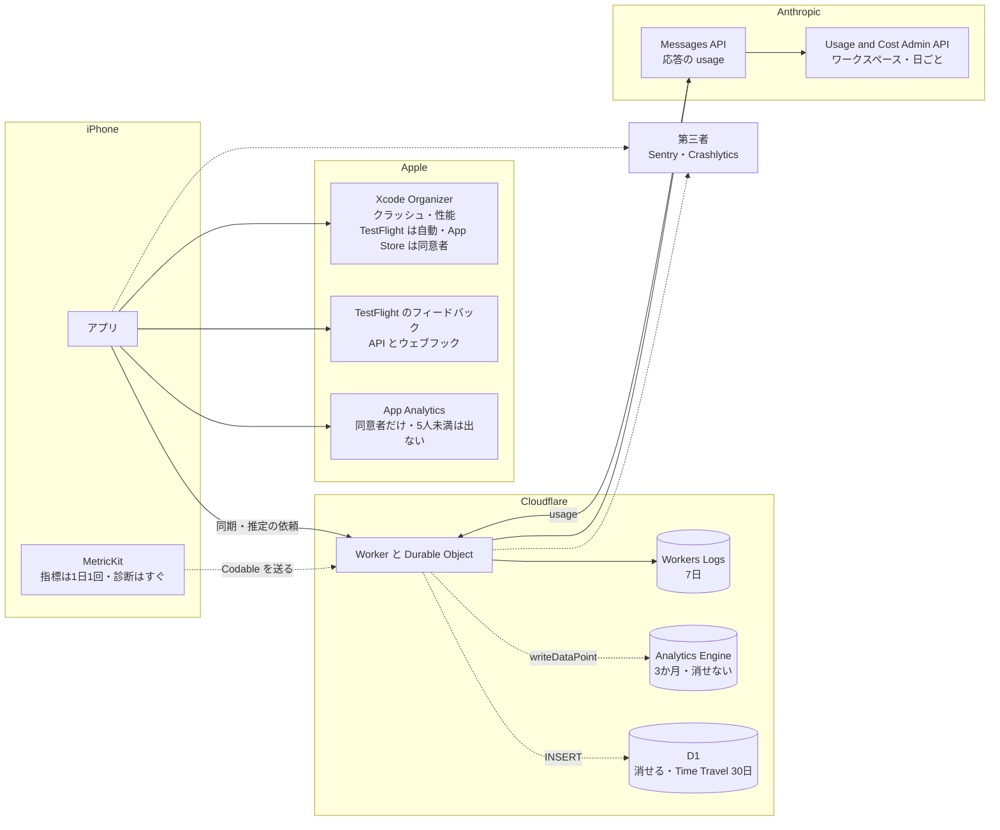

# 出荷後に観測できるものの置き場（Cloudflare・Anthropic・Apple・第三者のクラッシュ収集）

調査日: 2026-09-25
対象: Issue #33「初回出荷時に観測できるもの」。出荷後の運用に要る情報（クラッシュ、サーバーのエラー、AI の呼び出しの失敗率・トークン・費用、同期の失敗、推定精度の手がかり、ユーザーの行動（記録の続き具合など））を、何で、どこに集めるかを決めるための事実を、一次情報で集める。構成の前提は `server/AGENTS.md` と `ios/AGENTS.md`（Workers＋Hono、アカウントごとの Durable Object、D1 にアカウントの索引、R2 に写真、Claude Sonnet 5 を環境ごとのワークスペースで呼ぶ、ヘルスケアから体重・体脂肪率を読む）。

> **確認の方法と限界**
> - Cloudflare（developers.cloudflare.com の `index.md`）、Anthropic（platform.claude.com/docs の `.md` と support.claude.com のヘルプ記事）、Apple（developer.apple.com の開発者向けドキュメントは同じ内容の JSON `https://developer.apple.com/tutorials/data/<パス>.json`、App Store Connect ヘルプ、App Review Guidelines、App privacy details、Apple Developer Program License Agreement（以下 DPLA）の HTML、help.apple.com の Xcode ヘルプ）、Sentry（docs.sentry.io の `.md` と sentry.io/pricing）、Firebase（firebase.google.com）の**本文を直接取得して読んだ**。本文で確かめた主張は「本文で確認」と書く。
> - 本文の記述から推し量ったもの、本文の数字から計算したものは「本文からの読み取り」と書き、何から読み取ったかを添える。
> - 本文や関連ページを探しても記述が無かったものは「本文を探したが記述なし」と書き、探したページを添える。
> - 実アカウントでの設定や計測はしていない。Cloudflare の通知の一覧、Anthropic の Console の画面、App Store Connect の画面は、文書に書かれた範囲でしか確かめていない。
> - **Anthropic のワークスペースの支出の通知は、ヘルプ記事の1文（「Add notification」でメールの通知を設定できる）だけが根拠**で、何通・いつ届くかの記述は無い。
> - **sentry.io/pricing は、HTML から読める範囲（Developer・Team・Business の列）だけ**を根拠にしている。
> - 料金は取得日（2026-09-25）時点のもの。**Cloudflare の Traces と OpenTelemetry の書き出しは、2026-10-01 から課金が始まる**と本文に書かれており、調査日の6日後に変わる。
> - 二次情報（ブログ、まとめ記事、Qiita・Zenn、Stack Overflow）は使っていない。出典の番号は末尾の「出典一覧」。
> - **PostHog の分（末尾の「PostHog」の節、2026-09-26 に追加）**: posthog.com/docs の各ページの Markdown 版（`https://posthog.com/docs/<パス>.md`、索引は `https://posthog.com/llms.txt`）、料金ページの Markdown 版（`https://posthog.com/pricing.md`）と HTML、利用規約（`/terms`）・DPA（`/dpa`）・サブプロセッサー（`/subprocessors`）の HTML の**本文を直接取得して読んだ**。SDK の既定値と挙動は、PostHog の公式リポジトリ **posthog-ios（コミット `c99f607`、版 3.84.1）を手元に取得して、ソースを読んで**確かめた。posthog-node は posthog-js リポジトリの `packages/node`（版 5.54.1）の `package.json` と入口のソースを読んだ。あわせて Apple の User Privacy and Data Use と、Cloudflare の Durable Object の State の文書も読んだ。PostHog の出典の番号（PH）と、この節で足した AP28・CF22 は、その節の中の「PostHog の出典」に置いた。
> - **PostHog の実アカウントは作っていない。** 設定画面、請求の画面、送った出来事の見え方、削除にかかる実際の時間は確かめていない。料金は取得日（2026-09-26）時点のもの。文書の例の SDK の版（3.56、3.59.3 など）はリポジトリの版（3.84.1）より古く、既定値はソースを正とした。
> - **Sentry の分（末尾の「Sentry」の節、2026-09-26 に追加）**: docs.sentry.io の各ページの Markdown 版（`https://docs.sentry.io/<パス>.md`、索引は `https://docs.sentry.io/llms.txt`）、sentry.io/pricing の HTML（プランの比較表は、各欄のチェックの SVG の有無を HTML から数えて読んだ）、規約（`/terms/`）・DPA（`/legal/dpa/`）・セキュリティの方針（`/security/`）の HTML、DPA の結び方は Sentry のヘルプセンター（sentry.help）の記事の**本文を直接取得して読んだ**。docs.sentry.io は無いページにも HTTP 200 で「Page Not Found」を返すので、本文の見出しで取れたかを確かめた。SDK の既定値と挙動は、公式リポジトリ **sentry-cocoa（コミット `9655b5b`、版 9.29.2）と sentry-javascript（コミット `bd3ce5f`、版 11.0.0）を手元に取得して、ソースを読んで**確かめた。npm の最新の版は登録簿の `dist-tags` で確かめた。PostHog のエラートラッキングの通知・グループ化・dSYM の 4 ページ（PH38〜PH41）も読んだ。Sentry の出典の番号（SE）は、その節の中の「Sentry の出典」に置いた。
> - **Sentry の実アカウントは作っていない。** 通知の画面、請求の設定（従量課金の予算を $0 にできるか）、Developer で使えない「API」の範囲、強制アンラップのクラッシュの見え方、Durable Object のアラームの終わりの送信が届くかは確かめていない。GDPR の本文（EUR-Lex）は取得できず（HTTP 202 で本文が空）、健康のデータが特別な種類に当たるかは Sentry の文書の範囲でしか書いていない。料金は取得日（2026-09-26）時点のもの。

## 結論の要約

- **Workers Logs は、Worker と Durable Object の `console.log`・例外・呼び出しごとのログ（アラームの呼び出しを含む）を集め、有料プランで月 2,000 万件まで込み、保持は 7 日**（本文で確認、CF1・CF6）。ダッシュボードの Query Builder と、Workers Observability の REST API（`/workers/observability/telemetry/query`）で集計できる（本文で確認、CF2・CF3）。**保持が 7 日なので、週をまたぐ傾向や継続率の置き場にはならない**（本文からの読み取り）。個別のログを消す API は見つからない（本文を探したが記述なし、CF3）。
- **Workers Analytics Engine（WAE）は、1 点に blobs（文字列）20・doubles（数）20・index 1（96 バイトまで）を書き、SQL API で集計する。保持は 3 か月、有料プランで月 1,000 万点込み（ただし今は課金していない）**（本文で確認、CF8〜CF11）。大量に書くと index ごとに間引かれ、`_sample_interval` で重みを戻して数える（本文で確認、CF11・CF13）。**SQL は `SELECT` と `SHOW` だけで、行を消す手段が無い**（本文で確認、CF12）。アカウントの ID を入れると、アカウントの削除のときに消せず、最長 3 か月残る（本文からの読み取り）。Durable Object からは `this.env` のバインディングとして書ける（本文からの読み取り、CF14）。
- **Cloudflare の通知には、Workers のエラー率の増加を知らせるものが見当たらない。** エラー率の通知（Advanced Error Rate Alert など）は Enterprise プランのゾーン向けだけ（本文で確認、CF18）。使える通知は、アカウント全体の支出の予算アラート（メール、止めはしない）と製品ごとの使用量の通知（本文で確認、CF19）。**エラー率で知らせるなら、定期実行の Worker が Observability API か WAE を問い合わせて自前で送るか、外部のサービスに送る**ことになる（本文からの読み取り）。
- **D1 を出来事の置き場にすると、1つの DB が1本ずつクエリを処理するので、全員の Durable Object の書き込みが1つの D1 に集まる**（本文で確認、CF20）。平均 1 ms のクエリで毎秒約 1,000 件、書き込みは数 ms かかり、あふれると「overloaded」エラーになる。1つの DB は 10 GB までで増やせない。料金は書き込み月 5,000 万行まで込み（本文で確認、CF20・CF21）。D1 は行を消せるが、Time Travel で 30 日は戻せる状態が残る（本文で確認、CF20）。
- **Anthropic の応答の `usage` は、入力・出力・キャッシュの作成（5 分と 1 時間の内訳つき）・キャッシュの読み取り・思考のトークン・サービスの段・推論の地域を返す**（本文で確認、AN1）。Sonnet 5 の単価（入力 $2、出力 $10、キャッシュの読み $0.20、5 分のキャッシュの書き $2.50、100 万トークンあたり）を掛ければ、呼び出しごとの費用を自前で出せる（本文からの読み取り、AN9）。
- **Usage and Cost Admin API は、ワークスペースごと・日ごと（使用量は 1 分・1 時間・1 日）の使用量と費用を返す。** Admin API キー（`sk-ant-admin01-`、組織の admin だけが作れる）が要り、**個人のアカウントでは使えない**（本文で確認、AN3〜AN5）。データは通常 5 分以内に反映され、1 分に 1 回の問い合わせが目安（本文で確認、AN3）。API の料金の記述は無い（本文を探したが記述なし、AN3・AN5）。
- **ワークスペースの支出の上限に達すると、API は HTTP 400 `invalid_request_error`（メッセージは `You have reached your specified workspace API usage limits` で始まり、再開の時刻を含む）を返す**（本文で確認、AN2・AN7）。やり直しても再開までは通らない（本文からの読み取り）。ワークスペースの「Limits」タブの「Add notification」で、支出が指定額に達したときのメールを設定できる（本文で確認、AN8）。
- **Xcode Organizer のクラッシュ報告は、TestFlight のテスターからは端末の設定に関係なく自動で、App Store のユーザーからは「App デベロッパと共有」を許可した人からだけ集まる。性能の指標は App Store の版だけ**（本文で確認、AP6・AP9・AP10）。報告は毎日更新され、出荷から数日待つ（本文で確認、AP8・AP10）。
- **TestFlight のフィードバック（スクリーンショットつき、クラッシュ時のコメントつき）は App Store Connect で見られ、App Store Connect API とウェブフックでも取れる。クラッシュのログは 120 日ダウンロードできる**（本文で確認、AP11〜AP14）。
- **MetricKit は、指標の報告を1日に最大1回（前の 24 時間分）、診断（クラッシュ、ハング、CPU・ディスクの例外、起動）はすぐに届ける。iOS 27 では `MetricManager` の非同期シーケンスで受け取り、報告は `Codable` なので自前のサーバーに送れる**（本文で確認、AP1〜AP5）。すべての発生に報告が出るわけではない（本文で確認、AP4）。ユーザーの許可（「App デベロッパと共有」）が要るかの記述は MetricKit の文書に無い（本文を探したが記述なし、AP1〜AP5）。
- **App Store Connect の App Analytics（セッション、クラッシュの数など）は、共有に同意したユーザーの分だけで、5 人未満の値は出ない**（本文で確認、AP17・AP19・AP20・AP22）。同意した新規ユーザーの割合は「App Store Opt-in」の報告で分かる（本文で確認、AP21）。継続率の報告は Analytics Reports の一覧に見当たらない（本文を探したが記述なし、AP18）。
- **App Privacy は、Apple が集めるデータ（Xcode Organizer、App Analytics）を申告しなくてよい**（本文で確認、AP23）。**自前で端末の外に送って保存するクラッシュ（Crash Data）・性能（Performance Data）・操作（Product Interaction）は申告が要る**（本文からの読み取り、AP23）。ユーザー ID などの直接の識別子を**集める前に**外さない限り「ユーザーに結びつく」扱いになる（本文で確認、AP23）。
- **App Review Guidelines 5.1.1(ii) は、利用状況のデータを集めるなら、匿名でもユーザーの同意を得るよう求める**（本文で確認、AP24）。健康データは、5.1.2(vi)・5.1.3(i)・DPLA 3.3.3(H) で広告・マーケティング・「使用に基づくデータマイニング」に使えず、DPLA はアプリの健康・フィットネスのサービスの提供以外に使うことを禁じる。使い方をユーザーに示し、同意した範囲でだけ使う（本文で確認、AP24・AP26・AP27）。**製品の改善のための分析をはっきり許す、または禁じる記述は無い**（本文を探したが記述なし）。
- **アカウントの削除では、法で残す必要のない、アカウントに結びつくデータを消す**（本文で確認、AP25）。匿名化して残してよいかの記述は無い（本文を探したが記述なし、AP24・AP25）。
- **第三者のクラッシュ収集**: Sentry の無料の Developer プランは 1 人・月 5,000 エラー・30 日の遡り。保存先は US（アイオワ）か EU（フランクフルト）で、あとから変えられない（本文で確認、TP1〜TP3）。Cloudflare 向け SDK は Durable Object も包む（本文で確認、TP4）。Firebase Crashlytics は無料で、クラッシュを 90 日保持し、Google のどこの拠点でも処理しうる（本文で確認、TP7〜TP9）。どちらも使えば App Privacy で Crash Data などの申告が要る（本文からの読み取り、AP23・TP5）。
- **PostHog（末尾の節）: iOS SDK は Swift Package Manager で入り、起動・前面・背面・インストール・更新と画面（`$screen`）を既定で自動で送る。SwiftUI では画面の自動の記録は意味のある名前にならず、`.postHogScreenView()` を画面ごとに付ける**（本文で確認、PH1・PH3）。端末の情報（機種、OS、アプリの版、画面の大きさ、ロケール、タイムゾーンなど）を付けるが、**IDFA・IDFV・ATT を参照するコードは SDK に無い**。匿名の ID は SDK が作るランダムな UUID v7（本文で確認、PH2・PH6）。電波がないときはファイルに貯め、既定で 1,000 件を超えると古いものから捨てる。**送信が 3 回続けて失敗すると、貯めた列を丸ごと捨てる**（本文で確認、PH1・PH2）
- **PostHog のサーバーからの送り方**: 公式の Cloudflare Workers の手順は `posthog-node`（`workerd` 向けの入口があり、単体では `nodejs_compat` が要らない）を要求ごとに作り、`flushAt: 1`・`flushInterval: 0` にして `ctx.waitUntil(posthog.captureImmediate(...))` で送る（本文で確認、PH7・PH10）。HTTP の `/i/v0/e/` と `/batch/` に直接送ってもよい（本文で確認、PH9）。**Durable Object について PostHog の文書に記述は無く**（本文を探したが記述なし）、Cloudflare の文書は Durable Object では `waitUntil` が効かないと書く（本文で確認、CF22）
- **PostHog の料金**: 無料プランは出来事が月 100 万件、モバイルのリプレイが月 2,500 件、例外が月 10 万件まで込み、超えた分は捨てられて課金されない。プロジェクトは 1 つ、出来事の保持は 1 年、リプレイは 30 日まで。従量課金のプランでは製品ごとに上限（billing limit）をかけられ、80% と 100% でメールが届く（本文で確認、PH11〜PH16）。**無料プランはプロジェクトが 1 つなので、本番と開発用を別のプロジェクトに分けられない**（本文からの読み取り、PH11・PH17）
- **PostHog のデータの置き場**: US（バージニア）か EU（フランクフルト）。**リージョンをまたいで移すのは Scale（月 $750）以上のプランで、PostHog の技術者が行う**（本文で確認、PH11・PH17・PH21）
- **PostHog の削除**: 人（person）を `distinct_id` か UUID で指定し、出来事とリプレイもあわせて消す API がある（個人の API キーが要る）。出来事の削除は非同期で、PostHog Cloud では空いている時間（週末）に行われ、状態を問い合わせる API がある（本文で確認、PH18・PH19）。アカウントの削除のときに Worker から呼べる形をしている（本文からの読み取り）。保持期間を短くして消すことはできない（本文で確認、PH15）
- **PostHog のリプレイとエラー**: iOS のリプレイは一般提供で、既定では無効。有効にすると、文字と画像を既定で隠す。**SwiftUI はスクリーンショットのモード（既定では無効、SDK が「機微な情報を含みうる」と注意する）でしか対応しない**（本文で確認、PH22〜PH24・PH6）。iOS の例外は、Mach 例外・POSIX シグナル・捕まえなかった NSException を拾い、次の起動で送る。Swift のクラッシュは `SIGTRAP` になり、メッセージが無い（本文で確認、PH25）。Workers の例外は、Hono の `app.onError` で `captureException` を呼んで送る例がある（本文で確認、PH26）
- **PostHog と健康データ**: HIPAA の BAA は Boost（月 $250）以上だけ（本文で確認、PH11・PH35）。利用規約は、機微な個人データを集めないよう設定するのは顧客の責任とし、**既定では顧客のデータを、集約するか匿名にしたうえで PostHog の製品とモデルの開発に使う（設定で断れる）**（本文で確認、PH36）。PostHog の SDK のプライバシーマニフェストは Product Interaction と Other Usage Data を「結びつかない・トラッキングなし・Analytics」と宣言するが、アカウントの ID で identify すれば「結びつく」になる（本文で確認、PH6。本文からの読み取り、AP23）
- **Sentry（末尾の節）の無料枠**: Developer は 1 人、プロジェクトは無制限、月にエラー 5,000・ログ 5 GB・スパン 500 万・リプレイ 50・Uptime と Cron のモニター各 1、保持はすべて 30 日。超えた分は捨てられて請求されず、Developer には従量課金が無い。新しいアカウントは 14 日の Business の試用から始まり、その間のエラーは 90 日残る。Release Health のセッションは課金しない（本文で確認、SE1・SE2・SE4・SE6・SE20）
- **Sentry の通知**: Developer でもメールの通知が使え、新しい issue・エスカレート（急増を含む）・回帰・解決を条件にでき、件数・影響したユーザー数・セッションの割合・環境で絞れる。Slack などへの通知と「Additional Alert Types」は Team 以上（本文で確認、SE2・SE10）
- **Sentry の iOS SDK**: SPM で入り（iOS 15 以上）、**Swift の `fatalError`・`assert`・`precondition` のメッセージを拾う**（PostHog は拾わない）。強制アンラップの記述は無い。クラッシュは次の起動で送り、送り待ちは端末に 30 件まで貯める。ハングの検出と Release Health は既定で有効、起動の計測はトレースを有効にしたときだけ。`sendDefaultPii` は既定で `false` だが**導入の手順の例は `true` にしている**。ユーザーを付けなければ、インストールごとのランダムな UUID を付ける。スクリーンショットと view hierarchy は既定で無効（本文で確認、SE11〜SE24）。dSYM は sentry-cli などで上げ、**Xcode Cloud からの手順は文書に無い**（本文を探したが記述なし、SE15・SE16）
- **Sentry の Cloudflare SDK**: Vite のプラグインが Worker と Durable Object（`alarm` を含む）を包み、Hono には `@sentry/hono` がある。**npm の最新の 11.0.0（2026-09-23）は、`dataCollection` を書かないと HTTP の本文・IP・生成 AI の入出力を既定で集める**ので、アプリの送る健康の値や Anthropic への入力が届かないよう明示して切ることになる（既定の中身は本文で確認、SE25〜SE31。切ることになるのは本文からの読み取り）。Durable Object で送信が失われないことを保証する記述は無い（本文を探したが記述なし）
- **Sentry の個人データ**: 一人の分だけを消す手段は無く、消せるのは issue ごとかタグに関わるデータ。保持期間で消え、バックアップは 90 日で消す。置き場は US か EU で、あとから変えられない。規約と DPA は特別な種類の個人データ（GDPR 第9条1項）を送ることを禁じる。**既定では生成 AI の学習に使わず**、製品の改善に使うかは設定で選ぶ（本文で確認、SE32〜SE39）。App Privacy は Sentry の案内で Crash Data などを申告し、SDK のマニフェストは Crash Data・Performance Data・Other Diagnostic Data を「結びつかない」と宣言する（本文で確認、SE23・SE24）

## 前提: 何が、どこで生まれ、どこへ行けるか

調べた置き場を、情報の出どころごとに図にした。実線は本文で確かめた経路、点線は自前で作る経路。



## 1. Cloudflare

### Workers Logs（Workers の observability）

- **何が入るか**: 呼び出しごとのログ（invocation log。要求・応答とメタデータ）、`console.log` などのカスタムログ、エラー、捕まえなかった例外（本文で確認、CF1）。呼び出しの種類には Fetch・RPC・Alarm・Cron・Queue などがあり、Durable Object のアラームは予定の時刻が見出しになる（本文で確認、CF1）。JSON のオブジェクトで書くと、キーごとに索引が付き、そのキーで絞り込める（本文で確認、CF1）
- **Durable Object の中のログ**: Durable Object を定義した Worker で `observability.enabled` を付けると、Durable Object のページの「Logs」タブで見られる。スクリプト名とクラス名ごとにまとまる。保持期間などは Workers Logs と同じ（本文で確認、CF6）
- **有効にする方法**: wrangler の設定に `"observability": { "enabled": true }`。新しく作る Worker は既定で有効。環境（`env.<名前>`）ごとに設定できる（本文で確認、CF1）
- **サンプリング**: `head_sampling_rate`（0〜1、既定 1）で、要求の何割を記録するかを決める。記録する要求の中のログはすべて残る。アカウントで1日 50 億件を超えると、その日の残りは 1% に間引かれる（本文で確認、CF1）
- **上限**: 保持は最大 7 日、1件 256 KB（超えると切り詰めて `$cloudflare.truncated` が true）（本文で確認、CF1）
- **料金**: 無料プランは1日 20 万件・保持 3 日。有料プランは月 2,000 万件込み、超えた分は 100 万件あたり $0.60、保持 7 日（本文で確認、CF1・CF17）
- **量の見積もり**: `docs/research/server-platform.md` の仮定（1人あたり記録の読み書き1日約30回）で 1,000 人なら、Worker の呼び出しは月約 90 万回。受け口の Worker と Durable Object の呼び出しログに `console.log` を数件足しても、月数百万件で 2,000 万件に収まる（本文からの読み取り。Durable Object の呼び出しも別の呼び出しログになるとみて計算した）
- **問い合わせ**: ダッシュボードの Query Builder で、件数・異なり数・合計・平均・パーセンタイル（P50〜P999）などを、絞り込み・グループ化して集計・図にできる。問い合わせは保存でき、アカウントの全員が使える（本文で確認、CF2）。同じ問い合わせを REST API で実行できる（`POST /accounts/{account_id}/workers/observability/telemetry/query`、キーの一覧は `.../telemetry/keys`、値の一覧は `.../telemetry/values`）（本文で確認、CF2・CF3）
- **消せるか**: Observability の API にある削除は、書き出し先（destinations）の削除だけで、ログの行を消すエンドポイントは無い（本文を探したが記述なし、CF3。API の一覧を見た）
- **ダッシュボードの指標**: Worker ごとの要求数・エラー数（「Script Threw Exception」「Exceeded Resources」「Internal Error」）・CPU 時間などのグラフは、最大 3 か月さかのぼれる（1回に 1 週間ずつ）。GraphQL でも取れる（本文で確認、CF7）

### Traces と OpenTelemetry の書き出し

- **Traces**: fetch、バインディングの呼び出し（R2、Durable Object など）、Worker と Durable Object の RPC を自動でスパンにする（本文で確認、CF4）。いまはベータで無料だが、**2026-10-01 から、スパン1つを Workers Logs の1件と数え、同じ枠（有料で月 2,000 万件込み、100 万件あたり $0.60、保持 7 日）で課金する**（本文で確認、CF4）
- **OpenTelemetry の書き出し**: ログとトレースを OTLP で外のサービス（一覧に Sentry、Grafana、Honeycomb、Axiom、PostHog など）へ送れる。`persist: false` にすると Cloudflare には残さない。有料プランだけで、トレース・ログそれぞれ月 1,000 万件込み、超えた分は 100 万件あたり $0.05。**これも 2026-10-01 から課金**。指標（metrics）の書き出しはまだ無い（本文で確認、CF5）

### Workers Analytics Engine（WAE）

- **書き方**: wrangler の `analytics_engine_datasets` でバインディングを作り、`env.<名前>.writeDataPoint({ blobs, doubles, indexes })` を呼ぶ。`await` は要らず、裏で書かれる。データセットは初めて書いたときにできる（本文で確認、CF8）
- **Durable Object から書けるか**: `env` は Durable Object のクラスのプロパティとしても渡る（本文で確認、CF14）。WAE の文書に Durable Object の記述は無いが、同じバインディングを `this.env` から呼べる（本文からの読み取り、CF8・CF14）
- **データ点の形**: blobs（文字列。絞り込みとグループ化に使う）最大 20、doubles（数）最大 20、index（サンプリングのキー）1つ。blobs の合計は1点あたり 16 KB まで、index は 96 バイトまで。index を2つ以上渡すと、その点は記録されない（本文で確認、CF8・CF9）
- **呼び出しあたりの上限**: 1回の呼び出し（クライアントの HTTP 要求）で最大 250 点（本文で確認、CF9）
- **表の形**: `timestamp`、`_sample_interval`、`index1`、`blob1`〜`blob20`、`double1`〜`double20` の列を持つ表になる（本文で確認、CF11）
- **SQL API**: `POST https://api.cloudflare.com/client/v4/accounts/<account_id>/analytics_engine/sql` に SQL を送る。トークンは Account Analytics の Read 権限（本文で確認、CF11）。使える文は `SHOW TABLES`・`SHOW TIMEZONES`・`SHOW TIMEZONE`・`SELECT`（本文で確認、CF12）。GraphQL でも読める（本文で確認、CF8）
- **サンプリング**: 書くときにも読むときにも、index ごとに間引く。間引いた行は `_sample_interval` が何行ぶんかを表し、件数は `SUM(_sample_interval)`、平均は `SUM(_sample_interval * double1) / SUM(_sample_interval)` で出す（本文で確認、CF11）。間引きが始まる量に決まりは無いが、Cloudflare の CDN のような負荷では「index の値ごとに毎秒約 100 点」から目に見え始める。1回の実行で多くの点を書くと間引かれやすい（本文で確認、CF13）。nu-tori の規模ではほぼ間引かれない（本文からの読み取り、上の量から）
- **保持期間**: 3 か月（本文で確認、CF9）
- **料金**: 有料プランは書き込み月 1,000 万点込み（超えた分は 100 万点あたり $0.25）、読み取りの問い合わせ月 100 万回込み（100 万回あたり $1.00）。無料プランは1日 10 万点・1 万回。**「いまは課金しておらず、今後の数か月で課金を始める」**と書かれている（本文で確認、CF10。ページの更新日は 2026-04-23）
- **行を消せるか**: 消す文（`DELETE` など）は SQL に無く、ほかに消す手段の記述も無い（本文で確認、CF12。関連ページ CF8〜CF13 にも記述なし）。**アカウントの ID を index や blob に入れると、アカウントの削除のときに消せず、3 か月の保持が切れるまで残る**（本文からの読み取り）

### Logpush と Tail Workers

- **Logpush（Workers Trace Events）**: 要求と応答のメタデータ、`console.log`、捕まえなかった例外を、R2 などの書き出し先へ送る。有料プランだけ。月 1,000 万件込み、100 万件あたり $0.05（絞り込み・間引きのあとに届いた分を数える）。ログと例外は合わせて 16,384 文字で切り詰める。新しく組むなら OpenTelemetry の書き出しを勧めている（本文で確認、CF16・CF17）
- **Tail Workers**: 別の Worker（producer）の実行が終わったあとに呼ばれ、HTTP の状態、`console.log`、捕まえなかった例外を受け取り、任意の宛先へ送れる（アラートや分析にも使える）。有料プランと Enterprise だけ。要求の数ではなく CPU 時間で課金する。Cloudflare 自身は「組み込みで足りないことをするための上級の手段」と位置づけている（本文で確認、CF15）。Durable Object の実行も届くかの記述は無い（本文を探したが記述なし、CF15）

### 通知（エラー率と使用量）

- **Workers のエラー率の通知は見当たらない**: 通知の一覧に Workers の項目は無い（本文を探したが記述なし、CF18）。エラー率の通知（Advanced Error Rate Alert、Origin Error Rate Alert）は **Enterprise プラン向けで、ゾーンの HTTP の状態コードを見るもの**（本文で確認、CF18）
- **予算アラート（Budget alerts）**: アカウント全体の従量課金の支出が、決めた金額を超えたらメールで知らせる。請求期間ごとに1回。**知らせるだけで、使用を止めも上限をかけもしない**。Pay-as-you-go のアカウントだけ（本文で確認、CF19）
- **製品ごとの使用量の通知（Usage Based Billing）**: 製品と、製品ごとの指標（例として「Workers requests」）のしきい値を選ぶ。一覧では「Professional plans or higher」「Pay-as-you-go accounts only」と書かれている（本文で確認、CF18・CF19）
- **自前で知らせる道**: Workers Logs を問い合わせる REST API（CF3）と、WAE の SQL API（CF11）があるので、定期実行の Worker が数を問い合わせ、しきい値を超えたら知らせる形は組める（本文からの読み取り）。OpenTelemetry の書き出し（CF5）で外のサービスに送り、その通知を使う道もある（本文からの読み取り）

### D1 を分析用の出来事の置き場にしたとき

- **書き込みの速さ**: 1つの D1 は1本の Durable Object で動き、クエリを1本ずつ処理する。平均 1 ms なら毎秒約 1,000 件、100 ms なら毎秒 10 件。`INSERT` や `UPDATE` は複数の場所に永続化するので数 ms かかる。多すぎる同時の要求はまず待ち行列に入り、あふれると「overloaded」エラーを返す（本文で確認、CF20）
- **多数の Durable Object から1つの D1 に書くとき**: 全員の Durable Object の書き込みが、1本ずつ処理する1つの D1 に集まる（本文からの読み取り、CF20）。1回の呼び出しで打てるクエリは有料で 1,000 本まで（本文で確認、CF20）
- **大きさの上限**: 1つの DB は 10 GB まで（増やせない）、アカウント全体で 1 TB（申請で増やせる）、1行 2 MB、1表 100 列（本文で確認、CF20）
- **料金**: 有料プランは行の読み取り月 250 億行、書き込み月 5,000 万行、保存 5 GB まで込み。超えた分は読み 100 万行あたり $0.001、書き 100 万行あたり $1.00、保存 1 GB・月あたり $0.75。索引のある列を書くと、索引の分も1行と数える（本文で確認、CF21）
- **消せるか**: `DELETE` で消せる（書き込みとして数える）（本文で確認、CF21）。ただし Time Travel が有料プランで 30 日あり、その間は消す前の時点に戻せる（本文で確認、CF20）

## 2. Anthropic

### Messages API の応答の usage

- `usage` は次を返す（本文で確認、AN1）
  - `input_tokens`、`output_tokens`
  - `cache_creation_input_tokens`、`cache_read_input_tokens`、`cache_creation`（`ephemeral_5m_input_tokens` と `ephemeral_1h_input_tokens`）
  - `output_tokens_details.thinking_tokens`（思考に使った出力。`output_tokens` が課金の正本）
  - `server_tool_use`（ウェブ検索・取得の回数）、`service_tier`（standard・priority・batch）、`inference_geo`
- 入力の合計は `input_tokens`・`cache_creation_input_tokens`・`cache_read_input_tokens` の和。空の応答でも `output_tokens` は 0 にならない（本文で確認、AN1）
- 応答にはすべて `request-id` ヘッダーが付き、エラーの本文にも `request_id` が入る。`anthropic-workspace-id` ヘッダーで、どのワークスペースに数えたかが分かる（本文で確認、AN2・AN6）
- **費用の出し方**: Sonnet 5 は 100 万トークンあたり入力 $2、5 分のキャッシュの書き $2.50、1 時間のキャッシュの書き $4、キャッシュの読み $0.20、出力 $10（本文で確認、AN9）。`usage` の各値にこれを掛ければ、呼び出しごとの費用を自前で出せる（本文からの読み取り）

### Usage and Cost Admin API

- **何が取れるか**: 使用量（`/v1/organizations/usage_report/messages`）は、キャッシュなし入力・キャッシュ入力・キャッシュ作成・出力のトークンを、API キー・ワークスペース・モデル・サービスの段・コンテキストの窓・推論の地域などで絞り込み・グループ化して返す。時間の刻みは 1 分（最大 1,440 刻み）・1 時間（最大 168）・1 日（最大 31）（本文で確認、AN3・AN10）。費用（`/v1/organizations/cost_report`）は USD（セント単位の10進の文字列）で、刻みは 1 日だけ。ワークスペースか説明（モデルなど）でグループ化できる（本文で確認、AN3）
- **ワークスペースごと・日ごと**: `group_by[]=workspace_id` と `bucket_width=1d` で取れる。既定のワークスペースの分は `workspace_id` が null になる（本文で確認、AN3・AN6）
- **必要なキー**: Admin API キー（`sk-ant-admin01-...`）か、`org:admin` の OAuth トークンなど。**ワークスペースに結びついた API キーでは使えない**。Admin API キーは Console の「Settings > Admin keys」で、組織の admin の役割を持つ人だけが作れる（本文で確認、AN3・AN4）
- **個人のアカウントでは使えない**: 「The Admin API is unavailable for individual accounts」。Console の「Settings → Organization」で組織を設定するよう案内している（本文で確認、AN3・AN5）。ワークスペースは組織の中に作るもので、作れるのは組織の admin だけ（本文で確認、AN6・AN8）なので、環境ごとにワークスペースを分ける今の決定を満たしていれば、Admin API も使える状態にある（本文からの読み取り）
- **反映の遅れと問い合わせの頻度**: 通常は要求の完了から 5 分以内に反映、ときにもっと遅れる。続けて問い合わせるなら 1 分に 1 回が目安（本文で確認、AN3）
- **料金・さかのぼれる期間**: どちらの記述も無い（本文を探したが記述なし、AN3・AN5・AN10）
- **Spend Limits API は別物**: Claude Enterprise の組織のメンバーごとの上限を扱う API で、Console（Claude Platform）の組織では使えない（本文で確認、AN11）

### 支出の上限（spend limit）と通知

- **ワークスペースの上限**: ワークスペースの設定の「Limits」で、月の支出の上限を組織の上限より低く決められる。既定のワークスペースには上限を付けられない（本文で確認、AN6・AN7・AN8）
- **上限に近づいたときの通知**: 同じ画面の「Add notification」で、ワークスペースの支出が指定の額に達したときのメールの通知を設定できる（本文で確認、AN8）。いくつ設定できるか、誰に届くかの記述は無い（本文を探したが記述なし、AN6・AN8）
- **上限に達したときの API の応答**: 自分で決めた上限に達すると **HTTP 400、`invalid_request_error`**。メッセージは組織の上限なら `You have reached your specified API usage limits`、ワークスペースの上限なら `You have reached your specified workspace API usage limits` で始まり、再開する時刻を含む。上限を上げるか外せば早く戻る（本文で確認、AN2・AN7）
- **利用段階の上限（組織）**: Start・Build・Scale の段ごとに月の上限（$500・$1,000・$200,000）があり、達すると翌月1日 00:00 UTC まで止まる。このときは **HTTP 429、`rate_limit_error`、`error.details.error_code` が `enforced_spend_limit_reached`**、`retry-after` ヘッダーは付かず、SDK の自動のやり直しも通らない（本文で確認、AN7）
- **やり直しとの関係**: ワークスペースの上限の 400 は、再開の時刻まで何度やり直しても通らない（本文からの読み取り、AN7）。`server/AGENTS.md` は提供元のエラーをアラームのやり直しで自動でやり直すとしているので、このエラーを見分けないと、上限のあいだやり直しが続く（本文からの読み取り）

### Console で見られる使用量

- Console の「Usage」「Cost」のページで、Usage and Cost API とほぼ同じ内容が見られる（本文で確認、AN3）。ワークスペースごと、または全ワークスペースで表示を切り替えられる（本文で確認、AN8）
- 「Usage」のページには、トークンと要求の数のグラフに加えて、レート制限の使い具合のグラフと、キャッシュの当たり率がある（本文で確認、AN7）

## 3. Apple

### Xcode Organizer のクラッシュ・性能・エネルギーの報告

- **誰の端末から集まるか**: クラッシュとエネルギーの報告は、TestFlight では端末の設定に関係なく自動で送られ、App Store では「App デベロッパと共有」（設定 > プライバシー > 解析）を許可したユーザーからだけ集まる。**性能の指標（Metrics）は App Store で配った版だけ**（本文で確認、AP6・AP9・AP10）
- **TestFlight と App Store の両方か**: クラッシュとエネルギーは両方、指標は App Store だけ（本文で確認、AP9・AP10）
- **Organizer に出ないもの**: ウォッチドッグ（起動が遅いなど）、コード署名の不正、熱、Jetsam（メモリの使いすぎ）は Organizer に出ない。端末から取り出すか、ユーザーに送ってもらう（本文で確認、AP6）
- **遅れ**: 報告のサービスは過去 2 週間のログをまとめ、毎日更新する。個人のデータを取り除き、発生した端末の数を出す（本文で確認、AP8）。出荷から数日待つ。指標は十分な利用が無いと出ない（本文で確認、AP7・AP10）
- **通知**: Organizer の Insights で、性能の大きな後退（直前 4 版の平均より 75% 以上悪い）を通知するよう選べる。Xcode が動いているときに 24 時間に1回まで。クラッシュの署名は通知しない（本文で確認、AP7）
- **API**: 性能の指標と診断の署名・ログは App Store Connect API の Power and Performance Metrics and Logs で取れる（App Store の版。ユーザーの同意で共有されたもの）（本文で確認、AP16）

### TestFlight のフィードバック

- **App Store Connect での見え方**: TestFlight の「Feedback」の下の「Screenshots」と「Crashes」に分かれ、プラットフォーム・版・グループ・ビルド・OS・機種で絞り込める。詳細にはテスター名・メール・グループ・版・起動からの時間・機種・OS・電池残量・通信会社・タイムゾーン・接続の種類・空き容量などが出る。.zip でダウンロードでき、クラッシュのログは 120 日ダウンロードできる。個々に消せる（本文で確認、AP11・AP12）
- **テスターの識別**: 招待メールで招いたテスターはメールアドレスが出る。公開リンクのテスターは、自分で入力しない限り匿名（本文で確認、AP11）
- **API**: App Store Connect API の「Beta feedback crash submissions」「Beta feedback screenshot submissions」で一覧・詳細・クラッシュのログの取得・削除ができる。新しいフィードバックはウェブフックで知らせを受けられる。チームのキーも個人のキーも、役割（ADMIN・APP MANAGER・DEVELOPER）があれば使える（本文で確認、AP13・AP14）
- **ビルドごとの数**: TestFlight のビルドの表に、インストール数、直近 7 日の全テスターのセッション数、クラッシュ数、フィードバック数が出る（本文で確認、AP15）

### MetricKit

- **届く頻度**: 指標の報告（前の 24 時間分）は1日に最大1回。診断の報告は iOS 15 以降すぐに届く（本文で確認、AP1・AP3）。指標は出どころごとに別の報告で届くことがあり、届いていなかった日の分もまとめて届く（本文で確認、AP3）
- **iOS 27 の API**: `MetricManager` が `MXMetricManager` と購読のプロトコルに代わり、`metricReports`（1日ごとの集計の `MetricReport`）と `diagnosticReports`（出来事ごとの `DiagnosticReport`）を非同期シーケンスで届ける（本文で確認、AP2・AP5）。診断の種類はクラッシュ・ハング・CPU の例外・ディスク書き込みの例外・起動（本文で確認、AP2・AP4）。StateReporting で自分で決めた状態（機能など）ごとに指標を分けられる（本文で確認、AP2）
- **自前のサーバーへ送る**: 報告は `Codable` に準拠し、「バックエンドの DB に送るために符号化できる」と書かれている（本文で確認、AP2・AP4）。報告の環境には版・OS・機種と、TestFlight の版かどうか（`isTestFlightApp`）が入る（本文で確認、AP2 と「Analyzing app performance with MetricKit」）
- **すべては届かない**: 診断はすべての発生に出るわけではない。たとえばハングの診断は、ハングの検出が有効な端末か、それが有効なサンプリングの群に入った端末でだけ出る（本文で確認、AP4）
- **ユーザーの許可**: MetricKit の文書に、「App デベロッパと共有」の許可が要るかの記述は無い（本文を探したが記述なし、AP1〜AP5）
- **App Privacy との関係**: 端末の中だけで扱うデータは「集める」に当たらない。端末の外に送って、要求を処理する時間より長く読める形で保存すれば「集める」に当たる（本文で確認、AP23）。MetricKit の報告を自前のサーバーに送って保存すれば、Crash Data や Performance Data の申告が要る（本文からの読み取り、AP23）

### App Store Connect の App Analytics

- **オプトインのユーザーだけか**: App Analytics は、診断の共有に同意したユーザーから集めた利用データを出す。一定のデータ点がそろうまでは出さない（本文で確認、AP17）。Analytics Reports の「App Sessions」「App Crashes」も、Apple と開発者への共有を選んだユーザーの分だけで、5 人未満の分は出さない。詳細の報告は小さな雑音を加える（本文で確認、AP19・AP20・AP22）
- **中身**: App Sessions はセッション数と異なる端末の数（版・機種・OS・入手元ごと）、App Crashes はクラッシュ数と異なる端末の数（版・機種・OS ごと）。毎日の報告は 5 日以内にそろい、あとから届いた分で上書きされる（本文で確認、AP19・AP20・AP18 の「Data Completeness and Corrections」）
- **同意の割合**: 「App Store Opt-in」の報告で、初めてダウンロードした人のうち共有を選んだ人の数が日ごとに分かる（本文で確認、AP21）
- **取得**: App Store Connect API の Analytics Reports で要求を作り、報告を落とす。報告の実体は 35 日で消える（本文で確認、AP18）
- **TestFlight の分**: App Analytics は App Store で配ったアプリの測定と書かれている（本文で確認、AP17）。TestFlight の版が入るかの記述は無い（本文を探したが記述なし、AP17〜AP20）
- **継続率**: Analytics Reports の一覧に継続率（コホート）の報告は無い（本文を探したが記述なし、AP18）。App Store Connect の画面の継続率は今回確かめていない

### App Privacy（プライバシー表示）

- **申告が要るもの**: 自分と第三者（解析ツール、SDK）が集めるデータを、任意の申告の条件を満たすものを除いてすべて申告する。解析や広告以外の目的（アプリの機能のためだけ）でも申告する（本文で確認、AP23）
- **「集める」の意味**: 端末の外に送り、要求をその場で処理するのに要る時間より長く読める形で保存すること。送ってすぐ捨てるなら申告しなくてよい（本文で確認、AP23）
- **型**: 「診断」に Crash Data（クラッシュのログなど）、Performance Data（起動時間、ハングの率、電力）、Other Diagnostic Data。「使用状況」に Product Interaction（起動、タップ、スクロールなどアプリの操作）、Other Usage Data。「健康とフィットネス」の Health は HealthKit などの健康・医療のデータ（本文で確認、AP23）
- **目的**: Analytics は「ユーザーの行動を評価する（既存の機能の効果を知る、新しい機能を計画する、利用者の数や特徴を測る）」。App Functionality には「サーバーの稼働を保つ、クラッシュを減らす、拡張性と性能を上げる」が入る（本文で確認、AP23）
- **Apple 自身のクラッシュ報告だけを使う場合**: Apple のフレームワークやサービス（例に App Analytics）から自分のアプリについてのデータを得るなら、自分が集めて使うものを示す。**Apple が集めたデータの申告には責任を負わない**（本文で確認、AP23）。Xcode Organizer と App Analytics だけなら、クラッシュや性能の申告は要らない（本文からの読み取り）
- **「ユーザーに結びつく」の判定**: アカウント・端末・ほかの情報でユーザーの身元に結びつくものは「結びつく」。結びつかない扱いにするには、**集める前に**ユーザー ID や名前などの直接の識別子を外し、再び結びつけられないように加工し、集めたあとも結びつけようとしない・結びつけられる別のデータと合わせない。関係する法令での「個人情報」「個人データ」は結びつく扱い（本文で確認、AP23）。アカウントの ID を付けて送る出来事は「結びつく」になる（本文からの読み取り）
- **任意の申告の例外（optional disclosure）**: 次のすべてを満たすものだけ申告しなくてよい。① トラッキングに使わない、② 第三者の広告・自分の広告やマーケティング・その他の目的に使わない、③ **まれにしか集めず、アプリの主な機能の一部でなく、ユーザーが選べる**。例は、主な目的と関係のない任意のフィードバックのフォームや問い合わせ（本文で確認、AP23）。クラッシュのたびや操作のたびに自動で送るものは ③ を満たしにくい（本文からの読み取り）
- **健康データを端末の外に送るとき**: 端末の中だけで扱うデータは申告しなくてよいが、そこから何かを導いて端末の外に送るなら、その導いたデータを別に考える（本文で確認、AP23）

### 健康データ（Guidelines 5.1.2(vi)・5.1.3、HealthKit の文書、DPLA 3.3.3(H)）

- **5.1.2(vi)**: HealthKit などから得たデータは、マーケティング、広告、「使用に基づくデータマイニング（use-based data mining）」に使えない。第三者も同じ（本文で確認、AP24）
- **5.1.3(i)**: 健康・フィットネス・医療の文脈で集めたデータ（HealthKit を含む）を、広告・マーケティング・そのほかの使用に基づくデータマイニングの目的に使ったり第三者に開示したりしてはならない。例外は「健康管理を良くするため」か「健康の研究のため」で、その場合も許可を得たときだけ。集める健康データの種類を示す（本文で確認、AP24）
- **5.1.3(ii)**: 個人の健康情報を iCloud に保存しない（本文で確認、AP24）
- **HealthKit の文書**: HealthKit から得た情報を広告などに使えない。ユーザーの明示の許可なく第三者に開示しない（許可があっても、健康・フィットネスのサービスを提供する第三者にだけ）。広告の基盤・データブローカー・情報の転売者に売らない。**HealthKit のデータをどう使うかをユーザーにはっきり示す**。HealthKit を使うアプリはプライバシーポリシーが要る（本文で確認、AP26）
- **DPLA 3.3.3(H)**: HealthKit の API と、そこから得た情報を、**アプリに関わる健康・フィットネスのサービスの提供以外の目的に使わない**（例: 広告に使わない）。第三者への開示は事前の明示の同意があるときだけ。どう使うかをユーザーにはっきり示し、同意された範囲でだけ使う（本文で確認、AP27）
- **製品の改善のための分析に使ってよいか**: 分析をはっきり許す記述も、はっきり禁じる記述も無い（本文を探したが記述なし、AP24・AP26・AP27）。推定の当たり具合を確かめて nu-tori の推定を良くすることは「アプリに関わる健康・フィットネスのサービスの提供」「健康管理を良くする」に近いが、「使用に基づくデータマイニング」との境目は書かれていない。使うなら使い方を示し、同意の範囲に入れることは、どの読み方でも求められる（本文からの読み取り、AP24・AP26・AP27）
- **HealthKit から出した値**: DPLA は「HealthKit の API を通じて得た情報」と書く（AP27）。その情報から計算した値（体重の傾向など）が含まれるかの記述は無い（本文を探したが記述なし、AP24・AP26・AP27）
- **今の決定との関係**: `server/AGENTS.md` は、身体データと使い始める前の摂取エネルギーを、計算に使ったら捨て、DB にもログにも残さないと決めている。取り込んだ体重・体脂肪率は記録として持つ

### 利用状況のデータの同意（Guidelines 5.1.1(i)・(ii)）

- **5.1.1(ii)**: ユーザーや利用状況のデータを集めるアプリは、**集めた時点やその直後に匿名とみなせるデータでも**、集めることについてユーザーの同意を得る。有料の機能を同意に依存させない。同意を取り下げる分かりやすい方法を用意する（本文で確認、AP24）
- **同意の取り方**: どの形（画面での確認、規約への同意など）で同意を得ればよいかの記述は無い（本文を探したが記述なし、AP24）
- **5.1.1(i)**: プライバシーポリシーに、集めるデータ・集め方・すべての使い道、共有する第三者（解析ツール、SDK を含む）が同等の保護をすること、**データの保持と削除の方針**、同意の取り下げと削除の求め方を書く（本文で確認、AP24）
- **5.1.2(i)**: 第三者（第三者の AI を含む）と個人データを共有するなら、それをはっきり示し、明示の許可を得る（本文で確認、AP24）

### アカウントの削除（Guidelines 5.1.1(v)）

- **5.1.1(v)**: アカウントを作れるアプリは、アプリの中でアカウントの削除を始められるようにする（本文で確認、AP24）
- **何を消すか**: 「アカウントの削除は、開発者の記録からアカウントを消し、**法で残す必要のない、アカウントに結びつくデータもあわせて消す**」。一時的な無効化だけでは足りない。ユーザーは、アカウントに結びつくすべてのデータが消えると期待している（投稿の例）。法で残す必要があるものは、そのことをユーザーに知らせる（本文で確認、AP25）
- **時間がかかってよいか**: 手作業などで時間がかかってもよいが、かかる時間を知らせ、終わったら知らせる（本文で確認、AP25）
- **分析用のデータ**: 分析用のデータを名指しした記述は無い。**匿名化して残してよいかの記述も無い**（本文を探したが記述なし、AP24・AP25）。アカウントの ID を付けた出来事は「アカウントに結びつくデータ」に当たる（本文からの読み取り、AP23 の「結びつく」の定義と AP25）。直接の識別子を集める前に外したデータは、App Privacy の定義では結びつかない（AP23）が、削除の文書がそれを残してよいとしているわけではない（本文からの読み取り）

## 4. 第三者のクラッシュ・エラー収集

### Sentry（Cocoa SDK、Cloudflare 向け SDK）

- **無料枠**: Developer プランは $0、1 人だけ、月 5,000 エラー、ログ 5 GB、スパン 500 万、リプレイ 50、遡りは 30 日。有料の Team は月 $26 から（5 万エラー、遡りは最大 90 日）（本文で確認、TP1・TP2）
- **データの置き場**: 組織を作るときに US（アイオワ）か EU（フランクフルト）を選ぶ。**あとから変えられず、変えるには組織を作り直す**。エラー、スパン、ログ、リリース、デバッグシンボルなどが選んだ場所に保存される（本文で確認、TP3）
- **Cloudflare 向け SDK（`@sentry/cloudflare`）**: Vite のプラグインが、Worker の入口と、wrangler の設定にある Durable Object・Workflow のクラスを、ビルド時に包む。`nodejs_compat` と `compatibility_date` 2024-09-23 以降が要る（本文で確認、TP4）。Cloudflare の OpenTelemetry の書き出し先の一覧にも Sentry がある（本文で確認、CF5）
- **Cocoa SDK の App Privacy**: Sentry の例のプライバシーマニフェストは、Crash Data と Performance Data を「結びつかない・トラッキングなし・App Functionality」として宣言している（本文で確認、TP5）。既定では IP アドレスを送らない（`sendDefaultPii` で有効）。失敗した HTTP の要求のヘッダー（危険なものは除く）と、クエリを除いた URL は既定で送る。スクリーンショット、画面の階層、トレースは既定で無効（本文で確認、TP6）。ユーザー ID を付ければ「結びつく」になる（本文からの読み取り、AP23）

### Firebase Crashlytics

- **無料枠**: Crashlytics は「No-cost」（本文で確認、TP9）
- **集めるもの**: 常にクラッシュ時のスタックトレースとアプリの状態、機種と OS の情報。開発者が付けたカスタムのキー・ログ・自由記述のユーザー ID、致命的でない出来事。Google Analytics と一緒に使うとクラッシュ直前の操作の記録（breadcrumb）も（本文で確認、TP7）
- **保持**: スタックトレース、ミニダンプから取り出したデータ、関連する識別子（Crashlytics のインストール UUID、Firebase のインストール ID）を 90 日保持し、そのあと消し始める（本文で確認、TP8）
- **データの置き場**: Crashlytics は「Global services」に入り、Google Cloud の拠点や Google のデータセンターのどこでも処理しうる（本文で確認、TP8）
- **同意**: 自動の収集を止め、実行時に有効にする「opt-in reporting」の設定がある（本文で確認、TP8）
- **App Privacy**: Firebase の文書は Crashlytics が集めるものを上のように並べる（TP7）。これを自分のアプリの分として Crash Data などに申告することになる（本文からの読み取り、AP23 の「第三者のパートナーが集めるもの」）

## 確かめられなかったこと

- Cloudflare の通知の画面に、Workers のエラーに関わる通知が今回の文書に無い形で出ているか（通知の一覧の文書だけを見た）
- WAE の課金がいつ始まるか（「今後の数か月」とだけ書かれている、CF10）
- Anthropic のワークスペースの支出の通知が、いくつ・誰に・どの時点で届くか（AN8 の1文だけ）
- Usage and Cost Admin API で、どこまで過去をさかのぼれるか（AN3・AN10 に記述なし）
- MetricKit が「App デベロッパと共有」の許可に左右されるか（AP1〜AP5 に記述なし）
- App Store Connect の画面の App Analytics に継続率があるか（Analytics Reports の一覧だけを見た）
- 健康データから出した値を、製品の改善の分析に使うことが Guidelines と DPLA の許す範囲か（はっきりした記述なし）
- アカウントの削除のあと、匿名化した分析用のデータを残してよいか（記述なし）

## 出典一覧

取得日はすべて 2026-09-25。

### Cloudflare
- CF1: Workers Logs — https://developers.cloudflare.com/workers/observability/logs/workers-logs/
- CF2: Query Builder — https://developers.cloudflare.com/workers/observability/query-builder/
- CF3: Workers Observability API（API リファレンス） — https://developers.cloudflare.com/api/resources/workers/subresources/observability/
- CF4: Traces — https://developers.cloudflare.com/workers/observability/traces/
- CF5: Exporting OpenTelemetry Data — https://developers.cloudflare.com/workers/observability/exporting-opentelemetry-data/
- CF6: Durable Objects Metrics and analytics（ログ） — https://developers.cloudflare.com/durable-objects/observability/metrics-and-analytics/
- CF7: Workers Metrics and analytics — https://developers.cloudflare.com/workers/observability/metrics-and-analytics/
- CF8: Workers Analytics Engine Get started — https://developers.cloudflare.com/analytics/analytics-engine/get-started/
- CF9: Workers Analytics Engine Limits（保持期間を含む） — https://developers.cloudflare.com/analytics/analytics-engine/limits/
- CF10: Workers Analytics Engine Pricing — https://developers.cloudflare.com/analytics/analytics-engine/pricing/
- CF11: Workers Analytics Engine SQL API — https://developers.cloudflare.com/analytics/analytics-engine/sql-api/
- CF12: Workers Analytics Engine SQL Statements — https://developers.cloudflare.com/analytics/analytics-engine/sql-reference/statements/
- CF13: Workers Analytics Engine FAQs（サンプリング） — https://developers.cloudflare.com/analytics/faq/wae-faqs/
- CF14: Bindings（`env` は Durable Object のクラスのプロパティ） — https://developers.cloudflare.com/workers/runtime-apis/bindings/
- CF15: Tail Workers — https://developers.cloudflare.com/workers/observability/logs/tail-workers/
- CF16: Workers Logpush — https://developers.cloudflare.com/workers/observability/logs/logpush/
- CF17: Workers Pricing（Workers Logs、Workers Trace Events Logpush） — https://developers.cloudflare.com/workers/platform/pricing/
- CF18: Available Notifications — https://developers.cloudflare.com/notifications/notification-available/
- CF19: Budget alerts — https://developers.cloudflare.com/billing/manage/budget-alerts/
- CF20: D1 Limits（FAQ の Concurrency and throughput を含む） — https://developers.cloudflare.com/d1/platform/limits/
- CF21: D1 Pricing — https://developers.cloudflare.com/d1/platform/pricing/

### Anthropic
- AN1: Create a Message（`usage` の型） — https://platform.claude.com/docs/en/api/messages/create
- AN2: Errors（HTTP の状態、request-id） — https://platform.claude.com/docs/en/api/errors
- AN3: Usage and Cost API — https://platform.claude.com/docs/en/manage-claude/usage-cost-api
- AN4: Create an Admin API key — https://platform.claude.com/docs/en/manage-claude/admin-api-keys
- AN5: Admin API — https://platform.claude.com/docs/en/manage-claude/admin-api
- AN6: Workspaces — https://platform.claude.com/docs/en/manage-claude/workspaces
- AN7: Rate limits（Spend limits、Reaching your spend cap、Setting your own spend limit、Monitoring in the Console） — https://platform.claude.com/docs/en/api/rate-limits
- AN8: Creating and managing Workspaces in the Claude Console（Claude ヘルプセンター） — https://support.claude.com/en/articles/9796807-creating-and-managing-workspaces-in-the-claude-console
- AN9: Pricing — https://platform.claude.com/docs/en/about-claude/pricing
- AN10: Get Messages Usage Report（API リファレンス） — https://platform.claude.com/docs/en/api/beta/organization/usage_report/retrieve_messages
- AN11: Spend Limits API — https://platform.claude.com/docs/en/manage-claude/spend-limits-api

### Apple
- AP1: MetricKit — https://developer.apple.com/documentation/metrickit
- AP2: Monitoring app performance with MetricKit — https://developer.apple.com/documentation/metrickit/monitoring-app-performance-with-metrickit （`isTestFlightApp` は Analyzing app performance with MetricKit — https://developer.apple.com/documentation/metrickit/analyzing-app-performance-with-metrickit ）
- AP3: MXMetricManager — https://developer.apple.com/documentation/metrickit/mxmetricmanager
- AP4: DiagnosticReport — https://developer.apple.com/documentation/metrickit/diagnosticreport
- AP5: MetricKit updates — https://developer.apple.com/documentation/updates/metrickit
- AP6: Acquiring crash reports and diagnostic logs — https://developer.apple.com/documentation/xcode/acquiring-crash-reports-and-diagnostic-logs
- AP7: Analyzing the performance of your shipping app — https://developer.apple.com/documentation/xcode/analyzing-the-performance-of-your-shipping-app
- AP8: How are reports created?（Xcode ヘルプ） — https://help.apple.com/xcode/mac/current/en.lproj/dev675635e70.html
- AP9: Share crash, energy, and metrics data with developers（Xcode ヘルプ） — https://help.apple.com/xcode/mac/current/en.lproj/deve2819c518.html
- AP10: If no crash, energy, or metrics reports appear in the organizer（Xcode ヘルプ） — https://help.apple.com/xcode/mac/current/en.lproj/dev9a80ab71d.html
- AP11: View tester feedback（App Store Connect ヘルプ） — https://developer.apple.com/help/app-store-connect/test-a-beta-version/view-tester-feedback
- AP12: Beta tester feedback（App Store Connect ヘルプ） — https://developer.apple.com/help/app-store-connect/reference/testflight/beta-tester-feedback
- AP13: Beta feedback crash submissions（App Store Connect API） — https://developer.apple.com/documentation/appstoreconnectapi/beta-feedback-crash-submissions
- AP14: Beta feedback screenshot submissions（App Store Connect API） — https://developer.apple.com/documentation/appstoreconnectapi/beta-feedback-screenshot-submissions
- AP15: View build status and metrics（App Store Connect ヘルプ） — https://developer.apple.com/help/app-store-connect/test-a-beta-version/view-build-status-and-metrics
- AP16: Power and Performance Metrics and Logs（App Store Connect API） — https://developer.apple.com/documentation/appstoreconnectapi/power-and-performance-metrics-and-logs
- AP17: Overview of reporting tools（App Store Connect ヘルプ） — https://developer.apple.com/help/app-store-connect/measure-app-performance/overview-of-reporting-tools
- AP18: Analytics Reports（Data Completeness and Corrections を含む） — https://developer.apple.com/documentation/analytics-reports
- AP19: App Sessions — https://developer.apple.com/documentation/analytics-reports/app-sessions
- AP20: App Crashes — https://developer.apple.com/documentation/analytics-reports/app-crashes
- AP21: App Store Opt-in — https://developer.apple.com/documentation/analytics-reports/app-store-opt-in
- AP22: Protecting user privacy in report data — https://developer.apple.com/documentation/analytics-reports/privacy
- AP23: App privacy details on the App Store — https://developer.apple.com/app-store/app-privacy-details/
- AP24: App Review Guidelines（5.1.1、5.1.2、5.1.3） — https://developer.apple.com/app-store/review/guidelines/
- AP25: Offering account deletion in your app — https://developer.apple.com/support/offering-account-deletion-in-your-app/
- AP26: HealthKit Protecting user privacy — https://developer.apple.com/documentation/healthkit/protecting-user-privacy
- AP27: Apple Developer Program License Agreement（3.3.3 Data and Privacy の B と H） — https://developer.apple.com/support/terms/apple-developer-program-license-agreement/

### 第三者
- TP1: Sentry Pricing & Billing — https://docs.sentry.io/pricing/
- TP2: Sentry Pricing（プランの比較） — https://sentry.io/pricing/
- TP3: Sentry Data Storage Location (US or EU) — https://docs.sentry.io/organization/data-storage-location/
- TP4: Sentry for Cloudflare — https://docs.sentry.io/platforms/javascript/guides/cloudflare/
- TP5: Sentry Apple Privacy Manifest — https://docs.sentry.io/platforms/apple/guides/ios/data-management/apple-privacy-manifest/
- TP6: Sentry Data Collected（Apple SDK） — https://docs.sentry.io/platforms/apple/guides/ios/data-management/data-collected/
- TP7: Firebase: Data collection for Apple's App Store privacy details — https://firebase.google.com/docs/ios/app-store-data-collection
- TP8: Firebase Privacy and Security — https://firebase.google.com/support/privacy
- TP9: Firebase Pricing — https://firebase.google.com/pricing

## PostHog

調査日: 2026-09-26。Issue #33 で、ユーザーの行動の分析と、サーバーで起きる出来事（推定ごとのトークン・やり直し・結果、週ごとの見直しの旗、同期の健全性）の置き場として PostHog を使う案が出たので、判断に要る事実を集めた。取り方と限界は冒頭の「確認の方法と限界」、出典はこの節の末尾の「PostHog の出典」。

### iOS SDK（posthog-ios）

- **入れ方**: Swift Package Manager（`https://github.com/PostHog/posthog-ios.git`、製品名 `PostHog`）か CocoaPods で入れる（本文で確認、PH1）。`Package.swift` の最低の版は iOS 13 で、SDK の中に PLCrashReporter と WebP のライブラリを抱えている（本文で確認、PH6）。SwiftUI では `App` の `init()` で `PostHogSDK.shared.setup(config)` を呼ぶ例が示されている（本文で確認、PH1）
- **自動で送る出来事**: `Application Opened`（起動と前面に来たとき）、`Application Backgrounded`、`Application Installed`、`Application Updated`、`$screen`（画面）、`$rageclick`（UIKit の同じ場所の連打。既定で有効）。操作の自動収集（`$autocapture`）は UIKit だけで既定では無効（本文で確認、PH3・PH5）。切り方は `captureApplicationLifecycleEvents`・`captureScreenViews`（どちらも既定で `true`）・`captureElementInteractions`（既定で `false`）・`rageClickConfig.enabled`、まとめて止めるなら `enableSwizzling = false`（本文で確認、PH2）
- **SwiftUI の画面**: `captureScreenViews` は SwiftUI でも動くが、画面の名前が SwiftUI の内部のビューの識別子になり意味をなさないので、**切って、画面ごとに `.postHogScreenView("名前")` を付けることを勧めている**。この修飾子は `onAppear` で `$screen` を送る（本文で確認、PH3）。SwiftUI の `TextField`・`Toggle` など UIKit を下に使うビューは、操作の自動収集を有効にすると拾われうる（本文で確認、PH3）
- **端末の情報**: 出来事に、アプリの名前・版・ビルド・バンドル ID、TestFlight か、機種、端末の種類、OS の名前と版、シミュレータか、画面の大きさ、ロケール、タイムゾーン、Wi-Fi か携帯回線かを付ける（本文で確認、PH6 の `PostHogContext.swift`）。アプリの版・OS・端末の種類は既定で人（person）の属性にも入る（`setDefaultPersonProperties`、既定で `true`）（本文で確認、PH2）
- **IDFA・IDFV**: SDK のソース（`PostHog/` と `vendor/`）に `identifierForVendor`・`advertisingIdentifier`・`AdSupport`・`AppTrackingTransparency` を参照する箇所は無い（本文で確認、PH6 を検索）。匿名の ID は SDK が作るランダムな UUID v7 で、`getAnonymousId` で差し替えられる（本文で確認、PH2・PH6）
- **出来事を送る前に直す・捨てる**: `setBeforeSend` で、出来事ごとに属性を書き換える、捨てる、間引ける。特定の画面の `$screen` を捨てる例もある。ただし PostHog 自身の出来事を変えると機能が壊れうると注意している（本文で確認、PH2）
- **電波がないとき**: 出来事は端末のファイルの列に貯め、電波があるときだけ送る。列の上限（`maxQueueSize`）は既定で 1,000 件で、あふれたら古いものから捨てる（本文で確認、PH1・PH2）。既定で 20 件たまるか 30 秒ごとに、1 回 50 件まで送る（本文で確認、PH2）。**送信が 3 回続けて失敗する（キーの誤り、枠の使い切り、5xx の続発など）と、列を丸ごと捨てる**（`maxRetries`、既定で 3）（本文で確認、PH2）。`flush()` は送り始めるだけで、届いたことは保証しない（本文で確認、PH2）。`dataMode = .wifi` で Wi-Fi のときだけ送れる（本文で確認、PH2）
- **identify と reset**: `identify("自前の ID")` で、それまでの匿名の出来事をその人に結びつける。自前の認証の安定した ID を使い、メールや表示名は使わないよう勧めている（本文で確認、PH1・PH3）。既定の `personProfiles = .identifiedOnly` では、identify するまでの出来事は人の属性を持たない匿名の出来事で、**匿名の出来事は識別された出来事より最大で 4 倍安い**（本文で確認、PH3）。サインアウトでは `reset()` を呼ぶ（本文で確認、PH4）。`reset()` は識別子・匿名の ID・スーパープロパティ・フラグ・セッションに加えて**オプトアウトの状態も消す**が、**送り待ちの列は消さず、列の出来事は積んだときの ID のまま送られる**（本文で確認、PH6 の `PostHogSDK.swift`・`PostHogStorage.swift`）
- **オプトアウト**: `optOut()`／`optIn()`、または `config.optOut = true` で既定を止めた状態にできる。状態はアプリのサポートのディレクトリの `posthog.optOut` ファイルに残る（本文で確認、PH5）。止めるとリプレイを含むすべての収集が止まる（本文で確認、PH5）
- **nu-tori の置き場との関係**: nu-tori は同期を自前の送り待ちで持つ（`ios/AGENTS.md` の「同期」）。PostHog の列は別に動き、3 回の失敗で捨てるので、**失ってはならないものの置き場にはならない**（本文からの読み取り、PH2）

### サーバーから送る（Cloudflare Workers と Durable Object）

- **公式の手順**: Cloudflare Workers の文書は `posthog-node` を使う。要求ごとにクライアントを作り、`flushAt: 1`・`flushInterval: 0` にする（まとめて送ると Worker が送り終える前に終わり、出来事を失いうるため）。出来事は `ctx.waitUntil(posthog.captureImmediate({...}))` で送り、応答を待たせない。Hono では `c.executionCtx.waitUntil()`、どこからでも使うなら `import { waitUntil } from 'cloudflare:workers'`（本文で確認、PH7）
- **Node の互換**: `posthog-node` には `workerd` 向けの入口があり、それ単体では `nodejs_compat` を要らない（本文で確認、PH7）。`package.json` の `exports` で `workerd` の条件が `index.edge` を指している（本文で確認、PH10）
- **HTTP の API**: `POST https://us.i.posthog.com/i/v0/e/`（EU は `eu.i.posthog.com`）に、`api_key`（書き込みだけのプロジェクトのトークン）・`event`・`distinct_id`、任意で `properties` と `timestamp`（ISO 8601）を送る。`/batch/` はまとめて送れ、本文は既定で 20 MB 未満（本文で確認、PH9）。API で送る出来事は既定で識別された出来事になり、`$process_person_profile: false` で匿名にできるが、**その `distinct_id` が一度でも識別された出来事に使われていれば、識別された出来事として扱う**（本文で確認、PH9）。プロジェクトのトークン（`phc_`）は公開してよく、個人の API キー（`phx_`）は公開してはいけない（本文で確認、PH34）
- **Durable Object から**: PostHog の文書に Durable Object の記述は無い（本文を探したが記述なし、PH7・PH8）。Cloudflare の文書は、**Durable Object の `waitUntil` は互換のためにあるだけで効かない**、Durable Object は進行中の仕事や入出力があるあいだ動き続けると書く（本文で確認、CF22）。Durable Object の中では `captureImmediate` を `await` するか、応答を返したあとも続く `fetch` として送ることになる（本文からの読み取り、CF22）
- **時刻**: `timestamp` を付ければ、送った時刻でなく出来事の時刻で入る（本文で確認、PH9）。推定をアラームで裏で進める（`server/AGENTS.md` の「層」）ときも、起きた時刻で記録できる（本文からの読み取り）
- **GeoIP**: `posthog-node` の `disableGeoip` は既定で `true`（サーバーの IP で位置を付けない）（本文で確認、PH8）

### 料金と無料枠

- **2つのプラン**: 無料プランはカード不要で、各製品の月の無料枠まで使え、**プロジェクトは 1 つ、出来事の保持は 1 年**。枠を超えた出来事は捨てられ、請求されない。従量課金のプランは基本料 $0 で、同じ無料枠のうえで超えた分を払い、プロジェクトは 6 つ、保持は 7 年（本文で確認、PH11）
- **出来事（Product analytics）**: 月 100 万件まで無料、100〜200 万件は 1 件 $0.00005、200〜1,500 万件は $0.0000343、以下量が増えるほど下がる（本文で確認、PH11・PH12）。識別された出来事（Identified events）は Product analytics の追加の項目として別に数え、月 100 万件まで無料、100〜200 万件は 1 件 $0.000198（本文で確認、PH11）。識別された出来事は、出来事の分と識別の分の両方で数える（本文からの読み取り、PH11 の「Extends Product analytics」と PH3 の「最大 4 倍安い」）
- **セッションリプレイ**: ウェブは月 5,000 件まで無料。モバイルのリプレイは追加の項目で、**月 2,500 件まで無料、2,501〜15,000 件は 1 件 $0.01**、以下量が増えるほど下がる（本文で確認、PH11）。リプレイの保持は無料プランで 30 日まで、従量課金で 90 日まで（本文で確認、PH16）
- **エラートラッキング**: `$exception` の件数で数え、**月 10 万件まで無料、10〜32.5 万件は 1 件 $0.00037**、32.5 万〜1,000 万件は $0.00014（本文で確認、PH11・PH13）。取り込む前に捨てた例外（抑止の規則、サーバー側の上限）は数えない（本文で確認、PH13）
- **上限（billing limit）**: 製品ごとに金額の上限をかけられ、超えると取り込みを止め、その分のデータは戻らない。上限か無料枠の 80% と 100% で、組織の所有者にメールが届く（本文で確認、PH14）。上限は組織の請求の設定で製品ごとにかける（本文で確認、PH14）。無料プランは、そもそも無料枠で止まる（本文で確認、PH11）。無料プランで上限の設定が要るかの記述は無い（本文を探したが記述なし、PH11・PH14）
- **本番と開発用**: PostHog はプロジェクトを「データの仕切り」とし、開発・ステージング・本番を別のプロジェクトにすることを勧める（本文で確認、PH17）。無料プランはプロジェクトが 1 つなので、本番と開発用を分けるには、従量課金のプランにするか、1 つのプロジェクトの中で属性（スーパープロパティなど）で分けることになる（本文からの読み取り、PH11・PH17）

### データの置き場（US・EU）

- **選べる場所**: US（バージニア）と EU（フランクフルト）（本文で確認、PH11）。どちらも AWS に置く（米国かドイツ）（本文で確認、PH21）。取り込みの宛先は `us.i.posthog.com` と `eu.i.posthog.com` で分かれる（本文で確認、PH9）
- **あとから変えられるか**: 同じリージョンの中の組織どうしでプロジェクトを移すのは、どのプランでもできる。**リージョンをまたいで移すのは Scale か Enterprise のプランだけで、PostHog の技術者が行う**（本文で確認、PH17）。Scale は月 $750（本文で確認、PH11）。個人の開発で実際に移すのは難しく、最初の選択がほぼ固定になる（本文からの読み取り）
- **IP アドレス**: プロジェクトの設定で、出来事にクライアントの IP を残さないようにできる（GeoIP で位置を付けてから捨てる）。**EU の組織では、新しいプロジェクトは既定で IP を集めない**（本文で確認、PH17・PH18）。US の既定の記述は無い（本文を探したが記述なし、PH17・PH18）
- **GDPR の案内**: EU の利用者の個人データを扱うなら EU のクラウドを勧め、US のクラウドで EU の利用者のデータを集めるなら、保存の前の変換で匿名にすることを勧める（本文で確認、PH20）
- **国内に置く約束との関係**: nu-tori はデータを国内に置くとは約束しない（`server/AGENTS.md` の「構成」）。PostHog には日本の置き場が無い（本文で確認、PH11 の選択肢が 2 つだけ）

### 消すこと

- **人とその出来事を消す API**: `POST /api/projects/{project_id}/persons/bulk_delete/` に、PostHog の人の UUID（`ids`）か `distinct_ids` を 1 回 1,000 件まで渡し、`delete_events`・`delete_recordings` で出来事とリプレイも消す。個人の API キー（`person:write`）が要る（本文で確認、PH19）。1人ずつ消す `DELETE /api/projects/:project_id/persons/:id?delete_events=true&delete_recordings=true` もある（本文で確認、PH18）
- **消える範囲**: 要求より前に取り込んだ出来事だけを消す。リプレイは暗号の鍵を消して読めなくする（本文で確認、PH18・PH19）。匿名の出来事（人を作らずに送ったもの）が消す対象に入るかの記述は無い（本文を探したが記述なし、PH18・PH19）
- **消えるまでの時間**: 人の記録は数分のうちに裏で消える。**出来事の削除は非同期で、PostHog Cloud では空いている時間（週末）に行われる**。`GET .../persons/deletion_status?status=pending` で、人ごとに `pending`・`completed` と完了を確かめた時刻を返す（本文で確認、PH18）。bulk_delete は `202` を返し、失敗は状態ではなく `deletion_errors` で返すので、そこを見て直す（本文で確認、PH18）
- **同じ ID を使い回さない**: 削除の途中で同じ `distinct_id` を使うと想定しない結果になりうる（本文で確認、PH18）。nu-tori のアカウント ID は UUID で使い回さない（`server/AGENTS.md` の「同期」）ので当たらない（本文からの読み取り）
- **保持期間では消せない**: 保持期間を短くして消すことはできず、頼んでも短くしない。消すのは人・プロジェクト・組織の削除で行う（本文で確認、PH15・PH18）
- **アカウントの削除に使えるか**: 受け口の Worker のアカウントの削除（`server/AGENTS.md` の「層」）から、アカウント ID を `distinct_ids` に入れて bulk_delete を呼べる形をしている。ただし個人の API キーを Worker の秘密の値に置くことになり、出来事が消え終わるのは週末になりうる。Apple は「かかる時間を知らせ、終わったら知らせる」ことを求める（本文からの読み取り、PH18・PH19・AP25）

### モバイルのセッションリプレイ（iOS）

- **対応状況**: iOS のモバイルのリプレイは一般提供（本文で確認、PH22）。画面の状態を取り、既定は「ワイヤーフレーム」（ビューの階層を JSON にし、HTML の線画で再現する）。`screenshotMode` で実際の画面の画像を撮る（本文で確認、PH22）
- **既定では無効**: `config.sessionReplay` は既定で `false`。プロジェクトの設定の「Record user sessions」も有効にする必要がある（本文で確認、PH2・PH23）
- **既定の隠し方**: 文字と入力欄（`maskAllTextInputs`）と画像（`maskAllImages`）は既定で隠す。パスワードの入力は常に隠す。`PHPickerViewController` などシステムの別プロセスのビューも既定で隠す（`maskAllSandboxedViews`）（本文で確認、PH23・PH6）。通信の速さ・大きさ・状態のコード（本文は取らない）は既定で記録する。タップの位置も既定で記録する（本文で確認、PH23・PH6）
- **SwiftUI**: **SwiftUI は `screenshotMode` を有効にしたときだけ対応する**（本文で確認、PH23）。スクリーンショットのモードは既定で無効で、SDK は「スクリーンショットは機微な情報を含みうる」と注意する（本文で確認、PH6・PH22）。SwiftUI では `.postHogMask()`・`.postHogNoMask()` で隠す範囲を決め、`SecureField` とメールの入力の種類の `TextField` は自動で隠す。Xcode 26 以降でビルドしたアプリは、`Text`・`Image`・`Button` でこれらの修飾子がぶれうるので 3.36.2 以降を使う（本文で確認、PH24）
- **nu-tori との関係**: 画面に体重・食事の写真・栄養の値が出るので、SwiftUI で使うにはスクリーンショットのモードにし、隠す範囲を自分で漏れなく決める必要がある（本文からの読み取り、PH23・PH24）

### エラートラッキング

- **iOS（Swift）**: `errorTrackingConfig.autoCapture = true` で、Mach 例外（`EXC_BAD_ACCESS` など）、POSIX シグナル（`SIGSEGV` など）、捕まえなかった `NSException` を `$exception` として拾う。クラッシュはディスクに残し、**次の起動で**送る。iOS・macOS・tvOS だけ（本文で確認、PH25）。自分で捕まえたエラーは `captureException(error)` で送る（本文で確認、PH25）。記号を読める形にするには dSYM を上げる（本文で確認、PH25）
- **iOS の限界**: システムのフレーム（UIKit、Foundation など）は記号にならない。**Swift のクラッシュは `SIGTRAP` として出て、エラーのメッセージが無い**（本文で確認、PH25）
- **Cloudflare Workers（JavaScript）**: Workers の文書は `posthog.captureException()` で例外を送るとする（本文で確認、PH7）。Hono の手順は `app.onError` で `captureException` を呼び、`await posthog.flush()` する例を示す（本文で確認、PH26）。Node の自動の収集（`enableExceptionAutocapture`）はスタックトレースの処理にファイルシステムを使い、Workers では Node の互換を有効にする必要があると書く（本文で確認、PH27）。`workerd` 向けの入口は、Node の入口にあるソースの行やモジュールの補いを持たない（本文で確認、PH10）。Workers で自動の収集が動くかの記述は無い（本文を探したが記述なし、PH7・PH26・PH27）
- **既存の選択肢との比べ方**: クラッシュは Xcode Organizer・MetricKit（3 節）、Workers の例外は Workers Logs（1 節）でも拾える。PostHog に送ると、同じ人の出来事・リプレイと並べて見られる（本文で確認、PH1 の identify の説明）

### 分析の道具

- **ファネル**: 手順の出来事を並べ、どこで離れるか、変換にかかる時間、時間を追った変化を見る。順序は「順に」「間に何も挟まない」などから選べる（本文で確認、PH28）
- **継続率（retention）**: 始まりの出来事と戻りの出来事を決め、時・日・週・月の区切りで戻った人を数える。初回・初めての発生・繰り返しの数え方を選べる（本文で確認、PH29）。人を単位に数えるので、識別された出来事（identify）が前提になる（本文からの読み取り、PH29・PH3）
- **SQL（HogQL）**: ClickHouse の SQL を包んだ方言で、`SELECT`・`JOIN`・`GROUP BY` などで出来事と人を任意に問い合わせられる（本文で確認、PH30）。API の `/api/projects/:project_id/query/` でも SQL を投げられ、1 回 5 万行まで、1 時間 2,400 回・1 分 240 回までだが、**書き出しの手段ではない**と明記している（本文で確認、PH31）
- **書き出し**: 定期の書き出し（batch exports: S3、S3 互換、BigQuery、Postgres など）と、API で 1 回だけファイル（Parquet、JSON Lines）に落とす書き出し（1 回 1 週間分まで）がある（本文で確認、PH32・PH33）。batch exports は月 100 万行まで無料（本文で確認、PH11）。S3 互換の宛先に R2 が使えるかの記述は無い（本文を探したが記述なし、PH32）

### App Privacy とトラッキング（ATT）

- **PostHog の答え方の案内**: PostHog の文書（索引 `llms.txt` と iOS・プライバシーの各ページ）に、App Store のプライバシー表示の答え方の案内は無い（本文を探したが記述なし、PH1〜PH5）
- **SDK のプライバシーマニフェスト**: posthog-ios の `PrivacyInfo.xcprivacy` は、Product Interaction と Other Usage Data を「ユーザーに結びつかない・トラッキングに使わない・目的は Analytics」と宣言する。同梱の PLCrashReporter のマニフェストは、Crash Data と Other Diagnostic Data を「結びつかない・トラッキングなし・App Functionality」と宣言する（本文で確認、PH6）
- **identify したときの答え**: Apple は、アカウントなどで身元に結びつくものを「結びつく」とする（AP23）。アカウント ID で identify すれば、SDK のマニフェストの宣言にかかわらず「結びつく」で申告することになる（本文からの読み取り、AP23・PH6）
- **ATT**: Apple は、トラッキングを「自分のアプリで集めたユーザー・端末のデータを、ほかの会社のアプリ・ウェブ・オフラインのデータと結びつけて、広告の対象の選択や広告の測定に使うこと、またはデータブローカーと共有すること」と定める。分析の SDK が集めたデータをほかの開発者のアプリの広告に使い回すなら、自分がその目的に使わなくてもトラッキングに当たる（本文で確認、AP28）。PostHog の SDK は IDFA を読まず（PH6）、PostHog は顧客のデータを製品とモデルの開発に使う場合は集約・匿名にする（PH36）。**PostHog の文書・規約に、データを広告に使う・データブローカーに渡すという記述は見当たらない**（本文を探したが記述なし、PH34・PH36・PH37）。したがってトラッキングに当たらない読み方が自然（本文からの読み取り、AP28）

### 健康データとの関係

- **HIPAA と BAA**: HIPAA は米国の対象事業者に適用される法律と説明している。**PostHog Cloud の BAA は Boost（月 $250）・Scale・Enterprise のプラットフォームのパッケージだけ**（本文で確認、PH11・PH34・PH35）。BAA を結んでも全機能を覆うわけではなく、PostHog AI（第三者の LLM にデータを送る）と管理された逆プロキシは覆わない（本文で確認、PH35）。nu-tori は日本の個人のアプリで、米国の対象事業者ではないので、HIPAA そのものは当たらない（本文からの読み取り、PH35）
- **利用規約（最終更新 2026-06-29）**: 顧客は、データを適用される法に沿って扱い、必要な同意を得る責任を持つ。**機微な個人データを集めないよう、隠す・絞る機能で設定するのは顧客の責任**（13 条）（本文で確認、PH36）
- **製品とモデルの開発への利用**: 規約 5 条で、**顧客のデータを PostHog の製品と機械学習のモデルの開発・学習に使う許諾を与える。断るには、合意するか、サービスの設定で断る**。使うときは集約か匿名にする。断ってもそれより前に使った分は戻さない（本文で確認、PH36）。健康に関わる値を送るなら、最初の送信の前に断っておく必要がある（本文からの読み取り、PH36）
- **DPA**: DPA は無料プランを含むどのプランでも、アプリの中で自分で作って結べる（本文で確認、PH34）。DPA の付属書は、扱う特別な種類の個人データを「N/A」としている（本文で確認、PH37）
- **Apple の決まりとの関係**: HealthKit から得た情報を第三者に渡すことと、「使用に基づくデータマイニング」に使うことの制限は 3 節の「健康データ」のとおり（AP24・AP26・AP27）。PostHog に送る出来事に、体重・体脂肪率やそこから出した値を入れるかは、その制限と、上の規約 5 条の既定を合わせて決めることになる（本文からの読み取り）

### PostHog の出典

取得日はすべて 2026-09-26。

- PH1: iOS（PostHog の文書） — https://posthog.com/docs/libraries/ios
- PH2: iOS SDK configuration — https://posthog.com/docs/libraries/ios/configuration
- PH3: iOS SDK usage — https://posthog.com/docs/libraries/ios/usage
- PH4: Identifying users（Reset on logout） — https://posthog.com/docs/product-analytics/identify
- PH5: Controlling data collection — https://posthog.com/docs/privacy/data-collection
- PH6: posthog-ios（公式リポジトリ、コミット `c99f607`、版 3.84.1。`Package.swift`、`PostHog/Resources/PrivacyInfo.xcprivacy`、`vendor/PHPLCrashReporter/Resources/PrivacyInfo.xcprivacy`、`PostHog/PostHogContext.swift`、`PostHog/PostHogSDK.swift`、`PostHog/PostHogStorage.swift`、`PostHog/PostHogStorageManager.swift`、`PostHog/Replay/PostHogSessionReplayConfig.swift`） — https://github.com/PostHog/posthog-ios
- PH7: Cloudflare Workers（PostHog の文書） — https://posthog.com/docs/libraries/cloudflare-workers
- PH8: Node.js — https://posthog.com/docs/libraries/node
- PH9: Capture and batch API endpoints — https://posthog.com/docs/api/capture
- PH10: posthog-node（posthog-js リポジトリの `packages/node`、版 5.54.1。`package.json` の `exports`、`src/entrypoints/index.edge.ts`・`index.node.ts`） — https://github.com/PostHog/posthog-js/tree/main/packages/node
- PH11: PostHog Pricing（Markdown 版と HTML。プラン、各製品の単価、Platform Packages、FAQ、クラウドの選択） — https://posthog.com/pricing （Markdown 版 https://posthog.com/pricing.md ）
- PH12: Product Analytics pricing — https://posthog.com/docs/product-analytics/pricing
- PH13: Error Tracking pricing — https://posthog.com/docs/error-tracking/pricing
- PH14: Billing limits and alerts — https://posthog.com/docs/billing/limits-alerts
- PH15: Events data retention — https://posthog.com/docs/data/events-retention
- PH16: Replay recording retention — https://posthog.com/docs/session-replay/recording-retention
- PH17: Projects（プロジェクトの分け方、リージョンをまたぐ移動、IP の設定） — https://posthog.com/docs/settings/projects
- PH18: Controlling data storage（Data deletion、Right to be forgotten、Asynchronous data deletion） — https://posthog.com/docs/privacy/data-storage
- PH19: persons_bulk_delete_create（OpenAPI） — https://posthog.com/docs/open-api-spec/persons_bulk_delete_create
- PH20: GDPR compliance — https://posthog.com/docs/privacy/gdpr-compliance
- PH21: Subprocessors — https://posthog.com/subprocessors
- PH22: Mobile session replay — https://posthog.com/docs/session-replay/mobile
- PH23: iOS Session Replay installation — https://posthog.com/docs/session-replay/installation/ios
- PH24: Session replay privacy controls（iOS、Masking in SwiftUI） — https://posthog.com/docs/session-replay/privacy
- PH25: iOS Error Tracking installation — https://posthog.com/docs/error-tracking/installation/ios
- PH26: Hono Error Tracking installation — https://posthog.com/docs/error-tracking/installation/hono
- PH27: Node.js Error Tracking installation — https://posthog.com/docs/error-tracking/installation/node
- PH28: Funnels — https://posthog.com/docs/product-analytics/funnels
- PH29: Retention — https://posthog.com/docs/product-analytics/retention
- PH30: SQL access in PostHog — https://posthog.com/docs/sql
- PH31: API queries — https://posthog.com/docs/api/queries
- PH32: Batch exports — https://posthog.com/docs/cdp/batch-exports
- PH33: File download exports — https://posthog.com/docs/cdp/file-download-exports
- PH34: Privacy compliance（FAQ: API キー、DPA、HIPAA） — https://posthog.com/docs/privacy
- PH35: PostHog & HIPAA compliance — https://posthog.com/docs/privacy/hipaa-compliance
- PH36: Terms（5 条 Product and model development、13 条 Data privacy。最終更新 2026-06-29） — https://posthog.com/terms
- PH37: Data Processing Agreement（付属書の Sensitive categories） — https://posthog.com/dpa
- AP28: User Privacy and Data Use（トラッキングの定義、第三者の SDK） — https://developer.apple.com/app-store/user-privacy-and-data-use/
- CF22: Durable Object State（`waitUntil`） — https://developers.cloudflare.com/durable-objects/api/state/

## Sentry

調査日: 2026-09-26。Issue #33 で「エラーの通知とデバッグは Sentry、行動分析は PostHog」と使い分ける案が出たので、Sentry を入れる判断に要る事実を集めた。取り方と限界は冒頭の「確認の方法と限界」、出典はこの節の末尾の「Sentry の出典」。4 節の「Sentry（Cocoa SDK、Cloudflare 向け SDK）」（TP1〜TP6）より詳しく調べ直したもので、食い違いはこの節の最後の「4 節の Sentry の記述との突き合わせ」に書いた。

送る道と、既定で送るもののうち nu-tori で切るかを決めるものを図にした。

```mermaid
flowchart LR
  subgraph iPhone
    A[アプリ<br>sentry-cocoa 9.29]
    C[(Caches の送り待ち<br>既定 30 件)]
  end
  subgraph CF[Cloudflare]
    W[Worker（Hono）<br>@sentry/hono]
    D[Durable Object とアラーム<br>instrumentDurableObjectWithSentry]
  end
  S[(Sentry<br>US か EU。あとから変えられない<br>Developer は 30 日)]
  A -->|クラッシュは次の起動で| C --> S
  W -->|v11 の既定で本文・IP も| S
  D -->|終わりに flush| S
  X[Xcode のビルドの Run Script<br>sentry-cli] -->|dSYM| S
  V[vite build] -->|ソースマップ| S
```

### 無料の Developer プランの枠

- **人数とプロジェクト**: Developer は $0 で「1 人だけ」、プロジェクトの数は無制限（本文で確認、SE2）
- **月の枠**: エラー 5,000、ログ（Sentry Logs）5 GB、アプリの指標（Application Metrics）5 GB、スパン 500 万、セッションリプレイ 50、Uptime のモニター 1、Cron のモニター 1、添付 1 GB、Metric Monitors 20、カスタムのダッシュボード 10（本文で確認、SE2）。UI Profiling と Continuous Profiling は従量課金が要り、Developer では使えない（本文で確認、SE1・SE2）
- **保持期間**: Developer はエラー・ログ・スパン・リプレイ・プロファイル・Crons・Uptime・添付・アプリの指標がすべて 30 日。Team はエラー・リプレイ・Uptime・添付が 90 日、ログとスパンは 30 日（本文で確認、SE6）。**保持は取り込んだ時点のプランで決まり、あとでプランを変えても前のデータの保持は変わらない**（本文で確認、SE6）。**新しいアカウントは 14 日の Business の試用から始まり、試用中は Team の保持（エラー 90 日）になる**（本文で確認、SE1・SE6）。試用中に送ったエラーは 90 日残る（本文からの読み取り、SE6）
- **Release Health のセッションは課金しない**（本文で確認、SE20）。Developer でも Release Health は使える（本文で確認、SE2）
- **枠を超えたとき**: 予約の量と従量課金の予算を使い切ったあとに送ったデータは**捨てられ、請求されない**。その請求期間の残りは監視できなくなる（本文で確認、SE1）。サーバーは HTTP 429 と `Retry-After` を返し、SDK はやり直さずにその間のイベントを捨てる（本文で確認、SE4）。Developer で枠を増やすには Team か Business に上げる必要がある（本文で確認、SE4）。Developer には従量課金が無いので、無料のまま請求が起きる道は無い（本文からの読み取り、SE1・SE4）
- **急増の保護（Spike Protection）**: プロジェクトごとに有効にでき、過去 7 日の量から決めたしきい値を超えると捨てて、その分を数えない。エラー・スパン・添付が対象で、ログとリプレイは対象外。試用中は効かない。通知は既定で切れている（本文で確認、SE3・SE5）。しきい値の計算に「Developer プランの予約量の 1/10」が出てくるので、Developer でも効く作りに読める（本文からの読み取り、SE5）
- **支出の上限**: 比較表で「Spend notifications」と「Set maximum spend threshold」は Developer に無く、Team 以上にある（本文で確認、SE2）。従量課金の予算は自分で決め、その額までしか請求しない。予算を途中で下げると、使った分を超える新しいデータは拒まれる（本文で確認、SE1）。**予算を $0 にできるかの明記は無い**（本文を探したが記述なし、SE1・SE3・SE4）。枠の 80% と使い切りで、組織の Owner と Billing にメールが届く（本文で確認、SE4・SE7）
- **API**: 比較表の「API」と「Third-party integrations」は Developer に無い（本文で確認、SE2）。dSYM とソースマップを上げる sentry-cli は組織の Auth Token を使う（本文で確認、SE15）。この「API」に Auth Token での上げ下ろしが含まれるかの記述は無い（本文を探したが記述なし、SE2・SE15）
- **本番と開発用**: プロジェクトは無制限なので、本番と開発用を別のプロジェクトに分けられる（本文からの読み取り、SE2）。1 つのプロジェクトの中でも `environment`（既定は `production`）で分け、通知を環境で絞れる（本文で確認、SE10・SE13）

### 通知（Monitors と Alerts）

- **仕組み**: Monitors が「いつ issue にするか」を決め、Alerts が issue の変化に応じて通知やチケットを作る（本文で確認、SE8）。プロジェクトを作ると、既定の Monitors（新しい issue を追う Issue Stream Monitor と、グループ化の規則による Error Monitor）ができる（本文で確認、SE9）
- **無料プランのメール**: 比較表で「Alerts and notifications via email」は Developer にあり、「Alerts and notifications via integrated tools」（Slack など）と「Additional Alert Types」と「Anomaly Detection」は無い（本文で確認、SE2）。「Additional Alert Types」がどの条件を指すかの記述は無い（本文を探したが記述なし、SE2・SE10）
- **Alerts の条件（When）**: 新しい issue ができた、issue がエスカレートした（優先度が上がった、急増と判定された）、解決した issue が再発した（回帰）、issue が解決された、イベントか issue の動きがあった（本文で確認、SE10）
- **絞り込み（If）**: issue の古さ・担当・発生回数・種類（`error`・`mobile` など）・優先度、頻度（5 分〜30 日の件数か、過去との比の増加）、影響したユーザーの数、影響したセッションの割合（5 分〜1 時間）、イベントの属性（`environment`、`error.unhandled`、`exception.type`、`user.id` など）、タグ、レベル、最新のリリースか（本文で確認、SE10）
- **動作（Then）**: 担当・チーム・メンバーへの通知（各人の通知の設定でメールなど）、Slack・Discord・Teams・PagerDuty など、チケットの作成（本文で確認、SE10）。通知の間隔（throttling）は毎回〜30 日から選ぶ（本文で確認、SE10）
- **Metric Monitors**: エラー・スパン・ログ・リリース・アプリの指標にしきい値（絶対値か変化率）をかけ、例に「クラッシュ率が 1% を超えた」を挙げる。クラッシュのないセッション・ユーザーの率が下回ったら知らせる使い方も書かれている（本文で確認、SE9・SE20）。Developer で 20 個まで（本文で確認、SE2）
- **issue を追っていなくても届くメール**: 回帰（解決した issue の再発）は、プロジェクトのチームの全員にメールが届く（本文で確認、SE7）。毎週土曜日に週の要約のメールが届く（本文で確認、SE7）

### iOS（sentry-cocoa）

- **入れ方**: Swift Package Manager で `https://github.com/getsentry/sentry-cocoa.git` を足し、製品は `SentrySPM`（ソースから組む。推奨）か、組み済みの `Sentry`・`Sentry-Dynamic` を 1 つだけ選ぶ（本文で確認、SE11）。`Package.swift` の最低の版は iOS 15（本文で確認、SE24）。SwiftUI では `App` の `init()` で `SentrySDK.start` を呼ぶ例がある（本文で確認、SE12）
- **クラッシュ**: Mach 例外・シグナル・C++ 例外・Objective-C 例外に加え、**`fatalError`・`assert`・`precondition` のメッセージを拾う**（本文で確認、SE14）。SDK は Swift の実行時が `libswiftCore.dylib` の `__crash_info` に書くメッセージを読み、シグナルや Mach 例外のときに例外の値に入れる（本文で確認、SE24 の `SentryCrashDynamicLinker.c`・`SentryCrashReportConverter.m`）。**強制アンラップ（`!`）の失敗のメッセージが残るかの記述は無い**（本文を探したが記述なし、SE14・SE24）。クラッシュはディスクに書き、**次の起動で**送る。起動から 2 秒以内のクラッシュは、SDK の初期化が最大 5 秒待って送る（本文で確認、SE14）
- **dSYM**: 記号にするには dSYM が要り、sentry-cli、Fastlane のプラグイン、Xcode のビルドの Run Script のどれかで上げる。どれも組織の Auth Token が要る（本文で確認、SE15）。Run Script では `ENABLE_USER_SCRIPT_SANDBOXING` を `NO` にする（本文で確認、SE15）。**Xcode 14 以降、App Store Connect から dSYM を落とせないので、別の方法で上げる**よう書かれている（本文で確認、SE16）。**ネイティブの iOS で Xcode Cloud から上げる手順は Sentry の文書に無い**（Xcode Cloud の記述は React Native の、ソースマップの `dist` の話だけ）（本文を探したが記述なし、SE15・SE16）。Xcode Cloud でも Run Script は動くので、sentry-cli を入れて Auth Token を渡せば同じ形で上げられるはずだが、確かめていない（本文からの読み取り、SE15）
- **ハング**: `enableAppHangTracking` は既定で有効、2 秒で App Hang とする。完全に止まったハングとそうでないものを分ける。ただし**今のハングの検出は誤検知があり、次の大きな版（10）で外す予定で、MetricKit の連携への移行を勧めている**。MetricKit の連携（`enableMetricKit`）は既定で無効（本文で確認、SE13・SE17）。ウォッチドッグによる終了の追跡（前面にいたときだけ、推定）は既定で有効（本文で確認、SE13）
- **起動の遅さ**: 起動の計測（コールド・ウォーム、事前起動の区別）は既定で有効だが、**トレースを有効にしたとき**だけ動く（本文で確認、SE18）。トレースは既定で無効（`tracesSampleRate` を決めて有効にする）（本文で確認、SE12・SE22）
- **breadcrumbs**: 既定で、アプリの状態の変化、UIControl の操作、システムの出来事（電池、メモリの警告、画面の向き、キーボード、スクリーンショットを撮った、タイムゾーン）、外への HTTP 要求を自動で残す。最大 100 件（本文で確認、SE13・SE19）。Sentry は手で残すなら breadcrumbs より Logs を勧める（本文で確認、SE19）。Logs（`enableLogs`）は既定で無効（本文で確認、SE13）
- **Release Health**: 既定で有効（`enableAutoSessionTracking`）。背面に 30 秒いたらセッションを閉じる。クラッシュのないセッションの率とユーザーの率を出す（本文で確認、SE13・SE20）
- **既定で送る個人情報**:
  - `sendDefaultPii` は既定で `false`。`false` のとき SDK は `infer_ip` を `never` にして、接続の IP をユーザーの IP にしないよう伝える（本文で確認、SE13・SE24 の `SentrySdkInfo.swift`・`SentrySDKSettings.swift`）。ただし**導入の手順の例は `options.sendDefaultPii = true` を書いている**ので、写すと IP を送る（本文で確認、SE12）
  - ユーザーを設定しないと、SDK は**インストールごとのランダムな UUID を `user.id` に入れる**（本文で確認、SE24 の `SentryClient.m`・`SentryInstallation.swift`、SE23）。IDFA と端末の ID は使わない（本文で確認、SE23）。アプリの文脈には IDFV・機種・バンドル ID の SHA1 の `device_app_hash` を入れる（本文で確認、SE24 の `SentryScopeContextEnricher.swift`）
  - 端末の文脈は、機種、OS と版、メモリ、画面の大きさ、ロケール、シミュレータか、脱獄か。**端末名を読むコードは無い**（本文で確認、SE24 を検索）
  - 失敗した HTTP の要求（既定で 500〜599）のヘッダー（危険なものは除く）と、クエリを除いた URL を送る。切るのは `enableCaptureFailedRequests` と `enableNetworkBreadcrumbs`（本文で確認、SE13・SE22）
- **スクリーンショットと view hierarchy**: どちらも**既定で無効**（`attachScreenshot`・`attachViewHierarchy`）（本文で確認、SE21・SE22）。スクリーンショットを有効にすると、既定で文字と同梱でない画像を黒く塗る。SwiftUI は塗りすぎることがあり、`sentryReplayMask`・`sentryReplayUnmask` で直す。ハングのイベントには付かない（本文で確認、SE21）。view hierarchy は SwiftUI ではほとんど取れない（本文で確認、SE21）。セッションリプレイも既定で無効（`sessionSampleRate`・`onErrorSampleRate` が 0）（本文で確認、SE13）
- **電波がないとき**: 送る前のデータは端末の Caches に貯め、電波があるときに送る。貯めるのは既定で 30 件（`maxCacheItems`）で、超えると古いものから捨てる（本文で確認、SE13）

### Cloudflare（@sentry/cloudflare、@sentry/hono）

- **版**: npm の `latest` は 11.0.0（2026-09-23 公開）、10 系は 10.75.3（本文で確認、SE31 の npm の登録簿）
- **Worker と Durable Object の包み方**: 推奨は Vite のプラグイン（`sentryCloudflareVitePlugin`）で、ビルドのときに Worker の入口を `withSentry` で、wrangler の設定にある Durable Object を `instrumentDurableObjectWithSentry` で包む。設定は入口の隣の `instrument.server.ts` に書くか、なければ `env` の `SENTRY_DSN` などを読む（本文で確認、SE25・SE26）。Vite を使わないなら自分で `withSentry` と `instrumentDurableObjectWithSentry` を書く（本文で確認、SE26・SE27）。`nodejs_compat` と `compatibility_date` 2024-09-23 以降が要る（本文で確認、SE25）
- **アラーム**: `instrumentDurableObjectWithSentry` は `fetch`・`alarm`・`webSocket*`・RPC のメソッドを包み、例外を未処理（`handled: false`）として送ってから投げ直す（本文で確認、SE31 の `durableobject.ts`・`wrapMethodWithSentry.ts`）。Durable Object の storage の `get`・`put`・`delete`・`list` もスパンにする（本文で確認、SE27）
- **Hono**: Cloudflare の Hono には専用の `@sentry/hono`（`@sentry/cloudflare` を同じ版で相方に入れる）の `sentry()` ミドルウェアを使う。Hono の `onError` の例外を拾い、3xx と 4xx の状態のものは除く（本文で確認、SE28）。Hono のミドルウェアと Vite のプラグインの自動の包みを一緒に使うときの記述は無い（本文を探したが記述なし、SE26・SE28）
- **ソースマップ**: wrangler の設定で `upload_source_maps: true` にし、`npx @sentry/wizard@latest -i sourcemaps` で上げる設定を作る。上げるのは本番のビルド（`wrangler deploy`）だけ（本文で確認、SE25・SE29）
- **Durable Object で送信が失われないか**: メソッドが終わると `waitUntil(teardown())` で送り切って（flush）から後始末する（本文で確認、SE31 の `wrapMethodWithSentry.ts`）。SDK のソースは「Durable Object には実行を確実に延ばす `waitUntil` の境目が無い」と書き、そのためにクライアントを isolate ごとに使い回し（`cacheClient`、既定で `true`）、flush のあとに出たデータはすぐ送るとしている（本文で確認、SE31 の `baseSdk.ts`・`client.ts`）。Cloudflare の文書は、Durable Object の `waitUntil` は効かず、進行中の入出力があるあいだ動き続けると書く（本文で確認、CF22）。**送信が失われないことを保証する記述は無い**（本文を探したが記述なし、SE25〜SE27）
- **既定で送るもの（v11 で広がった）**: **v11 では `dataCollection` を書かないと、ユーザーの情報（受けた要求の IP など）、Cookie、HTTP のヘッダー、受けた要求と返した応答・外への要求と応答の本文、URL のクエリ、生成 AI の入力と出力、DB の問い合わせのデータを既定で集める**。v10 では `sendDefaultPii` を書かなければ、これらの多くは集めなかった（本文で確認、SE30・SE31 の `MIGRATION.md`・`resolveDataCollectionOptions.ts`）。キーの名前が `auth`・`token`・`password` などに当たる値は常に `[Filtered]` にする（本文で確認、SE30）。Vite のプラグインは同梱した `@anthropic-ai/sdk`（0.19.2 以上 1 未満）の呼び出しをビルドのときに計測する（本文で確認、SE26・SE31 の `anthropic-ai.ts`）。**nu-tori では、アプリが送る本文（体重・食事の写真・栄養の値）と Anthropic への入力・出力が既定で Sentry に届きうるので、`dataCollection` で `userInfo: false`、`httpBodies: []`、`genAI: { inputs: false, outputs: false }` などを明示することになる**（本文からの読み取り、SE30・SE31）

### 個人データと消すこと

- **サーバー側のスクラビング**: 既定で有効。クレジットカードの番号に見える値と、キーか値に `password`・`secret`・`passwd`・`api_key`・`apikey`・`auth`・`credentials`・`mysql_pwd`・`privatekey`・`private_key`・`token`・`bearer` を含むものを消す。プロジェクトの設定で消す語を足せ、IP アドレスを保存しない設定もある。**IP を保存しない設定でも、IP から地域の情報は取り出され、消すには別の規則が要る**（本文で確認、SE32・SE34）。スクラビングの対象は決まった欄だけ（本文で確認、SE32）
- **一人のデータを消す手段**: **イベントを 1 件ずつは消せない。消せるのは issue ごと（その issue のすべてのイベント）**と、タグに関わるデータ（本文で確認、SE32・SE34）。API にも issue の削除はあるが、ユーザーやイベントを指定して消す口は一覧に無い（本文を探したが記述なし、SE33）。DPA は、サービスの中で届かない個人データについて、顧客の費用で本人の請求への対応を手伝うとする（本文で確認、SE37）。**アカウントの ID を `user.id` に付けると、その人の分だけを消す手段が無く、issue ごと消すか保持期間を待つことになる**（本文からの読み取り、SE32・SE33）
- **保持期間で消えるか**: 個々のイベントは保持期間（Developer は 30 日）のあとに消え、issue はイベントがすべて消えたら消える。**本番のバックアップは作ってから 90 日で消す**（本文で確認、SE6・SE34）。消し方は「アクセスできなくなる」と「本番から消える」で書き分けられている（本文で確認、SE6・SE34）
- **Apple の求めとの関係**: Apple はアカウントの削除のときに、アカウントに結びつくデータを消すよう求める（AP25）。Sentry に送るものにアカウントの ID を入れなければ、SDK が付けるのはインストールごとのランダムな UUID だけで、アカウントには結びつかない（本文からの読み取り、SE23・SE24・AP23）

### データの置き場

- **US か EU**: US はアイオワ、EU はフランクフルト。組織を作るときに選び、**あとから変えられず、変えるには組織を作り直す**。SaaS の組織のイベントを移す手段は無い（本文で確認、SE35）
- **選んだ場所に置くもの**: エラー、スパン、ログ、指標、Release Health、リリース・デバッグシンボル・ソースマップ、リプレイ、それらのバックアップ（本文で確認、SE35）
- **場所にかかわらず US に置くもの**: ユーザーのアカウント、組織の設定、監査ログ、**Cron の check-in**、プロジェクトのメタデータ、DSN の鍵、詳しい使用量など。サポートに渡したデータも US（本文で確認、SE35）。Uptime の確認は両方の場所に置く（本文で確認、SE35）
- **処理の場所**: 規約は、選んだ場所に保存したうえで、米国と、関連会社・サブプロセッサーのいる国で処理しうるとする（本文で確認、SE36）

### 規約・DPA（製品開発と AI の学習、機微なデータ）

- **製品の改善への利用**: 規約（Terms of Service 3.0.0、2024-02-12）は、サービスの提供・維持・改善に要る範囲でサービスのデータを使う許諾を与え、**識別できない要素（Non-Identifying Data。個人データ、ソースコード、内容、添付は含まない）は、分析・ベンチマーク・新しい製品の開発などに使える**。それ以外の要素は、顧客が設定で許した範囲でだけ使う（本文で確認、SE36）
- **AI の学習**: **既定では、許しがない限り生成 AI のモデルの学習に使わない**。設定の「Legal & Compliance」の「Service Data Usage」で、グループ化・通知などのモデルの改善に使うことを許すかを選ぶ。許した場合も PII を消してから学習に入れ、元のデータを消すと学習のデータからも消す（本文で確認、SE38・SE39）。識別できないデータは、Sentry のモデルの学習に使い、第三者のモデルの学習には使わない（本文で確認、SE38）。組織の単位で生成 AI の機能を全部切る設定がある（本文で確認、SE39）
- **DPA**: DPA（5.1.0、2024-05-29）は、組織の「Legal & Compliance」から Owner か Billing の役割の人が受け入れる（どのプランでも）（本文で確認、SE37）。**規約は、DPA を結ばない限り個人データを送らないとする**（本文で確認、SE36）。**DPA を結んだ場合も、特別な種類の個人データ（Sensitive Data）を送ることを禁じる**（本文で確認、SE37）
- **健康のデータ**: 規約は、GDPR 第9条1項の特別な種類のデータや PHI などの「Sensitive Personal Information」を Sentry に使わないよう求め、BAA は Business 以上のプランだけ（本文で確認、SE2・SE36）。健康・フィットネスの値を名指しした記述は無い（本文を探したが記述なし、SE36・SE37）。GDPR の本文は今回取得できなかったので、体重や体脂肪率が第9条1項に当たるかは確かめていない。**どちらにしても、健康の値・食事の内容・写真を Sentry に送らない設計にするのが規約と食い違わない道**（本文からの読み取り、SE36・SE37）

### App Privacy とプライバシーマニフェスト

- **SDK のプライバシーマニフェスト**: sentry-cocoa の `PrivacyInfo.xcprivacy` は、**Crash Data・Performance Data・Other Diagnostic Data の 3 つを「ユーザーに結びつかない・トラッキングなし・目的は App Functionality」**と宣言し、必要な理由の API に UserDefaults（CA92.1）、起動からの時間（35F9.1）、ファイルの時刻（C617.1）を挙げる（本文で確認、SE24・TP5）。静的に組み込むなら、この内容をアプリのマニフェストに自分で書く（本文で確認、TP5）
- **Sentry の答え方の案内**: App Store Connect で Sentry の利用を申告する必要がある（第三者の SDK が集める）。Sentry に送るように設定したものを含めて申告し、**標準の目的は「Analytics」と「App Functionality」**。Sentry はトラッキングに使わず、IDFA を要らない（本文で確認、SE23）。マニフェストの目的（App Functionality だけ）と案内（Analytics も）は一致していない（本文からの読み取り、SE23・SE24）
- **nu-tori の答え**: クラッシュ・ハングは Crash Data、起動やフレームは Performance Data、HTTP の失敗などは Other Diagnostic Data になる（本文からの読み取り、AP23・SE24）。アカウントの ID を `user.id` に付ければ「結びつく」で申告する（本文からの読み取り、AP23）。SDK が付けるランダムな UUID だけなら「結びつかない」の読み方が SDK のマニフェストと合う（本文からの読み取り、SE23・SE24）

### PostHog のエラートラッキングとの違い

一次情報で言えるものだけを並べる。PostHog の側は「PostHog」の節（PH25・PH26）と、この節で読んだ PostHog の文書（PH38〜PH41）による。

- **Swift のクラッシュのメッセージ**: Sentry は `fatalError`・`assert`・`precondition` のメッセージを拾う（SE14・SE24）。PostHog は Swift のクラッシュが `SIGTRAP` として出てメッセージが無いと書く（PH25）。どちらも本文で確認
- **クラッシュを送る時期**: どちらも次の起動で送る（本文で確認、SE14・PH25）
- **グループ化**: Sentry は指紋、次にスタックトレース（アプリのフレームだけ）、例外の型と値、メッセージの順に使い、組み込みの指紋の規則もある（本文で確認、SE40）。PostHog も指紋で自動でまとめ、取り込みのときに属性で束ねる規則を足せるが、「グループ化のやり方を改善中」と書く（本文で確認、PH40）
- **通知**: Sentry は新しい issue・エスカレート・回帰・解決を条件にし、Developer でもメールで届く（本文で確認、SE2・SE10）。PostHog の issue の通知は「作られた・再び開いた」と急増で、送り先は Slack・Discord・Teams・HTTP のウェブフックなど。メールは出来事の数のグラフ（trends）の通知を使う（本文で確認、PH38・PH39）
- **シンボル化**: どちらも dSYM を上げ、Xcode の Run Script で上げるならユーザーのスクリプトのサンドボックスを切る（本文で確認、SE15・PH41）。PostHog はシステムのフレームを記号にしないと書く（PH25）。Sentry のシステムのフレームの扱いは今回確かめていない
- **ハング・起動・Release Health**: Sentry にはハング（既定で有効）、起動の計測（トレースが要る）、クラッシュのないセッションの率がある（本文で確認、SE13・SE17・SE18・SE20）。PostHog の iOS のエラートラッキングの文書には、これらに当たる記述は無い（本文を探したが記述なし、PH25）
- **Workers**: Sentry は Worker・Durable Object・アラームを包み、Hono の `onError` も拾う（SE25〜SE28）。PostHog は `captureException` を自分で呼ぶ（PH26）。どちらも本文で確認
- **無料枠と保持**: Sentry の Developer はエラー月 5,000 件・30 日（SE2・SE6）、PostHog は例外が月 10 万件（PH11）。どちらも超えた分は捨てて請求しない（SE1・PH11）

### 4 節の Sentry の記述との突き合わせ

- **プライバシーマニフェスト**: 4 節は「Crash Data と Performance Data を……宣言している」と書くが、TP5 の例と SDK のファイルは **Other Diagnostic Data も同じ形で宣言している**（本文で確認、TP5・SE24）
- **Cloudflare 向け SDK の既定**: 4 節には既定で送るものの記述が無い。v11（2026-09-23 公開）から既定で本文や IP を集めるようになった（上の「既定で送るもの」）
- ほかの記述（無料枠の数、US・EU とあとから変えられないこと、`sendDefaultPii` が既定で `false`、スクリーンショット・画面の階層・トレースが既定で無効）は、この節で読んだ本文と食い違わない

### この節で確かめられなかったこと

- Developer の「API」が無いことが、sentry-cli の dSYM・ソースマップの上げ下ろしに効くか（SE2・SE15 に記述なし）
- 従量課金の予算を $0 に決められるか（SE1・SE3・SE4 に明記なし）
- 「Additional Alert Types」が指す条件（SE2 に説明なし）
- 強制アンラップの失敗のメッセージが Sentry に残るか（SE14・SE24 に記述なし。実機で確かめていない）
- Xcode Cloud から dSYM を上げる手順（Sentry の文書に記述なし）
- Durable Object で、アラームの終わりの送信が確実に届くか（保証の記述なし）
- 一人の個人が 2 つ目の組織を無料で作れるか（記述なし）

### Sentry の出典

取得日はすべて 2026-09-26。

- SE1: Pricing & Billing — https://docs.sentry.io/pricing/
- SE2: Sentry Pricing（HTML のプランの比較表。チェックの有無は HTML の SVG の有無で読んだ） — https://sentry.io/pricing/
- SE3: Billing Quota Management — https://docs.sentry.io/pricing/quotas/
- SE4: Manage Your Error Quota — https://docs.sentry.io/pricing/quotas/manage-event-stream-guide/
- SE5: Spike Protection — https://docs.sentry.io/pricing/quotas/spike-protection/
- SE6: Data Retention Periods — https://docs.sentry.io/security-legal-pii/security/data-retention-periods/
- SE7: Sentry Notifications — https://docs.sentry.io/product/notifications/
- SE8: Monitors and Alerts — https://docs.sentry.io/product/monitors-and-alerts/
- SE9: Monitors — https://docs.sentry.io/product/monitors-and-alerts/monitors/
- SE10: Creating an Alert — https://docs.sentry.io/product/monitors-and-alerts/alerts/create-alerts/
- SE11: Swift Package Manager (SPM) — https://docs.sentry.io/platforms/apple/install/swift-package-manager/
- SE12: iOS（導入の手順） — https://docs.sentry.io/platforms/apple/guides/ios/
- SE13: Options（Apple） — https://docs.sentry.io/platforms/apple/configuration/options/
- SE14: Features（Apple。`fatalError` のメッセージ、起動直後のクラッシュ） — https://docs.sentry.io/platforms/apple/features/ 、iOS の Features — https://docs.sentry.io/platforms/apple/guides/ios/features/
- SE15: Uploading Debug Symbols — https://docs.sentry.io/platforms/apple/dsym/
- SE16: Troubleshooting（Apple。App Store Connect と dSYM） — https://docs.sentry.io/platforms/apple/troubleshooting/ 、Troubleshooting（React Native。Xcode Cloud） — https://docs.sentry.io/platforms/react-native/troubleshooting/
- SE17: App Hangs — https://docs.sentry.io/platforms/apple/configuration/app-hangs/
- SE18: Automatic Instrumentation（App Start Tracing） — https://docs.sentry.io/platforms/apple/tracing/instrumentation/automatic-instrumentation/
- SE19: Breadcrumbs（Apple） — https://docs.sentry.io/platforms/apple/enriching-events/breadcrumbs/
- SE20: Releases & Health（Apple） — https://docs.sentry.io/platforms/apple/configuration/releases/ 、Release Health — https://docs.sentry.io/product/releases/health/
- SE21: Screenshots — https://docs.sentry.io/platforms/apple/guides/ios/enriching-events/screenshots/ 、View Hierarchy — https://docs.sentry.io/platforms/apple/guides/ios/enriching-events/viewhierarchy/
- SE22: Data Collected（Apple。TP6 と同じページ） — https://docs.sentry.io/platforms/apple/guides/ios/data-management/data-collected/
- SE23: Data Privacy for Mobile — https://docs.sentry.io/security-legal-pii/security/mobile-privacy/
- SE24: sentry-cocoa（公式リポジトリ、コミット `9655b5b`、版 9.29.2。`Package.swift`、`Sources/Resources/PrivacyInfo.xcprivacy`、`Sources/Swift/Options.swift`、`Sources/Swift/Helper/SentrySdkInfo.swift`、`Sources/Swift/Protocol/SentrySDKSettings.swift`、`Sources/Sentry/SentryClient.m`、`Sources/Swift/Helper/SentryInstallation.swift`、`Sources/Swift/Helper/SentryScopeContextEnricher.swift`、`Sources/SentryCrash/Recording/Tools/SentryCrashDynamicLinker.c`、`Sources/Sentry/SentryCrashReportConverter.m`） — https://github.com/getsentry/sentry-cocoa
- SE25: Cloudflare（導入の手順、既定で送るもの） — https://docs.sentry.io/platforms/javascript/guides/cloudflare/
- SE26: Vite Plugin（Cloudflare） — https://docs.sentry.io/platforms/javascript/guides/cloudflare/install/vite-plugin/
- SE27: Cloudflare Durable Objects — https://docs.sentry.io/platforms/javascript/guides/cloudflare/features/durableobject/
- SE28: Hono on Cloudflare — https://docs.sentry.io/platforms/javascript/guides/cloudflare/frameworks/hono/ 、Hono — https://docs.sentry.io/platforms/javascript/guides/hono/
- SE29: Source Maps（Cloudflare） — https://docs.sentry.io/platforms/javascript/guides/cloudflare/sourcemaps/
- SE30: Options（Cloudflare。`dataCollection`） — https://docs.sentry.io/platforms/javascript/guides/cloudflare/configuration/options/
- SE31: sentry-javascript（公式リポジトリ、コミット `bd3ce5f`、版 11.0.0。`MIGRATION.md`、`packages/core/src/utils/data-collection/resolveDataCollectionOptions.ts`、`packages/cloudflare/src/baseSdk.ts`・`client.ts`・`durableobject.ts`・`wrapMethodWithSentry.ts`・`flush.ts`、`packages/server-utils/src/orchestrion/config/anthropic-ai.ts`） — https://github.com/getsentry/sentry-javascript 、npm の登録簿（`dist-tags`） — https://registry.npmjs.org/@sentry/cloudflare
- SE32: Server-Side Data Scrubbing — https://docs.sentry.io/security-legal-pii/scrubbing/server-side-scrubbing/
- SE33: Events & Issues（API の一覧） — https://docs.sentry.io/api/events/
- SE34: Security Policy（Data Retention、Data Removal、PII Scrubbing） — https://sentry.io/security/
- SE35: Data Storage Location（TP3 と同じページ） — https://docs.sentry.io/organization/data-storage-location/
- SE36: Terms of Service（3.0.0、2024-02-12。4 Data、5.2 No Sensitive Personal Information、20 Definitions） — https://sentry.io/terms/
- SE37: Data Processing Addendum（5.1.0、2024-05-29。Prohibition on Sensitive Data、Deletion、Cooperation; Data Subjects' Rights） — https://sentry.io/legal/dpa/ 、How do I sign your Data Processing Addendum?（Sentry Help Center） — https://www.sentry.help/en/articles/13965008-how-do-i-sign-your-data-processing-addendum
- SE38: Service Data Usage — https://docs.sentry.io/security-legal-pii/security/service-data-usage/
- SE39: AI Privacy Principles — https://docs.sentry.io/product/ai-in-sentry/ai-privacy-and-security/
- SE40: Issue Grouping — https://docs.sentry.io/concepts/data-management/event-grouping/
- PH38: Send error tracking alerts（PostHog） — https://posthog.com/docs/error-tracking/alerts
- PH39: Detect spikes in exception volume（PostHog） — https://posthog.com/docs/error-tracking/spikes
- PH40: Grouping exceptions into issues（PostHog） — https://posthog.com/docs/error-tracking/grouping-issues
- PH41: Upload dSYMs for iOS（PostHog） — https://posthog.com/docs/error-tracking/upload-source-maps/ios
