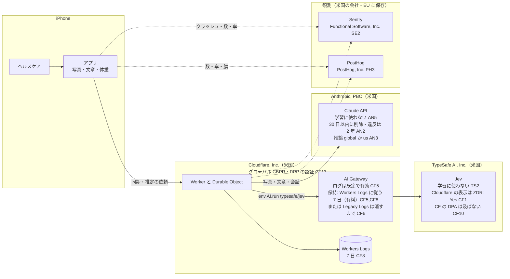
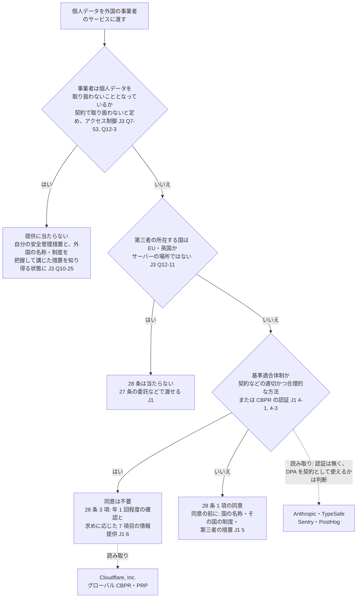

# プライバシーポリシーと App Privacy の回答に要る事実（送り先ごとの場所・保持・学習、個人情報保護法、Apple の定義）

調査日: 2026-09-29
対象: Issue #34（wayfinder マップ #19 の子）「プライバシーポリシーを用意する」。プライバシーポリシーの文面と、App Store Connect の App Privacy の回答を書くために、送り先（Cloudflare の Workers AI のモデル「Jev」と AI Gateway、Anthropic の API、Sentry、PostHog）の処理の場所・保持・学習への利用と、個人情報保護法（外国にある第三者への提供、公表事項、要配慮個人情報）と、Apple の定義・要件の本文を集める。

> **確認の方法と限界**
> - Cloudflare（developers.cloudflare.com の各ページの `index.md` と `llms-full.txt`、www.cloudflare.com の規約・DPA・プライバシーポリシーの HTML）、TypeSafe（docs.typesafe.ai の `.md`、typesafe.ai/legal の HTML）、Anthropic（platform.claude.com/docs の `.md`、privacy.claude.com、anthropic.com/legal の HTML）、個人情報保護委員会（ppc.go.jp のガイドラインと Q&A の PDF を `pdftotext` で文字にしたもの、Q&A の HTML、外国制度のページ、令和8年改正法のページと PDF）、Global CBPR Forum の認証の一覧、Apple（developer.apple.com の App privacy details、App Store Connect ヘルプ、App Review Guidelines、Sign in with Apple のドキュメントの JSON）、Sentry と PostHog（sentry.io と posthog.com の規約・DPA・サブプロセッサーの HTML）の**本文を直接取得して読んだ**。本文で確かめた主張は「本文で確認」と書く。
> - 本文の記述から推し量ったものは「本文からの読み取り」と書き、何から読み取ったかを添える。nu-tori に当てはめた部分は、ほとんどがこれに当たる。
> - 本文や関連ページを探しても記述が無かったものは「本文を探したが記述なし」と書き、探したページを添える。
> - 英語の本文は原文のまま引用し、訳はこの文書で付けた。訳は法的な解釈ではない。**この文書は法律の専門家の見解ではない。** 法の当てはめ（「提供」に当たるか、基準適合体制と言えるか）は、最後は事業者の判断になる。
> - **取得できなかったページ**: TypeSafe の Trust Center（`trust.typesafe.ai/subprocessors`）と Anthropic のサブプロセッサーの一覧（`anthropic.com/subprocessors` は `trust.anthropic.com/subprocessors` に移り、どちらも JavaScript で描くページで、本文が取れなかった）。PostHog のサブプロセッサーのページは、最初のタブ（Core Services）だけが HTML にあり、「Third-Party AI Subprocessors」と「Internal Subprocessors」のタブの中身は取れなかった。
> - **個人情報保護委員会の Q&A の PDF は「令和7年7月1日更新」版**。HTML 版と、ここで使った問い（Q7-53、Q12-3 など）の文言が同じことを確かめた。
> - **法令の条文は e-Gov から取り直していない。** 21 条・28 条・32 条・2 条 3 項と施行令・施行規則の文言は、ガイドライン（通則編は令和8年6月一部改正、外国第三者提供編は令和7年12月一部改正）に引用された本文で読んだ。28 条の本文は `docs/research/ai-disclosure.md` の J1 で e-Gov から確認済み。
> - **令和8年の改正法（令和8年7月17日公布）は、大部分がまだ施行されていない**（下の「関連して見つけたこと」）。この文書の法の記述は、調査日に施行されている法による。
> - Cloudflare、Anthropic、Sentry、PostHog、App Store Connect の**実アカウントの画面は見ていない**。AI Gateway の ZDR の設定の既定値、Anthropic のワークスペースの設定画面などは、文書に書かれた範囲でしか確かめていない。
> - 既存の調査と重なるところは、その文書を指して繰り返さない。Anthropic の学習への不使用と 30 日の保持の初出は `docs/research/food-photo-llm.md`（A8〜A11）、Apple 5.1.1/5.1.2(i)・DPLA 3.3.3・個人情報保護法 28 条の本文は `docs/research/ai-disclosure.md`、Sentry と PostHog の置き場・保持・削除は `docs/research/observability.md` の末尾の節。
> - 二次情報（解説ブログ、まとめ記事、コミュニティ投稿、Wikipedia）は使っていない。

## 結論の要約

- **Jev（`typesafe/jev`）は Cloudflare の外の第三者のモデルで、提供元 TypeSafe AI, Inc. は米国でサービスを動かしている。** Cloudflare のモデルの頁は「Third-party」「Zero data retention: Yes」と表示する【本文で確認 CF1】。Cloudflare の規約は、AI Gateway 経由の第三者の製品には「Cloudflare Data Processing Addendum ... do not apply」とする【本文で確認 CF10】。TypeSafe のプライバシーポリシーは「The Services are hosted in the United States」【本文で確認 TS3】。推論の場所を選ぶ設定は、Cloudflare にも TypeSafe にも見当たらない【本文を探したが記述なし CF1,CF3,CF4,TS1〜TS5】。
- **学習には使わない。** Cloudflare は Workers AI の入出力を「train any AI models ... or improve any Cloudflare or third-party services」に使わないとし【本文で確認 CF2】、TypeSafe も「Jev is not trained on customer requests or responses」【本文で確認 TS2,TS3,TS5】。
- **Jev の保持は、Cloudflare 側の「Zero data retention: Yes」と、TypeSafe 側の「ZDR は企業向け、ほかは必要な間だけ保持」が並んでいる。** Cloudflare の ZDR は「routes Unified Billing traffic through provider endpoints that do not retain prompts or responses」と定義され、ゲートウェイに `zdr` の設定がある。ただし既定で有効かは書かれていない【前半は本文で確認 CF4,CF14、既定値は本文を探したが記述なし】。
- **AI Gateway のログは既定で有効で、プロンプトと応答を含みうる。** 切る設定がある（ゲートウェイの設定、要求ごとの `collectLog`、ヘッダーの `cf-aig-collect-log` と `cf-aig-collect-log-payload`）【本文で確認 CF3,CF5】。保持は、2026-09-24 以降に最初のゲートウェイを作る顧客は Workers Logs の保持（有料 7 日、無料 3 日）に従う。それより前からの顧客は、Legacy Logs で消すまで残る【本文で確認 CF5〜CF8】。
- **Anthropic の API は、入出力をバックエンドで「within 30 days of receipt or generation」に自動で消す。** ただし、利用ポリシーの違反と判定されたものは入出力を最長 2 年、判定のスコアを最長 7 年保持する【本文で確認 AN2】。API の文書は「Conversation content ... is not retained by default」（Fable 5.1 などの Covered Models を除く）とも書く【本文で確認 AN1】。**Commercial Terms は「Anthropic may not train models on Customer Content from Services」**【本文で確認 AN5】。
- **Anthropic の推論の場所は `inference_geo` で選ぶ。既定の `"global"` は「any available geography」で、`"us"` にすると米国だけになり、料金は 1.1 倍。** 保存の場所（Workspace geo）は今は `"us"` だけ【本文で確認 AN3】。日本の顧客の契約の相手は Anthropic, PBC（米国）【本文で確認 AN5】。
- **`metadata.user_id` は、UUID やハッシュなどの不透明な ID を入れ、名前・メール・電話番号を入れない。Anthropic は乱用の検知に使うことがある**【本文で確認 AN4】。
- **外国にある第三者に個人データを渡すときは、次の3つを除いて、28 条の本人の同意と、同意の前の情報提供（国の名称、その国の制度、第三者の措置）が要る。** ① EU・英国にある第三者、② 基準適合体制を整えた第三者（契約などの「適切かつ合理的な方法」か、APEC CBPR・グローバル CBPR の認証）、③ 27 条 1 項各号【本文で確認 J1】。**外国への「委託」でも同じで、委託というだけでは同意が要らなくならない**【本文で確認 J3 Q12-1】。
- **「外国」は、サーバーの場所ではなく、第三者が所在する国で決まる**【本文で確認 J3 Q12-11】。Sentry（Functional Software, Inc.）と PostHog（PostHog, Inc.）は、EU のリージョンを選んでも契約の相手は米国の会社である【本文で確認 SE2,PH3】。EU に置くことだけでは ① に当たらないと読める【本文からの読み取り】。
- **クラウドの事業者が個人データを「取り扱わないこととなっている」ときは、「提供」に当たらない（Q7-53）。** その条件は「契約条項によって当該外部事業者がサーバに保存された個人データを取り扱わない旨が定められており、適切にアクセス制御を行っている場合等」【本文で確認 J3】。入力を読んで推定や返事を作る Claude と Jev は、個人データを取り扱う側と読める【本文からの読み取り】。
- **Cloudflare, Inc. はグローバル CBPR と Global PRP の認証を持つ**（認証の期間: 2024 年 7 月〜2027 年 1 月）【本文で確認 CF11,CF13】。ガイドラインは、提供先がグローバル CBPR の認証を持つことを基準適合体制（規則 16 条 2 号）に当たるとする【本文で確認 J1】。Anthropic、TypeSafe、Sentry、PostHog は、取得した認証の一覧に見当たらない【本文を探したが記述なし CF13】。基準適合体制を根拠に同意なしで渡すと、28 条 3 項の継続的な確認と、本人の求めに応じた情報提供（規則 18 条 3 項の7項目）が要る【本文で確認 J1】。
- **米国は同等の水準の国に指定されていない（指定は EU と英国だけ）。** 個人情報保護委員会の米国の頁は、連邦に包括的な法令は無いとし、「APEC の CBPR システム：2012 年 7 月 25 日参加」を指標となる情報に挙げる【本文で確認 J1,J3,J4】。
- **32 条の公表事項は、事業者の氏名・住所、すべての保有個人データの利用目的、開示等の請求の手続（手数料）、安全管理のために講じた措置、苦情の申出先。** すべて「本人の知り得る状態（本人の求めに応じて遅滞なく回答する場合を含む。）」に置けばよい【本文で確認 J2】。個人事業者の自宅の住所に特化した記述は無い【本文を探したが記述なし J2,J3】。条文の括弧書きは住所を含む各号にかかるので、住所は問い合わせに遅滞なく答える形でも足りると読める【本文からの読み取り】。
- **アプリの入力画面から直接取る個人情報は、あらかじめ利用目的を「明示」する（21 条 2 項）。** ガイドラインは「ユーザー入力画面への打ち込み等の電磁的記録」を挙げ、「本人の端末装置上に表示する場合」を明示の例に挙げる【本文で確認 J2】。
- **体重・体脂肪率・食事は、それだけでは要配慮個人情報に当たらない。** ガイドラインは「身長、体重、血圧、脈拍、体温等の個人の健康に関する情報を、健康診断、診療等の事業及びそれに関する業務とは関係ない方法により知り得た場合は該当しない」と書く【本文で確認 J2】。会話にユーザーが病名などを書けば「病歴」に当たりうるが、本人から直接取るときは「本人が当該情報を提供したことをもって」取得の同意があったと解される【本文で確認 J2】。
- **App Privacy は、自分と「third-party partners」（アプリに組み込んだコードの提供元。解析ツールや SDK）が集めるものを、任意の申告の条件をすべて満たすものを除いて申告する。** 「Collect」は、端末の外に送り、要求をその場で処理するのに要る時間より長くアクセスできる形で持つこと【本文で確認 AP1,AP2】。法令の「個人情報」「個人データ」は「linked」扱い【本文で確認 AP1】。Sign in with Apple の扱いは App Privacy の頁に書かれていない【本文を探したが記述なし AP1,AP2】。
- **プライバシーポリシーの URL は iOS アプリで必須で、公開されていることが条件。** アプリ内にも「easily accessible」なリンクを置く。5.1.1(i) は、集めるデータ・集め方・すべての使い道、共有先の第三者が同等の保護をすることの確認、保持・削除の方針、同意の撤回と削除の求め方を書くよう求める【本文で確認 AP1〜AP4】。ASC で URL を変えると、次の版の出荷で反映される【本文で確認 AP2】。
- **Sentry のサブプロセッサーは AWS・Cloudflare・Google Cloud（EU か US）、Anthropic・OpenAI（AI/ML、US）、Intercom・SendGrid（US）、Mailgun（EU）と、オーストリア・カナダ・オランダの関連会社**【本文で確認 SE1】。PostHog の Core のサブプロセッサーは、AWS・PlanetScale・Modal（EU のクラウドならドイツ）、Wiz（ドイツ・フランス）、Cloudflare（世界の拠点）【本文で確認 PH1】。どちらも EU-U.S. Data Privacy Framework と SCC を使う【本文で確認 SE3,PH2】。保持は `docs/research/observability.md` のとおり（Sentry の Developer はエラー 30 日、PostHog の無料プランは出来事 1 年）。

### データがどこへ行き、どれだけ残るか

次の図は、上の本文を nu-tori の構成に置いた読み取り。実線は本文で確かめた経路と数字、点線は nu-tori の設計で決めること。出典の記号は末尾の「出典一覧」を指す。

### 個人情報保護法 28 条で、送り先ごとに何が要るか

ガイドラインの判断の順序（J1 の 2 と 3・4、J3 Q7-53・Q12-1・Q12-3・Q12-11）を図にした。送り先を当てはめた右端は本文からの読み取りで、どの道を取るかは決めていない。

## 問い1: Workers AI のモデル「Jev」と AI Gateway

### Jev はどこで動き、誰が処理するか

- **モデルの頁**（Cloudflare）: 名前は `typesafe/jev`、「Third-party」「Zero data retention」の表示、「Jev is TypeSafe's structured evaluation model.」。規約とライセンスは `docs.typesafe.ai/legal.md` を指す【本文で確認 CF1】。
- **第三者のモデルの呼び出し**: `env.AI.run()` は「Runs an inference request through AI Gateway. Accepts Workers AI models (`@cf/` prefix) and third-party models (`{author}/{model}` format).」。第三者のモデルは「Third-party models require an AI Gateway and use Unified Billing. Cloudflare manages the provider credentials and deducts credits from your account.」（第三者のモデルは AI Gateway が必要で、Unified Billing を使う。Cloudflare が提供元の資格情報を管理し、アカウントのクレジットから差し引く）【本文で確認 CF3】。
- **AI の概要の頁**: 「Cloudflare AI provides a unified platform for running AI models, whether hosted on Cloudflare infrastructure (Workers AI) or proxied through AI Gateway to external providers.」（Cloudflare の基盤で動かすもの（Workers AI）と、AI Gateway を通して外の提供元へ中継するものがある）【本文で確認 CF9】。
- **Cloudflare の規約（Service-Specific Terms、2026-09-28 更新）**: 「Certain AI Gateway features utilize Third-Party Products that operate on third-party infrastructure, as further described in the developer documents. By using such features, you (i) direct Cloudflare to send certain of your Customer Data to the relevant Third-Party Product provider in order to provide the Service and (ii) understand and agree that the Cloudflare Data Processing Addendum and Information Security Exhibit do not apply to your use of such Third-Party Products accessed via AI Gateway.」（AI Gateway の一部の機能は第三者の基盤で動く第三者の製品を使う。使うと、顧客データの一部をその提供元に送るよう Cloudflare に指示したことになり、Cloudflare の DPA と情報セキュリティの別紙は、それらの第三者の製品には及ばない）【本文で確認 CF10】。
- 同じ規約は、Workers AI と AI Gateway で使えるモデルを「Third-Party Products」とし、提供元と別の条件を結んでいなければ、提供元の標準の条件（利用ポリシーを含む）の制限を守ることに同意したことになるとする【本文で確認 CF10】。
- **TypeSafe の処理の場所**: TypeSafe のプライバシーポリシー（2025-11-19 更新）は「The Services are hosted in the United States (“U.S.”). If you choose to use the Services from the EEA, the UK or other regions of the world ... you are transferring your personal data outside of those regions to the U.S. for storage and processing.」（サービスは米国でホストされている）【本文で確認 TS3】。本社は「TypeSafe AI, Inc., 255 California St, Suite 1300, San Francisco」【本文で確認 TS5】。
- **読み取り**: `typesafe/jev` は `@cf/` の付かない第三者のモデルで、Cloudflare が TypeSafe の資格情報で中継し、推論は TypeSafe の米国の基盤で行われると読める【本文からの読み取り CF1,CF3,CF9,CF10,TS3】。Jev の頁そのものに「推論の場所」は書かれていない【本文を探したが記述なし CF1】。
- **場所を選ぶ設定**: Workers AI・AI Gateway の文書（`llms.txt` の索引と `llms-full.txt`）にも TypeSafe の文書にも、推論やデータの所在を選ぶ設定は見当たらない【本文を探したが記述なし CF1〜CF9,TS1〜TS5】。

### 学習と保存

- **Cloudflare の Workers AI の「Data usage」**（2026-04-21 更新。`/workers-ai/platform/privacy/` はこの頁に転送される）【本文で確認 CF2】:
  - 「Cloudflare neither creates nor trains the AI models made available on Workers AI. The models constitute Third-Party Services and may be subject to open source or other license terms that apply between you and the model provider.」
  - 「Cloudflare does not use your Customer Content to (1) train any AI models made available on Workers AI or (2) improve any Cloudflare or third-party services, and would not do so unless we received your explicit consent.」（Cloudflare は顧客のコンテンツを、Workers AI のモデルの学習にも、Cloudflare や第三者のサービスの改善にも使わない。明示の同意が無い限り使わない）
  - 「Your Customer Content for Workers AI may be stored by Cloudflare if you specifically use a storage service (e.g., R2, KV, DO, Vectorize, etc.) in conjunction with Workers AI.」（R2 や DO などの保存のサービスを一緒に使ったときに保存されることがある）
- **規約**: 「Unless otherwise agreed, Cloudflare does not use any Customer Content to train generative AI tools.」【本文で確認 CF10】
- **TypeSafe**:
  - モデルの頁: 「Jev is not fine-tuned or LoRA-adapted with customer data.」「Jev is not trained on customer requests or responses.」【本文で確認 TS2】
  - プライバシーポリシー: 「We will not train or fine tune any artificial intelligence or machine learning models on your prompts or other Input.」「We ... (2) will not disclose any Input to a third party other than our service providers.」【本文で確認 TS3】
  - 顧客の契約（MCA、2026-09-23 更新）: 入力を処理する許諾のうち、「in perpetuity, any Customer Data (i) to derive and generate Telemetry, (ii) to monitor for fraud and abuse of the Services, and (iii) as necessary to comply with applicable Laws」は期間の定めが無い。そのうえで「TypeSafe will not, include Customer Data in a dataset used to train (i.e., to modify the model weights of) any artificial intelligence or machine learning models without Customer’s prior consent.」【本文で確認 TS5】
- **保持期間**:
  - Cloudflare の表示: Jev の頁は「Zero data retention: Yes」【本文で確認 CF1】。Unified Billing の頁は ZDR を「routes Unified Billing traffic through provider endpoints that do not retain prompts or responses. ZDR only applies to Unified Billing requests that use Cloudflare-managed credentials.」「ZDR does not control AI Gateway logging.」と定義し、モデルの一覧で ZDR に対応するかを確かめるよう案内する【本文で確認 CF4】。ゲートウェイの API の項目に `zdr: optional boolean` がある【本文で確認 CF14】。**ZDR が既定で有効か、`zdr` の既定値は何かは書かれていない**【本文を探したが記述なし CF1,CF3,CF4,CF14、AI Gateway の変更履歴】。
  - TypeSafe の表示: 「We also offer zero data retention (ZDR) for enterprise customers.」【本文で確認 TS1】。プライバシーポリシーの保持は「for as long as reasonably necessary to provide you with the Services, or otherwise in support of our business or commercial purposes」【本文で確認 TS3】。DPA の保持は「as long as necessary taking into account the purpose of the Processing」【本文で確認 TS4】。MCA は「TypeSafe will be under no obligation to store or retain Customer Data and may delete Customer Data at any time」【本文で確認 TS5】。日数は書かれていない【本文を探したが記述なし TS1〜TS5】。
  - **読み取り**: Cloudflare 経由（Unified Billing）の呼び出しは、Cloudflare が TypeSafe の保持しない口を通す（ZDR）と表示している。ただし、それを有効にする設定と既定値が文書で確かめられないので、プライバシーポリシーに「保持されない」と書くなら、ゲートウェイの `zdr` を有効にしたことを画面か API で確かめてからにする【本文からの読み取り CF1,CF4,CF14】。
- **TypeSafe の DPA との関係**: TypeSafe の DPA（2026-04-24 更新）は「Customer」と TypeSafe の間の契約の一部で、TypeSafe を処理者とし、サブプロセッサーは `trust.typesafe.ai/subprocessors` に載せるとする。EU からの移転は SCC のモジュール 2・3 による【本文で確認 TS4】。nu-tori は TypeSafe と直接の契約を結ばず、Cloudflare の資格情報で呼ぶ。この経路で TypeSafe の DPA が nu-tori に及ぶかは、どちらの文書にも書かれていない【本文を探したが記述なし CF3,CF4,CF10,TS1,TS4,TS5】。

### AI Gateway のログ

- **何が残るか**: 「Each log can include the prompt, response, provider, timestamp, status, token usage, cost, duration, and user agent.」（ログにはプロンプト、応答、提供元、時刻、状態、トークン数、費用、所要時間、ユーザーエージェントが入りうる）【本文で確認 CF5】。
- **既定**: 「Logs are enabled by default for each gateway. ... You can turn off collection for privacy or compliance requirements.」（ゲートウェイごとに既定で有効。プライバシーやコンプライアンスのために切れる）。ダッシュボードの AI Gateway の「Settings」の「Logs」で変える【本文で確認 CF5】。
- **要求ごとの上書き**:
  - ヘッダー `cf-aig-collect-log`: ゲートウェイの既定を反転する。`false` なら、その要求のログ全体（メタデータも）を残さない【本文で確認 CF5】。
  - ヘッダー `cf-aig-collect-log-payload: false`: 要求と応答の本文だけを残さず、トークン数・モデル・提供元・状態・費用・所要時間のメタデータは残す【本文で確認 CF5】。
  - Worker のバインディングでは、`env.AI.run()` の第3引数の `gateway` に `collectLog`（boolean）と `metadata` がある【本文で確認 CF3】。バインディングで本文だけを切る引数（ペイロードだけ）は、引数の表に無い【本文を探したが記述なし CF3】。
- **保持**:
  - 「New AI Gateway customers who create their first gateway on or after September 24, 2026 follow Workers Logs pricing and retention.」【本文で確認 CF5,CF7】。Workers Logs の保持は有料プランで 7 日、無料プランで 3 日【本文で確認 CF8】。
  - 2026-09-24 より前にゲートウェイを作った顧客は Legacy Logs で、「Legacy Logs persists stored logs until you delete them.」（消すまで残る）。有料プランはゲートウェイごとに 1,000 万件まで。上限で保存を止めるか、古いものから自動で消す設定がある。ダッシュボードと API で絞り込んで消せる【本文で確認 CF6,CF7】。
  - **読み取り**: nu-tori のサーバーのコードと `wrangler.jsonc` にはまだゲートウェイの ID が無い。これから作るなら Workers Logs の扱い（有料 7 日）になる。アカウントで 2026-09-24 より前にゲートウェイを作っていれば Legacy Logs になる【本文からの読み取り CF5〜CF7】。
- **観測の決まりとの関係**: `AGENTS.md` は観測の道具に記録の中身（文章など）を送らないと決めている。AI Gateway のログが既定のままだと、Jev に渡した文章が Cloudflare のログに残る。本文だけを残さないなら `cf-aig-collect-log-payload: false` か、ゲートウェイの設定で切る【本文からの読み取り CF3,CF5】。

## 問い2: Anthropic の API（商用）

### 保持期間

- **プライバシーセンター「How long do you store my organization’s data?」（2026-07-01）**【本文で確認 AN2】:
  - 「For Anthropic API users, we automatically delete inputs and outputs on our backend within 30 days of receipt or generation, except: When you use a service with longer retention under your control (e.g. Files API) / When you and we have agreed otherwise (e.g. zero data retention agreement) / If we need to retain them for longer to enforce our Usage Policy (UP) / In compliance with the law」（API の入出力は、受け取りか生成から 30 日以内にバックエンドで自動で消す。例外は Files API など、ZDR の合意、利用ポリシーの執行、法令）
  - 「We retain inputs and outputs for up to 2 years and trust and safety classification scores for up to 7 years if your chat is flagged by our automated trust and safety systems as violating our Usage Policy.」（自動の安全の仕組みで利用ポリシーの違反と判定されたら、入出力を最長 2 年、判定のスコアを最長 7 年保持する）
  - 「If permitted in your contract with us, we may anonymize your organization’s data for research or statistical purposes, in which case we may retain this information for longer.」（契約で許されていれば、匿名化して研究や統計に使い、長く保持することがある）
- **API の文書「API and data retention」**【本文で確認 AN1】:
  - 「Conversation content (your prompts and Claude's outputs) is not retained by default; the exception is Covered Models, which require 30-day retention.」（会話の内容は既定で保持しない。例外は 30 日の保持が要る Covered Models）。Covered Models は Claude Fable 5.1、Mythos 5.1、Fable 5、Mythos 5【本文で確認 AN1】。Sonnet 5 は含まれない。
  - 「Retained data is never used for model training without your express permission.」
  - 「Even with ZDR or HIPAA arrangements in place, Anthropic may retain data where required by law or where it has been flagged by Anthropic's automated trust and safety systems. As a result, if a chat or session is flagged, Anthropic may retain inputs and outputs for up to 2 years.」
  - ZDR は組織ごとに営業に申し込む。Console の playground の利用は ZDR の対象外【本文で確認 AN1】。
- **二つの記述の関係**: プライバシーセンターは「30 日以内に消す」、API の文書は「既定で保持しない」と書く。どちらが実際の運用かを両立させる記述は無い【本文を探したが記述なし AN1,AN2】。プライバシーポリシーには長いほう（30 日以内に削除、違反の判定は最長 2 年）で書けば、どちらの記述とも食い違わない【本文からの読み取り】。
- **契約の終わり**: DPA（2025-02-24 発効）は、契約の終了から 30 日以内に顧客データを消すとする（法令、紛争、有害な利用への対処で要るものを除く）【本文で確認 AN6】。

### 処理する場所（データの所在）

- **Data residency の文書**【本文で確認 AN3】:
  - 「Inference geo: Controls where model inference runs, on a per-request basis. Set through the `inference_geo` API parameter or as a workspace default.」「Workspace geo: Controls where data is stored at rest and where endpoint processing (such as image transcoding and code execution) happens.」
  - `inference_geo` の値: `"global"` は「Default. Inference may run in any available geography for optimal performance and availability.」（既定。推論は使えるどの地域でも動きうる）、`"us"` は「Inference runs only in US-based infrastructure.」。今は `"us"` と `"global"` だけ。
  - 応答の `usage.inference_geo` に、実際に動いた場所が入る。
  - ワークスペースの設定 `allowed_inference_geos`（使える地域を絞る）と `default_inference_geo`（省いたときの既定）がある。
  - Workspace geo はワークスペースを作るときに決め、あとから変えられない。「Currently, `"us"` is the only available workspace geo.」
  - `inference_geo` は Claude 4.6 以降のモデルで使える。`"us"` の料金は標準の 1.1 倍【本文で確認 AN3】。Sonnet 5 は 4.6 より後なので使える【本文からの読み取り】。
- **契約の相手**: Commercial Terms（2025-06-17 発効）は「“Anthropic” means Anthropic Ireland, Limited if Customer resides in the European Economic Area (“EEA”), Switzerland or UK, and Anthropic, PBC if Customer resides anywhere else.」【本文で確認 AN5】。日本に住む開発者の相手は Anthropic, PBC（米国）【本文からの読み取り】。
- **国際移転**: DPA は、法令が求める範囲で EU の SCC（モジュール 2・3）を組み込み、移転影響評価に要る情報を求めに応じて出すとする。日本の法令や CBPR への言及は無い【前半は本文で確認 AN6、後半は本文を探したが記述なし AN6】。サブプロセッサーの一覧は取得できなかった（限界を参照）。
- **読み取り**: 既定の `global` のままなら、プライバシーポリシーには「米国の Anthropic, PBC に送り、推論は米国を含む複数の国で行われうる」、`us` に固定するなら「米国で処理・保存」と書ける【本文からの読み取り AN3,AN5】。

### 学習に使わないこと

- Commercial Terms: 「Anthropic may not train models on Customer Content from Services.」「Data submitted through the Services will be processed in accordance with the Anthropic Data Processing Addendum (“DPA”), which is incorporated into these Terms by reference.」【本文で確認 AN5】
- API の文書: 「Retained data is never used for model training without your express permission.」【本文で確認 AN1】
- プライバシーセンターの学習の記事（フィードバックを送った場合の例外）は `docs/research/food-photo-llm.md` の A9 を参照。nu-tori のサーバーは Anthropic にフィードバックを送らない【本文からの読み取り】。

### `metadata.user_id`

- Messages API の参照: 「`user_id: optional string or null` An external identifier for the user who is associated with the request. This should be a uuid, hash value, or other opaque identifier. Anthropic may use this id to help detect abuse. Do not include any identifying information such as name, email address, or phone number.」（要求に結びつくユーザーの外部の識別子。UUID、ハッシュ、そのほかの不透明な識別子にする。Anthropic は乱用の検知に使うことがある。名前、メール、電話番号などの識別情報を入れない。最大 512 文字）【本文で確認 AN4】
- 保持期間や、ほかの目的に使うかの記述は、参照の頁と保持の文書に無い【本文を探したが記述なし AN1,AN2,AN4】。
- **読み取り**: アカウントの ID そのものではなく、それをハッシュしたものを入れれば「opaque identifier」に合う。入れるならプライバシーポリシーの「送る情報」に「利用者を区別する符号（名前やメールを含まない）」を足す【本文からの読み取り AN4】。

## 問い3: 外国にある第三者への提供（個人情報保護委員会のガイドラインと Q&A）

28 条の条文そのものは `docs/research/ai-disclosure.md` の問い3（J1）で確認済み。ここでは、ガイドライン（外国にある第三者への提供編、令和7年12月一部改正。以下「外国提供 GL」）と Q&A（令和7年7月1日更新）の本文を読む。

### 同意が要らない3つの場合と、そのときも要ること

- 外国提供 GL の 2: 外国にある第三者に個人データを渡すときは、「（1）当該第三者が、我が国と同等の水準にあると認められる個人情報保護制度を有している国として規則で定める国にある場合」「（2）当該第三者が、個人情報取扱事業者が講ずべき措置に相当する措置を継続的に講ずるために必要な体制として規則で定める基準に適合する体制を整備している場合」「（3）［27 条 1 項各号の場合］」を除き、あらかじめ本人の同意を得る【本文で確認 J1】。
- 同じ節: 「上記（1）の場合、当該第三者が所在する国は、法第 28 条第 1 項における『外国』に該当しない。また、上記（2）の場合、当該第三者は、法第 28 条第 1 項における『第三者』に該当しない。」ただし、「当該第三者への個人データの提供に当たっては、法第 27 条の規定による次の（ア）から（エ）のいずれかの方法による必要がある」。（エ）は「委託、事業承継又は共同利用に伴って提供する方法（法第 27 条第 5 項各号）」【本文で確認 J1】。
- **委託との関係（Q12-1）**: 「外国にある第三者に個人データを提供する場合には、以下の①から③までのいずれかに該当する場合を除き、法第 28 条第１項に基づきあらかじめ『外国にある第三者への個人データの提供を認める』旨の本人の同意を得る必要があります。この点は、外国にある第三者に個人データの取扱いを委託する場合も同様です。」【本文で確認 J3】
- **読み取り**: 委託として扱えるのは、提供先が EU・英国にあるか基準適合体制を整えている場合で、そのとき 27 条 5 項 1 号の委託として同意なしで渡せる。米国の委託先で基準適合体制が無いなら、委託でも 28 条の同意が要る【本文からの読み取り J1,J3】。

### EU・英国（同等の水準の国）と米国

- 外国提供 GL の 3: 「個人の権利利益を保護する上で我が国と同等の水準にあると認められる個人情報の保護に関する制度を有している外国は、EU 及び英国が該当する。」EU の指定は、欧州委員会による日本への十分性認定にあわせて行った【本文で確認 J1】。Q12-2 も「令和３年９月時点で EU 及び英国が該当します」【本文で確認 J3】。
- **米国は指定されていない**【本文からの読み取り J1,J3】。個人情報保護委員会の「外国制度（アメリカ合衆国）」の頁（調査は 2021 年 10 月時点）は、連邦について「包括的な法令は存在しない」とし、指標となりうる情報に「EU の十分性認定：なし」「APEC の CBPR システム：2012 年 7 月 25 日参加」を挙げ、「APEC の CBPR システム参加エコノミーである場合、民間部門については……本項目に係る情報提供は必ずしも行う必要がない」とする。「その他本人の権利利益に重大な影響を及ぼす可能性のある制度」の欄は「－」【本文で確認 J4】。州法（イリノイ、カリフォルニア、ニューヨーク）の頁もある【本文で確認 J4】。
- **サーバーの国ではなく第三者の国**: Q12-11「『当該外国の名称』における外国とは、提供先の第三者が個人データを保存するサーバが所在する外国ではなく、提供先の第三者が所在する外国をいう」。サーバーの国もあわせて伝えることは「望ましい取組」【本文で確認 J3】。
- **Sentry と PostHog への当てはめ**: Sentry の規約の相手は「Functional Software, Inc. d/b/a Sentry」（サンフランシスコ）、PostHog の規約と DPA の相手は「PostHog, Inc.」【本文で確認 SE2,PH2,PH3】。EU のリージョン（フランクフルト）に保存しても、提供先の第三者は米国の会社なので、EU の指定（上の（1））には当たらないと読める【本文からの読み取り J3 Q12-11,SE2,PH3】。

### 基準適合体制（規則 16 条）と、そのときに本人に出す情報

- **規則 16 条**: 「(1) 個人情報取扱事業者と個人データの提供を受ける者との間で、当該提供を受ける者における当該個人データの取扱いについて、適切かつ合理的な方法により、法第 4 章第 2 節の規定の趣旨に沿った措置の実施が確保されていること。」「(2) 個人データの提供を受ける者が、個人情報の取扱いに係る国際的な枠組みに基づく認定を受けていること。」委員会への届出は要らない【本文で確認 J1】。
- **「適切かつ合理的な方法」の例**: 「外国にある事業者に個人データの取扱いを委託する場合 提供元及び提供先間の契約、確認書、覚書等」。契約に 4-2-1〜4-2-20 のすべてを書く必要はなく、「実質的に適切かつ合理的な方法により……『措置』の実施が確保されていれば足りる」【本文で確認 J1】。
- **国際的な枠組みの認定**: 「提供先の外国にある第三者が、APEC CBPR システム又はグローバル CBPR システムの認証を取得していることが該当する。」【本文で確認 J1 4-3】
- **識別できないデータの委託（Q12-8）**: 提供元で氏名を消すなどして、提供先にとって個人情報に当たらないデータの取扱いを委託し、契約で復元しないと定めているときは、「結果として、施行規則第 16 条で定める基準に適合する体制を整備しているものと解されます」。同意は要らないが、28 条 3 項の措置と 25 条の監督は要る【本文で確認 J3】。
- **基準適合体制を根拠に渡したあとに要ること（28 条 3 項、規則 18 条）**【本文で確認 J1 6】:
  - 規則 18 条 1 項: ① 第三者による相当措置の実施状況と、それに影響する外国の制度の有無・内容を、適切かつ合理的な方法で「定期的に確認」する（GL は「年に 1 回程度又はそれ以上の頻度」）。② 支障が生じたら必要な措置をとり、継続が難しくなったら提供を止める。
  - 規則 18 条 3 項: 本人の求めを受けたら、遅滞なく次を情報提供する（業務の適正な実施に著しい支障を及ぼすおそれがあるときは全部か一部を出さないことができ、そのときは通知し、理由の説明に努める）。
    1. 当該第三者による体制の整備の方法
    2. 当該第三者が実施する相当措置の概要
    3. 1 項 1 号の確認の頻度と方法
    4. 当該外国の名称
    5. 相当措置の実施に影響を及ぼすおそれのある当該外国の制度の有無と概要
    6. 相当措置の実施に関する支障の有無と概要
    7. 6 の支障に関して講ずる措置の概要
  - 本人の同意を根拠に渡した場合は、提供先が基準適合体制を整えていても、28 条 3 項の措置は求められない【本文で確認 J1 6】。
- **Cloudflare の認証**: Global CBPR Forum の認証の一覧に「Cloudflare, Inc. / Global CBPR / Global PRP / Certified in: USA / Accountability Agent: Schellman Compliance, LLC / Certification Valid From: Jul 2024 / Certification Valid Until: Jan 2027」がある【本文で確認 CF13】。Cloudflare の DPA（6.4 版、2026-04-03 発効）は「Cloudflare has certified to the Global CBPR System and the Global PRP System」と保証し、認証を失ったら知らせるとする【本文で確認 CF11】。
  - **読み取り**: Cloudflare, Inc.（Workers、Durable Object、D1、R2、Workers Logs、AI Gateway）への個人データの受け渡しは、規則 16 条 2 号の基準適合体制に当たりうる。その場合、同意は要らないが、年 1 回程度の確認（認証の有効期間を含む）と、求めに応じた 7 項目の情報提供の用意が要る【本文からの読み取り J1,CF11,CF13】。認証の有効期限は 2027 年 1 月なので、更新を確かめる【本文からの読み取り CF13】。
  - **Jev への経路は別**: Cloudflare の DPA は AI Gateway 経由の第三者の製品に及ばないと規約が書くので（問い1）、TypeSafe への受け渡しを Cloudflare の認証で覆うことはできないと読める【本文からの読み取り CF10】。
- **ほかの送り先の認証**: 取得した認証の一覧の本文に、Anthropic、TypeSafe、Functional Software（Sentry）、PostHog の名前は無かった【本文を探したが記述なし CF13】。これらを同意なしで渡すなら、規則 16 条 1 号の「契約等」（各社の DPA が相当措置を実質的に確保しているか）を自分で判断することになる【本文からの読み取り J1】。

### 同意を得るときに本人に出す情報（28 条 2 項、規則 17 条）

- **方法（規則 17 条 1 項）**: 「電磁的記録の提供による方法、書面の交付による方法その他の適切な方法」。GL は「必要な情報をホームページに掲載し、本人に閲覧させる方法」も例に挙げ、「本人が確実に認識できると考えられる適切な方法」「本人にとって分かりやすいもの」とする【本文で確認 J1 5-1】。Q12-10 は、情報を載せた Web ページの URL を示す方法も認めるが、「同意の可否の判断の前提として、本人に対して当該情報の確認を明示的に求めるなど」が要るとする【本文で確認 J3】。
- **内容（規則 17 条 2 項）**【本文で確認 J1 5-2】:
  1. **当該外国の名称**: 正式名称でなくてよいが、移転先を合理的に認識できる名称。州の名称までは求めない（州法が主な規律なら州を示すことが望ましい）。
  2. **当該外国の個人情報の保護に関する制度に関する情報**: 提供先に照会する、行政機関の公表情報を確認するなどで確かめる。観点は（ア）制度の有無、（イ）指標となりうる情報（例: 「GDPR 第 45 条に基づく十分性認定の取得国であること」「APEC CBPR システム又はグローバル CBPR システムの参加国・地域であること」。これがあれば（ウ）は要らない）、（ウ）OECD プライバシーガイドライン 8 原則に対応する義務・権利の不存在、（エ）本人の権利利益に重大な影響を及ぼす可能性のある制度（政府の広範な情報収集への協力義務、国内保存義務）。
  3. **当該第三者が講ずる個人情報の保護のための措置に関する情報**: OECD 8 原則に対応する措置を講じていないものがあれば、その内容。すべて講じていれば、その旨で足りる。Q12-12 は確かめ方として、提供先に確認する、提供先との契約を確認する、を挙げる【本文で確認 J3】。
- **国や措置が特定できないとき（規則 17 条 3 項・4 項）**: 国が特定できない旨と理由、代わりの参考情報を出す。措置の情報が出せないときは、その旨と理由を出す【本文で確認 J1】。
- **制度が変わったとき（Q12-13）**: すでに得た同意の有効性には影響しない。重要な変更を知ったら本人に知らせることが望ましい【本文で確認 J3】。

### クラウドサービスが「提供」に当たらない場合（Q7-53 ほか）

- **Q7-53**: 「クラウドサービスの利用が、本人の同意が必要な第三者提供（法第 27 条第１項）又は委託（法第 27 条第５項第１号）に該当するかどうかは、保存している電子データに個人データが含まれているかどうかではなく、クラウドサービスを提供する事業者において個人データを取り扱うこととなっているのかどうかが判断の基準となります。」「当該クラウドサービス提供事業者が、当該個人データを取り扱わないこととなっている場合とは、契約条項によって当該外部事業者がサーバに保存された個人データを取り扱わない旨が定められており、適切にアクセス制御を行っている場合等が考えられます。」その場合は同意も委託先の監督も要らない【本文で確認 J3】。（依頼にあった「Q7-53」は、この版の番号どおり）
- **Q7-54**: 「提供」に当たらない場合も、自ら果たすべき安全管理措置の一環として、適切な安全管理措置を講じる【本文で確認 J3】。
- **Q12-3**: 外国の事業者のサーバーに保存しても、その事業者が取り扱わないこととなっていれば、外国にある第三者への提供に当たらない。そのときも、外国の制度を把握したうえで安全管理措置を講じ、講じた措置を本人の知り得る状態に置く【本文で確認 J3】。
- **Q12-4**: 外国の事業者が運営するクラウドで、サーバーが国内にあっても、その事業者が個人データを取り扱っていれば外国にある第三者への提供に当たる【本文で確認 J3】。
- **Q10-25**: 「提供」に当たらない外国のクラウドを使う場合、「保有個人データの安全管理のために講じた措置」として、「クラウドサービス提供事業者が所在する外国の名称及び個人データが保存されるサーバが所在する外国の名称を明らかにし、当該外国の制度等を把握した上で講じた措置の内容を本人の知り得る状態に置く必要があります」。サーバーの国が特定できないときは、その旨と理由、参考になる情報（候補の国の名称など）【本文で確認 J3】。
- **読み取り**:
  - Claude と Jev は、送った写真や文章を読んで推定や返事を作り、Anthropic は違反の判定のために保持しうる（問い2）。これは「取り扱わないこととなっている」とは言いにくく、提供（委託）に当たると読める【本文からの読み取り J3 Q7-53,AN2,CF1】。
  - Cloudflare の D1・R2・Durable Object は、契約で Cloudflare が中身を取り扱わないと定められていれば Q7-53 の形になりうるが、Cloudflare の DPA は Cloudflare を「Processor」として個人データを処理するとする。どちらに当たるかは契約の文言の読み方になる【本文からの読み取り J3,CF11】。どちらの場合でも、Q10-25 の「外国の名称」と「講じた措置」を公表事項に入れれば足りる側に倒せる【本文からの読み取り J3 Q10-25】。
  - 生成 AI に個人データを入れるときの委員会の注意喚起（学習に使わないことの確認）は `docs/research/ai-disclosure.md` の J5 を参照。

## 問い4: プライバシーポリシー（公表事項）に書くこと

### 利用目的（17 条・21 条）

- **21 条 1 項**: 取得したら、あらかじめ利用目的を公表している場合を除き、速やかに本人に通知するか公表する。GL は「あらかじめその利用目的を公表……していることが望ましい」とする【本文で確認 J2 3-3-3】。
- **21 条 2 項（直接書面等による取得）**: 本人から直接、書面（電磁的記録を含む）に書かれた本人の個人情報を取るときは、「あらかじめ、本人に対し、その利用目的を明示しなければならない」。GL は「ユーザー入力画面への打ち込み等の電磁的記録により、直接本人から個人情報を取得する場合」を挙げ、明示の例に「ネットワーク上において、利用目的を、本人がアクセスした自社のホームページ上に明示し、又は本人の端末装置上に表示する場合」を挙げる。「本人が送信ボタン等をクリックする前等にその利用目的（利用目的の内容が示された画面に 1 回程度の操作でページ遷移するよう設定したリンクやボタンを含む。）が本人の目に留まるようその配置に留意することが望ましい」【本文で確認 J2 3-3-4】。
- **「公表」**: 「広く一般に自己の意思を知らせること（不特定多数の人々が知ることができるように発表すること）」。例は「自社のホームページのトップページから 1 回程度の操作で到達できる場所への掲載」【本文で確認 J2 2-15】。
- **読み取り**: アプリで写真・文章・体重を入れて送る画面は 21 条 2 項の「直接書面等による取得」に当たり、送る前に利用目的を端末に表示するか、1 回の操作で届くリンクを置く【本文からの読み取り J2】。

### 保有個人データに関する事項（32 条 1 項、施行令 10 条）

- 条文（GL の引用）: 「個人情報取扱事業者は、保有個人データに関し、次に掲げる事項について、本人の知り得る状態（本人の求めに応じて遅滞なく回答する場合を含む。）に置かなければならない。」【本文で確認 J2 3-8-1】
  1. 当該個人情報取扱事業者の氏名又は名称及び住所並びに法人にあっては、その代表者の氏名
  2. 全ての保有個人データの利用目的（21 条 4 項 1〜3 号の場合を除く）。第三者提供を含むならその旨も
  3. 利用目的の通知の求めと、開示等の請求（開示、訂正・追加・削除、利用停止・消去・第三者提供の停止、第三者提供記録の開示）に応じる手続（手数料を定めたらその額）
  4. 政令 10 条: ① 安全管理のために講じた措置（知り得る状態に置くと安全管理に支障を及ぼすおそれがあるものを除く）、② 苦情の申出先、③ 認定個人情報保護団体の対象事業者ならその名称と申出先
- **「本人の知り得る状態」**: 「ホームページへの掲載、パンフレットの配布、本人の求めに応じて遅滞なく回答を行うこと等、本人が知ろうとすれば、知ることができる状態に置くこと」。例に「問合せ窓口を設け、問合せがあれば、口頭又は文書で回答できるよう体制を構築しておく場合」「電子商取引において、商品を紹介するホームページに問合せ先のメールアドレスを表示する場合」【本文で確認 J2 3-8-1（※1）】。Q9-1 は、開示等の手続は「必ずしもホームページに掲載しなければならないわけではありません」とする【本文で確認 J3】。
- **安全管理措置**: 概要をホームページに載せ、残りを求めに応じて遅滞なく答える形もよい。ただし「『個人情報の保護に関する法律についてのガイドライン（通則編）』に沿って安全管理措置を実施しているといった内容の掲載や回答のみでは適切ではない」。例に「（外的環境の把握）個人データを保管している A 国における個人情報の保護に関する制度を把握した上で安全管理措置を実施」がある。外国の名称は正式名称でなくてよい【本文で確認 J2 3-8-1,J3 Q9-3】。委託先の監督も「講じた措置」に含めて知り得る状態に置く【本文で確認 J3 Q9-4】。
- **苦情の申出先の例**: 「苦情を受け付ける担当窓口名・係名、郵送用住所、受付電話番号その他の苦情申出先」【本文で確認 J2】。
- **個人事業者の住所**: GL と Q&A に、個人事業者の自宅の住所の扱いに特化した記述は無い【本文を探したが記述なし J2 3-8-1,J3 Q9-1〜Q9-4】。GL の注は「個人情報取扱事業者が外国に所在する場合は、当該外国……の名称を含む」だけ【本文で確認 J2（※2）】。
  - **読み取り**: 「本人の知り得る状態（本人の求めに応じて遅滞なく回答する場合を含む。）」の括弧書きは 32 条 1 項の柱書にあって 1 号（住所）にもかかる。住所は公開のページに載せず、「求めに応じて遅滞なく回答する」と書いて問い合わせ先を示す形でも、条文の上では足りる【本文からの読み取り J2】。なお、個人情報保護法以外の法律（特定商取引法など）で住所の表示が要るかは調べていない。

### 要配慮個人情報に当たるか

- **定義（法 2 条 3 項、政令 2 条）**: 人種、信条、社会的身分、病歴、犯罪の経歴、犯罪の被害の事実と、政令で定める記述（心身の機能の障害、医師等による健康診断等の結果、それにもとづく指導・診療・調剤、刑事・少年の手続）【本文で確認 J2 2-3】。
- **病歴**: 「病気に罹患した経歴を意味するもので、特定の病歴を示した部分（例：特定の個人ががんに罹患している、統合失調症を患っている等）が該当する。」【本文で確認 J2】
- **健康診断等の結果**: 「疾病の予防や早期発見を目的として行われた健康診査、健康診断、特定健康診査、健康測定、ストレスチェック、遺伝子検査（診療の過程で行われたものを除く。）等、受診者本人の健康状態が判明する検査の結果が該当する。」「なお、身長、体重、血圧、脈拍、体温等の個人の健康に関する情報を、健康診断、診療等の事業及びそれに関する業務とは関係ない方法により知り得た場合は該当しない。」【本文で確認 J2】
- **推知にとどまる情報**: Q1-27 は、購買履歴のように「信条」を推知させるにすぎない情報は要配慮個人情報に当たらないとし、Q4-9 は「障害や疾患の事情が推知されるにすぎない場合は、そもそも要配慮個人情報に該当しません」とする【本文で確認 J3】。
- **本人から直接取るとき**: 要配慮個人情報の取得は原則として本人の同意が要る（20 条 2 項）が、「個人情報取扱事業者が要配慮個人情報を書面又は口頭等により本人から適正に直接取得する場合は、本人が当該情報を提供したことをもって、当該個人情報取扱事業者が当該情報を取得することについて本人の同意があったものと解される」【本文で確認 J2 3-3-2（※2）】。
- **読み取り**:
  - 体重・体脂肪率・食事の写真と栄養は、ユーザーが自分で入れたものもヘルスケアから読んだものも、健康診断や診療の業務と関係なく知るものなので、要配慮個人情報に当たらない【本文からの読み取り J2】。
  - 会話や食事の文章に、ユーザーが病名や通院を書けば「病歴」や「診療が行われたこと」に当たりうる。本人が自分で書いて送るものは取得の同意があったと解される。ただし、それを Anthropic などの第三者に渡すことは別で、27 条・28 条の同意の枠に入る（要配慮個人情報はオプトアウトで提供できない）【本文からの読み取り J2】。

## 問い5: App Store Connect の App Privacy の定義

App privacy details の頁（AP1）の本文による。observability.md の AP23 と同じ頁で、ここでは種類と目的の定義をすべて引く。

### 「収集」と申告の範囲

- 「“Collect” refers to transmitting data off the device in a way that allows you and/or your third-party partners to access it for a period longer than what is necessary to service the transmitted request in real time.」（端末の外に送り、送った要求をその場で処理するのに要る時間より長く、自分か第三者のパートナーがアクセスできる形にすること）【本文で確認 AP1】
- 処理だけの例外: 「For example, if an authentication token or IP address is sent on a server call and not retained, or if data is sent to your servers then immediately discarded after servicing the request, you do not need to disclose this in your answers in App Store Connect.」（認証のトークンや IP をサーバー呼び出しで送って保持しない、サーバーに送って要求を処理したらすぐ捨てる、なら申告しなくてよい）【本文で確認 AP1】
- 端末の中だけのデータ: 「Data that is processed only on device is not “collected” ... If you derive anything from that data and send it off device, the resulting data should be considered separately.」【本文で確認 AP1】
- 第三者: 「“Third-party partners” refers to analytics tools, advertising networks, third-party SDKs, or other external vendors whose code you’ve added to your app.」。申告は「You need to identify all of the data you or your third-party partners collect」。ASC のヘルプも「You must include information about your app's privacy practices and those of third-party partners whose code you integrate into your app.」【本文で確認 AP1,AP2】。**Sentry と PostHog の SDK が集めるものは申告に含める**【本文で確認 AP1,AP2 の定義から明らか】。
- アプリの機能のためだけでも申告する: 「even if you collect the data for reasons other than analytics or advertising, it still needs to be declared」【本文で確認 AP1】。
- **任意の申告（すべて満たすときだけ）**: ① トラッキングに使わない、② 第三者の広告・自分の広告やマーケティング・その他の目的に使わない、③ 主な機能でなく、まれで、ユーザーが選べる収集、④ ユーザーがアプリの画面で与え、集めるものが明らかで、ユーザー名かアカウント名が送信フォームに目立つように出ていて、毎回ユーザーが積極的に選んで送る。例は主な目的と関係のない任意のフィードバックや問い合わせ。「data collected on an ongoing basis after an initial request for permission must be disclosed」【本文で確認 AP1】。
- **自由記述の欄**: 「Mark "Other User Content" to represent generic free form text fields ... You’re not responsible for disclosing all possible data that users may manually enter in the app through free-form fields ... However, if you ask a user to input a specific data type into a text field ... or if you have a feature that enables users to upload a particular media type, such as photos or videos, then you’ll need to disclose the specific type of data.」【本文で確認 AP1】
- **IP アドレス**: 「Declare the relevant data types based on how you use IP address, such as precise location, coarse location, device ID, or diagnostics.」【本文で確認 AP1】

### データの種類の定義（依頼にあったものと関係するもの）

いずれも AP1 の「Types of data」の表の本文【本文で確認 AP1】。

- **Health**: 「Health and medical data, including but not limited to data from the Clinical Health Records API, HealthKit API, Movement Disorder API, or health-related human subject research or any other user provided health or medical data」
- **Fitness**: 「Fitness and exercise data, including but not limited to the Motion and Fitness API」
- **Photos or Videos**: 「The user’s photos or videos」
- **Other User Content**: 「Any other user-generated content」
- **Emails or Text Messages**: 「Including subject line, sender, recipients, and contents of the email or message」。追加の案内は「You offer in-app private messaging between users that are not SMS text messages. Declare emails or text messages on your label.」（ユーザー同士のメッセージ）
- **Customer Support**: 「Data generated by the user during a customer support request」
- **User ID**: 「Such as screen name, handle, account ID, assigned user ID, customer number, or other user- or account-level ID that can be used to identify a particular user or account」
- **Device ID**: 「Such as the device’s advertising identifier, or other device-level ID」
- **Email Address**: 「Including but not limited to a hashed email address」、**Name**: 「Such as first or last name」
- **Coarse Location**: 「Information that describes the location of a user or device with lower resolution than a latitude and longitude with three or more decimal places, such as Approximate Location Services」
- **Product Interaction**: 「Such as app launches, taps, clicks, scrolling information, music listening data, video views, saved place in a game, video, or song, or other information about how the user interacts with the app」
- **Other Usage Data**: 「Any other data about user activity in the app」
- **Crash Data**: 「Such as crash logs」、**Performance Data**: 「Such as launch time, hang rate, or energy use」、**Other Diagnostic Data**: 「Any other data collected for the purposes of measuring technical diagnostics related to the app」
- **Sensitive Info**: 「Such as racial or ethnic data, sexual orientation, pregnancy or childbirth information, disability, religious or philosophical beliefs, trade union membership, political opinion, genetic information, or biometric data」

### 目的の定義

AP1 の「Data use」の表【本文で確認 AP1】:

- **App Functionality**: 「Such as to authenticate the user, enable features, prevent fraud, implement security measures, ensure server up-time, minimize app crashes, improve scalability and performance, or perform customer support」
- **Analytics**: 「Using data to evaluate user behavior, including to understand the effectiveness of existing product features, plan new features, or measure audience size or characteristics」
- **Product Personalization**: 「Customizing what the user sees, such as a list of recommended products, posts, or suggestions」
- **Developer’s Advertising or Marketing**、**Third-Party Advertising**、**Other Purposes**（「Any other purposes not listed」）

### 「Linked to the user」と「Tracking」

- **Linked**: 「Data collected from an app is often linked to the user’s identity, unless specific privacy protections are put in place before collection to de-identify or anonymize it」。集める前に直接の識別子（ユーザー ID、名前）を外し、再び結びつかないよう加工し、集めたあとも結びつけようとしない・結びつけられる別のデータと合わせない。「“Personal Information” and “Personal Data”, as defined under relevant privacy laws, are considered linked to the user.」【本文で確認 AP1】
- **Tracking**: 「“Tracking” refers to linking data collected from your app about a particular end-user or device, such as a user ID, device ID, or profile, with Third-Party Data for targeted advertising or advertising measurement purposes, or sharing data collected from your app about a particular end-user or device with a data broker.」。第三者の SDK が他社のアプリのデータと合わせて広告に使うなら、自分がその目的に使わなくてもトラッキングに当たる【本文で確認 AP1】。

### Sign in with Apple

- App privacy details と ASC のヘルプに、Sign in with Apple を名指しした記述は無い【本文を探したが記述なし AP1,AP2】。
- Sign in with Apple の文書: 認証のあと、サーバーは「identity JSON Web Token (JWT), single-use authorization grant code, the state contained in the authorization request, and user identifier」をアプリに返す。名前とメールは、ユーザーが承認したときに初回だけ届き、メールはその後も ID トークンに入る【本文で確認 AP5】。
- **読み取り**: サーバーに Apple のユーザー識別子を保存してアカウントに結びつけるなら User ID（目的は App Functionality）。メールや名前を保存するなら Email Address・Name。受け取っても保存しないなら、上の「処理だけの例外」に当たる【本文からの読み取り AP1,AP5】。

### nu-tori に当てはめると（読み取り）

- 食事の写真 → Photos or Videos。食事の文章と会話の文章 → Other User Content（AI との会話はユーザー同士のメッセージではないので Emails or Text Messages ではない）。体重・体脂肪率（手入力もヘルスケアからも）→ Health。目的はいずれも App Functionality【本文からの読み取り AP1】。
- アカウント ID → User ID。Sentry の Crash Data・Performance Data・Other Diagnostic Data と、PostHog の Product Interaction・Other Usage Data は、`docs/research/observability.md` の「App Privacy とプライバシーマニフェスト」の節のとおり、アカウント ID で結びつければ Linked【本文からの読み取り AP1】。
- 法令上の個人データは「linked」扱いなので、アカウントに結びつく記録（写真・文章・体重）はすべて Linked【本文からの読み取り AP1】。
- トラッキング: nu-tori は広告に使わず、Sentry・PostHog の SDK も IDFA を読まない（observability.md）ので、「No」と答える読み方が自然【本文からの読み取り AP1】。

## 問い6: プライバシーポリシーの URL の要件と、5.1.1(i) の記載事項

- **App Review Guidelines 5.1.1(i)**（Last Updated: June 8, 2026）【本文で確認 AP4】:
  - 「All apps must include a link to their privacy policy in the App Store Connect metadata field and within the app in an easily accessible manner. The privacy policy must clearly and explicitly:」（すべてのアプリは、ASC のメタデータの欄と、アプリの中の分かりやすい場所の両方に、プライバシーポリシーへのリンクを置く。ポリシーは次をはっきり書く）
  - 「Identify what data, if any, the app/service collects, how it collects that data, and all uses of that data.」（集めるデータ、集め方、すべての使い道）
  - 「Confirm that any third party with whom an app shares user data (in compliance with these Guidelines)—such as analytics tools, advertising networks and third-party SDKs, as well as any parent, subsidiary or other related entities that will have access to user data—will provide the same or equal protection of user data as stated in the app’s privacy policy and required by these Guidelines.」（データを共有する第三者（解析ツール、広告ネットワーク、第三者の SDK など）が、ポリシーとガイドラインと同じか同等の保護をすることの確認）
  - 「Explain its data retention/deletion policies and describe how a user can revoke consent and/or request deletion of the user’s data.」（保持・削除の方針と、同意の撤回と削除の求め方）
- 関係する規定: 5.1.1(ii) 同意の撤回の分かりやすい方法、5.1.1(v) アプリ内のアカウントの削除、5.1.2(i) 第三者の AI への共有の明示の許可、5.1.3(i) 集める健康データの種類を示す【本文で確認 AP4】。詳しくは `docs/research/ai-disclosure.md`（問い2）と `docs/research/observability.md`（Apple の節）。
- **App privacy details の「Privacy links」**: 「Privacy Policy (Required): The URL to your publicly accessible privacy policy.」（公開されたプライバシーポリシーの URL。必須）。「Privacy Choices (Optional): A publicly accessible URL where users can learn more about their privacy choices for your app and how to manage them. For example, a webpage where users can access their data, request deletion, or make changes.」【本文で確認 AP1】
- **ASC のヘルプ「Manage app privacy」**【本文で確認 AP2】:
  - 「You’re required to provide a privacy policy URL for your iOS app platform」「A privacy policy URL is required for all apps, while a user privacy choices URL is optional.」
  - 入れる場所: アプリの「App Privacy」→「Privacy Policy」の「Edit」。役割は Account Holder・Admin・App Manager・Marketing。
  - 「You can localize the privacy policy URLs and text in all of the languages your app is available in.」「Any changes to the URLs releases with your next app version.」（URL の変更は次の版の出荷で反映される）
- **ASC の App information の参照**: 「Privacy Policy URL: A URL that links to your company’s privacy policy. Required for iOS and macOS apps.」【本文で確認 AP3】
- **公開の条件**: 「publicly accessible」以上の条件（ログイン不要、形式、言語など）は書かれていない【本文を探したが記述なし AP1〜AP4】。「publicly accessible」から、ログインしないと読めないページは不可と読める【本文からの読み取り AP1】。
- ほかに、DPLA 3.3.3(C)（アプリ内・App Store・ウェブサイトのどこかにポリシーを置く）と、HealthKit を使うアプリにはポリシーが要ること（HealthKit の文書）は `docs/research/ai-disclosure.md` の P4・P5 で確認済み。

## 問い7: Sentry と PostHog の補い

`docs/research/observability.md` にある分（EU の保存場所はどちらもフランクフルトで、あとから変えにくい。Sentry は EU を選んでもアカウント・組織の設定・Cron の check-in などを米国に置き、規約は米国とサブプロセッサーの国での処理を認める。保持は Sentry の Developer がエラー 30 日、新しいアカウントの試用中は 90 日、バックアップは 90 日で消す。PostHog は無料プランで出来事 1 年、リプレイ 30 日、保持期間で消す手段は無い。PostHog の AWS は米国かドイツ。DPA と特別な種類のデータの扱い）は繰り返さない。ここでは足りなかったものを補う。

### Sentry

- **契約の相手**: 「Functional Software, Inc. d/b/a Sentry」、住所は 45 Fremont Street, San Francisco【本文で確認 SE2】。
- **サブプロセッサー（2.3.0、2026-06-01）**【本文で確認 SE1】:
  - 「Please note that if you select a data storage location for your use of Sentry, your service data remains in your specified location as described in our documentation.」
  - General（顧客が選んだ保存場所に従う）: Amazon Web Services（EU・US、クラウド基盤）、**Anthropic, PBC（US、AI/ML）**、Cloudflare（EU・US、クラウド基盤）、Google Cloud Platform（EU・US、クラウド基盤）、Intercom（US、サポート）、**OpenAI（US、AI/ML）**、Mailgun（EU、メール）、SendGrid（US、メール）
  - 関連会社: Functional Software GmbH（オーストリア）、Sentry Software Canada Inc.（カナダ）、Sentry Software Netherlands B.V.（オランダ）。「Provides parts of the Service and related technical support」
- **国際移転**: DPA（5.1.0、2024-05-29）は、EU-U.S. Data Privacy Framework と SCC を定義して使う【本文で確認 SE3】。日本の法令や CBPR への言及は無い【本文を探したが記述なし SE3】。
- **読み取り**: AI/ML のサブプロセッサー（Anthropic、OpenAI）は米国にある。observability.md の SE39 のとおり、組織の単位で生成 AI の機能を切れるので、切っておけば AI/ML のサブプロセッサーに送られる経路は減る【本文からの読み取り SE1,observability.md SE39】。

### PostHog

- **契約の相手**: 規約は「PostHog Inc. or one of its Affiliates」、DPA は「PostHog, Inc. (the "Processor")」【本文で確認 PH2,PH3】。
- **サブプロセッサー（2026-06-12 更新）の Core Services**【本文で確認 PH1】:
  - Amazon Web Services（「USA (PostHog US Cloud) or Germany (PostHog EU Cloud)」、クラウドの保存）
  - Wiz（ドイツ・フランス、脆弱性の管理）
  - PlanetScale（US か ドイツ、AWS 上の DB の運用監視）
  - Modal Labs（US か ドイツ、隔離したコードの実行）
  - Cloudflare（「Global edge locations (dynamic, worldwide) for data in transit」、逆プロキシ・CDN）
  - 「Third-Party AI Subprocessors (Only if AI Features are Enabled)」と「Internal Subprocessors」のタブは、中身を取得できなかった（限界を参照）。
- **国際移転**: DPA は、データを「Data Center Location」に置くとし、EU-US Data Privacy Framework に参加していると確認し、SCC（EU はモジュール 2）を定義する【本文で確認 PH2】。
- **読み取り**: EU のクラウドでも、送信中のデータは Cloudflare の世界の拠点を通り、AI の機能を有効にすると別のサブプロセッサーが加わる【本文からの読み取り PH1】。

## 関連して見つけたこと

- **令和8年の個人情報保護法の改正**: 「個人情報の保護に関する法律等の一部を改正する法律」は令和8年7月10日に成立、7月17日に公布された【本文で確認 J5】。施行は「公布の日から起算して二年を超えない範囲内において政令で定める日」で、罰則などの一部は公布から 6 月後【本文で確認 J5 附則 1 条】。概要は、統計作成等（AI 開発を含む）のための第三者提供の同意の緩和、16 歳未満の本人の同意を法定代理人から得ることの明文化、委託先の義務の見直し（30 条の 3）、課徴金など【本文で確認 J5】。32 条 1 項 3 号の文言も整理される【本文で確認 J5】。調査日には主な部分がまだ施行されていないので、プライバシーポリシーは施行の政令・規則・ガイドラインが出たときに見直す【本文からの読み取り J5】。
- **App Review Guidelines 5.1.1(ix)**: 「Apps that provide services in highly regulated fields (such as banking and financial services, healthcare, gambling, legal cannabis use, air travel and crypto exchanges) or that require sensitive user information should be submitted by a legal entity that provides the services, and not by an individual developer.」（医療などの規制の強い分野や機微な情報を要するアプリは、個人の開発者ではなく法人が出すべき）【本文で確認 AP4】。食事と体重の記録が「healthcare」や「sensitive user information」に当たるかは書かれていない【本文を探したが記述なし AP4】。`docs/research/ai-disclosure.md` の読みどおり nu-tori はウェルネスの助言の側だが、審査でどう扱われるかは確かめていない。

## 確かめられなかったこと

- AI Gateway の `zdr` の既定値と、ダッシュボードでの設定の名前（CF4・CF14 に記述なし）
- TypeSafe の保持の日数と、TypeSafe のサブプロセッサー（Trust Center が JavaScript で描かれ本文が取れない）
- Cloudflare 経由で Jev を呼ぶとき、TypeSafe の DPA が nu-tori に及ぶか（CF10・TS4 に記述なし）
- Anthropic のサブプロセッサーの一覧（Trust Center が JavaScript で描かれ本文が取れない）
- Anthropic の「既定で保持しない」（AN1）と「30 日以内に削除」（AN2）のどちらが実際の運用か
- Anthropic、Sentry、PostHog の DPA が、規則 16 条 1 号の「適切かつ合理的な方法」に足りるか（委員会の個別の判断の記述は無い。事業者の判断）
- 個人事業者の住所を、個人情報保護法以外の法律（特定商取引法など）で表示する必要があるか（調べていない）
- PostHog のサブプロセッサーの AI と Internal のタブの中身

## 出典一覧

すべて 2026-09-29 に本文を取得。

### Cloudflare
- CF1: Jev（モデルの頁） — https://developers.cloudflare.com/ai/models/typesafe/jev/
- CF2: Workers AI「Data usage」（2026-04-21 更新。`/workers-ai/platform/privacy/` はここへ転送） — https://developers.cloudflare.com/workers-ai/platform/data-usage/
- CF3: AI Gateway「Workers Bindings」（`env.AI.run()`、Gateway options） — https://developers.cloudflare.com/ai-gateway/usage/worker-binding-methods/
- CF4: AI Gateway「Unified Billing」（2026-09-23 更新。Zero Data Retention の節） — https://developers.cloudflare.com/ai-gateway/features/unified-billing/
- CF5: AI Gateway「Logging」（2026-09-24 更新） — https://developers.cloudflare.com/ai-gateway/observability/logging/
- CF6: AI Gateway「Legacy Logs」（2026-09-24 更新） — https://developers.cloudflare.com/ai-gateway/observability/logging/legacy-logs/
- CF7: AI Gateway「Limits」「Pricing」（2026-09-24 更新） — https://developers.cloudflare.com/ai-gateway/reference/limits/ 、https://developers.cloudflare.com/ai-gateway/reference/pricing/
- CF8: Workers Logs（2026-08-11 更新。Limits と Pricing） — https://developers.cloudflare.com/workers/observability/logs/workers-logs/
- CF9: AI（概要、2026-09-24 更新） — https://developers.cloudflare.com/ai/
- CF10: Service-Specific Terms — Developer Platform（Last updated: September 28, 2026。「Cloudflare Workers AI; AI Gateway」の節） — https://www.cloudflare.com/service-specific-terms-developer-platform/
- CF11: Cloudflare Customer DPA（Version 6.4、2026-04-03 発効。3.2、6、7） — https://www.cloudflare.com/cloudflare-customer-dpa/
- CF12: Cloudflare Privacy Policy（国際移転の節。CBPR と DPF） — https://www.cloudflare.com/privacypolicy/
- CF13: Global CBPR Forum「Privacy Certifications Directory」（Cloudflare, Inc. の行） — https://www.globalcbpr.org/privacy-certifications/directory/
- CF14: AI Gateway の文書一式（API の gateway の `zdr` の項目を含む） — https://developers.cloudflare.com/ai-gateway/llms-full.txt

### TypeSafe
- TS1: Legal（docs） — https://docs.typesafe.ai/legal.md
- TS2: Models（docs。Customizing Jev、Data handling、Language support） — https://docs.typesafe.ai/models.md
- TS3: Privacy policy（2025-11-19 更新） — https://typesafe.ai/legal/privacy-policy
- TS4: Data processing addendum（2026-04-24 更新） — https://typesafe.ai/legal/data-processing
- TS5: Master customer agreement（2026-09-23 更新） — https://typesafe.ai/legal/mca

### Anthropic
- AN1: API and data retention — https://platform.claude.com/docs/en/manage-claude/api-and-data-retention
- AN2: How long do you store my organization’s data?（2026-07-01） — https://privacy.claude.com/en/articles/7996866-how-long-do-you-store-my-organization-s-data
- AN3: Data residency — https://platform.claude.com/docs/en/manage-claude/data-residency
- AN4: Create a Message（`metadata.user_id`） — https://platform.claude.com/docs/en/api/messages/create
- AN5: Commercial Terms of Service（2025-06-17 発効） — https://www.anthropic.com/legal/commercial-terms
- AN6: Data Processing Addendum（2025-02-24 発効。H、I、Schedule 3・4） — https://www.anthropic.com/legal/data-processing-addendum

### 日本
- J1: 個人情報の保護に関する法律についてのガイドライン（外国にある第三者への提供編）（平成 28 年 11 月、令和 7 年 12 月一部改正） — https://www.ppc.go.jp/files/pdf/251212_guidelines02.pdf （掲載ページ https://www.ppc.go.jp/personalinfo/legal/ ）
- J2: 個人情報の保護に関する法律についてのガイドライン（通則編）（平成 28 年 11 月、令和 8 年 6 月一部改正。2-3、2-15、3-3-2、3-3-3、3-3-4、3-8-1） — https://www.ppc.go.jp/files/pdf/260614_guidelines01.pdf
- J3: 「個人情報の保護に関する法律についてのガイドライン」に関するＱ＆Ａ（令和 7 年 7 月 1 日更新。Q1-27、Q4-9、Q7-53、Q7-54、Q9-1〜Q9-4、Q10-25、Q12-1〜Q12-13） — https://www.ppc.go.jp/files/pdf/250701_APPI_QA.pdf 、HTML 版 https://www.ppc.go.jp/personalinfo/faq/APPI_QA/
- J4: 外国制度（アメリカ合衆国） — https://www.ppc.go.jp/enforcement/infoprovision/laws/offshore_report_america/ （一覧 https://www.ppc.go.jp/enforcement/infoprovision/laws/ ）
- J5: 令和８年 改正個人情報保護法 — https://www.ppc.go.jp/personalinfo/legal/r8kaiseihogohou/ 、法律 https://www.ppc.go.jp/files/pdf/260717_houritsu.pdf 、概要 https://www.ppc.go.jp/files/pdf/260717_kaiseihounitsuite.pdf

### Apple
- AP1: App privacy details on the App Store — https://developer.apple.com/app-store/app-privacy-details/
- AP2: Manage app privacy（App Store Connect ヘルプ） — https://developer.apple.com/help/app-store-connect/manage-app-information/manage-app-privacy/
- AP3: App information（App Store Connect ヘルプの参照） — https://developer.apple.com/help/app-store-connect/reference/app-information/app-information/
- AP4: App Review Guidelines（Last Updated: June 8, 2026。4.8、5.1.1、5.1.2、5.1.3） — https://developer.apple.com/app-store/review/guidelines/
- AP5: Authenticating users with Sign in with Apple — https://developer.apple.com/documentation/signinwithapple/authenticating-users-with-sign-in-with-apple （本文は https://developer.apple.com/tutorials/data/documentation/signinwithapple/authenticating-users-with-sign-in-with-apple.json から読んだ）

### Sentry と PostHog
- SE1: Sentry Subprocessors（2.3.0、2026-06-01） — https://sentry.io/legal/subprocessors/
- SE2: Sentry Terms of Service（契約の相手と通知先） — https://sentry.io/terms/
- SE3: Sentry Data Processing Addendum（5.1.0、2024-05-29。定義の DPF と SCC） — https://sentry.io/legal/dpa/
- PH1: PostHog Subprocessors（2026-06-12 更新。Core Services のタブ） — https://posthog.com/subprocessors
- PH2: PostHog Data Processing Agreement（PostHog, Inc.、10.1、10.3、SCC の定義） — https://posthog.com/dpa
- PH3: PostHog Terms of Service（契約の相手） — https://posthog.com/terms
