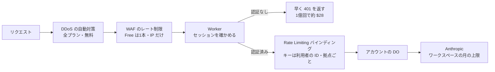

# サーバーの濫用と費用の暴走を防ぐための材料（Sign in with Apple・Cloudflare・App Attest・Anthropic API・セッション）

調査日: 2026-09-25
対象: サーバー（Cloudflare Workers + Hono、D1 にアカウントの索引・セッション・Apple の refresh token、アカウントごとに1つの Durable Object に記録と Anthropic の呼び出し）を、濫用と費用の暴走から守る方法を決めるための一次情報を集める。アプリは iPhone のネイティブの Sign in with Apple だけで、Web のサインインは無い。

> **確認の方法と限界**
> - Apple（developer.apple.com の DocC の JSON、Account Help、Support の HTML）、Cloudflare（developers.cloudflare.com の `index.md`、www.cloudflare.com/plans）、Anthropic（platform.claude.com/docs の `.md`）、IETF（rfc-editor.org と ietf.org の本文テキスト）、NIST（pages.nist.gov）、OWASP（GitHub の Cheat Sheet と ASVS 5.0 の原文）、npm レジストリ（パッケージの tarball の中身）の**本文を直接取得して読んだ**。本文で確かめた主張は「本文で確認」と書く。
> - 本文の記述から推し量ったもの、本文の数字から計算したものは「本文からの読み取り」と書き、何から読み取ったかを添える。
> - 本文や関連ページを探しても記述が無かったものは「本文を探したが記述なし」と書く。
> - `https://appleid.apple.com/auth/keys` は実際に取得し、応答ヘッダーと鍵の `alg` を見た。これは「実際の応答で確認」と書く（取得日時点の値で、変わりうる）。
> - Auth0 の文書だけは WebFetch（ページを要約して返す道具）で読んだ。標準ではなく1社の実装の例として挙げる。
> - 実機・実アカウントでの計測や、App Attest のライブラリを Workers で動かす試験はしていない。
> - 料金は取得日（2026-09-25）時点。二次情報（ブログ、まとめ記事、Qiita・Zenn、コミュニティフォーラム）は根拠にしていない。
> - 開発者自身の健康データは扱っていない。

## 結論の要約

- **Apple の ID トークンは、署名・`iss`・`aud`・`exp`・`nonce` を確かめる**（AP1）。公開鍵は `GET https://appleid.apple.com/auth/keys` で、鍵の数は変わるので `kid` で選ぶ（AP6）。Apple は鍵のキャッシュの仕方を書いていない。実際の応答は `Cache-Control: no-store` で、鍵は3つとも RS256 だった（AP7）。`nonce_supported` が `true` なのに `nonce` が無ければ失敗にする（AP2）。
- **authorization code は1回だけ使え、5 分で切れる**（AP4）。交換すると refresh token・ID トークン・アクセストークン（1 時間）が返る（AP4、AP5）。**refresh token の有効期限は書かれていない**。「無効になるまで使い続けてよい」とあり、検証は「1日1回まで」で、それより多いと絞られることがある（AP1）。client_secret の JWT は `exp` が 6 か月（15,777,000 秒）より先だとエラー（AP8）。
- **アカウント削除の時は、Sign in with Apple の REST API でトークンを失効させる**（AP12）。失効は `POST https://appleid.apple.com/auth/revoke`（AP9）。
- **サーバー間通知は4種類**: `email-disabled`、`email-enabled`、`consent-revoked`、`account-deleted`（AP10）。Apple は「自分の手順に沿ってサーバーの記録を更新する」と書くだけで、**データの削除を求める記述は無い**（AP10）。エンドポイントは主の App ID に1つ登録するので、ネイティブだけのアプリでも登録できる（AP11 からの読み取り）。
- **Workers の Rate Limiting バインディングは GA**（2025-09-19、CF2）。期間は 10 秒か 60 秒だけ。カウンターは **Cloudflare の拠点ごと**で、**寛容で結果整合**（正確な計数には使わない）（CF1）。キーには IP ではなく利用者の ID などを勧めている（CF1）。料金の記述は見つからなかった。
- **WAF のレート制限ルールは Free で1本（10 秒、IP だけ）、Pro で2本（1 分まで、IP だけ）**（CF3）。こちらもカウンターはデータセンターごと（CF4）。Pro は月 $20（年払い）か $25（月払い）（CF18）。**WAF で止めたリクエストに Workers のリクエスト料金がかかるかは、文書に記述が無い**。
- **Workers 有料は 1,000 万リクエスト/月込みで以後 $0.30/100 万、CPU は $0.02/100 万ミリ秒**（CF5）。有料プランにはリクエスト数の上限が無い（CF8）。**Durable Objects は $0.15/100 万リクエストと、128 MB 分の実時間（$12.50/100 万 GB-s）**（CF6）。**DO が Anthropic の応答を待つ間も実時間の課金が続く**（CF6 からの読み取り）。Cloudflare の予算アラートはメールだけで、**利用を止めない**（CF17）。
- **D1 は保存時に AES-256（GCM）で自動暗号化**、鍵は Cloudflare が持つ（CF13）。Workers の WebCrypto で AES-GCM が使える（CF11）。Secrets Store は**オープンベータ**（CF10）。
- **DDoS 対策は全プランで従量課金なし・上限なし（L3/4 と L7）**（CF14、CF15）。`workers.dev` は「Free のサイトとして扱い、本番は route か独自ドメインで」と勧めている（CF16）。
- **App Attest は「Apple のハードウェア上で改ざんされていないアプリ」を証明する**（AP20）。全端末では使えず（Mac では `false`）、使えない端末では**サーバーも assertion を必須にできない**（AP20、AP24）。attest の呼び出しは全体で毎秒 100 未満を勧める（AP23）。Workers の `node:crypto` は `X509Certificate` を含めて使える（CF12）ので、既存の JS ライブラリ（`node:crypto` 依存）が動く見込みはあるが、試していない。
- **Anthropic の上限到達には2種類ある**。階層の上限（Start $500/月など）に届くと 429 `rate_limit_error`（`error_code: enforced_spend_limit_reached`、`retry-after` なし）。自分で決めた上限に届くと 400 `invalid_request_error`（AN1）。ワークスペースごとに月の支出上限と、閾値でのアラートを設定できる（AN2）。`metadata.user_id` は UUID やハッシュなどの不透明な値にし、Anthropic は濫用の検知に使うことがある（AN3）。
- **セッション**: OWASP は非活動と絶対の両方のタイムアウトを求めるが、例は Web の値で、モバイル・ネイティブ向けの記述は無い（OW1）。NIST SP 800-63B-4 は AAL1 で「全体のタイムアウトを 30 日以内に」としている（NI1）。RFC 9700 は、公開クライアントの refresh token には「送信者制約」か「ローテーション」を求める（IE1）。**ネットワークが不安定な時の猶予期間は、RFC 9700 にも OAuth 2.1 の草案にも記述が無い**。Auth0 は既定で無効の「leeway」を実装している（A01）。

## 1. Sign in with Apple（ネイティブ iOS）

出典の番号は末尾の「出典一覧」。

| 問い | 答え | 確かさ | 出典 |
|---|---|---|---|
| ID トークンの検証手順 | サーバーは「Apple の公開鍵で JWS の署名を確かめる」「`nonce` を確かめる」「`iss` が `https://appleid.apple.com`」「`aud` が自分の `client_id`」「現在時刻が `exp` より前」を確かめる | 本文で確認 | AP1 |
| 署名の方式 | AP1 は「JWS E256」と書くが、実際の JWKS の鍵は3つとも `alg: RS256`（RSA）だった。ヘッダーの `kid` と `alg` に合わせて検証すればよい | 前半は本文で確認、後半は実際の応答で確認 | AP1、AP7 |
| クレーム | `iss`、`sub`（チーム内で一意・不変。利用をやめて再開しても同じ）、`aud`、`iat`、`exp`、`nonce`（要求で渡した時だけ入る）、`nonce_supported`、`email`、`email_verified`、`is_private_email`、`real_user_status`、`transfer_sub` など | 本文で確認 | AP2 |
| `nonce_supported` の扱い | `nonce` を送ったのにトークンに無い時は、`nonce_supported` を見る。`true` なら `nonce` を必須として失敗にする。そうでなければ任意として進めてよい | 本文で確認 | AP2 |
| `email` を識別子に使えるか | 使わない。識別子は `sub` を使う | 本文で確認 | AP2、AP3 |
| `real_user_status` | 0 = Unsupported、1 = Unknown、2 = LikelyReal。LikelyReal なら追加の不正対策や CAPTCHA を省いてよい。Unknown でもサービスを止めない。**初回のサインインの時だけ返る** | 本文で確認 | AP2、AP3 |
| ID トークンの有効期間 | 何分かの記述は無い | 本文を探したが記述なし | AP1、AP2 |
| JWKS の URL | `GET https://appleid.apple.com/auth/keys`。ID トークンとサーバー間通知の両方の署名の検証に使う | 本文で確認 | AP6 |
| 鍵の入れ替わり | 「複数の鍵を返すことがあり、数は時とともに変わる。一致する `kid` の鍵を選ぶ」 | 本文で確認 | AP6 |
| JWKS のキャッシュ | Apple の文書にキャッシュの推奨は無い。応答ヘッダーは `Cache-Control: no-store` と `Pragma: no-cache` | 前半は本文を探したが記述なし、後半は実際の応答で確認 | AP6、AP7 |
| authorization code | 「1回だけ使え、5 分有効」 | 本文で確認 | AP4 |
| code の交換で返るもの | `POST https://appleid.apple.com/auth/token`（`grant_type=authorization_code`）で、`access_token`（`expires_in: 3600`）、`refresh_token`、`id_token` が返る | 本文で確認 | AP4、AP5 |
| refresh token の検証で返るもの | `grant_type=refresh_token` で、`access_token` と `id_token` が返る。**新しい refresh token は返らない** | 本文で確認 | AP4、AP5 |
| refresh token の有効期限 | 期限の記述は無い。「パスワードの変更や、利用者がアプリへのアクセスを取り消した時などに無効になるまで、同じ refresh token を使い続けてよい」 | 本文で確認 | AP1、AP5 |
| refresh token を検証してよい頻度 | 「1日1回まで検証してよい」「1日1回より多いと Apple のサーバーが絞ることがある」 | 本文で確認 | AP1 |
| 端末でのセッションの持ち方 | セッションの寿命を `getCredentialState(forUserID:)` の成功に結びつけてよい（端末内の安価な呼び出しでネットワークを使わない）。新しい ID トークンの取得には利用者の操作が要り、起動のたびや1日1回より多く求めると絞られて失敗することがある。Apple 以外の端末では refresh token の定期的な検証でセッションの寿命を決める | 本文で確認 | AP1 |
| refresh token の保存 | 「サーバーに安全に保存する」 | 本文で確認 | AP5 |
| client_secret | ES256（P-256 + SHA-256）で署名した JWT。`iss` = Team ID、`sub` = `client_id`、`aud` = `https://appleid.apple.com`。**`exp` が 15,777,000 秒（6 か月）より先だとエラー** | 本文で確認 | AP8 |
| 失効のエンドポイント | `POST https://appleid.apple.com/auth/revoke`（`client_id`、`client_secret`、`token`、`token_type_hint` = `refresh_token` か `access_token`）。失効に成功しても、すでに無効でも 200 を返す | 本文で確認 | AP9 |
| 失効に要るもの | 有効な refresh token かアクセストークンが要る。どちらも無ければ、authorization code を検証してトークンを作る | 本文で確認 | AP9 |
| アカウント削除の要件 | アカウントを作れるアプリは、アプリの中から削除を始められるようにする。削除は「アカウントと、法的に保つ必要のないデータを消す」。**Sign in with Apple を使うアプリは REST API でトークンを失効させる**。手作業で時間がかかってもよいが、かかる時間を伝え、終わったら知らせる。削除の前に本人確認を足してよい | 本文で確認 | AP12 |
| サーバー間通知の種類 | `email-disabled`、`email-enabled`、`consent-revoked`（アプリへの同意を取り消し、資格情報が無効になった）、`account-deleted`（Apple アカウントの完全な削除を依頼した）。依頼文の「account-delete」は、文書では `account-deleted` | 本文で確認 | AP10 |
| 各通知で求められること | メール転送の通知は「送ってよいかの記録を更新する」。`consent-revoked` と `account-deleted` は「自分の手順に沿ってサーバーの記録を更新する」とだけある。**データを消せという記述は無い** | 本文で確認（削除の要求は本文を探したが記述なし） | AP10 |
| `account-deleted` の時の Apple 側の動き | すべてのトークンを無効にし、メール転送を止める。ネイティブアプリには `credentialRevokedNotification` を送らないので、`getCredentialState(forUserID:)` で応じる | 本文で確認 | AP10 |
| 通知の形と検証 | Apple の秘密鍵で署名した JWS を `{"payload": "<JWT>"}` の形で POST する。ヘッダーの `alg` で署名を確かめ（鍵は AP6 の JWKS）、`events` クレームの `type` で処理を分ける。例の中身は `iss`、`aud`、`iat`、`jti`、`events`（`type`、`sub`、`event_time`、メールの通知では `email`、`is_private_email`） | 本文で確認 | AP10 |
| 通知の登録 | Certificates, Identifiers & Profiles で App ID の Sign in with Apple を Configure し、URL を入れる。**URL は主の App ID にだけ登録できる**。「Sign in with Apple のアプリのグループと鍵ごとに1つ」。TLS 1.2 以上が要る | 本文で確認 | AP11、AP10 |
| ネイティブだけのアプリで使えるか | 登録先が App ID なので使える。Web 用の Services ID は要らない | 本文からの読み取り（AP11 の登録手順から） | AP11 |
| 通知が届かない・順序が変わる時の再送 | 再送や順序の記述は無い | 本文を探したが記述なし | AP10、AP11 |

## 2. Cloudflare

| 問い | 答え | 確かさ | 出典 |
|---|---|---|---|
| Rate Limiting バインディングの設定 | `ratelimits` に `name`、`namespace_id`（アカウント内で一意の整数を文字列で）、`simple.limit`、`simple.period` を書く。**`period` は 10 か 60（秒）だけ**。`simple` だけが使える。Wrangler 4.36.0 以上が要る | 本文で確認 | CF1 |
| `namespace_id` の共有 | 同じ `namespace_id` のバインディングは、別の Worker でも同じキーのカウンターを共有する | 本文で確認 | CF1 |
| 正確さ | 「寛容で、結果整合で、正確な計数の仕組みとしては作っていない」。カウンターはその機械にキャッシュし、同じ拠点の保存先と非同期に同期する。`limit()` の `await` はネットワークを待たない | 本文で確認 | CF1 |
| 範囲 | **Cloudflare の拠点ごと**。キーごとに拠点ごとの上限になる | 本文で確認 | CF1 |
| キーの選び方 | 良い例: `Authorization` の API キー、URL のパスやルート、利用者の ID・テナントの ID。**IP や地域は勧めない**（モバイル回線やプライバシーのプロキシで多くの人が共有する） | 本文で確認 | CF1 |
| GA か | 2025-09-19 に GA。「本番のすべての用途に勧める」 | 本文で確認 | CF2 |
| 料金 | バインディングの文書にも Workers の料金ページにも料金の記述は無い | 本文を探したが記述なし | CF1、CF5 |
| 監視 | ダッシュボードには出ない。Workers Logs で 429 を見るか、Analytics Engine に自分で書く | 本文で確認 | CF1 |
| WAF のレート制限ルール（Free） | 1本。式に使えるのは Path と Verified Bot。数える特性は IP だけ。期間 10 秒、止める時間 10 秒 | 本文で確認 | CF3 |
| WAF のレート制限ルール（Pro） | 2本。式に Host、URI、Path、Full URI、Query。数える特性は IP だけ。期間は 1 分まで、止める時間は 1 時間まで | 本文で確認 | CF3 |
| WAF のカウンターの範囲 | データセンターごと（同じ地域のデータセンターは共有）。全体で共有するカウンターは無い。数え始めから反映まで数秒遅れることがあり、その間の超過分は通る | 本文で確認 | CF3、CF4 |
| WAF のレート制限の料金 | 旧版は従量課金だったと書くが、今の版はプランに含まれ、別の料金の記述は無い。Pro は月 $20（年払い）か $25（月払い） | 前半は本文からの読み取り、後半は本文で確認 | CF3、CF18 |
| WAF で止めたリクエストは Workers の課金に入るか | Workers の料金・ルーティング・WAF の文書を探したが記述が無い | 本文を探したが記述なし | CF5、CF3 |
| Workers の料金 | Free: 1日 10 万リクエスト。有料（Standard）: 月 1,000 万リクエストを含み、以後 $0.30/100 万。CPU は月 3,000 万ミリ秒を含み、以後 $0.02/100 万ミリ秒。実時間は課金しない。有料プランは月 $5 から | 本文で確認 | CF5 |
| Workers のリクエスト数の上限 | 有料プランは「No limit」 | 本文で確認 | CF8 |
| Durable Objects の料金 | 有料: リクエストは月 100 万を含み、以後 $0.15/100 万（HTTP、RPC のセッション、WebSocket のメッセージ、アラームを含む）。実時間は月 40 万 GB-s を含み、以後 $12.50/100 万 GB-s。**使ったメモリにかかわらず 128 MB 分を課金**。超過分は次の単位に切り上げる | 本文で確認 | CF6 |
| DO の実時間の課金はいつかかるか | 動いている間と、メモリにいて休止（hibernate）できない間。休止できる状態なら課金しない。同時に動くリクエストは実時間を分け合う | 本文で確認 | CF6 |
| DO 1つの処理能力 | 1つの Object は毎秒 1,000 リクエストが目安の上限（soft limit）。超えると待ち行列に入れたのち overloaded を返す | 本文で確認 | CF7 |
| 費用の警告 | 予算アラートは、アカウント全体の従量課金が閾値を超えた時にメールを1通送る。**利用を止めたり上限をかけたりはしない**。製品ごとの利用量の通知もある | 本文で確認 | CF17 |
| Secrets | 暗号化した文字列のバインディング。値は Wrangler とダッシュボードで見えない。Worker からは普通の環境変数と同じに見える | 本文で確認 | CF9 |
| Secrets Store | アカウント単位の秘密の置き場。**オープンベータ**。Workers と AI Gateway で使える | 本文で確認 | CF10 |
| WebCrypto | `crypto.subtle` で AES-GCM（暗号化・復号・鍵の生成・wrap）、HMAC、ECDSA、RSASSA、HKDF、PBKDF2、SHA-256 などが使える。`crypto.subtle.timingSafeEqual` もある | 本文で確認 | CF11 |
| `node:crypto` | 「すべての `node:crypto` の API を完全にサポートする」。例外は DSA・DH の鍵ペアの生成、`argon2`、ed448・x448、FIPS モードの切り替えだけ。互換日 2026-08-04 以降は `nodejs_compat` が既定で有効 | 本文で確認 | CF12 |
| D1 の保存時の暗号化 | 生きている DB も使っていない DB もメタデータも、AES-256（GCM）で自動で暗号化する。設定は要らない。鍵は Cloudflare が管理する | 本文で確認 | CF13 |
| DDoS 対策 | 全プラン・全サービスに、従量課金なし・上限なしの L3/4/7 の対策。HTTP の DDoS 対策も全プラン | 本文で確認 | CF14、CF15 |
| `workers.dev` と独自ドメイン | 本番は route か独自ドメインで動かすよう勧める。`workers.dev` は「Free のサイトとして扱い、個人や趣味の、事業に欠かせないものではない用途向け」。`workers_dev = false` で止められる | 本文で確認 | CF16 |
| `workers.dev` に WAF のルールを掛けられるか | 明記は無い。WAF のルールはゾーン（自分のドメイン）の設定なので、自分のゾーンではない `workers.dev` には掛けられないと読める | 本文からの読み取り（CF3 がゾーンの設定として書いていること、CF16 から） | CF3、CF16 |

## 3. Apple App Attest / DeviceCheck

| 問い | 答え | 確かさ | 出典 |
|---|---|---|---|
| 何を証明するか | Secure Enclave の鍵が「Apple のハードウェア上で動く、改ざんされていないアプリ」のものだと Apple が証明する。以後、その鍵でリクエストに署名（assertion）する | 本文で確認 | AP20 |
| 何を証明しないか | OS を改造した端末は制限を回避しうる。1台の改造端末で多くの偽のアプリに assertion を配る攻撃に備え、リスクの指標を使う | 本文で確認 | AP22 |
| 使える端末 | iOS 14 以上。`isSupported` を確かめ、使えなければ静かに迂回する。**使えない端末では、サーバーも assertion を必須にできない**。Mac（Mac Catalyst、Apple silicon 上の iOS アプリを含む）では `false`。拡張機能はほぼ未対応 | 本文で確認 | AP20、AP24、AP25 |
| シミュレーター | 文書に記述が無い | 本文を探したが記述なし | AP20、AP23、AP24 |
| 開発と本番 | 開発は sandbox で、鍵を本番の数に入れない。sandbox の `aaguid` は `appattestdevelop`（AP21）または `appattestsandbox`（AP23）と書かれている。TestFlight・App Store の配布物は常に本番。sandbox と本番の鍵とレシートは混ぜられない | 本文で確認（`aaguid` の表記は2つのページで違う） | AP21、AP23 |
| 鍵の数 | 利用者ごと・端末ごとに1つ。複数の利用者で同じ鍵を使わない。再インストール、端末の移行、バックアップからの復元で鍵は消えるので作り直す | 本文で確認 | AP20 |
| attest の失敗 | `serverUnavailable` なら同じ鍵で後で再試行。ほかのエラーなら鍵の ID を捨てて作り直す | 本文で確認 | AP20 |
| attestation の検証 | CBOR（`fmt: apple-appattest`、`attStmt.x5c`、`receipt`、`authData`）を解く。`x5c` を App Attest のルート証明書まで検証。`SHA256(authData ‖ SHA256(challenge))` が証明書の拡張 OID `1.2.840.113635.100.8.2` の値と一致。公開鍵の SHA-256 が鍵の ID と一致。`RP ID` が App ID の SHA-256。`counter` が 0。`aaguid` が環境に合う。`credentialId` が鍵の ID。`extensions` の検証区分（App Store = 4、TestFlight = 2 など）と版 | 本文で確認 | AP21 |
| challenge | サーバーが一度きりのランダムな値を出し、覚えておく。16 バイト以上 | 本文で確認 | AP20、AP21 |
| 保存するもの | 検証した公開鍵とレシートを、利用者と端末に結びつけて保存する。公開鍵が別の利用者に結びついていないことを確かめる。1人に複数の（鍵、レシート）を持てるようにする | 本文で確認 | AP21 |
| assertion の検証 | `SHA256(authenticatorData ‖ SHA256(clientData))` に対し、保存した公開鍵で署名を検証。`RP ID` を確かめる。**`counter` は前回より大きい**（初回は 0 より大きい）。clientData の challenge を確かめる。検証区分と版を確かめる。通ったら `counter` を保存 | 本文で確認 | AP21 |
| assertion の回数 | 1つの鍵での assertion の回数に制限は無い。ふつうはプレミアムな内容の取得のような重要な場面だけに使う | 本文で確認 | AP20 |
| リスクの指標 | レシートを Apple のサーバー（本番 `https://data.appattest.apple.com/v1/attestationData`）に送ると、その端末で過去 30 日に証明された鍵の数のおおよその値が返る。レシートには「Not Before」と有効期限があり、指標が欲しければ期限の前に定期的に更新する | 本文で確認 | AP22 |
| 段階的な導入 | 利用者が多いなら段階的に有効にする。目安は1アプリ1日 1,000 万人まで。**attest の呼び出しは全体で毎秒 100 未満を勧める**。上限は動的に変わるので、エラーに備え、呼び出しを減らす仕組みを持つ | 本文で確認 | AP23 |
| DeviceCheck（`DCDevice`） | 端末ごとに Apple のサーバーに2ビットを持てる。端末の一時トークンをサーバーから Apple に送って読み書きする | 本文で確認 | AP26 |
| Workers で検証できるか | 要るのは CBOR の解読、X.509 の鎖の検証、ECDSA P-256 の検証、SHA-256。WebCrypto に ECDSA と SHA-256 があり（CF11）、`node:crypto` は `X509Certificate` を含めて使える（CF12）。道具はそろう | 本文からの読み取り（CF11、CF12 から）。動かしてはいない | CF11、CF12 |
| JS のライブラリ | `node-app-attest` 1.0.1（2026-02、依存: `cbor`・`pkijs`・`asn1js`、`crypto` の `X509Certificate`・`createVerify` を使う）。`appattest-checker-node` 1.0.3（2024-10、依存: `cbor`・`@peculiar/x509`、`crypto` と `crypto.webcrypto` を使う）。どちらも Workers への対応はうたっていない | 本文で確認（tarball の中身） | NPM1、NPM2 |
| 署名の形式の注意 | AP21 の assertion の例の `signature` は `30 45 02 20 …` で始まる DER 形式に見える。WebCrypto の ECDSA の `verify` は r‖s の形式を受け取るので、`crypto.subtle` で検証するなら変換が要る。`node:crypto` の `createVerify` は DER を受け取る | 本文からの読み取り（AP21 の例のバイト列から。WebCrypto の仕様は今回取得していない） | AP21 |

## 4. Anthropic API

| 問い | 答え | 確かさ | 出典 |
|---|---|---|---|
| 組織の月の上限（階層の上限） | Start $500、Build $1,000、Scale $200,000（USD/月）。Custom は上限なし。新しい組織は、これより低い Evaluation の階層から始まることがある | 本文で確認 | AN1 |
| 階層の上限に届くと | 翌月1日 00:00 UTC まで止まる。**HTTP 429、`type: rate_limit_error`、`error.details.error_code: enforced_spend_limit_reached`、`retry-after` ヘッダーなし**。SDK の自動再試行も失敗し続ける | 本文で確認 | AN1 |
| 自分で決めた上限 | Billing で階層の上限より低い上限を設定できる。届くと **HTTP 400、`invalid_request_error`**。メッセージは「You have reached your specified API usage limits」、ワークスペースの上限なら「…specified workspace API usage limits」で、再開の時刻を書く | 本文で確認 | AN1 |
| ワークスペースの上限 | ワークスペースごとに、Rate limits のタブでモデルの階層ごとの RPM・入力トークン・出力トークンを、Spend limits のタブで**月の支出の上限と、閾値に届いた時のアラート**を設定する。既定のワークスペースには上限を設定できない。組織の上限は常にかかる | 本文で確認 | AN1、AN2 |
| レート制限に届くと | 429 とどの上限に触れたか、`retry-after` ヘッダー。急に増やすと「加速の上限」で 429 が出ることがあるので、徐々に増やす | 本文で確認 | AN1 |
| ワークスペースの数 | 組織あたり既定で最大 100 | 本文で確認 | AN2 |
| `metadata.user_id` | 「リクエストに結びつく利用者の外部の識別子。UUID、ハッシュ値などの不透明な識別子にする。Anthropic は濫用の検知に使うことがある。名前・メール・電話番号などを入れない」。最大 512 文字 | 本文で確認 | AN3 |
| 1回の呼び出しの費用 | 今回は調べていない。`docs/research/food-photo-llm.md` を見る | — | — |

## 5. セッションの設計の参考

| 問い | 答え | 確かさ | 出典 |
|---|---|---|---|
| 非活動と絶対のタイムアウト | 「すべてのセッションに非活動のタイムアウトを」「すべてのセッションに、活動にかかわらず絶対のタイムアウトを」。サーバー側で強制する | 本文で確認 | OW1 |
| 値の例 | 非活動: 価値の高いアプリで 2〜5 分、リスクの低いアプリで 15〜30 分。絶対: 事務の人が1日使うなら 4〜8 時間。どれも Web の例 | 本文で確認 | OW1 |
| モバイル・ネイティブの指針 | Session Management Cheat Sheet と ASVS 5.0 の V7 には、モバイル・ネイティブ向けの値や扱いの記述は無い | 本文を探したが記述なし | OW1、OW2 |
| ASVS 5.0 の要件 | 非活動のタイムアウトと絶対の最長寿命を、リスク分析に基づいて決めて文書にする（7.1.1、7.3.1、7.3.2）。参照トークンは CSPRNG で 128 ビット以上（7.2.3）。ログアウトや期限切れでバックエンドのセッションを無効にする（7.4.1）。アカウントの無効化・削除で全セッションを終える（7.4.2） | 本文で確認 | OW2 |
| NIST の値 | 全体のタイムアウトを必ず決める。AAL1 は 30 日以内（SHOULD）、非活動は任意。AAL2 は 24 時間以内、非活動 1 時間以内。値は端末の種類（モバイルアプリか Web か）などで変わりうる | 本文で確認 | NI1 |
| セッショントークンをハッシュで保存 | Cheat Sheet は「ログにはセッション ID ではなく塩つきのハッシュを書く」とだけあり、DB にハッシュで保存せよという記述は無い。ASVS 5.0 の V7 にも無い | 本文で確認（保存の要件は本文を探したが記述なし） | OW1、OW2 |
| 更新（renewal）の注意 | 途中で ID を入れ替える renewal timeout は、実装によって攻撃者が先に新しい ID を得る競合がありうる | 本文で確認 | OW1 |
| refresh token の保護（RFC 9700） | 公開クライアントでは、「送信者制約」（RFC 8705、RFC 9449 の DPoP）か「ローテーション」のどちらかで再利用を検出しなければならない（MUST）。ローテーションでは、無効になった古いトークンが出されたら、どちらが出したか区別できないので有効なトークンを失効させ、正当なクライアントも再認可が要る。使われない期間が続いたら refresh token を失効させるべき（SHOULD） | 本文で確認 | IE1 |
| 猶予期間（grace period） | RFC 9700 と OAuth 2.1 の草案（draft-ietf-oauth-v2-1-15）に、再試行やネットワークの失敗に備えた猶予期間の記述は無い | 本文を探したが記述なし | IE1、IE2 |
| 実装の例（Auth0） | ローテーションに「leeway」（秒で設定、既定は無効）がある。「クライアントが同じ refresh token で再試行した時に、ネットワークの並行性の問題でトークンが無効になるのを防ぐ」ため。その間は検出が働かず、1つ前のトークンだけ再利用できる | WebFetch の要約で確認 | A01 |

## 大量のリクエストの費用の目安

本文からの読み取り（CF5、CF6 の単価からの計算）。有料プランの月 $5 と、含まれる量を差し引いたあとの額。Anthropic の費用は含めない。

| 場面 | 仮定 | 計算 | 月額の目安 |
|---|---|---|---|
| 認証なしで Worker が弾く | 1 億リクエスト/月、1回 1 ms の CPU | リクエスト (100M − 10M) × $0.30/M = $27.0、CPU (100M − 30M) ms × $0.02/M = $1.4 | 約 $28 |
| 同上、10 倍 | 10 億リクエスト/月 | (1,000M − 10M) × $0.30/M = $297、CPU (1,000M − 30M) × $0.02/M = $19.4 | 約 $316 |
| 認証済みで DO まで届く | 1,000 万リクエスト/月、DO で 5 ms | DO リクエスト (10M − 1M) × $0.15/M = $1.35、実時間 10M × 0.005 s × 0.128 GB = 6,400 GB-s（含まれる量の中） | 約 $1.4（Worker 側は含まれる量の中） |
| LLM の応答を DO が待つ | 1回 30 秒待つ、100 万回/月、並行しない | 1M × 30 s × 0.128 GB = 3.84M GB-s、超過 3.44M を 4M に切り上げ × $12.50/M | 約 $50 |

## nu-tori への読み取り

ここから下はすべて**本文からの読み取り**で、決定ではない。

- **止める層を3つに分けて考えられる。** 認証の前（DDoS の自動対策と、必要なら WAF）、認証のあと（Rate Limiting バインディングを利用者の ID をキーに）、費用の上限（Anthropic のワークスペースの支出上限）。Cloudflare 側には利用を止める上限が無い（CF17）ので、最後の止め金は Anthropic 側になる。

- **Rate Limiting バインディングは「目安の歯止め」で、費用の上限にはならない。** 拠点ごとで結果整合（CF1）なので、LLM の呼び出し回数のように正確に数えたいものは、アカウントの DO の中で数えるほうが合う。DO は1アカウントにつき1つなので、その DO の中の数は一か所で数えられる。
- **LLM の上限は、本番と開発用でワークスペースを分けて月の支出上限をかけられる**（AN2）。リポジトリ全体の決定「開発用の LLM のキーには低い費用の上限をかける」は、これで満たせる。上限に届いた時の応答が2種類（429 の `enforced_spend_limit_reached` と 400 の `invalid_request_error`）あるので（AN1）、アプリに返す形をサーバーで1つにそろえる必要がある。429 には `retry-after` が無く再試行は無駄になる。
- **`metadata.user_id` には、アカウントの内部 ID かそのハッシュを入れられる**（AN3）。Apple の `sub` やメールは入れない。
- **Apple の refresh token は、ログインのたびに検証しない。** 検証は1日1回まで（AP1）なので、アプリのセッションは自前のトークンで持ち、端末では `getCredentialState(forUserID:)` を併用し、Apple の refresh token の検証は1日1回以下にとどめる形が文書に沿う。refresh token に期限は書かれていないので、D1 に長く保つ前提になり、保存時に WebCrypto の AES-GCM で暗号化するかどうかを決める（D1 自体は Cloudflare の鍵で暗号化される（CF13））。
- **アカウント削除では、D1 に持つ Apple の refresh token で `/auth/revoke` を呼ぶ**（AP9、AP12）。サーバー間通知の `account-deleted` と `consent-revoked` は、Apple がデータ削除を求めていない（AP10）ので、受けた時に消すか、セッションを終えるだけにするかは nu-tori が決める。どちらの場合も、エンドポイントの署名は JWKS で検証する。
- **JWKS は Apple がキャッシュ方針を示さず `no-store` を返す**（AP6、AP7）。取得の回数を抑えるなら、`kid` が見つからない時だけ取り直す形を自分で決めることになる。
- **App Attest は、全員に必須にはできない。** 使えない端末ではサーバーも必須にできない（AP20）ので、「使える端末では LLM を呼ぶ前に assertion を求める」のような段階的な使い方になる。Workers で動くかは試作で確かめる。
- **セッションの期限の値は、標準からは決まらない。** OWASP の値は Web 向けで、ネイティブ向けの記述は無い（OW1）。NIST の AAL1 の「30 日以内」（NI1）が、長く保つセッションの上限の参考になる。ASVS は「値と理由を文書にする」ことを求める（OW2）ので、決めたら ADR に理由を書くことになる。
- **自前のトークンをローテーションするなら、弱い電波での取りこぼしに注意がいる。** RFC 9700 のローテーションは、古いトークンが出されたら失効させる（IE1）ので、応答が届かなかった再試行でもログアウトになる。標準には猶予期間の記述が無く（IE1、IE2）、Auth0 の leeway（A01）のような仕組みを自分で持つか、ローテーションをしないかを決める。
- **`workers.dev` は止めて、独自ドメインで出す**と、WAF を使える余地が残る（CF16）。ただし Free の WAF は1本・IP だけで（CF3）、Rate Limiting バインディングの文書は IP をキーにすることを勧めていない（CF1）。

## 確かめられなかったこと

- WAF のルールで止めたリクエストに、Workers のリクエスト料金がかかるか（文書に記述なし）。
- Rate Limiting バインディングの料金（文書に記述なし）。
- Apple の ID トークンの有効期間、JWKS のキャッシュの推奨、サーバー間通知の再送の有無。
- App Attest がシミュレーターで使えるか。
- App Attest の検証ライブラリが Workers で動くか（動かしていない）。
- 標準の文書での、refresh token のローテーションの猶予期間。

## 出典一覧

取得日はすべて 2026-09-25。

### Apple
- AP1: Verifying a user — https://developer.apple.com/documentation/signinwithapple/verifying-a-user
- AP2: id_token — https://developer.apple.com/documentation/signinwithapplejs/authorizationi/id_token
- AP3: Authenticating users with Sign in with Apple — https://developer.apple.com/documentation/signinwithapple/authenticating-users-with-sign-in-with-apple
- AP4: Token validation — https://developer.apple.com/documentation/signinwithapplerestapi/generate-and-validate-tokens
- AP5: TokenResponse — https://developer.apple.com/documentation/signinwithapplerestapi/tokenresponse
- AP6: Fetch Apple's public key to verify token signatures — https://developer.apple.com/documentation/signinwithapplerestapi/fetch-apple's-public-key-for-verifying-token-signature
- AP7: JWKS の実際の応答 — https://appleid.apple.com/auth/keys
- AP8: Creating a client secret — https://developer.apple.com/documentation/accountorganizationaldatasharing/creating-a-client-secret
- AP9: Token revocation — https://developer.apple.com/documentation/signinwithapplerestapi/revoke-tokens
- AP10: Processing changes for Sign in with Apple accounts — https://developer.apple.com/documentation/signinwithapple/processing-changes-for-sign-in-with-apple-accounts
- AP11: Enabling server-to-server notifications — https://developer.apple.com/help/account/configure-app-capabilities/enabling-server-to-server-notifications
- AP12: Offering account deletion in your app — https://developer.apple.com/support/offering-account-deletion-in-your-app/
- AP20: Establishing your app's integrity — https://developer.apple.com/documentation/devicecheck/establishing-your-app-s-integrity
- AP21: Validating apps that connect to your server — https://developer.apple.com/documentation/devicecheck/validating-apps-that-connect-to-your-server
- AP22: Assessing fraud risk — https://developer.apple.com/documentation/devicecheck/assessing-fraud-risk
- AP23: Preparing to use the app attest service — https://developer.apple.com/documentation/devicecheck/preparing-to-use-the-app-attest-service
- AP24: isSupported — https://developer.apple.com/documentation/devicecheck/dcappattestservice/issupported
- AP25: DCAppAttestService（対応 OS） — https://developer.apple.com/documentation/devicecheck/dcappattestservice
- AP26: Accessing and modifying per-device data — https://developer.apple.com/documentation/devicecheck/accessing-and-modifying-per-device-data

### Cloudflare
- CF1: Rate Limiting（Workers のバインディング） — https://developers.cloudflare.com/workers/runtime-apis/bindings/rate-limit/
- CF2: Rate Limiting in Workers is now GA（2025-09-19） — https://developers.cloudflare.com/changelog/post/2025-09-19-ratelimit-workers-ga/
- CF3: Rate limiting rules（WAF） — https://developers.cloudflare.com/waf/rate-limiting-rules/
- CF4: Request rate calculation — https://developers.cloudflare.com/waf/rate-limiting-rules/request-rate/
- CF5: Workers Pricing — https://developers.cloudflare.com/workers/platform/pricing/
- CF6: Durable Objects Pricing — https://developers.cloudflare.com/durable-objects/platform/pricing/
- CF7: Durable Objects Limits — https://developers.cloudflare.com/durable-objects/platform/limits/
- CF8: Workers Limits — https://developers.cloudflare.com/workers/platform/limits/
- CF9: Secrets — https://developers.cloudflare.com/workers/configuration/secrets/
- CF10: Secrets Store — https://developers.cloudflare.com/secrets-store/
- CF11: Web Crypto — https://developers.cloudflare.com/workers/runtime-apis/web-crypto/
- CF12: node:crypto — https://developers.cloudflare.com/workers/runtime-apis/nodejs/crypto/
- CF13: D1 Data security — https://developers.cloudflare.com/d1/reference/data-security/
- CF14: Cloudflare DDoS Protection — https://developers.cloudflare.com/ddos-protection/
- CF15: DDoS Protection About — https://developers.cloudflare.com/ddos-protection/about/
- CF16: workers.dev — https://developers.cloudflare.com/workers/configuration/routing/workers-dev/
- CF17: Budget alerts — https://developers.cloudflare.com/billing/manage/budget-alerts/
- CF18: Plans（Pro の価格） — https://www.cloudflare.com/plans/

### Anthropic
- AN1: Rate limits（Spend limits を含む） — https://platform.claude.com/docs/en/api/rate-limits
- AN2: Workspaces — https://platform.claude.com/docs/en/manage-claude/workspaces
- AN3: Messages API（`metadata.user_id`） — https://platform.claude.com/docs/en/api/messages

### セッションと OAuth
- OW1: OWASP Session Management Cheat Sheet — https://cheatsheetseries.owasp.org/cheatsheets/Session_Management_Cheat_Sheet.html（原文 https://github.com/OWASP/CheatSheetSeries/blob/master/cheatsheets/Session_Management_Cheat_Sheet.md）
- OW2: OWASP ASVS 5.0 V7 Session Management — https://github.com/OWASP/ASVS/blob/master/5.0/en/0x16-V7-Session-Management.md
- NI1: NIST SP 800-63B-4 — https://pages.nist.gov/800-63-4/sp800-63b.html
- IE1: RFC 9700 Best Current Practice for OAuth 2.0 Security（4.14 Refresh Token Protection） — https://www.rfc-editor.org/rfc/rfc9700
- IE2: The OAuth 2.1 Authorization Framework（draft-ietf-oauth-v2-1-15） — https://datatracker.ietf.org/doc/html/draft-ietf-oauth-v2-1-15
- A01: Auth0 Configure Refresh Token Rotation（WebFetch で読んだ） — https://auth0.com/docs/secure/tokens/refresh-tokens/configure-refresh-token-rotation

### npm
- NPM1: node-app-attest 1.0.1 — https://www.npmjs.com/package/node-app-attest
- NPM2: appattest-checker-node 1.0.3 — https://www.npmjs.com/package/appattest-checker-node
