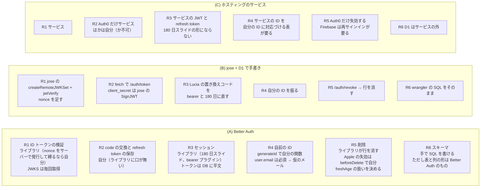

# サーバーの認証をライブラリに任せられるかの材料（Better Auth・Lucia・Auth.js・OpenAuth・ホスティングのサービス・jose）

調査日: 2026-09-26
対象: サーバー（TypeScript、Cloudflare Workers + Hono、D1 にアカウントの索引・セッション・Apple の refresh token・テスト用のユーザー、アカウントごとに1つの Durable Object に記録）の認証を、手で書かずにライブラリやサービスに任せられるかを決めるための一次情報を集める。アプリは iPhone のネイティブの Sign in with Apple（AuthenticationServices）だけで、アプリは ID トークンと authorization code を受け取る。Web のサインインと Cookie は無い。

サーバーに要ることは次の6つ。以下、表の中ではこの番号で指す。

- **R1** Apple の ID トークンを検証する（JWKS、`iss`・`aud`・`exp`・`nonce`）
- **R2** authorization code を Apple と交換し、Apple の refresh token を保つ（アカウント削除のときに `/auth/revoke` を呼ぶため）
- **R3** 自前のセッションを発行する（アプリには不透明な bearer トークン。非活動で約 180 日のスライドする期限、絶対の期限なし。行を消せば失効）
- **R4** 自前のアカウント ID を振る（Apple の `sub` を外に出さない）
- **R5** アカウントをすぐ消す（Apple のトークンの失効を含む）
- **R6** D1 のスキーマを自分で持つ（wrangler の D1 マイグレーションの素の SQL で管理する）

Apple 側の事実（ID トークンの検証手順、code の交換、refresh token に期限が無いこと、失効の API、削除の要件）は `docs/research/server-abuse-prevention.md` の「1. Sign in with Apple」にあり、ここでは繰り返さない。

> **確認の方法と限界**
> - Better Auth は GitHub の公式リポジトリを**タグ `v1.7.6`（2026-09-24、npm の `latest`）で取得し、文書の原文（`docs/content/docs/**/*.mdx`、better-auth.com/docs の元）とソースを直接読んだ**。本文やソースで確かめた主張は「本文で確認」と書き、ソースで確かめたものは出典にファイル名を添える。
> - Lucia（GitHub の `lucia-auth/lucia` の main、lucia-auth.com の HTML）、Pilcrow のブログ、OpenAuth（`openauthjs/openauth` の既定ブランチ）、Auth.js（`nextauthjs/next-auth` の main の文書とソース）、`@hono/auth-js`（`honojs/middleware` の README とソース）、Hono（`honojs/website` の文書、`honojs/hono` のタグ `v4.13.9` のソース）、jose（`panva/jose` のタグ `v6.2.12` の文書）、supabase/auth（既定ブランチのソース）、Supabase の文書の原文（`supabase/supabase` の mdx）、Firebase の文書の HTML、npm レジストリのメタデータ（版、公開日、`deprecated`）も**本文を直接取得して読んだ**。
> - **次は WebFetch（ページを要約して返す道具）で読んだ**。要約を経ているので、引用の語句は要約の出力に頼る: Better Auth のセキュリティ勧告の一覧（GitHub の Security タブ、4 ページ）、Auth.js の告知（GitHub Discussion #13252）、Clerk の文書と料金、Auth0 の文書・サポート記事・料金、Supabase と Firebase の料金。
> - 本文の記述から推し量ったもの、本文の数字から計算したもの、ソースの流れを追って判断したものは「本文からの読み取り」と書き、何から読み取ったかを添える。
> - 本文やソースを探しても記述が無かったものは「本文を探したが記述なし」と書く。
> - **どれも動かしていない。** Better Auth を Workers + D1 で動かす、ネイティブの ID トークンでサインインする、といった試験はしていない。
> - GitHub の全体の勧告データベース（`api.github.com/advisories`）は、このセッションからは読めなかった。勧告はリポジトリの Security タブで数えた。
> - 料金は取得日（2026-09-26）時点。二次情報（ブログ、まとめ記事、Qiita・Zenn、コミュニティフォーラム）は根拠にしていない。
> - 開発者自身の健康データは扱っていない。

## 結論の要約

- **Better Auth（1.7.6、MIT）は Workers + D1 + Hono で動く作りになっている**（BA14、BA15、BA16）。D1 のバインディングをそのまま `database` に渡せ、Kysely の D1 用の方言を内蔵している。`AsyncLocalStorage` のために `nodejs_compat`（か `nodejs_als`）が要る（BA16）。
- **R1 は Better Auth に任せられる**。`signIn.social({ provider: "apple", idToken: { token, nonce } })` で、リダイレクトなしにサインインしてセッションを返す（BA2、BA4）。検証は jose の `jwtVerify` で `iss`・`aud`・`maxTokenAge: "1h"` と、`nonce` の一致（生の値か SHA-256）を見る（BA5、BA6）。ただし **`nonce` はクライアントが送った値と比べるだけで、送らなければ比べない**（BA6）。**Apple の JWKS は検証のたびに取りに行き、キャッシュしない**（BA5）。
- **R2 は Better Auth ではできない**。ID トークンの流れには authorization code を受け取る口が無く、Apple との交換をしない。本文に `refreshToken` を渡しても、アカウントの行には `accessToken` と `idToken` しか書かない（BA4）。**Apple の refresh token は得られず、保存もされない**。
- **R5 の Apple の失効もしない**。`deleteUser` はユーザー・セッション・アカウントの行を消すだけ（BA10）。プロバイダの型に `revokeToken` はあるが、Apple のプロバイダは実装しておらず、呼ぶ箇所も無い（BA5、BA11）。`beforeDelete` のフックで自分で書くことになる。また、パスワードもメールでの確認も無い利用者は、**セッションが `freshAge`（既定 1 日）より古いと削除できない**（BA10）。
- **R3 はほぼ合う**。`expiresIn` を 180 日、`updateAge` を 1 日にすると、使われるたびに「今 + 180 日」へ延びる（BA7、BA8）。絶対の期限の設定は無い（BA8、本文を探したが記述なし）。bearer プラグインで `Authorization: Bearer` を受け付ける（BA9）。`revokeSession`・`revokeSessions` で行を消せる（BA7）。ただし **セッションのトークンは DB に平文で入る**（BA21）。
- **R4・R6 は設定で寄せられるが、Better Auth の形が残る**。ID は `advanced.database.generateId` で自分の関数にできる（BA14）。表や列の名前は `modelName`・`fields` で変えられ、表を手で作ってもよい（BA14）。ただし **`user` の `email` は必須**で、Apple がメールを返さないときは `mapProfileToUser` で仮のメールを作る必要がある（BA3、BA14）。`verification` の表も必須（BA14）。1.7.0 では 1.x の中なのに中核の表に必須の列を足し、1.7.3 で戻した（BA19）。
- **成熟度**: 1.0.0 は 2024-11-23。2026 年の 6〜9 月に安定版を 27 回出している（BA1）。2026-07-07 に Vercel に加わった（BA20）。GitHub の Security タブの公開済みの勧告は **32 件**（2024-12〜2026-08）で、多くは SSO・SCIM・OAuth プロバイダ・組織などのプラグインだが、中核の OAuth の暗黙のアカウント連携（GHSA-g38m-r43w-p2q7、High）と、レート制限の IPv6 の迂回（GHSA-p6v2-xcpg-h6xw、High）もある（BA18）。
- **Lucia は 2025 年 3 月に非推奨になった**。npm パッケージは deprecated で、リポジトリには置き換えの1ファイルのコード（`code/auth_session.ts`、0BSD、190 行）だけが残る（LU1、LU2）。このコードは、トークンを「ID.秘密」にし、**秘密の SHA-256 だけを DB に置き**、最後の検証から一定時間でスライドして切れる作りで、R3 の手書きのひな形になる（LU2）。
- **Oslo（`@oslojs/*`）と Arctic も 2026-07-29 に非推奨になった**。残るのは `@oslojs/encoding` だけ（LU4、LB5）。
- **Auth.js は保守だけの段階**。2025 年 9 月に Better Auth のチームが引き取り、「新しいプロジェクトには Better Auth を勧める」（AJ1、AJ2）。Apple はリダイレクトの流れだけで、ネイティブの ID トークンでのサインインの口は無い。`@hono/auth-js` もセッションを Cookie で読む（AJ4、AJ6）。nu-tori には合わない（本文からの読み取り）。
- **OpenAuth は「ベータ」の、自分で動かす OAuth 2.0 の認可サーバー**で、Workers でも動く（OA1）。Apple はブラウザのリダイレクトの流れだけで、ネイティブの ID トークンを受ける口は無い（OA2）。npm の最後の版は 0.4.3（2025-03-04）、リポジトリの最後のコミットは 2025-04-09（OA3）。
- **ホスティングのサービス**: Supabase・Firebase・Clerk はネイティブの ID トークン（か Clerk の iOS SDK）でサインインできるが、**Apple の refresh token を持たず、削除のときに失効させない**（SB1〜SB3、FB1、CL1）。**Auth0 だけは、ネイティブでも authorization code を Apple と交換し、Management API でユーザーを消すと Apple の refresh token を失効させる**（A01、A02）。どのサービスもユーザー ID とセッション（JWT）はサービスのもの。無料枠は Supabase 5 万 MAU、Firebase 5 万 MAU、Clerk 5 万 MRU、Auth0 2.5 万 MAU（SB4、FB2、CL2、A03）。
- **手で書くときの部品**: `jose` 6.2.12 は依存 0 で Workers を対応に挙げる。`createRemoteJWKSet` は既定で 10 分キャッシュし、知らない `kid` では 30 秒のクールダウンのあと取り直す（LB1）。Hono の `verifyWithJwks` は **呼ぶたびに JWKS を fetch し、キャッシュしない**（LB4）。`nonce` の確認はどちらにも無く、自分で書く。

## 1. Better Auth

出典の番号は末尾の「出典一覧」。

### 1.1 Workers・D1・Hono で動くか

| 問い | 答え | 確かさ | 出典 |
|---|---|---|---|
| 版と公開日 | npm の `latest` は 1.7.6（2026-09-24）。ほかに `release-1.6`（1.6.33）、`release-1.4`（1.4.22）のタグで古い系列にも修正を出している。MIT | 本文で確認 | BA1 |
| D1 を直接使えるか | 使える。例は `database: env.DB`（`import { env } from "cloudflare:workers"`）。組み込みの Kysely アダプタが、`batch`・`exec`・`prepare` を持つオブジェクトを D1 と判定し、内蔵の `D1SqliteDialect` を使う | 本文で確認（`dialect.ts`、`d1-sqlite-dialect.ts`） | BA14、BA15 |
| D1 のトランザクション | D1 の方言は対話的なトランザクションを持たず、`transaction = false` にする。SCIM プラグインは D1 では使えないと明記 | 本文で確認 | BA14、BA15 |
| Drizzle・Prisma で D1 | 使える。「D1 で Drizzle か Prisma を使うなら、`cloudflare:workers` で `env` を取り、各 ORM の D1 のガイドに従う」 | 本文で確認 | BA14 |
| Hono への組み込み | `app.all("/api/auth/*", (c) => auth.handler(c.req.raw))`。Web 標準の Request / Response なのでアダプタは要らない。ほかのルートでは `auth.api.getSession({ headers })` をミドルウェアで呼ぶ例がある | 本文で確認 | BA16 |
| Workers で要る設定 | `AsyncLocalStorage` を使うので `compatibility_flags` に `nodejs_compat`（`AsyncLocalStorage` だけなら `nodejs_als`）を足す | 本文で確認 | BA16 |
| 上の設定は今の Workers で要るか | 互換日付が 2026-08-04 以降なら `nodejs_compat` は既定で有効（server-platform.md の CF17） | 本文からの読み取り | BA16、server-platform.md |

### 1.2 Apple のネイティブの ID トークン（R1・R2）

| 問い | 答え | 確かさ | 出典 |
|---|---|---|---|
| ネイティブの ID トークンでサインインできるか | できる。`signIn.social({ provider: "apple", idToken: { token, nonce, accessToken } })`。「ID トークンを渡すとリダイレクトせず、そのままサインインする」。ID トークンの流れに対応するのは組み込みでは Apple と Google（ソースのコメント） | 本文で確認 | BA2、BA4 |
| `aud` の設定 | iOS のネイティブでは `aud` が Services ID ではなく App ID（バンドル ID）になるので、`appBundleIdentifier` を設定する。複数の `aud` を受けるなら `clientId: string[]` か `audience: string[]` | 本文で確認 | BA2、BA3 |
| 何を検証するか | jose の `jwtVerify` で署名、`issuer: "https://appleid.apple.com"`、`audience`、`maxTokenAge: "1h"`（`iat` から 1 時間）。アルゴリズムはトークンのヘッダーの `alg` を既定の許可にする | 本文で確認（`apple.ts`、`verify-id-token.ts`） | BA5、BA6 |
| `nonce` の扱い | リクエストの本文で `nonce` が来たときだけ、トークンの `nonce` と比べる。Apple は `exact-or-sha256`（生の値か、その SHA-256 の16進と一致すれば可）。**`nonce` を送らなければ比べない。比べる相手はクライアントが送った値で、サーバーが発行した値かは確かめない** | 本文で確認（`verify-id-token.ts`、`sign-in.ts`） | BA4、BA6 |
| サーバーが発行した `nonce` で縛るには | `verifyIdToken` を自分で渡すと組み込みの検証（署名・`iss`・`aud`・期限）を**置き換える**ので、それらも自分で書く | 本文で確認 | BA3 |
| JWKS の取得とキャッシュ | `getApplePublicKey(kid)` が `https://appleid.apple.com/auth/keys` を**検証のたびに fetch** し、`kid` の一致する鍵を `importJWK` する。キャッシュのコードは無い | 本文で確認（`apple.ts`） | BA5 |
| authorization code を受け取るか | 受け取らない。ID トークンの流れの本文は `token`・`nonce`・`accessToken`・`refreshToken`・`expiresAt`・`user` で、code の欄は無い。code を Apple と交換するのはリダイレクトの流れ（`validateAuthorizationCode`）だけ | 本文で確認（`sign-in.ts`、`apple.ts`） | BA4、BA5 |
| Apple の refresh token を保存するか | **しない**。本文の `refreshToken` は `getUserInfo` に渡すだけで、アカウントの行に書くのは `accessToken` と `idToken` | 本文で確認（`sign-in.ts`） | BA4 |
| メールが無いとき | ID トークンに `email` が無いと `USER_EMAIL_NOT_FOUND` で失敗する。文書は「Better Auth は今、すべてのユーザーにメールを必須にしている」とし、Apple は「初回の同意の後のサインインでは `email` を出さない」として、`mapProfileToUser` で `${profile.sub}@apple.placeholder.invalid` のような仮のメールを作る例を載せる | 本文で確認（Apple 側の挙動は Better Auth の文書の主張で、Apple の文書では確かめていない） | BA3、BA4 |
| 仮のメールに `sub` を使うと | `user.email` はセッションの応答で返るので、`sub` を含む値がアプリに渡る。乱数など `sub` と関係ない値にすれば避けられる。アカウントは `providerId` と `accountId`（= `sub`）で引くので、メールの値はサインインの照合に使われない | 本文からの読み取り（BA3 の例と、BA19 の「アカウントは `providerId` と `accountId` で識別する」から） | BA3、BA19 |
| アカウントの一覧で `sub` が出るか | `/list-accounts` は各アカウントの `accountId` を返す。Apple では `sub`。使わないなら `disabledPaths` で止める | 本文で確認（`account.ts`、オプションの型） | BA22 |
| OAuth のトークンの暗号化 | `account.encryptOAuthTokens: true` で DB に入れる前に暗号化する。既定は `false` | 本文で確認 | BA12 |
| client_secret（ES256 の JWT）の作り方 | 文書は jose の `importPKCS8` と `SignJWT` で 180 日の期限の JWT を作り、非同期のプロバイダ設定で渡す例を載せる。ネイティブの ID トークンの流れだけなら、ソース上 `clientSecret` を使う箇所は無い（リダイレクトの流れの URL 作りと code の交換だけ） | 前半は本文で確認、後半は本文からの読み取り（`apple.ts`） | BA2、BA5 |

### 1.3 セッションと bearer（R3）

| 問い | 答え | 確かさ | 出典 |
|---|---|---|---|
| 期限の設定 | `expiresIn`（既定 7 日）と `updateAge`（既定 1 日）。「使われて `updateAge` に達するたび、期限を今 + `expiresIn` に延ばす」。`disableSessionRefresh` で延長を止める | 本文で確認 | BA7、BA12 |
| 延長の条件（ソース） | `expiresAt - expiresIn + updateAge <= 今` なら `expiresAt = 今 + expiresIn` に書き換える。`updateAge: 0` なら毎回延ばす | 本文で確認（`session.ts`、`init-options.ts`） | BA8 |
| 絶対の期限 | 設定は無い。セッションのオプションは `expiresIn`・`updateAge`・`disableSessionRefresh`・`deferSessionRefresh`・`cookieCache`・`freshAge` など | 本文を探したが記述なし（`init-options.ts` のセッションの型） | BA8 |
| nu-tori の「非活動 180 日、絶対の期限なし」 | `expiresIn: 60*60*24*180`、`updateAge: 60*60*24` で表せる | 本文からの読み取り（BA7、BA8） | BA7、BA8 |
| `freshAge` | セッションの `createdAt` から `freshAge`（既定 1 日）以内を「新しい」とし、一部の操作（削除など）で求める。`0` で確認を止める | 本文で確認 | BA7 |
| bearer | `bearer()` プラグインで `Authorization: Bearer <token>` を受け、内部でセッションの Cookie に変換する。サインインの応答の `set-auth-token` ヘッダーでトークンを返す。「Cookie を使えない API のためだけに使う。実装を誤ると脆弱性になりやすい」と注意がある。`requireSignature`（既定 `false`）で署名つきのトークンだけを受ける | 本文で確認（文書と `bearer/index.ts`） | BA9 |
| ID トークンの流れの応答 | 本文に `token`（セッションのトークン）と `user` を返す | 本文で確認（`sign-in.ts`） | BA4 |
| DB でのトークンの持ち方 | `session.token` に `generateId(32)` の値を**そのまま**入れる（ハッシュにしない） | 本文で確認（`internal-adapter.ts`） | BA21 |
| 失効 | `revokeSession({ token })`、`revokeOtherSessions()`、`revokeSessions()`。`listSessions()` で一覧 | 本文で確認 | BA7 |
| リクエストごとの DB | `getSession` はセッションを DB から読み、延長が要るときは書く。`cookieCache` は Cookie に短時間キャッシュする仕組みで、bearer の流れでは使われない | 前半は本文で確認、後半は本文からの読み取り（Cookie の仕組みの説明から） | BA7、BA8 |

### 1.4 アカウントの削除（R5）

| 問い | 答え | 確かさ | 出典 |
|---|---|---|---|
| 削除の API | `user.deleteUser.enabled: true` で `deleteUser` が使える（既定は無効）。「データベースからユーザーを完全に消す」 | 本文で確認 | BA10 |
| 何を消すか | ユーザーのセッション、アカウント（プロバイダとの結びつき）、ユーザーの行 | 本文で確認（`internal-adapter.ts` の `deleteUser`） | BA10 |
| 削除の条件 | 次のどれか: パスワード、新しいセッション（`freshAge` 以内）、メールでの確認（`sendDeleteAccountVerification`）。「OAuth の利用者はパスワードが無いので、メールでの確認が要る」 | 本文で確認 | BA10 |
| nu-tori の形（パスワードもメールも無い）で | セッションの作成から `freshAge`（既定 1 日）を過ぎると `SESSION_EXPIRED` で断られる。`freshAge: 0` にするか、削除の前にもう一度サインインさせるか、自分のルートで削除を書くことになる | 前半は本文で確認（`update-user.ts`）、後半は本文からの読み取り | BA10 |
| Apple のトークンの失効 | しない。削除の流れに Apple への呼び出しは無い。プロバイダの型に `revokeToken?` があるが、Apple のプロバイダは実装しておらず、パッケージ全体で呼ぶ箇所が無い | 本文で確認（`update-user.ts`、`apple.ts`、`oauth-provider.ts`、全体の検索） | BA5、BA10、BA11 |
| 自分で足すなら | `beforeDelete` / `afterDelete` のフックがある。失効に要る Apple の refresh token は R2 のとおり Better Auth が持たないので、交換と保存から自分で書く | 前半は本文で確認、後半は本文からの読み取り | BA10、BA4 |

### 1.5 スキーマ・ID・レート制限（R4・R6）

| 問い | 答え | 確かさ | 出典 |
|---|---|---|---|
| 中核の表 | `user`（`id`、`name`、`email`（一意）、`emailVerified`、`image`（任意）、`createdAt`、`updatedAt`）、`session`、`account`（`accountId`、`providerId`、`accessToken`、`refreshToken`、`idToken` など）、`verification` | 本文で確認 | BA14 |
| 表や列の名前 | `modelName` と `fields` で変えられる（型の上の名前は元のまま）。表を追加の列で広げられる | 本文で確認 | BA14 |
| 表を手で作ってよいか | よい。「手で表を足したいなら、それでもよい。中核のスキーマは下に書いた」 | 本文で確認 | BA14 |
| マイグレーションの道具 | `npx auth migrate` と `generate`（Kysely なら SQL ファイル）。ただし **D1 は Worker からしか問い合わせられないので CLI からは直接触れず**、文書の例は Worker にマイグレーション用のエンドポイントを置いて `getMigrations` を呼ぶ | 本文で確認 | BA14、BA17 |
| wrangler の素の SQL で持てるか | 持てる見込み。表を手で作ってよく、起動時のスキーマの検証が足りない表や列を報告する（`advanced.database.validateSchema: false` で止められる）。Kysely の `generate` は設定の DB を読むので、D1 の SQL は文書の中核のスキーマから手で書くことになる | 本文からの読み取り（BA14、BA17 から） | BA14、BA17 |
| 起動時の検証の費用 | 既定で本番でも有効。Kysely は初期化のときに DB のメタデータを読む。Workers ではアイソレートの起動ごとに D1 への問い合わせが増える | 前半は本文で確認、後半は本文からの読み取り | BA14 |
| 1.x の中での中核の表の変更 | 1.7.0 で `account` に必須の `issuer` を足し、1.7.3 で戻した。「1.x の中では中核の表の移行なしに上げられるべきで、1.7 ではそれを守れなかった。中核の移行が要る変更は 2.0 に入れる」 | 本文で確認 | BA19 |
| ID の生成 | `advanced.database.generateId` に関数を渡せる（モデルごとに分けられる）。`false` で DB に任せる、`"uuid"`、`"serial"` もある | 本文で確認 | BA14 |
| レート制限 | 組み込み。本番の既定は 60 秒に 100 回。`auth.api` からの呼び出しには効かない。保存先は既定でメモリ（「サーバーレスには向かないことがある」）、ほかに `"database"`、`"secondary-storage"`、`customStorage.consume`（数えて増やすのを1回で行う） | 本文で確認 | BA13 |
| Workers での IP | `advanced.ipAddress.ipAddressHeaders: ["cf-connecting-ip"]` の例がある。IPv6 は既定で /64 ごとに数える | 本文で確認 | BA13 |

### 1.6 成熟度と保守

| 問い | 答え | 確かさ | 出典 |
|---|---|---|---|
| 歴史 | 0.0.1 が 2024-04-22、1.0.0 が 2024-11-23。1.5.0（2026-03-01）、1.6.0（2026-04-06）、1.7.0（2026-08-18） | 本文で確認 | BA1 |
| 出す頻度 | 安定版を 2026 年 6 月に 10 回、7 月に 2 回、8 月に 8 回、9 月（24 日まで）に 7 回 | 本文で確認（npm の `time` を数えた） | BA1 |
| 運営 | 2026-07-07 に「Better Auth は Vercel に加わる」。オープンソースで、フレームワークや基盤に依らない方針を続けるとする | 本文で確認 | BA20 |
| セキュリティ勧告 | Security タブの公開済みは 32 件（2024-12-30〜2026-08-11）。Critical 3、High 20、Moderate 6、Low 3。多くはプラグイン（SSO、SCIM、OAuth プロバイダ、oidc-provider、組織、API キー、passkey、device authorization、stripe） | 本文で確認（WebFetch の要約。重大度の内訳は要約から数えた） | BA18 |
| nu-tori が使う範囲に関わる勧告 | 中核の「OAuth の暗黙のアカウント連携による事前の乗っ取り」（GHSA-g38m-r43w-p2q7、High、2026-05-31）、「レート制限が IPv6 をアドレスごとに数え、接頭辞の入れ替えで迂回できる」（GHSA-p6v2-xcpg-h6xw、High、2026-05-11）、「rou3 の二重スラッシュで `disabledPaths` とレート制限を迂回できる」（GHSA-x732-6j76-qmhm、High、2025-12-15）、「`session.cookieCache` で二要素認証を迂回」（GHSA-xg6x-h9c9-2m83、High、2026-04-01） | 本文で確認（WebFetch の要約。どれが nu-tori に関わるかは本文からの読み取り） | BA18 |

## 2. Lucia

| 問い | 答え | 確かさ | 出典 |
|---|---|---|---|
| 今の状態 | 「Lucia は 2025 年 3 月に非推奨になった。npm パッケージの完全な置き換えとして `code/auth_session.ts` を見よ」。npm の `lucia`（最後は 3.2.2、2024-10-20）は deprecated で、移行のページを指す | 本文で確認 | LU1、LU2 |
| 何になったか | 1ファイルのコード（0BSD、コメント込み 190 行）と、認証の解説書「Auth Book」。lucia-auth.com は 2026 年 7 月に縮小し、置き換えに要るコードと文書だけにした。例のプロジェクトはアーカイブし、Discord は年内に閉じる | 本文で確認 | LU2、LU3、LU4 |
| 置き換えのコードの形 | トークンは「ID.秘密（32 バイトの乱数を base64）」。DB には `id`、`user_id`、`secret_hash`（SHA-256）、`token_last_verified_at`、`created_at` を置く（SQLite の DDL の例つき）。検証は ID で行を引き、`token_last_verified_at` から期限（例は 10 日）を過ぎていれば無効、秘密のハッシュを定数時間で比べ、1 時間以上たっていれば `token_last_verified_at` を今に書き換えて期限を延ばす | 本文で確認 | LU2 |
| Cookie の前提 | コメントは Cookie に入れる場合の CSRF 対策を書く。Bearer で使う場合の記述は無い | 本文で確認（Bearer は本文を探したが記述なし） | LU2 |
| 使う API | `Uint8Array.prototype.toBase64()` と `Uint8Array.fromBase64()`。Workers で使えるかは確かめていない | 前半は本文で確認、後半は未確認 | LU2 |

## 3. Auth.js（`@auth/core`）と Hono

| 問い | 答え | 確かさ | 出典 |
|---|---|---|---|
| 今の状態 | 2025 年 9 月に Better Auth のチームが保守を引き継いだ。「使い続けてよい。セキュリティと緊急の問題の保守は続ける」「新しいプロジェクトは、ほとんどのチームに Better Auth を勧める」 | 本文で確認（AJ2 は WebFetch の要約） | AJ1、AJ2 |
| 版 | `@auth/core` 0.41.3（2026-07-20）。1.0 に達していない | 本文で確認 | AJ3 |
| Apple | リダイレクトの流れ（コールバック URL `/api/auth/callback/apple`）。ネイティブの ID トークンでのサインインの記述は無い | 前半は本文で確認、後半は本文を探したが記述なし | AJ4 |
| 自分の検証を差し込む口 | Credentials プロバイダ。「この方法で認証したユーザーは DB に保存されず、セッションに JWT を使うときだけ使える」 | 本文で確認 | AJ5 |
| Hono の組み込み | `@hono/auth-js` 1.1.1（2026-02-14）。`verifyAuth()` と `getAuthUser()` は、リクエストの Cookie を Auth.js のセッションの取得に渡す | 本文で確認（README と `src/index.ts`） | AJ6 |
| nu-tori に合うか | 合わない。ネイティブの ID トークンを受ける口が無く、自前の検証を差し込むと DB のセッションを使えず、Hono の組み込みは Cookie で読む。保守だけの段階でもある | 本文からの読み取り（AJ2、AJ4〜AJ6） | — |

## 4. OpenAuth（openauthjs/openauth）

| 問い | 答え | 確かさ | 出典 |
|---|---|---|---|
| 何か | 「Web・モバイル・SPA・API のための、標準に基づく認証プロバイダ。今はベータ」。自分の基盤で動かす中央の OAuth 2.0 の認可サーバーで、Hono の上に作られ、Node.js・Bun・Lambda・Cloudflare Workers で動く。保存先は KV（Cloudflare KV、DynamoDB など）。**ユーザー管理はしない**（本人確認のあとのユーザーの検索・作成は `success` のコールバックで自分で書く） | 本文で確認 | OA1 |
| 出すトークン | アクセストークン（JWT、既定 30 日）と refresh token（既定 1 年、再利用の猶予 60 秒）。付与の種類は `authorization_code`、`refresh_token`、`client_credentials` | 本文で確認（`issuer.ts`） | OA2 |
| Apple | `AppleProvider`（OAuth 2.0、名前やメールを求めるなら `form_post`）と `AppleOidcProvider`。どちらもブラウザのリダイレクトの流れ | 本文で確認（`provider/apple.ts`） | OA2 |
| ネイティブの ID トークン | それを受ける付与やプロバイダは無い。`client_credentials` はプロバイダの `client` 関数に任せる口で、Apple のプロバイダは持たない | 本文を探したが記述なし（`issuer.ts`、`provider/`） | OA2 |
| 保守 | npm の最後の版は 0.4.3（2025-03-04）、スナップショットは 2025-03-22。リポジトリの既定ブランチの最後のコミットは 2025-04-09 | 本文で確認 | OA1、OA3 |
| nu-tori に合うか | 合わない。ネイティブの ID トークンを受けられず、セッションが JWT と refresh token の形で、ユーザー管理はどのみち自分で書く。1 年以上更新が無い | 本文からの読み取り（OA1〜OA3） | — |

## 5. ホスティングのサービス（Supabase Auth・Firebase Auth・Clerk・Auth0）

Supabase と Firebase は `docs/research/server-platform.md` の「Supabase Auth と Firebase Auth の Sign in with Apple」で詳しく調べた。ここでは、その結果に加えて確かめたことと、Clerk・Auth0 を短く並べる。

| 問い | Supabase Auth | Firebase Auth | Clerk | Auth0 | 確かさ | 出典 |
|---|---|---|---|---|---|---|
| iOS のネイティブの Apple | `signInWithIdToken`。ID トークンの付与の引数は `id_token`・`access_token`・`nonce`・`provider`・`client_id`・`issuer`・`link_identity` で、authorization code の欄は無い | `OAuthProvider.appleCredential(withIDToken:rawNonce:fullName:)` で `signIn(with:)` | iOS SDK の `clerk.auth.signInWithApple()`。ネイティブの流れには Services ID も鍵（.p8）も要らない | アプリが Apple の authorization code を Auth0 の `/oauth/token` に送り、Auth0 が Apple と交換する | 本文で確認（Clerk と Auth0 は WebFetch の要約） | SB1、SB2、FB1、CL1、A01 |
| Apple の refresh token を持つか | 持たない（code を受けない） | 「Sign in with Apple で作ったユーザーのトークンは保存しない」 | 持たない見込み（鍵が要らないので code を交換できない） | Auth0 が交換して持つ | Supabase・Firebase・Auth0 は本文で確認、Clerk は本文からの読み取り | SB2、FB1、CL1、A01 |
| 削除のときの Apple の失効 | しない（supabase/auth のソースに `auth/revoke` の呼び出しは無い） | 自動ではしない。削除の前にもう一度サインインさせ、`Auth.auth().revokeToken(withAuthorizationCode:)` を呼ぶ | 「Clerk でユーザーを消しても、Apple 側はリセットされない」（初回の流れを試し直す手順の中の注意） | Management API の `DELETE /api/v2/users/{id}` で消すと「Apple の refresh token を確かめて失効させる」 | Supabase は本文を探したが記述なし（ソース）、ほかは本文で確認（Clerk・Auth0 は WebFetch の要約） | SB3、FB1、CL1、A02 |
| ユーザー ID とセッション | サービスが持つ。アクセストークン（JWT、既定 1 時間）と、1 回だけ使える refresh token。既定ではサインアウトまで有効で、非活動のタイムアウトと絶対の期限は Pro 以上 | サービスの UID と ID トークン（JWT） | サービスのユーザー ID とセッション | サービスのユーザー ID と Auth0 のトークン | Supabase は本文で確認、ほかは本文からの読み取り | SB5、FB1、CL1、A01 |
| 小さい規模の料金 | Free 5 万 MAU（1 週間使わないと一時停止）、Pro 月 $25 から 10 万 MAU、超過 $0.00325/MAU | Spark・Blaze とも 5 万 MAU まで無料、超過は Identity Platform の料金 | Free 5 万 MRU、Pro 月 $25（年払い $20）で 5 万 MRU、超過 $0.02/MRU から | Free 2.5 万 MAU、B2C の Essentials は月 $35 から（500 MAU） | 本文で確認（WebFetch の要約） | SB4、FB2、CL2、A03 |

## 6. 手で書くときの部品

| 問い | 答え | 確かさ | 出典 |
|---|---|---|---|
| `jose` の版と対応 | 6.2.12（2026-09-05）。依存 0。Node.js・ブラウザ・Cloudflare Workers・Deno・Bun などで動く。「ランタイムによって使えないアルゴリズムがある」 | 本文で確認 | LB1、LB2 |
| `createRemoteJWKSet` のキャッシュ | キャッシュが無いか古いときに取りに行く。`cacheMaxAge` は既定 10 分（`Infinity` で期限なし）。合う鍵が無いときは、最後の取得から `cooldownDuration`（既定 30 秒）たっていれば取り直す。`timeoutDuration` は既定 5 秒。鍵はヘッダーの `alg` と `kid` で選び、ちょうど1つ合う必要がある | 本文で確認 | LB1 |
| アイソレートをまたぐキャッシュ | `jwksCache` のシンボルで、外に保存したキャッシュを渡せる。「呼び出しの間でメモリのキャッシュを保てないクラウドの実行環境のため」。`uat` が変わったら保存し直す。「メモリのキャッシュを保てる環境で使うのは望ましくない」 | 本文で確認 | LB1 |
| `nonce` の確認 | `jwtVerify` の標準の確認に `nonce` は無い。ペイロードを自分で比べる | 本文からの読み取り（LB1 の検証オプションと BA3 の例から） | LB1、BA3 |
| client_secret の作成 | Better Auth の文書も jose の `importPKCS8` と `SignJWT`（ES256、`kid`、`iss` = Team ID、`sub` = client ID、`aud` = `https://appleid.apple.com`）で作る例を載せている | 本文で確認 | BA2 |
| Hono の `jwk()` ミドルウェア | `Authorization` ヘッダー（か Cookie）の JWT を、`keys` か `jwks_uri` の鍵で検証する。`kid` を必須にし、対称鍵のアルゴリズムを拒み、`alg` の許可リストを必須にする。既定で `nbf`・`exp`・`iat` を確かめ、`verification` で `iss`・`aud` を確かめる。ほかの確認は後ろのミドルウェアで足す | 本文で確認 | LB3 |
| Hono の `verifyWithJwks` の取得 | `jwks_uri` があると**呼ぶたびに `fetch`** する。メモリのキャッシュは無い。文書の例は `fetch` の第2引数に `cf: { cacheEverything: true, cacheTtl: 3600 }` を渡す | 本文で確認（`src/utils/jwt/jwt.ts`、文書） | LB3、LB4 |
| Apple の ID トークンに Hono の部品を使うなら | 検証そのものには使えるが、`nonce` の確認と JWKS のキャッシュは自分で足す。Apple の JWKS の応答は `Cache-Control: no-store`（server-abuse-prevention.md の AP7）なので、`cf` のキャッシュ指定がどう効くかは確かめていない | 本文からの読み取り | LB3、LB4 |
| Oslo（`@oslojs/*`） | `@oslojs/jwt`・`@oslojs/crypto`・`@oslojs/oauth2`・`@oslojs/binary`・`@oslojs/asn1` は npm で「Package no longer supported」。`@oslojs/encoding` 1.1.0 だけ残る。旧 `oslo` 1.2.1 も deprecated | 本文で確認 | LB5、LU4 |
| Arctic（OAuth のクライアント） | 3.7.0 が最後で、npm で deprecated。作者は「OAuth 2.0 はライブラリで抽象化するのに向いた層ではない」と書く | 本文で確認 | LB6、LU4 |

## 7. nu-tori への読み取り

この節はすべて**本文からの読み取り**で、上の表の事実から組み立てた。どれも動かして確かめてはいない。

### 7.1 要ることのうち、誰が書くか

### 7.2 比べた結果

**(A) Better Auth**
- nu-tori が書くコード: R2（Apple との code の交換、refresh token の暗号化と保存）と R5 の失効を、どのみち自分で書く。これは (B) でいちばん手間のかかる部分と同じ。任せられるのは R1 の検証と R3 のセッションの発行・延長・失効。
- 要ることとの合い方: R3 は設定で合う。R1 は `nonce` がクライアントの送った値との比較だけなので、サーバーが発行した `nonce` で再送を防ぐなら `verifyIdToken` で検証をまるごと書き直すことになり、任せられる部分が減る。R4 は `user.email` の必須を仮のメールで埋め、`/list-accounts` を止める、といった Better Auth の形に合わせる作業が増える。R5 は、パスワードもメールも無い利用者が 180 日のセッションで削除するには `freshAge` を 0 にするか再サインインが要る。
- 縛られ方: 表と列の形（`user`・`session`・`account`・`verification`、`emailVerified` など）と、`/api/auth/*` の API の形がライブラリのものになる。1.x の中でも中核の表の変更が一度入った（1.7.0〜1.7.2）。2.0 では中核の移行があり得る、と自分で書いている。
- 危うさ: 依存の面が広い（プラグインの勧告が多い。nu-tori はプラグインを bearer しか使わない見込みなので、関わる勧告は一部）。出す頻度が高く、上げる作業が続く。Apple の JWKS を毎回取りに行くので、Apple 側が遅いか絞ったときにサインインが遅れる。セッションのトークンが DB に平文で入る（D1 は保存時に暗号化される（server-abuse-prevention.md の CF13）が、DB を読めればそのまま使える）。

**(B) jose + D1 で手書き**
- nu-tori が書くコード: R1〜R6 のすべて。ただし部品は小さい。R1 は jose の `createRemoteJWKSet` と `jwtVerify` に `nonce` の比較を足す。R2・R5 は Apple の3つの REST（`/auth/token`、`/auth/revoke`、client_secret の JWT）を `fetch` と jose で呼ぶ。R3 は Lucia の置き換えコード（190 行、0BSD）が形の見本になる（秘密はハッシュだけを置く、定数時間の比較、最後の検証からのスライド）。
- 要ることとの合い方: 6つとも、決めた形のまま書ける。Apple の `sub` は `account` の索引にだけ置き、外に出さない、といった決めごとを直接コードにできる。
- 縛られ方: 依存は jose（依存 0）と Hono だけ。
- 危うさ: 検証の漏れ（`aud`、`nonce`、アルゴリズムの許可リスト）、トークンの比較、乱数の強さを自分で正しく書く必要がある。テストで押さえる対象になる。Oslo のような「小さな部品のライブラリ」は、作者の都合で非推奨になった例がある（LU4）。

**(C) ホスティングのサービス**
- nu-tori が書くコード: R1 は減る。R2・R5 は Auth0 以外では自分で書くか、Firebase のように削除の前に再サインインさせることになる。サービスのユーザー ID を自分のアカウント ID に対応づける表と、サービスの JWT を Workers で検証するコードは要る。
- 要ることとの合い方: R3（不透明な bearer、非活動 180 日、行を消せば失効）はサービスのセッションの形（短い JWT と refresh token）と合わない。自分のセッションを別に発行するなら、サービスは R1（と Auth0 なら R2・R5）のためだけに使うことになる。
- 縛られ方: 利用者の ID とセッションがサービスにあり、移るには利用者のサインインのし直しか移行の作業が要る。料金と規約がサービスの都合で変わる。
- 危うさ: サービスの障害でサインインできない。健康のデータを扱うアプリで、利用者の索引を外のサービスに置くことになる。

## 確かめられなかったこと

- Better Auth を Workers + D1 で実際に動かし、ネイティブの ID トークンでサインイン・bearer での呼び出し・削除まで通すこと。
- Better Auth の文書にある「Apple は初回の同意のあとは ID トークンに `email` を入れない」という主張を、Apple の文書で確かめること。
- Lucia の置き換えコードの `Uint8Array.toBase64()` / `fromBase64()` が Workers で使えるか。
- Hono の `verifyWithJwks` に `cf` のキャッシュ指定を渡したとき、`Cache-Control: no-store` の Apple の JWKS がキャッシュされるか。
- Clerk が Apple の refresh token を持つかどうかの明記（鍵が要らないことからの推測に留まる）。
- GitHub の全体の勧告データベースでの Better Auth の勧告の数（リポジトリの Security タブで数えた）。

## 出典一覧

取得日はすべて 2026-09-26。

### Better Auth（タグ v1.7.6 の原文とソース）
- BA1: better-auth（npm レジストリのメタデータ） — https://www.npmjs.com/package/better-auth （https://registry.npmjs.org/better-auth）
- BA2: Apple — https://www.better-auth.com/docs/authentication/apple （原文 https://github.com/better-auth/better-auth/blob/v1.7.6/docs/content/docs/authentication/apple.mdx）
- BA3: OAuth（`verifyIdToken`、Handling Providers Without Email、複数の audience） — https://www.better-auth.com/docs/concepts/oauth （原文 `docs/content/docs/concepts/oauth.mdx`）
- BA4: `signIn.social` のソース — https://github.com/better-auth/better-auth/blob/v1.7.6/packages/better-auth/src/api/routes/sign-in.ts
- BA5: Apple のプロバイダのソース — https://github.com/better-auth/better-auth/blob/v1.7.6/packages/core/src/social-providers/apple.ts
- BA6: ID トークンの検証のソース — https://github.com/better-auth/better-auth/blob/v1.7.6/packages/core/src/oauth2/verify-id-token.ts
- BA7: Session Management — https://www.better-auth.com/docs/concepts/session-management （原文 `docs/content/docs/concepts/session-management.mdx`）
- BA8: セッションの延長のソースと、セッションのオプションの型 — https://github.com/better-auth/better-auth/blob/v1.7.6/packages/better-auth/src/api/routes/session.ts 、https://github.com/better-auth/better-auth/blob/v1.7.6/packages/core/src/types/init-options.ts
- BA9: Bearer Token Authentication — https://www.better-auth.com/docs/plugins/bearer （ソース https://github.com/better-auth/better-auth/blob/v1.7.6/packages/better-auth/src/plugins/bearer/index.ts）
- BA10: Users & Accounts（Delete User） — https://www.better-auth.com/docs/concepts/users-accounts （ソース https://github.com/better-auth/better-auth/blob/v1.7.6/packages/better-auth/src/api/routes/update-user.ts 、https://github.com/better-auth/better-auth/blob/v1.7.6/packages/better-auth/src/db/internal-adapter.ts）
- BA11: OAuth プロバイダの型（`revokeToken`） — https://github.com/better-auth/better-auth/blob/v1.7.6/packages/core/src/oauth2/oauth-provider.ts
- BA12: Options（`session`、`account`、`encryptOAuthTokens`） — https://www.better-auth.com/docs/reference/options
- BA13: Rate Limit — https://www.better-auth.com/docs/concepts/rate-limit
- BA14: Database（D1、マイグレーション、スキーマの検証、中核のスキーマ、表の名前、ID の生成） — https://www.better-auth.com/docs/concepts/database
- BA15: Kysely アダプタの D1 の方言 — https://github.com/better-auth/better-auth/blob/v1.7.6/packages/kysely-adapter/src/dialect.ts 、https://github.com/better-auth/better-auth/blob/v1.7.6/packages/kysely-adapter/src/d1-sqlite-dialect.ts
- BA16: Hono Integration — https://www.better-auth.com/docs/integrations/hono
- BA17: CLI — https://www.better-auth.com/docs/concepts/cli
- BA18: Security advisories（WebFetch で 4 ページを読んだ） — https://github.com/better-auth/better-auth/security/advisories
- BA19: The account change in Better Auth 1.7（2026-09-07） — https://www.better-auth.com/blog/1-7-account-schema
- BA20: Better Auth is joining Vercel（2026-07-07） — https://www.better-auth.com/blog/better-auth-joins-vercel
- BA21: セッションの作成（`token: generateId(32)`） — https://github.com/better-auth/better-auth/blob/v1.7.6/packages/better-auth/src/db/internal-adapter.ts
- BA22: `/list-accounts` のソース — https://github.com/better-auth/better-auth/blob/v1.7.6/packages/better-auth/src/api/routes/account.ts

### Lucia と Oslo
- LU1: lucia（npm レジストリ、deprecated の文言） — https://www.npmjs.com/package/lucia
- LU2: lucia-auth/lucia（README、`code/auth_session.ts`） — https://github.com/lucia-auth/lucia
- LU3: lucia-auth.com — https://lucia-auth.com
- LU4: Pilcrow「I am deprecating most of my open-source NPM packages」（2026-07-29） — https://pilcrowonpaper.com/blog/18

### Auth.js
- AJ1: Auth.js is now part of Better Auth（2025-09-22） — https://www.better-auth.com/blog/authjs-joins-better-auth
- AJ2: nextauthjs/next-auth Discussion #13252（WebFetch で読んだ） — https://github.com/nextauthjs/next-auth/discussions/13252
- AJ3: @auth/core（npm レジストリ） — https://www.npmjs.com/package/@auth/core
- AJ4: Apple Provider（原文） — https://authjs.dev/getting-started/providers/apple （https://github.com/nextauthjs/next-auth/blob/main/docs/pages/getting-started/providers/apple.mdx）
- AJ5: Credentials プロバイダのソース — https://github.com/nextauthjs/next-auth/blob/main/packages/core/src/providers/credentials.ts
- AJ6: @hono/auth-js（README、`src/index.ts`、npm 1.1.1） — https://github.com/honojs/middleware/tree/main/packages/auth-js

### OpenAuth
- OA1: openauthjs/openauth（README、既定ブランチの最後のコミット 2025-04-09） — https://github.com/openauthjs/openauth
- OA2: ソース（`packages/openauth/src/issuer.ts`、`packages/openauth/src/provider/apple.ts`） — https://github.com/openauthjs/openauth/tree/master/packages/openauth/src
- OA3: @openauthjs/openauth（npm レジストリ） — https://www.npmjs.com/package/@openauthjs/openauth

### ホスティングのサービス
- SB1: Login with Apple（原文） — https://supabase.com/docs/guides/auth/social-login/auth-apple （https://github.com/supabase/supabase/blob/master/apps/docs/content/guides/auth/social-login/auth-apple.mdx）
- SB2: supabase/auth の ID トークンの付与（`internal/api/token_oidc.go`） — https://github.com/supabase/auth/blob/master/internal/api/token_oidc.go
- SB3: supabase/auth のソース全体で `auth/revoke` を探した結果（該当なし） — https://github.com/supabase/auth
- SB4: Supabase Pricing（WebFetch で読んだ） — https://supabase.com/pricing
- SB5: User sessions（原文） — https://supabase.com/docs/guides/auth/sessions （https://github.com/supabase/supabase/blob/master/apps/docs/content/guides/auth/sessions.mdx）
- FB1: Authenticate Using Apple on Apple Platforms（Token revocation の節を含む） — https://firebase.google.com/docs/auth/ios/apple
- FB2: Firebase Pricing（WebFetch で読んだ） — https://firebase.google.com/pricing
- CL1: Clerk「Sign in with Apple」（iOS、WebFetch で読んだ） — https://clerk.com/docs/ios/guides/configure/auth-strategies/sign-in-with-apple
- CL2: Clerk Pricing（WebFetch で読んだ） — https://clerk.com/pricing
- A01: Auth0「Add Sign In with Apple to Native iOS Apps」（WebFetch で読んだ） — https://auth0.com/docs/authenticate/identity-providers/social-identity-providers/apple-native
- A02: Auth0 Support「Deleted Apple Users Receive Email "{Service ID} has revoked your Sign in with Apple account"」（最終更新 2025-09-10、WebFetch で読んだ） — https://support.auth0.com/center/s/article/deleted-apple-users-receive-email-service-id-has-revoked-your-sign-in-with-apple-account
- A03: Auth0 Pricing（WebFetch で読んだ） — https://auth0.com/pricing

### 部品
- LB1: jose（タグ v6.2.12 の README、`docs/jwks/remote/functions/createRemoteJWKSet.md`、`docs/jwks/remote/interfaces/RemoteJWKSetOptions.md`、`docs/jwks/remote/variables/jwksCache.md`） — https://github.com/panva/jose/tree/v6.2.12
- LB2: jose（npm レジストリ） — https://www.npmjs.com/package/jose
- LB3: Hono JWK Auth Middleware、JWT Auth Middleware（原文） — https://hono.dev/docs/middleware/builtin/jwk 、https://hono.dev/docs/middleware/builtin/jwt （https://github.com/honojs/website/tree/main/docs/middleware/builtin）
- LB4: Hono の `verifyWithJwks` のソース（タグ v4.13.9） — https://github.com/honojs/hono/blob/v4.13.9/src/utils/jwt/jwt.ts
- LB5: @oslojs/jwt・@oslojs/crypto・@oslojs/oauth2・@oslojs/binary・@oslojs/asn1・@oslojs/encoding・oslo（npm レジストリ） — https://www.npmjs.com/package/@oslojs/jwt ほか
- LB6: arctic（npm レジストリ） — https://www.npmjs.com/package/arctic

### ほかの調査
- `docs/research/server-abuse-prevention.md`（Apple の ID トークン・code・refresh token・失効、D1 の保存時の暗号化）
- `docs/research/server-platform.md`（Supabase Auth と Firebase Auth の Sign in with Apple、`nodejs_compat` の既定）
