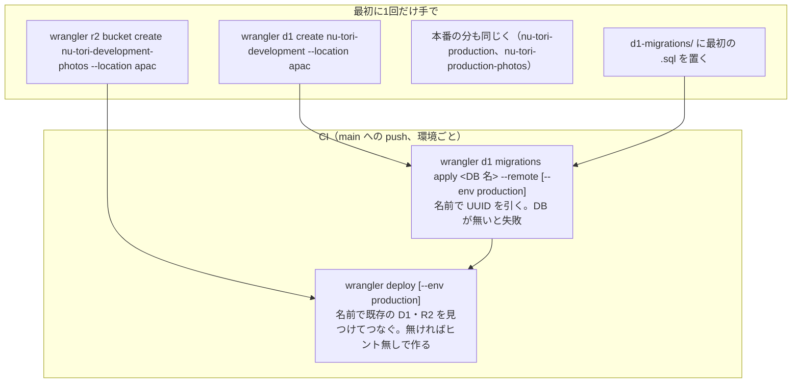

# サーバーのデプロイと開発用の環境（資源の作り方・CI のトークン・カスタムドメイン・消去と復元・ストリーミング・Workers AI）

調査日: 2026-09-26
対象: Issue #69「デプロイと開発用の環境で確かめる」。`server/` の Worker（Hono、wrangler 4.141.0）を、main への push で GitHub Actions から開発用（`nu-tori-development`、`wrangler.jsonc` の上の階層）→ 本番（`nu-tori-production`、`env.production`）の順にデプロイし、それぞれ D1 のマイグレーション（`server/d1-migrations/`）を当ててから Worker を出す前提で、要る事実を一次情報で集める。D1 と R2 のつなぎは名前だけで ID を書いていない。Durable Object は SQLite の保存先（`exports` で宣言）。場所のヒントは D1 と R2 が `apac`、Durable Object が `apac-ne` の見込み。

> **確認の方法と限界**
> - Cloudflare の文書（developers.cloudflare.com の各ページの `index.md` と、製品ごとの `llms-full.txt`）、Cloudflare API の参照（developers.cloudflare.com/api）の**本文を直接取得して読んだ**。本文で確かめた主張は「本文で確認」と書く。
> - wrangler の挙動は、公式リポジトリ **cloudflare/workers-sdk をタグ `wrangler@4.141.0`（コミット `8d61ca8`）で手元に取得して、ソースと `packages/wrangler/CHANGELOG.md` を読んで**確かめた。ソースから確かめたものも「本文で確認」と書き、ファイルを添える。版の公開日は npm の登録簿で確かめた（`latest` は 4.141.0、2026-09-25 公開）。
> - 本文の記述から推し量ったもの、ソースの流れから推し量ったものは「本文からの読み取り」と書き、何から読み取ったかを添える。
> - 本文や関連ページを探しても記述が無かったものは「本文を探したが記述なし」と書き、探したページを添える。
> - **実アカウントでのデプロイ、トークンの作成、証明書の発行、復元の操作はしていない。** トークンの画面に出る名前は、文書の表（「Dashboard」と「API」の2つのタブ）で確かめた範囲に限る。
> - Cloudflare の Workers の権限は、**2026-09 の文書で新しい役割（Admin・Editor・Content Read-Only・Metadata Read-Only）に移りつつあり**、古い権限（Workers Scripts Edit など）は「今も効く、廃止の日は未定」とされている。下の権限の節は両方を書いた。
> - 二次情報（ブログ、まとめ記事、Qiita・Zenn、Stack Overflow）は使っていない。出典の番号は末尾の「出典一覧」。

## 結論の要約

- **1. 資源の自動作成**: `wrangler deploy` は ID の無い D1・R2 を作れる。4.45.0（2025-10）で既定で有効になり、4.113.0（2026-07）で「一般提供」になった（`--x-provision` は隠しの旗として残り、既定で真）。CI（TTY なし・CI の環境変数あり）でも問いかけずに作り、**設定ファイルへの ID の書き戻しは CI ではしない**。次の回は、デプロイ済みの Worker のつなぎを引き継ぐか、`database_name`・`bucket_name` の名前で探して見つける。**ただし自動作成は場所のヒントを渡さない**（D1 は名前だけ、R2 は `jurisdiction` だけ渡す）。場所を指定しないと「作成のリクエストを出した場所の近く」に置かれるので、**GitHub Actions のランナーから作ると `apac` にならないおそれがある**。`apac` にするなら手で `wrangler d1 create <名前> --location apac` と `wrangler r2 bucket create <名前> --location apac` を先に打つ（いずれも本文で確認、最後の懸念は本文からの読み取り）。
- **2. `d1 migrations apply --remote`**: 4.102.0（2026-06）から `database_id` が無くても `database_name` で API から UUID を引く。**DB がまだ無いと「Couldn't find a D1 DB named …」で止まる**ので、初回は「マイグレーション → デプロイ」の順だと自動作成が間に合わない。CI では確認の問いを飛ばして「はい」で進む（`ci-info` と TTY で判定）。**マイグレーションのディレクトリが無いと「No migrations present at …」で失敗する**。ディレクトリがあって `.sql` が0個なら「No migrations to apply!」で成功する（git は空のディレクトリを持てないので、最初のマイグレーションか別のファイルが要る）（本文で確認）。
- **3. CI のトークン**: 公式の手順は、アカウントの API トークンを「Edit Cloudflare Workers」の雛形から作り、`CLOUDFLARE_API_TOKEN` と `CLOUDFLARE_ACCOUNT_ID` を CI の秘密に置く。雛形の中身は Zone の Workers Routes、Account の Workers Scripts・Workers KV Storage・Workers R2 Storage（書き込み）・Workers Tail（読み）・Account Settings（読み）、User の User Details・Memberships（読み）で、**D1 は入っていない**。この構成に要るのは、**Account / Workers Scripts / Edit（新しい役割では、最初の作成に Workers の Admin、以後は Editor）、Account / D1 / Edit、Zone / Workers Routes / Edit（カスタムドメインを足す・変えるとき）**。R2 はバケットを手で作れば CI には要らない（初回のデプロイで wrangler が名前でバケットを問い合わせるが、権限が無い 403 は `collectPendingResources` が飛ばし、名前をそのまま送る）。`CLOUDFLARE_ACCOUNT_ID` を置けば `/memberships` を引かないので User の権限は要らない。`cloudflare/wrangler-action@v4`（最新 v4.1.3）は今も公式の例だが、`wrangler` を直接呼ぶ形も文書にある（本文で確認、R2 と User の要否は本文からの読み取り）。
- **4. カスタムドメイン**: 要るのは「有効な Cloudflare のゾーン」と Worker。Registrar で買ったドメインは必ず Cloudflare のネームサーバーを使う。**カスタムドメインを作ると、そのホスト名の Advanced Certificate が作られる**ので、`api.dev.nu-tori.app` のような2段目のサブドメインにも証明書が付くと読める（Universal SSL だけなら1段目まで）。ACM の購入が要るとは書かれていない。`workers_dev: false` は workers.dev の本番の URL を止めるが、**Version URL・Preview URL は止めない**ので `preview_urls: false` を別に書く（Durable Object を持つ Worker には Version URL がそもそも作られない）。カスタムドメインの追加・変更には Zone の Workers Routes の書き込みが要る（本文で確認、2段目の証明書は本文からの読み取り）。
- **5. 消去と復元**: SQLite の Durable Object は**過去 30 日の任意の時点に戻せる（PITR）**。`deleteAll()` のあとに、消す前のブックマークへ戻せるか、PITR の履歴を消す方法があるかは**書かれていない**。互換日付 2026-02-24 以降（このリポジトリは 2026-08-22）では **`deleteAll()` がアラームも消す**。`deleteAll()` すれば保存の課金は止まる。D1 の Time Travel は常に有効で、有料 30 日・無料 7 日、止める方法は書かれていない。R2 のオブジェクトの削除は取り消せない（本文で確認、PITR と削除の関係は本文を探したが記述なし）。
- **6. SSE の中継**: Durable Object の `fetch()` が `ReadableStream` を本文にした `Response` を返し、Worker がそれを読みながら流す公式の例がある。RPC も `ReadableStream` を流れの制御つきで渡せる。HTTP の実時間に上限は無く、**Durable Object は応答のストリームが流れている間は動いたままで、その実時間に duration の課金がかかる**（本文で確認）。ただし「Durable Object の中から出した普通の `fetch()` は、本文をストリーミング中でも Durable Object を生かし続けない」と書かれている（本文で確認、中継の途中で入ってくるリクエストが続いている間は生きている、は本文からの読み取り）。
- **7. Workers AI**: Durable Object の `env` には Worker の設定のつなぎが入るので `this.env.AI` を呼べる（本文からの読み取り）。料金はアカウント単位で、1日 1 万ニューロンまで無料、超えると有料プランで $0.011/1,000 ニューロン。**開発用と本番は同じアカウントなら無料枠と請求を分け合う**（本文からの読み取り）。`wrangler dev` からの呼び出しにも課金される。分けるには別のアカウントにするか、環境ごとの AI Gateway を通して上限をかける（本文からの読み取り）。Jev は `@cf/` の付かない第三者のモデル `typesafe/jev` として別のカタログ（`/ai/models/`）にあり、料金はニューロンではなくトークンで、入力 100 万トークンあたり $0.042、出力は無料（本文で確認）。
- **8. 有料プラン**: SQLite の Durable Object は無料プランでも使える（保存は無料で合計 5 GB、1つ 1 GB）。D1 の Time Travel は無料 7 日・有料 30 日。Workers AI は無料枠を超えるには有料が要る。カスタムドメインに有料が要るとは書かれていない（本文で確認、最後は本文を探したが記述なし）。

## 初回と2回目以降の流れ

手で作る資源と、CI が毎回すること。

## 1. 資源の自動作成（`wrangler deploy` が D1・R2 を作るか）

**結論**: 作れる。CI でも問いかけずに作るが、場所のヒントは渡さないので、`apac` にしたいなら手で作る。

| 問い | 答え | 確かさ | 出典 |
|---|---|---|---|
| 何を作れるか | KV・R2・D1・Flagship・AI Search・Agent Memory・Dispatch Namespace・Queue。「つなぎを ID 無しで（R2 はバケット名無しで）書くと、デプロイのときに作る。名前は Worker の名前を頭につける」 | 本文で確認 | CF1 |
| 名前を書いた場合 | `database_name`・`bucket_name` があれば、その名前で作る（3.103.0 から）。R2 は同じ名前のバケットが無いときだけ作る。D1 はその名前の DB があれば、その UUID につなぐだけで作らない。名前も ID も無ければ `<Worker 名>-<つなぎ名を小文字・_ を - にしたもの>` で作る | 本文で確認 | WS1（`provision-bindings.ts` の `R2Handler`・`D1Handler`・`runProvisioningFlow`）、WS2（3.103.0） |
| いつから・まだ実験か | 3.92.0 で実験の旗 `--x-provision` を追加。4.45.0（2025-10-23 公開）で既定で有効に（「まだ実験。`--no-x-provision` で止められる」）。4.113.0（2026-07-21 公開）で「自動作成は一般提供になった」として表示の「Experimental:」を外した。4.141.0 でも `experimental-provision`（別名 `x-provision`）と `experimental-auto-create`（別名 `x-auto-create`）は隠しの旗で、既定はどちらも真 | 本文で確認 | WS2（3.92.0、4.45.0、4.113.0）、WS1（`packages/wrangler/src/index.ts`）、NPM1 |
| CI で動くか | `x-auto-create` が既定で真なので、既存の資源を選ぶ問いを出さずに作る（3.105.1 で「既定で問いかけない」に変更）。名前が設定にあればその名前で、無ければ既定の名前で作る | 本文で確認 | WS1（`runProvisioningFlow`）、WS2（3.105.1） |
| ID を設定ファイルに書き戻すか | 対話できる端末のときだけ書き戻す。`isNonInteractiveOrCI()`（TTY でない、または `ci-info` が CI と判定）が真なら書き戻さない。文書も「ダッシュボード（GitHub 連携など）からのデプロイでは ID はリポジトリに書き戻されない」と書く | 本文で確認 | WS1（`provisionBindings`、`workers-utils/src/is-interactive.ts`）、CF1 |
| 次の回はどう見つけるか | ① デプロイ済みの Worker の設定（`/workers/scripts/<名前>/settings`）に同じつなぎ名があれば引き継ぐ（D1 は名前も一致を確かめる）。② 無ければ、設定の `database_name` で D1 を、`bucket_name` で R2 を API から探す。「今後のデプロイは ID が無くても動く」 | 本文で確認 | WS1（`canInherit`・`isConnectedToExistingResource`、`provisionBindings` のログの文） |
| 権限が足りないとき | 資源の有無を調べる API が 403 を返したら、その種類の自動作成を飛ばしてデプロイを続ける（4.129.0 から）。名前が設定にあれば、その名前のまま送る | 本文で確認 | WS2（4.129.0）、WS1（`collectPendingResources`） |
| 自動作成で場所のヒントを渡せるか | **渡せない。** D1 の作成は本文に `{ name }` だけを送る。R2 の作成関数は `location` を取れるが、自動作成は `undefined` を渡し、`jurisdiction` だけを渡す。設定の `d1_databases`・`r2_buckets` にも場所のヒントの鍵は無い（R2 は `jurisdiction` だけ） | 本文で確認 | WS1（`createD1Database`、`R2Handler.create`）、CF1（D1 databases、R2 buckets の節） |
| ヒントを渡さないとどこに置かれるか | D1: 「DB を作るリクエストを出した場所の近くに主の DB を作る」。R2: 「作成のリクエストの呼び出し元に一番近い地域を選ぶ」。D1 の文書は、CD や IaC から作るときにヒントを渡す場面として挙げている | 本文で確認 | CF4、CF5 |
| GitHub Actions から自動作成すると | ランナーの場所の近くに置かれ、`apac` にならないおそれがある | 本文からの読み取り（CF4・CF5 の「リクエストの近く」から） | CF4、CF5 |
| 手で作るコマンド | `wrangler d1 create <名前> --location apac`（`weur`・`eeur`・`apac`・`oc`・`wnam`・`enam`。`--jurisdiction` を付けるとヒントは無視）。`wrangler r2 bucket create <名前> --location apac`。どちらも `--update-config`・`--binding` で設定に足せる | 本文で確認 | CF2、CF3 |
| ヒントの効き方 | どちらも保証ではない。D1 は「近い場所で動く」。R2 は「同じ名前で最初に作ったときだけ効き、消して作り直しても元の場所を使う」 | 本文で確認 | CF4、CF5 |
| Durable Object の `apac-ne` | Durable Object の場所のヒントには `apac`・`apac-ne`（北東アジア太平洋）・`apac-se` があり、文書は「一般には `apac` を勧め、利用者が北東か南東に集まるときに狭いほうを選ぶ」と書く | 本文で確認 | CF39 |

## 2. `wrangler d1 migrations apply <名前> --remote`

**結論**: `database_name` だけで動く。ただし DB が先に無いと失敗し、ディレクトリが無くても失敗する。CI では問いかけない。

| 問い | 答え | 確かさ | 出典 |
|---|---|---|---|
| `database_id` が要るか | 要らない。4.102.0（2026-06-18 公開）から、`database_id` の無い設定では `GET /accounts/:id/d1/database/:name?fields=uuid` で UUID を引き、`database_id` があるかのように進む（`migrations apply --remote` を含む遠隔の D1 のコマンドすべて）。名前も無ければ自動作成の既定の名前で引く | 本文で確認 | WS2（4.102.0）、WS1（`packages/wrangler/src/d1/utils.ts` の `getDatabaseByNameOrBinding`） |
| `--env production` | 設定を環境ごとに解決してから、引数の名前（`database_name` かつなぎ名）で `d1_databases` を探す。つなぎが設定に無いと `--remote` では「Couldn't find a D1 DB with the name or binding …」で止まる | 本文で確認 | WS1（`d1/migrations/apply.ts`） |
| DB がまだ無いとき | API が 404 を返し、「Couldn't find a D1 DB named '<名前>' (bound as '<引数>') in the API. Run 'wrangler d1 create <名前>' to create it.」の `UserError` で終わる。**初回に「マイグレーション → デプロイ」の順だと、デプロイの自動作成より前に失敗する** | 前半は本文で確認、後半は本文からの読み取り | WS1（`d1/utils.ts`） |
| CI で問いかけるか | 問いかけない。文書: 「CI/CD や非対話の端末では確認を飛ばすが、バックアップは取る」。ソースでは `confirm()` が `isNonInteractiveOrCI()` のとき既定の「yes」を返し、SQL の実行も `shouldPrompt: !isNonInteractiveOrCI()`。判定は TTY の有無と `ci-info`（GitHub Actions の `CI` など）。専用の旗は無い | 本文で確認 | CF2（`d1 migrations apply`）、WS1（`dialogs.ts`、`workers-utils/src/is-interactive.ts`） |
| ディレクトリが無いとき | 「No migrations folder found.」を警告し、「No migrations present at <パス>.」の `UserError` で失敗する（apply は `createIfMissing: false`）。この確認は DB を引くより前に行う | 本文で確認 | WS1（`d1/migrations/helpers.ts` の `getMigrationsPath`、`apply.ts`） |
| ディレクトリが空のとき | 既定の型は `<migrations_dir>/*.sql`。適用済みの表（`d1_migrations`）を遠隔に作ってから数え、0 件なら「✅ No migrations to apply!」で正常に終わる。`.sql` 以外のファイル（`.gitkeep` など）は数えない | 本文で確認 | WS1（`helpers.ts` の既定の型、`apply.ts`） |
| 途中で失敗したとき | そのマイグレーションは巻き戻り、前に成功したものは残る | 本文で確認 | CF2 |
| 今のリポジトリ | `server/d1-migrations/` はまだ無い（2026-09-26 時点） | 本文で確認（リポジトリを見た） | — |

## 3. CI の API トークンの権限

**結論**: アカウントの API トークンに、Workers Scripts（最初の作成は Workers の Admin）、D1、Zone の Workers Routes を付け、`CLOUDFLARE_ACCOUNT_ID` を置く。雛形「Edit Cloudflare Workers」には D1 が入っていない。

### 公式の手順と雛形

| 問い | 答え | 確かさ | 出典 |
|---|---|---|---|
| 公式の手順 | ダッシュボードの **Account API tokens** で Create Token →「Custom」から **Edit Cloudflare Workers** を選び、アカウントとゾーンをできるだけ絞る。`CLOUDFLARE_ACCOUNT_ID` と `CLOUDFLARE_API_TOKEN` を CI の秘密に置き、`wrangler deploy` を動かす | 本文で確認 | CF10 |
| 雛形「Edit Cloudflare Workers」の中身 | Zone: Workers Routes（Write）／Account: Workers Scripts（Write）、Workers KV Storage（Write）、Workers Tail（Read）、Workers R2 Storage（Write）、Account Settings（Read）／User: User Details（Read）、User Memberships（Read）。**D1 は無い** | 本文で確認 | CF7 |
| 画面の名前 | 権限の一覧は「Dashboard」と「API」の2つのタブで名前が違う。ダッシュボードでは「Edit」（例: `Workers Scripts Edit`、`D1 Edit`、`Workers R2 Storage Edit`、Zone の `Workers Routes Edit`、`DNS Write`…）、API では「Write」（`Workers Scripts Write`、`D1 Write`…）。User 側は `Memberships Read`・`User Details Read` | 本文で確認 | CF6 |
| 新しい役割 | Developer Platform の役割は Metadata Read-Only・Content Read-Only・Editor・Admin。API トークンは製品ごと（と、あるものは資源ごと）に付け、プラットフォーム全体には付けられない。「既存の Worker のデプロイは Editor、**まだ無い Worker を作るデプロイは Workers の製品の Admin**、ルートやカスタムドメインを変えるデプロイは Editor に加えて影響するゾーンごとの Workers Routes Write」。古い `Workers Scripts Edit` は「Workers の製品の Editor」に置き換わるとされ、「廃止の日は未定で、今の権限はそのまま効く」 | 本文で確認 | CF8、CF9 |
| つなぎ先の権限 | 「KV・R2・D1 などのつなぎを持つ Worker のデプロイには Worker の Editor があればよく、つなぎ先の権限は要らない。つなぎ先に直接触る（D1 に問い合わせる、R2 を一覧する）ときだけ要る」。Workers の役割は R2・D1 などほかの製品の権限を含まない | 本文で確認 | CF8、CF9 |
| カスタムドメイン | 「追加・変更・削除には Worker の Editor と、影響するゾーンごとの Workers Routes Write（API トークンでは Zone > Workers Routes > Write）が要る。設定済みなら、つなぎを変えないデプロイは Editor だけでよい」。カスタムドメインは Worker ごとの役割にまだ対応していない | 本文で確認 | CF8 |
| Durable Object | Durable Object に触る権限は、Worker ごとか Workers の製品の Workers の役割で付ける | 本文で確認 | CF41 |

### この構成に要るもの

| すること | 要る権限（ダッシュボードの名前） | 確かさ | 出典 |
|---|---|---|---|
| Worker（Durable Object・Workers AI のつなぎ込み）のデプロイ | Account / Workers Scripts / Edit。新しい役割なら、最初の作成に Workers の Admin、以後は Editor | 本文で確認（Workers AI のつなぎに追加の権限が要らないのは、CF8 の「つなぎ先の権限は要らない」からの読み取り） | CF8、CF9 |
| D1 のマイグレーション | Account / D1 / Edit（D1 の文書は、書き込みには `D1:Edit` が要ると書く） | 本文で確認 | CF6、CF28（D1 の `llms-full.txt` の変更履歴） |
| D1 を CI で作る（自動作成） | D1 の作成も同じ D1 の権限。新しい役割では作成は Admin | 本文からの読み取り（CF9 の役割の表から） | CF9 |
| R2 | 手で作ったバケットを名前でつなぐだけなら、デプロイには要らない。自動作成は存在の確認が 403 なら飛ばして続ける（名前がそのまま送られる）。CI で作らせるなら Account / Workers R2 Storage / Edit | 本文からの読み取り（CF8 と WS1 の 403 の扱いから） | CF8、WS1、WS2（4.129.0） |
| カスタムドメインの追加・変更 | Zone / Workers Routes / Edit（そのゾーンに絞る）。DNS の権限が要るとは書かれていない。API の「Attach to Domain」の受け付ける権限は `Workers Scripts Write` だけ | 本文で確認 | CF8、CF40 |
| 秘密の値を CI で置く | `wrangler secret put` は Worker の Editor。`wrangler deploy --secrets-file <ファイル>` でコードと一緒に送れ、ファイルに無い既存の秘密は残る。設定の `secrets.required` に名前を書くと、無いときにデプロイが失敗する | 本文で確認 | CF8、CF12、CF1 |
| アカウントの特定 | `CLOUDFLARE_ACCOUNT_ID`（または設定の `account_id`）があれば API を引かない。無いと `/accounts` と `/memberships` を引き、アカウントの API トークンは `/memberships` で 9106 を返すので `/accounts` に切り替える。つまり User / Memberships Read と User Details Read は、アカウント ID を置けば要らない | 前半は本文で確認、最後は本文からの読み取り | WS1（`packages/wrangler/src/user/user.ts`、`packages/workers-auth/src/core/factory.ts`） |
| Account Settings Read | 雛形に入っているが、デプロイの流れで使う箇所は確かめられなかった | 本文を探したが記述なし（CF7・CF8 とデプロイのソース） | CF7 |

### wrangler-action と環境変数

| 問い | 答え | 確かさ | 出典 |
|---|---|---|---|
| wrangler-action | Cloudflare の文書は「公式のアクション」として `cloudflare/wrangler-action@v4` の例を載せる。最新のタグは v4.1.3。既定は Wrangler v4。`wranglerVersion` を省くと、入っている Wrangler を使い、無ければ既定の版を入れる。`packageManager`（pnpm など）・`workingDirectory`・`environment`・`secrets`・`preCommands`・`command` を取る | 本文で確認 | CF10、WA1 |
| 直接呼ぶ | 文書の一般の手順は「CI の秘密に2つの値を置き、`wrangler deploy` を動かすワークフローを作る」で、アクションは GitHub Actions の場合の例 | 本文で確認 | CF10 |
| 環境変数 | `CLOUDFLARE_API_TOKEN`、`CLOUDFLARE_ACCOUNT_ID`（ほかに古い `CLOUDFLARE_API_KEY`＋`CLOUDFLARE_EMAIL`、`WRANGLER_SEND_METRICS`、`WRANGLER_OUTPUT_FILE_PATH` など） | 本文で確認 | CF11 |
| 細かい権限を wrangler で使う | 「`wrangler login` の OAuth は細かい権限に対応しない。アカウントが持つ API トークンを使い、2つの環境変数を置く」 | 本文で確認 | CF9 |

## 4. カスタムドメイン

**結論**: 同じアカウントの有効なゾーンがあれば付けられる。証明書はホスト名ごとに作られる。`workers_dev: false` と `preview_urls: false` の両方を書く。

| 問い | 答え | 確かさ | 出典 |
|---|---|---|---|
| 要るもの | 「有効な Cloudflare のゾーン」と Worker。「CNAME がすでにあるホスト名や、自分のものでないゾーンには作れない」。wrangler はトークンのアカウントで API を呼ぶ | 本文で確認 | CF13 |
| Registrar で買ったドメイン | 「Cloudflare Registrar のドメインはすべて Cloudflare のネームサーバーを使う（他社のネームサーバーは使えない）」。移管も full setup のゾーンだけ | 本文で確認 | CF19 |
| 証明書 | 「カスタムドメインを作ると、対象のゾーンに、対象のホスト名の Advanced Certificate を作る」。既定の設定で作られ、ドメインを消しても証明書は自動では消えない | 本文で確認 | CF13 |
| Universal SSL の範囲 | full setup のゾーンで Universal SSL だけなら、根と1段目のサブドメインまで。`dev.www.example.com` のような深いものは覆わない。覆うには ACM を買う（Total TLS か個別の証明書）か、自前の証明書を上げる | 本文で確認 | CF14 |
| `api.dev.nu-tori.app` に ACM が要るか | カスタムドメインはホスト名そのものの証明書を作ると書かれ、カスタムドメインの要件に ACM は無い。**ACM を買わずに2段目にも付く**と読める。ACM の文書は「高度な証明書を注文するには ACM の購入が要る」と書くが、Workers のカスタムドメインとの関係には触れていない | 本文からの読み取り（CF13 の2か所） | CF13、CF15 |
| Preview をカスタムドメインで出す場合 | Preview の URL はさらに1段サブドメインを足す（`app.preview.example.com` なら `<名前>.app.preview.example.com`）。「深いホスト名では ACM と Total TLS などが要るかもしれない」 | 本文で確認 | CF18 |
| `workers_dev: false` | 次のデプロイで workers.dev の経路を止める。「Version URL・Preview URL・Deployment URL は止めない」。`routes` を書いて `workers_dev` を書かないと `false` と推し量られる。ダッシュボードで止めても、設定に書かないと次のデプロイで戻る | 本文で確認 | CF16 |
| `preview_urls: false` | Version URL と workers.dev の Preview URL を止める。省くと既存の設定を変えない。設定が無いときの初期値は `workers_dev` に従う | 本文で確認 | CF1、CF17 |
| Durable Object を持つ Worker | 「Durable Object を実装する Worker には Version URL を作らない」 | 本文で確認 | CF17 |
| CI での上書き | TTY が無いとき、wrangler は `override_existing_origin` と `override_existing_dns_record` を真にして送る。つまり**同じホスト名に別の Worker のカスタムドメインや衝突する DNS レコードがあると、CI では問いかけずに付け替える**。対話の端末では確認を出す | 本文で確認（挙動はソースの条件分岐から） | WS1（`deploy-helpers/src/triggers/publish-routes.ts`） |
| 環境をまたぐ継承 | `routes` は環境に継承される。上の階層にカスタムドメインがあり `env.production` に `routes` が無いと、wrangler は「このドメインが上の階層の Worker から付け替わる。防ぐには `"routes": []` を書く」と警告する。`workers_dev`・`preview_urls`・`exports` も継承される。`ai`・`durable_objects`・`d1_databases`・`r2_buckets` は継承されず環境ごとに書く | 本文で確認 | WS1（`workers-utils/src/config/validation.ts`）、CF1（Non-inheritable keys） |
| 上限 | ゾーンあたりカスタムドメイン 100 | 本文で確認 | CF20 |

## 5. 消去と復元（Durable Object の PITR、D1 の Time Travel、R2）

**結論**: Durable Object は 30 日の PITR があり、`deleteAll()` との関係と履歴の消し方は書かれていない。互換日付 2026-08-22 では `deleteAll()` がアラームも消す。

| 問い | 答え | 確かさ | 出典 |
|---|---|---|---|
| PITR の期間 | SQLite の Durable Object は「過去 30 日の任意の時点」に、SQL と KV の両方の中身を戻せる。`getCurrentBookmark()`、`getBookmarkForTime(時刻)`（過去 30 日以内）、`onNextSessionRestoreBookmark(ブックマーク)` のあと `ctx.abort()` で戻す。戻す直前を指すブックマークが返り、戻したことも取り消せる。ローカルの開発では使えない | 本文で確認 | CF21 |
| 無料・有料で期間が違うか | 文書は 30 日とだけ書き、プランの違いには触れていない | 本文を探したが記述なし（CF21・CF25・CF26） | CF21 |
| `deleteAll()` のあとに消す前へ戻せるか | 書かれていない。`deleteAll()` は「Durable Object のすべての保存を解放する」「SQLite では原子的」とだけある | 本文を探したが記述なし（CF21・CF24・CF25 と Durable Object の `llms-full.txt` 全体で `deleteAll` と `bookmark` を探した） | CF21 |
| PITR の履歴を消せるか | 消す API も設定も書かれていない | 本文を探したが記述なし（同上） | CF21 |
| `deleteAll()` とアラーム | 「互換日付 2026-02-24 以降は `deleteAll()` が有効なアラームも消す。それより前は消さないので `deleteAlarm()` を別に呼ぶか、`delete_all_deletes_alarm` の旗を付ける」。旗の既定は 2026-02-24 から、止める旗は `delete_all_preserves_alarm`。KV と SQLite の両方に効く。このリポジトリは `compatibility_date: 2026-08-22` なので消す側 | 本文で確認（最後はリポジトリの設定との突き合わせ） | CF21、CF22 |
| 消したあとの課金 | 「保存を空にするには `deleteAll()` を呼ぶ。キーを消す・表を落とすだけでは内部のメタデータが残る。`deleteAll()` で保存の課金が止まる」。「データを消したあと、オブジェクトはシステムが自動で片づける」。空の SQLite でも約 12 KB を使う | 本文で確認 | CF24、CF25 |
| PITR の履歴が保存量に数えられるか | 書かれていない | 本文を探したが記述なし（CF25） | CF25 |
| D1 の Time Travel | 常に有効で、止める必要も手段の記述も無い。有料 30 日・無料 7 日の任意の分に戻せる。30 日より古いブックマークは使えない。戻しても古いブックマークは消えない。履歴と復元に追加料金は無い。30 日より長く残すには R2 に書き出す | 本文で確認（止める手段は本文を探したが記述なし） | CF27、CF28 |
| R2 の削除 | 「オブジェクトの削除は取り消せない」。削除は強い一貫性で、Promise が解決したら世界中の読みから見えなくなる。バケットロックを付けると期間中は消せなくなる | 本文で確認 | CF29 |

## 6. Durable Object から SSE を前の Worker 越しに流す

**結論**: 流せる。公式の例がある。流れている間は Durable Object も Worker も生きていて、Durable Object は実時間で課金される。

| 問い | 答え | 確かさ | 出典 |
|---|---|---|---|
| 公式の例 | 「Use ReadableStream with Durable Object and Workers」: Durable Object の `fetch()` が `new Response(new ReadableStream(...))` を返し、1秒ごとに値を `enqueue` する。Worker は `stub.fetch()` の `response.body` を読みながら扱い、`reader.cancel()` で止めると Durable Object 側の `cancel()` が呼ばれる | 本文で確認 | CF30 |
| RPC で流すか | RPC は `ReadableStream` と `WritableStream` を「自動の流れの制御つきで」渡せ、`Request`・`Response` も渡せる | 本文で確認 | CF31 |
| Worker で素通しにできるか | 例は Worker が中身を読む形。`stub.fetch()` が返した `Response` をそのまま返せば本文もストリームのまま流れる | 本文からの読み取り（CF30 と、Streams API の「バッファせず少しずつ処理する」から） | CF30、CF32 |
| 時間の上限 | Worker の HTTP は「クライアントがつながっている限り上限なし。応答の本文を流している Worker は動いたまま」。Durable Object（RPC・HTTP）も「呼び出し元がつながっている限り上限なし。リクエスト・RPC・応答のストリーム・WebSocket・待ちの I/O がある間は動いたまま」 | 本文で確認 | CF20 |
| 休止（hibernation） | 休止の条件は「処理中のリクエストが無い」「待ちの `fetch()` が無い」など。HTTP のストリーミング中は条件を満たさず休止しない。Durable Object の `waitUntil()` で生かす必要は無い | 本文で確認（ストリーミング中に休止しないのは、条件と CF32 の「応答のストリームがある間は動いたまま」からの読み取り） | CF23、CF32 |
| Durable Object の中の `fetch()` | 「Durable Object から出した普通の `fetch()` は、応答の本文をストリーミング中でも Durable Object を生かし続けない」（外向きの TCP・WebSocket は最大 15 分生かす）。前の Worker からのリクエストが続いている間は、その入ってくるリクエストで生きている | 前半は本文で確認、後半は本文からの読み取り（CF20 の Durable Object の行から） | CF23、CF20 |
| 課金 | Durable Object の duration は「動いているか、休止できずにメモリにいる間の実時間」で、同時のリクエストで分け合う。128 MB 分で数える。有料で月 40 万 GB-秒込み、超えると $12.50/100 万 GB-秒。リクエストは HTTP も RPC のセッションも1件 | 本文で確認 | CF25 |

## 7. Workers AI を Durable Object から呼ぶ

**結論**: 呼べる。料金はアカウント単位で、開発用と本番は同じアカウントなら分け合う。Jev は `typesafe/jev` の名で `/ai/models/` のカタログにある。

| 問い | 答え | 確かさ | 出典 |
|---|---|---|---|
| Durable Object で `env.AI` | Durable Object の基底クラスの `env` は「Wrangler の設定で定めた、この Durable Object で使える環境のつなぎ」。`ai` のつなぎを持つ Worker の Durable Object は `this.env.AI` を呼べる | 前半は本文で確認、後半は本文からの読み取り | CF33 |
| つなぎの数と環境 | 「AI のつなぎは Worker のプロジェクトに1つだけ」。`ai` は環境に継承されないので `env.production` にも書く | 本文で確認 | CF1、WS1（`validation.ts`） |
| 料金 | 無料と有料の両方に含まれ、$0.011/1,000 ニューロン。「誰でも合計で1日 1 万ニューロンまで無料」。超えて使うには有料プランが要る。上限を超えると失敗する。一部のモデルは有料の支払い方法が要る | 本文で確認 | CF34 |
| 開発用と本番で分け合うか | 料金の文書は無料枠と使用量をアカウントのダッシュボードで見るとだけ書き、Worker や環境ごとの枠の記述は無い。同じアカウントの2つの Worker は、無料枠と請求を分け合う | 本文からの読み取り（CF34） | CF34 |
| ローカルの開発 | 「Workers AI は常にアカウントにつながるので、ローカルの開発でも使用料がかかる」 | 本文で確認 | CF1 |
| 分ける方法 | ① 別の Cloudflare アカウントにする。② AI のつなぎの呼び出しに `gateway: { id }` を付けて環境ごとの AI Gateway を通す。AI Gateway はレート制限と、金額の上限（Spend limits、429 で止める）を持つ。Spend limits は「Unified Billing と BYOK の、価格のわかるモデル」に効くとあり、Workers AI の支払いを Unified Billing（前払いのクレジット）にする設定がある | ①②とも手段の存在は本文で確認。これで Workers AI の開発用の費用に上限をかけられるかは本文からの読み取り | CF34、CF36、CF37 |
| `typesafe/jev` | Workers AI の `/workers-ai/models/` のカタログ（`@cf/` の名前）には無いが、`/ai/models/typesafe/jev/` に第三者のモデルとして載っている。`env.AI.run('typesafe/jev', …)` で呼び、Zero data retention、文脈 32,000 トークン、入力 100 万トークンあたり $0.042・出力 $0.00 | 本文で確認 | CF35、CF42 |

## 8. 有料プラン（月 $5）が要るもの

| もの | 無料プラン | 確かさ | 出典 |
|---|---|---|---|
| SQLite の Durable Object | 使える（無料プランは SQLite だけ）。1日にリクエスト 10 万、duration 1.3 万 GB-秒。保存はアカウント合計 5 GB、1つ 1 GB（有料は1つ 10 GB、合計は無制限） | 本文で確認 | CF25、CF26 |
| Durable Object の PITR | プランの違いの記述は無い | 本文を探したが記述なし | CF21、CF26 |
| D1 の Time Travel | 無料 7 日・有料 30 日。DB は無料で 10 個・1つ 500 MB | 本文で確認 | CF28 |
| Workers AI | 1日 1 万ニューロンまで無料。超えて使うには有料 | 本文で確認 | CF34 |
| カスタムドメイン | プランの制限の記述は無い（上限はゾーンあたり 100） | 本文を探したが記述なし（CF13・CF20・CF38） | CF20 |
| Worker そのもの | 無料は 1日 10 万リクエスト、1回の CPU 10 ミリ秒。有料は月 1,000 万リクエスト込み、CPU 既定 30 秒・最大 5 分 | 本文で確認 | CF38 |

## 出典一覧

### Cloudflare の文書（developers.cloudflare.com、各ページの `index.md` を取得）

- CF1: Configuration（Automatic provisioning、D1 databases、R2 buckets、Workers AI、Non-inheritable keys、Secrets、`workers_dev`・`preview_urls`） — https://developers.cloudflare.com/workers/wrangler/configuration/
- CF2: D1 Wrangler commands（`d1 create`、`d1 migrations apply`） — https://developers.cloudflare.com/d1/wrangler-commands/
- CF3: R2 Wrangler commands（`r2 bucket create`） — https://developers.cloudflare.com/r2/reference/wrangler-commands/
- CF4: D1 Data location — https://developers.cloudflare.com/d1/configuration/data-location/
- CF5: R2 Data location — https://developers.cloudflare.com/r2/reference/data-location/
- CF6: API token permissions（Dashboard と API のタブ） — https://developers.cloudflare.com/fundamentals/api/reference/permissions/
- CF7: API token templates — https://developers.cloudflare.com/fundamentals/api/reference/template/
- CF8: Workers roles and permissions — https://developers.cloudflare.com/workers/authorization/workers/
- CF9: Roles and permissions（Developer Platform） — https://developers.cloudflare.com/workers/authorization/
- CF10: GitHub Actions — https://developers.cloudflare.com/workers/ci-cd/external-cicd/github-actions/
- CF11: System environment variables — https://developers.cloudflare.com/workers/wrangler/system-environment-variables/
- CF12: Workers commands（`deploy` の `--secrets-file`） — https://developers.cloudflare.com/workers/wrangler/commands/workers/
- CF13: Custom Domains — https://developers.cloudflare.com/workers/configuration/routing/custom-domains/
- CF14: Universal SSL limitations — https://developers.cloudflare.com/ssl/edge-certificates/universal-ssl/limitations/
- CF15: Advanced Certificate Manager — https://developers.cloudflare.com/ssl/edge-certificates/advanced-certificate-manager/
- CF16: workers.dev — https://developers.cloudflare.com/workers/configuration/routing/workers-dev/
- CF17: Version URLs — https://developers.cloudflare.com/workers/versions-and-deployments/version-urls/
- CF18: Previews / Custom domains — https://developers.cloudflare.com/workers/previews/custom-domains/
- CF19: Registrar FAQ — https://developers.cloudflare.com/registrar/faq/
- CF20: Workers Limits（Wall time limits by invocation type、Routes and domains） — https://developers.cloudflare.com/workers/platform/limits/
- CF21: SQLite-backed Durable Object Storage（PITR API、`deleteAll`） — https://developers.cloudflare.com/durable-objects/api/sqlite-storage-api/
- CF22: Compatibility flags（Durable Object `deleteAll()` deletes alarms） — https://developers.cloudflare.com/workers/configuration/compatibility-flags/
- CF23: Lifecycle of a Durable Object — https://developers.cloudflare.com/durable-objects/concepts/durable-object-lifecycle/
- CF24: Access Durable Objects Storage（Remove a Durable Object's storage） — https://developers.cloudflare.com/durable-objects/best-practices/access-durable-objects-storage/
- CF25: Durable Objects Pricing — https://developers.cloudflare.com/durable-objects/platform/pricing/
- CF26: Durable Objects Limits — https://developers.cloudflare.com/durable-objects/platform/limits/
- CF27: D1 Time Travel and backups — https://developers.cloudflare.com/d1/reference/time-travel/
- CF28: D1 Limits（と D1 の `llms-full.txt` の変更履歴の `D1:Edit` の記述） — https://developers.cloudflare.com/d1/platform/limits/ 、https://developers.cloudflare.com/d1/llms-full.txt
- CF29: R2 Delete objects、Workers API reference、Bucket locks — https://developers.cloudflare.com/r2/objects/delete-objects/ 、https://developers.cloudflare.com/r2/api/workers/workers-api-reference/ 、https://developers.cloudflare.com/r2/buckets/bucket-locks/
- CF30: Use ReadableStream with Durable Object and Workers — https://developers.cloudflare.com/durable-objects/examples/readable-stream/
- CF31: Remote-procedure call (RPC) — https://developers.cloudflare.com/workers/runtime-apis/rpc/
- CF32: Context (ctx)（Durable Object と `waitUntil`）、Streams — https://developers.cloudflare.com/workers/runtime-apis/context/ 、https://developers.cloudflare.com/workers/runtime-apis/streams/
- CF33: Durable Object Base Class — https://developers.cloudflare.com/durable-objects/api/base/
- CF34: Workers AI Pricing — https://developers.cloudflare.com/workers-ai/platform/pricing/
- CF35: Workers AI Models と索引 — https://developers.cloudflare.com/workers-ai/models/ 、https://developers.cloudflare.com/workers-ai/llms.txt 、https://developers.cloudflare.com/workers-ai/llms-full.txt
- CF36: AI Gateway Worker binding methods — https://developers.cloudflare.com/ai-gateway/usage/worker-binding-methods/
- CF37: AI Gateway Spend limits、Rate limiting — https://developers.cloudflare.com/ai-gateway/features/spend-limits/ 、https://developers.cloudflare.com/ai-gateway/features/rate-limiting/
- CF38: Workers Pricing — https://developers.cloudflare.com/workers/platform/pricing/
- CF39: Durable Objects Data location — https://developers.cloudflare.com/durable-objects/reference/data-location/
- CF40: API: Workers Domains「Attach to Domain」（Accepted Permissions） — https://developers.cloudflare.com/api/resources/workers/subresources/domains/methods/update/
- CF41: Durable Objects roles and permissions — https://developers.cloudflare.com/workers/authorization/durable-objects/
- CF42: Jev — https://developers.cloudflare.com/ai/models/typesafe/jev/

### ソースと登録簿

- WS1: cloudflare/workers-sdk、タグ `wrangler@4.141.0`（コミット `8d61ca8`）。`packages/deploy-helpers/src/deploy/helpers/provision-bindings.ts`、`packages/deploy-helpers/src/deploy/deploy.ts`、`packages/deploy-helpers/src/triggers/publish-routes.ts`、`packages/wrangler/src/index.ts`、`packages/wrangler/src/d1/utils.ts`、`packages/wrangler/src/d1/migrations/apply.ts`、`packages/wrangler/src/d1/migrations/helpers.ts`、`packages/wrangler/src/dialogs.ts`、`packages/wrangler/src/user/user.ts`、`packages/workers-auth/src/core/factory.ts`、`packages/workers-utils/src/is-interactive.ts`、`packages/workers-utils/src/config/validation.ts` — https://github.com/cloudflare/workers-sdk/tree/wrangler@4.141.0
- WS2: `packages/wrangler/CHANGELOG.md`（同じタグ。3.92.0、3.103.0、3.105.1、4.45.0、4.102.0、4.113.0、4.129.0 の項） — https://github.com/cloudflare/workers-sdk/blob/wrangler@4.141.0/packages/wrangler/CHANGELOG.md
- WA1: cloudflare/wrangler-action の README（main）とタグ（最新 v4.1.3） — https://github.com/cloudflare/wrangler-action
- NPM1: npm の登録簿の wrangler（`dist-tags.latest` = 4.141.0、各版の公開日） — https://registry.npmjs.org/wrangler
