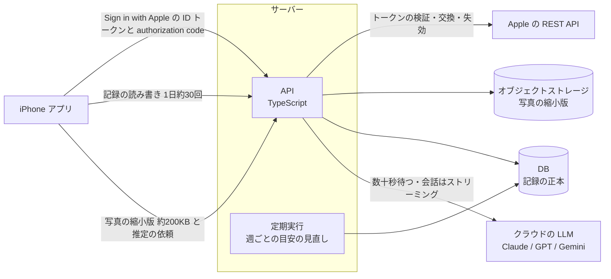
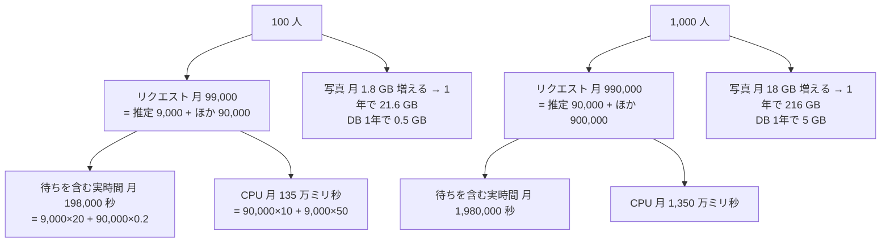
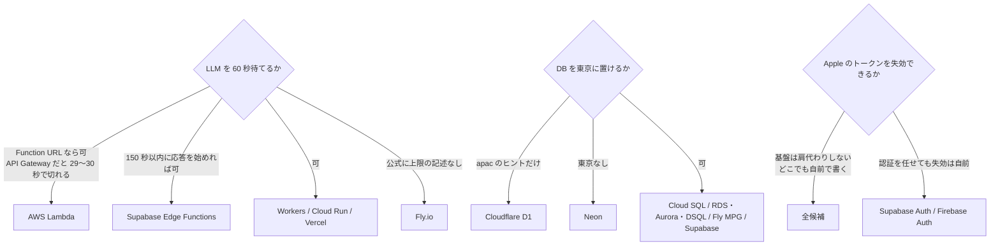

# サーバーの実行基盤の比較材料（Cloudflare Workers・Cloud Run・Vercel・AWS Lambda・Fly.io・Supabase）

調査日: 2026-09-25
対象: Issue #25「サーバーの言語と実行基盤」。サーバーは TypeScript で書く見込みが高い。ADR-0008（記録の正本はサーバー、写真の縮小版をオブジェクトストレージに置く）と ADR-0009（目標と目安の計算はサーバー、週ごとの見直しに定期実行が要る）を満たせる実行基盤を、一次情報で比べる材料を集める。

> **確認の方法と限界**
> - Cloudflare（developers.cloudflare.com の `index.md`）、Google Cloud（cloud.google.com）、Vercel（vercel.com/docs の `.md`）、AWS（docs.aws.amazon.com と Price List API の東京リージョンの JSON）、Fly.io（fly.io/docs）、Tigris（tigrisdata.com）、Neon（neon.com/docs の `.md`）、Supabase（supabase.com/docs、supabase.com/pricing）、Firebase（firebase.google.com/docs）、Apple（developer.apple.com）、npm レジストリ、GitHub の公式リポジトリの**本文を直接取得して読んだ**。本文で確かめた主張は「本文で確認」と書く。
> - 本文の記述から推し量ったもの、本文の数字から計算したものは「本文からの読み取り」と書き、何から読み取ったかを添える。
> - 本文や関連ページを探しても記述が無かったものは「本文を探したが記述なし」と書く。実機・実アカウントでのデプロイや計測はしていない。
> - **Google Cloud の料金ページは、リージョンごとの価格を JavaScript で切り替える。** 静的な HTML から読めたのは Iowa（us-central1）の価格だけで、**Cloud SQL と Cloud Storage の東京の価格は取得できていない**。Cloud Run は東京が Iowa と同じ Tier 1 に入ることを本文で確かめた。
> - **supabase/auth の GitHub Issue は、このセッションの GitHub API では読めなかった**。Issue #1308 と #2155 は WebFetch（ページを要約して返す道具）で読み、状態（Closed as not planned、Open）と本文の要旨だけを根拠にしている。コードは GitHub のコード検索で `appleid.apple.com` を探した結果を根拠にしている。
> - **Fly.io の HTTP リクエストの長さの上限は、公式文書に記述が見つからなかった。** コミュニティフォーラムに「60 秒のアイドルタイムアウト」の話があるが、一次情報ではないので根拠にしていない。
> - 料金は**取得日（2026-09-25）時点**のもの。月額の見積もりは、下に書いた仮定からの計算で、実測ではない。LLM の API 費用は含めない（`docs/research/food-photo-llm.md` を見る）。
> - 二次情報（比較ブログ、まとめ記事、Qiita・Zenn など）は使っていない。

## 結論の要約

- **20〜60 秒 LLM を待つ1回のリクエストは、6候補すべてで持てる**（本文で確認）。ただし条件がある。Cloudflare Workers は HTTP の実時間に上限が無く、fetch の待ちは CPU 時間に数えない。Cloud Run は既定 5 分・最大 60 分。Vercel は既定 300 秒。Lambda は最大 15 分だが、**API Gateway（REST は既定 29 秒、HTTP API は最大 30 秒）を前に置くと切れる**ので、Function URL で受ける。Supabase Edge Functions は「150 秒以内に応答を始めないと 504」「実時間は有料で 400 秒」。Fly.io は公式に上限の記述が無い。
- **応答のあとに処理を続ける仕組みは基盤ごとに違う。** Workers の `waitUntil` は応答のあと 30 秒まで、それ以上は Queues か Workflows。Vercel の `waitUntil` は関数の最大時間まで。Supabase は `EdgeRuntime.waitUntil`。Cloud Run は「リクエストごとの課金」だと応答のあとに CPU が割り当てられない。
- **東京に置けないものがある。** Neon（Postgres）は東京リージョンが無く、アジアはシンガポールとシドニーだけ（本文で確認）。Cloudflare の D1 と R2 は「apac（アジア太平洋）」のヒントを出せるだけで、東京とは指定できず、ヒントも保証ではない（本文で確認）。Cloud Run・Cloud SQL・Vercel（hnd1）・AWS（ap-northeast-1）・Fly.io（nrt、Managed Postgres も可）・Supabase（ap-northeast-1）・Tigris（nrt）は東京を選べる。
- **DB のバックアップが消えずに残る期間は、基盤で決まるものと、自分で決められるものがある。** プライバシーポリシーに書く値の候補は次のとおり（いずれも本文で確認）。
  - D1: Time Travel が常に有効で、有料プランで 30 日。止める・縮める方法の記述は無い
  - Cloud SQL: 自動バックアップ 1〜365 個（Enterprise の既定 7）、PITR のログ 1〜7 日（Enterprise）。変えられる
  - Aurora: 1〜35 日（既定 1 日）。RDS: 0〜35 日（0 で自動バックアップを止める）
  - Neon: 履歴の窓は有料で既定 1 日、最大 7 日（Launch）・30 日（Scale）。変えられる
  - Supabase: 日次バックアップを Pro で 7 日。PITR を足すと 7・14・28 日から選ぶ
  - Fly.io Managed Postgres: 10 日。変えられるかの記述は無い
  - オブジェクトストレージの削除: R2 は削除が取り消せない。Cloud Storage は既定で 7 日の soft delete が効く（0 にすれば止められる）
- **Apple のトークンの失効（アカウント削除時に必須）を、BaaS の認証は肩代わりしない。** Apple は「Sign in with Apple を使うアプリは、REST API でユーザーのトークンを失効させる」よう求めている（本文で確認）。Supabase Auth は、ネイティブの ID トークンの流れで Apple の refresh token を返さず、失効の要望 Issue は「対応予定なし」で閉じられている。Firebase Auth は「トークンを保存しない」ので、削除の前にもう一度サインインさせて authorization code から失効させる。**どの基盤でも、失効は自前で書く前提になる**（ADR の決定どおり、authorization code をサーバーで交換して refresh token を保存する）。
- **月額の見積もり（LLM 費用を除く、1年目の終わりの保存量）**: 100 人 / 1,000 人で、Cloudflare（Workers + D1 + R2）$5.2 / $8.1、Supabase Pro $25 / $27.5、AWS（Lambda + RDS + S3）$23.6 / 約 $37、Cloud Run（+ Cloud SQL + GCS）約 $10 / 最大 約 $59、Vercel Pro（+ Supabase の DB）約 $45 / 約 $57、Fly.io（+ Managed Postgres + Tigris）約 $48 / 約 $58。**固定費の大半は DB**で、DB が従量の D1 を使える Cloudflare が桁で安い。計算は下の節に書いた。
- **ライブラリは、Node.js で動く基盤（Cloud Run、Lambda、Fly.io、Vercel の Node ランタイム）ならすべて使える。** Cloudflare Workers では `jose`・`@anthropic-ai/sdk`・`openai`・`hono` は公式に対応をうたうが、**`@google/genai` は対応ランタイムに Workers を挙げていない**（Node.js 20 以上とブラウザだけ、本文で確認）。動くかは試作で確かめる。
- **swift-openapi-generator（1.13.1）は OpenAPI 3.0 と 3.1 に対応し、3.2 は暫定対応**（本文で確認）。`@hono/zod-openapi`（1.6.3）は `doc`（3.0）と `doc31`（3.1）で文書を出せる（本文で確認）。組み合わせとしては成り立つ。実際に生成して通るかは試していない。

## 前提: nu-tori のサーバーがすること

ADR-0008 と ADR-0009 と Issue の前提から、基盤に求めるものを流れで示す。

基盤ごとに確かめたのは、この図の矢印が持てるか（長い待ち、ストリーミング、定期実行）、DB とオブジェクトストレージを東京に置けるか、消したデータがバックアップにどれだけ残るか、いくらかかるか。

## 候補1: Cloudflare Workers（+ D1 / Hyperdrive、R2、Cron Triggers、Queues / Workflows）

出典の番号は末尾の「出典一覧」。

| 問い | 答え | 確かさ | 出典 |
|---|---|---|---|
| 1回のリクエストの実時間 | HTTP で起動した Worker は実時間に上限が無い。「クライアントがつながっている限り、処理・サブリクエスト・応答のストリーミングを続けられる」。個々のサブリクエストにも時間の上限は無い。ただしランタイムの更新時は、処理中のリクエストに 30 秒の猶予しか無い | 本文で確認 | CF1 |
| 外への fetch の待ちは CPU に数えるか | 数えない（"Waiting on network requests (such as fetch() calls, KV reads, or database queries) does not count toward CPU time."）。CPU 時間の上限は有料で既定 30 秒、最大 5 分 | 本文で確認 | CF1 |
| ストリーミング（SSE） | 応答の本文をストリーミングでき、送っている間は Worker が生き続ける | 本文で確認 | CF1、CF3 |
| 応答のあとの処理 | `ctx.waitUntil()` は応答のあと（またはクライアントが切れたあと）最大 30 秒。それを超える処理は Queues に送って別の Worker で処理する。Workflows はステップごとに実時間の上限が無く、CPU はステップごと既定 30 秒・最大 5 分 | 本文で確認 | CF3、CF15 |
| 定期実行 | Cron Triggers。有料でアカウントに 250 個。時刻は UTC。CPU は1時間未満の間隔で 30 秒、1時間以上の間隔で 15 分。実時間は 15 分。週1回の見直しは 15 分の枠に入る。人数が増えたら Queues か Workflows に分けて流す | 本文で確認（最後の一文は読み取り） | CF1、CF4 |
| DB のエンジン | D1 は SQLite。1つの DB は最大 10 GB で、これ以上は増やせない。1つの DB はクエリを1本ずつ処理する。外の Postgres は Hyperdrive（接続プールとキャッシュ、有料プランはクエリ数無制限・追加料金なし）でつなぐ | 本文で確認 | CF8、CF12、CF13 |
| DB を東京に置けるか | D1 の場所は「作成したリクエストの近く」か、ヒント（`apac` = アジア太平洋など）で指定する。ヒントは「保証しない。近い場所で動く」。管轄の指定は `eu` と `fedramp` だけで、日本は無い | 本文で確認 | CF6 |
| バックアップの保持期間 | Time Travel が常に有効で、有料プランで 30 日、無料で 7 日の任意の時点に戻せる。有効・無効の切り替えは無い（"You do not need to enable Time Travel. It is always on."）。短くする設定の記述は無い | 前半は本文で確認、最後は本文を探したが記述なし | CF7、CF8 |
| DB の料金（小規模） | 有料プランに、行の読み取り月 250 億、書き込み月 5,000 万、保存 5 GB が含まれる。超えると読み $0.001/100 万行、書き $1.00/100 万行、保存 $0.75/GB-月。転送料は無い | 本文で確認 | CF2 |
| オブジェクトストレージ | R2。Standard で保存 $0.015/GB-月、Class A（書き込み）$4.50/100 万、Class B（読み取り）$0.36/100 万、**外への転送は無料**。無料枠は月に保存 10 GB、Class A 100 万、Class B 1,000 万。使った量は次の単位に切り上げる | 本文で確認 | CF9 |
| R2 を東京に置けるか | ヒント `apac` を出せる（保証ではない）。管轄の指定は `eu`・`fedramp`・`us` だけ | 本文で確認 | CF10 |
| R2 の削除 | 「オブジェクトの削除は取り消せない」 | 本文で確認 | CF11 |
| 実行場所を日本に固定できるか | 既定では、リクエストを受けたデータセンターの近くで動く（日本の利用者なら日本の近く）。Placement で `region`（例: `aws:us-east-1`、`gcp:us-east4` の形）を指定し、特定のクラウドのリージョンの近くで動かせる | 本文で確認 | CF5 |
| 秘密情報 | Secrets（暗号化した値のバインディング）。`env` か `process.env` で読む。1つの Worker に変数と秘密を合わせて 128 個、1つ 5 KB まで | 本文で確認 | CF1、CF16 |
| ローカル開発 | `wrangler dev`（または Vite プラグイン）で、本番と同じランタイム workerd を Miniflare 経由で動かす。D1・R2・Queues・Workflows・Hyperdrive はローカルで模擬できる | 本文で確認 | CF20 |
| GitHub Actions からのデプロイ | API トークンとアカウント ID を GitHub の Secrets に置き、`wrangler deploy` を実行する | 本文で確認 | CF21 |
| ログと指標 | Workers Logs が標準で有効。有料で月 2,000 万件まで含み、保持 7 日。CPU 時間と実時間が呼び出しのログに出る | 本文で確認 | CF1、CF2、CF22 |
| 料金の骨格 | 有料プランは月 $5（最低額）。リクエスト月 1,000 万と CPU 月 3,000 万ミリ秒を含む。実時間（待ち時間）は課金しない。サブリクエストも課金しない | 本文で確認 | CF2 |

## 候補2: Google Cloud Run（+ Cloud SQL for PostgreSQL または Neon、Cloud Storage、Cloud Scheduler）

| 問い | 答え | 確かさ | 出典 |
|---|---|---|---|
| 1回のリクエストの実時間 | 既定 5 分、最大 60 分。時間を過ぎると接続を切って 504 を返す。15 分を超える場合は再接続に耐える作りを勧めている | 本文で確認 | GC1 |
| 外への fetch の待ちは課金されるか | 既定の「リクエストごとの課金」では、1つでもリクエストを処理している間のインスタンスの時間に CPU とメモリを課金する。待ちも含む。同時実行（既定 80、最大 1,000）で複数のリクエストがインスタンスを分け合う | 本文で確認 | GC2、GC6 |
| ストリーミング（SSE） | 応答のストリーミングに対応し、設定は要らない。`Transfer-Encoding: chunked` で返す | 本文で確認 | GC4 |
| 応答のあとの処理 | リクエストごとの課金では、CPU はリクエストの処理中だけ割り当てる。応答のあとに動かすには「インスタンスごとの課金」に切り替える | 本文で確認 | GC3 |
| 定期実行 | Cloud Scheduler から HTTP か Cloud Run jobs を起動する。1ジョブ $0.10/31日、請求先アカウントごとに月 3 ジョブ無料 | 本文で確認 | GC8、GC9 |
| DB のエンジンと東京 | Cloud SQL for PostgreSQL は東京（asia-northeast1）を選べる。Neon は東京リージョンが無い（アジアは Singapore と Sydney） | 本文で確認 | GC12、NE1 |
| バックアップの保持期間 | 自動バックアップは 1〜365 個を保持（既定: Enterprise 7、Enterprise Plus 15）。PITR のトランザクションログは Enterprise で 1〜7 日（既定 7）、Enterprise Plus で 1〜35 日（既定 14）。インスタンスを消したあとも残す設定、最終バックアップ（既定 30 日、1〜365 日）がある | 本文で確認 | GC10、GC11 |
| DB の料金（小規模） | 共有コアの db-f1-micro（0.6 GiB）が Iowa で $0.0105/時間、db-g1-small（1.7 GiB）が $0.035/時間。SSD 保存 $0.000232877/GiB-時間（≈ $0.17/GiB-月）。共有コアは SLA の対象外。**東京の価格は取得できなかった** | 本文で確認（東京は未取得） | GC12 |
| Neon の料金と削除 | Launch: コンピュート $0.106/CU-時間、保存 $0.35/GB-月、PITR 履歴 $0.20/GB-月。無料プランは 0.5 GB/プロジェクト。プロジェクトを消しても 7 日は復元でき、その後に完全に消える | 本文で確認 | NE2、NE3 |
| オブジェクトストレージ | Cloud Storage は東京を選べる。Standard の保存は Iowa で $0.000027397/GiB-時間（≈ $0.02/GiB-月）、Class A $0.005/1,000 回、Class B $0.0004/1,000 回。**東京の価格は取得できなかった**。Always Free は米国の3リージョンだけ | 本文で確認（東京は未取得） | GC13 |
| 削除 | soft delete が既定で有効で、消したオブジェクトを 7 日保持する。7〜90 日に変えられ、0 にすれば止まる | 本文で確認 | GC14 |
| 実行場所 | 東京（asia-northeast1）と大阪（asia-northeast2）を選べる。どちらも価格は Tier 1 | 本文で確認 | GC2、GC5 |
| 秘密情報 | Secret Manager の値を環境変数かボリュームとして渡す。Secret Manager は有効なバージョンあたり ≈ $0.06/月、アクセス 1 万回まで無料 | 本文で確認 | GC15、GC16 |
| ローカル開発 | 普通の Node.js のコンテナなので、手元で Node かコンテナとして動かす。Cloud Run 専用の模擬環境は無い | 本文からの読み取り | GC4 |
| GitHub Actions からのデプロイ | Google の公式ブログが GitHub Actions からのデプロイ手順とワークフロー例を出している | 本文で確認 | GC18 |
| ログと指標 | Cloud Logging。取り込み $0.50/GiB、プロジェクトごと月 50 GiB 無料、30 日保持まで追加料金なし | 本文で確認 | GC17 |
| 料金の骨格 | リクエストごとの課金（Tier 1）: CPU $0.000024/vCPU-秒、メモリ $0.0000025/GiB-秒、$0.40/100 万リクエスト。無料枠は月に 180,000 vCPU-秒、360,000 GiB-秒、200 万リクエスト。100 ミリ秒単位で切り上げ。メモリの既定は 512 MiB | 本文で確認 | GC2、GC7 |

## 候補3: Vercel Functions（+ Marketplace の Neon / Supabase、Vercel Blob、Vercel Cron）

| 問い | 答え | 確かさ | 出典 |
|---|---|---|---|
| 1回のリクエストの実時間 | Hobby: 既定・最大 300 秒。Pro: 既定 300 秒、最大 800 秒、ベータで 1,800 秒。ストリーミングの応答も含めた時間。Edge ランタイムは「25 秒以内に応答を始め、ストリーミングは 300 秒まで」 | 本文で確認 | VC1、VC2 |
| 外への fetch の待ちは課金されるか | Active CPU は I/O の待ち（AI モデルの呼び出しなど）を数えない。Provisioned Memory はインスタンスが生きている間ずっと課金し、待ちの間も数える。1つのインスタンスで複数のリクエストを並行して処理する（fluid compute） | 本文で確認 | VC1、VC3 |
| ストリーミング（SSE） | 関数からの応答のストリーミングに対応 | 本文で確認 | VC12 |
| 応答のあとの処理 | `@vercel/functions` の `waitUntil()`。関数と同じ時間の上限で、超えると取り消される | 本文で確認 | VC10 |
| 定期実行 | Vercel Cron。Hobby は1日1回まで・時刻は ±59 分。Pro は1分ごとまで・分単位の精度。1プロジェクトに 100 個。料金は呼び出す関数の分だけ | 本文で確認 | VC7 |
| DB のエンジンと東京 | Vercel 自身の DB は無く、Marketplace の外部サービス（Neon、Supabase など）を使う。Neon は東京が無い。Supabase は東京がある | 本文で確認（Neon、Supabase の側） | NE1、SB1 |
| オブジェクトストレージ | Vercel Blob。19 のリージョンから作成時に選び、あとで変えられない。東京（hnd1）の価格: 保存 $0.025/GB、Simple 操作 $0.37/100 万、Advanced 操作（put・copy・list）$4.70/100 万、Blob Data Transfer $0.053/GB。関数で受けてアップロードすると Fast Data Transfer（hnd1 で $0.16/GB）がかかる | 本文で確認 | VC8、VC9、VC4 |
| 実行場所 | 既定は `iad1`（米国東部）で、変えられる。東京は `hnd1`（AWS ap-northeast-1）、大阪は `kix1` | 本文で確認 | VC1、VC11 |
| 秘密情報 | 環境変数。Sensitive として保存すると、作成後に値を読み出せない | 本文で確認 | VC13 |
| ローカル開発 | `vercel dev` でデプロイ環境を手元で再現する | 本文で確認 | VC15 |
| GitHub からのデプロイ | GitHub 連携（プッシュでデプロイ）がある。GitHub Actions からは Vercel CLI で行う | 本文からの読み取り | VC15 |
| ログと指標 | Runtime Logs の保持: Hobby 1 時間、Pro 1 日、Pro と Observability Plus で 30 日 | 本文で確認 | VC14 |
| 料金の骨格 | Hobby は無料だが**商用でない個人利用に限る**。Pro は月 $20（$20 分の利用クレジットを含む）、デプロイする席を足すごとに月 $20。東京の単価: Active CPU $0.202/時間、Provisioned Memory $0.0167/GB-時間、呼び出し $0.60/100 万、Edge Requests $2.60/100 万。関数のメモリの既定は 2 GB / 1 vCPU | 本文で確認 | VC3、VC4、VC5、VC6、VC1 |

## 候補4: AWS Lambda（+ Aurora Serverless v2 / Aurora DSQL / RDS、S3、EventBridge Scheduler）

| 問い | 答え | 確かさ | 出典 |
|---|---|---|---|
| 1回のリクエストの実時間 | 最大 900 秒（15 分）。**API Gateway を前に置くと、REST API は既定 29 秒（Regional と private は上げられるが、リージョンの throttle の枠が減ることがある）、HTTP API は最大 30 秒**。Lambda の Function URL で受ければ 15 分まで持てる | 本文で確認（最後の一文は読み取り） | AW1、AW4、AW5 |
| 外への fetch の待ちは課金されるか | 課金される。実行時間は「コードの実行が始まってから返るか終わるまで」を 1 ミリ秒単位で数える。同時に来たリクエストは別々の実行環境で処理され、それぞれ課金される | 前半は本文で確認、後半は本文からの読み取り | AW3 |
| ストリーミング（SSE） | Function URL（ResponseStream モード）か InvokeWithResponseStream で応答をストリーミングできる。Node.js のマネージドランタイムが対応。最初の 6 MB は帯域の制限なし。Function URL は VPC の中ではストリーミングできない。全リージョンでは使えないと書かれている | 本文で確認（東京で使えるかは未確認） | AW2 |
| 応答のあとの処理 | 本文を探したが、Lambda の関数の中で応答のあとに処理を続ける仕組みの記述は無い。非同期の起動や SQS に分ける | 本文を探したが記述なし（後半は読み取り） | AW1 |
| 定期実行 | EventBridge Scheduler。東京で月 1,400 万回まで無料、以後 $1.25/100 万回 | 本文で確認 | AW11 |
| DB のエンジンと東京 | RDS for PostgreSQL、Aurora PostgreSQL（Serverless v2 を含む）、Aurora DSQL（PostgreSQL 互換）はどれも東京（ap-northeast-1）にある | 本文で確認 | AW9、AW11 |
| バックアップの保持期間 | Aurora: 1〜35 日、既定 1 日、自動バックアップは止められない。RDS: 0〜35 日（0 で止める）。DSQL は AWS Backup と連携し、保持はバックアップの計画で決める | 本文で確認 | AW6、AW7、AW10 |
| DB の料金（東京、小規模） | RDS db.t4g.micro PostgreSQL Single-AZ $0.025/時間、gp3 $0.138/GB-月、バックアップの超過分 $0.095/GB-月。Aurora Serverless v2 $0.15/ACU-時間、保存 $0.12/GB-月。Aurora DSQL は $0.00001/DPU、$0.40/GB-月（最初の 10 万 DPU と 1 GB-月は無料） | 本文で確認（Price List API） | AW11 |
| Aurora Serverless v2 の停止 | 0 ACU まで止められる。再開は「おおむね 15 秒」、24 時間を超えて止まると 30 秒以上 | 本文で確認 | AW8 |
| オブジェクトストレージ | S3 東京: 保存 $0.025/GB-月（最初の 50 TB）、PUT など $0.0047/1,000 回、GET など $0.0037/10,000 回。インターネットへの転送は、全体の無料枠を超えた分から $0.114/GB | 本文で確認（Price List API） | AW11 |
| 実行場所 | 東京（ap-northeast-1）を選ぶ | 本文で確認 | AW11 |
| 秘密情報 | Secrets Manager 東京: 1 シークレット $0.40/月、API 呼び出し $0.05/1 万回 | 本文で確認 | AW11 |
| ランタイム | Node.js 24 が一般提供、Node.js 26 がプレビュー | 本文で確認 | AW13 |
| ローカル開発 | AWS SAM CLI の `sam local` で関数や API を手元で動かす | 本文で確認 | AW12 |
| GitHub Actions からのデプロイ | 本文を詳しくは読んでいない | 未調査 | — |
| ログと指標 | CloudWatch Logs と CloudWatch のメトリクス。料金は取得していない | 未調査 | — |
| 料金の骨格 | 東京: $0.20/100 万リクエスト、x86 $0.0000166667/GB-秒、Arm $0.0000133334/GB-秒。無料枠は月 100 万リクエストと 40 万 GB-秒。ストリーミングは1リクエストの最初の 6 MB を超えた分に課金 | 本文で確認 | AW3、AW11 |

## 候補5: Fly.io（+ Managed Postgres、Tigris）

| 問い | 答え | 確かさ | 出典 |
|---|---|---|---|
| 1回のリクエストの実時間 | 公式文書に、HTTP リクエストの長さの上限の記述が見つからない。Machine は常駐のプロセスなので、アプリが持てる限り待てる | 本文を探したが記述なし（後半は読み取り） | FL7、FL10 |
| 外への fetch の待ちは課金されるか | Machine が起動している時間に課金する（待ちかどうかは関係ない） | 本文で確認 | FL1 |
| ストリーミング（SSE） | 公式文書で明示した記述は見つからない。普通の HTTP サーバーなので、アプリの側で返せる | 本文を探したが記述なし（後半は読み取り） | — |
| 応答のあとの処理 | 常駐のプロセスなので続けられる。ただし `auto_stop_machines` を使うと、プロキシは「接続が無い」ことで止めるので、背後の処理が途中で殺される。止めないか、処理中は止まらないようにする | 本文で確認 | FL7、FL10 |
| 定期実行 | Cron Manager（別アプリが一時的な Machine を起動）、Supercronic（アプリの中で crontab）、Scheduled Machines（hourly・daily・weekly・monthly の粒度だけ） | 本文で確認 | FL6 |
| DB のエンジンと東京 | Managed Postgres（MPG）。東京（nrt）で使える | 本文で確認 | FL2 |
| バックアップの保持期間 | 自動バックアップを 10 日保持し、バックアップか時点を指定して新しいクラスタに復元する。保持期間を変えられるかの記述は無い | 前半は本文で確認、後半は本文を探したが記述なし | FL4、FL5 |
| DB の料金 | MPG は Basic（共有 2 vCPU、1 GB）月 $38、Starter（2 GB）月 $72、以上。保存 $0.28/GB（30 日）。既定 10 GB。すべてのプランに高可用性（主と複製）、バックアップ、接続プールを含む | 本文で確認 | FL3 |
| オブジェクトストレージ | Tigris（Fly.io 経由で請求）。Standard の保存 $0.02/GB-月、Class A $0.005/1,000 回、Class B $0.0005/1,000 回、削除は無料、転送は無料、5 GB まで無料。東京（nrt）を単一リージョンの置き場所に選べる。Fly.io から Tigris への転送は Fly.io の転送料金で別に請求 | 本文で確認 | TG1、TG2、FL1 |
| 実行場所 | 東京（nrt）。東京の Machine の単価は基準（ams・iad）の 2 倍 | 本文で確認（料金表の計算式のデータから） | FL1、FL2 |
| 秘密情報 | `fly secrets`。暗号化した保管庫に置き、起動時に環境変数として渡す | 本文で確認 | FL8 |
| ローカル開発 | 普通のコンテナなので手元で動かす | 本文からの読み取り | — |
| GitHub Actions からのデプロイ | `FLY_API_TOKEN` を Secrets に置き、`superfly/flyctl-actions` で `flyctl deploy` | 本文で確認 | FL9 |
| ログと指標 | 本文を詳しくは読んでいない（MPG に指標のページがある） | 未調査 | — |
| 料金の骨格 | shared-cpu-1x: 256 MB $0.00000078/秒、512 MB $0.00000128/秒、1 GB $0.00000228/秒（基準の単価。東京はこの 2 倍）。止めた Machine は rootfs 1 GB あたり 30 日 $0.15。アジア太平洋からインターネットへの転送 $0.04/GB | 本文で確認 | FL1 |

## 候補6: Supabase（Postgres + Storage + Edge Functions + Auth）

| 問い | 答え | 確かさ | 出典 |
|---|---|---|---|
| 1回のリクエストの実時間 | Edge Functions の実時間は無料 150 秒、有料 400 秒。**「150 秒以内に応答を返し始めないと 504」**。CPU 時間は 2 秒（非同期 I/O の待ちは含まない）。メモリ 256 MB | 本文で確認 | SB2 |
| 外への fetch の待ちは課金されるか | 課金は呼び出し回数だけ（Pro は月 200 万回を含み、以後 $2/100 万回）。待ち時間には課金しない | 本文で確認 | SB7 |
| ストリーミング（SSE） | 本文を詳しくは読んでいない。応答を返し始めれば idle timeout にはかからない | 後半は本文からの読み取り | SB2 |
| 応答のあとの処理 | `EdgeRuntime.waitUntil(promise)` で、応答のあとも処理を続けられる（実時間の上限の範囲で） | 本文で確認 | SB2、SB3 |
| 定期実行 | Supabase Cron（pg_cron）。毎秒〜年1回。SQL を実行するか、Edge Function などに HTTP で依頼する | 本文で確認 | SB9 |
| DB のエンジンと東京 | Postgres。東京（ap-northeast-1）を選べる | 本文で確認 | SB1 |
| バックアップの保持期間 | 日次バックアップ: Pro 7 日、Team 14 日、Enterprise 30 日。PITR（追加料金、Small 以上のコンピュートが要る）は保持 7 日 約 $100/月、14 日 約 $200/月、28 日 約 $400/月。PITR を有効にすると日次バックアップは取らない。**DB のバックアップに Storage のオブジェクトは含まれない** | 本文で確認 | SB5 |
| 料金（小規模） | Free: DB 500 MB、ファイル 1 GB、**1週間使われないと一時停止**。日次バックアップの対象は Pro 以上とだけ書かれている。Pro: 月 $25〜（コンピュートのクレジット $10 で Micro（メモリ 1 GB）を賄う）、ディスク 8 GB、ファイル 100 GB（超過 $0.0213/GB）、転送 250 GB（超過 $0.09/GB）、MAU 10 万、Edge Functions 200 万回 | 本文で確認 | SB6、SB7、SB8 |
| オブジェクトストレージ | Supabase Storage。プロジェクトと同じ場所に置かれるかは、本文を詳しくは読んでいない | 本文を探したが記述なし | — |
| 実行場所 | Edge Functions は既定で**利用者に最も近いリージョン**で動く。`x-region` ヘッダーか `forceFunctionRegion` で東京（ap-northeast-1）に固定できる | 本文で確認 | SB4 |
| 秘密情報 | `supabase secrets`。1プロジェクト 100 個、1つ 48 KiB まで。ローカルでは `supabase/functions/.env` | 本文で確認 | SB2、SB14 |
| ローカル開発 | `supabase start` で Postgres・Auth・Storage などを Docker で手元に立てる | 本文で確認 | SB15 |
| GitHub Actions からのデプロイ | 本文を詳しくは読んでいない（CLI の `supabase functions deploy` をアクセストークン付きで実行する形になる） | 本文からの読み取り | SB15 |
| ログと指標 | Free のログ保持は 1 日（API と DB） | 本文で確認 | SB6 |
| ランタイム | Edge Functions は Deno 互換のランタイムで動く TypeScript | 本文で確認 | SB2 |

### Supabase Auth と Firebase Auth の Sign in with Apple

Apple は「Sign in with Apple を使うアプリは、アカウントを消すとき Sign in with Apple の REST API でユーザーのトークンを失効させる」よう求めている（本文で確認 AP1）。失効の API は、ユーザーの refresh token か access token を受け取る（本文で確認 AP2）。refresh token は、アプリから受け取った authorization code をサーバーで検証すると得られる（本文で確認 AP3）。client_secret は ES256 で署名した JWT で、有効期限は最長 6 か月（15,777,000 秒）（本文で確認 AP4）。

| 問い | Supabase Auth | Firebase Auth | 出典 |
|---|---|---|---|
| iOS のネイティブの ID トークンの流れ | 対応。「iOS・macOS・watchOS・tvOS のアプリの中で、Authentication Services でネイティブにサインインできる」。`signInWithIdToken` で Supabase のセッションを得る。ネイティブだけなら client secret の 6 か月ごとの更新は要らない【本文で確認】 | 対応（公式の iOS のガイドがある）【本文で確認】 | SB10、FB1 |
| Apple の refresh token を保存するか | **保存しない（返さない）と読める。** Swift SDK でネイティブの流れを使うと `providerRefreshToken` が nil になるという Issue #2155 が Open のまま。ネイティブだけなら client secret が要らないという記述も、authorization code を Apple と交換していないことを示す【本文からの読み取り】 | **保存しない**（"Firebase does not store user tokens when users are created with Sign in with Apple"）【本文で確認】 | SB10、SB12、FB1 |
| ユーザー削除のときに失効させるか | **させない。** 「Sign in with Apple のトークンを失効させる」要望の Issue #1308 は「対応予定なし（not planned）」で閉じられている。supabase/auth のコードで `appleid.apple.com` を探しても、発行者の定数と ID トークンの検証だけで、失効の呼び出しは見つからない。`auth.admin.deleteUser` の説明にも Apple の失効は無い【本文で確認（Issue の状態）、本文を探したが記述なし（コード）】 | 自動ではしない。削除の前にもう一度 Apple でサインインさせ、得た authorization code で `Auth.auth().revokeToken(withAuthorizationCode:)` を呼んでから、ユーザーを消す【本文で確認】 | SB11、SB13、SB16、FB1 |
| nu-tori で使うなら | Apple の authorization code を受け取って交換・保存・失効する部分は、Edge Function などで自前で書くことになる。また、ADR の前提（サーバーが自分のセッションとアカウント ID を発行する）とは、Supabase のセッションを使う点で形が違う | 削除のたびにもう一度サインインさせる操作が増える（ADR-0001 の「操作を増やさない」と衝突する） | 本文からの読み取り |

## 月額の見積もり（LLM の API 費用を除く）

### 仮定

- 1人 1日: 写真の推定 3 回（それぞれ LLM を約 20 秒待つ、写真 200 KB を1枚送る）、ほかの API 30 回（1回 0.2 秒）。1か月 30 日
- 1回の CPU 時間: ほかの API 10 ミリ秒、推定 50 ミリ秒（**実測ではない置き値**）
- 応答の平均 5 KB。写真の復元（機種変更のあと）の読み出しは数えない
- DB は 1人 1年 5 MB。写真は消さない。**1年目の終わり（12 か月分がたまった時点）の保存量で計算する**
- 記録の書き込みは1回あたり 5 行、読み取りは 100 行（D1 の行数の計算用、置き値）
- $1 未満の端数は小数第2位で丸める

待ちを課金する基盤（Cloud Run、Vercel のメモリ、Lambda、Fly.io の常駐）と、課金しない基盤（Cloudflare Workers、Supabase Edge Functions）で、推定の 20 秒の重みが変わる。Cloud Run と Vercel は1つのインスタンスで並行して処理するので、下の値は「リクエストが重ならない」とした**上限**で、実際は重なる分だけ下がる。

### 計算（100 人 / 1,000 人）

**Cloudflare（Workers Paid + D1 + R2、東京の指定なし）**
- 基本料 $5.00 / $5.00
- リクエスト 99,000 / 990,000 ≤ 含まれる 1,000 万 → $0
- CPU 135 万 / 1,350 万ミリ秒 ≤ 含まれる 3,000 万 → $0
- D1: 保存 0.5 / 5 GB ≤ 含まれる 5 GB → $0。書き込み 49.5 万 / 495 万行 ≤ 5,000 万、読み取り 990 万 / 9,900 万行 ≤ 250 億 → $0
- R2: 保存 22 GB（切り上げ）− 無料 10 GB = 12 × $0.015 = $0.18 / (216 − 10) × $0.015 = $3.09。書き込み 9,000 / 90,000 回 ≤ 無料 100 万 → $0
- **合計 $5.18 / $8.09**（Hyperdrive で外の Postgres を使うなら、その DB の料金を足す）

**Google Cloud（Cloud Run 東京・リクエストごとの課金・1 vCPU・512 MiB + Cloud SQL db-f1-micro + Cloud Storage）**
- Cloud Run CPU: (198,000 − 無料 180,000) × $0.000024 = $0.43 / (1,980,000 − 180,000) × $0.000024 = $43.20
- Cloud Run メモリ: 0.5 × 198,000 = 99,000 GiB-秒 ≤ 無料 360,000 → $0 / (990,000 − 360,000) × $0.0000025 = $1.58
- リクエスト ≤ 無料 200 万 → $0
- Cloud SQL（**Iowa の価格**）: $0.0105 × 730 時間 = $7.67、SSD 10 GiB × $0.000232877 × 730 = $1.70 → $9.37。1,000 人はバックアップ 5 GiB × $0.000109589 × 730 = $0.40 を足して $9.77
- Cloud Storage（**Iowa の価格**）: 21.6 × $0.02 = $0.43、書き込み 9,000 × $0.005/1,000 = $0.05 / 216 × $0.02 = $4.32、90,000 回で $0.45
- Cloud Scheduler: 1 ジョブ → 無料
- **合計 約 $10.28 / 最大 約 $59.32**（インターネットへの転送料と東京の DB・保存の価格差は含まない。1,000 人で db-f1-micro の 0.6 GiB が足りるかは未確認）

**Vercel（Pro、hnd1、既定 2 GB + Supabase Pro を DB に）**
- 呼び出し: 0.099 × $0.60 = $0.06 / 0.99 × $0.60 = $0.59
- Active CPU: 0.375 時間 × $0.202 = $0.08 / 3.75 時間 × $0.202 = $0.76
- Provisioned Memory（上限）: 198,000 秒 × 2 GB ÷ 3,600 = 110 GB-時間 × $0.0167 = $1.84 / 1,100 GB-時間で $18.37
- Edge Requests（関数への呼び出しも数えると読んで）: $0.26 / $2.57
- Blob: 保存 21.6 × $0.025 = $0.54 / $5.40。put 9,000 回 $0.04 / 90,000 回 $0.42。関数で受けるアップロードの Fast Data Transfer 1.8 GB × $0.16 = $0.29 / 18 GB で $2.88
- 応答の Fast Data Transfer 0.5 GB × $0.16 = $0.08 / 5 GB で $0.80
- 使用量の計 $3.19 / $31.79 → Pro の $20（クレジット $20 を含む）で、$20.00 / $31.79
- DB（Supabase Pro、東京）$25
- **合計 約 $45 / 約 $57**（DB を Neon Launch（シンガポール）にすると、0.25 CU を常時動かして 182.5 CU-時間 × $0.106 = $19.35 + 保存。Hobby は商用不可）

**AWS（Lambda 東京・Arm・512 MB・Function URL + RDS db.t4g.micro + S3）**
- リクエスト 99,000 / 990,000 ≤ 無料 100 万 → $0
- 実行時間: 198,000 秒 × 0.5 GB = 99,000 GB-秒 ≤ 無料 40 万 → $0 / (990,000 − 400,000) × $0.0000133334 = $7.87
- RDS: $0.025 × 730 = $18.25、gp3 20 GB（置き値）× $0.138 = $2.76 → $21.01
- S3: 21.6 × $0.025 = $0.54、PUT 9,000 回 $0.04 / 216 × $0.025 = $5.40、90,000 回 $0.42
- Secrets Manager: 5 個（Apple の .p8、LLM の鍵 3 つ、DB）× $0.40 = $2.00
- EventBridge Scheduler: ≤ 1,400 万回 → $0
- **合計 約 $23.59 / 約 $36.70**（転送料は無料枠の量を確かめていないので含めない。1,000 人で 5 GB なら $0.57 以下。CloudWatch Logs は含まない。Aurora Serverless v2 を最小 0.5 ACU で常時動かすと DB だけで 0.5 × $0.15 × 730 = $54.75）

**Fly.io（nrt、shared-cpu-1x を1台常駐 + MPG Basic + Tigris）**
- Machine: 100 人は 512 MB で $0.00000128 × 2（東京）× 2,592,000 秒 = $6.64 / 1,000 人は 1 GB で $0.00000228 × 2 × 2,592,000 = $11.82
- MPG Basic $38 + 保存 10 GB × $0.28 = $2.80 → $40.80
- Tigris: (21.6 − 5) × $0.02 = $0.33 + 書き込み $0.05 / (216 − 5) × $0.02 = $4.22 + $0.45
- 転送: 応答 0.5 GB × $0.04 = $0.02 と Tigris へのアップロード 1.8 GB × $0.04 = $0.07（Tigris への転送を公衆インターネットの単価と読んで）/ $0.20 と $0.72
- **合計 約 $47.91 / 約 $58.21**（1台なので冗長性は無い）

**Supabase（Pro、東京、Edge Functions + Postgres + Storage）**
- Pro $25（Micro のコンピュートを含む）
- Edge Functions 99,000 / 990,000 回 ≤ 200 万 → $0
- DB 0.5 / 5 GB ≤ ディスク 8 GB → $0
- Storage 21.6 GB ≤ 100 GB → $0 / (216 − 100) × $0.0213 = $2.47
- 転送 ≤ 250 GB → $0
- **合計 $25.00 / 約 $27.47**（1,000 人で Micro（メモリ 1 GB）が足りるかは未確認）

## ライブラリと実行環境の相性

| パッケージ（取得日の最新） | 公式にうたう対応 | 注意 | 確かさ | 出典 |
|---|---|---|---|---|
| `jose` 6.2.12 | Web API のグローバルを持つランタイムか Node.js。Bun、Cloudflare Workers、Deno、Node.js などを挙げる。「ランタイムによって使えないアルゴリズムがある」 | Workers の Web Crypto は ECDSA に対応（ES256 の署名と JWKS による検証に使える） | 本文で確認 | LB1、CF18 |
| `@anthropic-ai/sdk` 0.128.0 | Node.js 20 LTS 以降、Deno 1.28 以降、Bun 1.0 以降、Cloudflare Workers、Vercel Edge Runtime | — | 本文で確認 | LB2 |
| `openai` 7.23.0 | Node.js 22 と 24（22 が最低）、Deno、Bun、Cloudflare Workers、Vercel Edge Runtime | `engines` は `node >= 22`。Lambda は Node.js 24 が一般提供 | 本文で確認 | LB3、AW13 |
| `@google/genai` 2.24.0 | 前提は Node.js 20 以降。ブラウザでも同じ初期化で使える。`exports` に `node` と `browser` の出し分けがある | **Cloudflare Workers・Deno・Vercel Edge を対応として挙げていない。** Wrangler は `exports` の `workerd` キーを探すが、このパッケージには無い。どの入口が選ばれ、動くかは未確認 | 本文で確認（最後は本文を探したが記述なし） | LB4、CF19 |
| `hono` 4.13.9 | Cloudflare Workers、Fastly Compute、Deno、Bun、Vercel、AWS Lambda、Lambda@Edge、Node.js | `streamSSE` がある。Lambda では `streamHandle` で応答をストリーミングする。「Wrangler の上ではストリーミングがうまく動かないことがあり、`Content-Encoding: Identity` を付ける」 | 本文で確認 | LB5 |
| `@hono/zod-openapi` 1.6.3（2026-09-04） | 依存に `hono >= 4.10.0`、`zod ^4.0.0`（zod の最新は 4.6.5） | `app.doc()` で OpenAPI 3.0、`app.doc31()` で 3.1 の文書を出す | 本文で確認 | LB6 |

Cloudflare Workers は、互換日付が 2026-08-04 以降なら Node.js 互換（`nodejs_compat`）が既定で有効になる（本文で確認 CF17）。Supabase Edge Functions は Deno 互換のランタイムなので、Deno を対応に挙げる `jose`・`@anthropic-ai/sdk`・`openai` は候補に入る（本文からの読み取り）。

**利用者の近くで動く基盤と、LLM の提供地域の制限**: Gemini API は、提供する国と地域を列挙しており、Colab では「制限は利用者ではなくインスタンスの場所で判断する」と書く（本文で確認 LB10）。Cloudflare Workers と Supabase Edge Functions は既定で利用者に近い場所で動くので、提供地域の外（例: 香港）にいる利用者のリクエストは、LLM に提供地域の外から届く可能性がある。Placement の `region` や Supabase の `x-region` で日本に固定すれば避けられる（本文からの読み取り CF5、SB4）。

## swift-openapi-generator との組み合わせ

| 問い | 答え | 確かさ | 出典 |
|---|---|---|---|
| 最新の版 | swift-openapi-generator 1.13.1、swift-openapi-runtime 1.12.1、swift-openapi-urlsession 1.3.1（GitHub のタグ） | 本文で確認 | LB7、LB9 |
| 対応する OpenAPI の版 | 3.0 と 3.1、3.2 は暫定（"Works with OpenAPI Specification versions 3.0 and 3.1 and has preliminary support for version 3.2."） | 本文で確認 | LB7 |
| 対応する機能 | JSON、URL エンコードのフォーム、multipart。`allOf`・`oneOf`・`anyOf`・`discriminator`。`nullable` は 3.0 だけで、3.1 では `type` に `null` を足す形 | 本文で確認 | LB8 |
| iOS で使えるか | 生成したコードとランタイムは iOS 13 以降。生成器そのものは macOS・Linux・Windows で動く | 本文で確認 | LB7 |
| SSE を受けられるか | ランタイムに Server-sent Events を読む型（`ServerSentEventsDeserializationSequence`）があり、JSON Lines・JSON Sequence・SSE を扱う公式の例がある | 本文で確認 | LB9 |
| TypeScript のサーバーが出した文書を読めるか | 生成器は OpenAPI の文書だけを入力にするので、書いた言語は問わない。`@hono/zod-openapi` は 3.0 と 3.1 を出せ、どちらも生成器の対応範囲に入る。zod の表現（たとえば nullable や union）が生成器の対応する形で出るかは、実際に生成して確かめる | 本文からの読み取り | LB6、LB7、LB8 |

## 固い制約のまとめ

- 使えなくなる制約（ハードブロッカー）は、6候補のどれにも見つからなかった。避け方が決まっている注意点は次のとおり
  - Lambda は API Gateway を前に置かない
  - Supabase は 150 秒以内に応答を始める
  - Vercel は Hobby を商用に使えない
  - Supabase の Free は1週間で止まる
- 「東京に置く」を条件にするなら、D1（ヒントだけ）と Neon（東京なし）は外れる
- プライバシーポリシーに「削除後に最大何日残るか」を書くとき、D1 は 30 日で固定、Fly.io MPG は 10 日（変えられるかは不明）、それ以外は自分で決められる

## Cloudflare の構成の管理とテスト

取得日は 2026-09-25。この節の本文は WebFetch（ページを要約して返す道具）で読んだので、要約を通した本文の確認になる。

| 項目 | 内容 | 確かさ | 出典 |
|---|---|---|---|
| 設定ファイル | `wrangler.jsonc`（JSON）か `wrangler.toml`。新しいプロジェクトには JSON を勧め、新しい機能には JSON だけのものがある。D1・R2・Durable Objects・Queues などのつなぎ、Cron、環境、実行場所、必要な秘密の名前を書ける | 本文で確認 | CF40 |
| 資源の自動作成 | デプロイのときに Wrangler が資源を作れる。対象は KV、R2、D1、Queues など | 本文で確認 | CF40 |
| 型の生成 | `wrangler types` が設定からつなぎの型を作る | 本文で確認 | CF40 |
| テスト | `@cloudflare/vitest-pool-workers` は Vitest のテストを Workers の実行環境の中で、Miniflare で手元だけで回す。ストレージはテストのファイルごとに分かれる。`runInDurableObject()`（Durable Object の中で動かす）、`runDurableObjectAlarm()`（アラームをすぐ鳴らす）、`applyD1Migrations()`（D1 の移行を当てる）、`reset()` などの道具がある | 本文で確認 | CF41、CF42 |
| Durable Object のアラーム | 各 Durable Object は、一度に1つのアラームを `setAlarm()` で持てる。少なくとも1回は動くことが保証され、例外を投げると2秒からの指数的な間隔で最大6回やり直す | 本文で確認 | CF43 |
| Durable Object の移行の設定 | 設定の移行（`exports`、以前の `migrations`）が扱うのは、クラスの作成・名前の変更・削除と、保存の方式（SQLite か）まで。Durable Object の中の SQL のスキーマの変更とデータの変換は扱わない | 本文で確認 | CF44 |

## 確かめられなかったこと

- Cloud SQL と Cloud Storage の東京の価格（料金ページが JavaScript で切り替わるため）
- Fly.io の HTTP リクエストの長さの上限と SSE の扱い（公式文書に記述なし）
- Lambda のレスポンスストリーミングが東京で使えるか（「全リージョンではない」とだけ書かれている）
- AWS の GitHub Actions からのデプロイ、CloudWatch と Fly.io のログの料金
- Supabase Storage の置き場所と削除の挙動、Edge Functions の SSE、GitHub Actions からのデプロイ
- `@google/genai` が Cloudflare Workers・Deno で動くか
- Supabase Auth のネイティブの流れで Apple の refresh token が得られないことの、公式文書での明示（Issue の状態とコード検索からの読み取り）
- 各基盤の実際のコールドスタート、実際の CPU 時間、db-f1-micro や Supabase Micro が 1,000 人で足りるか（実機・実アカウントで試していない）

## 出典一覧

取得日はすべて 2026-09-24〜25。

### Cloudflare
- CF1: Workers Limits（CPU 時間、実時間、サブリクエスト、変数） — https://developers.cloudflare.com/workers/platform/limits/
- CF2: Workers Pricing（Workers、D1、Queues、Workflows、Hyperdrive、Workers Logs） — https://developers.cloudflare.com/workers/platform/pricing/
- CF3: Context（`waitUntil`） — https://developers.cloudflare.com/workers/runtime-apis/context/
- CF4: Cron Triggers — https://developers.cloudflare.com/workers/configuration/cron-triggers/
- CF5: Placement — https://developers.cloudflare.com/workers/configuration/placement/
- CF6: D1 Data location — https://developers.cloudflare.com/d1/configuration/data-location/
- CF7: D1 Time Travel and backups — https://developers.cloudflare.com/d1/reference/time-travel/
- CF8: D1 Limits — https://developers.cloudflare.com/d1/platform/limits/
- CF9: R2 Pricing — https://developers.cloudflare.com/r2/pricing/
- CF10: R2 Data location — https://developers.cloudflare.com/r2/reference/data-location/
- CF11: R2 Delete objects — https://developers.cloudflare.com/r2/objects/delete-objects/
- CF12: Hyperdrive Pricing — https://developers.cloudflare.com/hyperdrive/platform/pricing/
- CF13: Hyperdrive Limits — https://developers.cloudflare.com/hyperdrive/platform/limits/
- CF14: Queues Pricing — https://developers.cloudflare.com/queues/platform/pricing/
- CF15: Workflows Limits — https://developers.cloudflare.com/workflows/reference/limits/
- CF16: Secrets — https://developers.cloudflare.com/workers/configuration/secrets/
- CF17: Node.js compatibility — https://developers.cloudflare.com/workers/runtime-apis/nodejs/
- CF18: Web Crypto — https://developers.cloudflare.com/workers/runtime-apis/web-crypto/
- CF19: Bundling（Conditional exports） — https://developers.cloudflare.com/workers/wrangler/bundling/
- CF20: Local development、Supported bindings per development mode — https://developers.cloudflare.com/workers/local-development/ 、https://developers.cloudflare.com/workers/local-development/bindings-per-env/
- CF21: GitHub Actions — https://developers.cloudflare.com/workers/ci-cd/external-cicd/github-actions/
- CF22: Workers Logs — https://developers.cloudflare.com/workers/observability/logs/workers-logs/
- CF40: Wrangler の設定 — https://developers.cloudflare.com/workers/wrangler/configuration/
- CF41: Vitest integration — https://developers.cloudflare.com/workers/testing/vitest-integration/
- CF42: Vitest integration の Test APIs — https://developers.cloudflare.com/workers/testing/vitest-integration/test-apis/
- CF43: Durable Objects の Alarms — https://developers.cloudflare.com/durable-objects/api/alarms/
- CF44: Durable Objects の移行 — https://developers.cloudflare.com/durable-objects/reference/durable-objects-migrations/

### Google Cloud と Neon
- GC1: Configure request timeout for services — https://cloud.google.com/run/docs/configuring/request-timeout
- GC2: Cloud Run pricing（Tier 1 に東京を含む） — https://cloud.google.com/run/pricing
- GC3: Billing settings for services — https://cloud.google.com/run/docs/configuring/billing-settings
- GC4: Invoke with an HTTPS request（Response streaming） — https://cloud.google.com/run/docs/triggering/https-request
- GC5: Cloud Run locations — https://cloud.google.com/run/docs/locations
- GC6: About concurrency — https://cloud.google.com/run/docs/about-concurrency
- GC7: Configure memory limits — https://cloud.google.com/run/docs/configuring/services/memory-limits
- GC8: Execute jobs on a schedule — https://cloud.google.com/run/docs/execute/jobs-on-schedule
- GC9: Cloud Scheduler pricing — https://cloud.google.com/scheduler/pricing
- GC10: Cloud SQL for PostgreSQL: About backups — https://cloud.google.com/sql/docs/postgres/backup-recovery/backups
- GC11: Cloud SQL for PostgreSQL: Choose your backup option — https://cloud.google.com/sql/docs/postgres/backup-recovery/backup-options
- GC12: Cloud SQL pricing — https://cloud.google.com/sql/pricing
- GC13: Cloud Storage pricing — https://cloud.google.com/storage/pricing
- GC14: Cloud Storage soft delete — https://cloud.google.com/storage/docs/soft-delete
- GC15: Configure secrets for services — https://cloud.google.com/run/docs/configuring/services/secrets
- GC16: Secret Manager pricing — https://cloud.google.com/secret-manager/pricing
- GC17: Google Cloud Observability pricing（Cloud Logging） — https://cloud.google.com/stackdriver/pricing
- GC18: Deploy to Cloud Run with GitHub Actions（Google Cloud Blog） — https://cloud.google.com/blog/products/devops-sre/deploy-to-cloud-run-with-github-actions
- NE1: Neon Regions — https://neon.com/docs/introduction/regions
- NE2: Neon plans — https://neon.com/docs/introduction/plans
- NE3: Manage projects（削除後 7 日は復元可能） — https://neon.com/docs/manage/projects

### Vercel
- VC1: Vercel Functions Limits — https://vercel.com/docs/functions/limitations
- VC2: Configuring Maximum Duration — https://vercel.com/docs/functions/configuring-functions/duration
- VC3: Fluid compute pricing — https://vercel.com/docs/functions/usage-and-pricing
- VC4: Regional pricing: Tokyo (hnd1) — https://vercel.com/docs/pricing/regional-pricing/hnd1
- VC5: Pro plan — https://vercel.com/docs/plans/pro-plan
- VC6: Hobby plan — https://vercel.com/docs/plans/hobby
- VC7: Usage & Pricing for Cron Jobs — https://vercel.com/docs/cron-jobs/usage-and-pricing
- VC8: Vercel Blob — https://vercel.com/docs/vercel-blob
- VC9: Vercel Blob Pricing — https://vercel.com/docs/vercel-blob/usage-and-pricing
- VC10: `@vercel/functions` API reference（`waitUntil`） — https://vercel.com/docs/functions/functions-api-reference/vercel-functions-package
- VC11: Regions — https://vercel.com/docs/regions
- VC12: Streaming — https://vercel.com/docs/functions/streaming-functions
- VC13: Sensitive environment variables — https://vercel.com/docs/environment-variables/sensitive-environment-variables
- VC14: Runtime Logs（保持期間） — https://vercel.com/docs/logs/runtime
- VC15: `vercel dev` — https://vercel.com/docs/cli/dev

### AWS
- AW1: Lambda quotas — https://docs.aws.amazon.com/lambda/latest/dg/gettingstarted-limits.html
- AW2: Response streaming for Lambda functions — https://docs.aws.amazon.com/lambda/latest/dg/configuration-response-streaming.html
- AW3: AWS Lambda pricing — https://aws.amazon.com/lambda/pricing/
- AW4: API Gateway quotas for REST APIs — https://docs.aws.amazon.com/apigateway/latest/developerguide/api-gateway-execution-service-limits-table.html
- AW5: API Gateway quotas for HTTP APIs — https://docs.aws.amazon.com/apigateway/latest/developerguide/http-api-quotas.html
- AW6: Aurora backups — https://docs.aws.amazon.com/AmazonRDS/latest/AuroraUserGuide/Aurora.Managing.Backups.html
- AW7: RDS backup retention period — https://docs.aws.amazon.com/AmazonRDS/latest/UserGuide/USER_WorkingWithAutomatedBackups.BackupRetention.html
- AW8: Scaling to Zero ACUs with automatic pause and resume — https://docs.aws.amazon.com/AmazonRDS/latest/AuroraUserGuide/aurora-serverless-v2-auto-pause.html
- AW9: What is Amazon Aurora DSQL（Region availability） — https://docs.aws.amazon.com/aurora-dsql/latest/userguide/what-is-aurora-dsql.html
- AW10: Backup and restore for Aurora DSQL — https://docs.aws.amazon.com/aurora-dsql/latest/userguide/backup-aurora-dsql.html
- AW11: AWS Price List API（東京 ap-northeast-1、公開日 2026-09-11〜19）: AWSLambda、AmazonS3、AmazonRDS、AuroraDSQL、AWSEvents、AWSSecretsManager、AWSDataTransfer — `https://pricing.us-east-1.amazonaws.com/offers/v1.0/aws/<サービス>/current/ap-northeast-1/index.json`
- AW12: Using the `sam local` command — https://docs.aws.amazon.com/serverless-application-model/latest/developerguide/using-sam-cli-local.html
- AW13: Lambda runtimes — https://docs.aws.amazon.com/lambda/latest/dg/lambda-runtimes.html

### Fly.io と Tigris
- FL1: Fly.io Pricing（地域ごとの倍率と Machine の単価は、料金表の計算式に埋め込まれたデータから読んだ） — https://fly.io/docs/about/pricing/
- FL2: Fly.io Regions — https://fly.io/docs/reference/regions/
- FL3: Managed Postgres（プランと価格） — https://fly.io/docs/mpg/
- FL4: Managed Postgres（製品ページ、バックアップ 10 日） — https://fly.io/mpg/
- FL5: `fly mpg restore` — https://fly.io/docs/flyctl/mpg-restore/
- FL6: Task scheduling guide — https://fly.io/docs/blueprints/task-scheduling/
- FL7: Long-running tasks and machine lifecycle — https://fly.io/docs/blueprints/long-running-tasks/
- FL8: Secrets — https://fly.io/docs/apps/secrets/
- FL9: Continuous deployment with GitHub Actions — https://fly.io/docs/launch/continuous-deployment-with-github-actions/
- FL10: Autostop/autostart Machines — https://fly.io/docs/launch/autostop-autostart/
- TG1: Tigris Pricing — https://www.tigrisdata.com/pricing/
- TG2: Tigris Regions — https://www.tigrisdata.com/docs/concepts/regions/

### Supabase と Firebase
- SB1: Available regions — https://supabase.com/docs/guides/platform/regions
- SB2: Edge Functions Limits — https://supabase.com/docs/guides/functions/limits
- SB3: Background Tasks — https://supabase.com/docs/guides/functions/background-tasks
- SB4: Regional Invocations — https://supabase.com/docs/guides/functions/regional-invocation
- SB5: Database Backups — https://supabase.com/docs/guides/platform/backups
- SB6: Pricing — https://supabase.com/pricing
- SB7: Manage Edge Function Invocations usage — https://supabase.com/docs/guides/platform/manage-your-usage/edge-function-invocations
- SB8: Manage Storage size usage — https://supabase.com/docs/guides/platform/manage-your-usage/storage-size
- SB9: Cron — https://supabase.com/docs/guides/cron
- SB10: Login with Apple — https://supabase.com/docs/guides/auth/social-login/auth-apple
- SB11: supabase/auth Issue #1308「Revoke Sign in with Apple tokens」（Closed as not planned） — https://github.com/supabase/auth/issues/1308
- SB12: supabase/auth Issue #2155「Swift Auth SDK doesn't attach Sign in with Apple's accessToken & refreshTokens to Auth.Session」（Open） — https://github.com/supabase/auth/issues/2155
- SB13: supabase/auth のコード（`internal/api/provider/apple.go` ほか、GitHub のコード検索） — https://github.com/supabase/auth
- SB14: Edge Functions Secrets — https://supabase.com/docs/guides/functions/secrets
- SB15: Supabase CLI getting started — https://supabase.com/docs/guides/local-development/cli/getting-started
- SB16: JavaScript: `auth.admin.deleteUser` — https://supabase.com/docs/reference/javascript/auth-admin-deleteuser
- FB1: Authenticate Using Apple on Apple Platforms（Token revocation） — https://firebase.google.com/docs/auth/ios/apple

### Apple
- AP1: Offering account deletion in your app — https://developer.apple.com/support/offering-account-deletion-in-your-app/
- AP2: Revoke tokens — https://developer.apple.com/documentation/signinwithapplerestapi/revoke-tokens
- AP3: Generate and validate tokens — https://developer.apple.com/documentation/signinwithapplerestapi/generate-and-validate-tokens
- AP4: Creating a client secret — https://developer.apple.com/documentation/accountorganizationaldatasharing/creating-a-client-secret

### ライブラリ
- LB1: jose（npm 6.2.12、README の Supported Runtimes） — https://www.npmjs.com/package/jose 、https://github.com/panva/jose
- LB2: @anthropic-ai/sdk（npm 0.128.0、README の Requirements） — https://www.npmjs.com/package/@anthropic-ai/sdk
- LB3: openai（npm 7.23.0、README の Requirements） — https://www.npmjs.com/package/openai
- LB4: @google/genai（npm 2.24.0、README の Prerequisites と package.json の exports） — https://www.npmjs.com/package/@google/genai
- LB5: hono（npm 4.13.9、README）、Streaming Helper — https://www.npmjs.com/package/hono 、https://hono.dev/docs/helpers/streaming
- LB6: @hono/zod-openapi（npm 1.6.3、README） — https://github.com/honojs/middleware/tree/main/packages/zod-openapi
- LB7: apple/swift-openapi-generator（README、タグ 1.13.1） — https://github.com/apple/swift-openapi-generator
- LB8: Supported OpenAPI features — https://swiftpackageindex.com/apple/swift-openapi-generator/documentation/swift-openapi-generator/supported-openapi-features
- LB9: apple/swift-openapi-runtime（タグ 1.12.1、`ServerSentEventsDecoding.swift`）、event-streams-client-example、apple/swift-openapi-urlsession（タグ 1.3.1） — https://github.com/apple/swift-openapi-runtime 、https://github.com/apple/swift-openapi-generator/tree/main/Examples/event-streams-client-example 、https://github.com/apple/swift-openapi-urlsession
- LB10: Gemini API Available regions — https://ai.google.dev/gemini-api/docs/available-regions
