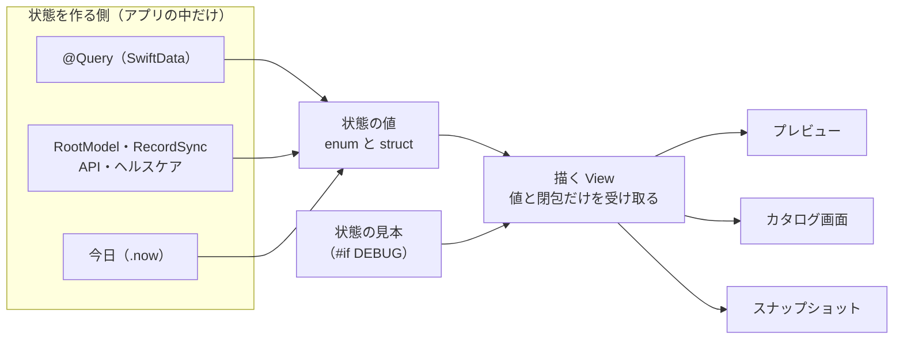
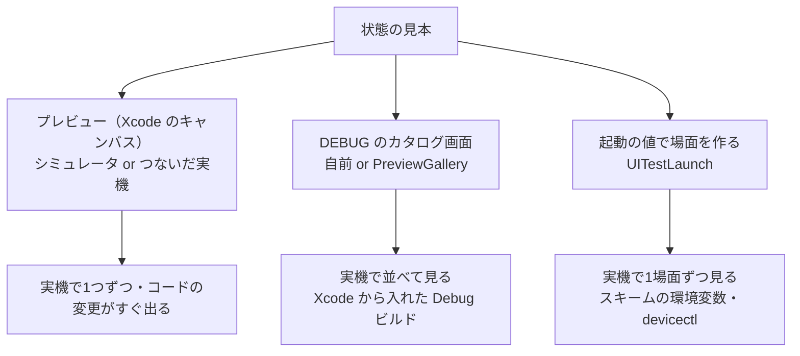
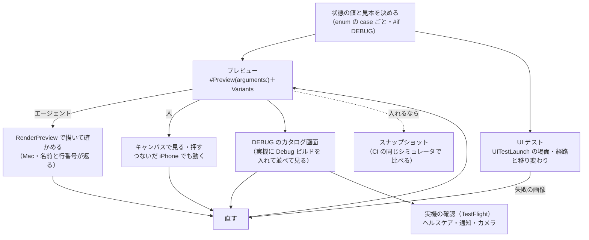

# SwiftUI で UI を状態ごとに並べて細かく直す（プレビュー・カタログ・スナップショット・UI テスト）

調査日: 2026-09-30
対象: nu-tori の iPhone アプリ（Swift・SwiftUI、iOS 26 以上、Xcode 27）で、Web の Storybook のように画面を状態ごとに並べて見比べ、細かく直すループをどう作るか。特に、実機で再現するのが面倒な状態（同期の失敗、送り待ちが溜まっている、電波がない、サーバーのエラー、空の状態、ヘルスケアの権限が無い）を、実機の確認を待たずに見られるようにしたい。前提は `docs/research/agent-ios-verification.md`（エージェントの検証の道具）と `docs/research/ui-test-api.md`（UI テストで API を差し替える）

> **確認の方法と限界**
> - Apple の開発者向けドキュメントとリリースノートは、同じ内容の JSON（`https://developer.apple.com/tutorials/data/documentation/<パス>.json`）を取得して**本文を直接読んだ**。出典にはふつうの URL を書く。WWDC のセッションは developer.apple.com/videos のページの書き起こしを読んだ。
> - OSS は clone して README・ソース・タグを読んだ: pointfreeco/swift-snapshot-testing（1.19.6、2026-09-21）、BarredEwe/Prefire（5.9.0、2026-09-23）、EmergeTools/SnapshotPreviews（v0.19.0、2026-09-15）、playbook-ui/playbook-ios（0.4.2、2024-12-04）、pointfreeco/swift-dependencies（1.17.1、2026-08-27）、airbnb/Showkase（README だけ）。swift-snapshot-testing のリリースノートは GitHub の Releases のページを WebFetch（取得して要約する道具）で読んだ。Swift Testing の提案（ST-0014）は swiftlang/swift-evolution を clone して読んだ。
> - 本文で確かめた主張は「本文で確認」と書き、短い英語の原文を添える。本文の記述から推し量ったものは「本文からの読み取り」と書き、何から読み取ったかを添える。本文を探しても記述が無かったものは「本文を探したが記述なし」と書き、探したところを添える。
> - Mac でも実機でも動かしていない（この調査は Linux のクラウド環境で行った）。`#Preview(arguments:)` の描かれ方、実機でのプレビュー、スナップショットの安定性は試していない。二次情報（ブログ、記事、SNS）は使っていない。開発者フォーラムは、Apple の社員の答えが見つからなかったので根拠にしていない。
> - リポジトリの今は、ルートと `ios/` の `AGENTS.md`、`docs/agents/languages/swift.md`、`docs/agents/testing.md`、`docs/agents/ios-mac.md`、`.github/workflows/ios-ui-test.yml`、`ios/NuTori` の一部（`App/`、`Timeline/TimelineScreen.swift`、`UITesting/`、`Sync/SwiftDataSyncStore.swift`）を読んで押さえた。コードの監査はしていない。

この文書で使う、`GLOSSARY.md` に無い語:

- **プレビュー**: Xcode Previews。ソースの横のキャンバス（Xcode の右の描画の欄）に、`#Preview` で書いた画面を描く Xcode の機能
- **カタログ**: 画面や部品を状態ごとに一覧にして、選んで見られる画面。Web の Storybook にあたる
- **状態の見本**: ある状態の画面を描くのに渡すデータ一式（fixture）。例: 「送り待ちが3件ある」「初回の取得の途中」
- **スナップショットテスト**: 画面を画像に描き、前に保存した画像（基準の画像）と比べて違いがあれば落とすテスト
- **差し替え用のもの**: `docs/agents/testing.md` の語。本物の依存（API、ストア、ヘルスケア）の代わりに渡す、決まった結果・遅延・失敗を返すもの

## 結論の要約

> 2026-10-01 に Mac で動かして確かめた結果は、末尾の「追記」にある。実機のプレビューは動き、カタログ画面は要らない。SnapshotPreviews は `#Preview(arguments:)` を描けず、`PreviewModifier` も当てなかった。swift-snapshot-testing は同じ OS なら機種をまたいで一致したが、iOS 26 と 27 では一致しなかった。

- **Apple の答えは「画面には表示に要るデータだけを値で渡せ。データを取ってくるものを渡すな」**。Xcode の文書が、プレビューとテストを楽にする作り方としてこう書き、例に `enum ConnectionStatus { case online, offline }` を受け取るセルを状態ごとに並べている（本文で確認）。WWDC20 は「リッチなモデルから単純な値への変換を早くするほど、再利用でき、テストでき、プレビューできる」と言う（本文で確認）。状態を値で受け取る画面を作れば、以下の道具はすべて同じ状態の見本から回せる（本文からの読み取り）。
- **プレビューは Xcode 27 で「状態の一覧」に近づいた**。`#Preview(arguments:)` に値の配列を渡すと、キャンバスが値ごとの格子で並べ、押すとその状態を操作できる（本文で確認、Xcode 27 の新機能。API の対応版は iOS 26 から）。キャンバスの Variants で、ライト・ダーク、コントラスト、向き、文字サイズ違いを横に並べられ、Xcode 27 で言語も切り替えられる（本文で確認）。共有の環境やサンプルデータは `PreviewModifier`、`@State` などは `@Previewable` で入れる（本文で確認）。`PreviewProvider` の系統は Xcode 27 で非推奨（本文で確認）。
- **実機で状態を並べて見る道は3つある**（本文で確認）。(1) **プレビューを実機で動かす**: キャンバスの機器の選択に、Mac につないだ iPhone が出る。選ぶとシミュレータを使わず実機でプレビューが動き、コードの変更がすぐ実機に出る（WWDC23）。(2) **DEBUG のビルドにだけカタログ画面を持つ**: 自前で作るか、SnapshotPreviews の `PreviewGallery`（アプリ内に全プレビューの一覧を出す）を使う。(3) **起動の値で状態を作る**: Xcode のスキームの環境変数、または `devicectl device process launch --environment-variables` で実機のアプリに値を渡す。nu-tori には UI テスト用の `UITestLaunch`（`#if DEBUG`）が既にあり、これをそのまま使える（本文からの読み取り）。
- **スナップショットテストは swift-snapshot-testing が定番で、Swift Testing に対応している**（本文で確認）。ただし「基準の画像を撮ったのと全く同じシミュレータで比べよ」と README が警告しており（本文で確認）、Xcode・ランナーのイメージが変わるたびに基準の撮り直しが要る（Prefire の文書、本文で確認）。プレビューから自動でテストを作る Prefire（XCTest の雛形、プレビューの本文を文字列として写す）と SnapshotPreviews（実行時にプレビューを探す）もあるが、どちらも `PreviewModifier` の trait を当てない作りに読める（ソースからの読み取り）。
- **Apple 純正でスナップショットを比べる道具は無い**（本文を探したが記述なし）。純正でできるのは、Swift Testing の画像の添付（Swift 6.3、`ImageRenderer` で SwiftUI の画面を画像にして添付する例が提案にある）と、XCUITest のスクリーンショットの添付、Xcode 27 の「UI テストを向き・言語・外観の組み合わせごとに回す」雛形まで（本文で確認）。`ImageRenderer` は `List` や多くの UIKit 由来の部品を描けず、代わりの画像を出す（本文で確認）。
- **エージェントには、プレビューがいちばん回しやすい**。Xcode 27 の RenderPreview（Xcode の MCP の道具）は、Variants（外観・向き・文字サイズ）と `#Preview(arguments:)` の組を描け、描いたプレビューの名前と行番号を返す（本文で確認）。nu-tori では `docs/agents/ios-mac.md` のとおり MobileBuildMCP の `xcode_ide_call_tool` から呼べる。ただし Mac でしか動かず、Linux のクラウドでは、macOS ランナーの CI が残す画像を読むことになる（本文からの読み取り）。
- **nu-tori へのおすすめ**: スナップショットテストは今は入れず、(1) 画面を「状態の値を受け取って描く View」と「`@Query`・依存から状態を作る側」に分け、(2) 状態の見本を DEBUG のコードに置いて `#Preview(arguments:)` で並べ、(3) 同じ見本を DEBUG のカタログ画面と `UITestLaunch` の場面からも使い、実機はプレビューの実機実行とカタログで見る。詳しくは末尾の「おすすめ（nu-tori の場合）」。

## 前提: nu-tori の今（関係するところだけ）

- `ios/NuTori` に `#Preview` と `PreviewProvider` は1つも無い（grep で 0 件）
- 状態を作る仕組みは UI テスト用に既にある。`NuTori/UITesting/UITestLaunch.swift`（`#if DEBUG`）が `launchEnvironment` の `UI_TEST_ACCOUNT`・`UI_TEST_API`・`UI_TEST_HEALTH_AUTHORIZATION` などを読み、メモリだけの `SwiftDataSyncStore`、`StubAPITransport`（`offline`・`previousDayPushRejected`・`accountDeletionRateLimited` などの振る舞い）、`UITestHealthStore` で `AppRuntime` を組み立てる。サインインし直しで送り待ちが残る場面（`signInAgainWithPendingWrites`）や、初回の取得の途中（`signedInFetching`）もある
- `AppRuntime` は `ModelContainer` と `RootModel` を持ち、`RootView` は `model.screen`（`opening`・`signIn`・`loadingTimeline`・`timeline`）で画面を切り替える
- `TimelineScreen` は、閉包（`saveWeight` など）と `rejectedLines` を引数で受け取る一方、体重記録と同期の状態は自分で `@Query` し、今日は `.now` から決める。このままではプレビューやスナップショットに `ModelContainer` の用意が要り、描くたびに日が変わる（本文からの読み取り: ソースの `@Query private var cachedRecords`・`@Query private var syncStates`・`CalendarDay(containing: .now, in: .current)`）
- `docs/agents/testing.md` は「テストの数は最小限」「UI テストは画面の経路と状態の移り変わりに絞る」とする

## 問い1: Xcode Previews の今（Xcode 26・27）

### 書き方

- **`#Preview` マクロに名前と trait（描き方の指定）を渡す**。名前はキャンバスの上のタブの表示になる（本文で確認、A2: "Xcode also uses the name that you pass to the macro as the label for that preview in the tab bar of the canvas."）。trait は配置（`defaultLayout`・`fixedLayout`・`sizeThatFitsLayout`）、向き（`portrait`・`landscapeLeft` など）、`modifier(_:)`（下の `PreviewModifier`）がある（本文で確認、A7 の一覧）。当てはまらない trait は無視される（本文で確認、A1b: "The macro ignores traits that don’t apply to the current context."）
- **`@Previewable`**: `#Preview` の本体の最上位で `@State` などに付けると、プレビューが包む View を作り、そのプロパティにしてくれる。`@Binding` を受け取る View をそのまま動かせる（本文で確認、A5: "tagged declarations become properties on the view, and all remaining statements form the view’s body."）。iOS 17 から
- **`PreviewModifier`**: 重い物（ネットワークやディスクに触れる物、`ModelContainer` など）を `makeSharedContext()` で1回だけ作り、`body(content:context:)` で環境に入れる。プレビューの系がキャッシュして、同じ型の modifier を使うプレビューで使い回す（本文で確認、A4: "Conforming types can define shared contexts that will be cached by the preview system, then reused across participating previews."、W3: "this method is only called once for all modifiers of the same type"）。iOS 18 から。複数渡すと順に重なる（本文で確認、A7）。WWDC24 は `extension PreviewTrait` に `static var sampleData` を足して `#Preview(traits: .sampleData)` と書く形を勧め、SwiftData の `ModelContainer` をメモリだけで作る例を示す（本文で確認、W4: "Since a preview doesn’t need to store anything to disk, I will create a ModelConfiguration that stores data in memory only"）
  - 注意: `makeSharedContext()` は `static` で、型ごとに1回しか呼ばれない。「送り待ち3件」「送り待ち0件」のように**同じ型で中身の違う文脈は作れない**。状態ごとに違うデータは、共有の文脈ではなく各プレビューの本体か `body` で入れることになる（本文からの読み取り、A4・W3）
- **`#Preview(arguments:)`（新）**: 値の配列を渡すと、値ごとのプレビューの組を作る（本文で確認、A6: "Creates a group of previews of a parameterized SwiftUI view, varying its inputs over the provided arguments."）。文書の対応版は iOS 26.0 から（macOS は 27.0）。Xcode 27 のリリースノートは新機能として「キャンバスが引数ごとの格子で並べ、押すと Interactive で開く」と書く（本文で確認、A9: "Canvas can now display a grid of previews for each argument passed to the new `#Preview(arguments:)` syntax. Clicking on a preview in argument or variant grids opens the preview in the Interactive mode."）。WWDC26 のラボでも「enum の全部の値を渡すと、1つのプレビューで格子に描ける」と説明している（本文で確認、W7: "You could pass in enum all values, and then your single preview can then take that argument and just give you a grid"）。つまり Xcode 27 でビルドすれば、最低対応版が iOS 26 の nu-tori でも使える（本文からの読み取り、A6 の対応版と A9）
- **`PreviewProvider` の系統は Xcode 27 で非推奨**（本文で確認、A9: "`PreviewProvider` and its family of preview modifiers."）。`previewLayout(_:)`・`previewDevice(_:)`・`previewDisplayName(_:)` などは文書の「Deprecated」にまとめられ、`previewLayout(_:)` は iOS 27.0 で非推奨（本文で確認、A8）。新しく書くなら `#Preview` と trait を使う
- **`#Preview` の本体はメインアクターで動く**と Xcode 27 で明示された（本文で確認、A9: "Code inside #Preview now explicitly runs on the main actor"）。nu-tori の厳しい型検査（Swift 6、警告をエラー）でも `@MainActor` の API を呼べる

### キャンバスで並べる

- **Variants**: キャンバスの左下の Variant ボタンで、Color Scheme（ライト・ダーク）、Contrast、Control Borders、Orientation、Dynamic Type（文字サイズ）の違いを横に並べる（本文で確認、A3: "Use variant mode to compare your view in different configurations side by side."）。Device Settings で1つずつ固定もできる
- **Xcode 27 で足されたもの**（本文で確認、A9）: 言語を切り替えて描く（"You can now preview your UI in a different localization."）、iOS のプレビューを任意の大きさで描く Resizable Canvas、コントラストと Control Borders の上書き、`#Preview`・`#Playground` のタブを個別にピン留め（ほかのファイルを開いてもプレビューが残る）
- **コードで外観や文字サイズを固定する trait は無い**。trait は配置と向きと modifier だけ（本文で確認、A7 の一覧）。ダークや大きい文字を名前付きのプレビューとして残すなら、本体で `.preferredColorScheme(.dark)` や `.environment(\.dynamicTypeSize, ...)` を当てるか、`PreviewModifier` を作ることになる（本文からの読み取り）
- **キャンバスのスクリーンショット**: 右下の Screenshot ボタンでファイルに保存できる（本文で確認、A3）

### 実機で動かす

- **プレビューは実機でも動く**。キャンバスの機器の選択（Preview Device）に Mac につないだ機器が出て、選ぶと「シミュレータを使わず、その機器だけに向けてビルドしてプレビューする」。キャンバスのモードや Device Settings もそのまま使え、コードの変更がすぐ実機に出る（本文で確認、W2: "When I pick one of these connected devices, Xcode will build and preview exclusively for this device, bypassing the simulator entirely." "And updates to my code show up instantly on my device."）。Xcode 26 のリリースノートにも、実機に向けたプレビューの不具合の修正がある（本文で確認、A9b: "Previews could fail when targeting a physical device"）
- Xcode 27 の文書（キャンバスの操作）は機器の例に「an iPhone or My Mac」を挙げるが、実機でのプレビューの手順は書いていない（本文を探したが記述なし、A3）。Xcode 27 の Device Hub で iPhone を Wi-Fi でペアリングできるので（A9）、ケーブル無しでも実機を選べる可能性があるが、試していない

### 制約

- **プレビューはアプリ（実行ファイル）の中で動く**。選んだスキームの中のアプリから、描くファイルを含むターゲットを辿って決める。アプリが無ければ `XCPreviewAgent` を作ってライブラリを読み込む（本文で確認、W2: "Previews need an executable, an app or a widget, to launch and render previews."）。つまり `NuToriCore` のパッケージの中のプレビューも描けるが、`NuToriCore` は SwiftUI を import しない決まりなので、画面のプレビューはアプリのターゲットに置く（本文からの読み取り、`ios/AGENTS.md`）
- **Debug のビルドでは、SwiftUI が `some View` を `DebugReplaceableView` に消して、プレビューが作り直しなしで差し替えられるようにする**。そのぶん遅くなるので、性能は Release で測れ（本文で確認、A10: "This type erasure can impact performance ... so any performance testing should be done in release mode."）
- **SwiftData**: メモリだけの `ModelContainer` を `PreviewModifier` で作る形を Apple が示す（本文で確認、A4・W4）。nu-tori の `SwiftDataSyncStore(inMemory: true)` と `prepareForUITest(state:pendingWrites:)` がそのまま使える（本文からの読み取り）
- **ネットワーク**: 文書は「ネットワークに触れる重い物」を `PreviewModifier` で1回だけ作れ、と書き、WWDC24 の例は「プレビューのたびにサーバーを叩く必要はない」として差し替え用のものを作る（本文で確認、A2・W3: "hitting the server over and over while building my previews, isn’t necessary."）。プレビューがネットワークに出られないとは書いていない（本文を探したが記述なし、A1〜A4）
- **ヘルスケア（HealthKit）**: プレビューで HealthKit を使えるか、権限のシートがどう出るかの記述は無い（本文を探したが記述なし、A1〜A4、W2〜W4）。swift-dependencies の README は「位置情報や音声認識のような依存は SwiftUI のプレビューでうまく動かない」と書く（本文で確認、O6: "Many dependencies **do not work well in SwiftUI previews**, such as location managers and speech recognizers"）。nu-tori では、ヘルスケアは `UITestHealthStore` のような差し替え用のものでだけ描くのが安全（本文からの読み取り）
- **プレビュー中かを見分ける公式の方法は文書に無い**。環境変数 `XCODE_RUNNING_FOR_PREVIEWS` が広く使われているが、Apple の文書では見つからなかった（本文を探したが記述なし、A1〜A3 と Xcode の文書の検索）。見分けて振る舞いを変えるより、差し替え用のものを外から渡す形にするほうが文書の勧めに沿う（本文からの読み取り、A2）
- **速さ**: WWDC26 のラボは「プレビューの速さはビルドの速さに従う。ターゲットと依存を小さくし、アプリ全体ではなく焦点を絞った部分の View を描け」と答えている（本文で確認、W7 の章の要約: "structure previews to render focused subviews rather than the whole app"）。Xcode 27 はプレビュー用のシミュレータの数を Mac の資源に合わせて抑える（本文で確認、A9）

## 問い2: 状態を注入できる設計

### Apple の勧め

- **画面には、表示に要る最小のデータを、単純で変わらない値で渡す**（本文で確認、A2 の「Pass views only the data they need」: "Avoid passing in objects that fetch data; objects make setting up a view’s preview more complicated and less performant." "Creating views this way makes testing and previewing your views easier"）。例は `name`・`image`・`connectionStatus`（`enum { case online, offline }`）を受け取るセルを、1つのプレビューに6通り並べるもの
- **WWDC20「Structure your app for SwiftUI previews」**は、リッチなデータ型（CloudKit などのモデル）から、画面が使う単純な値への変換を早くするほど、再利用・テスト・プレビューがしやすい、と言う（本文で確認、W1: "the sooner that we do this translation from our rich type into our simpler data types, the more reusable, testable, and previewable our app is gonna be."）。渡し方として、変わらない値、`Binding`、ジェネリクス、環境の4つを挙げる
- **共有するモデルは環境で渡す**。`@Observable` のモデルは `.environment(_:)` で入れて `@Environment(Type.self)` で読む。値は `EnvironmentValues` に `@Entry` で足す（本文で確認、A11・A12）。プレビューでは同じ口に差し替え用のものを入れる（本文で確認、A2 の `AppState` の例）

- `docs/agents/languages/swift.md` の「状態は論理状態の数で型を作る」（`enum WeightRecordsState { case loading, failed(any Error), loaded([WeightRecord]) }`）は、この「描く View に渡す値」の形そのもの。状態の見本は、この enum の各 case の値として作れる（本文からの読み取り）

### 依存の差し替え

- **プロトコルか閉包で依存を切り、差し替え用のものを渡す**。nu-tori は `docs/agents/languages/swift.md` の「依存の差し替え」で、`{依存の名前}Mock` の class と `.ok(...)`・`.error(_:)`、UI テスト用はアプリのターゲットに `#if DEBUG` で置く、と決めている。プレビューとカタログの差し替え用のものも、UI テスト用と同じくアプリのターゲットの `#if DEBUG` に置くことになる（本文からの読み取り）
- **swift-dependencies**（Point-Free）: 依存ごとに `liveValue`・`testValue`・`previewValue` を持てる。プレビューで使う値を上書きするには `.dependencies { ... }` の preview trait（iOS 18 から）か、本体で `prepareDependencies { ... }` を呼ぶ（本文で確認、O6 の LivePreviewTest: "if you want to test the empty state of your feature when the API client returns an empty array, you can use the `.dependencies` preview trait"）。空の状態と、エラーを投げる状態の例がそのまま載っている。時間は `ImmediateClock` で潰せる（本文で確認、O6 の README）。ただし nu-tori は今この依存を持たず、閉包と `AccountActions` のような値で渡しているので、入れるかは別の判断（本文からの読み取り）

### 非同期の移り変わりをプレビューで見る

- **遅延と失敗を返す差し替え用のものを渡し、Live（操作できるモード）で押す**。キャンバスの Live モードは「制御の論理、アニメーション、文字入力、非同期のコードへの反応」を試すためのもの（本文で確認、A3: "Use live mode to test control logic, animations, text entry, and responses to asynchronous code."）。Xcode 27 では格子のプレビューを押すと Interactive で開く（本文で確認、A9）
- 例（nu-tori に当てはめた形、本文からの読み取り）: `saveWeight` に「1秒待ってから失敗する」閉包を渡すと、送り待ちに入る → 失敗の表示、の移り変わりをキャンバスで押して見られる。`ContinuousClock` を差し替えられる形にしておけば、待ち時間を 0 にもできる（swift-dependencies の `ImmediateClock` と同じ考え、O6）
- WWDC26「Create UI prototypes using agents in Xcode」は、エージェントに「空の状態、長い文字、終わりの無い一覧」のような端のケースの見本を作らせ、状態の切り替えをプレビューの横の調整パネルで行う形を紹介している（本文で確認、W8: "populate prototypes with realistic sample data and cover edge cases, including empty states, long text, and unbounded lists." "tuning panels can be useful ... for swapping between app states"）

## 問い3: Storybook 相当のカタログ

### OSS

- **airbnb/Showkase は対象外**。Jetpack Compose（Android）の注釈処理によるライブラリで、Swift・SwiftUI には使えない（本文で確認、O5: "Showkase is an annotation-processor based Android library that helps you organize, discover, search and visualize Jetpack Compose UI elements."）
- **EmergeTools/SnapshotPreviews の `PreviewGallery`**: アプリに組み込む SwiftUI の画面で、アプリの中のプレビューを一覧にする。「Xcode が無いところで使う社内ビルド向け」（本文で確認、O3: "`PreviewGallery` is an interactive SwiftUI view that turns your previews into a browsable gallery of components — useful for internal builds where Xcode isn't available."）。書いた `#Preview` がそのままカタログになるので、見本の二重管理が要らない
  - 探し方は、ビルドしたアプリの実行時のメタデータ（`__swift5_proto` の節）から `PreviewProvider` と `#Preview` が作る型を拾う（本文で確認、O3 の「How does it work?」）。trait は `Mirror` で読んで配置と向きだけを拾うので、`PreviewModifier` の trait（`.modifier(...)`）は当たらないように読める（ソースからの読み取り、`SnapshotPreviewsCore.swift` の `init?(preview:)`）。Apple の非公開の内部の形に頼っているので、Xcode を上げたときに壊れうる（本文からの読み取り、同じソースの `Mirror`・`unsafeBitCast`）
  - TestFlight に入れるなら、Release を変えず専用のビルド構成を作り、whole-module の最適化でプレビューが消えないようにし、`#if DEBUG || PREVIEW_GALLERY` のような条件を足せ、と書く。「信頼できる社内ビルドにだけ出せ。未完成の UI やモックのデータが見える」（本文で確認、O3）
- **BarredEwe/Prefire の Playbook**: `#Preview` を解析して `PreviewModels.generated.swift` を作り、`PlaybookView` で一覧にする。`.previewState(.loading)` で状態の印を、`.previewUserStory(.auth)` で流れの印を付けられ、`#Preview(arguments:)` も値ごとに1つに開く（本文で確認、O2）。Release から外すには `#if DEBUG` か `PLAYBOOK_DISABLED` の設定を使う（本文で確認、O2 の「Distribution」）
- **playbook-ui/playbook-ios**: 「Storybook に強く影響された」サンドボックス。`Scenario` を手で登録し、`PlaybookGallery`・`PlaybookCatalog` で一覧にし、`PlaybookSnapshot` で全場面の画像を書き出す（本文で確認、O4: "strongly inspired by Storybook for JavaScript"）。最後のタグが 0.4.2（2024-12-04）で、要件は Swift 5.10・Xcode 15.4 と書かれたまま（本文で確認、O4）。`#Preview` とは別に場面を書く必要がある
- 「swiftui-preview-gallery」のような名前の、上の3つより広く使われている OSS は見つからなかった（本文を探したが記述なし、GitHub の検索と上の README の関連リンク）

### 自前の DEBUG カタログ

- Apple はアプリの中の開発用メニューやカタログの作り方を文書にしていない（本文を探したが記述なし、A1〜A3・Device Hub の文書）。作るなら、ふつうの SwiftUI の `List` と `NavigationLink` で状態の見本を並べ、`#if DEBUG` で囲むだけになる（本文からの読み取り）
- 実機で動かすには、Xcode から Debug ビルドを実機に入れる。TestFlight と App Store の版は Release なので、`#if DEBUG` のカタログは入らない（本文からの読み取り、`ios/AGENTS.md` の配布の決定と、SnapshotPreviews の注意 O3）

### 起動の値で場面を作る（実機でも）

- **スキームの Run の Arguments タブで、起動の引数と環境変数を渡せる**。Xcode は実行の前に環境変数を用意して渡す（本文で確認、A13: "specify that information on the Arguments tab of the Run, Test, or Profile build scheme action." "Xcode configures and exports environment variables before it runs the process."）。実機に Run したときも同じ（本文からの読み取り、A13 は行き先を分けていない）
- **`devicectl device process launch` の `--environment-variables` で、シミュレータか実機のアプリに環境変数を渡して起動できる**（本文で確認、A14: "You can launch an app on a simulated or physical device ... use the `--environment-variables` option to pass environment variables to the app."）
- nu-tori の `UITestLaunch` は `ProcessInfo.processInfo.environment` を読むだけなので、Debug ビルドを実機に入れ、`UI_TEST_ACCOUNT=sign-in-again-with-pending-writes` などを渡せば、同じ場面が実機に出る（本文からの読み取り、ソース）。画面全体の流れを実機で確かめるのに向き、部品を並べるのには向かない

## 問い4: スナップショットテスト

### swift-snapshot-testing（Point-Free）

- **Swift Testing で書ける**。README の最初の例が `@Test` の中で `assertSnapshot(of: vc, as: .image)` を呼ぶ形。Suite ごとに `@Suite(.snapshots(record: .failed))` で撮り直しを指定できる（本文で確認、O1）。1.19.0（2026-03）で Swift Testing の添付に対応し、1.19.1 で Swift 6.3 以降は Swift Testing のネイティブの画像の添付を使うようになった（本文で確認、O1 のリリースノート: "Use native Swift Testing image attachments in Swift >=6.3"）
- **SwiftUI の View を直接撮れる**。`.image(layout:traits:)` で `.device(config:)`（機器の大きさ）、`.fixed(width:height:)`、`.sizeThatFits` を選び、`UITraitCollection` で文字サイズなどを上書きする。内部では `UIHostingController` に載せる（本文で確認、O1 の `SwiftUIView.swift`）。`drawHierarchyInKeyWindow: true` にすると `UIAppearance` や `UIVisualEffect` も描けるが、ホストのアプリが要る（本文で確認、同）。1.19.3 以降で `UIHostingController` の safe area の影響を除く修正が入っている（本文で確認、コミット 1bc16f4）
- **比べるのは、基準を撮ったのと全く同じシミュレータで**（本文で確認、O1: "Snapshots must be compared using the exact same simulator that originally took the reference to avoid discrepancies between images."）。`precision` と `perceptualPrecision`（98〜99% で人の目に近い）で許す差を決められる（本文で確認、O1 の `SwiftUIView.swift` のコメント）
- **iOS 26・27 との相性**: 最新の 1.19.6（2026-09-21）は macOS 27 での知覚的な比較のクラッシュを直した。iOS 26・27 や Liquid Glass（iOS 26 の新しい見た目）の描画について、リリースノートと README に注意書きは無い（本文を探したが記述なし、O1 の README と Releases）
- **依存の追加**: Xcode ではテストのターゲットに足せ、アプリのターゲットに足すな、と README が警告する（本文で確認、O1）。nu-tori の決まりでは `exact:` で固定する（`docs/agents/languages/swift.md`）

### プレビューから自動で作る

- **Prefire**: `#Preview` と `PreviewProvider` を解析し、swift-snapshot-testing を使うテストを生成する。SPM・Xcode のビルドプラグインと CLI がある（本文で確認、O2）
  - 既定の雛形は **XCTest**（`@MainActor class ...Tests: XCTestCase`）で、プレビューの本体を**文字列のまま**テストに写す。`@Previewable` のプロパティは包む View に移す。trait は `.device` と `fixedLayout` だけを見る（ソースで確認、O2 の `PreviewTestsTemplate.swift` と `Templates.md` の `traits` の説明: "Raw trait tokens"）。つまり `.modifier(...)` の `PreviewModifier` は生成したテストに当たらないと読める（本文からの読み取り）。雛形は Stencil で差し替えられるので、Swift Testing に書き換えることはできる（本文で確認、O2 の `Templates.md`）
  - 「Xcode を上げると基準の画像はたいてい一度に古くなる。`SNAPSHOT_TESTING_RECORD=all` で一度回して撮り直せ」と書く（本文で確認、O2 の `Configuration.md`: "After an Xcode update every reference usually goes stale at once."）
- **SnapshotPreviews**: テストのクラスを `SnapshotTest` から継ぐだけで、見つけたプレビューごとにテストが実行時に足される。画像は `.xcresult` に添付するか、`TEST_RUNNER_SNAPSHOTS_EXPORT_DIR` のディレクトリに PNG と JSON で書き出す（本文で確認、O3）。**比べる仕組みは持たず**、書き出した画像を Sentry Snapshots などの外の比較の道具に上げる前提（本文で確認、O3: "export them to disk for upload to Sentry Snapshots or any other visual diffing service"）。「決まった結果になるように、生のネットワーク、タイマー、終わらないアニメーション、今の時刻から作る日付を避けよ」と書く（本文で確認、O3 の「Snapshot best practices」）。描くだけでクラッシュしないかを見る `PreviewLayoutTest`（画像を作らないので速い）もある（本文で確認、O3）
  - nu-tori は Sentry を既に使っているが、観測の道具に何を送るかは ADR-0017 とルートの `AGENTS.md` の決まりに当たる。見本のデータでも画面の画像を観測の道具に送るかは、`docs/agents/privacy.md` を読んで決めることになる（本文からの読み取り）

### Apple 純正の手段

- **画像を比べる API は無い**（本文を探したが記述なし、XCTest・Swift Testing の文書、Xcode 26・27 のリリースノート）
- **Swift Testing の画像の添付（ST-0014、Swift 6.3 で実装済み）**: `UIImage`・`CGImage` などをそのまま `Attachment.record(image, named:, as: .png)` で添付できる。提案に「SwiftUI の View を `ImageRenderer` で画像にして添付する」例がある（本文で確認、O7: "It is frequently useful to be able to attach images to tests for engineers to review, e.g. if a UI element is not being drawn correctly."）。比べはしないが、CI で描いた画像を人やエージェントが見る用途には足りる（本文からの読み取り）
- **`ImageRenderer` の限界**: SwiftUI が自分で描く文字・画像・図形とその組み合わせだけを描き、「複雑なコントロールやコンテナ、Web の画面、ほとんどの UIKit・AppKit の View」は代わりの画像になる（本文で確認、A15: "It does not include views whose contents are composited by Core Animation layers, such as more complex controls and containers ... In those cases, `ImageRenderer` displays a placeholder image"）。`List`・`NavigationStack`・シートを使う nu-tori の画面全体は、これでは撮れない見込み（本文からの読み取り）
- **XCUITest**: 画面のスクリーンショットを `XCTAttachment` で残す（nu-tori は既に行っている）。Xcode 27 は `runsForEachTargetApplicationUIConfiguration` を使う起動テストの雛形を足した。これを `true` にすると、アプリが対応する外観・向き・言語の組み合わせごとに UI テストを1回ずつ回す（本文で確認、A9: "runs across every combination of orientation, localization, and appearance your app supports"、A16）

### 同じ状態の見本から、プレビューとスナップショットを作る

- 見本を `enum` や `static let` の値にしておき、`#Preview(arguments: 見本.allCases)` と Swift Testing の `@Test(arguments: 見本.allCases)` の両方に渡せば、同じ見本から両方を作れる（本文からの読み取り、A6 と O1。Xcode 27 は Swift Testing のパラメータ化テストの各場合を識別できるようにした、A9）。Prefire はプレビューの本体を写すので、見本を値にしておけば `arguments:` をそのまま値ごとの画像に開く（本文で確認、O2: "Prefire expands each argument into its own snapshot and Playbook preview."）
- ただし `docs/agents/testing.md` は「既定ではパラメータ化テストにしない」とするので、スナップショットでこれを使うなら例外として決めることになる（本文からの読み取り）

## 問い5: UI テスト・シミュレータ側

- **起動の値で状態を注入するのが Apple の定石**。`launchArguments`・`launchEnvironment` と、テストプランの構成ごとの環境変数は `docs/research/ui-test-api.md` の問い1にまとめてある。nu-tori は `UITestLaunch` で既にこの形
- **電波がない・遅いの再現**:
  - Xcode 11 から、Devices の画面の「Device Conditions」で、つないだ実機の回線（遅い 3G、高い遅延、パケットロスなど）と熱の状態を再現できる。macOS では Network Link Conditioner の設定パネル、iOS 実機では開発者の設定にある（本文で確認、W6: "In Xcode 11, we've brought the ability to activate and vary different network types to the devices and simulators window"）
  - Xcode 27 の Device Hub の文書と WWDC26 のセッションは、設定の欄で「位置の変化のような条件」を再現できると言うが、回線の条件には触れていない（本文を探したが記述なし、A17・W9: "lets you test how your app responds to different conditions, like a change in location"）
  - シミュレータは Mac の回線を使うので、Mac の Network Link Conditioner が効く、という Apple の記述は見つからなかった（本文を探したが記述なし）
  - nu-tori の UI テストはサーバーにつながず、`StubAPITransport` の `offline` で電波がない状態を作る。回線を実際に落とすより決まった結果になる（本文からの読み取り、`ios/AGENTS.md` と `ui-test-api.md`）
- **ステータスバーの上書き**: `xcrun simctl status_bar <device> override --time "9:41" --batteryState charged --batteryLevel 100`（Xcode 11）、通信会社の名前も（Xcode 11.4）（本文で確認、A18: "`simctl` can now override status bar values for iOS devices."）。スクリーンショットの時刻を固定するのに使える
- **外観と権限**: `xcrun simctl ui <device> appearance dark`、`xcrun simctl privacy <device> grant photos <bundle>`、`xcrun simctl push`（Xcode 11.4）（本文で確認、A18b）。ヘルスケアの権限を `simctl privacy` で与えられるかは、リリースノートに記述が無い（本文を探したが記述なし）。nu-tori は `UITestHealthStore` で権限の状態を差し替えている
- **Xcode 27 の Device Hub**: シミュレータと実機の画面を1つの窓で操作でき、設定の欄でコントラスト、文字サイズ、ダーク、位置を切り替え、アプリのデータコンテナを落として別のものに置き換えられる。実機の画面も見て操作できる（本文で確認、W5: "I have a paired iPad Pro already running my app, and I can see and control it directly in Device Hub!"、W9、A17）。iPhone の画面の大きさを任意に変える resize モードもある（本文で確認、A17b）。データコンテナの置き換えは、送り待ちが溜まった端末の中身を別の端末に写して見るのに使える（本文からの読み取り、W9 のデモ）
- **並列のテストを見るとき**: 並列で回すと Device Hub にシミュレータが見えないことがある（本文で確認、A9 の既知の問題）

## 問い6: エージェントとの相性

- **プレビューがエージェントの検証ループにいちばん入れやすい**。Xcode 27 の RenderPreview は、外観・向き・文字サイズの Variants を描け、`#Preview(arguments:)` の組も描け、描いたプレビューの表示名と行番号、描いたシミュレータの機種と OS の版を返す（本文で確認、A9: "The Preview Snapshot MCP tool can now render variants such as light/dark appearance, portrait/landscape orientation, and various type size overrides." "The RenderPreview MCP tool now supports rendering Previews using the new group feature." "now returns the display name and line number of the preview it rendered."）。道具の一覧とつなぎ方は `docs/research/agent-ios-verification.md` の問い1、nu-tori での呼び方は `docs/agents/ios-mac.md`（MobileBuildMCP の `xcode_ide_call_tool`、ワークツリーごとに開発者の承認が1回要る）
- **WWDC26 も「プレビューを1つずつ名前を付けて作らせ、描いて確かめさせる」流れを勧める**（本文で確認、W8: "I make sure that each variation gets its very own named Swift preview."、W10: "Previews can be rendered incrementally to visually verify results, confirming that what was generated matches what you asked for."）。状態ごとに名前の付いたプレビューがあれば、「送り待ちありのプレビューの右上がずれている」のように人とエージェントが同じ名前で指せる（本文からの読み取り）
- **Linux では動かない**。プレビュー、スナップショット、UI テストはどれも Mac（Xcode）が要る（`agent-ios-verification.md` の問い2、本文で確認）。Linux のクラウドのエージェントができるのは次まで（本文からの読み取り）:
  - 状態の値の型と、見本、描く View のコードを書き、`scripts/check` で型検査と Linux で動くテストを通す（状態の値を `NuToriCore` 側で作る部分は Linux でテストできる）
  - macOS ランナーの CI（`ios-ui-test` は `xcode-27` のイメージ）が残した画像（UI テストのスクリーンショット、Swift Testing の添付、スナップショットの差分）を `gh api` で落として読む。今の `ios-ui-test.yml` は失敗したときに `xcresulttool export attachments` で添付を書き出している
- **スナップショットの撮り直しとエージェント**: 基準の画像は「同じシミュレータ」でしか比べられないので、撮り直しは CI のランナー（`xcode-27`）で行い、その画像をコミットすることになる。Mac の手元と CI で機種や OS の版が違うと差が出る（本文からの読み取り、O1・O2）

## 全体の流れ

## おすすめ（nu-tori の場合）

決めるのは開発者。ここに書くのは、上で確かめた事実からの提案。

1. **画面を「状態の値を受け取って描く View」と「状態を作る側」に分ける。** まず `TimelineScreen` のように自分で `@Query` し `.now` を読む画面から、描く部分を切り出し、体重記録・同期の状態・今日・`rejectedLines` を値で受け取る View にする。`@Query` を読むのは薄い外側に残す。状態は `swift.md` のとおり論理状態の数の enum にする（例: 初回の取得の途中、空、記録あり、送り待ちあり、送れなかった記録あり）。値だけで描けるので、プレビューに `ModelContainer` が要らなくなり、日も見本で固定できる（A2・W1 の勧めに沿う）
2. **状態の見本を1か所に置き、`#Preview(arguments:)` で並べる。** 見本はアプリのターゲットの `#if DEBUG` に置き（UI テスト用の差し替えと同じ扱い）、画面ごとに `#Preview("状態ごと", arguments: TimelineSample.allCases)` の1つと、ダーク・大きい文字の名前付きプレビューをいくつか持つ。Variants はキャンバスと RenderPreview で見られるので、全部をコードに書かない。`PreviewModifier` は「全プレビューで同じ重い物」（メモリだけのストアなど）にだけ使う
3. **実機での見え方は、まずプレビューを実機で動かして見る。** キャンバスの機器の選択でつないだ iPhone を選べば、状態ごとのプレビューをそのまま実機で見られる。並べて見比べたいときのために、**DEBUG のビルドにだけ小さな自前のカタログ画面**（見本の一覧の `List`）を持ち、アカウントの画面などから開けるようにする。依存が増えず、Apple の内部の形に頼らない。`#Preview` と見本を二重に書くのが負担になったら、SnapshotPreviews の `PreviewGallery` を試す（`PreviewModifier` の trait が当たらない点に注意）
4. **画面全体の場面は `UITestLaunch` を使い回す。** 実機でも Xcode のスキームの環境変数か `devicectl --environment-variables` で `UI_TEST_*` を渡せば、送り待ちが残ったサインインし直しや初回の取得の途中を実機で見られる。場面を足すときは UI テストとこの確認の両方に効く
5. **スナップショットテストは今は入れない。** `testing.md` の「テストは最小限」に対して、基準の画像の保守（Xcode・ランナーを上げるたびの撮り直し、同じシミュレータでしか比べられない）が重い。見た目の確かめはプレビューと RenderPreview で回す。入れるなら、画面が落ち着いたあと、swift-snapshot-testing を `exact:` で固定して Swift Testing で書き、撮るのは `xcode-27` の CI だけにして、画面ごとに数枚に絞る。見るだけで良いなら、Swift Testing の画像の添付（比べない）から始める手もある（`ImageRenderer` は `List` などを描けない点に注意）
6. **エージェントの手順に「プレビューを描いて確かめる」を足す。** UI を変える作業では、状態ごとのプレビューを足す・直し、Mac では RenderPreview で描いて確かめ、Linux では型検査までにして Mac か CI に任せる。手順を足すなら `docs/agents/ios-mac.md` に書く（働き方の変更なので、`docs/agents/decisions.md` の流れで決める）

## 確かめられなかったこと

このうちいくつかは、2026-10-01 に Mac で動かして確かめた（末尾の「追記: Mac で動かして確かめた結果」）。

本文を探したが記述が無かったもの:

- プレビューでヘルスケア（HealthKit）を使えるか、権限のシートがどう出るか
- プレビュー中かを見分ける公式の方法（`XCODE_RUNNING_FOR_PREVIEWS` は Apple の文書に無い）
- 実機でのプレビューの手順を書いた現行の文書（WWDC23 の書き起こしにはある）
- Xcode 27 の Device Hub で回線の条件（遅い・切れる）を再現できるか。シミュレータに Mac の Network Link Conditioner が効くか
- `simctl privacy` でヘルスケアの権限を与えられるか
- swift-snapshot-testing の、iOS 26・27（Liquid Glass）での描画の差についての注意
- Apple 純正の画像比較の API
- SwiftUI 向けの「プレビューの一覧」系 OSS で、上の3つ（SnapshotPreviews・Prefire・playbook-ios）以外に保守されているもの

試して確かめる必要があるもの:

- `#Preview(arguments:)` を最低対応版 iOS 26 のアプリで Xcode 27 から使えるか、キャンバスと RenderPreview でどう描かれるか
- プレビューを実機（Wi-Fi でペアリングした iPhone を含む）で動かせるか、nu-tori の依存（Sentry・PostHog）があっても速く動くか
- SnapshotPreviews の `PreviewGallery` と Prefire が、`#Preview(arguments:)` と `PreviewModifier` を使うプレビューをどう扱うか

## 追記: Mac で動かして確かめた結果（2026-10-01）

上の「確かめられなかったこと」のうちいくつかを、開発者の Mac（Xcode 27、シミュレータは iOS 27.0 の iPhone 17・iPhone 17 Pro Max と iOS 26.5 の iPhone 17）と iPhone の実機で試した。試しのプロジェクト（XcodeGen で作る小さなアプリ。同期の状態の見本 `SyncSample` の4つの場合を描く `SyncBanner` など）と、出力の画像・ログは、コミット 4cad54e の `experiments/preview-lab/` にある（このノートを main に入れるときに、フォルダは消した）。確かさの書き方は「動かして確認」とする。

**プレビュー（キャンバス）**

- `#Preview(arguments:)` は、最低対応版 iOS 26・Swift 6（並行の厳しい検査）のアプリで、Xcode 27 からビルドできた（動かして確認）
- キャンバスは `arguments:` の4つの値を格子で並べ、1つを押すとそれだけが Interactive で開いた。Variants の Color Scheme と Dynamic Type は、4つの値と組み合わさって並んだ（動かして確認）
- `PreviewModifier` の trait（環境の値を赤にするもの）は、キャンバスでは当たった（動かして確認）
- プレビューの中で `HKHealthStore().requestAuthorization` を呼ぶと、プレビューが落ち（Preview Crashed）、同じシミュレータのほかのプロセスも「予期しない理由で終了」した（動かして確認）。プレビューにはヘルスケアに触れない、値を受け取って描く画面だけを置くのがよい（本文からの読み取りに加え、動かして確認）

**実機でのプレビュー**

- ケーブルでつないだ iPhone は、キャンバスの機器の選択に出て、選ぶと実機にプレビューが出た。コードの書き換えはすぐ実機に出た（動かして確認）
- ケーブルを抜き、Wi-Fi でつないだ iPhone でもプレビューが出た。書き換えが出るまでには時間がかかった（動かして確認）
- つまり、実機での見え方は、DEBUG のカタログ画面を作らなくてもプレビューで見られる

**プレビューからスナップショットを作る OSS（SnapshotPreviews 0.19.0）**

- 5つのプレビューを見つけて画像にしたが、`#Preview(arguments:)` は「Unhandled SwiftUI case in DefaultPreviewSource」の文字だけの画像になり、描けなかった（動かして確認）
- `PreviewModifier` の trait は当たらず、灰色で描かれた（動かして確認。上の「ソースからの読み取り」と合う）
- したがって、`#Preview(arguments:)` と `PreviewModifier` を使うなら、SnapshotPreviews（と `PreviewGallery`）は今のままでは使えない

**swift-snapshot-testing 1.19.6**

- iOS 27.0 の iPhone 17 で基準を撮り、同じシミュレータで2回比べると、どちらも一致した（動かして確認）
- 同じ iOS 27.0 の iPhone 17 Pro Max で比べても一致した。描く大きさを `.sizeThatFits`（幅 390 に固定）と `.device(config: .iPhone13)` で決めているので、機種の違いは効かなかった（動かして確認。README の「同じシミュレータで比べよ」より緩い結果）
- iOS 26.5 の iPhone 17 で比べると、5枚すべてが一致しなかった。違う画素は 0.11〜0.30%（文字の縁などで、見た目では区別できない）で、色の差は最大 255（動かして確認）。OS の版をまたぐなら、`precision`・`perceptualPrecision` で許す幅を決めるか、基準を版ごとに撮り直す必要がある

**そのほか**

- `ImageRenderer` は `List` を描けず、黄色の地に禁止の印の代わりの画像を出した（動かして確認。A15 の記述と合う）
- `xcrun simctl privacy <機器> grant health <Bundle ID>`（`healthkit` も）は「Failed to create TCC authorization record / Operation not permitted」で失敗した（動かして確認）。シミュレータでヘルスケアの許可を前もって与える手段は、これでは得られない
- 回線の絞り（Mac の pf・dnctl がシミュレータに効くか）と、エージェントの RenderPreview は試していない。RenderPreview は Issue #189 の作業で使う

**おすすめへの影響**

- 「おすすめ」の 3 のうち、DEBUG のカタログ画面は要らない。実機での見え方はプレビューを実機で動かして見る
- 「おすすめ」の 5（スナップショットテストは今は入れない）は変えない。入れるなら OS の版ごとの基準か許す幅の決めが要り、SnapshotPreviews は `arguments:` を描けないので、swift-snapshot-testing で見本を直接撮る形になる

## 出典一覧

### Apple の文書

- A1: Previews in Xcode — https://developer.apple.com/documentation/swiftui/previews-in-xcode
- A1b: Preview(_:traits:_:body:) — https://developer.apple.com/documentation/swiftui/preview(_:traits:_:body:)
- A2: Adding previews to your interface files — https://developer.apple.com/documentation/xcode/adding-previews-to-your-interface-files
- A3: Interacting with previews in the canvas — https://developer.apple.com/documentation/xcode/interacting-with-previews-in-the-canvas
- A4: PreviewModifier — https://developer.apple.com/documentation/swiftui/previewmodifier
- A5: Previewable() — https://developer.apple.com/documentation/swiftui/previewable()
- A6: Preview(_:traits:arguments:body:) — https://developer.apple.com/documentation/swiftui/preview(_:traits:arguments:body:)
- A7: PreviewTrait、modifier(_:) — https://developer.apple.com/documentation/developertoolssupport/previewtrait 、https://developer.apple.com/documentation/developertoolssupport/previewtrait/modifier(_:)
- A8: Deprecated（プレビュー）、previewLayout(_:) — https://developer.apple.com/documentation/swiftui/previews-deprecated 、https://developer.apple.com/documentation/swiftui/view/previewlayout(_:)
- A9: Xcode 27 Release Notes（Previews、Previews & Playgrounds、Coding Intelligence、Device Hub、Testing） — https://developer.apple.com/documentation/xcode-release-notes/xcode-27-release-notes
- A9b: Xcode 26 Release Notes（Previews） — https://developer.apple.com/documentation/xcode-release-notes/xcode-26-release-notes
- A10: DebugReplaceableView — https://developer.apple.com/documentation/swiftui/debugreplaceableview
- A11: Managing model data in your app — https://developer.apple.com/documentation/swiftui/managing-model-data-in-your-app
- A12: Entry() — https://developer.apple.com/documentation/swiftui/entry()
- A13: Customizing the build schemes for a project — https://developer.apple.com/documentation/xcode/customizing-the-build-schemes-for-a-project
- A14: Interacting with devices using the command line — https://developer.apple.com/documentation/xcode/interacting-with-devices-using-the-command-line
- A15: ImageRenderer — https://developer.apple.com/documentation/swiftui/imagerenderer
- A16: runsForEachTargetApplicationUIConfiguration — https://developer.apple.com/documentation/xctest/xctestcase/runsforeachtargetapplicationuiconfiguration
- A17: Device Hub — https://developer.apple.com/documentation/xcode/device-hub
- A17b: Configuring the environment of a simulated device — https://developer.apple.com/documentation/xcode/configuring-the-environment-of-a-simulated-device
- A18: Xcode 11 Release Notes（simctl status_bar） — https://developer.apple.com/documentation/xcode-release-notes/xcode-11-release-notes
- A18b: Xcode 11.4 Release Notes（simctl privacy・ui・push、status_bar の通信会社） — https://developer.apple.com/documentation/xcode-release-notes/xcode-11_4-release-notes

### WWDC

- W1: WWDC20「Structure your app for SwiftUI previews」 — https://developer.apple.com/videos/play/wwdc2020/10149/
- W2: WWDC23「Build programmatic UI with Xcode Previews」 — https://developer.apple.com/videos/play/wwdc2023/10252/
- W3: WWDC24「What’s new in Xcode 16」 — https://developer.apple.com/videos/play/wwdc2024/10135/
- W4: WWDC24「What’s new in SwiftData」 — https://developer.apple.com/videos/play/wwdc2024/10137/
- W5: WWDC26「What’s new in Xcode 27」 — https://developer.apple.com/videos/play/wwdc2026/258/
- W6: WWDC19「Designing for Adverse Network and Temperature Conditions」 — https://developer.apple.com/videos/play/wwdc2019/422/
- W7: WWDC26「Xcode Tips and Tricks Group Lab」 — https://developer.apple.com/videos/play/wwdc2026/8013/
- W8: WWDC26「Create UI prototypes using agents in Xcode」 — https://developer.apple.com/videos/play/wwdc2026/227/
- W9: WWDC26「Get the most out of Device Hub」 — https://developer.apple.com/videos/play/wwdc2026/260/
- W10: WWDC26「Xcode, agents, and you」 — https://developer.apple.com/videos/play/wwdc2026/259/

### OSS・Swift

- O1: pointfreeco/swift-snapshot-testing（1.19.6、README、`Sources/SnapshotTesting/Snapshotting/SwiftUIView.swift`、Releases） — https://github.com/pointfreeco/swift-snapshot-testing 、https://github.com/pointfreeco/swift-snapshot-testing/releases
- O2: BarredEwe/Prefire（5.9.0、README、`Documentation/Configuration.md`・`Templates.md`、`PrefireExecutable/Sources/PrefireCore/Templates/PreviewTestsTemplate.swift`） — https://github.com/BarredEwe/Prefire
- O3: EmergeTools/SnapshotPreviews（v0.19.0、README、`Sources/SnapshotPreviewsCore/SnapshotPreviewsCore.swift`） — https://github.com/EmergeTools/SnapshotPreviews
- O4: playbook-ui/playbook-ios（0.4.2、README） — https://github.com/playbook-ui/playbook-ios
- O5: airbnb/Showkase（README） — https://github.com/airbnb/Showkase
- O6: pointfreeco/swift-dependencies（1.17.1、README、`Sources/Dependencies/Documentation.docc/Articles/LivePreviewTest.md`） — https://github.com/pointfreeco/swift-dependencies
- O7: ST-0014「Image attachments in Swift Testing (Apple platforms)」（Implemented, Swift 6.3） — https://github.com/swiftlang/swift-evolution/blob/main/proposals/testing/0014-image-attachments-in-swift-testing-apple-platforms.md
