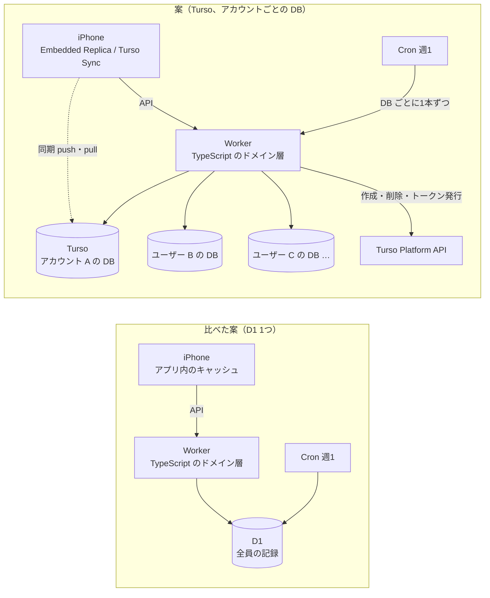
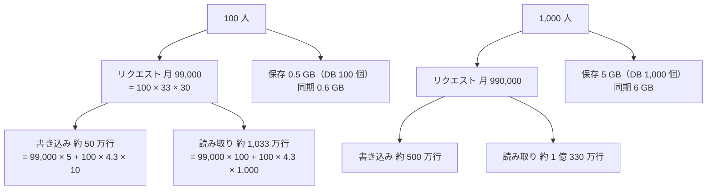
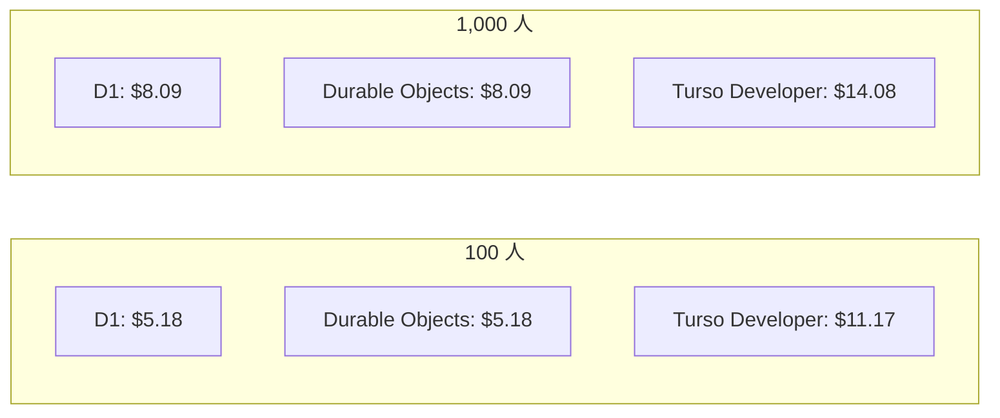
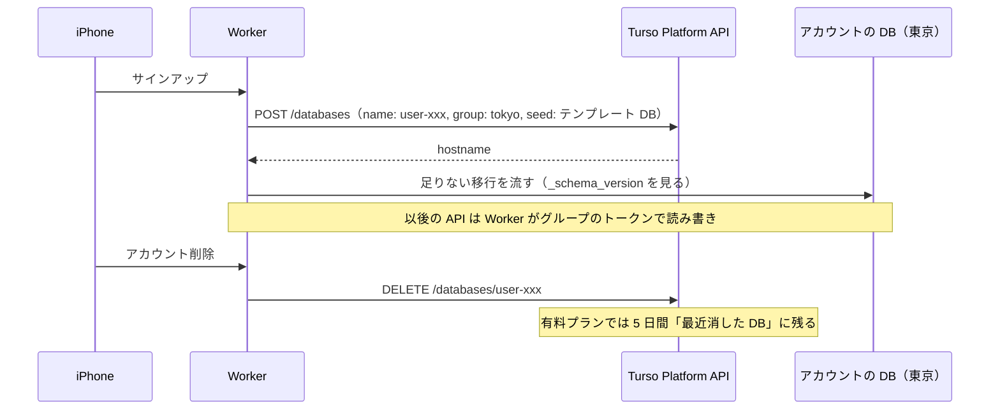
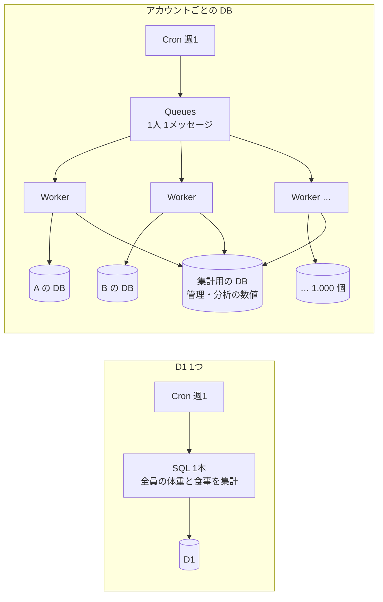
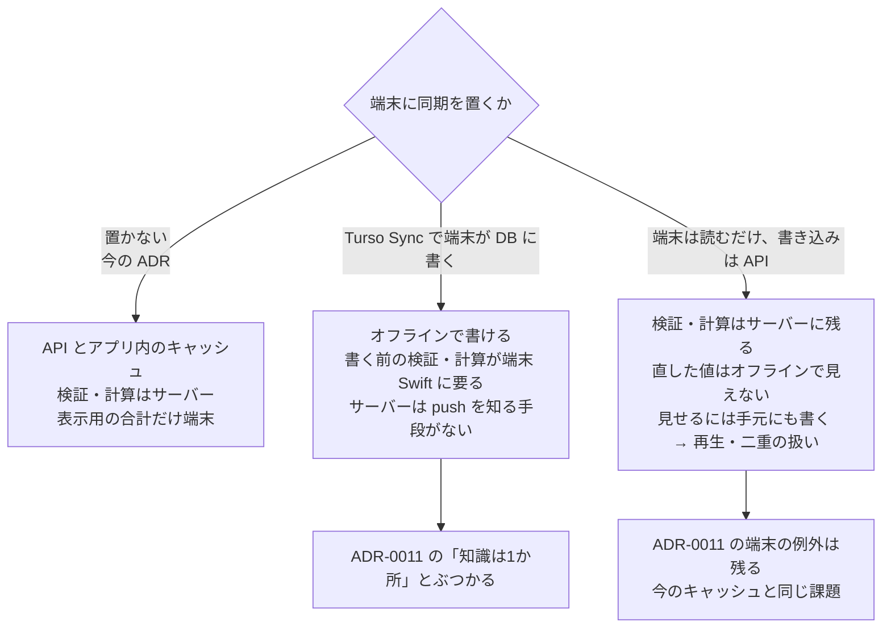
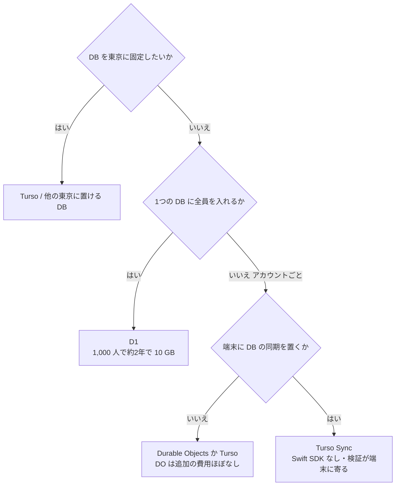

# Turso をアカウントごとの DB に使う案の調査（Turso Cloud・Turso Sync・D1 と Durable Objects との比較）

調査日: 2026-09-25
対象: サーバーの DB に Cloudflare D1 ではなく Turso を使い、(1) アカウントごとに DB を1つ持つ、(2) iPhone に Embedded Replicas か Turso Sync を置いてオフラインに備える、という案。前提は ADR-0001（設計思想の順位）、ADR-0008（記録の正本はサーバー、端末はキャッシュ）、ADR-0009（目標と目安の計算はサーバー）、`docs/research/server-platform.md`（実行基盤の比較と D1 の見積もり）。

> **確認の方法と限界**
> - Turso の文書は docs.turso.tech の各ページの `.md` と、全ページをまとめた `llms-full.txt` を取得して読んだ。料金は turso.tech/pricing の HTML を取得し、表と、ページに埋め込まれた構造化データ（JSON-LD の Offer と FAQ）を読んだ。turso.tech/blog の記事も一次情報（Turso 自身の発表）として使った。Cloudflare は developers.cloudflare.com の `index.md` を読んだ。本文で確かめた主張は「本文で確認」と書く。
> - GitHub の tursodatabase のリポジトリは、このセッションの GitHub API では読めなかった。代わりに `git clone` と `git ls-remote` でタグ・コミット日時・ファイルを直接読んだ。npm のパッケージの版は npm レジストリの JSON を読んだ。
> - 本文の記述から推し量ったもの、本文の数字から計算したものは「本文からの読み取り」と書き、何から読み取ったかを添える。
> - 本文や関連ページを探しても記述が無かったものは「本文を探したが記述なし」と書く。
> - **Turso のアカウントを持っていないので、Platform API は叩いていない。** 今使える場所の一覧（`GET /v1/locations` は認証が要る）、DB を作る速さ、API のレート制限、Workers から Turso までの実際の遅延は、**実測していない**。
> - **料金ページは既定で「年払い」の月額を表に出す**（Developer $4.99「Save $1/month」など）。月払いの額はページの構造化データ（Developer $5.99、Scaler $29、Pro $499）から読んだ。
> - **Turso の文書には古い記述が混ざっている。** Usage & Billing のページは今のプラン名ではなく「Starter and Scaler plans」と書き、JWKS のページは「Turso Beta の間は Clerk と Auth0 だけ」と書くが、2026-07 のブログは Clerk・Auth0・WorkOS を挙げる。食い違うところは両方を書いた。
> - 料金は**取得日（2026-09-25）時点**のもの。月額の見積もりは下に書いた仮定からの計算で、実測ではない。
> - 二次情報（比較ブログ、まとめ記事、Qiita・Zenn など）は使っていない。

## 結論の要約

- **Turso の今の製品は3つ。** Turso Cloud（マネージドのサービス）の上で、2つのエンジンから選ぶ。**libSQL**（SQLite のフォーク、本番で長く使われている）と、**Turso Database**（Rust で SQLite を書き直したもの。旧名 Limbo）。Turso Database は 0.7.2 で 1.0 前、Turso Cloud での提供は「early preview」（本文で確認）。**Multi-DB Schemas・ATTACH・Data Edge（エッジのレプリカ）は、新しいユーザーには使えない**（2025-01-21 に廃止を発表、本文で確認）。
- **料金**: Free $0（DB 100 個）、Developer 月 $5.99（年払いなら $4.99）、Scaler 月 $29、Pro 月 $499。**有料プランは DB の数が無制限**で、使っていない DB は保存量だけがかかる（本文で確認）。以前の「月に使った DB の数」での課金は、今の料金ページに無い（本文を探したが記述なし）。
- **月額の見積もり（LLM を除く、1年目の終わり、アカウントごとに DB 1つ）**: 100 人 / 1,000 人で、**Workers + Turso Developer + R2 は $11.17 / $14.08**。D1 の見積もり $5.18 / $8.09 より **月 $5.99 高い**（Developer の基本料の分）。使用量はどちらの人数でも Developer の枠に収まる。Developer の枠を超えるのは、保存 9 GB（1人 1年 5 MB で延べ 1,800 人年）と、書き込み月 2,500 万行（約 5,000 人）あたり（本文からの計算）。
- **東京に置ける。** Turso Cloud は AWS の上で動き、`aws-ap-northeast-1`（Tokyo）がある（本文で確認）。DB は「グループ」に属し、グループの主たる場所を作成時に決める。全員の DB を東京のグループ1つに入れられる（本文からの読み取り）。
- **アカウントごとの DB の運用**
  - サインアップ時の作成と、アカウント削除時の削除は、Platform API の1回の呼び出しでできる（本文で確認）。作成の速さと API のレート制限は、文書に記述が無い。
  - **スキーマの変更を全 DB に配る仕組みは、新しいユーザーには無い。** Multi-DB Schemas は廃止済みで、代わりの推奨手順も書かれていない。自分で全 DB に流すことになる（本文を探したが記述なし）。
  - **消した DB は、有料プランでは5日間復元できる状態で残る。** 組織の設定で復元を止めても、止まるのは復元の操作だけで、一覧には残る（本文で確認）。プライバシーポリシーに書く値は「削除後、最大5日」になる。D1 の 30 日より短い。
- **全ユーザーをまたぐ処理（週ごとの見直し、管理・分析）は、DB ごとに1本ずつ問い合わせることになる。** ATTACH は新規ユーザーには使えない（本文で確認）。Worker 1回の呼び出しは、サブリクエストが既定 10,000 回、ヘッダー待ちの同時接続は 6 本（本文で確認）。人数が増えたら Queues で1人ずつに分けて流す。
- **Workers からは `@tursodatabase/serverless`（Turso Database の DB 用、fetch だけ）か `@libsql/client/web`（libSQL の DB 用）を使う。** どちらも Cloudflare Workers で動くと文書にある（本文で確認）。版は `@tursodatabase/serverless` 1.4.0、`@libsql/client` 0.18.0。
- **DB ごとのトークンは作れる**: 1つの DB だけ、読み取りだけ、表と操作ごと、期限つき（本文で確認）。端末に渡す使い方も想定されている。ただし発行は Platform API を通すか、Clerk・Auth0（・WorkOS）の JWKS による。取り消しは「その DB のトークンをすべて無効にする」単位になる。
- **端末側**
  - Turso の同期の推奨は **Turso Sync**（手元で読み書きし、`push()`・`pull()` で同期。衝突は「最後に push したものが勝つ」）。
  - **公式の SDK は TypeScript・Python・Go・Rust と React Native だけで、Swift 版は無い**（本文で確認）。
  - Swift の公式 SDK は `libsql-swift` 0.3.2（2025-07-29 が最新のコミット）で、「technical preview」。できるのは Embedded Replicas だけで、**書き込みはサーバーの主 DB に直接送る**。電波が無いと書けない（本文で確認）。
- **「知識を1か所に」との関係**
  - Turso Sync で端末が DB に直接書く形では、書く前の検証と計算を端末（Swift）で持つことになる。push を受けてサーバーのコードを動かす仕組みの記述は無い。
  - 端末は読むだけにして、書き込みはサーバーの API に送る形にすると、端末で直した値はオフラインでは見えない（`libsql-swift` の Embedded Replicas と同じ）。
  - どちらを選んでも、ADR-0009 の「直した値はオフラインでもすぐ見えるように端末で合計する」という例外は、Turso を入れただけでは消えない（本文からの読み取り）。
  - Turso 自身も、「データの多くがサーバーで作られる」「端末に届く前にサーバー側で複雑な処理が要る」アプリは、普通の API とキャッシュのほうが単純だと書いている（本文で確認）。
- **D1 で同じことをするなら**
  - D1 は1アカウント 50,000 DB（申請で数百万）で、アカウントごとの DB を公式に想定している（本文で確認）。ただし Worker から DB を指すバインディングは設定で固定で、1スクリプトに約 5,000 個まで。実行時にバインディングを足す方法の記述は無い（本文を探したが記述なし）。REST API は主に管理用で、Cloudflare API 全体のレート制限（5 分に 1,200 回）がかかる（本文で確認）。
  - **アカウントごとの SQLite なら Durable Objects のほうが素直**（本文からの読み取り）。数は無制限、1つ 10 GB、PITR は 30 日、行の料金は D1 と同じ。場所はヒント（`apac`・`apac-ne`）で指定でき、保証はない。
- **D1 の 10 GB の上限は、1つの DB に全員を入れる形では効いてくる。** 1人 1年 5 MB なら延べ 2,000 人年で 10 GB になる。1,000 人なら約2年（本文からの計算）。
- **使えなくなる制約（ハードブロッカー）は無かった。** 大きな注意点は3つ。
  - Swift の同期 SDK が無い（または preview）
  - スキーマ変更を全 DB に配る仕組みが無い
  - 書き込みのたびに最大 50 ミリ秒の待ちが足される（Developer。本文で確認）

## 前提: 案の形

開発者の案を、ADR-0008 と ADR-0009 を前提にした D1 1つの案と並べる。

## 1. 今の Turso の製品と料金

### 製品

| 問い | 答え | 確かさ | 出典 |
|---|---|---|---|
| 製品の構成 | Turso Cloud は「Turso と libSQL の DB のための完全マネージドのプラットフォーム」。ほかに、端末やサーバーに埋め込む Turso Database と、AI エージェント向けの AgentFS がある | 本文で確認 | TU1、TU2 |
| libSQL | SQLite のフォーク。「production-ready」。Turso は「libSQL は出発点で、今の重点は Turso Database」と書き、新しいプロジェクトには Turso Database を、今すぐ実績のある基盤が要る重要な処理には libSQL を勧める | 本文で確認 | TU3 |
| Turso Database | SQLite を Rust で書き直したもの（旧名 Limbo、2025-01 に Turso に改名）。並行書き込み（MVCC）、CDC、ベクトル検索、同期を持つ。最新の安定版は v0.7.2（2026-07-30）、次は v0.8.0-pre.12（2026-09-22）。README は「本番で使われているが 1.0 には達していない」「一部の機能は experimental」「独立したバックアップを持つよう勧める」 | 本文で確認 | TU12、GH2 |
| Turso Cloud 上の Turso Database | 「Turso databases on Turso Cloud are in early preview」。`turso db create --tursodb` で作る。並行書き込みは 2026-08-03 に early preview になり、ダッシュボードで有効にする | 本文で確認 | TU2、TU39 |
| 廃止されたもの | 2025-01-21 の発表で、新しいユーザーには Edge Replicas（Data Edge）、Multi-DB Schemas、ATTACH を出さなくなった。すでに有料で使っているユーザーは使い続けられる。サーバーの新しい実装はクローズドソースで、libSQL と同じプロトコルを話す。Turso Cloud は AWS に一本化する | 本文で確認 | TU9、TU10、TU11、TU12 |
| Embedded Replicas | 「本番で完全にサポート」。ただし新しく同期が要るプロジェクトには Turso Sync を勧める | 本文で確認 | TU35 |
| 保存の仕組みと書き込みの待ち | AWS では、ディスクを持たず S3 Express One Zone と S3 に保存し、保存が済んでからコミットを返す。複数の DB のコミットをまとめて書くため、**コミットに最大の待ちが足される**: Free 100 ms、Developer 50 ms、Scaler 25 ms、Pro 以上 10 ms | 本文で確認 | TU6 |

### プランと上限

| プラン | 月額 | DB の数 | 保存 | 行の読み取り（月） | 行の書き込み（月） | 同期（月） | PITR | 消した DB の復元 |
|---|---|---|---|---|---|---|---|---|
| Free | $0 | 100 | 5 GB | 5 億 | 1,000 万 | 3 GB | 1 日 | なし |
| Developer | $5.99（年払い $4.99） | 無制限 | 9 GB、超過 $0.75/GB | 25 億、超過 $1/10 億 | 2,500 万、超過 $1/100 万 | 10 GB、超過 $0.35/GB | 10 日 | あり |
| Scaler | $29（年払い $24.92） | 無制限 | 24 GB、超過 $0.50/GB | 1,000 億、超過 $0.80/10 億 | 1 億、超過 $0.80/100 万 | 24 GB、超過 $0.25/GB | 30 日 | あり |
| Pro | $499（年払い $416.58） | 無制限 | 50 GB、超過 $0.45/GB | 2,500 億、超過 $0.75/10 億 | 2 億 5,000 万、超過 $0.75/100 万 | 100 GB、超過 $0.15/GB | 90 日 | あり |

出典は TU4（料金ページの表と構造化データ）と TU7（PITR の日数）。すべて本文で確認。

| 問い | 答え | 確かさ | 出典 |
|---|---|---|---|
| 超えたとき | Free と、超過を止めた有料プランは、どれか1つの指標を超えた時点で全 DB が `BLOCKED` になる。超過を有効にした有料プランは、超えた指標だけ月末に払う。月に1日だけ、その日の使用量を請求から外せる（Vegas Blackout） | 本文で確認 | TU4、TU5 |
| 使っていない DB | 「Idle databases cost only storage」 | 本文で確認 | TU4 |
| 月に使った DB の数での課金 | 今の料金ページと文書に、その指標は無い | 本文を探したが記述なし | TU4、TU5 |
| 行の数え方 | 返した行ではなく「触った行」を数える。索引の無い検索は表の全行、索引のある表への1回の書き込みは索引の数だけ多く数える。`select 1` のような行を触らない文も1行と数える。`ALTER TABLE` は全行の読み書きになりうる | 本文で確認 | TU4、TU5 |
| 保存の数え方 | `dbstat` のページ（4 KB）単位。`VACUUM` は今は使えない | 本文で確認 | TU5 |
| 同期の数え方 | 「Embedded Syncs」は、同期で Turso Cloud と手元の DB の間を流れたページの量 | 本文で確認 | TU4 |
| 1つの DB の大きさの上限 | 作成時に `--size-limit` で自分で上限を決められる。プラットフォームが決める1つの DB の上限は見つからなかった（D1 は 10 GB で固定） | 前半は本文で確認、後半は本文を探したが記述なし | TU14 |
| グループの数 | 2つ以上のグループを作れるのは Scaler・Pro・Enterprise | 本文で確認 | TU19 |
| Free の制約 | 10 日使われないと DB がアーカイブされる。消した DB の復元は保証されない | 本文で確認 | TU20、TU4 |

### 月額の見積もり（アカウントごとに DB 1つ）

仮定は `docs/research/server-platform.md` と同じにした。

- 1人 1日: 写真の推定 3 回とほかの API 30 回、1か月 30 日
- 1回のリクエストで書き込み 5 行・読み取り 100 行（置き値）
- DB は 1人 1年 5 MB、1年目の終わりで計算

Turso に特有のものとして、次の置き値を足した。

- 週ごとの見直しで1人あたり、読み取り 1,000 行・書き込み 10 行（1か月 4.3 回）
- 端末で同期を使う場合は、1人 月 6 MB

**Cloudflare Workers Paid + Turso Developer + R2（100 人 / 1,000 人）**
- Workers 基本料 $5.00 / $5.00（リクエストと CPU は含まれる枠の中。`server-platform.md` の計算のとおり）
- Turso Developer $5.99 / $5.99
  - 保存 0.5 / 5 GB ≤ 9 GB
  - 読み取り 1,033 万 / 1 億 330 万行 ≤ 25 億
  - 書き込み 約 50 万 / 約 500 万行 ≤ 2,500 万
  - 同期 0.6 / 6 GB ≤ 10 GB
  - DB 100 / 1,000 個 ≤ 無制限
  - → 超過は $0
- R2 $0.18 / $3.09（`server-platform.md` の計算のとおり）
- **合計 $11.17 / $14.08**（年払いなら $10.17 / $13.08）

**比べる: Workers Paid + D1（DB 1つ）+ R2**（`server-platform.md` の見積もり）
- **合計 $5.18 / $8.09**。D1 の使用量はどちらも含まれる枠に収まる

**比べる: Workers Paid + Durable Objects（アカウントごとの SQLite）+ R2**（本文からの計算）
- リクエスト 99,000 / 990,000 回 ≤ 含まれる 100 万 → $0
- 実行時間（1回 50 ミリ秒の置き値 × 128 MB）: 99,000 × 0.05 × 0.125 = 619 GB-秒 / 6,188 GB-秒 ≤ 含まれる 40 万 → $0
- 行と保存は D1 と同じ単価と枠で、保存 0.5 / 5 GB ≤ 5 GB → $0
- **合計 $5.18 / $8.09**（D1 と同じ）

どこで Developer の枠を超えるか（本文からの計算）:
- 保存 9 GB: 1人 1年 5 MB で延べ 1,800 人年。1,000 人なら約 1.8 年目。超えた分は $0.75/GB（D1 と同じ単価）
- 書き込み月 2,500 万行: 1人 月 約 4,993 行なので約 5,000 人
- 同期 10 GB: 1人 月 6 MB の置き値なら約 1,660 人
- 書き込みは索引の数だけ多く数えるので、5 行の置き値は実際の表と索引で変わる（TU4）

## 2. 場所（東京に置けるか）

| 問い | 答え | 確かさ | 出典 |
|---|---|---|---|
| 東京はあるか | ある。場所の一覧 API の例に `aws-ap-northeast-1: AWS AP NorthEast (Tokyo)`、Private Endpoints の手順に `ap-northeast-1` のタブと `<db>-<org>.aws-ap-northeast-1.turso.io` のホスト名がある | 本文で確認 | TU17、TU18 |
| 今の一覧 | 一覧は `GET /v1/locations` で取れるが認証が要り、取得できていない。上の例は、文書に書かれた例 | 本文で確認（一覧そのものは未確認） | TU17 |
| DB はどこに置かれるか | すべての DB はグループに属し、グループは主たる場所を1つ持つ。グループは作るときに最寄りの場所を自動で選ぶか、`--location` で指定する | 本文で確認 | TU19、TU13 |
| アカウントごとの DB を東京に置けるか | 東京のグループを1つ作り、全員の DB をそこに作れば、全員が東京になる。Developer はグループが1つだが、1つで足りる | 本文からの読み取り（TU19 のグループの制限と TU14 の作成 API から） | TU14、TU19 |
| プランで場所が制限されるか | プランの枠に `locations`（場所の数）という項目はあるが、Developer で東京を選べないという記述は無い | 本文を探したが記述なし | TU40 |
| エッジのレプリカ | 新しいユーザーには無い（Data Edge は廃止）。DB は主たる場所の1か所だけ | 本文で確認 | TU11、TU12 |

## 3. アカウントごとの DB の運用

| 問い | 答え | 確かさ | 出典 |
|---|---|---|---|
| サインアップ時に作れるか | `POST /v1/organizations/{org}/databases`（名前は小文字・数字・ダッシュで 64 文字まで、グループは作成済みのもの）。公式の TypeScript クライアント `@tursodatabase/api`（2.0.5）で `databases.create()`。文書は「サインアップのときに DB を作り、そのトークンを発行する」使い方を例に挙げている | 本文で確認 | TU13、TU14、NPM4 |
| テンプレートから作れるか | `seed: { type: "database", name: "<元の DB>" }` で既存の DB を写して作れる。時点を指定すれば PITR にもなる | 本文で確認 | TU14、TU7 |
| 作る速さ | 数値の記述は無い。CLI に「DB が要求を受けられるまで待つ」`--wait` がある | 前半は本文を探したが記述なし、後半は本文で確認 | TU14 |
| API のレート制限 | 記述が無い | 本文を探したが記述なし | TU13 |
| サーバーの Platform API の資格情報 | 組織の単位か、1つのグループに固定したトークン（`db:create`・`db:delete`・`db:mint-token` などを選べる）。組織をまたぐトークンは廃止予定。グループを作る・消す操作は、グループのトークンからはできない | 本文で確認 | TU21 |
| スキーマの変更を全 DB に配る | Multi-DB Schemas（親の DB のスキーマを子に自動で配る）は**新しいユーザーには廃止**。移行の状況を見る `/v1/jobs` も「AWS の Free・Developer・Scaler では使えない」 | 本文で確認 | TU9、TU41 |
| 今の推奨手順 | 全 DB に移行を配る公式の手順・道具の記述は無い。Turso Cloud では `PRAGMA user_version` が読み取り専用なので、移行の版は `_schema_version` 表で持つよう書かれている | 前半は本文を探したが記述なし、後半は本文で確認 | TU40 |
| 移行の費用 | `ALTER TABLE` や索引の追加は、既存の全行の読み取り（と書き込み）に数える | 本文で確認 | TU5 |
| DB を消す | `DELETE /v1/organizations/{org}/databases/{name}` の1回 | 本文で確認 | TU15 |
| 消した DB が残る期間 | 有料プランでは、消した DB を**5日間**そのまま復元できる。5日を過ぎると「gone for good」。組織の「Allow restore」を切っても、消した DB は一覧に残り、復元の操作だけが失敗する。Free で消した DB は復元を保証しない | 本文で確認 | TU8、TU4 |
| 消した DB の PITR | PITR は「今ある DB」を過去の時点に戻すもので、消した DB は戻せない | 本文で確認 | TU7、TU8 |
| PITR の保持 | コミットのたびに自動で取る。Free 1 日、Developer 10 日、Scaler 30 日、Pro 90 日。短くする設定の記述は無い | 前半は本文で確認、後半は本文を探したが記述なし | TU7 |
| プライバシーポリシーに書く値 | アカウント削除で DB ごと消すなら、復元できるのは削除後5日まで（そのあと PITR の履歴が残るかは「確かめられなかったこと」）。DB を残して記録（行）だけ消すなら、PITR の保持期間（Developer 10 日）のあいだ過去の時点に残る | 本文からの読み取り（TU7、TU8 から） | TU7、TU8 |

D1（1つの DB に全員）と比べると、Time Travel は 30 日で縮められないため、行を消しても 30 日は残る（`server-platform.md`）。アカウントごとの DB を丸ごと消せる形は、「即時削除」と「残る期間の短さ」で有利（本文からの読み取り）。

## 4. 全ユーザーをまたぐ処理

| 問い | 答え | 確かさ | 出典 |
|---|---|---|---|
| DB をまたぐ SQL | ATTACH（複数の DB を1つの接続で読む）は新しいユーザーには廃止 | 本文で確認 | TU10、TU12 |
| 週ごとの見直しのやり方 | DB ごとに1本ずつ問い合わせる。管理・分析は、各アカウントの DB から集計用の DB に書き出すなど、自分で集める | 本文からの読み取り（ATTACH の廃止から） | TU10 |
| Worker 1回の呼び出しの制限 | サブリクエストは有料で既定 10,000 回（設定で最大 1,000 万）。レスポンスヘッダーを待つ同時接続は 6 本までで、7本目は待たされる。Cron の実時間は 15 分 | 本文で確認 | CF3 |
| 1,000 人を1回で回せるか | 1人 2〜3 回の問い合わせなら 2,000〜3,000 回で 10,000 回に収まる。ただし同時 6 本で 1 回 50〜100 ミリ秒と置けば、3,000 回 ÷ 6 × 0.1 秒 ≈ 50 秒。人数が増えたら Queues で1人ずつに分ける | 本文からの計算（遅延は置き値） | CF3 |
| Turso 側の費用 | 問い合わせ1回につき最低 1 行の読み取り。DB ごとの接続の費用という項目は無い | 本文で確認 | TU5、TU4 |
| 接続の方式 | `@tursodatabase/serverless` は fetch（HTTP）だけを使い、持続する接続を持たない。DB ごとにホスト名が違う | 本文で確認 | TU27、TU29 |

## 5. Cloudflare Workers からの接続

| 問い | 答え | 確かさ | 出典 |
|---|---|---|---|
| どのパッケージか | DB のエンジンで決める。**Turso Database の DB は `@tursodatabase/serverless`**、**libSQL の DB は `@libsql/client`**（Workers では `/web` サブパス）。ORM（Drizzle・Prisma）を使うなら `@libsql/client` | 本文で確認 | TU26、TU27、TU30 |
| Workers で動くか | TypeScript の文書は「Cloudflare Workers」を動く環境に挙げる。`@tursodatabase/serverless` の README も「Cloudflare Workers and Vercel」と書く | 本文で確認 | TU27、NPM2 |
| 今の版 | `@tursodatabase/serverless` 1.4.0（2026-07-27）、`@libsql/client` 0.18.0（2026-09-02、`./web`・`./http`・`./ws` を出す）、`@tursodatabase/api` 2.0.5 | 本文で確認 | NPM1、NPM2、NPM4 |
| HTTP か WebSocket か | `@tursodatabase/serverless` は HTTP だけ。libSQL は両方あり、「WebSocket は1つの接続で多くの問い合わせをするとき、HTTP は1回の問い合わせで有利。両方を測って決める」 | 本文で確認 | TU27、TU29 |
| 遅延 | Worker（日本のユーザーなら日本の近く）から AWS 東京までの遅延の数値は無い。書き込みはコミットのたびに最大 50 ms（Developer）足される | 前半は本文を探したが記述なし、後半は本文で確認 | TU6 |
| libSQL と Turso Database のどちらか | libSQL は本番の実績がある。Turso Database は Cloud では early preview だが、Turso Sync や並行書き込みはこちらにある | 本文で確認 | TU2、TU3、TU26 |

## 6. トークン

| 問い | 答え | 確かさ | 出典 |
|---|---|---|---|
| DB ごとのトークン | 作れる。範囲はグループ全体か1つの DB。読み取りだけ（`--read-only`）、表と操作ごと（`data_read`・`data_add`・`data_update`・`data_delete`・`schema_*`）、期限（`--expiration 7d` など）を組み合わせられる | 本文で確認 | TU22、TU23、TU25 |
| サーバーから発行できるか | `POST /v1/organizations/{org}/databases/{db}/auth/tokens?expiration=…&authorization=full-access\|read-only`。細かい権限は本文で渡す | 本文で確認 | TU16 |
| サーバーが自分で署名できるか | 署名の鍵は Turso が持ち、自前で JWT を作る方法の記述は無い。外の認証基盤に任せるなら JWKS で、対応は Clerk と Auth0（JWKS のページ。「Turso Beta の間は」）。2026-07 のブログは Clerk・Auth0・WorkOS と書く。Sign in with Apple は挙がっていない | 前半は本文を探したが記述なし、後半は本文で確認 | TU24、TU38 |
| 取り消し | 1つのトークンだけを取り消す方法は無く、その DB（かグループ）の署名の鍵を回して、全トークンを無効にする | 本文で確認 | TU23、TU21 |
| 端末に渡してよいか | 端末に渡す使い方を想定している。JWKS と表ごとの権限の仕組みがあり、Swift のクイックスタートは「トークンを安全に扱う」よう注意を書く。同期のブログは、同期するクライアントに範囲を絞ったトークンを渡す例を出している | 本文で確認 | TU24、TU25、TU36、TU38 |
| nu-tori で渡すなら | 端末に渡すトークンは、アカウントの DB だけ・読み取りだけ・期限つきにし、サーバーがサインインのあとに発行する。リポジトリとアプリには何も埋め込まない（ADR-0010 と両立）。アカウントごとの DB なら、鍵を回して全トークンを無効にしても、影響はそのアカウントだけ | 本文からの読み取り | TU16、TU23 |
| 分離がどこまで効くか | サーバーは全 DB に届くグループのトークンか、DB ごとに発行したトークンを持つ。WHERE の書き忘れで他人の行を読む誤りは防げるが、サーバーの資格情報が漏れたときの被害は1つの DB と変わらない | 本文からの読み取り | TU22 |

## 7. 端末での同期

### 今ある同期の仕組み

| 問い | 答え | 確かさ | 出典 |
|---|---|---|---|
| Embedded Replicas（libSQL） | 読み取りは手元のファイル。**書き込みは既定でサーバーの主 DB に送り、手元には先に書かない**。成功すると手元に反映する（read-your-writes）。TypeScript では `offline: true` で手元に書ける。「本番で完全にサポート」。同期はページ（4 KB）単位 | 本文で確認 | TU35 |
| Turso Sync（Turso Database） | 読み書きとも手元の DB に対して行い、`push()` で送り、`pull()` で受ける。オフラインで書いて、あとで push できる。最初の接続でサーバーから取り込む（`bootstrapIfEmpty: false` なら空で始める）。手元の WAL は自動で縮めないので `checkpoint()` を呼ぶ。部分同期は experimental | 本文で確認 | TU31、TU33、TU34、TU38 |
| 推奨はどちらか | 新しく同期が要るなら Turso Sync（帯域と遅延が小さい）。Embedded Replicas も使える | 本文で確認 | TU26、TU35 |
| 相手の DB | 手元の DB が絡むなら Turso のパッケージを使う。「相手が libSQL の DB でも」 | 本文で確認 | TU26 |
| 成熟度 | Turso Sync のパッケージは 0.7.2（`@tursodatabase/sync`、2026-07-30）。GA・beta の表示は無い。エンジンは 1.0 前 | 前半は本文で確認、GA かどうかは本文を探したが記述なし | NPM3、GH2 |
| 衝突 | 「最後に push したものが勝つ」（行の単位）。pull のとき、未送信の手元の変更があれば、手元を最後に同期した状態に戻し、サーバーの変更を当て、手元の変更をその上に再生する（まとめて1つの操作）。独自のマージは変換のフックで書く。CRDT は無い。端末どうしの直接の同期は無く、サーバーの DB が常に正本 | 本文で確認 | TU32、TU38 |

### 端末を「読むだけ」にできるか

| 問い | 答え | 確かさ | 出典 |
|---|---|---|---|
| 読み取りだけのトークンで同期（pull）できるか | 記述が無い | 本文を探したが記述なし | TU31、TU35 |
| 書き込みはサーバーの API、読み取りは同期、という形 | 仕組みの上では組める。ただし端末で直した値は、API が成功して pull するまで手元に見えない。電波の無いときに直した値を見せるには、手元の DB に書く必要がある。Turso Sync で手元に書いて push しないと、pull のたびにその変更が再生され続ける。サーバーが API で同じ変更を書いた場合は、ID で上書きする形にしないと二重になる | 本文からの読み取り（TU32 の再生の説明から） | TU32 |
| push を受けてサーバーのコードを動かせるか | 端末の push を受けて、サーバー側の検証や計算を動かす仕組みの記述は無い | 本文を探したが記述なし | TU31、TU38 |
| Turso 自身の向き不向きの説明 | 向く: オフラインで動く必要がある、1人か少人数の個人データ。別の仕組みが要る: 「データの多くがサーバーで作られ、利用者は読むだけ」（普通の API とキャッシュのほうが単純）、「端末に届く前にサーバーで複雑な処理が要る」 | 本文で確認 | TU38 |

### Swift・iOS の SDK

| 問い | 答え | 確かさ | 出典 |
|---|---|---|---|
| Turso Sync の Swift SDK | 無い。公式の SDK の表は TypeScript・Python・Go・Rust。モバイルは React Native（`@tursodatabase/sync-react-native` 0.7.2、iOS と Android） | 本文で確認 | TU26、TU38、NPM5、GH3 |
| Swift の公式 SDK | `tursodatabase/libsql-swift`。SwiftPM で入る。`platforms: [.iOS(.v12), .macOS(.v10_13)]`。中身は libSQL の C ライブラリを XCFramework にしたもの。README と文書は「technical preview」。できるのは手元だけ、リモートだけ、Embedded Replicas（`sync()`、`syncInterval`、`readYourWrites`）。Swift の文書に `offline`（手元に書く）の設定は無い | 本文で確認 | GH1、TU36、TU37 |
| Swift の SDK の新しさ | タグは 0.1.0-alpha（2024-08）から 0.3.2（2025-07-29）まで。最新のコミットは 2025-07-29「chore: update deps」で、それから約 14 か月、更新が無い | 本文で確認 | GH1 |
| 自分でつなぐなら | Turso の同期のエンジンは C の ABI（`sync/sdk-kit/turso_sync.h`）を持つ。HTTP やファイルの入出力を呼ぶ側が行う設計。React Native 版はこれを `aarch64-apple-ios` と `aarch64-apple-ios-sim` 向けにビルドして使っている。Swift から同じ ABI を呼ぶ層を自前で書けば使える見込みがあるが、公式の支援は無い | 前半は本文で確認、最後は本文からの読み取り | GH3、GH4 |

## 8. D1 と Durable Objects で「アカウントごとの DB」をするなら

| 問い | 答え | 確かさ | 出典 |
|---|---|---|---|
| D1 の DB の数 | 1アカウント 50,000 個（Workers Paid）。申請で「数百万〜数千万」に増やせる。D1 は「アカウントごと・テナントごとの小さな DB を横に並べる」ことを想定し、DB の数には費用がかからない | 本文で確認 | CF1 |
| D1 の1つの DB の上限 | 10 GB で、増やせない。1つの DB は問い合わせを1本ずつ処理する | 本文で確認 | CF1 |
| Worker から実行時に D1 を選べるか | バインディングは設定で決め、1スクリプトに約 5,000 個まで。実行時にバインディングを足す仕組みの記述は無い。REST API は「主に管理用」で、Cloudflare API 全体に 5 分 1,200 回のレート制限がかかる | 前半と後半は本文で確認、実行時のバインディングは本文を探したが記述なし | CF1、CF4、CF5、CF12 |
| D1 で組むなら | アカウントごとではなく、決まった数の DB に分ける（バインディングを固定で N 個持ち、アカウント ID で振り分ける）形になる | 本文からの読み取り | CF1 |
| 1つの D1 に全員を入れたときの上限 | 1人 1年 5 MB で 10 GB は延べ 2,000 人年。100 人なら 20 年、1,000 人なら約 2 年 | 本文からの計算 | CF1 |
| Durable Objects（SQLite） | 数は無制限、1つ 10 GB、アカウント全体の保存は無制限。ID を名前から作る（`idFromName(userId)`）ので、アカウントごとに実行時に選べる。行の料金は D1 と同じ（読み取り月 250 億、書き込み月 5,000 万を含む）。保存は 5 GB を含み、超過は $0.20/GB-月。リクエストは月 100 万回を含み、超過は $0.15/100 万。実行時間は月 40 万 GB-秒を含み、超過は $12.50/100 万 GB-秒 | 本文で確認 | CF7、CF8 |
| Durable Objects のバックアップ | PITR が 30 日（ブックマークで戻す）。短くする設定の記述は無い | 前半は本文で確認、後半は本文を探したが記述なし | CF9 |
| Durable Objects の削除 | `deleteAll()` で SQL とキーと値をまとめて消す（SQLite は全部か無しかの原子的な操作）。消したあと PITR の履歴がどれだけ残るかの記述は無い | 前半は本文で確認、後半は本文を探したが記述なし | CF9、CF11 |
| Durable Objects の場所 | ヒントに `apac`（アジア太平洋）と `apac-ne`（北東アジア太平洋）があるが、保証ではない。最初の `get()` だけが従う。管轄の指定は `eu`・`fedramp` などで、日本は無い | 本文で確認 | CF10 |
| 全員をまたぐ処理 | Durable Objects も1つずつ呼ぶことになる（Turso と同じ形） | 本文からの読み取り | CF7 |
| 端末との同期 | Durable Objects の SQLite を端末に同期する Cloudflare の SDK の記述は無い | 本文を探したが記述なし | CF9 |

## 9. 使えなくなる制約と、強く向く点

使えなくなる制約（ハードブロッカー）は見つからなかった。判断に効く点は次のとおり。

**Turso-per-user が向く点**
- アカウント削除が DB を消す1回の呼び出しで済み、復元できるのは5日まで（D1 の Time Travel 30 日より短い。そのあと履歴が残るかは未確認）（TU8）
- 有料プランは DB の数が無制限で、使っていない DB は保存量だけ（TU4）
- 東京（AWS ap-northeast-1）を選べる（TU17、TU18）。D1 と Durable Objects はヒントだけ
- 1つの DB の 10 GB の上限を気にしなくてよい（D1 は1つにまとめると 1,000 人で約2年）
- DB ごと・読み取りだけ・期限つきのトークンがあり、将来、端末に同期を置く余地を残せる

**Turso-per-user の弱い点**
- Swift の同期 SDK が無い。`libsql-swift` は preview で約 14 か月更新が無く、Embedded Replicas は書き込みがサーバー直行なので、オフラインで直した値を見せる課題は解けない（GH1、TU35）
- 端末が DB に直接書く Turso Sync の形は、検証と計算を端末に持たせることになり、ADR-0011 とぶつかる（TU38）
- スキーマの変更を全 DB に配る仕組みを自前で作ることになる（Multi-DB Schemas は廃止）（TU9）
- 全員をまたぐ集計が SQL 1本で書けず、DB ごとに回す（TU10）
- 書き込みのたびに最大 50 ms（Developer）の待ちが足される（TU6）
- 月の費用が D1 より約 $6 高い（1,000 人まで）
- Turso Cloud 上の Turso Database は early preview、Turso Database 自体も 1.0 前。本番の実績を取るなら libSQL の DB で、その場合 Turso Sync ではなく Embedded Replicas の世界になる（TU2、TU3、GH2）
- Turso は 2025 年に機能の廃止と方針の転換をしている（TU12）。長く使う前提の選定では、この変わりやすさも材料になる（本文からの読み取り）

## 確かめられなかったこと

- Turso の今の場所の一覧（`/v1/locations` は認証が要る）と、Developer で東京のグループを作れるか
- Platform API で DB を作る速さとレート制限（文書に記述なし、実測していない）
- Cloudflare Workers から Turso（AWS 東京）までの実際の遅延
- 読み取りだけのトークンで Turso Sync の pull ができるか
- Turso Sync を GA と見なしてよいか（GA・beta の表示が無い）
- Turso で消した DB の PITR の履歴が、5日の復元期間のあとも S3 に残るか
- Durable Objects の `deleteAll()` のあと、PITR の履歴がどれだけ残るか
- D1 のバインディングを実行時に足す新しい仕組みがあるか（見つけた範囲では無い）
- 空の DB 1つあたりの保存量（スキーマと索引のページ）。1,000 個なら数十 MB の見込みで、見積もりには入れていない

## 出典一覧

取得日はすべて 2026-09-25。

### Turso（docs.turso.tech、turso.tech）
- TU1: Welcome to Turso — https://docs.turso.tech/introduction
- TU2: Turso Cloud Documentation — https://docs.turso.tech/turso-cloud
- TU3: libSQL — https://docs.turso.tech/libsql
- TU4: Pricing（表、構造化データ、FAQ） — https://turso.tech/pricing
- TU5: Usage & Billing — https://docs.turso.tech/help/usage-and-billing
- TU6: Durability Guarantees — https://docs.turso.tech/cloud/durability
- TU7: Point-in-Time Recovery — https://docs.turso.tech/features/point-in-time-recovery
- TU8: Recover Deleted Databases — https://docs.turso.tech/features/recover-deleted-databases
- TU9: Multi-DB Schemas (Deprecated) — https://docs.turso.tech/features/multi-db-schemas
- TU10: Attach Database (Deprecated) — https://docs.turso.tech/features/attach-database
- TU11: Data Edge (Deprecated) — https://docs.turso.tech/features/data-edge
- TU12: Upcoming changes to the Turso Platform and Roadmap（2025-01-21） — https://turso.tech/blog/upcoming-changes-to-the-turso-platform-and-roadmap
- TU13: Turso Platform API（Database per user の例） — https://docs.turso.tech/api-reference/introduction
- TU14: Create Database（と CLI の db create） — https://docs.turso.tech/api-reference/databases/create 、 https://docs.turso.tech/cli/db/create
- TU15: Delete Database — https://docs.turso.tech/api-reference/databases/delete
- TU16: Generate Database Auth Token — https://docs.turso.tech/api-reference/databases/create-token
- TU17: List Locations — https://docs.turso.tech/api-reference/locations/list
- TU18: Private Endpoints — https://docs.turso.tech/cloud/private-endpoints
- TU19: group create（CLI） — https://docs.turso.tech/cli/group/create
- TU20: Unarchive Group — https://docs.turso.tech/api-reference/groups/unarchive
- TU21: Platform API Authentication（グループに固定したトークン） — https://docs.turso.tech/api-reference/authentication
- TU22: Authorization — https://docs.turso.tech/sdk/authorization
- TU23: Platform Tokens — https://docs.turso.tech/sdk/authorization/tokens
- TU24: External Auth Providers（JWKS） — https://docs.turso.tech/sdk/authorization/jwks
- TU25: Fine-Grained Permissions — https://docs.turso.tech/sdk/authorization/fine-grained-permissions
- TU26: Turso SDKs — https://docs.turso.tech/sdk/introduction
- TU27: TypeScript Reference — https://docs.turso.tech/sdk/ts/reference
- TU28: Turso Quickstart (TypeScript) — https://docs.turso.tech/sdk/ts/quickstart
- TU29: SDK Authentication（HTTP と WebSocket） — https://docs.turso.tech/sdk/authentication
- TU30: Vercel（SQL over HTTP の2つのパッケージの比較） — https://docs.turso.tech/integrations/vercel
- TU31: Sync Usage — https://docs.turso.tech/sync/usage
- TU32: Conflict Resolution — https://docs.turso.tech/sync/conflict-resolution
- TU33: Checkpoint — https://docs.turso.tech/sync/checkpoint
- TU34: Partial sync — https://docs.turso.tech/sync/partial
- TU35: Embedded Replicas — https://docs.turso.tech/features/embedded-replicas/introduction
- TU36: Turso Quickstart (Swift) — https://docs.turso.tech/sdk/swift/quickstart
- TU37: Swift Reference — https://docs.turso.tech/sdk/swift/reference
- TU38: Building Local-First Apps（2026-07-27） — https://turso.tech/blog/building-local-first-apps-the-complete-guide-to-offline-first-database-sync
- TU39: SQLite Concurrent Writes Are Here: Early Preview on Turso Cloud（2026-08-03） — https://turso.tech/blog/concurrent-writes-on-turso-cloud
- TU40: Limitations（と List Plans の枠の項目） — https://docs.turso.tech/cloud/limitations 、 https://docs.turso.tech/api-reference/organizations/plans
- TU41: SQL over HTTP Reference（Schema Migration Status） — https://docs.turso.tech/sdk/http/reference

### GitHub（git で直接取得）
- GH1: tursodatabase/libsql-swift（README、Package.swift、タグ、コミット履歴） — https://github.com/tursodatabase/libsql-swift
- GH2: tursodatabase/turso（README の FAQ、タグ v0.7.2・v0.8.0-pre.12） — https://github.com/tursodatabase/turso
- GH3: tursodatabase/turso の bindings/react-native（README、package.json、Makefile） — https://github.com/tursodatabase/turso/tree/main/bindings/react-native
- GH4: tursodatabase/turso の sync/sdk-kit/turso_sync.h — https://github.com/tursodatabase/turso/blob/main/sync/sdk-kit/turso_sync.h

### npm レジストリ
- NPM1: @libsql/client — https://registry.npmjs.org/@libsql/client
- NPM2: @tursodatabase/serverless — https://registry.npmjs.org/@tursodatabase/serverless
- NPM3: @tursodatabase/sync、@tursodatabase/database — https://registry.npmjs.org/@tursodatabase/sync 、 https://registry.npmjs.org/@tursodatabase/database
- NPM4: @tursodatabase/api — https://registry.npmjs.org/@tursodatabase/api
- NPM5: @tursodatabase/sync-react-native — https://registry.npmjs.org/@tursodatabase/sync-react-native

### Cloudflare
- CF1: D1 Limits — https://developers.cloudflare.com/d1/platform/limits/
- CF2: Workers Pricing（D1） — https://developers.cloudflare.com/workers/platform/pricing/
- CF3: Workers Limits（サブリクエスト、同時接続、Cron の実時間） — https://developers.cloudflare.com/workers/platform/limits/
- CF4: D1 Query a database（REST API） — https://developers.cloudflare.com/d1/best-practices/query-d1/
- CF5: Cloudflare API Rate limits — https://developers.cloudflare.com/fundamentals/api/reference/limits/
- CF6: D1 Data location — https://developers.cloudflare.com/d1/configuration/data-location/
- CF7: Durable Objects Limits — https://developers.cloudflare.com/durable-objects/platform/limits/
- CF8: Durable Objects Pricing — https://developers.cloudflare.com/durable-objects/platform/pricing/
- CF9: Durable Objects SQLite-backed Storage API（PITR、deleteAll） — https://developers.cloudflare.com/durable-objects/api/sqlite-storage-api/
- CF10: Durable Objects Data location — https://developers.cloudflare.com/durable-objects/reference/data-location/
- CF11: Access Durable Objects Storage（ストレージの削除） — https://developers.cloudflare.com/durable-objects/best-practices/access-durable-objects-storage/
- CF12: Workers Bindings — https://developers.cloudflare.com/workers/runtime-apis/bindings/

### リポジトリの中の文書
- `docs/research/server-platform.md`（D1・R2・Workers の見積もりと仮定）
- `docs/adr/0001-design-principles-order.md`、`docs/adr/0008-server-owns-records-device-owns-photos.md`、`docs/adr/0009-calculations-on-server.md`
