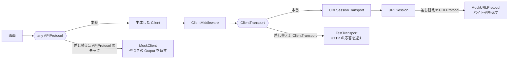
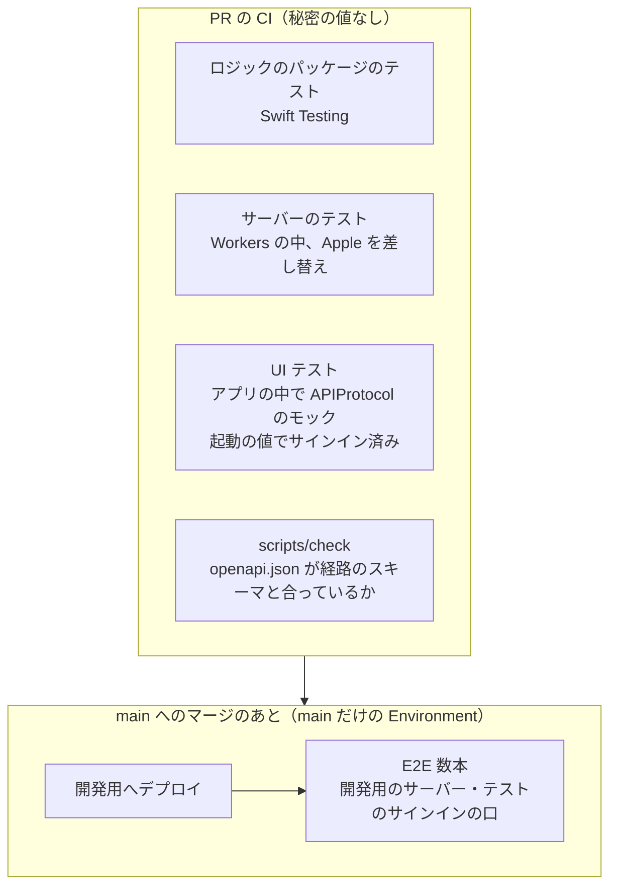

# UI テストでアプリが呼ぶ API をどうするか（差し替え・Sign in with Apple・E2E・秘密の値）

調査日: 2026-09-28（出典の取得日もすべて 2026-09-28）
対象: iPhone アプリ（SwiftUI、iOS 26 以上、XCUITest）の UI テストを GitHub Actions の macOS ランナーで回すとき、アプリが呼ぶ API（REST＋OpenAPI、swift-openapi-generator で生成したクライアントを `URLSessionTransport` で呼ぶ。サーバーは Cloudflare Workers）をどうするか。PR の CI からは秘密の値を読めない（秘密の値は main からだけ使える Environment にある、ADR-0010）

> **確認の方法と限界**
> - Apple の開発者向けドキュメントは、同じ内容の JSON（`https://developer.apple.com/tutorials/data/documentation/<パス>.json`）で本文を読んだ。出典にはふつうの URL を書く。WWDC のセッションは developer.apple.com/videos のページの書き起こしを読んだ。開発者フォーラムは人の確認の画面が出て直接は取れず、WebFetch（取得して要約する道具）で投稿を引用させて読んだ。
> - swift-openapi-generator（main の b6e88ed、2026-09-25）、swift-openapi-runtime（main の ecd92f8、2026-09-25）、swift-openapi-urlsession（main の 77effea、2026-09-28）は clone してソースと文書と Examples を読んだ。
> - GitHub の文書は docs.github.com の本文 API（`/api/article/body?pathname=...`）で読んだ。Cloudflare の文書は Markdown 版（`index.md`）を読んだ。Martin Fowler のサイトと Google Testing Blog は HTML を取得して本文を読んだ。Better Auth の文書は WebFetch で読んだ。
> - 本文で確かめた主張は「本文で確認」と書き、短い英語の原文を添える。本文の記述から推し量ったものは「本文からの読み取り」と書き、何から読み取ったかを添える。本文を探しても記述が無かったものは「本文を探したが記述なし」と書き、探したところを添える。
> - macOS のランナーでも手元の Mac でも動かしていない（この調査は Linux のクラウド環境で行った）。Sign in with Apple をシミュレータで通せるかも試していない。
> - リポジトリの前提は、ルートと `ios/`・`server/` の `AGENTS.md`、`docs/agents/testing.md`、`docs/agents/languages/swift.md`、`.github/workflows/`（`check.yml`・`deploy.yml`・`deploy-worker.yml`）、`server/openapi.json`、ADR-0010 を読んで押さえた。

## 結論の要約

- **Apple は、UI テストのネットワークを差し替える決まった手順を文書にしていない**。文書にあるのは、UI テストからアプリに `launchArguments`・`launchEnvironment` を渡せることと、テストのピラミッド（UI テストは少なく）までで、WWDC で次を勧めている: URLProtocol でネットワークを差し替えるのは単体テスト・統合テストの層で行う。UI テストはローカルのモックサーバーに向けると安定する。実サーバーを確かめるのは UI を通さない統合テストで行う（本文で確認、A1〜A5）
- **swift-openapi-generator の公式の例（HelloWorldiOSClientAppExample）が、この問いにそのまま答えている**。生成された `APIProtocol` に従うモック（`MockClient`）を作り、UI テストでは `launchEnvironment["USE_MOCK_CLIENT"] = "true"` を渡して、アプリがモックを使う。モックを使わないと UI テストのたびにサーバーを動かす必要があり「impractical」と書く。ほかに `ClientTransport` と `ClientMiddleware` を差し替える道もランタイムの文書にある。Prism などの外のモックサーバーには触れていない（本文で確認、O1〜O4）
- **Sign in with Apple を CI の UI テストで通す、Apple の手順は無い**。Apple の文書は、2要素認証の Apple アカウントでサインインした実行先を求める。フォーラムの Apple の社員の答えは「シミュレータでも両方の要素を入れれば動くはず。実機のほうが実態に近い」まで。Sandbox の Apple アカウントを Sign in with Apple に使う文書は無い。CI から自動で通す道は見当たらない（本文で確認、A6〜A8・F1〜F3）。よく取られる回避は、テストのときだけサインイン済みにすること。セキュリティ上は、リリースのビルドとサーバーの本番に入れないことが肝（CWE-489）
- **テストの考え方の定評ある出典（Google Testing Blog、martinfowler.com）は、E2E を最小限に絞り、外の依存は差し替えて、差し替えが実物と合っているかを契約テストで別に確かめる、と言う**。Fowler の ContractTest は、契約テストは通常のパイプラインとは別の間隔（例: 1日1回）で回してよいと書く（本文で確認、T1〜T3）
- **GitHub の文書は、E2E を main のマージ後に回せ、とは書いていない**。書いてあるのは、Environment の秘密の値はその Environment を参照するジョブにだけ渡り、Environment の「ブランチの制限」は実行の `GITHUB_REF` に当てること、`pull_request` の `GITHUB_REF` は `refs/pull/<番号>/merge`、`push` は押されたブランチ、`schedule` は既定のブランチ、ということ。ここから、main だけの Environment の秘密の値を使う E2E は、main への `push`・`schedule`・`workflow_dispatch`（main で起動）でしか回らない（本文からの読み取り、G1〜G3）
- **nu-tori への推奨**: PR の UI テストは、アプリの中で `APIProtocol` のモックに差し替え、サインイン済みの状態も起動の値で作る（秘密の値も Sign in with Apple も要らない）。サーバーとの形の食い違いは、`openapi.json` が最新かを `scripts/check` が確かめ、クライアントをそこから生成することで防ぎ、ふるまいの食い違いはサーバーの Workers の中のテストで受け止める。実サーバー（開発用）に向けた E2E は、経路が育ってから、main への push のあとに数本だけ足す。詳しくは末尾の「nu-tori に当てはめたときの選択肢」

## 問い1: Apple は UI テストでネットワークを差し替えることに何を勧めているか

### Apple の文書

- **UI テストからアプリに値を渡す口は `launchArguments` と `launchEnvironment`**。起動の前に変えれば次の起動に効く（本文で確認、A1: "The environment variables that pass to the application on launch." "You can change, add to, or remove the environment variables."）。`XCUIApplication` は「テストするアプリを起動・監視・終了する代理」（A1: "A proxy that can launch, monitor, and terminate a test application."）
- **UI テストはテストと別のプロセスのアプリを操る**ので、テストのバンドルで URLProtocol を登録しても、アプリの通信は変わらない。差し替えはアプリの中に置き、起動の値で切り替えることになる（本文からの読み取り、A1 の「代理」と、A4 の WWDC18 で URLProtocol を「テストのバンドルに置く」のが単体テストの例であること）
- **テストのピラミッドを勧める**。速く独立した単体テストを多く、統合テストを少し、UI テストはよく使う使い方に絞る（本文で確認、A2: "Aim for a “pyramid” distribution of tests" "UI tests to assert the correct behavior of common use cases."）
- **ネットワークのような決まらない依存は、protocol で切り離して差し替える**（本文で確認、A3: "those that don’t have deterministic results, including network connections" "create a protocol that lists the methods and properties used by your code"）。ただしこの記事は単体テストの話で、UI テストには触れていない
- テストプランの構成ごとに環境変数を変えられる（本文で確認、A2 から辿った "Organizing tests to improve feedback": "you can set environment variables"）
- UI テストのネットワークの差し替えを主題にした文書は、`XCUIAutomation`・`XCUIApplication`・Testing・URLProtocol のページを探したが無かった（本文を探したが記述なし、A1・A2・A9）

### WWDC

- **WWDC18「Testing Tips & Tricks」（417）が、ネットワークのテストをピラミッドの層ごとに説明している**（本文で確認、A4）
  - 単体・統合の層: URLProtocol の差し替え（`MockURLProtocol`）を持つ `URLSession` を渡し、要求を確かめ、応答を返す（"We've seen how URLProtocol can be used as a tool for mocking network requests"）
  - UI テスト（E2E）の層: 失敗の原因を追いにくいので、ローカルのモックサーバーに向けた（"set up a local instance of a mock server, ... to make requests against that instead of the real server. This allowed our UI test to be much more reliable"）
  - 実サーバー: 「実サーバーに向けたテストも持つとよい」とし、そのやり方として UI を通さず、単体テストのバンドルからアプリのネットワークの層を呼ぶ方法を挙げる（"have some tests in the unit testing bundle that call directly into your app's networking stack ... against the real server"）
  - 起動の値: テストのときに重い起動の処理を飛ばすため、スキームに環境変数か起動の引数を足してアプリで見分ける例を挙げ、「飛ばすものが本当にテストに要らないか確かめよ」と言う
- **WWDC19「Testing in Xcode」（413）**: テストプランの構成で起動の引数や環境変数を変えられ、「テスト用の Web サーバーやモックのデータを使うとき」に役立つと言う（本文で確認、A5: "such as using a testing version of your web server or maybe mock data sets"）
- **WWDC25「Record, replay, and review」（344）**: 起動の前に `launchArguments` と `launchEnvironment` でアプリに値を渡せる、と紹介する（本文で確認、A10）。ネットワークの差し替えには触れていない

## 問い2: swift-openapi-generator は、テストでの差し替えに何を示しているか

- **公式の例 HelloWorldiOSClientAppExample が「単体テストと UI テストのためのモックサーバー」を持つ**（本文で確認、O1: "An iOS client SwiftUI app with a mock server for unit and UI tests."）
  - モックは生成された `APIProtocol` に従う `struct MockClient: APIProtocol` で、操作ごとの `Output` を返す。画面は `any APIProtocol` を受け取る（ソースで確認、O1 の `ContentView.swift`）
  - README: `any APIProtocol` を受け取る API にモックを渡せば、失敗を含めて応答を思いどおりにできる。UI テストは環境変数 `USE_MOCK_CLIENT` でアプリにモックを使わせる。渡さないと UI テストのたびにサーバーを動かす必要があり「impractical」（本文で確認、O1: "The UI tests use the environment variable `USE_MOCK_CLIENT` to tell the app to use the mock client as well. ... which can be impractical."）
  - UI テスト: `app.launchEnvironment["USE_MOCK_CLIENT"] = "true"` のあと `app.launch()`。アプリは `ProcessInfo.processInfo.environment["USE_MOCK_CLIENT"]` を見て、`MockClient()` か `Client(serverURL:transport: URLSessionTransport())` を選ぶ（ソースで確認、O1）
  - プレビューでも同じモックを使う（ソースで確認、O1 の `#Preview`）
  - この例は切り替えを `#if DEBUG` で囲んでおらず、リリースのビルドでもモックが入る形になっている（ソースで確認、O1）。README は「わざと簡単にした例」と断る（"deliberately simplified and is intended for illustrative purposes only"）
- **ランタイムの文書は、差し替えの道を3つ挙げる**（本文で確認、O2）
  - `ClientTransport` を差し替える（"you need to simulate rare network conditions in your tests, consider implementing a custom client transport"）。例は `TestTransport` で 200 と 500 を切り替える
  - `APIProtocol` に従う型を作る
  - `ClientMiddleware` を作る。実サーバーに向けたまま、わざと失敗を混ぜて再試行とエラー処理を確かめる使い方も挙げる（"inject random failures when calling a real server"）
- `URLSessionTransport` は `Configuration(session:)` で `URLSession` を渡せる（ソースで確認、O3）。WWDC18 の URLProtocol の差し替え（A4）もそのまま使える（本文からの読み取り）
- 仕様から先に書く開発の記事は、OpenAPI の文書があればクライアント側がモックサーバーを作って並行して進められる、と言う（本文で確認、O4: "An OpenAPI document supports client-side developers creating a mock server"）。どのモックサーバーを使うかは書かない
- Prism、WireMock などの外のモックサーバーは、generator・runtime・urlsession の文書と Examples に出てこない（本文を探したが記述なし、3つのリポジトリを `prism`・`mock server` で検索）
- 参考: Prism は OpenAPI 3.1 に対応したモックサーバーと、実装と文書の食い違いを見る「Validation Proxy」を持ち、CI でも使えると書く（本文で確認、P1）

3つの差し替えの違い（本文からの読み取り、O1〜O3）:

- 下の層で差し替えるほど、生成したコードの直列化・URLSession の振る舞いまで通るが、応答を JSON やバイト列で書くことになり、文書と合っているかは型で確かめられない
- `APIProtocol` のモックは、応答を生成した Swift の型で書くので、`openapi.json` の形が変わるとコンパイルで気づける。代わりに、HTTP と直列化は通らない

## 問い3: Sign in with Apple を UI テストや CI で通せるか

### Apple の文書

- Sign in with Apple は2要素認証の Apple アカウントを求める（本文で確認、A6: "The user must enable Two-Factor Authentication to use Sign in with Apple"）。見本のコードの動かし方も「2要素認証の Apple ID でサインインした実行先を選ぶ」と書く（A6: "Choose a run destination ... that you’re signed into with an Apple ID and that uses Two-Factor Authentication."）
- Sandbox の Apple アカウントの文書は、App 内課金と Apple Pay の試験の話だけで、Sign in with Apple に使えるとは書いていない（本文を探したが記述なし、A7・A8）
- UI テストや CI で Sign in with Apple を通す手順は、Sign in with Apple・AuthenticationServices・TN3107 のページに無い（本文を探したが記述なし、A6・A9・A11）

### 開発者フォーラム

- **Apple の社員の答え（2019年8月）**: シミュレータでも両方の要素を入れれば動くはず。動かなければ報告を。実機で試すほうが利用者の実態に近い（本文で確認、F1: "It is expected to work on the simulator after entering both factors." "Testing on a real device though would be a better reflection of what a typical customer would see."）。その後もシミュレータで不安定だという報告が続く
- Sandbox のアカウントで Sign in with Apple を試す方法を問うスレッドには、Apple の社員の答えが無い。利用者の回避は、Mac にその Sandbox のアカウントのユーザーを作って2要素認証を有効にする手順で、2025年4月に「もう動かない」という報告がある。CI のために Apple の認証の口に Sandbox の方式を求める声もある（本文で確認、F2）
- Web の Sign in with Apple の自動テストで2要素認証を飛ばせないかを問うスレッド（2022年）は、返答が0件（本文で確認、F3）
- XCUITest で Sign in with Apple のシートを操るには、`XCUIApplication(bundleIdentifier: "com.apple.AuthKitUIService")` を操ればよい、という利用者の答えがある。サインイン済みの Apple アカウントがシミュレータに要り、パスワードを入れる（本文で確認、F4。Apple の社員の答えではない）

**読み取り**: CI の使い捨ての macOS ランナーで、2要素認証の Apple アカウントにサインインしたシミュレータを毎回用意する公式の道は無い。利用者の回避も、本物の電話番号・パスワードを CI に置き、壊れやすい手順に頼ることになる（本文からの読み取り、A6・F1〜F4）。

### よく取られる回避と、セキュリティ上の注意

- **アプリの側でサインイン済みにする**: UI テストが起動の値でアプリに「サインイン済み」の状態を渡し、Sign in with Apple の画面を飛ばす。API を差し替えているなら、サーバーのセッションも要らない。swift-openapi-generator の例（O1）と WWDC18 の起動の値の使い方（A4）の組み合わせ（本文からの読み取り）
- **サーバーの側でテストのサインインの口を作る**: 実サーバーに向けた E2E のため、Apple を通さずにセッションを発行する口を開発用の環境だけに作る。Better Auth には、テストのためにユーザーとセッションを作る `testUtils` のプラグインがある。HTTP の口は作らず、サーバーの中の `ctx.test` に特権の道具を足すもので、本番の設定に入れず、テスト専用の auth のインスタンスに置くことを勧める（本文で確認、B1: "Keeping `testUtils()` in a separate test-only auth instance preserves type inference for `ctx.test` without adding the plugin to your production auth config."）。CI から呼ぶには自前の HTTP の口が要り、それが認証の抜け道になる（本文からの読み取り）
- **注意**: 出荷したものにデバッグ用のコードが残っていると、意図しない入口になり得る。ビルド・コンパイル・配布の段階で取り除く（本文で確認、S1: CWE-489 "The product is released with debugging code still enabled or active." "Remove debug code before deploying the application."）。Swift では、ビルド設定 `SWIFT_ACTIVE_COMPILATION_CONDITIONS`（条件つきのコンパイルの条件）で Debug のときだけ入れる（本文で確認、A12）
- 注意の当てはめ（本文からの読み取り）:
  - アプリ: 差し替えとサインイン済みの切り替えは `#if DEBUG` の中に置き、起動の値を読む処理ごと Release のビルドから消す。公式の例（O1）はここを省いているので、そのまま写さない
  - サーバー: テストのサインインの口は、本番の `wrangler.jsonc` の環境に入れない。開発用でも、main だけの Environment に置いた秘密の値で守る
  - ログと観測: テストのアカウントの識別子やトークンを残さない

## 問い4: 実サーバーにつなぐ E2E と、差し替えた UI テストをどう分けるか

- **Google Testing Blog「Just Say No to More End-to-End Tests」（Mike Wacker、2015-04-22）**: E2E は待ち時間が長く、不安定になりやすく、失敗の場所を絞りにくい。最初の目安として単体 70%・統合 20%・E2E 10% を挙げ、割合はチームによるがピラミッドの形を保て、と言う（本文で確認、T1: "As a good first guess, Google often suggests a 70/20/10 split"）
- **martinfowler.com「The Practical Test Pyramid」（Ham Vocke、2018-02-26）**（本文で確認、T2）
  - E2E は「notoriously flaky」で、保守の費用が高いので最小限にし、価値の高い利用者の流れだけを自動にする（"you should aim to reduce the number of end-to-end tests to a bare minimum"）
  - 統合テストでは外の依存をローカルで動かすか、偽物を立てる（"run your external dependencies locally"）。自動テストを本番につながない（"Avoid integrating with the real production system in your automated tests."）
  - 偽物が実物と同じに振る舞うかは、契約テストで確かめる。提供側と利用側が文書の契約を守っているかを確かめるもので、利用側が要るデータを書く Consumer-Driven Contracts もある
  - UI を通さない REST の E2E は、UI の E2E より不安定になりにくい（"less flaky than full end-to-end tests while still covering a broad part of your application's stack"）
- **martinfowler.com「ContractTest」（Martin Fowler、2011-01-12）**: 差し替えに向けたテストはそのまま回し、それとは別に、差し替えが実物と同じ結果を返すかを確かめる契約テストを定期的に回す。通常のパイプラインで回す必要はなく、1日1回で足りることが多い。失敗してもビルドを止めず、直す作業を起こす。実物の本番ではなく試験用の実物に向ける（本文で確認、T3: "These tests need not be run as part of your regular deployment pipeline." "Often running just once a day is plenty."）
- Apple も同じピラミッドを勧め、WWDC18 は、実サーバーの確認を UI テストではなく、ネットワークの層を直接呼ぶテストで行う例を挙げる（本文で確認、A2・A4）

**OpenAPI の文書から両側を確かめる契約テストの位置づけ**（本文からの読み取り、T2・T3・O1〜O4・P1）:

- 文書からクライアントを生成すると、クライアントの要求と応答の型は文書と一致する。残る食い違いは (1) サーバーが文書どおりに応答しているか、(2) 差し替え（モック）が文書と、実サーバーのふるまいに合っているか、の2つ
- (1) はサーバーの側のテストか、Prism の Validation Proxy（P1）のように実際の通信を文書と照らす道具で確かめる。サーバーの `@hono/zod-openapi` の README は要求の検証を書き、応答を実行時に検証するとは書いていない（本文を探したが記述なし、H1 の「Handling Validation Errors」ほか）
- (2) は、`APIProtocol` のモックなら形はコンパイルで揃う。ふるまい（どの条件でどの状態の応答を返すか）は型では揃わず、実サーバーに向けた E2E か、サーバーのテストで同じ筋書きを持つことで確かめる

## 問い5: 秘密の値を PR から読めないとき、E2E をどう回すか（GitHub Actions）

- Environment の秘密の値は、その Environment を参照するジョブにだけ渡る（本文で確認、G1: "Secrets stored in an environment are only available to workflow jobs that reference the environment."）
- Environment の「Deployment branches and tags」の規則は、ワークフローの実行の `GITHUB_REF` に当てる。`pull_request` で使わせるには `refs/pull/*/merge` の規則を足す必要がある（本文で確認、G1: "The deployment branch or tag rule is matched against the `GITHUB_REF` of the workflow run." "Adding another branch rule for `refs/pull/*/merge` would also allow workflows triggered by `pull_request` events to deploy to the environment."）
- `GITHUB_REF` は、`pull_request` が `refs/pull/<番号>/merge`、`push` が押されたブランチ、`schedule` が既定のブランチ、`workflow_dispatch` は起動したブランチかタグ、`merge_group` はマージのグループの ref（本文で確認、G2）
- フォークからの実行には `GITHUB_TOKEN` 以外の秘密の値を渡さない。`pull_request_target` と `workflow_run` は秘密の値と書き込みの権限を持てるが、PR のコードを動かすと秘密の値を盗まれるおそれがある、と警告する（本文で確認、G2: "Running untrusted code on the `workflow_run` trigger may lead to security vulnerabilities."）
- 秘密の値は最小の権限にする（本文で確認、G3）
- 「E2E は main へのマージのあとに回せ」という書き方の文書は、Environment・秘密の値・ワークフローの起動の文書を探したが無かった（本文を探したが記述なし、G1〜G3）

**読み取り**（G1・G2 と ADR-0010 から）:

- main だけの Environment の秘密の値を使う E2E は、main への `push`、`schedule`、main での `workflow_dispatch` で回る。PR では回らない。`refs/pull/*/merge` を足すと PR から読めるようになり、ADR-0010 の「ブランチに push したワークフローからは読めない」に反する
- マージキュー（`merge_group`）も `GITHUB_REF` が main でないので、マージの前に E2E を挟む道にはならない
- `workflow_run` で PR の後に秘密の値を持って動かすのは、PR のコードを動かさない限りにとどめる（G2 の警告）
- このリポジトリでは TestFlight の版が main へのマージごとに配られる（`ios/AGENTS.md`）ので、main の後の E2E は、止めるためではなく早く気づくためのものになる

## nu-tori に当てはめたときの選択肢

前提（リポジトリから）: API の型の正本はサーバーの経路のスキーマで、`server/openapi.json` を書き出し、`scripts/check server` が最新かを確かめる。アプリのクライアントはその文書から生成する。サーバーのテストは Workers の中で回り、Apple の ID トークンと Apple の口を差し替える道具を既に持つ（`server/src/auth/testing/`、`server/src/http/testing/`）。環境は本番と開発用の2つ。CI の `ios-app` は `xcode-27`（プレビュー）で必須ではない。

- **案A: アプリの中で差し替える（`APIProtocol` のモック＋起動の値）**
  - Debug のビルドだけで、`launchEnvironment` の値を見て、生成した `Client` の代わりにモックを使う。筋書き（空、記録あり、サーバーの失敗など）も値で選ぶ。サインイン済みの状態も値で作り、Sign in with Apple の画面を飛ばす
  - 良い点: 秘密の値も Sign in with Apple もサーバーも要らず、PR で速く安定して回る。swift-openapi-generator の公式の例と同じ形（O1）。応答の形が `openapi.json` からずれるとコンパイルで気づく
  - 弱い点: HTTP・直列化・サーバーのふるまいを通らない。モックがアプリのターゲットに入る（UI テストは別プロセスなので、テストのターゲットに置けない）。`docs/agents/languages/swift.md` の「差し替え用の型はテストターゲットの `{依存の名前}Mock.swift` に置く」とずれるので、UI テスト用のモックの置き場を決める要がある
- **案B: macOS のランナーでサーバーをローカルに動かす（`wrangler dev --local`）**
  - Miniflare が本番と同じ workerd で動かし、D1 や Durable Object はローカルの模擬につながる。ただし Workers AI はローカルの模擬が無く、いつも遠隔につながる（本文で確認、C1: "except for AI bindings, as AI models always run remotely"）
  - 良い点: サーバーの本物のコードと HTTP を通る。WWDC18 の「ローカルのモックサーバー」（A4）に近い
  - 弱い点: Apple の ID トークンを受け付けるために、サーバーにテストの鍵を信じさせる設定が要る（抜け道を増やす）。Workers AI を呼ぶ経路は秘密の値が要るか、別に差し替えが要る。macOS のランナーに Node と pnpm を入れ、起動を待つ手間が増え、プレビューの `xcode-27` の上で壊れる場所が増える
- **案C: main のあとに、開発用のサーバーに向けた E2E を数本**
  - `deploy.yml` の開発用へのデプロイのあと（または `schedule`）に、macOS のランナーで、開発用の `https://api-dev.nu-tori.app` に向けて、価値の高い流れだけ（サインイン→記録→タイムラインに出る、など）を回す。サインインは、開発用の環境だけのテストのサインインの口を、main だけの Environment の秘密の値で守って使う
  - 良い点: 実物の Workers・D1・Durable Object・Workers AI（開発用のゲートウェイ）を通る。案A のモックがサーバーのふるまいと合っているかの確認（Fowler の契約テスト、T3）を兼ねる
  - 弱い点: PR では回らず、TestFlight に配られたあとに気づくことになる。サーバーに認証の抜け道を作る（CWE-489 の注意、S1）。E2E は不安定になりやすく（T1・T2）、開発用の DB にテストのアカウントがたまる

### 推奨

**案A を PR の UI テストの形にし、案C は経路が育ってから数本だけ足す。案B は取らない。**

- 理由1: 公式の例（O1）、Apple のピラミッド（A2・A4）、Google と Fowler（T1〜T3）がそろって、UI テストは差し替えた依存で安定させ、実物との確認は少数を別に回す形を勧めている
- 理由2: このリポジトリでは、`openapi.json` が最新かを `scripts/check` が確かめ、クライアントをその文書から生成する（`server/AGENTS.md`・`ios/AGENTS.md`）ので、形の食い違いは案A でもコンパイルで捕まる。残るのはふるまいの食い違いで、それはサーバーの Workers の中のテスト（Apple を差し替え済み）が主に受け止める
- 理由3: Sign in with Apple を CI で通す公式の道が無い（A6・F1〜F3）。案A ならサーバーに抜け道を作らずに済む。案C で抜け道を作るのは、E2E が要るほど経路が育ったときにし、開発用の環境だけに置く
- 理由4: 案B は、Apple のトークンと Workers AI のために結局サーバーにテスト用の設定が要り、案A より壊れる場所が多いのに、案C ほど実物に近くない
- 案A で守ること: 差し替えと起動の値を読む処理は `#if DEBUG` の中に置き、Release（Xcode Cloud のアーカイブ）に入れない。UI テストのモックの置き場（アプリのターゲットの Debug だけのフォルダなど）は、`docs/agents/languages/swift.md` の置き場の決まりとずれるので、開発者に決めてもらう

## 出典

### Apple

- A1: XCUIApplication（`launchEnvironment`・`launchArguments`）— https://developer.apple.com/documentation/xcuiautomation/xcuiapplication 、https://developer.apple.com/documentation/xcuiautomation/xcuiapplication/launchenvironment 、https://developer.apple.com/documentation/xcuiautomation/xcuiapplication/launcharguments
- A2: Testing（テストのピラミッド）— https://developer.apple.com/documentation/xcode/testing 、Organizing tests to improve feedback — https://developer.apple.com/documentation/xcode/organizing-tests-to-improve-feedback
- A3: Updating your existing codebase to accommodate unit tests — https://developer.apple.com/documentation/xcode/updating-your-existing-codebase-to-accommodate-unit-tests
- A4: WWDC18「Testing Tips & Tricks」（417）— https://developer.apple.com/videos/play/wwdc2018/417/
- A5: WWDC19「Testing in Xcode」（413）— https://developer.apple.com/videos/play/wwdc2019/413/
- A6: Implementing User Authentication with Sign in with Apple — https://developer.apple.com/documentation/authenticationservices/implementing-user-authentication-with-sign-in-with-apple 、Sign in with Apple — https://developer.apple.com/documentation/signinwithapple
- A7: Overview of testing in sandbox — https://developer.apple.com/help/app-store-connect/test-in-app-purchases/overview-of-testing-in-sandbox/
- A8: Create a Sandbox Apple Account — https://developer.apple.com/help/app-store-connect/test-in-app-purchases/create-a-sandbox-apple-account/
- A9: URLProtocol — https://developer.apple.com/documentation/foundation/urlprotocol 、XCUIAutomation — https://developer.apple.com/documentation/xcuiautomation
- A10: WWDC25「Record, replay, and review: UI automation with Xcode」（344）— https://developer.apple.com/videos/play/wwdc2025/344/
- A11: TN3107: Resolving Sign in with Apple response errors — https://developer.apple.com/documentation/technotes/tn3107-resolving-sign-in-with-apple-response-errors
- A12: Build settings reference（Active Compilation Conditions）— https://developer.apple.com/documentation/xcode/build-settings-reference

### Apple Developer Forums

- F1: Is it possible to test Authorization Services on Simulators?（Apple の社員の答え、2019-08）— https://developer.apple.com/forums/thread/120903
- F2: Sandbox Account for "Sign in With Apple"（2019-08〜2025-04）— https://developer.apple.com/forums/thread/121940
- F3: Sandbox mode for "Sign in with Apple"（2022-08、返答なし）— https://developer.apple.com/forums/thread/711622
- F4: XCUITest Sign in with apple（2023-08、利用者の答え）— https://developer.apple.com/forums/thread/735049

### swift-openapi-generator ほか

- O1: HelloWorldiOSClientAppExample（README、`ContentView.swift`、UI テスト）— https://github.com/apple/swift-openapi-generator/tree/main/Examples/HelloWorldiOSClientAppExample 、一覧 — https://github.com/apple/swift-openapi-generator/blob/main/Examples/README.md
- O2: `ClientTransport`・`ClientMiddleware` の文書コメント — https://github.com/apple/swift-openapi-runtime/blob/main/Sources/OpenAPIRuntime/Interface/ClientTransport.swift
- O3: `URLSessionTransport.Configuration` — https://github.com/apple/swift-openapi-urlsession/blob/main/Sources/OpenAPIURLSession/URLSessionTransport.swift
- O4: Practicing spec-driven API development（原稿）— https://github.com/apple/swift-openapi-generator/blob/main/Sources/swift-openapi-generator/Documentation.docc/Articles/Practicing-spec-driven-API-development.md
- P1: Prism（README）— https://github.com/stoplightio/prism
- H1: Zod OpenAPI Hono（README）— https://github.com/honojs/middleware/tree/main/packages/zod-openapi
- B1: Better Auth「Test Utils」— https://better-auth.com/docs/plugins/test-utils
- C1: Cloudflare Workers「Local development」— https://developers.cloudflare.com/workers/local-development/

### テストの考え方

- T1: Google Testing Blog「Just Say No to More End-to-End Tests」（Mike Wacker、2015-04-22）— https://testing.googleblog.com/2015/04/just-say-no-to-more-end-to-end-tests.html
- T2: martinfowler.com「The Practical Test Pyramid」（Ham Vocke、2018-02-26）— https://martinfowler.com/articles/practical-test-pyramid.html
- T3: martinfowler.com「ContractTest」（Martin Fowler、2011-01-12）— https://martinfowler.com/bliki/ContractTest.html

### セキュリティ

- S1: CWE-489: Active Debug Code — https://cwe.mitre.org/data/definitions/489.html

### GitHub

- G1: Deployments and environments — https://docs.github.com/en/actions/reference/workflows-and-actions/deployments-and-environments
- G2: Events that trigger workflows — https://docs.github.com/en/actions/reference/workflows-and-actions/events-that-trigger-workflows
- G3: Secrets — https://docs.github.com/en/actions/concepts/security/secrets
