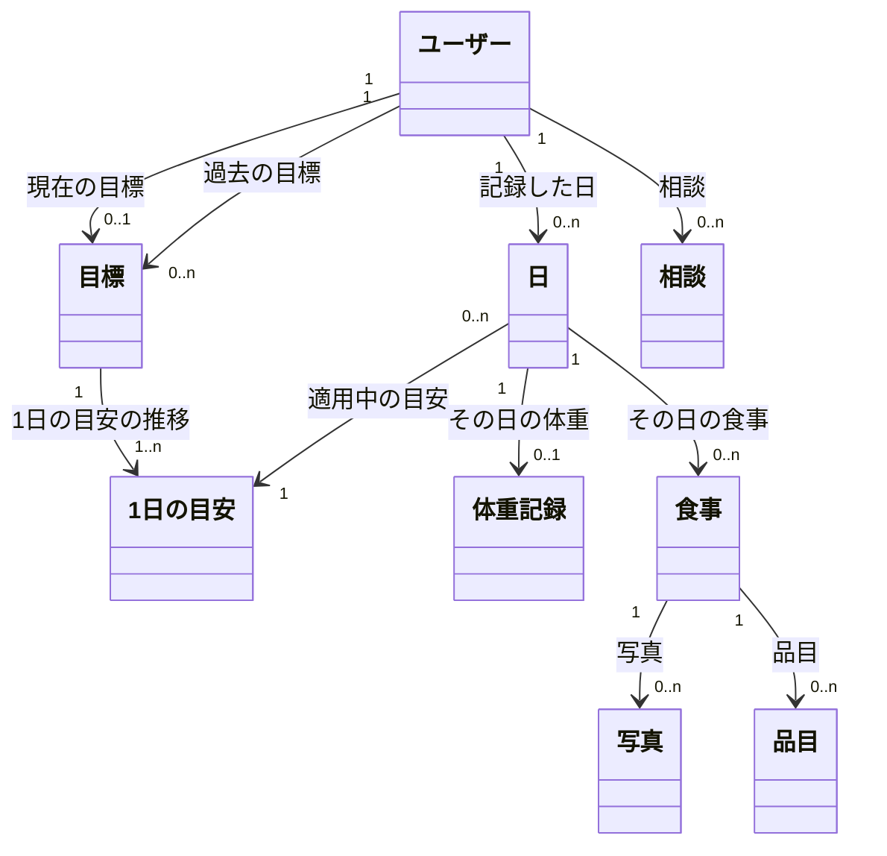

# コンテンツ構造（概念モデル）

入力: `01-use-cases.md`、`02-tasks.md`
`CONTEXT.md` はまだ無いので、ここで出る用語はすべて**新規**。引き継ぎで `CONTEXT.md` に登録する。

## 概念オブジェクト

| オブジェクト | 定義 | 主な属性（プリミティブ） | 根拠ユースケース |
|---|---|---|---|
| ユーザー（新規） | nu-tori を使う人。Sign in with Apple のアカウントに1対1で対応する | 身長、生年月日、性別、活動量の初期値 | アカウント_1,2、身体データ_1,2 |
| 目標（新規） | 向き（増量・減量・維持）、期限、目標体重の組み。切り替えても消さずに残す | 向き、期限、目標体重、開始日、開始時の体重、難易度（ゆるめ・標準・ハード・自分で指定）、結果 | 目標_1〜6 |
| 1日の目安（新規） | 目標に向けて1日に食べる量の目安。1週間ごとに作り直す | カロリー、タンパク質、脂質、炭水化物、推定消費量、適用開始日、変わった理由 | 目安_1〜6 |
| 日（新規） | 1日ぶんの記録のまとまり。体重と食事を束ね、その日に適用されている1日の目安と比べる単位 | 日付、食べた量の合計（計算値） | 食事_9、体重_1、フィードバック_4 |
| 体重記録（新規） | ある日に測った体重。測った値だけを受け付ける | 体重、体脂肪率、測った時刻、入力元（手入力・ヘルスケア） | 体重_1〜4 |
| 食事（新規） | 1回に食べたもの。時刻で並べ、朝食・昼食などの区分は持たない | 時刻、記録方法（写真・文章）、文章 | 食事_1,2,4,5,9,10 |
| 写真（新規） | 食事を撮った画像 | 画像、撮影時刻 | 食事_1,2 |
| 品目（新規） | 食事を構成する食べもの・飲みもの1つ（ご飯、からあげ、プロテインなど）。「料理」だと飲みものや単品が入らないので広めの名前にした | 名前、量、量の出どころ（推定・修正済み）、カロリー、PFC、ビタミン・ミネラル | 食事_2,6,7,8 |
| 相談（新規） | AI への1回の質問と答えの組み | 質問、答え、プリセットかどうか、日時 | フィードバック_1,2 |

## オブジェクトにしなかったもの

| 候補 | 扱い | 理由 |
|---|---|---|
| 身体データ | ユーザーの属性 | 1人に1組しかなく、複数存在しない |
| 栄養（カロリー・PFC・ビタミン等） | 品目の属性。食事・日の値は品目の合計 | プリミティブな値 |
| 目標案（ゆるめ・標準・ハード） | ビューの中の一時的な表示 | 選ばれた案だけが目標として保存される。案そのものは CRUD の対象ではない |
| 週の振り返り、体重の傾向 | 日・体重記録・目標から計算して見せるビュー | 保存する「もの」ではなく、既存オブジェクトの集計 |
| 量の修正の学習結果 | システム内部のデータ | ユーザーが認知・操作する対象ではない |
| 通知 | システムの働き | UI で扱うコンテンツではない |

## 概念モデル図

## 関連と多重度

| 関連 | 多重度（元 → 先） | ⑤での表示パターン | 根拠ユースケース |
|---|---|---|---|
| ユーザー →〈現在の目標〉→ 目標 | 1 → 0..1 | 単体ビュー＋空表示（初回設定の前） | 目標_3,5 |
| ユーザー →〈過去の目標〉→ 目標 | 1 → 0..n | 一覧ビュー＋空表示 | 目標_5、目標_6（履歴はデータとして必ず残す。画面に出すかは⑤で決める） |
| 目標 →〈1日の目安の推移〉→ 1日の目安 | 1 → 1..n | 一覧ビュー（最新を単体で強調） | 目安_1,3,5 |
| ユーザー →〈記録した日〉→ 日 | 1 → 0..n | 一覧ビュー＋空表示 | 食事_9、フィードバック_3 |
| 日 →〈適用中の目安〉→ 1日の目安 | 0..n → 1 | 単体ビュー | 目安_4、フィードバック_4 |
| 日 →〈その日の体重〉→ 体重記録 | 1 → 0..1 | 単体ビュー＋空表示（未記録なら入力を促す） | 体重_1,2 |
| 日 →〈その日の食事〉→ 食事 | 1 → 0..n | 一覧ビュー＋空表示 | 食事_1,9 |
| 食事 →〈写真〉→ 写真 | 1 → 0..n | 一覧ビュー＋空表示（文章で記録した食事は0枚） | 食事_1,4 |
| 食事 →〈品目〉→ 品目 | 1 → 0..n | 一覧ビュー＋空表示（推定中・推定できなかったとき） | 食事_2,6 |
| ユーザー →〈相談〉→ 相談 | 1 → 0..n | 一覧ビュー＋空表示 | フィードバック_1,2 |

## シソーラス（揃える語）

| 使う語 | 避ける語 | 理由 |
|---|---|---|
| 目標 | ゴール、目標体重（単独で） | 目標は「向き・期限・目標体重」の組み。目標体重はその属性 |
| 1日の目安 | 目標カロリー、ターゲット、予算 | 「目標」と混ざらないようにする |
| 食事 | 食事記録、ミール、ログ | 朝食・昼食などの区分語は使わない |
| 品目 | 料理、メニュー、食品 | 飲みものや単品を含める |
| 体重記録 | 計測、ログ | 体重の値そのものと区別する |
| 相談 | チャット、AI アドバイス | 質問と答えの組みを指す |
| 日 | 日記、日誌 | 1日ぶんの記録のまとまり |
