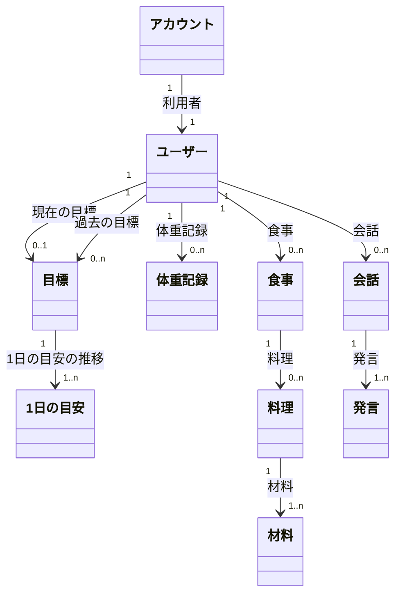

# コンテンツ構造（概念モデル）

入力: `01-use-cases.md`、`02-tasks.md`
`CONTEXT.md` はまだ無いので、ここで出る用語はすべて**新規**。引き継ぎで `CONTEXT.md` に登録する。

## 概念オブジェクト

属性には、それを使うユースケースか働き（`02-tasks.md`）を括弧で添える。根拠を添えられない属性は持たない。

| オブジェクト | 定義 | 属性（根拠） |
|---|---|---|
| アカウント（新規） | 認証の単位。Sign in with Apple でサインインすると作られる。将来、管理者が出てきたら、管理者もアカウントを持つ | Apple ID の識別子（アカウント_1）、作成日時（アカウント_1）。削除するとユーザーの記録もすべて消える（アカウント_2） |
| ユーザー（新規） | nu-tori を使って自分の体づくりに取り組む人。アプリ上の概念で、アカウントに1対1で対応する。管理画面を使う人（管理者）は含めない | 身長・生年月日・性別（目標_2、目安_1: 初期の消費量の見積もり）、活動量の初期値（目標_2: 歩数が取れないときの3択） |
| 目標（新規） | 向き（増量・減量・維持）、期限、目標体重の組み。切り替えても消さずに残す | 向き（目標_1）、期限・目標体重（目標_3,5）、開始日・開始時の体重（フィードバック_4: ペース、目標_6: 結果）、難易度（目標_4: 大変さの表示） |
| 1日の目安（新規） | 目標に向けて1日に食べる量の目安。1週間ごとに作り直し、1つの目安が1週間の適用期間を持つ | カロリー・PFC（目安_1,3）、推定消費量（目安_2,5）、適用期間（目安_3: 週ごとの調整、フィードバック_3: 週の振り返り）、変わった理由（目安_4,5） |
| 体重記録（新規） | ある時刻に測った体重。測った値だけを受け付ける | 体重・測った日時（体重_1,2）、体脂肪率（体重_3: ヘルスケアから取り込んだときだけ）、入力元（体重_3: 手入力とヘルスケアの区別） |
| 食事（新規） | 1回に食べたもの。時刻で並べ、朝食・昼食などの区分は持たない | 食べた日時（食事_1,4）、記録方法（食事_1,4: 写真か文章か）、写真（0枚以上、食事_1,2）、文章（食事_4） |
| 料理（新規） | 食事に写っている、ひとまとまりの食べもの・飲みもの（鶏むね肉のソテー、ご飯、プロテインなど）。市販品や飲みものは材料が1つの料理として扱う | 名前（食事_2）、量・量の出どころ（食事_2,6: 推定か修正済みか）、栄養の合計（食事_8: 材料の合計） |
| 材料（新規） | 料理を構成する食材・調味料1つ | 名前・量・量の出どころ（食事_2,11）、栄養（食事_2,8）、栄養の出どころ（食事_2: 食品データベースか AI の推定か） |
| 会話（新規） | ユーザーと AI との1つのやりとり。初回リリースでは、1つの質問と1つの答えで終わる | 始めた日時（フィードバック_1,2）、プリセットから始めたか（フィードバック_2） |
| 発言（新規） | 会話の中の1回の発言。ユーザーの質問か、AI の答え | 話し手（ユーザーか AI か）・本文・日時（フィードバック_1,2） |

## 料理 → 材料の構造を採る理由

写真からの推定の精度を事前に検証せずに、この構造を採る。推定の質はリリース後に上げられるが、ご飯の量や材料の量をあとから直す操作は、はじめから料理と材料を分けて持っていないとできないため。推定を1回で行う方式に切り替えても、推定結果を料理と材料に分けて保存すれば、この構造は保てる。

## オブジェクトにする基準

次の5つをすべて満たすものを概念オブジェクトにし、満たさないものは親のオブジェクトの属性にする。

1. 名詞で表せる「もの」である
2. 認知や操作の対象になる
3. CRUD の対象である
4. 同じ種類のものが複数存在しうる
5. プリミティブな値（単なる文字列や数値）ではない

属性にするか迷うものは、特に2と3で分かれる。**ユーザーがそれを1つだけ選んで見たり直したりするなら、オブジェクトにする。** 親とまとめてしか扱わないなら、親の属性にする。

| 候補 | 1つだけ選んで見る・直すか | 結論 |
|---|---|---|
| 料理 | ご飯の量だけを直す（食事_6）、料理ごとの栄養の内訳を見る（食事_8） | オブジェクト |
| 材料 | サラダ油の量だけを直す（食事_11） | オブジェクト |
| 写真 | 写真だけを足したり消したりしない | 食事の属性 |
| 発言 | 初回リリースでは1つだけ選んで扱わない。ただし質問するたびに作られ（C）、将来の AI エージェントが過去の発言を1つずつ検索して参照する | オブジェクト（境界にあるので、将来の使い方で判断した） |

オブジェクトにしても、専用の画面を持つとは限らない。材料は料理のビューの中で見て直せば足りる（単位ビューへの畳み方は⑤で決める）。

## オブジェクトにしなかったもの

| 候補 | 扱い | 理由 |
|---|---|---|
| 日 | 日付で絞った集計ビュー（`05-navigation.md`） | 体重記録と食事は日時を持つので、日付の範囲で絞れば作れる。ユーザーが日を作ったり消したりしないので、CRUD の対象でもない |
| 週 | 1日の目安の適用期間で絞った集計ビュー（週の振り返り） | 週ごとの区切りは、1日の目安の適用期間がすでに持っている |
| 写真 | 食事の属性 | 写真だけを足したり消したりするユースケースが無い |
| 身体データ | ユーザーの属性 | 1人に1組しかなく、複数存在しない |
| 栄養（カロリー・PFC・ビタミン等） | 材料の属性。料理・食事・集計ビューの値は材料の合計 | プリミティブな値 |
| 食品データベースの食品 | 材料の「栄養の出どころ」 | ユーザーが食品を選んだり探したりするユースケースが無い |
| 目標案（ゆるめ・標準・ハード） | ビューの中の一時的な表示 | 選ばれた案だけが目標として保存される |
| 体重の傾向 | 体重記録から計算して見せるビュー | 保存する「もの」ではない |
| 量の修正の学習結果 | システム内部のデータ | ユーザーが認知・操作する対象ではない |
| 通知 | システムの働き | UI で扱うコンテンツではない |

## 集計ビューの区切り

【要確認】「日」で集計するときの区切り。0時で区切ると、Tさんが夜遅くに食べた食事が翌日に入る。0時とするか、起床（朝の体重の記録）とするかを⑤で決める。

## 概念モデル図

## 関連と多重度

| 関連 | 多重度（元 → 先） | ⑤での表示パターン | 根拠ユースケース |
|---|---|---|---|
| アカウント →〈利用者〉→ ユーザー | 1 → 1 | 単体ビュー | アカウント_1,2 |
| ユーザー →〈現在の目標〉→ 目標 | 1 → 0..1 | 単体ビュー＋空表示（初回設定の前） | 目標_3,5 |
| ユーザー →〈過去の目標〉→ 目標 | 1 → 0..n | 一覧ビュー＋空表示 | 目標_5,6（データとして必ず残す。画面に出すかは⑤で決める） |
| 目標 →〈1日の目安の推移〉→ 1日の目安 | 1 → 1..n | 一覧ビュー（今の目安を単体で強調） | 目安_1,3,5 |
| ユーザー →〈体重記録〉→ 体重記録 | 1 → 0..n | 一覧ビュー＋空表示（日付で絞ると 0..1） | 体重_1,2,4 |
| ユーザー →〈食事〉→ 食事 | 1 → 0..n | 一覧ビュー＋空表示（日付で絞って見せる） | 食事_1,9 |
| 食事 →〈料理〉→ 料理 | 1 → 0..n | 一覧ビュー＋空表示（推定中・推定できなかったとき） | 食事_2,6 |
| 料理 →〈材料〉→ 材料 | 1 → 1..n | 一覧ビュー | 食事_2,11 |
| ユーザー →〈会話〉→ 会話 | 1 → 0..n | 一覧ビュー＋空表示 | フィードバック_1,2（データとして必ず残す。一覧を画面に出すかは⑤で決める） |
| 会話 →〈発言〉→ 発言 | 1 → 1..n | 一覧ビュー（初回リリースは質問と答えの2件） | フィードバック_1,2 |

## シソーラス（揃える語）

| 使う語 | 避ける語 | 理由 |
|---|---|---|
| 目標 | ゴール、目標体重（単独で） | 目標は「向き・期限・目標体重」の組み。目標体重はその属性 |
| 1日の目安 | 目標カロリー、ターゲット、予算 | 「目標」と混ざらないようにする |
| 食事 | 食事記録、ミール、ログ | 朝食・昼食などの区分語は使わない |
| 料理 | 品目、メニュー | 飲みものや市販品も、材料が1つの料理として含める |
| 材料 | 食材（単独で）、原材料 | 食材と調味料の両方を含める |
| 体重記録 | 計測、ログ | 体重の値そのものと区別する |
| 会話 | 相談、チャット、AI アドバイス | AI とのやりとり1つを指す。「相談」は用途が狭く、将来の使い方（AI からの問いかけなど）を含められない。画面のタブの文言は⑤⑦で別に決めてよい |
| 発言 | メッセージ | 会話の中の1回の発言 |
| アカウント | ユーザー（認証の文脈で） | 認証やサインイン・削除の話では「アカウント」、アプリ上で記録し目標を持つ人の話では「ユーザー」と呼び分ける |
| ユーザー | 会員、利用者 | アプリを使っている人。管理者は含めない |
| 管理者 | （ユーザーの一種として扱わない） | 管理画面を使う人。ユーザーとは別の概念で、アカウントを持つ点だけが共通 |
