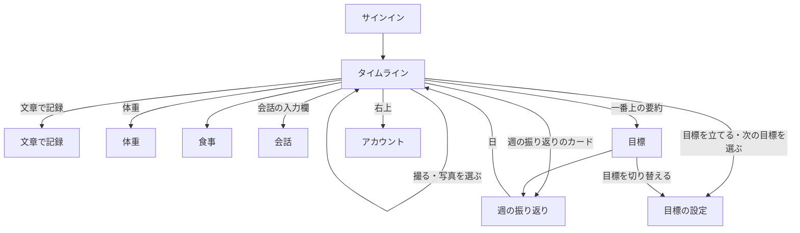
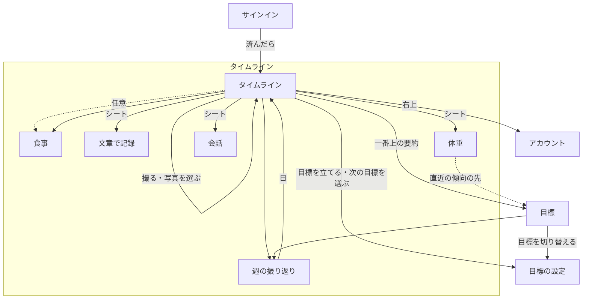

# ナビゲーション構造

入力: `03-concept-model.md`、`04-concept.md`、`01-use-cases.md`
単位は「画面」ではなく「ビュー」。箱＝ビュー、線＝情報の経路。

## 根（目標地点）

- **タイムライン**（日付で区切った集計ビューを、今日から過去へ1本に並べたもの。開くと今日の位置にいる）。最重要タスク「食事を撮る」は、タイムラインから直接できる
- 根はこの1つに絞り、タブは持たない。使う頻度が圧倒的に高いのは記録の作業なので、見渡す場所（目標）はタブにせず、タイムラインの一番上に要約を置いて、そこから開く
- 目標を立てる前は、その要約の位置に「目標を立てる」を置く。起動直後に目標の設定を求めず、ユーザーが自分のタイミングで立てる（S1、目標_7）

骨組みは3案をプロトタイプで比べて決めた（`prototype/0001-navigation` ブランチの `docs/ui-design/0001-first-release/prototype-navigation.html`）。

| 案 | 結果 |
|---|---|
| 2タブ（今日／目標） | 採らない。目標を開く頻度に対して、タブは場所を取りすぎる |
| タブなし＋一番上に目標の要約 | **採る** |
| タイムラインだけ | 採らない。目標期間の傾向、目安の推移、目標の切り替えの入口が弱い |

## 1. トップダウン（根から）

## 2. ボトムアップ（目標地点から逆にたどる）

| 目標地点 | そこへ来る動線 | 根拠ユースケース |
|---|---|---|
| 食事 | タイムライン → 食事 ／ 記録の直後 → 食事（任意） | 食事_5,6,8,11〜15 |
| 体重 | タイムラインの体重の入力欄・体重記録 → 体重 | 体重_1,2,4 |
| 過去の日 | タイムラインを下へ ／ 週の振り返り → 日 | 食事_9、フィードバック_3 |
| 1日の目安の推移と理由 | タイムラインの要約 → 目標 ／ タイムラインの目安の変更 → 目標 ／ 目安の変更の知らせ → 目標 | 目安_4,5 |
| 目標 | タイムラインの要約 → 目標 ／ 達成・期限の知らせ → 目標 | 目標_5,6,8,9、フィードバック_4 |
| 目標の設定 | タイムラインの「目標を立てる」「次の目標を選ぶ」 ／ 目標 → 目標を切り替える | 目標_1〜5,7〜9 |
| 会話 | タイムライン（その時刻に並ぶ） | フィードバック_1,2 |
| アカウント | タイムラインの右上 | アカウント_2、身体データ_2 |

ボトムアップで新たに出た経路:

- タイムラインの目安の変更 → 目標（変更の理由を知りたいとき）
- 目安の変更・達成・期限の知らせ（通知）→ 目標
- 記録の直後 → その食事（任意。見なくてよい）

## 3. 重ね合わせと差異の解消

| 差異 | 片方だけにあった側 | 解消 |
|---|---|---|
| タイムラインの目安の変更 → 目標 | ボトムアップ | OR 採用。変更の理由は目標の中の目安の推移にまとめて置く |
| 通知から詳細へ直接入る経路 | ボトムアップ | OR 採用。通知から入ったビューは、戻るとタイムラインに着く |
| 記録の直後 → 食事 | ボトムアップ | OR 採用。ただし記録後はタイムラインに留まるのが既定で、食事は任意に開く（確認を強制しない） |
| 会話の一覧 | トップダウン | 作り直し。一覧ビューを作らず、会話はタイムラインにその時刻の出来事として並べる |
| 過去の目標 | トップダウン | OR 採用、優先度は低。目標の一番下に並べる。空なら出さない |
| 体重記録の詳細（独立ビュー） | トップダウン | 作り直し。体重記録は属性が少ないので、体重のシートで表示と修正を兼ねる |
| アカウントの入口 | 両方 | タイムラインの右上に置く |

## 統合後のナビゲーション構造

- 詳細は通常のビューとして開く（プッシュ遷移）: 食事、週の振り返り、目標、アカウント
- シートは、入力して閉じる短い作業だけに使う: 文章で記録、体重、会話、目標の設定
- 許可（ヘルスケア、通知、カメラ）は、それが要る操作の中で求める。ヘルスケアは初めて体重を入れるときか目標を立てるとき、通知は初めて体重を記録したあと、カメラは初めて撮るとき

## 目標の状態と入口

| 状態 | タイムラインの一番上 | 目標ビュー |
|---|---|---|
| 目標がない | 「目標を立てる」 → 目標の設定 | 開かない |
| 進行中 | あと何 kg・あと何日・間に合うペースか → 目標 | 傾向、目安の推移、週の振り返り、目標を切り替える |
| 期限より前に達成（傾向の線で判定） | 達成したことと「次の目標を選ぶ」 | 達成したことと次の目標案。選ぶまで今の目標を続ける |
| 期限が来た | 結果と「次の目標を選ぶ」 | 結果、体重の歩み、次の目標案 |
| 期限後に選ばなかった | 今の体重を保つ目標（期限なし）の要約と「次の目標を立てる」 | 今の体重を保つ目標。前の目標は過去の目標に移る |

文言と演出は⑦で決める。

## 多重度から導いた表示パターン

| 関連 | 多重度 | 表示パターン | 置き場所 |
|---|---|---|---|
| ユーザー → 現在の目標 | 0..1 | 単体＋空表示 | タイムラインの一番上に要約。空なら「目標を立てる」。詳細は目標 |
| ユーザー → 過去の目標 | 0..n | 一覧＋空表示 | 目標の一番下。空なら出さない |
| 目標 → 1日の目安 | 1..n | 一覧（最新を強調） | 目標の中。タイムラインの1日の目安は最新の目安と比べる |
| ユーザー → 体重記録 | 0..n | 一覧＋空表示 | タイムライン。今日の分が空なら入力欄を出す |
| ユーザー → 食事 | 0..n | 一覧＋空表示 | タイムライン。空なら記録を促す |
| 食事 → 料理 | 0..n | 一覧＋空表示 | 食事の中。空なら「推定中」または「推定できなかった」 |
| 料理 → 材料 | 1..n | 一覧 | 食事の中、料理の下。量はその場で直す |
| ユーザー → 会話 | 0..n | 一覧＋空表示 | タイムライン。会話の入力欄のそばにプリセットを常に並べる |
| 会話 → 発言 | 1..n | 一覧 | タイムラインの中で、ユーザーの発言と AI の発言を続けて出す |

## 経路の優先度

| 優先度 | 経路 | 根拠 |
|---|---|---|
| 1 | タイムライン → 撮る | 最重要タスク（食事_1） |
| 2 | タイムライン → 体重 | 体重_1 |
| 3 | タイムライン → 食事 → 料理・材料を直す | 食事_5,6,8,11〜14 |
| 3 | タイムラインの一番上の要約 → 目標 | 目安_4,5、フィードバック_4 |
| 3 | タイムライン → 会話 | フィードバック_1,2 |
| 4 | タイムラインを下へ／週の振り返り → 日 | 食事_9、フィードバック_3 |
| 4 | タイムライン → 文章で記録 | 食事_4 |
| 5 | タイムライン → 目標を立てる／目標 → 目標を切り替える | 目標_1〜5,7 |
| 5 | タイムライン → アカウント | アカウント_2 |
| 6 | 目標 → 過去の目標 | 目標の履歴 |

## 単位ビュー

⑤のビューを、1つのユースケース／タスクを実現するまとまりに畳んだもの。`03-frames/` のワイヤーと `07-components/` はこの単位で作る。

| 単位ビュー | 含むナビ上のビュー | ワイヤー |
|---|---|---|
| サインイン | サインイン | `03-frames/signin.html` |
| タイムライン | タイムライン（目標の要約、記録する、習慣トラッカー、1日の目安、時系列、会話の入力欄を含む） | `03-frames/timeline.html` |
| 文章で記録 | 文章で記録 | `03-frames/text-meal.html` |
| 体重 | 体重の入力・修正、直近の傾向 | `03-frames/weight.html` |
| 食事 | 食事、料理、材料、料理の栄養の内訳 | `03-frames/meal.html` |
| 会話 | プリセット、書いて送る | `03-frames/conversation.html` |
| 週の振り返り | 週の振り返り | `03-frames/weekly.html` |
| 目標 | 現在の目標、体重の傾向、1日の目安の推移、週の振り返りの一覧、過去の目標 | `03-frames/goal.html` |
| 目標の設定 | ヘルスケアの許可、身体データ、今の体重、向き、案3つ／自分で指定。手順と初期値は⑥で詰める | `03-frames/goal-setup.html` |
| アカウント | 身体データの確認・修正、許可の状態、アカウントの削除 | `03-frames/account.html` |
