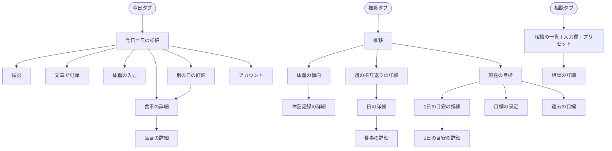
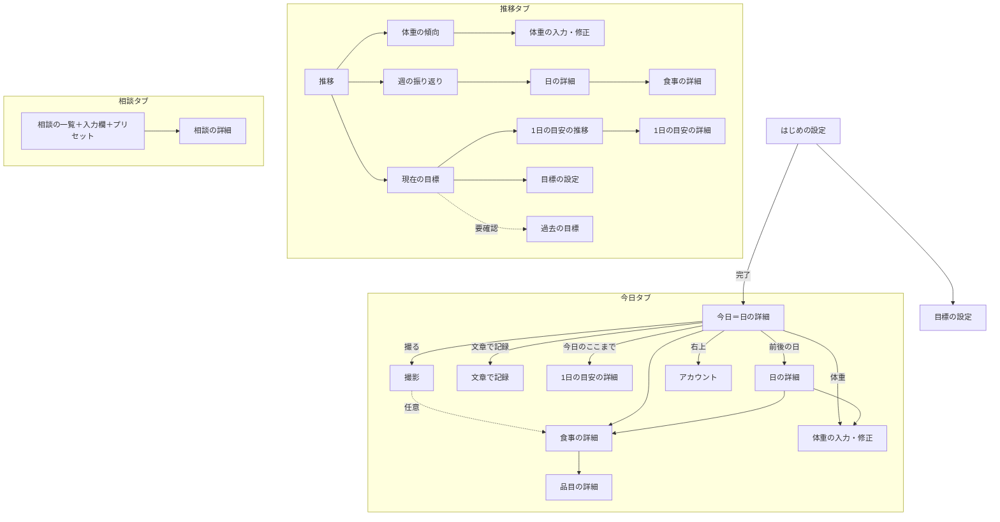

# ナビゲーション構造

入力: `03-concept-model.md`、`04-concept.md`、`01-use-cases.md`
単位は「画面」ではなく「ビュー」。箱＝ビュー、線＝情報の経路。

## 根（目標地点）

- **今日**（日の詳細、今日の日付）。最重要タスク「食事を撮る」は、今日のビューから直接できる
- ④の最重要（食事を撮る／食事）と一致させるため、根はこの1つに絞る

## 1. トップダウン（グローバルナビから）

グローバルナビはタブ3つ: **今日 / 推移 / 相談**。

## 2. ボトムアップ（目標地点から逆にたどる）

詳細ビューを目標地点に置き、そこへ来る動線を逆にたどった。

| 目標地点 | そこへ来る動線 | 根拠ユースケース |
|---|---|---|
| 食事の詳細 | 今日 → 食事 ／ 撮影の直後 → 食事 ／ 日の詳細 → 食事 | 食事_1,2,5,6,9 |
| 品目の詳細 | 食事の詳細 → 品目 | 食事_6,8 |
| 体重記録の詳細 | 今日 → 体重 ／ 体重の傾向 → 点 | 体重_1,2,4 |
| 日の詳細（過去） | 今日 → 前の日 ／ 週の振り返り → 日 | 食事_9、フィードバック_3 |
| 1日の目安の詳細 | 今日 → 今日のここまで → 目安 ／ 目標 → 目安の推移 → 目安 ／ 目安の変更の知らせ → 目安 | 目安_4,5 |
| 現在の目標 | 推移 → 目標 ／ 期限の知らせ → 目標（結果） | 目標_5,6、フィードバック_4 |
| 相談の詳細 | 相談の一覧 → 相談 | フィードバック_1,2 |
| アカウント | 今日 → アカウント | アカウント_2、身体データ_2 |

ボトムアップで新たに出た経路:

- 今日のここまで → 1日の目安の詳細（目安と比べた内訳を知りたいとき）
- 目安の変更の知らせ・期限の知らせ（通知）→ それぞれの詳細
- 撮影の直後 → その食事の詳細（任意。見なくてよい）

## 3. 重ね合わせと差異の解消

| 差異 | 片方だけにあった側 | 解消 |
|---|---|---|
| 今日のここまで → 1日の目安の詳細 | ボトムアップ | OR 採用。今日のビューから辿れる。推移タブの経路と重複するが、縦割り化を避けるため許容する |
| 通知から詳細へ直接入る経路 | ボトムアップ | OR 採用。通知から入った詳細は、該当タブの中に開く（タブジャンプにしない） |
| 撮影の直後 → 食事の詳細 | ボトムアップ | OR 採用。ただし撮影後は今日に戻るのが既定で、詳細は任意に開く（確認を強制しない） |
| 過去の目標 | トップダウン | OR 採用、優先度は低。データは必ず残す。画面は【要確認】初回リリースで出すか |
| 体重記録の詳細（独立ビュー） | トップダウン | 作り直し。体重記録は属性が少ないので、独立したビューにせず、体重の入力ビューで表示と修正を兼ねる |
| アカウントの入口 | 両方 | 今日の右上に置く。頻度が低いのでタブにしない |

## 統合後のナビゲーション構造

- 同じビュー（日の詳細、食事の詳細、1日の目安の詳細、体重の入力・修正）が複数のタブにある。経路は常に今いるタブの中で完結させる
- 詳細は通常のビューとして開く（プッシュ遷移）。モーダルは、入力して閉じる短い作業（撮影、文章で記録、体重の入力・修正、目標の設定）だけに使う

## 多重度から導いた表示パターン

| 関連 | 多重度 | 表示パターン | 置き場所 |
|---|---|---|---|
| ユーザー → 現在の目標 | 0..1 | 単体＋空表示 | 推移タブ「現在の目標」。空なら「目標を立てる」 |
| ユーザー → 過去の目標 | 0..n | 一覧＋空表示 | 推移タブ「過去の目標」（要確認） |
| 目標 → 1日の目安の推移 | 1..n | 一覧（最新を単体で強調） | 現在の目標 → 1日の目安の推移 |
| ユーザー → 記録した日 | 0..n | 一覧＋空表示 | 今日の前後の日への移動、週の振り返りの中の日の並び |
| 日 → 適用中の目安 | 1 | 単体 | 今日・日の詳細の「今日のここまで」 |
| 日 → その日の体重 | 0..1 | 単体＋空表示 | 今日・日の詳細。空なら入力欄を出す（当日のみ） |
| 日 → その日の食事 | 0..n | 一覧＋空表示 | 今日・日の詳細。空なら「撮る」を促す |
| 食事 → 写真 | 0..n | 一覧＋空表示 | 食事の詳細。0枚なら記録した文章を出す |
| 食事 → 品目 | 0..n | 一覧＋空表示 | 食事の詳細。空なら「推定中」または「推定できませんでした」 |
| ユーザー → 相談 | 0..n | 一覧＋空表示 | 相談タブ。空ならプリセットを並べる |

## 経路の優先度

| 優先度 | 経路 | 根拠 |
|---|---|---|
| 1 | 今日 → 撮影 | 最重要タスク（食事_1） |
| 2 | 今日 → 体重の入力 | 体重_1 |
| 3 | 今日 → 食事の詳細 → 品目の詳細 | 食事_5,6,8 |
| 3 | 今日 → 今日のここまで → 1日の目安の詳細 | 目安_4、フィードバック_4 |
| 3 | 相談の一覧 → プリセット／入力 | フィードバック_1,2 |
| 4 | 推移 → 体重の傾向／週の振り返り → 日 → 食事 | 体重_4、フィードバック_3、食事_9 |
| 4 | 今日 → 文章で記録 | 食事_4 |
| 5 | 推移 → 現在の目標 → 1日の目安の推移／目標の設定 | 目安_5、目標_5 |
| 5 | 今日 → アカウント | アカウント_2 |
| 6 | 推移 → 過去の目標 | 目標の履歴（要確認） |

## 単位ビュー

⑤のビューを、1つのユースケース／タスクを実現するまとまりに畳んだもの。`03-frames/` のワイヤーと `07-components/` はこの単位で作る。

| 単位ビュー | 含むナビ上のビュー | ワイヤー |
|---|---|---|
| 日 | 今日、日の詳細 | `03-frames/day.html` |
| 撮影 | 撮影 | `03-frames/camera.html` |
| 文章で記録 | 文章で記録 | `03-frames/text-meal.html` |
| 体重の入力 | 体重の入力・修正 | `03-frames/weight.html` |
| 食事 | 食事の詳細、品目の詳細 | `03-frames/meal.html` |
| 1日の目安 | 1日の目安の詳細、1日の目安の推移 | `03-frames/target.html` |
| 推移 | 推移、体重の傾向 | `03-frames/trend.html` |
| 週の振り返り | 週の振り返り | `03-frames/weekly.html` |
| 目標 | 現在の目標、過去の目標 | `03-frames/goal.html` |
| 目標の設定 | 目標の設定（向き → 案3つ／自分で指定） | `03-frames/goal-setup.html` |
| 相談 | 相談の一覧、相談の詳細 | `03-frames/consult.html` |
| はじめの設定 | サインイン、ヘルスケアの許可、身体データ、今の体重、通知の許可 | `03-frames/onboarding.html` |
| アカウント | 身体データの確認・修正、アカウントの削除 | `03-frames/account.html` |
