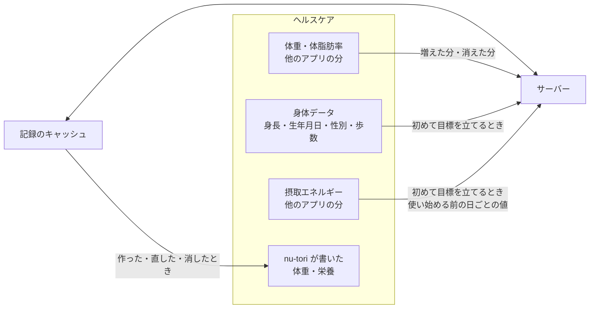

# ios

nu-tori の iPhone アプリ（SwiftUI、ADR-0004）。

## 構成

- 対象は iPhone だけ、最低対応は iOS 27。Xcode 27（Swift 6.4）でビルドする
- 画面を持たないロジック（下の「端末で行うもの」の計算と判定）は、ローカルの Swift パッケージ `NuToriCore/` に置き、SwiftUI・UIKit・HealthKit を import しない。Linux のエージェントと CI でも型検査とテストを回すため
- 画面とヘルスケアなどの端末の入出力は、Xcode のプロジェクトのアプリ（`NuTori/`）に置き、UI テストは `NuToriUITests/` に置く
- Xcode のプロジェクトはフォルダの同期（buildable folders）で組む。ファイルはフォルダに置くだけで足せるので、ファイルの出し入れで `project.pbxproj` を直さない
- Bundle ID は仮の値。Xcode Cloud をつなぐ前に決め、`project.pbxproj` の `PRODUCT_BUNDLE_IDENTIFIER` を差し替える。最初のビルドを App Store Connect に上げたあとは変えられない

## 端末で行うもの

ルートの `AGENTS.md` の「リポジトリ全体の決定」の基準に当たるものだけを端末で行う。今の一覧:

- 記録をまとめて見せるための計算: 材料から料理・食事への栄養の合計、料理の量を直したときの材料の量の比例、1日の丸・日のまとめの合計、週の振り返りの平均、習慣トラッカー、日と週の区切り
- 記録忘れの判定: ローカル通知の予約と取り消し、記録忘れの知らせ
- 入力の検証: 受け付ける値の範囲

材料の量の比例は端末だけが持ち、比例させた結果をサーバーに送る。目標と目安の計算、いつもの時刻の学習、写真と文章からの推定はサーバーで行い、端末は結果を受け取る。

## 記録の持ち方

- 記録は、サーバーの API とアプリの中のキャッシュで持つ。端末とサーバーのやりとりは API だけにし、DB を丸ごと写す仕組み（Turso Sync、Embedded Replicas）は入れない
- 目標の設定の途中で手で入れた身体データは、端末の中だけに持ち、目標が決まったら捨てる

## API

- クライアントは、`server/` が書き出した OpenAPI の文書から `swift-openapi-generator` で生成する

## ヘルスケア

nu-tori の記録を、端末がヘルスケアに片道で写す。ヘルスケアから記録に入るのは、他のアプリが書いた体重と体脂肪率だけ。サーバー側の扱いは `server/AGENTS.md` の「ヘルスケアから来たもの」。

### 書く

- 体重: nu-tori で記録した体重。他のアプリから取り込んだ体重は、直しても書かない。体脂肪率は書かない
- 栄養: 料理ごとに食品の組（`HKCorrelationTypeIdentifier.food`）で書く。食品名は料理の名前、時刻は食事の時刻。種類はエネルギー、P・F・C と、成分表にありヘルスケアに型のある栄養すべて。値のない栄養は書かない。エネルギーはアプリで見せる kcal と同じ値
- 組は、書き込みを許可された種類だけで作る（中の種類の書き込み許可が1つでも無いと保存できないため）
- 料理と体重記録の ID を `HKMetadataKeySyncIdentifier` にし、`HKMetadataKeySyncVersion` を上げて置き換える。版を上げるのは、直したときと、書き込みを許可された種類が増えたとき。料理・食事を消したら、ヘルスケアからも消す
- 書くのは、記録を作った・直した・消したときと、書き込みがあとから許可されたとき（次にアプリを開いたときに、それまでの記録をまとめて書く）。直したらその場で書き、サーバーへの同期を待たない。ユーザーがヘルスケアアプリで消したものは書き戻さない。アカウントを消しても、書いた分は残す

### 読む

- 体重・体脂肪率: 体重の許可を求めたあとは、アプリを開くたびとバックグラウンド配信（即時）で起こされたときに、アンカー付きの問い合わせで読み、増えた分と消えた分をサンプルの UUID と出どころつきでサーバーに送る（最初は全期間分）
  - nu-tori 自身が書いた分は、出どころの bundle ID で除く
  - 体脂肪率は、同じ出どころで同じ時刻の体重に添える。対になる体重の無い体脂肪率は送らない
  - 当日の体重が入ったら、その日の体重の通知を取り消す
- 身体データ: 初めて目標を立てるときに読んで送る。生年月日は年齢にして送る
- 摂取エネルギー: 初めて目標を立てるときに、使い始める前の分を読む。出どころごとの日の合計を量のサンプルの統計（`separateBySource`）で出し、1日ごとに一番多い出どころの値を送る。食品の組をたどって数え直さない。nu-tori 自身の分と今日の分は除く。P・F・C は読まない。使い始めてからの他のアプリの栄養は読まない
- 期間を限った読み取り許可（`getEarliestAuthorizedSampleDate`）の境界より前は、体重も栄養も「不明」として読まない。0 として送らない。境界があることは画面に出さない

### 許可

- 初めて体重を入れるとき: 体重（読む・書く）、体脂肪率（読む）
- 初めて目標を立てるとき（向きを選んだ直後）: 身長・生年月日・性別・歩数・摂取エネルギー（読む）。体重をまだ入れていなければ、上の分も
- 初めて食事を記録したあと: 栄養（書く）

アカウントの画面では、許可の状態は出さず、種類を用途ごとにまとめて見せる。

- 読む: 体重・体脂肪率（他のアプリで記録した体重を取り込む）、身長・生年月日・性別・歩数・摂取エネルギー（目標と推定消費量の計算に使い、保存しない）
- 書く: 体重（nu-tori で記録した体重）、栄養（エネルギー、P・F・C、ビタミン・ミネラルなど。全部は並べない）

### 実機で確かめるまで見込みのもの

- 組の中のサンプルが統計に一度だけ入ること。組を置き換えたり消したりしたとき、中のサンプルも置き換わり消えること。組で書いた栄養が MacroFactor に届くこと。どれかが成り立たなければ、栄養は料理ごとに量のサンプルだけで書く
- 同期 ID で置き換えができ、書き直しても二重にならず、ヘルスケアアプリで消したものが戻らないこと
- あとから読み取りを許可したとき、または期間を広げたとき、アンカーからの問い合わせで過去分が返ること。返らなければ、ときどきアンカーを捨てて読み直す。期間を狭めて見えなくなった境界より前のサンプルは、「消えた分」として返っても送らない
- nu-tori が書いた体重を、他のアプリが自分の出どころで書き戻さないこと

## 確かめる

- `scripts/check ios` が、整形、Lint、ロジックのパッケージのテストを回す。macOS では続けて `scripts/check ios-app`（アプリのビルドとテスト）も回す
- 整形の正は、`.swift-version` の版の Linux の swift-format にする。Xcode に同梱の版と違うことがあるので、macOS の CI では整形を確かめない
- SwiftLint は、`docs/agents/` の好みのうち機械で見られるものだけを見る。見た目は swift-format に任せる
- CI（`.github/workflows/check.yml`）は、Linux の `ios` ジョブが通ってから macOS の `ios-app` ジョブを回す。main の必須のチェックは `changes`・`ios`・`server` にする。`changes` が落ちると後ろのジョブが飛ばされて通った扱いになるので、`changes` も必須にする。`ios-app` は、`xcode-27` のランナーがプレビューのうちは必須にしない
- ロジックのパッケージのテストを macOS でも回すのは、Linux と macOS で Foundation の振る舞いが違うことがあるため

## 配布

- main にマージするたびに、Xcode Cloud がビルドして TestFlight の内部テストに配る。署名とビルド番号は Apple 側に任せ、証明書を GitHub に置かない
- Xcode Cloud の枠（月 25 時間）に収めるため、Xcode Cloud のワークフローは `ios/` が変わったときだけ動かす

## 実機の確認

エージェントには実機を操作する道が無いので、人が確かめる。

- 確かめるのは、ヘルスケア、カメラ、通知、写真の読み込みに触れた PR をマージしたあとと、外部テストに出す前。エージェントは、該当する PR の本文に「実機の確認が要る」と書き、確かめる項目を並べる
- ヘルスケアは、上の「実機で確かめるまで見込みのもの」に加えて、他のアプリの当日の体重で通知が取り消されることを確かめる。nu-tori を閉じてヘルスケアアプリで体重を手入力すると、その日の体重の通知が取り消され、開くと体重のボタンが目立たない。MacroFactor で入れても同じになる
