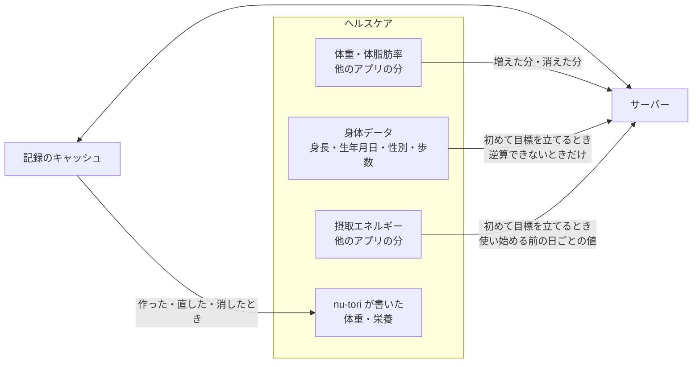

# ios

nu-tori の iPhone アプリ（SwiftUI、ADR-0004）。

## 構成

- 画面を持たないロジックは、ローカルの Swift パッケージ `NuToriCore/` に置き、SwiftUI・UIKit・HealthKit・SwiftData を import しない。下の「端末で行うもの」の計算と判定と、送り待ちの判断がここに入る。Linux のエージェントと CI でも型検査とテストを回すため
- ファイルを足すとき、`project.pbxproj` は直さない（フォルダの同期で拾われる）
- 型検査の厳しさの設定は `NuToriCore/Package.swift` と `project.pbxproj` の2か所にあるので、そろえる
- Bundle ID は仮の値。Xcode Cloud をつなぐ前に決めて差し替える。最初のビルドを App Store Connect に上げたあとは変えられない

## 端末で行うもの

ルートの `AGENTS.md` の「リポジトリ全体の決定」の基準に当たるものだけを端末で行う。今の一覧:

- 記録をまとめて見せるための計算: 材料の量からの栄養、材料から料理・食事への栄養の合計（数え方は `server/AGENTS.md` の「端末とサーバーの両方に置く決めごと」）、料理の量を直したときの材料の量の比例、1日の丸・日のまとめの合計、週の振り返りの平均、習慣トラッカー、日と週の区切り
- 記録忘れの判定: ローカル通知の予約と取り消し、記録忘れの知らせ
- 入力の検証: 受け付ける値の範囲
- 選んだ写真のまとめ方: 複数枚を一度に選んだとき、撮影時刻が近いものを1つの食事にまとめる（基準1）

材料の量の比例は端末だけが持ち、比例させた結果をサーバーに送る。目標と目安の計算、いつもの時刻の学習、写真と文章からの推定はサーバーで行い、端末は結果（材料の栄養の値まで）を受け取る（`server/AGENTS.md` の「写真と文章からの推定」）。

撮っておいた写真を選んだときは、EXIF を消す前に撮影時刻を読み、食事の時刻として送る。撮影時刻の無い写真は、選んだ時刻を食事の時刻にする。記録のタイムゾーンは、EXIF に時差（OffsetTimeOriginal）があればその時差、無ければ選んだときの端末のタイムゾーンにする。

## 対応する iOS

- 最低対応版は iOS 27。SwiftData の `@Query` とバックグラウンドの書き込みがデッドロックすることがある不具合が iOS 27 で直った（iOS 26 ではありうる）

## 記録の持ち方

- 記録は、サーバーの API とアプリの中のキャッシュで持つ。端末とサーバーのやりとりは API だけにし、DB を丸ごと写す仕組み（Turso Sync、Embedded Replicas）は入れない。既製の同期の仕組み（PowerSync など）も使わず、同期は自前で書く
- 目標の設定の途中で手で入れた身体データは、端末の中だけに持ち、目標が決まったら捨てる
- キャッシュは SwiftData に持つ。記録、会話と発言、知らせを、期間で切らずにすべて持つ。モデルのクラスと送り待ちの判断の置き場は、上の「構成」
- アプリの中の写真は、iPhone のバックアップの対象になる場所に置く
- ファイルの保護は iOS の既定にする（写真のファイルも）。再起動のあと一度ロックを解除すれば、ロック中に裏で起こされたときにも、キャッシュと送り待ちへ書けるようにするため

### 電波がないとき

- アプリの中の操作で電波が要るのは、目標の設定（目標の知らせから立てる・選ぶのを含む）、アカウントの削除、サインインだけ。ほかの操作は端末で受け付け、キャッシュにすぐ反映して送り待ちに並べる
- サーバーでしか進められないもの（写真と文章からの推定、料理を足したときの推定、推定し直し、送った文章の読み分け、AI の発言）は、電波が戻って送れてから始まる
- 電波がないときに記録した・直した体重は、すぐ見せる。体重の傾向と、それを使う値（あと何 kg など）は、同期してサーバーが計算し直すまで前のまま
- 電波がないときにアカウントの削除を押したら、アラートを閉じ、アカウントのシートの削除の行の上に、消せなかったことを1行で出す。端末では何も消さない（その場で知らせる決まりは `DESIGN.md` の Do's and Don'ts）
- 注記の決まりは `DESIGN.md` の Do's and Don'ts

### 待っている表示

見た目は `DESIGN.md` の「待っている表示」。ここでは、いつ出すかを決める。

- サーバーが実際に処理しているあいだだけ出す。推定中は、食事の推定の状態が推定中のとき（`server/AGENTS.md` の「同期」）。送った文章の応答待ちは、応答（食事と読み分けた食事、AI の発言の最初の分、作れなかった・回数切れの印のどれか）がまだ届いていないとき。「送り直す」か「会話として送り直す」を押した送った文章は、前に届いた印を捨て、応答が改めて届くまで応答待ちにする
- 電波がなく、まだ送れていないあいだは出さない。文章は自分の吹き出しだけ、食事は写真と時刻だけのカードにし、食事の画面の料理の一覧には「料理を足す」だけを置く
- 送れなかったら待っている表示を消し、送り待ちに戻す
- 開いたときは読み込み中を出さず、端末にある記録をすぐ見せる。読み込み中を出すのは、端末に記録が無いとき（機種変更のあと、2台目、別のアカウントでサインインし直したあと、端末の記録を捨てて取り直すときなど）だけで、記録を取り終えるまで出す

### 同期

やりとりの約束（ID、冪等、競合、変更の通し番号、サーバーが書くもの）は `server/AGENTS.md` の「同期」。端末の側は次のとおり。

- 端末で作るものの ID は端末で振る。ふつうは UUID v4（Foundation の `UUID()`）。どの端末で作っても同じになってほしいものは、名前から決まる UUID v5 にし、種類ごとに別の名前空間を使う
  - 端末で出す知らせ: 種類（食事の知らせは食事どきを含む）と日付から
  - ヘルスケアから取り込んだ体重記録: ヘルスケアのサンプルの UUID から。機種変更のあとや2台目で全期間分を読み直しても、二重にならない
- 作ったもの・直したもの・消したものは、それを保存するのと同じ保存の中で、送り待ちの列に1件足す。送り待ちの1件ごとに、書き込みの ID（UUID v4）を振る
- 送る: 保存したらすぐ送る。送り待ちはまとめて1つの要求で順に送り、1回で送れなければ数回に分けて、最後の要求に送り切った印を付ける（`server/AGENTS.md` の「同期」）。送れなかったもの（回数の歯止めの 429 を含む）は送り待ちに残し、アプリを開いたとき、電波が戻ったとき、ヘルスケアのバックグラウンド配信やバックグラウンド更新で起こされたときに送る
- サーバーが受け付けなかった書き込みは、送り待ちから外して送り直さない。その記録をサーバーにある状態に戻し（新しく作ったものなら消し）、記録の位置に記録できなかったことを1行で出す（`DESIGN.md` の Do's and Don'ts）
- 取りに行く: アプリを開いたときと、送ったあと。送り待ちがあるときは、送り切ってから取りに行く。サーバーの処理を待つもの（推定の状態が推定中の食事、応答を待つ送った文章）があるあいだだけ、送ってから1分まで数秒おきに取りに行き、そのあとはふだんの時機にだけ取りに行く。プッシュは使わない
- 届いた記録は、サーバーの値でキャッシュを置き換える。記録をまとめて見せる値は、端末で出し直す
- 知らない種類の記録や値が届いたら、落ちずに読み飛ばし、通し番号は進める。新しい種類を読めるようになった版は、更新して最初に開いたときに通し番号を最初に戻して全部取り直す
- キャッシュの形を変えるときは、SwiftData の版つきのスキーマで移行する。移行が難しいときは、キャッシュの記録を捨ててサーバーから全部取り直す。どちらのときも、送り待ちとアプリの中の写真は残す
- いつもの時刻は、同期で届いた値でローカル通知を予約し直す。一度も届いていなければ、使い始めの時刻（体重は朝7時）を使う
- 写真: 撮ったら（選んだら）縮小版（ADR-0008）をファイルに書き、バックグラウンドの URLSession で送る。ユーザーが App スイッチャーで閉じると送信が取り消されるので、アプリを開いたときに送り残しを見直す。食事の記録は写真とは別に送り待ちで送る。写真が無い端末では、縮小版をその食事が画面に出るときに取りに行く
- 2台目の端末は、機種変更のあとの端末と同じに扱う。写真は縮小版、記録忘れの通知は端末ごとに予約する（片方で記録しても、もう片方の通知は同期するまで取り消されない）
- サインイン: Sign in with Apple の要求ごとに nonce を作り、得た ID トークンと認可コードを nonce とともにサーバーに送る（受け方は `server/AGENTS.md` の「認証と不正利用防止」）。Sign in with Apple で得た user の識別子は端末に保存する（サーバーからは受け取らない）。アプリを開いたときに、その識別子で `getCredentialState` を呼んで Apple の資格情報を確かめ、取り消されていれば（`revoked`、`notFound`）サインインの画面を出す。ふだんは裏でセッションを更新する。ほかにサインインの画面を出すのは、サーバーがセッションを受け付けなかったとき（期限切れ、取り消し）だけで、電波がなくて更新できないときは出さない。そのあいだも送り待ちは残し、同じアカウントでサインインし直したら送る。別のアカウントでサインインしたら、前のアカウントのものを、アカウントの削除のときと同じく端末からすべて消す（送り待ち、送りかけの縮小版のファイル、バックグラウンドの送信も。アカウントの削除のときもこの3つを消す）

## 会話

AI の発言の作り方と、送った文章の扱いは `server/AGENTS.md` の「送った文章と AI の発言」。

- プリセットの文面はアプリに持つ。押すとその文面を入力欄に入れ、送るのはユーザーが決める。サーバーにはプリセットの種類を送らず、ふつうの送った文章として送る
- 応答を待つ送った文章があるあいだは、その文章の AI の発言を見守る要求をつなぎ、届いた分から見せる。つながっているあいだは、その文章のために数秒おきに取りに行かない。見守る要求が閉じたら、理由によらず（作り終えた、食事と読み分けた、作れなかった、回数切れ、切れた）「同期」の取りに行くで記録を受け取り、見守る要求で届いた ID と同じ AI の発言を、届いた記録で置き換える。つながらないときも、「同期」の取りに行くで受け取る
- 作れなかった送った文章と回数切れの送った文章には「送り直す」を出し、押したら作り直す書き込みを送る（`server/AGENTS.md` の「送った文章と AI の発言」）
- 規約のために出すもの（ADR-0018）。見た目は、複数の試作を見比べて決める
  - サインインの画面: 写真と記録を、推定と返事のために外部の AI（米国）に送ることと、推定の値と返事は確かめてから使ってほしいことと、続けるとこれに同意したことになることを、Sign in with Apple のボタンの真上に書く。ボタンは標準のまま（「Appleで続ける」）にする。Sign in with Apple のボタンは文言を選べないため。文言は「プライバシーポリシーを用意する」で決める
  - 会話の最初の AI の発言と、会話が日をまたいだあとの最初の AI の発言に、AI の返事であることを示す1行を添える
  - これらを表示するコードには、規約のために消せないことと出典（Anthropic の Usage Policy、Anthropic の Commercial Terms D.3、App Store Review Guidelines 5.1.2(i)、個人情報保護法 28 条）をコメントに書く

## 観測

何をどれに送るかの分け方と、送らないものは、ルートの `AGENTS.md` の「リポジトリ全体の決定」。サーバーの側と、置き場・送る前の設定は `server/AGENTS.md` の「観測」。

- 送るのは TestFlight と App Store の版だけにし、デバッグビルドは Sentry にも PostHog にも送らない
- **Sentry**（sentry-cocoa）: クラッシュと、対処した失敗（同期、写真の送信、ヘルスケアの読み書き、キャッシュへの保存）を送る。電波がないことや時間切れによる失敗は送らない（無料の月 5,000 エラーを端末とサーバーで分け合うため）。アカウント ID を `user.id` に付ける。`sendDefaultPii` は既定の `false` のままにし（導入の手順の例は `true`）、スクリーンショットと view hierarchy は既定のまま切っておく。dSYM は Xcode Cloud のビルドのあとに Sentry へ上げる
- Apple のクラッシュの報告だけに頼らないのは、Xcode Organizer は届くまで数日かかり、App Store の版では「App デベロッパと共有」を許可した人の分しか集まらないため
- **PostHog**（posthog-ios）: 画面は、自動の記録を切り、画面ごとに `.postHogScreenView()` を付ける。主な操作を出来事にする（一覧は仕様で決める）。セッションリプレイと、例外・クラッシュの収集は切る（Sentry が持つ）。SDK はサインインしてから始め（サインインの画面より前に、起動などの出来事を送らないため）、アカウント ID で `identify` する。アカウントの削除と、別のアカウントでサインインし直すとき、サーバーがセッションを受け付けずサインインの画面を出すとき（もう1台でアカウントが消されたときを含む）に `reset` し、Sentry の user も外す。サインインの画面を出したら、サインインし直すまで PostHog に送らない。`reset` は送り待ちの列を消さないので、アカウントの削除では、削除の要求を送る前に PostHog の列を送り切る（サーバーが PostHog の人を消したあとに、前の ID の出来事が届いて人が作り直されないため）
- アカウントの削除を確かめるときに、記録はすぐに消え、エラーの報告と利用状況のデータは最長 90 日で消えることを伝える（Apple は、削除に時間がかかるならかかる時間を知らせるよう求める。残るものと期間は `server/AGENTS.md` の「観測」の保持とアカウントの削除）。記録を消し終えたらその場で見せ、あとからの知らせは出さない（連絡先を持たないため）
- 利用状況を集めることへの同意（App Store Review Guidelines 5.1.1(ii)）は、サインインの画面のプライバシーポリシーへのリンクで取り、送るかの切り替えはアプリに置かない。審査で求められたら、アカウントの画面に切り替えを足す

## API

- クライアントは、`server/` が書き出した OpenAPI の文書から `swift-openapi-generator` で生成する

## ヘルスケア

nu-tori の記録を、端末がヘルスケアに片道で写す。ヘルスケアから記録に入るのは、他のアプリが書いた体重と体脂肪率だけ。サーバー側の扱いは `server/AGENTS.md` の「ヘルスケアから来たもの」。

### 書く

- 体重: nu-tori で記録した体重。他のアプリから取り込んだ体重は、直しても書かない。体脂肪率は書かない
- 栄養: 料理ごとに食品の組（`HKCorrelationTypeIdentifier.food`）で書く。食品名は料理の名前、時刻は食事の時刻。種類はエネルギー、P・F・C と、成分表にありヘルスケアに型のある栄養すべて。値はアプリで見せる料理の合計と同じにし（`server/AGENTS.md` の「端末とサーバーの両方に置く決めごと」）、合計が「不明」の栄養は書かない
- 組は、書き込みを許可された種類だけで作る（中の種類の書き込み許可が1つでも無いと保存できないため）
- 料理と体重記録の ID を `HKMetadataKeySyncIdentifier` にし、`HKMetadataKeySyncVersion` を上げて置き換える。版を上げるのは、直したときと、書き込みを許可された種類が増えたとき。料理・食事を消したら、ヘルスケアからも消す
- 書くのは、記録を作った・直した・消したときと、書き込みがあとから許可されたとき（次にアプリを開いたときに、それまでの記録をまとめて書く）。直したらその場で書き、サーバーへの同期を待たない。ユーザーがヘルスケアアプリで消したものは書き戻さない。アカウントを消しても、書いた分は残す

### 読む

- 体重・体脂肪率: 体重の許可を求めたあとは、アプリを開くたびとバックグラウンド配信（即時）で起こされたときに、アンカー付きの問い合わせで読み、増えた分と消えた分をサンプルの UUID と出どころつきでサーバーに送る（最初は全期間分）
  - nu-tori 自身が書いた分は、出どころの bundle ID で除く
  - 体脂肪率は、同じ出どころで同じ時刻の体重に添える。対になる体重の無い体脂肪率は送らない
  - 当日の体重が入ったら、その日の体重の通知を取り消す
- 初めて目標を立てるときは、逆算できるかをサーバーに問う前に、体重（このとき初めて許可を得た人は全期間分）と使い始める前の摂取エネルギーを送り終える
- 身体データ: 初めて目標を立てるときに、初期値の窓の記録では推定消費量を逆算できないとサーバーが返したときだけ読んで送る（`server/AGENTS.md` の「推定消費量と1日の目安」）。生年月日は年齢にして送る。歩数は、`server/AGENTS.md` の「推定消費量と1日の目安」が平均を出す期間の日ごとの値を送る
- 摂取エネルギー: 初めて目標を立てるときに、使い始める前の分を読む。読むのは、初期値の窓（`server/AGENTS.md` の「推定消費量と1日の目安」）に入る使い始める前の日だけ。出どころごとの日の合計を量のサンプルの統計（`separateBySource`）で出し、1日ごとに一番多い出どころの値を送る。食品の組をたどって数え直さない。nu-tori 自身の分と今日の分は除く。P・F・C は読まない。使い始めてからの他のアプリの栄養は読まない
- 期間を限った読み取り許可（`getEarliestAuthorizedSampleDate`）の境界より前は、体重も栄養も「不明」として読まない。0 として送らない。境界があることは画面に出さない

### 許可

- 初めて体重を入れるとき: 体重（読む・書く）、体脂肪率（読む）
- 初めて目標を立てるとき（向きを選んだ直後）: 身長・生年月日・性別・歩数・摂取エネルギー（読む）。体重をまだ入れていなければ、上の分も
- 初めて食事を記録したあと: 栄養（書く）

アカウントの画面では、許可の状態は出さず、種類を用途ごとにまとめて見せる。

- 読む: 体重・体脂肪率（他のアプリで記録した体重を取り込む）、身長・生年月日・性別・歩数・摂取エネルギー（目標と推定消費量の計算に使い、保存しない）
- 書く: 体重（nu-tori で記録した体重）、栄養（エネルギー、P・F・C、ビタミン・ミネラルなど。全部は並べない）

### 実機で確かめるまで見込みのもの

- 組の中のサンプルが統計に一度だけ入ること。組を置き換えたり消したりしたとき、中のサンプルも置き換わり消えること。組で書いた栄養が MacroFactor に届くこと。どれかが成り立たなければ、栄養は料理ごとに量のサンプルだけで書く
- 同期 ID で置き換えができ、書き直しても二重にならず、ヘルスケアアプリで消したものが戻らないこと
- あとから読み取りを許可したとき、または期間を広げたとき、アンカーからの問い合わせで過去分が返ること。返らなければ、ときどきアンカーを捨てて読み直す。期間を狭めて見えなくなった境界より前のサンプルは、「消えた分」として返っても送らない
- nu-tori が書いた体重を、他のアプリが自分の出どころで書き戻さないこと
- ヘルスケアのサンプルの UUID が、端末をまたいで同じであること（取り込んだ体重記録の ID を、これから作るため。「同期」）

## 作業の分け方

チケットと PR は、UI 以外（ロジックのパッケージ、API クライアント、テスト）と、UI の確認（画面、シミュレータ、実機）に分ける。Mac を閉じているあいだも、前者はクラウドのエージェント（Linux）で進めるため。UI の確認は Mac の上のエージェントで行い、開発者が外にいて Mac を開けて置く日は、Mac で `claude remote-control --spawn worktree` を動かし、スマホから頼む。

## 確かめる

`scripts/check` を通したうえで、変えたものを動かして確かめる。

- Mac では、MobileBuildMCP で、変えたら `test_sim` を回し、関係する画面を開いて `screenshot` で確かめる。SwiftUI プレビューとビルドログは、MobileBuildMCP の `xcode_ide_call_tool` で Xcode の道具を呼ぶ。Xcode の道具は、作業しているワークツリーの `NuTori.xcodeproj` を Xcode で開いているときだけ使える。computer use は、これらで確かめられないときにだけ使う
- Xcode の MCP（`xcrun mcpbridge`）は、各ツールの MCP の設定に直接置かない。どのツールにも OS で絞る設定が無く、Xcode を開いていないセッションとクラウドで毎回失敗するため。中継が呼んだときにだけ Xcode につなぐことは、Mac で確かめるまで見込み（「[エージェントの道具の設定を実際に動かして確かめる](https://github.com/gn-t-k/nu-tori/issues/61)」）。だめなら、Xcode の MCP は各自の利用者の設定に移す
- Linux では、アプリのビルドと UI テストを CI の `ios-app` に任せる。失敗したら、`.github/workflows/check.yml` の `ios-app` が上げる成果物（失敗の要約とスクリーンショット）を `gh api repos/gn-t-k/nu-tori/actions/artifacts/<ID>/zip` で落として読む
- 整形の正は、`.swift-version` の版の Linux の swift-format にする。Xcode に同梱の版と違うことがあるので、macOS では整形を確かめない
- ロジックのパッケージのテストを macOS でも回すのは、Linux と macOS で Foundation の振る舞いが違うことがあるため

## 版を上げる

Dependabot が上げない次のものは、月に一度、開発者に頼まれたときと Dependabot の PR を片付けるときに、最新を確かめて（`git ls-remote --tags`）手で上げる。

- Swift: `ios/.swift-version` と、CI の `ios` のジョブの `container:` のタグと digest をそろえて上げる。swift-format が Swift に付いてくるので、整形だけの差分は別のコミットにする
- SwiftLint: `scripts/check` の版と、配布物ごとの SHA-256
- Xcode のプロジェクトの Swift Package の依存

Swift のパッケージの依存を足したら、Dependabot の `swift` を足すかを決める。Dependabot の Swift は 6.3.1（2026-09-26 時点、`docs/research/agent-tools-setup.md`）で、`swift-tools-version: 6.4` の manifest を読めないおそれがある。

## 配布

- main にマージするたびに、Xcode Cloud がビルドして TestFlight の内部テストに配る。署名とビルド番号は Apple 側に任せ、証明書を GitHub に置かない
- Xcode Cloud の枠（月 25 時間）に収めるため、Xcode Cloud のワークフローは `ios/` が変わったときだけ動かす

## 実機の確認

エージェントには実機を操作する道が無いので、人が確かめる。

- 確かめるのは、ヘルスケア、カメラ、通知、写真の読み込みに触れた PR をマージしたあとと、外部テストに出す前。エージェントは、該当する PR の本文に「実機の確認が要る」と書き、確かめる項目を並べる
- ヘルスケアは、上の「実機で確かめるまで見込みのもの」に加えて、他のアプリの当日の体重で通知が取り消されることを確かめる。nu-tori を閉じてヘルスケアアプリで体重を手入力すると、その日の体重の通知が取り消され、開くと体重のボタンが目立たない。MacroFactor で入れても同じになる
