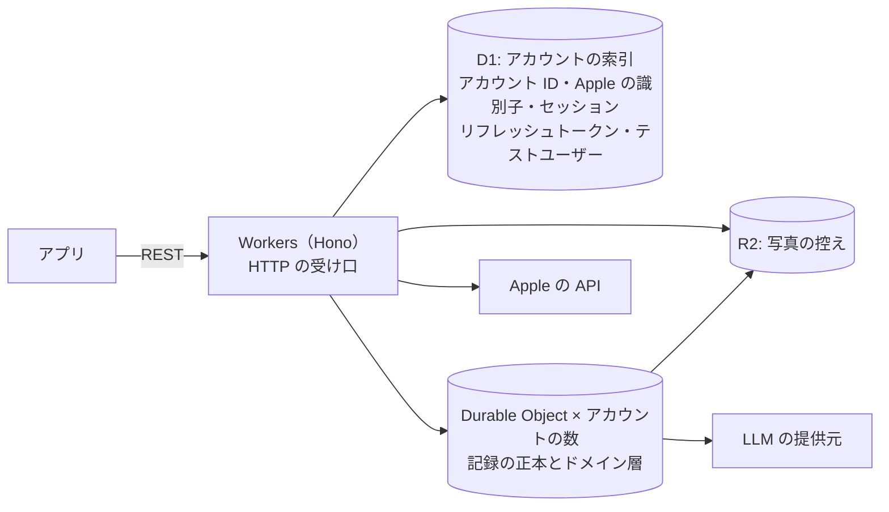

# server

nu-tori のサーバー。TypeScript で書き、Cloudflare で動かす。決めた経緯は ADR-0011・0012 にある。

## 構成

- DB を東京に置くことは必須にせず、データを国内に置くとは約束しない。場所はヒント（D1 と R2 は `apac`、Durable Objects は `apac-ne`）で指定する
- Workers で動かないライブラリが要る処理が出たら、その部分だけ別の基盤に置く
- 構成の正本は `wrangler.jsonc`。環境（本番と開発用）もここに書く
- 秘密の値は `wrangler secret` に置く。GitHub Actions の分は、ルートの `AGENTS.md` の「リポジトリ全体の決定」
- Terraform は、wrangler で扱えないもの（DNS など）が要るまで使わない

## 層

- ドメイン層は、実行基盤の型や API に触れない。ドメイン層が要る置き場と外への呼び出し（記録の置き場、写真の控え、LLM の提供元など）は、ドメイン層が型を定め、基盤に固有の層（Durable Object、D1・R2・LLM の提供元・Apple の API への入出力）がそれを実装する
- 1人の記録を読み書きするドメインの処理は、その人の Durable Object の中で動かす。Durable Object のクラスは、ドメイン層を呼ぶ入口（受け口の Worker から、アラームから）と、ドメイン層が定めた記録の置き場の実装と、ほかの基盤に固有の実装をドメイン層に渡すことだけを持つ薄い層にする
- HTTP の受け口は、記録を読み書きする要求なら、セッションを確かめてその人の Durable Object を呼ぶだけにする。まだセッションのないサインインと、アカウントの削除（Apple のトークンの取り消し、D1・Durable Object・R2 の控えを消す）は、受け口の Worker でドメイン層を呼ぶ。Durable Object の中身を消すときも、その Durable Object の入口を呼んで行う
- 受け口のスキーマは要求の形だけを確かめる。受け付ける値の範囲はドメイン層で確かめる

**Why:** ドメイン層を基盤から切り離しておくと、基盤を移るとき（下の「出口」）に書き直すのが基盤に固有の層だけで済む。

## API

- REST＋OpenAPI。経路を `@hono/zod-openapi` のスキーマつきで書き、書き出した OpenAPI の文書をリポジトリに置く。型の正本は経路のスキーマで、CI で書き出した文書が最新かを確かめる。文書を使う側は `ios/AGENTS.md` の「API」
- 出回っている最も古い版のアプリとも動くようにする。API の変更は足すだけにし、壊す変更は新しい版のエンドポイントとして出す

## DB

- スキーマは素の SQLite で書く
- D1 のスキーマの変更は、Wrangler の D1 の移行（SQL ファイル）で行う
- Durable Object の中のスキーマの変更は、版つきの SQL ファイルをこのディレクトリに置き、各 Durable Object が起動するたびに、まだ当てていない版を自分の DB に当てる
- 1日の目安の週ごとの見直しは、各 Durable Object のアラームで、その人のタイムゾーンでの1日の目安の適用期間の区切りに合わせて行う
- 記録に対しては、全員をまたぐ SQL は書けない。全員をまたぐ分析は、記録を書くときに分析用の出来事を別の置き場に書き出して行う（置き場と中身は「初回出荷時に観測できるもの」で決める）

## 出口

Cloudflare から抜けるときは、アカウントごとの SQLite を Turso の東京に移す。移るのは、「データを日本国内に置く約束が要る」か「全員をまたぐ分析が、分析用の出来事の置き場では足りない」が本当に来たとき。

## テスト

- テストは `@cloudflare/vitest-pool-workers` で、Workers の実行環境の中で回す
