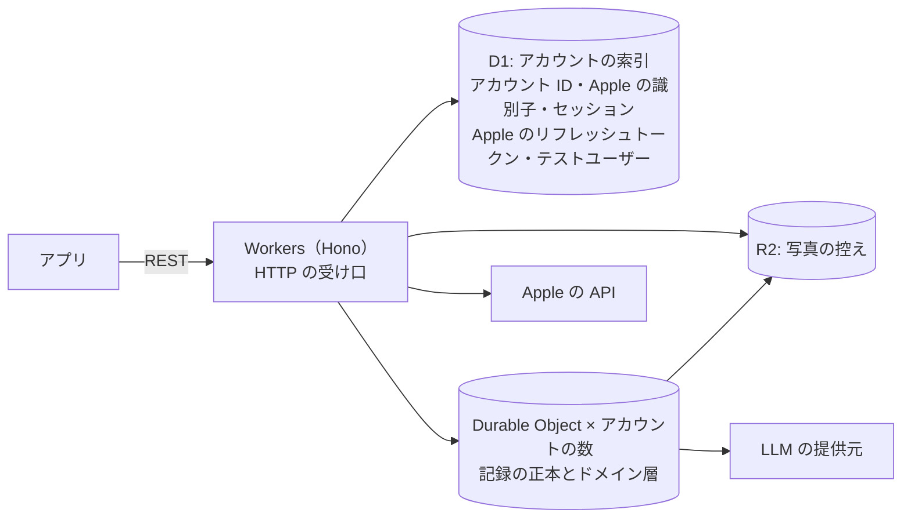
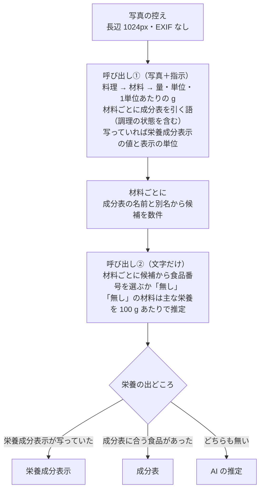

# server

nu-tori のサーバー。TypeScript で書き、Cloudflare で動かす。決めた経緯は ADR-0011・0012・0015 にある。

## 構成

- DB を東京に置くことは必須にせず、データを国内に置くとは約束しない。場所はヒント（D1 と R2 は `apac`、Durable Objects は `apac-ne`）で指定する
- Workers で動かないライブラリが要る処理が出たら、その部分だけ別の基盤に置く
- 構成の正本は `wrangler.jsonc`。環境（本番と開発用）もここに書く
- 秘密の値は `wrangler secret` に置く。GitHub Actions の分は、ルートの `AGENTS.md` の「リポジトリ全体の決定」
- Terraform は、wrangler で扱えないもの（DNS など）が要るまで使わない

## 層

- ドメイン層は、実行基盤の型や API に触れない。ドメイン層が要る置き場と外への呼び出し（記録の置き場、写真の控え、LLM の提供元など）は、ドメイン層が型を定め、基盤に固有の層（Durable Object、D1・R2・LLM の提供元・Apple の API への入出力）がそれを実装する
- 1人の記録を読み書きするドメインの処理は、その人の Durable Object の中で動かす。Durable Object のクラスは、ドメイン層を呼ぶ入口（受け口の Worker から、アラームから。アラームは推定を裏で進めるのに使う）と、ドメイン層が定めた記録の置き場の実装と、ほかの基盤に固有の実装をドメイン層に渡すことだけを持つ薄い層にする
- HTTP の受け口は、記録を読み書きする要求なら、セッションを確かめてその人の Durable Object を呼ぶだけにする。まだセッションのないサインインと、アカウントの削除（Apple のトークンの取り消し、D1・Durable Object・R2 の控えを消す）は、受け口の Worker でドメイン層を呼ぶ。Durable Object の中身を消すときも、その Durable Object の入口を呼んで行う
- 受け口のスキーマは要求の形だけを確かめる。受け付ける値の範囲はドメイン層で確かめる

**Why:** ドメイン層を基盤から切り離しておくと、基盤を移るとき（下の「出口」）に書き直すのが基盤に固有の層だけで済む。

## API

- REST＋OpenAPI。経路を `@hono/zod-openapi` のスキーマつきで書き、書き出した OpenAPI の文書をリポジトリに置く。型の正本は経路のスキーマで、CI で書き出した文書が最新かを確かめる。文書を使う側は `ios/AGENTS.md` の「API」
- 出回っている最も古い版のアプリとも動くようにする。API の変更は足すだけにし、壊す変更は新しい版のエンドポイントとして出す

## DB

- スキーマは素の SQLite で書く
- D1 のスキーマの変更は、Wrangler の D1 の移行（SQL ファイル）で行う
- Durable Object の中のスキーマの変更は、版つきの SQL ファイルをこのディレクトリに置き、各 Durable Object が起動するたびに、まだ当てていない版を自分の DB に当てる
- 1日の目安の週ごとの見直しは、各 Durable Object のアラームで、その人のタイムゾーンでの1日の目安の適用期間の区切りに合わせて行う
- Durable Object のアラームは一度に1つしか張れない。アラームで動かすもの（推定など）は、予定を DB に持ち、いちばん早い予定にアラームを合わせる
- 記録に対しては、全員をまたぐ SQL は書けない。全員をまたぐ分析は、記録を書くときに分析用の出来事を別の置き場に書き出して行う（置き場と中身は「初回出荷時に観測できるもの」で決める）

## ヘルスケアから来たもの

端末がヘルスケアから読んで送るもの（`ios/AGENTS.md` の「ヘルスケア」）の扱い。

- 他のアプリの体重と体脂肪率は、出どころ（ヘルスケアに書いたアプリ）とヘルスケアのサンプルの UUID を持つ体重記録にする。同じ UUID は二重に入れない
- 元のサンプルが消えたと送られたら、nu-tori で直していない体重記録だけを消す。直した体重記録は nu-tori の記録として残す
- 使い始める前の体重記録も推定消費量に使う。使い始める前の体重記録と摂取エネルギーが推定に足りなければ、歩数か3択の活動量で見積もる
- 使い始めてからの推定に使う食べた量は、nu-tori の記録だけ
- 身体データと使い始める前の摂取エネルギーは、目標と推定消費量の計算に使ったら捨て、DB にもログにも残さない

## 写真と文章からの推定

- LLM は Claude Sonnet 5 を使い、思考（reasoning）は明示して切る。その人の Durable Object のドメイン層から、LLM の提供元の実装を呼ぶ。中継だけの Worker は分けない。推定の結果（料理と材料）だけを保存し、提供元の応答は残さない
- 材料は、名前、量と単位、1単位あたりの g、成分表の食品番号（成分表から引いたとき）、栄養の出どころ（栄養成分表示・成分表・AI の推定）、栄養の値を持つ。栄養の値は、出どころの単位あたり（成分表と AI の推定は 100 g あたり、栄養成分表示は表示の単位あたり）で材料に持たせて端末に届ける。材料の量を掛けて栄養を出すのは、端末とサーバーの両方
- 材料が持つ栄養は、成分表にあってヘルスケアに型のあるものすべてと、食塩相当量。AI の推定で出すのは主な栄養（エネルギー・たんぱく質・脂質・炭水化物・食物繊維・食塩相当量）だけにする。値の分からない栄養は「不明」にし、0 と区別する。AI の推定の主な栄養以外、栄養成分表示に書かれていない栄養、成分表の未測定（「-」）が「不明」になる
- 成分表（日本食品標準成分表（八訂）増補2023年の本表）は、本表の Excel からスクリプトで作ったデータファイルにして出典を添えてリポジトリに置き、サーバーに同梱する。候補はドメイン層がメモリの中で探す。端末は成分表を持たない
- 量が 0 より大きいかといった値の妥当性は、ドメイン層で確かめる。Claude の構造化出力は、数値の `minimum`／`maximum` を使えない
- 料理の名前を直したときと、料理を足したときは、写真の控えと名前で①②を行う。文章の食事は写真が無いので、名前だけを渡す。料理の量は、ユーザーが直していなければ（量の出どころが推定のまま）推定し直し、直していれば固定して材料への割り振りだけを推定する
- LLM が「料理が写っていない」「見分けられない」と返したら、料理 0 件にする
- 食事を受け取った時点で保存して応答する。推定は、その人の Durable Object のアラームで裏で進め、結果を料理・材料として保存する。推定を待つ食事は、予定として DB に持つ（アラームの張り方は「DB」）。提供元のエラーや時間切れは、アラームのやり直しで自動でやり直す
- 推定の回数に、アカウントごとの1日の上限をかける。目安は 30 回で、数値と数え方と守り方は「不正利用防止の具体」で決める。数えるのは、写真・文章・名前を直したとき・料理を足したとき。「日」は `CONTEXT.md` の「日」で数える。超えた写真の食事は料理 0 件のまま保存し、翌日に同じアラームで推定する。その回数は翌日の分として数える
- アカウントごとの金額の上限は設けない。提供元の側では、環境ごとに Anthropic のワークスペースと API キーを分け、ワークスペースに月の支出の上限をかける（本番 $100、開発用 $10 から）。AI の発言も同じワークスペースで呼ぶ。AI の発言の回数は、推定の回数とは別に数える（数値と数え方は「不正利用防止の具体」で決める）
- 一段で栄養まで返す経路を、評価用に持つ。アプリからは呼ばない

**Why:** LLM に栄養の数値まで出させると、根拠を辿れず、同じ写真でも値がばらつく。成分表を引く工程を分けると、材料ごとに食品番号と出どころを持てて、当て方をあとから直せる。写真を送るのは1回だけにし、2回目は文字だけにして、費用と待ち時間を抑える。

## 出口

Cloudflare から抜けるときは、アカウントごとの SQLite を Turso の東京に移す。移るのは、「データを日本国内に置く約束が要る」か「全員をまたぐ分析が、分析用の出来事の置き場では足りない」が本当に来たとき。

## テスト

- テストは `@cloudflare/vitest-pool-workers` で、Workers の実行環境の中で回す
