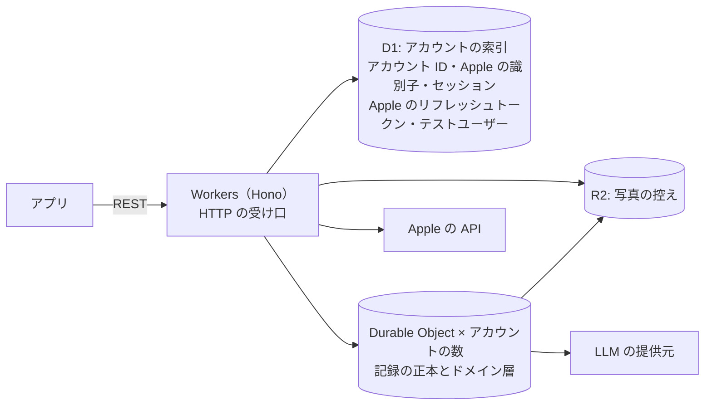
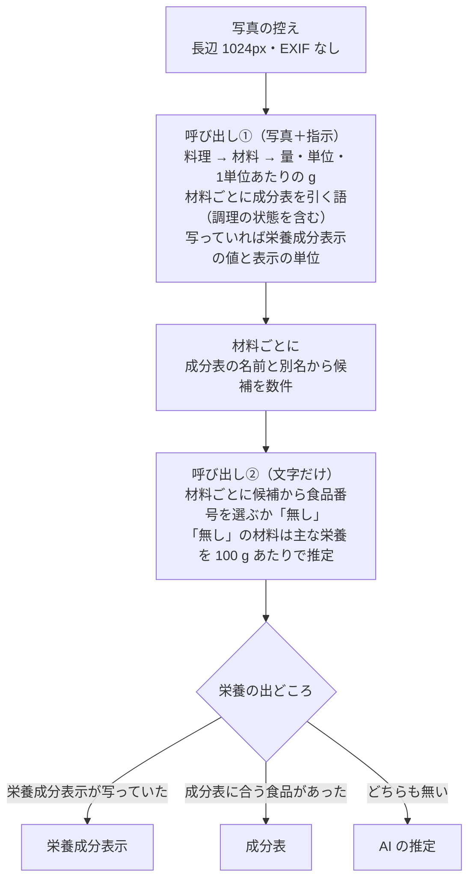

# server

nu-tori のサーバー。TypeScript で書き、Cloudflare で動かす。決めた経緯は ADR-0011・0012・0015 にある。

## 構成

- DB を東京に置くことは必須にせず、データを国内に置くとは約束しない。場所はヒント（D1 と R2 は `apac`、Durable Objects は `apac-ne`）で指定する
- Workers で動かないライブラリが要る処理が出たら、その部分だけ別の基盤に置く
- 構成の正本は `wrangler.jsonc`。環境（本番と開発用）もここに書く
- 秘密の値は `wrangler secret` に置く。GitHub Actions の分は、ルートの `AGENTS.md` の「リポジトリ全体の決定」
- Terraform は、wrangler で扱えないもの（DNS など）が要るまで使わない

## 層

- ドメイン層は、実行基盤の型や API に触れない。ドメイン層が要る置き場と外への呼び出し（記録の置き場、写真の控え、LLM の提供元など）は、ドメイン層が型を定め、基盤に固有の層（Durable Object、D1・R2・LLM の提供元・Apple の API への入出力）がそれを実装する
- 1人の記録を読み書きするドメインの処理は、その人の Durable Object の中で動かす。Durable Object のクラスは、ドメイン層を呼ぶ入口（受け口の Worker から、アラームから。アラームは推定を裏で進めるのに使う）と、ドメイン層が定めた記録の置き場の実装と、ほかの基盤に固有の実装をドメイン層に渡すことだけを持つ薄い層にする
- HTTP の受け口は、記録を読み書きする要求なら、セッションを確かめてその人の Durable Object を呼ぶだけにする。まだセッションのないサインインと、アカウントの削除（Apple のトークンの取り消し、D1・Durable Object・R2 の控えを消す）は、受け口の Worker でドメイン層を呼ぶ。Durable Object の中身を消すときも、その Durable Object の入口を呼んで行う
- 受け口のスキーマは要求の形だけを確かめる。受け付ける値の範囲はドメイン層で確かめる

**Why:** ドメイン層を基盤から切り離しておくと、基盤を移るとき（下の「出口」）に書き直すのが基盤に固有の層だけで済む。

## API

- REST＋OpenAPI。経路を `@hono/zod-openapi` のスキーマつきで書き、書き出した OpenAPI の文書をリポジトリに置く。型の正本は経路のスキーマで、CI で書き出した文書が最新かを確かめる。文書を使う側は `ios/AGENTS.md` の「API」
- 出回っている最も古い版のアプリとも動くようにする。API の変更は足すだけにし、壊す変更は新しい版のエンドポイントとして出す

## DB

- スキーマは素の SQLite で書く
- D1 のスキーマの変更は、Wrangler の D1 の移行（SQL ファイル）で行う
- Durable Object の中のスキーマの変更は、版つきの SQL ファイルをこのディレクトリに置き、各 Durable Object が起動するたびに、まだ当てていない版を自分の DB に当てる
- Durable Object のアラームは一度に1つしか張れない。アラームで動かすもの（推定など）は、予定を DB に持ち、いちばん早い予定にアラームを合わせる
- 記録に対しては、全員をまたぐ SQL は書けない。全員をまたぐ分析は、記録を書くときに分析用の出来事を別の置き場に書き出して行う（置き場と中身は「初回出荷時に観測できるもの」で決める）

## 同期

端末とサーバーのやりとりの約束。端末がいつ送り、いつ取りに行くかは `ios/AGENTS.md` の「同期」。

- ID は UUID。端末で作るものは端末が振る（振り方は `ios/AGENTS.md`）。サーバーが作るもの（推定が足す料理と材料、AI の発言、サーバーで出す知らせ）は v4 で振る
- 書き込みは、送り待ちをまとめた要求で受け、要求の中の順に当てる。送り待ちの最後の要求には、送り切った印が付く（週ごとの見直しの時機に使う。「推定消費量と1日の目安」の見直す時点）
- 書き込みは冪等にする。書き込みごとの ID で重複を除き、同じ書き込みが何度届いても結果を変えない
- 作る書き込みは、同じ ID のものがすでにあれば捨てる（端末で決まった ID を振るものを、2台がそれぞれ作っても1つにするため）。削除の印が残っている ID への作る書き込みも捨てる（削除を採る）。あとに受け取ったほうを採る規則は、直す書き込みに使う
- 競合を判断する単位は、食事、料理、材料、体重記録、目標、知らせのそれぞれ1つ。競合したら、あとに受け取ったほうを採る（端末の時計には頼らない）。片方で消し、もう片方で直したときは、削除を採る。この規則はユーザーの操作どうしの競合に使う。ヘルスケアの元のサンプルが消えたときの扱いは、「ヘルスケアから来たもの」で決める
- 受け付ける値の範囲を外れた書き込みは、「受け付けない」と返す
- アカウントごとに変更の通し番号を振り、前回の続きからの変更を返す。消したものは削除の印を残して返す。サーバーが書いたもの（推定の結果と推定の状態、読み分けの結果、AI の発言、サーバーで出す知らせ、いつもの時刻、1日の目安、推定消費量、体重の傾向、週ごとに残すもの）も同じ通し番号で返す
- 時刻は、端末が決めて送った値を使い、サーバーが受け取った時刻で置き換えない。書いて送った文章は、端末で送る操作をした時刻にする（電波が戻って届けた時刻ではない）。時刻を持つもの（体重記録、食事、発言、知らせ）は、記録したときのタイムゾーンを持つ。ユーザーのタイムゾーンは、端末から届いた最新のものにする（日と週の区切りは「端末とサーバーの両方に置く決めごと」）
- 写真の縮小版（ADR-0008）のファイルを、食事とは別の要求で受ける。食事と写真の両方がそろったら、「写真と文章からの推定」の推定を待つ予定に入れる
- 食事は推定の状態を持つ: 推定中（やり直しと、料理を足したとき・料理の名前を直したときの推定を含む）、推定できた、料理なし（写っていない、見分けられない）、翌日に推定（回数切れ）、推定できなかった（やり直しても通らず諦めた）
- 推定が書き換えるのは、ユーザーがまだ直していない値だけ。ユーザーが直した値は上書きしない（足した料理の量を推定の前に直したときも）
- 知らせは、答えた形と「あとで」を含めて、記録と同じく同期する
- いつもの時刻は、アカウントに1つのシステム内部の記録（体重の時刻と食事どきの一覧）として持ち、学び直して値が変わったときだけ書き換える

## ヘルスケアから来たもの

端末がヘルスケアから読んで送るもの（`ios/AGENTS.md` の「ヘルスケア」）の扱い。

- 他のアプリの体重と体脂肪率は、出どころ（ヘルスケアに書いたアプリ）とヘルスケアのサンプルの UUID を持つ体重記録にする。同じ UUID は二重に入れない（消したあとも。「同期」の作る書き込み）
- 元のサンプルが消えたと送られたら、nu-tori で直していない体重記録だけを消す。直した体重記録は nu-tori の記録として残す
- 使い始める前の体重記録は、体重の傾向と推定消費量の初期値に使う。使い始める前の摂取エネルギーは、初期値にだけ使う（足りる条件と、足りないときの見積もりは「推定消費量と1日の目安」）
- 身体データと使い始める前の摂取エネルギーは、目標と推定消費量の計算に使ったら捨て、DB にもログにも残さない

## 端末とサーバーの両方に置く決めごと

端末も同じ手順で計算するドメイン知識。管理の仕方（係数をデータにして1か所に置く、食い違ったらサーバーを正とする）はルートの `AGENTS.md` の「リポジトリ全体の決定」。

- 料理と食事の kcal は、材料の栄養の kcal を足したもの。P×4 + F×9 + C×4 で出し直さない。端末とサーバーで同じ値を使う（ADR-0016）
- 料理・食事・日の栄養の合計は、値の分かる材料の分だけを足し、「不明」の材料が混じれば、一部の材料は不明であることを添える。すべての材料が「不明」の栄養だけ、合計も「不明」にする
- 日と週の区切り: 時刻を持つもの（体重記録、食事、発言、知らせ）は、記録したときのタイムゾーンでの日付の日に入れ、あとで別の土地に移っても動かさない（0時で区切る。ADR-0006）。週は、そうして決めた日を7日並べたもの（1日の目安の適用期間も、1日の丸の帯の週も）。いまの端末のタイムゾーンで決めるのは、どの日が今日で、どの週が今週かだけ。旅先で記録した日などが、ヘルスケアの1日の合計とずれることは受け入れる

## 推定消費量と1日の目安

決めた経緯は「推定消費量と1日の目安の計算法」（Issue #31）の解決コメントにある。係数はどれも、出荷後にここで調整する初期値。使い始める前の記録と、端末から送られる身体データ・摂取エネルギーの扱いは「ヘルスケアから来たもの」。

- **体重の傾向**: 日の代表値はその日の最初の体重記録。欠けた日は前後の日の代表値から線形に埋め（最後の体重記録より後は、最後の日の代表値のまま）、指数移動平均（新しい値の重み 0.1）でならす。始まりは、使い始める前も含めた最初の体重記録の日
- **ρ**: 体重 1kg を 7,700 kcal とみなす。体脂肪率があっても変えない。推定消費量と、目標に向けた不足・余剰の両方に使う
- **推定消費量の始まり**: 初めて目標を立てたときに始め、以後は途切れない。目標を切り替えるときは今の推定消費量を使う
  - 今日を除く直前の 28 日（初期値の窓）に、食べた量のある日（部分的な記録の日を除く。「見送り」と同じ決まり。使い始める前の日は端末が送る摂取エネルギー、使い始めてからの日は nu-tori の記録）が 14 日以上、かつ体重記録のある日が4日以上で最初と最後の日の差が 14 日以上なら、「食べた量の平均 − ρ × 日の代表値への直線の傾き」を初期値にする
  - 足りなければ Mifflin-St Jeor（男 10W + 6.25H − 5A + 5、女 同 − 161。W は目標を立てるときの今の体重）× 活動係数。活動係数は、3択（ほぼ座り仕事／立ち仕事が多い／よく動く）なら 1.4／1.55／1.7、歩数（今日を除く直前の 28 日の1日平均。0 歩の日を除く）なら 5,000 未満 1.4、5,000〜9,999 1.55、10,000 以上 1.7。目標の向きで補正しない
  - 初めて目標を立てるときは、いつも逆算できるかを端末に返す。返すのは、使い始める前の体重記録と摂取エネルギーを端末から受けてから。逆算できれば身体データ（活動量を含む）は使わない
- **見直し**: 直前の月〜日（目標を立てた週も、立てた日より前を含めた月〜日）について、前の推定消費量とその週に食べた量の平均から体重の傾向の変化を予測し、実際の変化とのずれで直す
  - 予測した変化（kg）=（その週に食べた量の平均 − 前の推定消費量）× 7 ÷ ρ
  - 実際の変化（kg）= 直前の日曜の体重の傾向 − その前の日曜の体重の傾向（7日分）。その前の日曜に体重の傾向がまだ無ければ、その週の月曜の値を使う。月曜にも無ければ見送る（理由は「体重が無い」）
  - ずれ（kg）= 予測した変化 − 実際の変化。推定消費量 += k × ρ × ずれ ÷ 7
  - k = 0.25 × 食事を記録した日数/7 ×（1 + 続いた週の数）、上限 0.75。続いた週の数は、ずれが前に見直した週のずれと同じ向きなら1つ増やし、向きが変わったら 0 に戻す（最初の見直しは 0。見送った週は数を変えない）
  - 食べた量は nu-tori の記録だけを使う
- **見送り**: 直前の月〜日に、食事を記録した日が4日未満、体重記録のある日が0日、または週の区切りの月曜の時点で使い始めて7日未満（使い始める前の記録から初期値を出した人を除く）なら見送り、推定消費量も1日の目安も前の週のままにする。判定する日より前の 28 日の、食事を記録したすべての日の食べた量の中央値の半分に満たない日（部分的な記録の日）は、食事を記録した日に数えず、平均からも外す。判定する日より前の 28 日に食事を記録した日が7日未満なら、外さない
- **1日の目安のカロリー**: 次の順で出す
  1. 減量・増量: 推定消費量 + ρ × 必要な速さ。必要な速さ =（目標体重 − 体重の傾向）÷ 新しい1日の目安を当てる最初の日から期限までの日数（7日未満なら7日とする）。最初の日は、見直しでは週の区切りの月曜、目標を立てた・切り替えたときはその日。体重の傾向は、見直しでは直前の日曜の値、目標を立てた・切り替えたときはその日の値。必要な速さの上限は、目標案のハード案の速さと揃える（「目標案・大変さ・ペース・達成の判定の計算法」で決める）。決まるまでは体重の傾向の 1%/週。維持（維持の目標と、期限後に今の体重を保つ目標）: 体重の傾向が目標体重の ±0.7kg 以内なら推定消費量。外れたら、体重の傾向の 0.15%/週の速さで目標体重へ戻す分を足し引きする
  2. 見直しでは、前の週からの変化を ±150 kcal までに抑える。目標を立てたとき・切り替えたときは抑えない。期限後の維持に移る時点と、そのとき抑えるかは「目標案・大変さ・ペース・達成の判定の計算法」で決める
  3. 下限 1,200 kcal を当てる
  4. 50 kcal 単位で丸める
- **P・F・C の目安**: P = 1.6 g × 目標体重。ただし P の kcal（P×4）は1日の目安の 35% までにする。F = 1日の目安の 25% ÷ 9。C = 5g 単位に丸めた P・F の kcal を1日の目安から引いた残り ÷ 4。どれも 5g 単位で丸める
- **週ごとに残すもの**: 見直した週も見送った週も、新しい1日の目安を当てる週の始まりの日（月曜）、推定消費量、1日の目安（kcal と P・F・C）、見送ったかとその理由（食事の記録が少ない／体重が無い／使い始めて7日未満）、当たった上限と下限（±150 kcal、必要な速さの上限、下限 1,200 kcal のそれぞれ）、主な理由を残す。目標を立てた・切り替えたときも同じ並びで残し、推定消費量の出どころ（逆算か式か、切り替えなら前の値）を添える。主な理由は、1日の目安の変化を「推定消費量の変化」と「不足・余剰の変化」に分け、大きいほう。週の振り返りと目標の画面の「消費量と1日の目安」はこれを読む
- **見直す時点**: 週の区切り（月曜 0:00。どの時刻で数えるかは「端末とサーバーの両方に置く決めごと」の日と週の区切り）を過ぎて、その人の端末から、送り待ちを送り切った印のある要求か、取りに行く要求が届いたとき（端末は送り切ってから取りに行く。「同期」）、その人の Durable Object が、送られた記録を当てたあと、要求に応える前に、まだ見直していない週（見送る週も含む）を古い順に見直す。アラームは使わない。見直した週の値は確定し、あとで過去の記録が直されても計算し直さない

## 写真と文章からの推定

- LLM は Claude Sonnet 5 を使い、思考（reasoning）は明示して切る。その人の Durable Object のドメイン層から、LLM の提供元の実装を呼ぶ。中継だけの Worker は分けない。推定の結果（料理と材料）だけを保存し、提供元の応答は残さない
- 材料は、名前、量と単位、1単位あたりの g、成分表の食品番号（成分表から引いたとき）、栄養の出どころ（栄養成分表示・成分表・AI の推定）、栄養の値を持つ。栄養の値は、出どころの単位あたり（成分表と AI の推定は 100 g あたり、栄養成分表示は表示の単位あたり）で材料に持たせて端末に届ける。材料の量を掛けて栄養を出すのは、端末とサーバーの両方
- 材料が持つ栄養は、成分表にあってヘルスケアに型のあるものすべてと、食塩相当量。AI の推定で出すのは主な栄養（エネルギー・たんぱく質・脂質・炭水化物・食物繊維・食塩相当量）だけにする。値の分からない栄養は「不明」にし、0 と区別する。AI の推定の主な栄養以外、栄養成分表示に書かれていない栄養、成分表の未測定（「-」）が「不明」になる
- 成分表（日本食品標準成分表（八訂）増補2023年の本表）は、本表の Excel からスクリプトで作ったデータファイルにして出典を添えてリポジトリに置き、サーバーに同梱する。候補はドメイン層がメモリの中で探す。端末は成分表を持たない
- 量が 0 より大きいかといった値の妥当性は、ドメイン層で確かめる。Claude の構造化出力は、数値の `minimum`／`maximum` を使えない
- 料理の名前を直したときと、料理を足したときは、写真の控えと名前で①②を行う。文章の食事は写真が無いので、名前だけを渡す。料理の量は、ユーザーが直していなければ（量の出どころが推定のまま）推定し直し、直していれば固定して材料への割り振りだけを推定する
- LLM が「料理が写っていない」「見分けられない」と返したら、料理 0 件にする
- 食事を受け取った時点で保存して応答する。推定は、その人の Durable Object のアラームで裏で進め、結果を料理・材料として保存する。推定を待つ食事は、予定として DB に持つ（アラームの張り方は「DB」）。提供元のエラーや時間切れは、アラームのやり直しで自動でやり直す
- 推定の回数に、アカウントごとの1日の上限をかける。目安は 30 回で、数値と数え方と守り方は「不正利用防止の具体」で決める。数えるのは、写真・文章・名前を直したとき・料理を足したとき。「日」は `CONTEXT.md` の「日」で数える。超えた写真の食事は料理 0 件のまま保存し、翌日に同じアラームで推定する。その回数は翌日の分として数える
- アカウントごとの金額の上限は設けない。提供元の側では、環境ごとに Anthropic のワークスペースと API キーを分け、ワークスペースに月の支出の上限をかける（本番 $100、開発用 $10 から）。AI の発言も同じワークスペースで呼ぶ。AI の発言の回数は、推定の回数とは別に数える（数値と数え方は「不正利用防止の具体」で決める）
- 一段で栄養まで返す経路を、評価用に持つ。アプリからは呼ばない

**Why:** LLM に栄養の数値まで出させると、根拠を辿れず、同じ写真でも値がばらつく。成分表を引く工程を分けると、材料ごとに食品番号と出どころを持てて、当て方をあとから直せる。写真を送るのは1回だけにし、2回目は文字だけにして、費用と待ち時間を抑える。

## 出口

Cloudflare から抜けるときは、アカウントごとの SQLite を Turso の東京に移す。移るのは、「データを日本国内に置く約束が要る」か「全員をまたぐ分析が、分析用の出来事の置き場では足りない」が本当に来たとき。

## テスト

- テストは `@cloudflare/vitest-pool-workers` で、Workers の実行環境の中で回す
